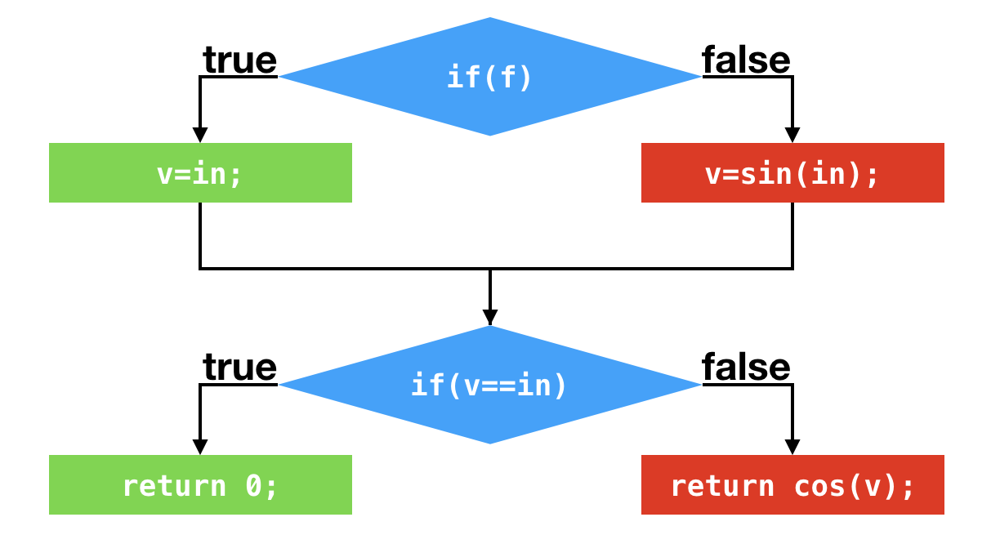
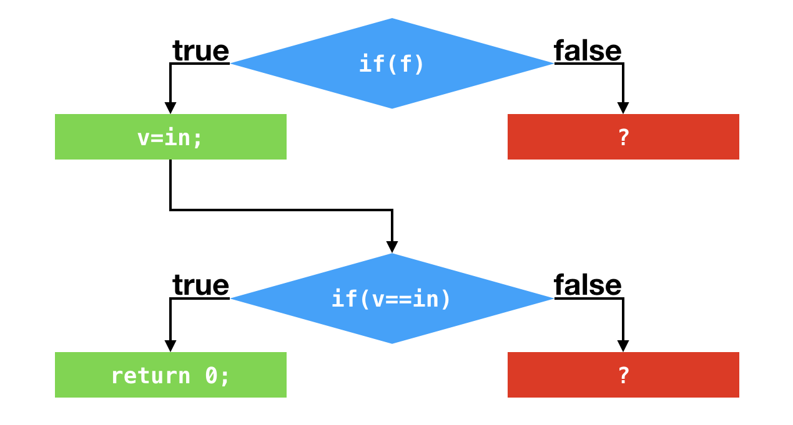
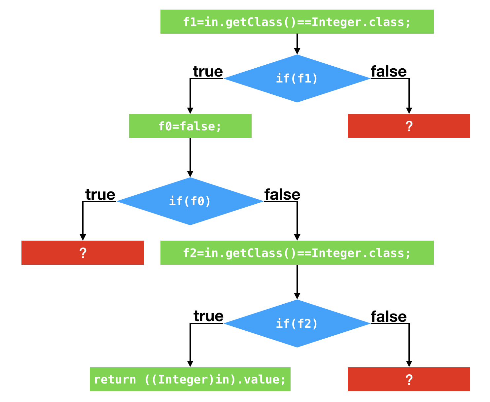
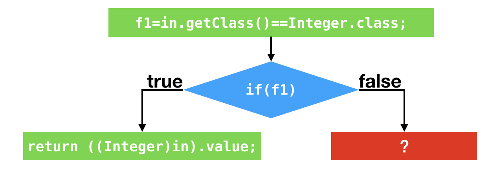

# 17 即时编译（下）

今天我们来继续讲解 Java 虚拟机中的即时编译。

## Profiling

上篇提到，分层编译中的 0 层、2 层和 3 层都会进行 profiling，收集能够反映程序执行状态的数据。其中，最为基础的便是方法的调用次数以及循环回边的执行次数。它们被用于触发即时编译。

此外，0 层和 3 层还会收集用于 4 层 C2 编译的数据，比如说分支跳转字节码的分支 profile（branch profile），包括跳转次数和不跳转次数，以及非私有实例方法调用指令、强制类型转换 checkcast 指令、类型测试 instanceof 指令，和引用类型的数组存储 aastore 指令的类型 profile（receiver type profile）。

分支 profile 和类型 profile 的收集将给应用程序带来不少的性能开销。据统计，正是因为这部分额外的 profiling，使得 3 层 C1 代码的性能比 2 层 C1 代码的低 30%。

在通常情况下，我们不会在解释执行过程中收集分支 profile 以及类型 profile。只有在方法触发 C1 编译后，Java 虚拟机认为该方法有可能被 C2 编译，方才在该方法的 C1 代码中收集这些 profile。

只要在比较极端的情况下，例如等待 C1 编译的方法数目太多时，Java 虚拟机才会开始在解释执行过程中收集这些 profile。

那么这些耗费巨大代价收集而来的 profile 具体有什么作用呢？

答案是，C2 可以根据收集得到的数据进行猜测，假设接下来的执行同样会按照所收集的 profile 进行，从而作出比较激进的优化。

## 基于分支 profile 的优化

举个例子，下面这段代码中包含两个条件判断。第一个条件判断将测试所输入的 boolean 值。

如果为 true，则将局部变量 v 设置为所输入的 int 值。如果为 false，则将所输入的 int 值经过一番运算之后，再存入局部变量 v 之中。

第二个条件判断则测试局部变量 v 是否和所输入的 int 值相等。如果相等，则返回 0。如果不等，则将局部变量 v 经过一番运算之后，再将之返回。显然，当所输入的 boolean 值为 true 的情况下，这段代码将返回 0。

```
public static int foo(boolean f, int in) {

  int v;

  if (f) {

    v = in;

  } else {

    v = (int) Math.sin(in);

  }

 

  if (v == in) {

    return 0;

  } else {

    return (int) Math.cos(v);

  }

}

// 编译而成的字节码：

public static int foo(boolean, int);

  Code:

     0: iload_0

     1: ifeq          9

     4: iload_1

     5: istore_2

     6: goto          16

     9: iload_1

    10: i2d

    11: invokestatic  java/lang/Math.sin:(D)D

    14: d2i

    15: istore_2

    16: iload_2

    17: iload_1

    18: if_icmpne     23

    21: iconst_0

    22: ireturn

    23: iload_2

    24: i2d

    25: invokestatic java/lang/Math.cos:(D)D

    28: d2i

    29: ireturn

```



假设应用程序调用该方法时，所传入的 boolean 值皆为 true。那么，偏移量为 1 以及偏移量为 18 的条件跳转指令所对应的分支 profile 中，跳转的次数都为 0。



C2 可以根据这两个分支 profile 作出假设，在接下来的执行过程中，这两个条件跳转指令仍旧不会发生跳转。基于这个假设，C2 便不再编译这两个条件跳转语句所对应的 false 分支了。

我们暂且不管当假设错误的时候会发生什么，先来看一看剩下来的代码。经过“剪枝”之后，在第二个条件跳转处，v 的值只有可能为所输入的 int 值。因此，该条件跳转可以进一步被优化掉。最终的结果是，在第一个条件跳转之后，C2 代码将直接返回 0。


这里我打印了 C2 的编译结果。可以看到，在地址为 2cee 的指令处进行过一次比较之后，该机器码便直接返回 0。

```
Compiled method (c2)      95   16       4       CompilationTest::foo (30 bytes)

...

CompilationTest.foo  [0x0000000104fb2ce0, 0x0000000104fb2d38]  88 bytes

[Entry Point]

[Verified Entry Point]

[Constants]

  # {method} {0x000000012629e380} 'foo' '(ZI)I' in 'CompilationTest'

  # parm0:    rsi       = boolean

  # parm1:    rdx       = int

  #           [sp+0x30]  (sp of caller)

  0x0000000104fb2ce0: mov    DWORD PTR [rsp-0x14000],eax

  0x0000000104fb2ce7: push   rbp

  0x0000000104fb2ce8: sub    rsp,0x20

  0x0000000104fb2cec: test   esi,esi

  0x0000000104fb2cee: je     0x0000000104fb2cfe // 跳转至?

  0x0000000104fb2cf0: xor    eax,eax            // 将返回值设置为 0

  0x0000000104fb2cf2: add    rsp,0x20

  0x0000000104fb2cf6: pop    rbp

  0x0000000104fb2cf7: test   DWORD PTR [rip+0xfffffffffca32303],eax // safepoint

  0x0000000104fb2cfd: ret    

  ...

```

总结一下，根据条件跳转指令的分支 profile，即时编译器可以将从未执行过的分支剪掉，以避免编译这些很有可能不会用到的代码，从而节省编译时间以及部署代码所要消耗的内存空间。此外，“剪枝”将精简程序的数据流，从而触发更多的优化。

在现实中，分支 profile 出现仅跳转或者仅不跳转的情况并不多见。当然，即时编译器对分支 profile 的利用也不仅限于“剪枝”。它还会根据分支 profile，计算每一条程序执行路径的概率，以便某些编译器优化优先处理概率较高的路径。

## 基于类型 profile 的优化

另外一个例子则是关于 instanceof 以及方法调用的类型 profile。下面这段代码将测试所传入的对象是否为 Exception 的实例，如果是，则返回它的系统哈希值；如果不是，则返回它的哈希值。

```
public static int hash(Object in) {

  if (in instanceof Exception) {

    return System.identityHashCode(in);

  } else {

    return in.hashCode();

  }

}

// 编译而成的字节码：

public static int hash(java.lang.Object);

  Code:

     0: aload_0

     1: instanceof java/lang/Exception

     4: ifeq          12

     7: aload_0

     8: invokestatic java/lang/System.identityHashCode:(Ljava/lang/Object;)I

    11: ireturn

    12: aload_0

    13: invokevirtual java/lang/Object.hashCode:()I

    16: ireturn

```

假设应用程序调用该方法时，所传入的 Object 皆为 Integer 实例。那么，偏移量为 1 的 instanceof 指令的类型 profile 仅包含 Integer，偏移量为 4 的分支跳转语句的分支 profile 中不跳转的次数为 0，偏移量为 13 的方法调用指令的类型 profile 仅包含 Integer。


在 Java 虚拟机中，instanceof 测试并不简单。如果 instanceof 的目标类型是 final 类型，那么 Java 虚拟机仅需比较测试对象的动态类型是否为该 final 类型。

在讲解对象的内存分布那一篇中，我曾经提到过，对象头存有该对象的动态类型。因此，获取对象的动态类型仅为单一的内存读指令。

如果目标类型不是 final 类型，比如说我们例子中的 Exception，那么 Java 虚拟机需要从测试对象的动态类型开始，依次测试该类，该类的父类、祖先类，该类所直接实现或者间接实现的接口是否与目标类型一致。

不过，在我们的例子中，instanceof 指令的类型 profile 仅包含 Integer。根据这个信息，即时编译器可以假设，在接下来的执行过程中，所输入的 Object 对象仍为 Integer 实例。

因此，生成的代码将测试所输入的对象的动态类型是否为 Integer。如果是的话，则继续执行接下来的代码。（该优化源自 Graal，采用 C2 可能无法复现。）

然后，即时编译器会采用和第一个例子中一致的针对分支 profile 的优化，以及对方法调用的条件去虚化内联。

我会在接下来的篇章中详细介绍内联，这里先说结果：生成的代码将测试所输入的对象动态类型是否为 Integer。如果是的话，则执行 Integer.hashCode() 方法的实质内容，也就是返回该 Integer 实例的 value 字段。

```
public final class Integer ... {

    ...

    @Override

    public int hashCode() {

        return Integer.hashCode(value);

    }

 

    public static int hashCode(int value) {

        return value;

    }

    ...

}

```



和第一个例子一样，根据数据流分析，上述代码可以最终优化为极其简单的形式。



这里我打印了 Graal 的编译结果。可以看到，在地址为 1ab7 的指令处进行过一次比较之后，该机器码便直接返回所传入的 Integer 对象的 value 字段。

```
Compiled method (JVMCI)     600   23       4

...

----------------------------------------------------------------------

CompilationTest.hash (CompilationTest.hash(Object))  [0x000000011d811aa0, 0x000000011d811b00]  96 bytes

[Entry Point]

[Verified Entry Point]

[Constants]

  # {method} {0x00000001157053c8} 'hash' '(Ljava/lang/Object;)I' in 'CompilationTest'

  # parm0:    rsi:rsi   = 'java/lang/Object'

  #           [sp+0x20]  (sp of caller)

  0x000000011d811aa0: mov    DWORD PTR [rsp-0x14000],eax

  0x000000011d811aa7: sub    rsp,0x18

  0x000000011d811aab: mov    QWORD PTR [rsp+0x10],rbp

  // 比较 [rsi+0x8]，也就是所传入的 Object 参数的动态类型，是否为 Integer。这里 0xf80022ad 是 Integer 类的内存地址。

  0x000000011d811ab0: cmp    DWORD PTR [rsi+0x8],0xf80022ad

  // 如果不是，跳转至？

  0x000000011d811ab7: jne    0x000000011d811ad3

  // 加载 Integer.value。在启用压缩指针时，该字段的偏移量为 12，也就是 0xc

  0x000000011d811abd: mov    eax,DWORD PTR [rsi+0xc]

  0x000000011d811ac0: mov    rbp,QWORD PTR [rsp+0x10]

  0x000000011d811ac5: add    rsp,0x18

  0x000000011d811ac9: test   DWORD PTR [rip+0xfffffffff272f537],eax        

  0x000000011d811acf: vzeroupper 

  0x000000011d811ad2: ret

```

和基于分支 profile 的优化一样，基于类型 profile 的优化同样也是作出假设，从而精简控制流以及数据流。这两者的核心都是假设。

对于分支 profile，即时编译器假设的是仅执行某一分支；对于类型 profile，即时编译器假设的是对象的动态类型仅为类型 profile 中的那几个。

那么，当假设失败的情况下，程序将何去何从？我们继续往下看。

## 去优化

Java 虚拟机给出的解决方案便是去优化，即从执行即时编译生成的机器码切换回解释执行。

在生成的机器码中，即时编译器将在假设失败的位置上插入一个陷阱（trap）。该陷阱实际上是一条 call 指令，调用至 Java 虚拟机里专门负责去优化的方法。与普通的 call 指令不一样的是，去优化方法将更改栈上的返回地址，并不再返回即时编译器生成的机器码中。

在上面的程序控制流图中，我画了很多红色方框的问号。这些问号便代表着一个个的陷阱。一旦踏入这些陷阱，便将发生去优化，并切换至解释执行。

去优化的过程相当复杂。由于即时编译器采用了许多优化方式，其生成的代码和原本的字节码的差异非常之大。

在去优化的过程中，需要将当前机器码的执行状态转换至某一字节码之前的执行状态，并从该字节码开始执行。这便要求即时编译器在编译过程中记录好这两种执行状态的映射。

举例来说，经过逃逸分析之后，机器码可能并没有实际分配对象，而是在各个寄存器中存储该对象的各个字段（标量替换，具体我会在之后的篇章中进行介绍）。在去优化过程中，Java 虚拟机需要还原出这个对象，以便解释执行时能够使用该对象。

当根据映射关系创建好对应的解释执行栈桢后，Java 虚拟机便会采用 OSR 技术，动态替换栈上的内容，并在目标字节码处开始解释执行。

此外，在调用 Java 虚拟机的去优化方法时，即时编译器生成的机器码可以根据产生去优化的原因来决定是否保留这一份机器码，以及何时重新编译对应的 Java 方法。

如果去优化的原因与优化无关，即使重新编译也不会改变生成的机器码，那么生成的机器码可以在调用去优化方法时传入 Action_None，表示保留这一份机器码，在下一次调用该方法时重新进入这一份机器码。

如果去优化的原因与静态分析的结果有关，例如类层次分析，那么生成的机器码可以在调用去优化方法时传入 Action_Recompile，表示不保留这一份机器码，但是可以不经过重新 profile，直接重新编译。

如果去优化的原因与基于 profile 的激进优化有关，那么生成的机器码需要在调用去优化方法时传入 Action_Reinterpret，表示不保留这一份机器码，而且需要重新收集程序的 profile。

这是因为基于 profile 的优化失败的时候，往往代表这程序的执行状态发生改变，因此需要更正已收集的 profile，以更好地反映新的程序执行状态。

## 总结与实践

今天我介绍了 Java 虚拟机的 profiling 以及基于所收集的数据的优化和去优化。

通常情况下，解释执行过程中仅收集方法的调用次数以及循环回边的执行次数。

当方法被 3 层 C1 所编译时，生成的 C1 代码将收集条件跳转指令的分支 profile，以及类型相关指令的类型 profile。在部分极端情况下，Java 虚拟机也会在解释执行过程中收集这些 profile。

基于分支 profile 的优化以及基于类型 profile 的优化都将对程序今后的执行作出假设。这些假设将精简所要编译的代码的控制流以及数据流。在假设失败的情况下，Java 虚拟机将采取去优化，退回至解释执行并重新收集相关的 profile。

今天的实践环节，你可以使用参数

```
-XX:CompileCommand='print,*ClassName.methodName'

```

来打印程序运行过程中即时编译器生成的机器码。官方的 JDK 可能不包含反汇编器动态链接库，如 hsdis-amd64.dylib。你可能需要另外下载。

```
// java -XX:CompileCommand='print,CompilationTest.foo' CompilationTestjava -XX:CompileCommand='print,CompilationTest.foo' CompilationTest

public class CompilationTest {

  public static int foo(boolean f, int in) {

    int v;

    if (f) {

      v = in;

    } else {

      v = (int) Math.sin(in);

    }

    if (v == in) {

      return 0;

    } else {

      return (int) Math.cos(v);

    }

  }

  public static void main(String[] args) throws InterruptedException {

    for (int i = 0; i < 500000; i++) {

      foo(true, 2);

    }

    Thread.sleep(2000);

  }

}

 

 

// java -XX:+UnlockExperimentalVMOptions -XX:+UseJVMCICompiler -XX:CompileCommand='print,CompilationTest2.hash' CompilationTest2

public class CompilationTest2 {

  public static int hash(Object input) {

    if (input instanceof Exception) {

      return System.identityHashCode(input);

    } else {

      return input.hashCode();

    }

  }

  public static void main(String[] args) throws InterruptedException {

    for (int i = 0; i < 500000; i++) {

      hash(i);

    }

    Thread.sleep(2000);

  }

}

```
