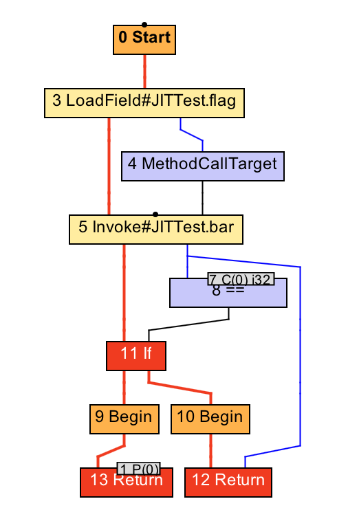
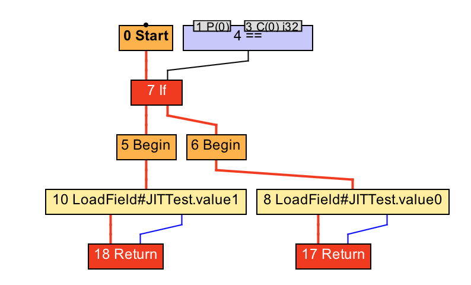
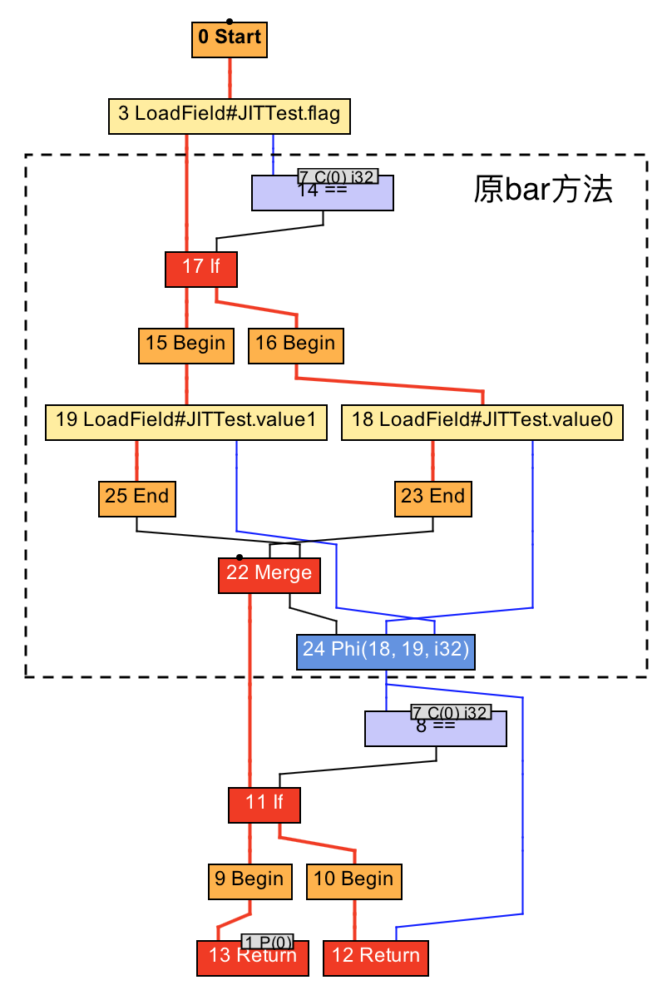
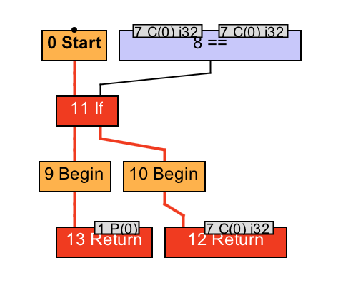
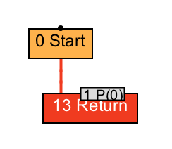
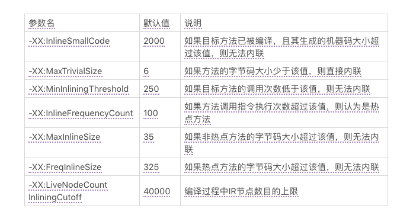

# 20 方法内联（上）

在前面的篇章中，我多次提到了方法内联这项技术。它指的是：在编译过程中遇到方法调用时，将目标方法的方法体纳入编译范围之中，并取代原方法调用的优化手段。

方法内联不仅可以消除调用本身带来的性能开销，还可以进一步触发更多的优化。因此，它可以算是编译优化里最为重要的一环。

以 getter/setter 为例，如果没有方法内联，在调用 getter/setter 时，程序需要保存当前方法的执行位置，创建并压入用于 getter/setter 的栈帧、访问字段、弹出栈帧，最后再恢复当前方法的执行。而当内联了对 getter/setter 的方法调用后，上述操作仅剩字段访问。

在 C2 中，方法内联是在解析字节码的过程中完成的。每当碰到方法调用字节码时，C2 将决定是否需要内联该方法调用。如果需要内联，则开始解析目标方法的字节码。

> 复习一下：即时编译器首先解析字节码，并生成 IR 图，然后在该 IR 图上进行优化。优化是由一个个独立的优化阶段（optimization phase）串联起来的。每个优化阶段都会对 IR 图进行转换。最后即时编译器根据 IR 图的节点以及调度顺序生成机器码。

同 C2 一样，Graal 也会在解析字节码的过程中进行方法调用的内联。此外，Graal 还拥有一个独立的优化阶段，来寻找指代方法调用的 IR 节点，并将之替换为目标方法的 IR 图。这个过程相对来说比较形象一些，因此，今天我就利用它来给你讲解一下方法内联。

```
方法内联的过程
public static boolean flag = true;
public static int value0 = 0;
public static int value1 = 1;
public static int foo(int value) {
    int result = bar(flag);
    if (result != 0) {
        return result;
    } else {
        return value;
    }
}
public static int bar(boolean flag) {
    return flag ? value0 : value1;
}
```

上面这段代码中的 foo 方法将接收一个 int 类型的参数，而 bar 方法将接收一个 boolean 类型的参数。其中，foo 方法会读取静态字段 flag 的值，并作为参数调用 bar 方法。

 **foo 方法的 IR 图（内联前）** 在编译 foo 方法时，其对应的 IR 图中将出现对 bar 方法的调用，即上图中的 5 号 Invoke 节点。如果内联算法判定应当内联对 bar 方法的调用时，那么即时编译器将开始解析 bar 方法的字节码，并生成对应的 IR 图，如下图所示。

 **bar 方法的 IR 图** 接下来，即时编译器便可以进行方法内联，把 bar 方法所对应的 IR 图纳入到对 foo 方法的编译中。具体的操作便是将 foo 方法的 IR 图中 5 号 Invoke 节点替换为 bar 方法的 IR 图。

 **foo 方法的 IR 图（内联后）** 除了将被调用方法的 IR 图节点复制到调用者方法的 IR 图中，即时编译器还需额外完成下述三项操作。

第一，被调用方法的传入参数节点，将被替换为调用者方法进行方法调用时所传入参数对应的节点。在我们的例子中，就是将 bar 方法 IR 图中的 1 号 P(0) 节点替换为 foo 方法 IR 图中的 3 号 LoadField 节点。

第二，在调用者方法的 IR 图中，所有指向原方法调用节点的数据依赖将重新指向被调用方法的返回节点。如果被调用方法存在多个返回节点，则生成一个 Phi 节点，将这些返回值聚合起来，并作为原方法调用节点的替换对象。

在我们的例子中，就是将 8 号 == 节点，以及 12 号 Return 节点连接到原 5 号 Invoke 节点的边，重新指向新生成的 24 号 Phi 节点中。

第三，如果被调用方法将抛出某种类型的异常，而调用者方法恰好有该异常类型的处理器，并且该异常处理器覆盖这一方法调用，那么即时编译器需要将被调用方法抛出异常的路径，与调用者方法的异常处理器相连接。

经过方法内联之后，即时编译器将得到一个新的 IR 图，并且在接下来的编译过程中对这个新的 IR 图进行进一步的优化。不过在上面这个例子中，方法内联后的 IR 图并没有能够进一步优化的地方。

```
public final static boolean flag = true;
public final static int value0 = 0;
public final static int value1 = 1;
public static int foo(int value) {
    int result = bar(flag);
    if (result != 0) {
        return result;
    } else {
        return value;
    }
}
public static int bar(boolean flag) {
    return flag ? value0 : value1;
}
```

不过，如果我们将代码中的三个静态字段标记为 final，那么 Java 编译器（注意不是即时编译器）会将它们编译为常量值（ConstantValue），并且在字节码中直接使用这些常量值，而非读取静态字段。举例来说，bar 方法对应的字节码如下所示。

```
public static int bar(boolean);
  Code:
     0: iload_0
     1: ifeq          8
     4: iconst_0
     5: goto          9
     8: iconst_1
     9: ireturn
```

在编译 foo 方法时，一旦即时编译器决定要内联对 bar 方法的调用，那么它会将调用 bar 方法所使用的参数，也就是常数 1，替换 bar 方法 IR 图中的参数。经过死代码消除之后，bar 方法将直接返回常数 0，所需复制的 IR 图也只有常数 0 这么一个节点。

经过方法内联之后，foo 方法的 IR 图将变成如下所示： 

该 IR 图可以进一步优化（死代码消除），并最终得到这张极为简单的 IR 图： 

## 方法内联的条件

方法内联能够触发更多的优化。通常而言，内联越多，生成代码的执行效率越高。然而，对于即时编译器来说，内联越多，编译时间也就越长，而程序达到峰值性能的时刻也将被推迟。

此外，内联越多也将导致生成的机器码越长。在 Java 虚拟机里，编译生成的机器码会被部署到 Code Cache 之中。这个 Code Cache 是有大小限制的（由 Java 虚拟机参数 -XX:ReservedCodeCacheSize 控制）。

这就意味着，生成的机器码越长，越容易填满 Code Cache，从而出现 Code Cache 已满，即时编译已被关闭的警告信息（CodeCache is full. Compiler has been disabled）。

因此，即时编译器不会无限制地进行方法内联。下面我便列举即时编译器的部分内联规则。（其他的特殊规则，如自动拆箱总会被内联、Throwable 类的方法不能被其他类中的方法所内联，你可以直接参考[JDK 的源代码](http://hg.openjdk.java.net/jdk/jdk/file/da387726a4f5/src/hotspot/share/opto/bytecodeInfo.cpp#l197)。） **首先，由 -XX:CompileCommand 中的 inline 指令指定的方法，以及由 @ForceInline 注解的方法（仅限于 JDK 内部方法），会被强制内联。** 而由 -XX:CompileCommand 中的 dontinline 指令或 exclude 指令（表示不编译）指定的方法，以及由 @DontInline 注解的方法（仅限于 JDK 内部方法），则始终不会被内联。 **其次，如果调用字节码对应的符号引用未被解析、目标方法所在的类未被初始化，或者目标方法是 native 方法，都将导致方法调用无法内联。**  **再次，C2 不支持内联超过 9 层的调用（可以通过虚拟机参数 -XX:MaxInlineLevel 调整），以及 1 层的直接递归调用（可以通过虚拟机参数 -XX:MaxRecursiveInlineLevel 调整）。**

> 如果方法 a 调用了方法 b，而方法 b 调用了方法 c，那么我们称 b 为 a 的 1 层调用，而 c 为 a 的 2 层调用。

最后，即时编译器将根据方法调用指令所在的程序路径的热度，目标方法的调用次数及大小，以及当前 IR 图的大小来决定方法调用能否被内联。



我在上面的表格列举了一些 C2 相关的虚拟机参数。总体来说，即时编译器中的内联算法更青睐于小方法。

## 总结与实践

今天我介绍了方法内联的过程以及条件。

方法内联是指，在编译过程中，当遇到方法调用时，将目标方法的方法体纳入编译范围之中，并取代原方法调用的优化手段。

即时编译器既可以在解析过程中替换方法调用字节码，也可以在 IR 图中替换方法调用 IR 节点。这两者都需要将目标方法的参数以及返回值映射到当前方法来。

方法内联有许多规则。除了一些强制内联以及强制不内联的规则外，即时编译器会根据方法调用的层数、方法调用指令所在的程序路径的热度、目标方法的调用次数及大小，以及当前 IR 图的大小来决定方法调用能否被内联。

今天的实践环节，你可以利用虚拟机参数 -XX:+PrintInlining 来打印编译过程中的内联情况。具体每项内联信息所代表的意思，你可以参考[这一网页](https://wiki.openjdk.java.net/display/HotSpot/Server+Compiler+Inlining+Messages)。
