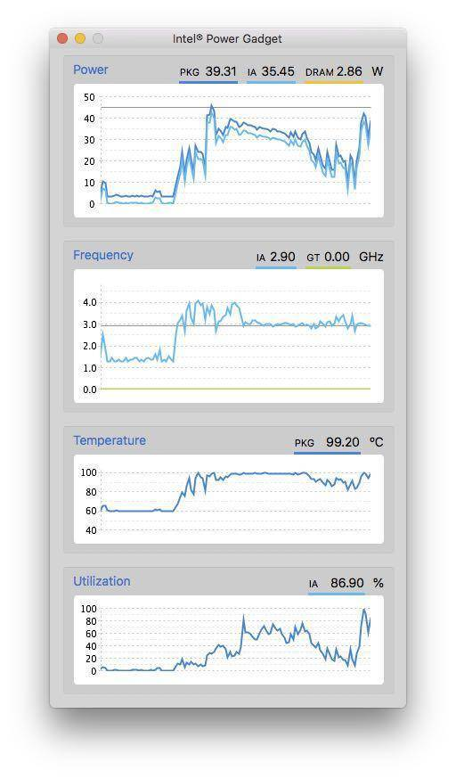

# 28 基准测试框架JMH（上）

今天我们来聊聊性能基准测试（benchmarking）。

大家或许都看到过一些不严谨的性能测试，以及基于这些测试结果得出的令人匪夷所思的结论。

```
static int foo() {

  int i = 0;

  while (i < 1_000_000_000) {

    i++;

  }

  return i;

}

```

举个例子，上面这段代码中的`foo`方法，将进行 10^9 次加法操作及跳转操作。

不少开发人员，包括我在介绍反射调用那一篇中所做的性能测试，都使用了下面这段代码的测量方式，即通过`System.nanoTime`或者`System.currentTimeMillis`来测量每若干个操作（如连续调用 1000 次`foo`方法）所花费的时间。

```
public class LoopPerformanceTest {

  static int foo() { ... }

 

  public static void main(String[] args) {

    // warmup

    for (int i = 0; i < 20_000; i++) {

      foo();

    }

    // measurement

    long current = System.nanoTime();

    for (int i = 1; i <= 10_000; i++) {

      foo();

      if (i % 1000 == 0) {

        long temp = System.nanoTime();

        System.out.println(temp - current);

        current = System.nanoTime();

      }

    }

  }

}

```

这种测量方式实际上过于理性化，忽略了 Java 虚拟机、操作系统，乃至硬件系统所带来的影响。

## 性能测试的坑

关于 Java 虚拟机所带来的影响，我们在前面的篇章中已经介绍过不少，如 Java 虚拟机堆空间的自适配，即时编译等。

在上面这段代码中，真正进行测试的代码（即`// measurement`后的代码）由于循环次数不多，属于冷循环，没有能触发 OSR 编译。

也就是说，我们会在`main`方法中解释执行，然后调用`foo`方法即时编译生成的机器码中。这种混杂了解释执行以及即时编译生成代码的测量方式，其得到的数据含义不明。

有同学认为，我们可以假设`foo`方法耗时较长（毕竟 10^9 次加法），因此`main`方法的解释执行并不会对最终计算得出的性能数据造成太大影响。上面这段代码在我的机器上测出的结果是，每 1000 次`foo`方法调用在 20 微秒左右。

这是否意味着，我这台机器的 CPU 已经远超它的物理限制，其频率达到 100,000,000 GHz 了。（假设循环主体就两条指令，每时钟周期指令数 \[1\] 为 1。）这显然是不可能的，目前 CPU 单核的频率大概在 2-5 GHz 左右，再怎么超频也不可能提升七八个数量级。

你应该能够猜到，这和即时编译器的循环优化有关。下面便是`foo`方法的编译结果。我们可以看到，它将直接返回 10^9，而不是循环 10^9 次，并在循环中重复进行加法。

```
0x8aa0: sub    rsp,0x18                 // 创建方法栈桢

0x8aa7: mov    QWORD PTR [rsp+0x10],rbp // 无关指令

0x8aac: mov    eax,0x3b9aca00           // return 10^9

0x8ab1: add    rsp,0x10                 // 弹出方法栈桢

0x8ab5: pop    rbp                      // 无关指令

0x8ab6: mov    r10,QWORD PTR [r15+0x70] // 安全点测试

0x8aba: test   DWORD PTR [r10],eax      // 安全点测试

0x8abd: ret

```

> 之前我忘记解释所谓的”无关指令“是什么意思。我指的是该指令和具体的代码逻辑无关。即时编译器生成的代码可能会将 RBP 寄存器作为通用寄存器，从而是寄存器分配算法有更多的选择。由于调用者（caller）未必保存了 RBP 寄存器的值，所以即时编译器会在进入被调用者（callee）时保存 RBP 的值，并在退出被调用者时复原 RBP 的值。

```
static int foo() {

  int i = 0;

  while (i < 1_000_000_000) {

    i++;

  }

  return i;

}

// 优化为

static int foo() {

  return 1_000_000_000;

}

```

该循环优化并非循环展开。在默认情况下，即时编译器仅能将循环展开 60 次（对应虚拟机参数`-XX:LoopUnrollLimit`）。实际上，在介绍循环优化那篇文章中，我并没有提及这个优化。因为该优化实在是太过于简单，几乎所有开发人员都能够手工对其进行优化。

在即时编译器中，它是一个基于计数循环的优化。我们也已经学过计数循环的知识。也就是说，只要将循环变量`i`改为 long 类型，便可以“避免”这个优化。

关于操作系统和硬件系统所带来的影响，一个较为常见的例子便是电源管理策略。在许多机器，特别是笔记本上，操作系统会动态配置 CPU 的频率。而 CPU 的频率又直接影响到性能测试的数据，因此短时间的性能测试得出的数据未必可靠。



例如我的笔记本，在刚开始进行性能评测时，单核频率可以达到 4.0 GHz。而后由于 CPU 温度升高，频率便被限制在 3.0 GHz 了。

除了电源管理之外，CPU 缓存、分支预测器 \[2\]，以及超线程技术 \[3\]，都会对测试结果造成影响。

就 CPU 缓存而言，如果程序的数据本地性较好，那么它的性能指标便会非常好；如果程序存在 false sharing 的问题，即几个线程写入内存中属于同一缓存行的不同部分，那么它的性能指标便会非常糟糕。

超线程技术是另一个可能误导性能测试工具的因素。我们知道，超线程技术将为每个物理核心虚拟出两个虚拟核心，从而尽可能地提高物理核心的利用率。如果性能测试的两个线程被安排在同一物理核心上，那么得到的测试数据显然要比被安排在不同物理核心上的数据糟糕得多。

总而言之，性能基准测试存在着许多深坑（pitfall）。然而，除了性能测试专家外，大多数开发人员都没有足够全面的知识，能够绕开这些坑，因而得出的性能测试数据很有可能是有偏差的（biased）。

下面我将介绍 OpenJDK 中的开源项目 JMH\[4\]（Java Microbenchmark Harness）。JMH 是一个面向 Java 语言或者其他 Java 虚拟机语言的性能基准测试框架。它针对的是纳秒级别（出自官网介绍，个人觉得精确度没那么高）、微秒级别、毫秒级别，以及秒级别的性能测试。

由于许多即时编译器的开发人员参与了该项目，因此 JMH 内置了许多功能来控制即时编译器的优化。对于其他影响性能评测的因素，JMH 也提供了不少策略来降低影响，甚至是彻底解决。

因此，使用这个性能基准测试框架的开发人员，可以将精力完全集中在所要测试的业务逻辑，并以最小的代价控制除了业务逻辑之外的可能影响性能的因素。

```
REMEMBER: The numbers below are just data. To gain reusable insights, you need to follow up on why the numbers are the way they are. Use profilers (see -prof, -lprof), design factorial experiments, perform baseline and negative tests that provide experimental control, make sure the benchmarking environment is safe on JVM/OS/HW level, ask for reviews from the domain experts. Do not assume the numbers tell you what you want them to tell.

```

不过，JMH 也不能完美解决性能测试数据的偏差问题。它甚至会在每次运行的输出结果中打印上述语句，所以，JMH 的开发人员也给出了一个小忠告：我们开发人员不要轻信 JMH 的性能测试数据，不要基于这些数据乱下结论。

通常来说，性能基准测试的结果反映的是所测试的业务逻辑在所运行的 Java 虚拟机，操作系统，硬件系统这一组合上的性能指标，而根据这些性能指标得出的通用结论则需要经过严格论证。

在理解（或忽略）了 JMH 的忠告后，我们下面便来看看如何使用 JMH。

## 生成 JMH 项目

JMH 的使用方式并不复杂。我们可以借助 JMH 部署在 maven 上的 archetype，生成预设好依赖关系的 maven 项目模板。具体的命令如下所示：

```
$ mvn archetype:generate \

          -DinteractiveMode=false \

          -DarchetypeGroupId=org.openjdk.jmh \

          -DarchetypeArtifactId=jmh-java-benchmark-archetype \

          -DgroupId=org.sample \

          -DartifactId=test \

          -Dversion=1.21

$ cd test

```

该命令将在当前目录下生成一个`test`文件夹（对应参数`-DartifactId=test`，可更改），其中便包含了定义该 maven 项目依赖的`pom.xml`文件，以及自动生成的测试文件`src/main/org/sample/MyBenchmark.java`（这里`org/sample`对应参数`-DgroupId=org.sample`，可更改）。后者的内容如下所示：

```
/*

 * Copyright ...

 */

package org.sample;

 

import org.openjdk.jmh.annotations.Benchmark;

 

public class MyBenchmark {

 

    @Benchmark

    public void testMethod() {

        // This is a demo/sample template for building your JMH benchmarks. Edit as needed.

        // Put your benchmark code here.

    }

 

}

```

这里面，类名`MyBenchmark`以及方法名`testMethod`并不重要，你可以随意更改。真正重要的是`@Benchmark`注解。被它标注的方法，便是 JMH 基准测试的测试方法。该测试方法默认是空的。我们可以填入需要进行性能测试的业务逻辑。

举个例子，我们可以测量新建异常对象的性能，如下述代码所示：

```
@Benchmark

public void testMethod() {

  new Exception();

}

```

通常来说，我们不应该使用这种貌似会被即时编译器优化掉的代码（在下篇中我会介绍 JMH 的`Blackhole`功能）。

不过，我们已经学习过逃逸分析了，知道 native 方法调用的调用者或者参数会被识别为逃逸。而`Exception`的构造器将间接调用至 native 方法`fillInStackTrace`中，并且该方法调用的调用者便是新建的`Exception`对象。因此，逃逸分析将判定该新建对象逃逸，而即时编译器也无法优化掉原本的新建对象操作。

当`Exception`的构造器返回时，Java 虚拟机将不再拥有指向这一新建对象的引用。因此，该新建对象可以被垃圾回收。

## 编译和运行 JMH 项目

在上一篇介绍注解处理器时，我曾提到过，JMH 正是利用注解处理器 \[5\] 来自动生成性能测试的代码。实际上，除了`@Benchmark`之外，JMH 的注解处理器还将处理所有位于`org.openjdk.jmh.annotations`包 \[6\] 下的注解。（其他注解我们会在下一篇中详细介绍。）

我们可以运行`mvn compile`命令来编译这个 maven 项目。该命令将生成`target`文件夹，其中的`generated-sources`目录便存放着由 JMH 的注解处理器所生成的 Java 源代码：

```
$ mvn compile

$ ls target/generated-sources/annotations/org/sample/generated/

MyBenchmark_jmhType.java            MyBenchmark_jmhType_B1.java         MyBenchmark_jmhType_B2.java         MyBenchmark_jmhType_B3.java         MyBenchmark_testMethod_jmhTest.java

```

在这些源代码里，所有以`MyBenchmark_jmhType`为前缀的 Java 类都继承自`MyBenchmark`。这是注解处理器的常见用法，即通过生成子类来将注解所带来的额外语义扩张成方法。

具体来说，它们之间的继承关系是`MyBenchmark_jmhType -> B3 -> B2 -> B1 -> MyBenchmark`（这里`A -> B`代表 A 继承 B）。其中，B2 存放着 JMH 用来控制基准测试的各项字段。

为了避免这些控制字段对`MyBenchmark`类中的字段造成 false sharing 的影响，JMH 生成了 B1 和 B3，分别存放了 256 个 boolean 字段，从而避免 B2 中的字段与`MyBenchmark`类、`MyBenchmark_jmhType`类中的字段（或内存里下一个对象中的字段）会出现在同一缓存行中。

> 之所以不能在同一类中安排这些字段，是因为 Java 虚拟机的字段重排列。而类之间的继承关系，便可以避免不同类所包含的字段之间的重排列。

除了这些`jmhType`源代码外，`generated-sources`目录还存放着真正的性能测试代码`MyBenchmark_testMethod_jmhTest.java`。当进行性能测试时，Java 虚拟机所运行的代码很有可能便是这一个源文件中的热循环经过 OSR 编译过后的代码。

> 在通过 CompileCommand 分析即时编译后的机器码时，我们需要关注的其实是`MyBenchmark_testMethod_jmhTest`中的方法。

由于这里面的内容过于复杂，我将在下一篇中介绍影响该生成代码的众多功能性注解，这里就不再详细进行介绍了。

接下来，我们可以运行`mvn package`命令，将编译好的 class 文件打包成 jar 包。生成的 jar 包同样位于`target`目录下，其名字为`benchmarks.jar`。jar 包里附带了一系列配置文件，如下所示：

```
$ mvn package

 

$ jar tf target/benchmarks.jar META-INF

META-INF/MANIFEST.MF

META-INF/

META-INF/BenchmarkList

META-INF/CompilerHints

META-INF/maven/

META-INF/maven/org.sample/

META-INF/maven/org.sample/test/

META-INF/maven/org.sample/test/pom.xml

META-INF/maven/org.sample/test/pom.properties

META-INF/maven/org.openjdk.jmh/

META-INF/maven/org.openjdk.jmh/jmh-core/

META-INF/maven/org.openjdk.jmh/jmh-core/pom.xml

META-INF/maven/org.openjdk.jmh/jmh-core/pom.properties

META-INF/maven/net.sf.jopt-simple/

META-INF/maven/net.sf.jopt-simple/jopt-simple/

META-INF/maven/net.sf.jopt-simple/jopt-simple/pom.xml

META-INF/maven/net.sf.jopt-simple/jopt-simple/pom.properties

META-INF/LICENSE.txt

META-INF/NOTICE.txt

META-INF/maven/org.apache.commons/

META-INF/maven/org.apache.commons/commons-math3/

META-INF/maven/org.apache.commons/commons-math3/pom.xml

META-INF/maven/org.apache.commons/commons-math3/pom.properties

 

$ unzip -c target/benchmarks.jar META-INF/MANIFEST.MF

Archive:  target/benchmarks.jar

  inflating: META-INF/MANIFEST.MF    

Manifest-Version: 1.0

Archiver-Version: Plexus Archiver

Created-By: Apache Maven 3.5.4

Built-By: zhengy

Build-Jdk: 10.0.2

Main-Class: org.openjdk.jmh.Main

 

$ unzip -c target/benchmarks.jar META-INF/BenchmarkList

Archive:  target/benchmarks.jar

  inflating: META-INF/BenchmarkList  

JMH S 22 org.sample.MyBenchmark S 51 org.sample.generated.MyBenchmark_testMethod_jmhTest S 10 testMethod S 10 Throughput E A 1 1 1 E E E E E E E E E E E E E E E E E

 

$ unzip -c target/benchmarks.jar META-INF/CompilerHints

Archive:  target/benchmarks.jar

  inflating: META-INF/CompilerHints  

dontinline,*.*_all_jmhStub

dontinline,*.*_avgt_jmhStub

dontinline,*.*_sample_jmhStub

dontinline,*.*_ss_jmhStub

dontinline,*.*_thrpt_jmhStub

inline,org/sample/MyBenchmark.testMethod

```

这里我展示了其中三个比较重要的配置文件。

1. `MANIFEST.MF`中指定了该 jar 包的默认入口，即`org.openjdk.jmh.Main`\[7\]。
1. `BenchmarkList`中存放了测试配置。该配置是根据`MyBenchmark.java`里的注解自动生成的，具体我会在下一篇中详细介绍源代码中如何配置。
1. `CompilerHints`中存放了传递给 Java 虚拟机的`-XX:CompileCommandFile`参数的内容。它规定了无法内联以及必须内联的几个方法，其中便有存放业务逻辑的测试方法`testMethod`。

在编译`MyBenchmark_testMethod_jmhTest`类中的测试方法时，JMH 会让即时编译器强制内联对`MyBenchmark.testMethod`的方法调用，以避免调用开销。

打包生成的 jar 包可以直接运行。具体指令如下所示：

```
$ java -jar target/benchmarks.jar

WARNING: An illegal reflective access operation has occurred

...

Benchmark                Mode  Cnt        Score      Error  Units

MyBenchmark.testMethod  thrpt   25  1004801,393 ± 4055,462  ops/s

```

这里 JMH 会有非常多的输出，具体内容我会在下一篇中进行讲解。

输出的最后便是本次基准测试的结果。其中比较重要的两项指标是`Score`和`Error`，分别代表本次基准测试的平均吞吐量（每秒运行`testMethod`方法的次数）以及误差范围。例如，这里的结果说明本次基准测试平均每秒生成 10^6 个异常实例，误差范围大致在 4000 个异常实例。

## 总结与实践

今天我介绍了 OpenJDK 的性能基准测试项目 JMH。

Java 程序的性能测试存在着许多深坑，有来自 Java 虚拟机的，有来自操作系统的，甚至有来自硬件系统的。如果没有足够的知识，那么性能测试的结果很有可能是有偏差的。

性能基准测试框架 JMH 是 OpenJDK 中的其中一个开源项目。它内置了许多功能，来规避由 Java 虚拟机中的即时编译器或者其他优化对性能测试造成的影响。此外，它还提供了不少策略来降低来自操作系统以及硬件系统的影响。

开发人员仅需将所要测试的业务逻辑通过`@Benchmark`注解，便可以让 JMH 的注解处理器自动生成真正的性能测试代码，以及相应的性能测试配置文件。

______________________________________________________________________

今天的实践环节，请生成一个 JMH 项目，并且在`MyBenchmark.testMethod`方法中填入自己的业务逻辑。（除非你已经提前了解`@State`等 JMH 功能，否则请不要在`MyBenchmark`中定义实例变量。）

\[1\] <https://en.wikipedia.org/wiki/Instructions%5C_per%5C_cycle> \[2\] <https://en.wikipedia.org/wiki/Branch%5C_predictor> \[3\] <https://en.wikipedia.org/wiki/Hyper-threading> \[4\] <http://openjdk.java.net/projects/code-tools/jmh/> \[5\] <http://hg.openjdk.java.net/code-tools/jmh/file/3769055ad883/jmh-generator-annprocess/src/main/java/org/openjdk/jmh/generators/BenchmarkProcessor.java> \[6\] <http://hg.openjdk.java.net/code-tools/jmh/file/3769055ad883/jmh-core/src/main/java/org/openjdk/jmh/annotations> \[7\] <http://hg.openjdk.java.net/code-tools/jmh/file/3769055ad883/jmh-core/src/main/java/org/openjdk/jmh/Main.java>
