31 Java虚拟机的监控及诊断工具（GUI篇）
========================

今天我们来继续了解 Java 虚拟机的监控及诊断工具。

eclipse MAT
-----------

在上一篇中，我介绍了`jmap`工具，它支持导出 Java 虚拟机堆的二进制快照。eclipse 的[MAT 工具](https://www.eclipse.org/mat/)便是其中一个能够解析这类二进制快照的工具。

MAT 本身也能够获取堆的二进制快照。该功能将借助`jps`列出当前正在运行的 Java 进程，以供选择并获取快照。由于`jps`会将自己列入其中，因此你会在列表中发现一个已经结束运行的`jps`进程。

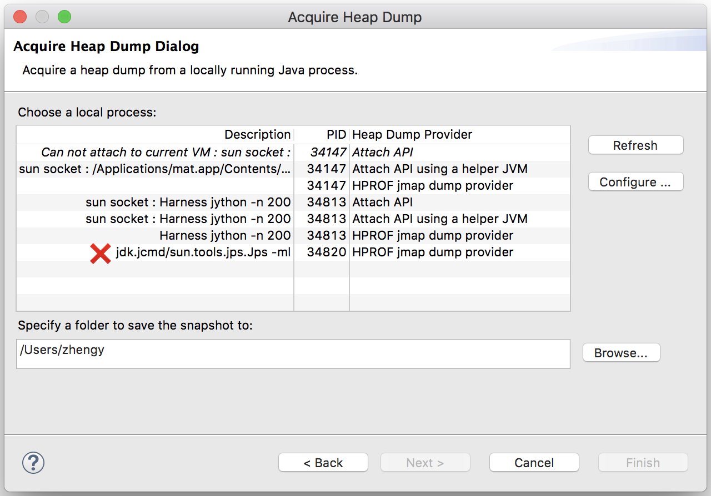

MAT 获取二进制快照的方式有三种，一是使用 Attach API，二是新建一个 Java 虚拟机来运行 Attach API，三是使用`jmap`工具。

这三种本质上都是在使用 Attach API。不过，在目标进程启用了`DisableAttachMechanism`参数时，前两者将不在选取列表中显示，后者将在运行时报错。

当加载完堆快照之后，MAT 的主界面将展示一张饼状图，其中列举占据的 Retained heap 最多的几个对象。

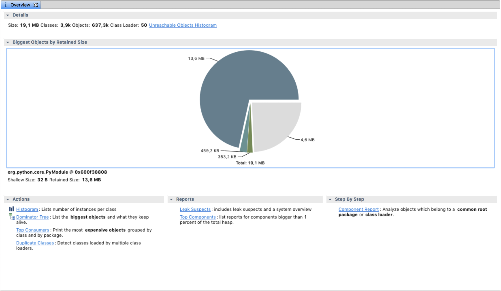

这里讲一下 MAT 计算对象占据内存的[两种方式](https://help.eclipse.org/mars/topic/org.eclipse.mat.ui.help/concepts/shallowretainedheap.html?cp=46_2_1)。第一种是 Shallow heap，指的是对象自身所占据的内存。第二种是 Retained heap，指的是当对象不再被引用时，垃圾回收器所能回收的总内存，包括对象自身所占据的内存，以及仅能够通过该对象引用到的其他对象所占据的内存。上面的饼状图便是基于 Retained heap 的。

MAT 包括了两个比较重要的视图，分别是直方图（histogram）和支配树（dominator tree）。

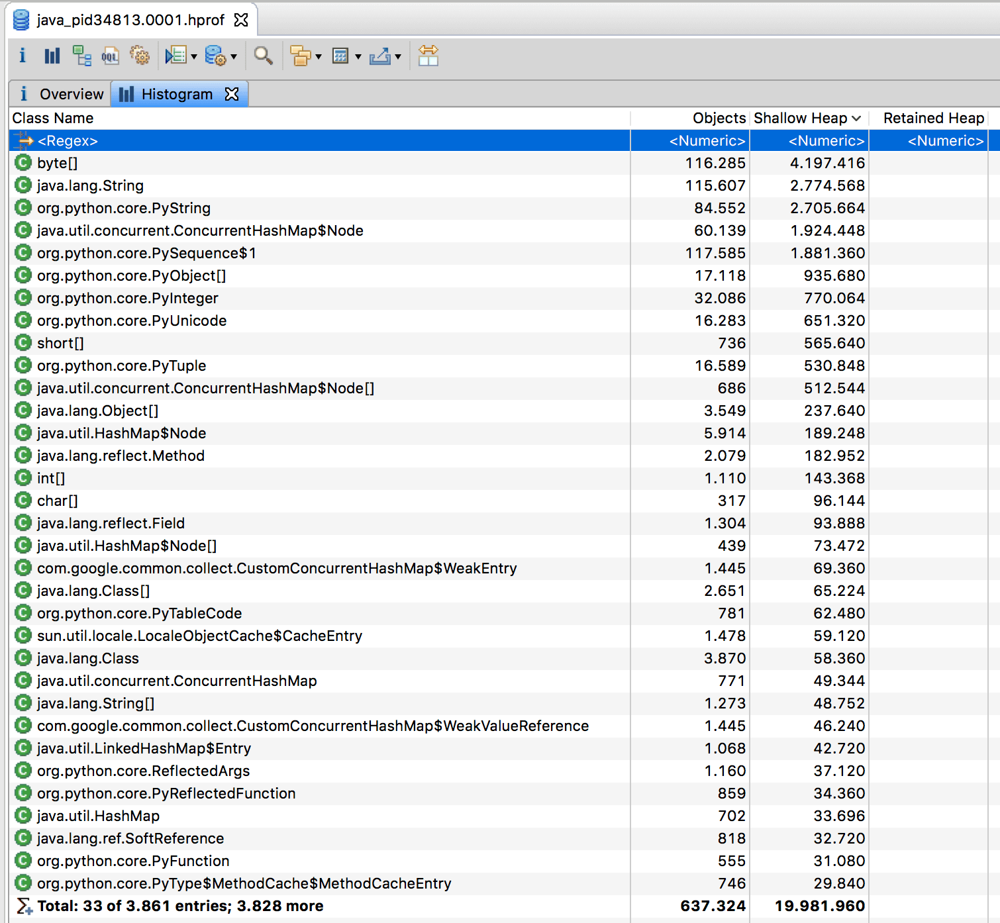

MAT 的直方图和`jmap`的`-histo`子命令一样，都能够展示各个类的实例数目以及这些实例的 Shallow heap 总和。但是，MAT 的直方图还能够计算 Retained heap，并支持基于实例数目或 Retained heap 的排序方式（默认为 Shallow heap）。此外，MAT 还可以将直方图中的类按照超类、类加载器或者包名分组。

当选中某个类时，MAT 界面左上角的 Inspector 窗口将展示该类的 Class 实例的相关信息，如类加载器等。（下图中的`ClassLoader @ 0x0`指的便是启动类加载器。）

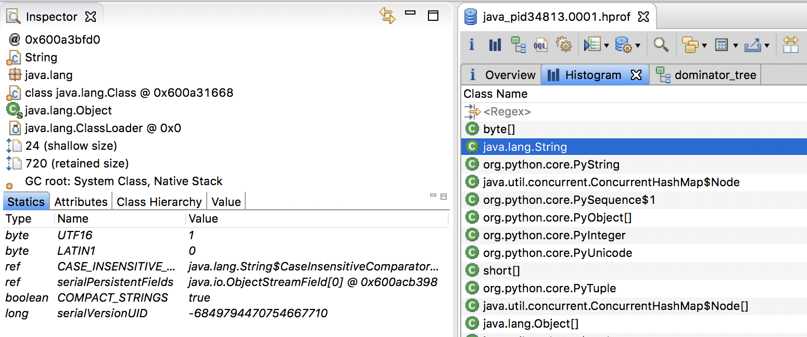

支配树的概念源自图论。在一则流图（flow diagram）中，如果从入口节点到 b 节点的所有路径都要经过 a 节点，那么 a 支配（dominate）b。

在 a 支配 b，且 a 不同于 b 的情况下（即 a 严格支配 b），如果从 a 节点到 b 节点的所有路径中不存在支配 b 的其他节点，那么 a 直接支配（immediate dominate）b。这里的支配树指的便是由节点的直接支配节点所组成的树状结构。

我们可以将堆中所有的对象看成一张对象图，每个对象是一个图节点，而 GC Roots 则是对象图的入口，对象之间的引用关系则构成了对象图中的有向边。这样一来，我们便能够构造出该对象图所对应的支配树。

MAT 将按照每个对象 Retained heap 的大小排列该支配树。如下图所示：

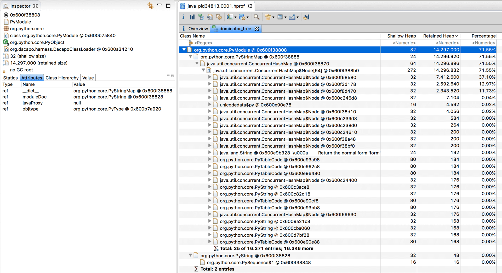

根据 Retained heap 的定义，只要能够回收上图右侧的表中的第一个对象，那么垃圾回收器便能够释放出 13.6MB 内存。

需要注意的是，对象的引用型字段未必对应支配树中的父子节点关系。假设对象 a 拥有两个引用型字段，分别指向 b 和 c。而 b 和 c 各自拥有一个引用型字段，但都指向 d。如果没有其他引用指向 b、c 或 d，那么 a 直接支配 b、c 和 d，而 b（或 c）和 d 之间不存在支配关系。

当在支配树视图中选中某一对象时，我们还可以通过 Path To GC Roots 功能，反向列出该对象到 GC Roots 的引用路径。如下图所示：

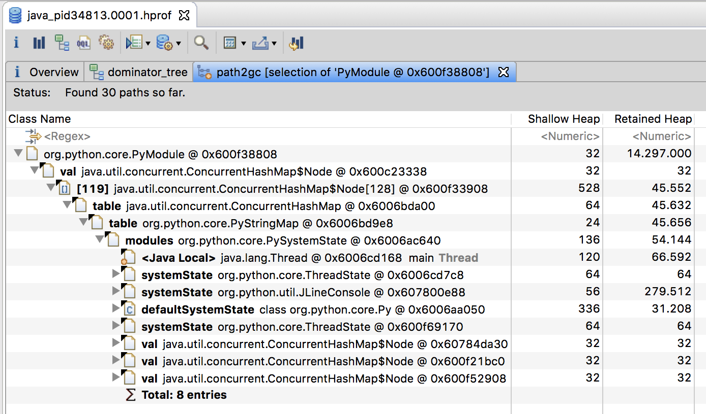

MAT 还将自动匹配内存泄漏中的常见模式，并汇报潜在的内存泄漏问题。具体可参考该[帮助文档](https://help.eclipse.org/mars/topic/org.eclipse.mat.ui.help/tasks/runningleaksuspectreport.html?cp=46_3_1)以及[这篇博客](https://memoryanalyzer.blogspot.com/2008/05/automated-heap-dump-analysis-finding.html)。

Java Mission Control
--------------------

> 注意：自 Java 11 开始，本节介绍的 JFR 已经开源。但在之前的 Java 版本，JFR 属于 Commercial Feature，需要通过 Java 虚拟机参数`-XX:+UnlockCommercialFeatures`开启。
>
> 我个人不清楚也不能回答关于 Java 11 之前的版本是否仍需要商务许可（Commercial License）的问题。请另行咨询后再使用，或者直接使用 Java 11。
>
> [Java Mission Control](https://jdk.java.net/jmc/)（JMC）是 Java 虚拟机平台上的性能监控工具。它包含一个 GUI 客户端，以及众多用来收集 Java 虚拟机性能数据的插件，如 JMX Console（能够访问用来存放虚拟机各个子系统运行数据的[MXBeans](https://en.wikipedia.org/wiki/Java_Management_Extensions#Managed_beans)），以及虚拟机内置的高效 profiling 工具 Java Flight Recorder（JFR）。

JFR 的性能开销很小，在默认配置下平均低于 1%。与其他工具相比，JFR 能够直接访问虚拟机内的数据，并且不会影响虚拟机的优化。因此，它非常适用于生产环境下满负荷运行的 Java 程序。

当启用时，JFR 将记录运行过程中发生的一系列事件。其中包括 Java 层面的事件，如线程事件、锁事件，以及 Java 虚拟机内部的事件，如新建对象、垃圾回收和即时编译事件。

按照发生时机以及持续时间来划分，JFR 的事件共有四种类型，它们分别为以下四种。

1. 瞬时事件（Instant Event），用户关心的是它们发生与否，例如异常、线程启动事件。
2. 持续事件（Duration Event），用户关心的是它们的持续时间，例如垃圾回收事件。
3. 计时事件（Timed Event），是时长超出指定阈值的持续事件。
4. 取样事件（Sample Event），是周期性取样的事件。 取样事件的其中一个常见例子便是方法抽样（Method Sampling），即每隔一段时间统计各个线程的栈轨迹。如果在这些抽样取得的栈轨迹中存在一个反复出现的方法，那么我们可以推测该方法是热点方法。

JFR 的取样事件要比其他工具更加精确。以方法抽样为例，其他工具通常基于 JVMTI（[Java Virtual Machine Tool Interface](https://docs.oracle.com/en/java/javase/11/docs/specs/jvmti.html)）的`GetAllStackTraces` API。该 API 依赖于安全点机制，其获得的栈轨迹总是在安全点上，由此得出的结论未必精确。JFR 则不然，它不依赖于安全点机制，因此其结果相对来说更加精确。

JFR 的启用方式主要有三种。

第一种是在运行目标 Java 程序时添加`-XX:StartFlightRecording=`参数。关于该参数的配置详情，你可以参考[该帮助文档](https://docs.oracle.com/en/java/javase/11/tools/java.html)（请在页面中搜索`StartFlightRecording`）。

下面我列举三种常见的配置方式。

* 在下面这条命令中，JFR 将会在 Java 虚拟机启动 5s 后（对应`delay=5s`）收集数据，持续 20s（对应`duration=20s`）。当收集完毕后，JFR 会将收集得到的数据保存至指定的文件中（对应`filename=myrecording.jfr`）。

```
# Time fixed

$ java -XX:StartFlightRecording=delay=5s,duration=20s,filename=myrecording.jfr,settings=profile MyApp

```

> `settings=profile`指定了 JFR 所收集的事件类型。默认情况下，JFR 将加载配置文件`$JDK/lib/jfr/default.jfc`，并识别其中所包含的事件类型。当使用了`settings=profile`配置时，JFR 将加载配置文件`$JDK/lib/jfr/profile.jfc`。该配置文件所包含的事件类型要多于默认的`default.jfc`，因此性能开销也要大一些（约为 2%）。
>
> `default.jfc`以及`profile.jfc`均为 XML 文件。后面我会介绍如何利用 JMC 来进行修改。

* 在下面这条命令中，JFR 将在 Java 虚拟机启动之后持续收集数据，直至进程退出。在进程退出时（对应`dumponexit=true`），JFR 会将收集得到的数据保存至指定的文件中。

```
# Continuous, dump on exit

$ java -XX:StartFlightRecording=dumponexit=true,filename=myrecording.jfr MyApp

```

* 在下面这条命令中，JFR 将在 Java 虚拟机启动之后持续收集数据，直至进程退出。该命令不会主动保存 JFR 收集得到的数据。

```
# Continuous, dump on demand

$ java -XX:StartFlightRecording=maxage=10m,maxsize=100m,name=SomeLabel MyApp

Started recording 1.

 

Use jcmd 38502 JFR.dump name=SomeLabel filename=FILEPATH to copy recording data to file.

...

```

由于 JFR 将持续收集数据，如果不加以限制，那么 JFR 可能会填满硬盘的所有空间。因此，我们有必要对这种模式下所收集的数据进行限制。

在这条命令中，`maxage=10m`指的是仅保留 10 分钟以内的事件，`maxsize=100m`指的是仅保留 100MB 以内的事件。一旦所收集的事件达到其中任意一个限制，JFR 便会开始清除不合规格的事件。

然而，为了保持较小的性能开销，JFR 并不会频繁地校验这两个限制。因此，在实践过程中你往往会发现指定文件的大小超出限制，或者文件中所存储事件的时间超出限制。具体解释请参考[这篇帖子](https://community.oracle.com/thread/3514679)。

前面提到，该命令不会主动保存 JFR 收集得到的数据。用户需要运行`jcmd <PID> JFR.dump`命令方能保存。

这便是 JFR 的第二种启用方式，即通过`jcmd`来让 JFR 开始收集数据、停止收集数据，或者保存所收集的数据，对应的子命令分别为`JFR.start`，`JFR.stop`，以及`JFR.dump`。

`JFR.start`子命令所接收的配置及格式和`-XX:StartFlightRecording=`参数的类似。这些配置包括`delay`、`duration`、`settings`、`maxage`、`maxsize`以及`name`。前几个参数我们都已经介绍过了，最后一个参数`name`就是一个标签，当同一进程中存在多个 JFR 数据收集操作时，我们可以通过该标签来辨别。

在启动目标进程时，我们不再添加`-XX:StartFlightRecording=`参数。在目标进程运行过程中，我们可以运行`JFR.start`子命令远程启用目标进程的 JFR 功能。具体用法如下所示：

```
jcmd <PID> JFR.start settings=profile maxage=10m maxsize=150m name=SomeLabel

```

上述命令运行过后，目标进程中的 JFR 已经开始收集数据。此时，我们可以通过下述命令来导出已经收集到的数据：

```
jcmd <PID> JFR.dump name=SomeLabel filename=myrecording.jfr

```

最后，我们可以通过下述命令关闭目标进程中的 JFR：

```
jcmd <PID> JFR.stop name=SomeLabel

```

关于`JFR.start`、`JFR.dump`和`JFR.stop`的其他用法，你可以参考[该帮助文档](https://docs.oracle.com/javacomponents/jmc-5-5/jfr-runtime-guide/comline.htm#JFRRT185)。

第三种启用 JFR 的方式则是 JMC 中的 JFR 插件。

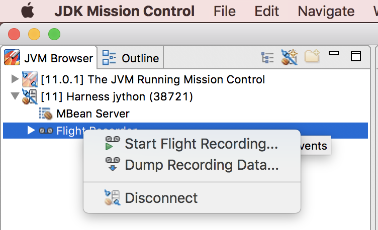

在 JMC GUI 客户端左侧的 JVM 浏览器中，我们可以看到所有正在运行的 Java 程序。当点击右键弹出菜单中的`Start Flight Recording...`时，JMC 便会弹出另一个窗口，用来配置 JFR 的启动参数，如下图所示：

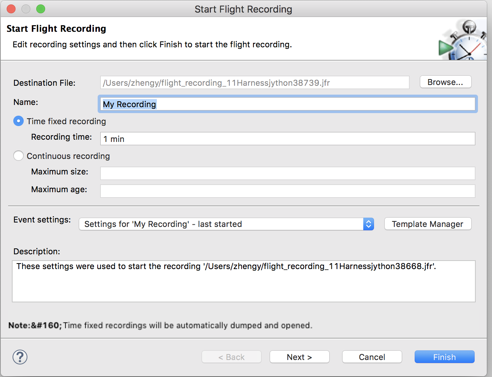

这里的配置参数与前两种启动 JFR 的方式并无二致，同样也包括标签名、收集数据的持续时间、缓存事件的时间及空间限制，以及配置所要监控事件的`Event settings`。 （这里对应前两种启动方式的`settings=default|profile`）

> JMC 提供了两个选择：Continuous 和 Profiling，分别对应`$JDK/lib/jfr/`里的`default.jfc`和`profile.jfc`。

我们可以通过 JMC 的`Flight Recording Template Manager`导入这些 jfc 文件，并在 GUI 界面上进行更改。更改完毕后，我们可以导出为新的 jfc 文件，以便在服务器端使用。

当收集完成时，JMC 会自动打开所生成的 jfr 文件，并在主界面中列举目标进程在收集数据的这段时间内的潜在问题。例如，`Parallel Threads`一节，便汇报了没有完整利用 CPU 资源的问题。

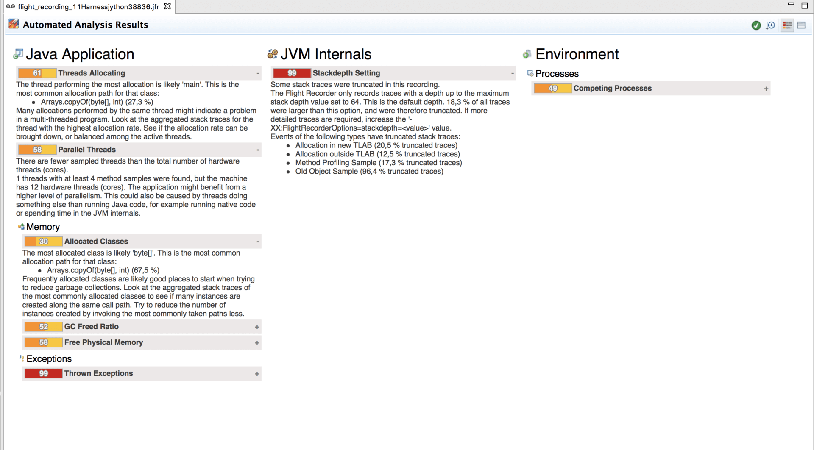

客户端的左边则罗列了 Java 虚拟机的各个子系统。JMC 将根据 JFR 所收集到的每个子系统的事件来进行可视化，转换成图或者表。

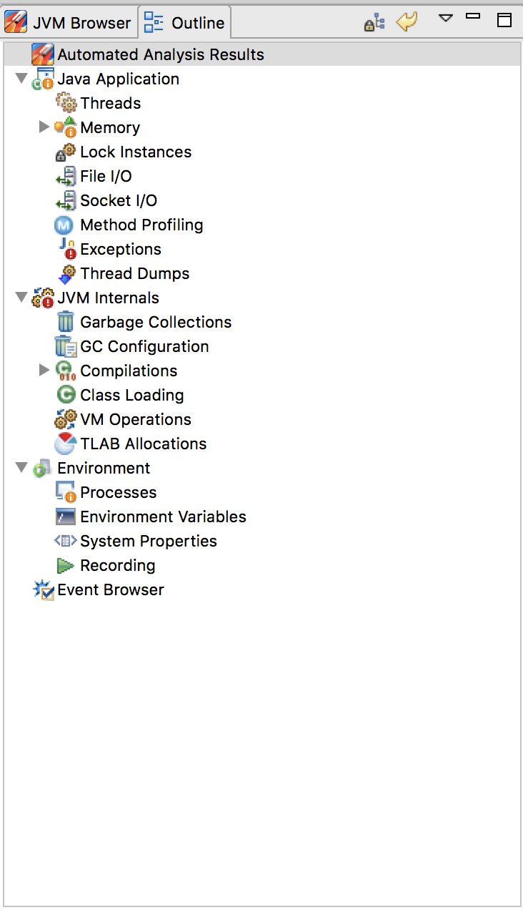

这里我简单地介绍其中两个。

垃圾回收子系统所对应的选项卡展示了 JFR 所收集到的 GC 事件，以及基于这些 GC 事件的数据生成的堆已用空间的分布图，Metaspace 大小的分布图，最长暂停以及总暂停的直方分布图。

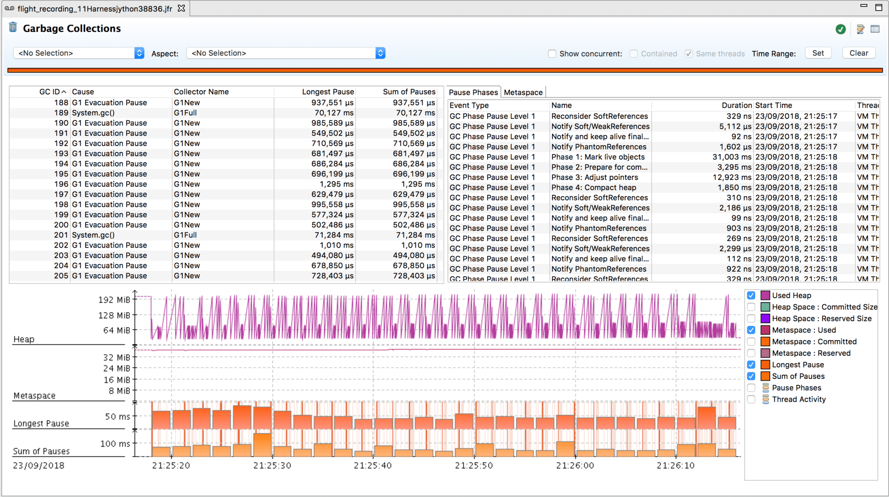

即时编译子系统所对应的选项卡则展示了方法编译时间的直方图，以及按编译时间排序的编译任务表。

后者可能出现同方法名同方法描述符的编译任务。其原因主要有两个，一是不同编译层次的即时编译，如 3 层的 C1 编译以及 4 层的 C2 编译。二是去优化后的重新编译。

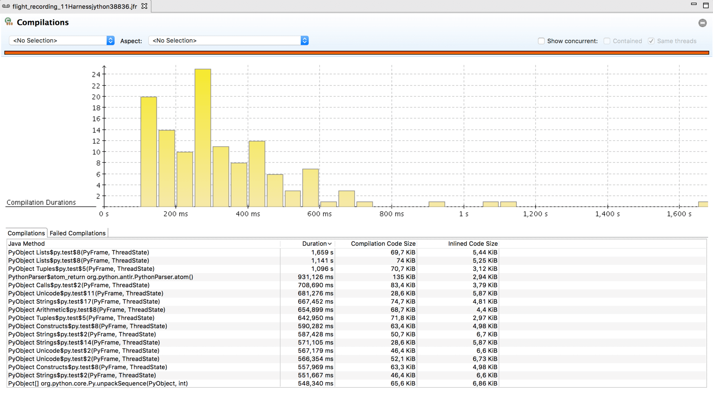

JMC 的图表总体而言都不难理解。你可以逐个探索，我在这里便不详细展开了。

总结与实践
-----

今天我介绍了两个 GUI 工具：eclipse MAT 以及 JMC。

eclipse MAT 可用于分析由`jmap`命令导出的 Java 堆快照。它包括两个相对比较重要的视图，分别为直方图和支配树。直方图展示了各个类的实例数目以及这些实例的 Shallow heap 或 Retained heap 的总和。支配树则展示了快照中每个对象所直接支配的对象。

Java Mission Control 是 Java 虚拟机平台上的性能监控工具。Java Flight Recorder 是 JMC 的其中一个组件，能够以极低的性能开销收集 Java 虚拟机的性能数据。

JFR 的启用方式有三种，分别为在命令行中使用`-XX:StartFlightRecording=`参数，使用`jcmd`的`JFR.*`子命令，以及 JMC 的 JFR 插件。JMC 能够加载 JFR 的输出结果，并且生成各种信息丰富的图表。

* * *

今天的实践环节，请你试用 JMC 中的 MBean Server 功能，并通过 JMC 的帮助文档（`Help->Java Mission Control Help`），以及[该教程](https://docs.oracle.com/javase/tutorial/jmx/mbeans/index.html)来了解该功能的具体含义。

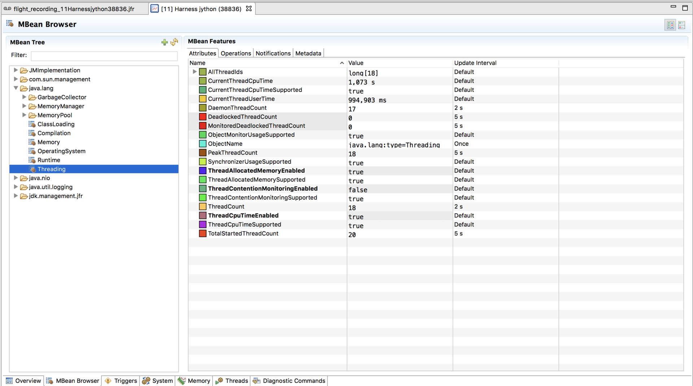

由于篇幅的限制，我就不再介绍[VisualVM](https://visualvm.github.io/index.html) 以及[JITWatch](https://github.com/AdoptOpenJDK/jitwatch) 了。感兴趣的同学可自行下载研究。
