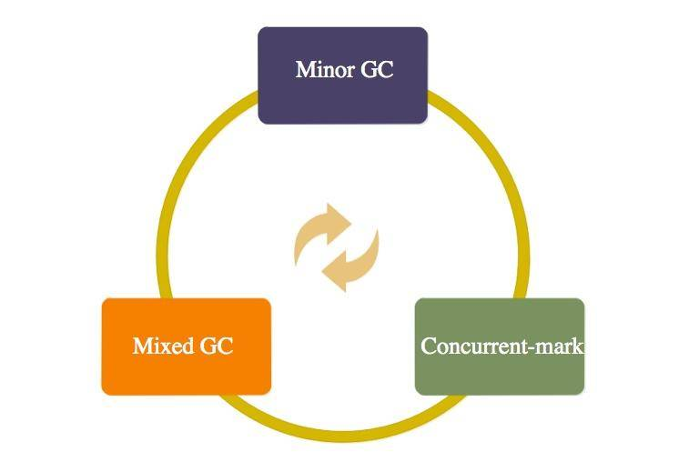
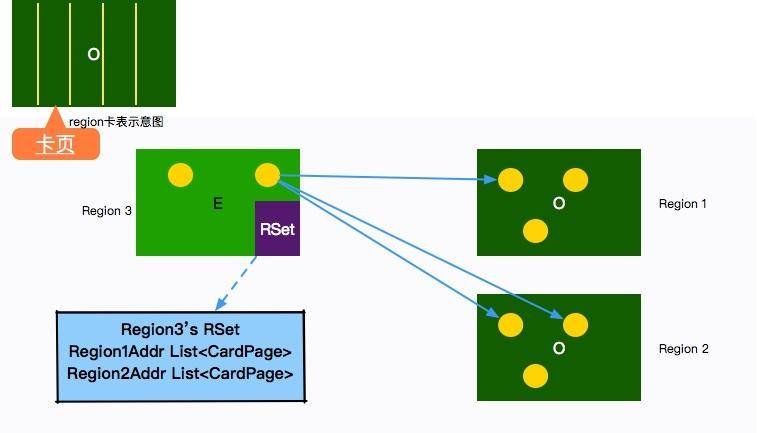
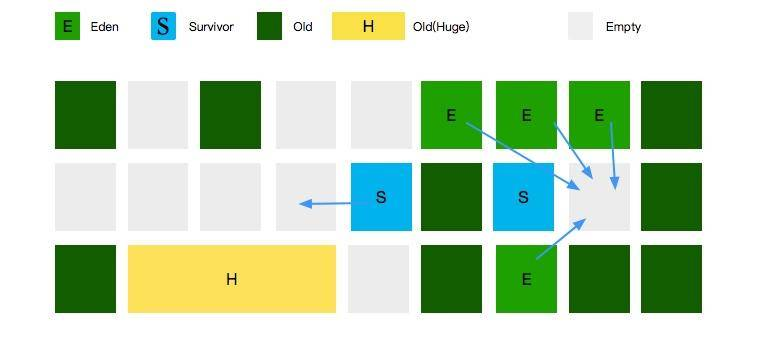
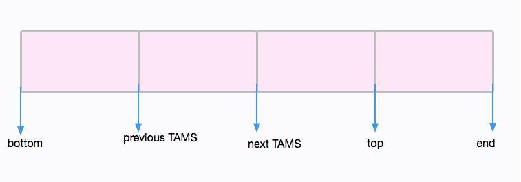
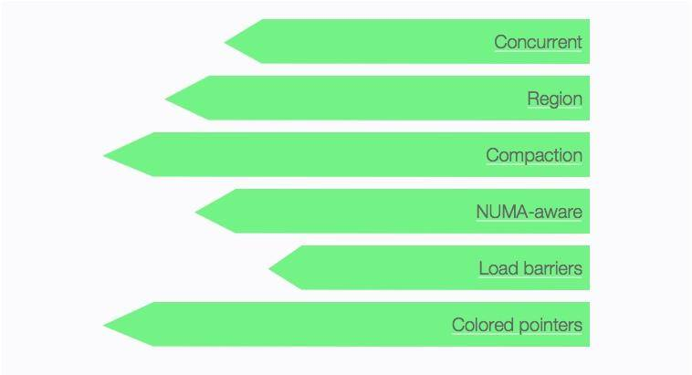

08 大厂面试题：有了 G1 还需要其他垃圾回收器吗？
===========================

本课时我们主要来看下这两个高频的面试考题：

* G1 的回收原理是什么？为什么 G1 比传统 GC 回收性能好？
* 为什么 G1 如此完美仍然会有 ZGC？

我们在上一课时，简要的介绍了 CMS 垃圾回收器，下面我们简单回忆一下它的一个极端场景（而且是经常发生的场景）。

在发生 Minor GC 时，由于 Survivor 区已经放不下了，多出的对象只能提升（promotion）到老年代。但是此时老年代因为空间碎片的缘故，会发生 concurrent mode failure 的错误。这个时候，就需要降级为 Serail Old 垃圾回收器进行收集。这就是比 concurrent mode failure 更加严重的 promotion failed 问题。


一次简单的 Major GC，竟然能演化成耗时最长的 Full GC。最要命的是，这个停顿时间是不可预知的。

有没有一种办法，能够首先定义一个停顿时间，然后反向推算收集内容呢？就像是领导在年初制定 KPI 一样，分配的任务多就多干些，分配的任务少就少干点。

很久之前就有领导教导过我，如果你列的目标太大，看起来无法完成，不要怕。有一个叫作里程碑的名词，可以让我们以小跑的姿态，完成一次马拉松。

G1 的思路说起来也类似，它不要求每次都把垃圾清理的干干净净，它只是努力做它认为对的事情。

我们要求 G1，在任意 1 秒的时间内，停顿不得超过 10ms，这就是在给它制定 KPI。G1 会尽量达成这个目标，它能够推算出本次要收集的大体区域，以增量的方式完成收集。

这也是使用 G1 垃圾回收器不得不设置的一个参数：

\-XX:MaxGCPauseMillis=10

**为什么叫 G1**-----------

G1 的目标是用来干掉 CMS 的，它同样是一款软实时垃圾回收器。相比 CMS，G1 的使用更加人性化。比如，CMS 垃圾回收器的相关参数有 72 个，而 G1 的参数只有 26 个。

G1 的全称是 GarbageFirst GC，为了达成上面制定的 KPI，它和前面介绍的垃圾回收器，在对堆的划分上有一些不同。

其他的回收器，都是对某个年代的整体收集，收集时间上自然不好控制。G1 把堆切成了很多份，把每一份当作一个小目标，部分上目标很容易达成。

那又有一个面试题来啦：G1 有年轻代和老年代的区分吗？


如图所示，G1 也是有 Eden 区和 Survivor 区的概念的，只不过它们在内存上不是连续的，而是由一小份一小份组成的。

这一小份区域的大小是固定的，名字叫作小堆区（Region）。小堆区可以是 Eden 区，也可以是 Survivor 区，还可以是 Old 区。所以 G1 的年轻代和老年代的概念都是逻辑上的。

每一块 Region，大小都是一致的，它的数值是在 1M 到 32M 字节之间的一个 2 的幂值数。

但假如我的对象太大，一个 Region 放不下了怎么办？注意图中有一块面积很大的黄色区域，它的名字叫作 Humongous Region，大小超过 Region 50% 的对象，将会在这里分配。

Region 的大小，可以通过参数进行设置：

\-XX:G1HeapRegionSize= M

那么，回收的时候，到底回收哪些小堆区呢？是随机的么？

这当然不是。事实上，垃圾最多的小堆区，会被优先收集。这就是 G1 名字的由来。**G1 的垃圾回收过程**--------------

在逻辑上，G1 分为年轻代和老年代，但它的年轻代和老年代比例，并不是那么“固定”，为了达到 MaxGCPauseMillis 所规定的效果，G1 会自动调整两者之间的比例。

如果你强行使用 -Xmn 或者 -XX:NewRatio 去设定它们的比例的话，我们给 G1 设定的这个目标将会失效。

G1 的回收过程主要分为 3 类：

（1）G1“年轻代”的垃圾回收，同样叫 Minor GC，这个过程和我们前面描述的类似，发生时机就是 Eden 区满的时候。

（2）老年代的垃圾收集，严格上来说其实不算是收集，它是一个“并发标记”的过程，顺便清理了一点点对象。

（3）真正的清理，发生在“混合模式”，它不止清理年轻代，还会将老年代的一部分区域进行清理。



在 GC 日志里，这个过程描述特别有意思，（1）的过程，叫作 \[GC pause (G1 Evacuation Pause) (young)，而（2）的过程，叫作 \[GC pause (G1 Evacuation Pause) (mixed)。Evacuation 是转移的意思，和 Copy 的意思有点类似。

这三种模式之间的间隔也是不固定的。比如，1 次 Minor GC 后，发生了一次并发标记，接着发生了 9 次 Mixed GC。**RSet**--------

RSet 是一个空间换时间的数据结构。

在第 6 课时中，我们提到过一个叫作卡表（Card Table）的数据结构，用来解决跨代引用的问题。RSet 的功能与此类似，它的全称是 Remembered Set，用于记录和维护 Region 之间的对象引用关系。

但 RSet 与 Card Table 有些不同的地方。Card Table 是一种 points-out（我引用了谁的对象）的结构。而 RSet 记录了其他 Region 中的对象引用本 Region 中对象的关系，属于 points-into 结构（谁引用了我的对象），有点倒排索引的味道。

你可以把 RSet 理解成一个 Hash，key 是引用的 Region 地址，value 是引用它的对象的卡页集合。



有了这个数据结构，在回收某个 Region 的时候，就不必对整个堆内存的对象进行扫描了。它使得部分收集成为了可能。

对于年轻代的 Region，它的 RSet 只保存了来自老年代的引用，这是因为年轻代的回收是针对所有年轻代 Region 的，没必要画蛇添足。所以说年轻代 Region 的 RSet 有可能是空的。

而对于老年代的 Region 来说，它的 RSet 也只会保存老年代对它的引用。这是因为老年代回收之前，会先对年轻代进行回收。这时，Eden 区变空了，而在回收过程中会扫描 Survivor 分区，所以也没必要保存来自年轻代的引用。

RSet 通常会占用很大的空间，大约 5% 或者更高。不仅仅是空间方面，很多计算开销也是比较大的。

事实上，为了维护 RSet，程序运行的过程中，写入某个字段就会产生一个 post-write barrier 。为了减少这个开销，将内容放入 RSet 的过程是异步的，而且经过了很多的优化：Write Barrier 把脏卡信息存放到本地缓冲区（local buffer），有专门的 GC 线程负责收集，并将相关信息传给被引用 Region 的 RSet。

参数 -XX:G1ConcRefinementThreads 或者 -XX:ParallelGCThreads 可以控制这个异步的过程。如果并发优化线程跟不上缓冲区的速度，就会在用户进程上完成。**具体回收过程**----------

G1 还有一个 CSet 的概念。这个就比较好理解了，它的全称是 Collection Set，即收集集合，保存一次 GC 中将执行垃圾回收的区间（Region）。GC 是在 CSet 中的所有存活数据（Live Data）都会被转移。

了解了上面的数据结构，我们再来简要看一下回收过程。

### **年轻代回收**年轻代回收是一个 STW 的过程，它的跨代引用使用 RSet 数据结构来追溯，会一次性回收掉年轻代的所有 Region

JVM 启动时，G1 会先准备好 Eden 区，程序在运行过程中不断创建对象到 Eden 区，当所有的 Eden 区都满了，G1 会启动一次年轻代垃圾回收过程。


年轻代的收集包括下面的回收阶段：

（1）扫描根

根，可以看作是我们前面介绍的 GC Roots，加上 RSet 记录的其他 Region 的外部引用。

（2）更新 RS

处理 dirty card queue 中的卡页，更新 RSet。此阶段完成后，RSet 可以准确的反映老年代对所在的内存分段中对象的引用。可以看作是第一步的补充。

（3）处理 RS

识别被老年代对象指向的 Eden 中的对象，这些被指向的 Eden 中的对象被认为是存活的对象。

（4）复制对象

没错，收集算法依然使用的是 Copy 算法。

在这个阶段，对象树被遍历，Eden 区内存段中存活的对象会被复制到 Survivor 区中空的 Region。这个过程和其他垃圾回收算法一样，包括对象的年龄和晋升，无需做过多介绍。

（5）处理引用

处理 Soft、Weak、Phantom、Final、JNI Weak 等引用。结束收集。

它的大体示意图如下所示。



### **并发标记（Concurrent Marking）**当整个堆内存使用达到一定比例（默认是 45%），并发标记阶段就会被启动。这个比例也是可以调整的，通过参数 -XX:InitiatingHeapOccupancyPercent 进行配置

Concurrent Marking 是为 Mixed GC 提供标记服务的，并不是一次 GC 过程的一个必须环节。这个过程和 CMS 垃圾回收器的回收过程非常类似，你可以类比 CMS 的回收过程看一下。具体标记过程如下：

（1）初始标记（Initial Mark）

这个过程共用了 Minor GC 的暂停，这是因为它们可以复用 root scan 操作。虽然是 STW 的，但是时间通常非常短。

（2）Root 区扫描（Root Region Scan）

（3）并发标记（ Concurrent Mark）

这个阶段从 GC Roots 开始对 heap 中的对象标记，标记线程与应用程序线程并行执行，并且收集各个 Region 的存活对象信息。

（4）重新标记（Remaking）

和 CMS 类似，也是 STW 的。标记那些在并发标记阶段发生变化的对象。

（5）清理阶段（Cleanup）

这个过程不需要 STW。如果发现 Region 里全是垃圾，在这个阶段会立马被清除掉。不全是垃圾的 Region，并不会被立马处理，它会在 Mixed GC 阶段，进行收集。

了解 CMS 垃圾回收器后，上面这个过程就比较好理解。但是还有一个疑问需要稍微提一下。

如果在并发标记阶段，又有新的对象变化，该怎么办？

这是由算法 SATB 保证的。SATB 的全称是 Snapshot At The Beginning，它作用是保证在并发标记阶段的正确性。



这个快照是逻辑上的，主要是有几个指针，将 Region 分成个多个区段。如图所示，并发标记期间分配的对象，都会在 next TAMS 和 top 之间。

### **混合回收（Mixed GC）**能并发清理老年代中的整个整个的小堆区是一种最优情形。混合收集过程，不只清理年轻代，还会将一部分老年代区域也加入到 CSet 中

通过 Concurrent Marking 阶段，我们已经统计了老年代的垃圾占比。在 Minor GC 之后，如果判断这个占比达到了某个阈值，下次就会触发 Mixed GC。这个阈值，由 -XX:G1HeapWastePercent 参数进行设置（默认是堆大小的 5%）。因为这种情况下， GC 会花费很多的时间但是回收到的内存却很少。所以这个参数也是可以调整 Mixed GC 的频率的。

还有参数 G1MixedGCCountTarget，用于控制一次并发标记之后，最多执行 Mixed GC 的次数。**ZGC**-------

你有没有感觉，在系统切换到 G1 垃圾回收器之后，线上发生的严重 GC 问题已经非常少了？

这归功于 G1 的预测模型和它创新的分区模式。但预测模型也会有失效的时候，它并不是总如我们期望的那样运行，尤其是你给它定下一个苛刻的目标之后。

另外，如果应用的内存非常吃紧，对内存进行部分回收根本不够，始终要进行整个 Heap 的回收，那么 G1 要做的工作量就一点也不会比其他垃圾回收器少，而且因为本身算法复杂了，还可能比其他回收器要差。

所以垃圾回收器本身的优化和升级，从来都没有停止过。最新的 ZGC 垃圾回收器，就有 3 个令人振奋的 Flag：

1. 停顿时间不会超过 10ms；
2. 停顿时间不会随着堆的增大而增大（不管多大的堆都能保持在 10ms 以下）；
3. 可支持几百 M，甚至几 T 的堆大小（最大支持 4T）。



在 ZGC 中，连逻辑上的年轻代和老年代也去掉了，只分为一块块的 page，每次进行 GC 时，都会对 page 进行压缩操作，所以没有碎片问题。ZGC 还能感知 NUMA 架构，提高内存的访问速度。与传统的收集算法相比，ZGC 直接在对象的引用指针上做文章，用来标识对象的状态，所以它只能用在 64 位的机器上。

现在在线上使用 ZGC 的还非常少。即使是用，也只能在 Linux 平台上使用。等待它的普及，还需要一段时间。**小结**
------

本课时，我们简要看了下 G1 垃圾回收器的回收过程，并着重看了一下底层的数据结构 RSet。基本思想很简单，但实现细节却特别多。这不是我们的重点，对 G1 详细过程感兴趣的，可以参考纸质书籍。我也会通过其他途径分享一些细节，你也可以关注拉勾教育公众号后进学习群与大家一起多多交流。

相对于 CMS，G1 有了更可靠的驾驭度。而且有 RSet 和 SATB 等算法的支撑，Remark 阶段更加高效。

G1 最重要的概念，其实就是 Region。它采用分而治之，部分收集的思想，尽力达到我们给它设定的停顿目标。

G1 的垃圾回收过程分为三种，其中，并发标记阶段，为更加复杂的 Mixed GC 阶段做足了准备。

以下是一个线上运行系统的 JVM 参数样例。这些参数，现在你都能看懂么？如果有问题可以在评论区讨论。

```
JAVA_OPTS="$JAVA_OPTS -XX:NewRatio=2 -XX:G1HeapRegionSize=8m -XX:MetaspaceSize

=256m -XX:MaxMetaspaceSize=256m -XX:MaxTenuringThreshold=10 -XX:+UseG1GC

 -XX:InitiatingHeapOccupancyPercent=45 -XX:MaxGCPauseMillis=200 -verbose:gc

  -XX:+PrintGCDetails -XX:+PrintGCTimeStamps -XX:+PrintReferenceGC

   -XX:+PrintAdaptiveSizePolicy -XX:+UseGCLogFileRotation -XX:NumberOfGCLogFiles=6

    -XX:GCLogFileSize=32m -Xloggc:./var/run/gc.log.$(date +%Y%m%d%H%M)

     -XX:+HeapDumpOnOutOfMemoryError -XX:HeapDumpPath=./var/run/heap-dump.hprof

      -Dfile.encoding=UTF-8 -Dcom.sun.management.jmxremote -Dcom.sun.management.

      jmxremote.port=${JMX_PORT:-0} -Dcom.sun.management.jmxremote.ssl=false

       -Dcom.sun.management.jmxremote.authenticate=false"

```
