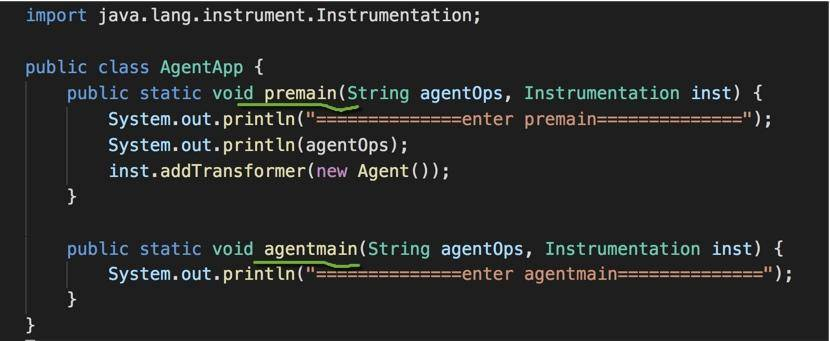
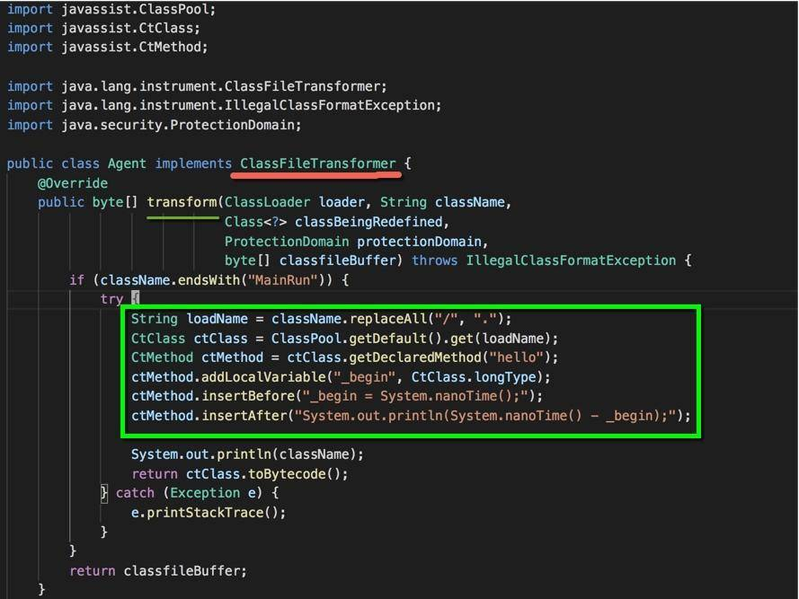
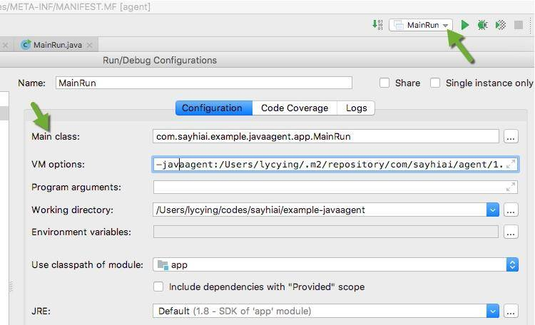
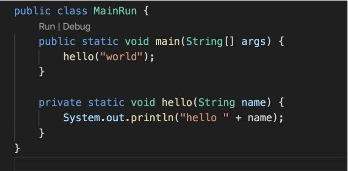

# 22 深入剖析：如何使用 Java Agent 技术对字节码进行修改

本课时我们主要分析如何使用 Java Agent 技术对字节码进行修改。

Java 5 版本以后，JDK 有一个包叫做 instrument ，能够实现一些 **非常酷** 的功能，市面上一些 APM 工具，就是通过它来进行的增强，这个功能对于业务开发者来说，是比较偏门的。但你可能在无意中已经用到它了，比如 **Jrebel** 酷炫的热部署功能（这个工具能够显著增加开发效率）。

本课时将以一个例子来看一下具体的应用场景，然后介绍一个在线上常用的问题排查工具：Arthas。

# Java Agent 介绍

我们上面说的这些工具的基础，就是 Java Agent 技术，可以利用它来构建一个附加的代理程序，用来协助检测性能，还可以替换一些现有功能，甚至 JDK 的一些类我们也能修改，有点像 JVM 级别的 AOP 功能。

通常，Java 入口是一个 main 方法，这是毋庸置疑的，而 Java Agent 的入口方法叫做 premain，表明是在 main 运行之前的一些操作。Java Agent 就是这样的一个 jar 包，定义了一个标准的入口方法，它并不需要继承或者实现任何其他的类，属于无侵入的一种开发模式。

> 为什么叫 premain？这是一个约定，并没有什么其他的理由，这个方法，无论是第一次加载，还是每次新的 ClassLoader 加载，都会执行。

我们可以在这个前置的方法里，对字节码进行一些修改，来增加功能或者改变代码的行为，这种方法没有侵入性，只需要在启动命令中加上 -javaagent 参数就可以了。Java 6 以后，甚至可以通过 attach 的方式，动态的给运行中的程序设置加载代理类。

其实，instrument 一共有两个 main 方法，一个是 premain，另一个是 agentmain，但在一个 JVM 中，只会调用一个；前者是 main 执行之前的修改，后者是控制类运行时的行为。它们还是有一些区别的，agentmain 因为能够动态修改大部分代码，比较危险，限制会更大一些。

# 有什么用

## 获取统计信息

在许多 APM 产品里，比如 Pinpoint、SkyWalking 等，就是使用 Java Agent 对代码进行的增强。通过在方法执行前后动态加入的统计代码，来进行监控信息的收集；通过兼容 OpenTracing 协议，可以实现分布式链路追踪的功能。

它的原理类似于 AOP，最终以字节码的形式存在，性能损失取决于你的代码逻辑。

## 热部署

通过自定义的 ClassLoader，可以实现代码的热替换。使用 agentmain，实现热部署功能会更加便捷，通过 agentmain 获取到 Instrumentation 以后，就可以对类进行动态重定义了。

## 诊断

配合 JVMTI 技术，可以 attach 到某个进程进行运行时的统计和调试，比较流行的 btrace 和 arthas ，其底层就是这种技术。

# 代码示例

要构建一个 agent 程序，大体可分为以下步骤：

- 使用字节码增强工具，编写增强代码；
- 在 manifest 中指定 Premain-Class/Agent-Class 属性；
- 使用参数加载或者使用 attach 方式。

我们来详细介绍一下这个过程。

## 编写 Agent

Java Agent 最终的体现方式是一个 jar 包，使用 IDEA 创建一个默认的 maven 工程即可。

创建一个普通的 Java 类，添加 premain 或者 agentmain 方法，它们的参数完全一样。



## 编写 Transformer

实际的代码逻辑需要实现 ClassFileTransformer 接口。假如我们要统计某个方法的执行时间，使用 JavaAssist 工具来增强字节码，则可以通过以下代码来实现：

- 获取 MainRun 类的字节码实例；
- 获取 hello 方法的字节码实例；
- 在方法前后，加入时间统计，首先定义变量 \_begin，然后追加要写的代码。

别忘了加入 maven 依赖，我们借用 javassist 完成字节码增强：

```
<dependency>

    <groupId>org.javassist</groupId>

    <artifactId>javassist</artifactId>

    <version>3.24.1-GA</version>

</dependency>

```



字节码增强也可以使用 Cglib、ASM 等其他工具。

## MANIFEST.MF 文件

那么我们编写的代码是如何让外界知晓的呢？那就是依靠 MANIFEST.MF 文件，具体路径在

src/main/resources/META-INF/MANIFEST.MF：

```
Manifest-Version: 1.0

premain-class: com.sayhiai.example.javaagent.AgentApp

```

一般的，maven 打包会覆盖这个文件，所以我们需要为它指定一个。

```
<build><plugins><plugin>

<groupId>org.apache.maven.plugins</groupId>

    <artifactId>maven-jar-plugin</artifactId>

    <configuration>

        <archive>

            <manifestFile>src/main/resources/META-INF/MANIFEST.MF</manifestFile>

            </archive>

    </configuration></plugin></plugins></build>

```

然后，在命令行，执行 mvn install 安装到本地代码库，或者使用 mvn deploy 发布到私服上。

附 MANIFEST.MF 参数清单：

```
Premain-Class

Agent-Class

Boot-Class-Path

Can-Redefine-Classes

Can-Retransform-Classes

Can-Set-Native-Method-Prefix

```

## 使用

使用方式取决于你使用的 premain 还是 agentmain，它们之间有一些区别，具体如下。

### premain

在我们的例子中，直接在启动命令行中加入参数即可，在 jvm 启动时启用代理。

```
java -javaagent:agent.jar MainRun

```

在 IDEA 中，可以将参数附着在 jvm options 里。



接下来看一下测试代码。



这是我们的执行类，执行后，直接输出 hello world。通过增强以后，还额外的输出了执行时间，以及一些 debug 信息。其中，debug 信息在 main 方法执行之前输出。


### agentmain

这种模式一般用在一些诊断工具上。使用 **jdk/lib/tools.jar** 中的工具类，可以动态的为运行中的程序加入一些功能。它的主要运行步骤如下：

- 获取机器上运行的所有 JVM 进程 ID；
- 选择要诊断的 jvm；
- 将 jvm 使用 attach 函数链接上；
- 使用 loadAgent 函数加载 agent，动态修改字节码；
- 卸载 jvm。

代码样例如下：

```
import com.sun.tools.attach.VirtualMachine;

import com.sun.tools.attach.VirtualMachineDescriptor;
import java.util.List;
public class JvmAttach {
    public static void main(String[] args)

            throws Exception {

        List<VirtualMachineDescriptor> list = VirtualMachine.list();

        for (VirtualMachineDescriptor vmd : list) {

            if (vmd.displayName().endsWith("MainRun")) {

                VirtualMachine virtualMachine = VirtualMachine.attach(vmd.id());

                virtualMachine.loadAgent("test.jar ", "...");

                //.....

                virtualMachine.detach();

            }

        }

    }

```

这些代码功能虽然强大，但都是比较危险的，这就是为什么 Btrace 说了这么多年，还是只在小范围内被小心的使用。相对来说，Arthas 显的友好而且安全的多。

# 使用注意点

**（1）jar 包依赖方式**一般，Agent 的 jar 包会以 fatjar 的方式提供，即将所有的依赖打包到一个大的 jar 包中。如果你的功能复杂、依赖多，那么这个 jar 包将会特别的大。

使用独立的**bom **文件维护这些依赖是另外一种方法。使用方自行管理依赖问题，但这通常会发生一些找不到 jar 包的错误，更糟糕的是，大多数在运行时才发现。** （2）类名称重复 **不要使用和 jdk 及 instrument 包中相同的类名（包括包名），有时候你能够侥幸过关，但也会陷入无法控制的异常中。** （3）做有限的功能 **可以看到，给系统动态的增加功能是非常酷的，但大多数情况下非常耗费性能。你会发现，一些简单的诊断工具，会占用你 1 核的 CPU，这是很平常的事情。** （4）ClassLoader**

如果你用的 JVM 比较旧，频繁地生成大量的代理类，会造成元空间的膨胀，容易发生内存占用问题。

ClassLoader 有双亲委派机制，如果你想要替换相应的类，一定要搞清楚它的类加载器应该用哪个，否则替换的类，是不生效的。

具体的调试方法，可以在 Java 进程启动时，加入 -verbose:class 参数，用来监视引用程序对类的加载。

# Arthas

我们来回顾一下在故障排查时所做的一些准备和工具支持。

在第 09 课时，我们了解了 jstat 工具，还有 jmap 等查看内存状态的工具；第 11 课时，介绍了超过 20 个工具的使用，这需要开发和分析的人员具有较高的水平；第 15 课时，还介绍了 jstack 的一些典型状态。对于这种瞬时态问题的分析，需要综合很多工具，对刚进入这个行业的人来说，很不友好。

Arthas 就是使用 Java Agent 技术编写的一个工具，具体采用的方式，就是我们上面提到的 attach 方式，它会无侵入的 attach 到具体的执行进程上，方便进行问题分析。

你甚至可以像 debug 本地的 Java 代码一样，观测到方法执行的参数值，甚至做一些统计分析。这通常可以解决下面的问题：

- 哪个线程使用了最多的 CPU
- 运行中是否有死锁，是否有阻塞
- 如何监测一个方法哪里耗时最高
- 追加打印一些 debug 信息
- 监测 JVM 的实时运行状态

[Arthas 官方文档十分详细，也可以点击这里参考](https://alibaba.github.io/arthas)。

但无论工具如何强大，一些基础知识是需要牢固掌握的，否则，工具中出现的那些术语，也会让人一头雾水。

工具常变，但基础更加重要。如果你想要一个适应性更强的技术栈，还是要多花点时间在原始的排查方法上。

# 小结

本课时介绍了开发人员极少接触的 Java Agent 技术，但在平常的工作中你可能不知不觉就用到它了。在平常的面试中，一些面试官也会经常问一些相关的问题，以此来判断你对整个 Java 体系的掌握程度，如果你能回答上来，说明你已经脱颖而出了。

值得注意的是，这个知识点，对于做基础架构（比如中间件研发）的人来说，是必备技能，如果不了解，那面试可能就要凉了。

从实用角度来说，阿里开源的 Arthas 工具，是非常好用的，如果你有线上的运维权限，不妨尝试一下。
