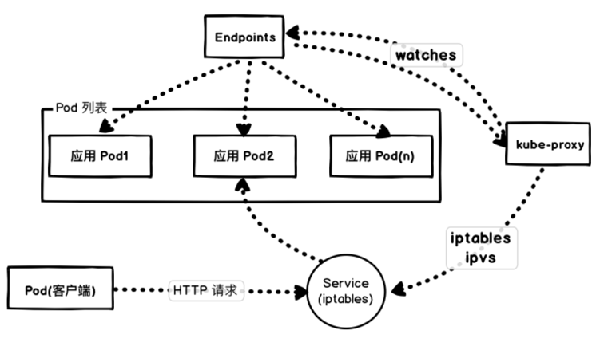

# 04 微服务应用场景下落地 K8s 的困难分析

近些年企业应用开发架构发生了细微的变化，根据康威定律，由于企业组织架构的变化，导致微服务应用体系开始在企业应用开发过程中流行起来。微服务是最近几年企业数字化转型过程中，在技术团队技术选型中比较常见的架构升级方案之一。在这个背景下，DevOps 团队为了应对企业架构的变化，迫切需要使用一套统一的基础设施来维护微服务应用的整个生命周期，这就给我们带来了新的挑战——如何应对微服务应用场景，平稳快速的落地 Kubernetes 集群系统。

### 基于 Kubernetes 下的微服务注册中心的部署问题

经典的微服务体系都是以注册中心为核心，通过 CS 模式让客户端注册到注册中心服务端，其它微服务组件才能互相发现和调用。当我们引入 Kubernetes 之后，因为 Kubernetes 提供了基于 DNS 的名字服务发现，并且提供 Pod 级别的网格，直接打破了原有物理网络的单层结构，让传统的微服务应用和 Kubernetes 集群中的微服务应用无法直接互联互通。为了解决这个问题，很多技术团队会采用如下两种方式来打破解决这种困境。

#### **创建大二层网络，让 Pod 和物理网络互联互通**这个思路主要的目的是不要改变现有网络结构，让 Kubernetes 的网络适应经典网络。每一个 Pod 分配一个可控的网络段 IP。常用的方法有 macvlan、Calico BGP、Contiv 等。这样的做法直接打破了 Kubernetes 的应用架构哲学，让 Kubernetes 成为了一个运行 Pod 的资源池，而上面的更多高级特性 Service，Ingress、DNS 都无法配合使用。随着 Kubernetes 版本迭代，这种阉割功能的 Kubernetes 架构就越来越食之无味弃之可惜了

#### **注册中心部署到 Kubernetes 集群中，外网服务直接使用 IP 注册**

这种思路是当前最流行的方式，也是兼顾历史遗留系统的可以走通的网络部署结构。采用 StatefulSet 和 Headless Service，我们可以轻松地搭建 AP 类型的注册中心集群。当 Client 端连接 Server 端时，如果在 Kubernetes 内部可以采用域名的方式。例如：

```yaml
eureka:
  client:
    serviceUrl:
      defaultZone: http://eureka-0.eureka.default.svc.cluster.local:8761/eureka,http://eureka-1.eureka.default.svc.cluster.local:8761/eureka,http://eureka-2.eureka.default.svc.cluster.local:8761/eureka
```

对于集群外部的微服务，可以直接采用 IP 直连 Servicer 端的 NodeIP，例如：

```yaml
eureka:
  client:
    serviceUrl:
      defaultZone: http://<node-ip>:30030/eureka
```

大家通过上面两种方案肯定都会得出一个结论，如果考虑和传统网络耦合在一起，怎么部署都不是很理想。我们如何解决这样的困局呢？

我们回顾 Kubernetes 设计之初就会发现，它是为数据中心设计的应用基础设施，并没有设计能兼容传统网络的架构，所以才导致我们部署起来感觉怎么操作都不对劲。但是企业内部的业务逻辑复杂，技术团队一般都是小心谨慎地把业务系统慢慢迁移到新的云原生的集群中，所以我们势必又会遇到这样的混合架构的场景。这个时候我们可以借鉴业界实践过的单元化设计，按照网关为边界，划分应用单元，把完整的一套微服务上架到 Kubernetes 中。这样，Kubernetes 集群和外部的服务之间的调用可以采用 RPC/HTTP API 的方式进行异构调用，从而规避打破 Kubernetes 云原生体系。

### 微服务核心能力的优化设计问题

经典微服务架构的内部，服务和服务之间的函数调用，我们通常见过的有 Spring Feign/Dubbo RPC/gRPC ProtoBuf 等。为了能知道服务的所在位置，我们必须有一个注册中心才能获得对方的 IP 调用关系。然后你在结合 Kubernetes 集群的 CoreDNS 的实现，你会自然想到一个问题，如果所有服务组件都在一个 Namespace 之下，它们直接的关系直接可以在配置文件里面写入名字，CoreDNS 是帮助我们实现在集群之下的服务发现的。也就是说，当你把微服务部署到 Kubernetes 之后，像 Eureka 这样的服务基本就是鸡肋了。

很多有经验的架构师会说，道理是这样的，但是例如 Spring Cloud 的微服务体系就是以 Eureka 为中心的，可能不用它不行。这个问题我觉得是历史遗留问题，以 Spring Boot 框架做为基础，我们完全可以基于 Kubernetes 的服务发现能力构建微服务体系。

另外，因为 Kubernetes 的 Pod 设计包含了 SideCar 模型，所以我们可以把通用的微服务关心的限流、熔断、安全 mTLS、灰度发布等特性都放在一个独立的 Sidecar proxy 容器中，代理所有这些通用的容器治理需求。这样就可以极大的解放开发人员的心智模型，专心写业务代码就可以了。大家已经看出来，这不就是服务网格吗？是的，确实融入到服务网格的设计模式中了，但是当前的服务网格参考 Istio 并没有在业界大量落地使用，我们仍需要利用现有的微服务框架自建这样的体系。

另外，微服务体系的业务观测能力，通过 Kubernetes 的生态图，我们可以采用 ELK 收集业务日志，通过 Prometheus 监控加上 Grafana 构建可视化业务模型，更进一步完善微服务的能力设计体系。

### 微服务应用的部署策略痛点

很多微服务应用在部署 Kubernetes 集群时，多采用 Deployment 对象。其实当前 Kubernetes 还提供了 StatefulSet 对象。这个 Workload 对象一般开发者望文生义，以为就是有状态的，需要挂盘才用这个。其实 StatefulSet 还提供了强劲的滚动更新的策略，因为 StatefulSet 对每一个 Pod 都提供了唯一有编号的名字，所以更新的时候可以按照业务需要一个一个地更新容器 Pod。这个其实对业务系统来说特别重要，我甚至认为，微服务的容器服务都应该用上 StatefulSet 而不是 Deployment。Deployment 其实更适合 Node.js、Nginx 这样的无状态需求的应用场景。



另外，微服务部署在 Kubernetes，并不是说你的微服务就是高可用了。你仍然需要提供亲和性/反亲和性策略让 Kubernetes 调度应用到不同的主机上，让业务容器能合理地分布，不至于当出现宕机时直接导致“血崩”现象，并直接影响你的业务系统。示例：

```yaml
affinity:
 podAntiAffinity:
   requiredDuringSchedulingIgnoredDuringExecution:
   - weight: 100
     labelSelector:
       matchExpressions:
       - key: k8s-app
         operator: In
         values:
         - kube-dns
     topologyKey: kubernetes.io/hostname
```

微服务应用在更新过程中，肯定需要更新 Endpoint 和转发规则，这个一直是 Kubernetes 集群的性能瓶颈点，我们可以采用 readinessProbe 和 preStop 让业务更平滑地升级，示例如下：

```yaml
apiVersion: extensions/v1beta1
kind: Deployment
metadata:
  name: nginx
spec:
  replicas: 1
  selector:
    matchLabels:
      component: nginx
  template:
    metadata:
      labels:
        component: nginx
    spec:
      containers:
      - name: nginx
        image: "nginx"
        ports:
        - name: http
          hostPort: 80
          containerPort: 80
          protocol: TCP
        readinessProbe:
          httpGet:
            path: /healthz
            port: 80
            httpHeaders:
            - name: X-Custom-Header
              value: Awesome
          initialDelaySeconds: 15
          timeoutSeconds: 1
        lifecycle:
          preStop:
            exec:
              command: ["/bin/bash", "-c", "sleep 30"]
```

最后，运维团队因为要处理的微服务容器会越来越多，可以给应用容器加上 PodDisruptionBudget 限制，保证在运维过程中不会影响到现有业务，示例如下：

```yaml
apiVersion: policy/v1beta1
kind: PodDisruptionBudget
metadata:
  name: zk-pdb
spec:
  minAvailable: 2
  selector:
    matchLabels:
      app: zookeeper
```

### 总结

在 Kubernetes 中有一个 Service 对象，翻译成中文就是服务对象，很容易和微服务中的服务对上关系，其实它们之间没有任何关系。我们不应该把微服务架构直接生搬硬套地落地到容器集群中，更科学的办法就是熟悉并统筹微服务体系和 Kubernetes 体系中各自的特性，在设计自己的微服务架构时，能详细思考 CI/CD 过程中、发布过程中到底我们需要那些业务需求，然后在分析应该用哪种方案更合适自己的团队，只有这样才能彻底拜托历史包袱，让 Kubernetes 技术能在合适的位置发挥应有的作用。
