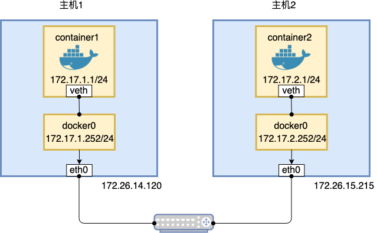

# 10 东西向流量组件 Calico 的落地实践

Kubernetes 网络并没有原生的方案，它从一开始就给我们送来了一个选择题。到底选哪种网络方案才是最佳的方案呢？网络问题一直让社区用户很困惑，以至于在早期，不同场景下的方案如雨后春笋般涌现出来。其中比较优秀的就是今天选择给大家介绍的网络组件 Calico。这里我们要强调的是，Calico 方案并不是唯一方案，我们在社区仍然能看到很多优秀的方案比如 Cilium、OvS、Contiv、Flannel 等，至于选择它来讲解东西向流量的组件落地，实在是当前国内业界大部分的方案都是以 Cailico 实践为主，介绍它可以起到一个案例示范的作用。

### 容器网络路由的原理

众所周知容器原生网络模型基于单机的 veth 虚拟网桥实现，无法跨主机互联互通。如果想让容器跨主机互联互通，需要支持以下 3 点：

1. 网络控制面需要保证容器 IP 的唯一性
1. 两个容器需要放在一个数据平面
1. 需要工具来自动解决容器网络地址转换

这里我们通过一个原生网络路由的例子来帮助大家理解容器网络互联互通的基本原理：



图：Docker 19.03.12 版本直接路由模式图例

#### **分别对主机 1 和主机 2 上的 docker0 进行配置，重启 docker 服务生效** 编辑主机 1 上的 `/etc/docker/daemon.json` 文件，添加内容：`"bip" : "ip/netmask"`

```
{
  "bip": "172.17.1.252/24"
}
```

编辑主机 2 上的 `/etc/docker/daemon.json` 文件，添加内容：`"bip" : "ip/netmask"`。

```
{
  "bip": "172.17.2.252/24"
}
```

主机 1 和主机 2 上均执行如下命令，重启 Docker 服务以使修改后的 docker0 网段生效。

```
systemctl restart docker
```

#### **添加路由规则**

主机 1 上添加路由规则如下：

```
route add -net 172.17.2.0/24 gw 172.26.15.215
```

主机 2 上添加路由规则如下：

```
route add -net 172.17.1.0/24 gw 172.26.14.120
```

理论上配置完路由后应该从主机 1 可以连接到主机 2 的 docker0，实际场景下因为交换机会检查 docker0 的 mac 地址，并把这个非法的地址下的数据包直接 DROP 掉，让跨主机的容器无法想通，但这个并不妨碍我们理解原理。Calico 网络路由原理和以上示范静态路由原理是一致的，那么它是如何实现连通的呢？

安装 Calico 后，主机上检查如下：

```bash
### 主机 1 上的
vxlan.calico: <BROADCAST,MULTICAST,UP,LOWER_UP> mtu 1410 qdisc noqueue state UNKNOWN group default
link/ether 66:18:b6:89:bd:6f brd ff:ff:ff:ff:ff:ff 
inet 192.168.206.0/32 brd 192.168.206.0 scope global vxlan.calico 
### 主机 2 上的
vxlan.calico: <BROADCAST,MULTICAST,UP,LOWER_UP> mtu 1410 qdisc noqueue state UNKNOWN group default
link/ether 66:85:17:26:23:b1 brd ff:ff:ff:ff:ff:ff
inet 192.168.49.0/32 brd 192.168.49.0 scope global vxlan.calico
```

对比可以知道，和上面范例中分配 IP 段一样，Calico 也是为每台主机分配固定的 IP 段保证容器网络 IP 不冲突。我们再来看下路由规则：

```bash
[email protected]:~# route -n
Kernel IP routing table
Destination     Gateway         Genmask         Flags Metric Ref    Use Iface
0.0.0.0         172.26.0.1      0.0.0.0         UG    100    0        0 eth0
172.26.0.0      0.0.0.0         255.255.240.0   U     0      0        0 eth0
172.26.0.1      0.0.0.0         255.255.255.255 UH    100    0        0 eth0
192.168.49.1    0.0.0.0         255.255.255.255 UH    0      0        0 cali3f1b566e6d6
192.168.49.2    0.0.0.0         255.255.255.255 UH    0      0        0 cali408c6db5188
192.168.206.0   172.26.5.8      255.255.255.192 UG    0      0        0 eth0
[email protected]:~# route -n 
Kernel IP routing table
Destination     Gateway         Genmask         Flags Metric Ref    Use Iface
0.0.0.0         172.26.0.1      0.0.0.0         UG    100    0        0 eth0             
172.26.0.0      0.0.0.0         255.255.240.0   U     0      0        0 eth0             
172.26.0.1      0.0.0.0         255.255.255.255 UH    100    0        0 eth0             
192.168.49.0    172.26.8.126    255.255.255.192 UG    0      0        0 eth0             
192.168.206.1   0.0.0.0         255.255.255.255 UH    0      0        0 cali517a7f7f853
192.168.206.3   0.0.0.0         255.255.255.255 UH    0      0        0 cali8d8ae1f64d9
192.168.206.4   0.0.0.0         255.255.255.255 UH    0      0        0 cali99a5d6c4e2d
192.168.206.5   0.0.0.0         255.255.255.255 UH    0      0        0 cali3b6d130f2eb
192.168.206.6   0.0.0.0         255.255.255.255 UH    0      0        0 calid8aeffc724c
```

两台主机路由表上都做了对方 IP 的路由信息。

我们通过部署容器来测试网络连通性：

```bash
[email protected]:~# cat pingtest-deployment.yaml 
apiVersion: apps/v1
kind: Deployment
metadata:
  name: pingtest-deployment
  labels:
    app: pingtest
spec:
  replicas: 3
  selector:
    matchLabels:
      app: pingtest
  template:
    metadata:
      labels:
        app: pingtest
    spec:
      containers:
      - name: pingtest
        image: busybox
        args: ["sleep", "infinity"]
[email protected]:~# kubectl apply -f pingtest-deployment.yaml 
[email protected]:~# kubectl get pod -l app=pingtest -o wide
NAME                                   READY   STATUS        RESTARTS   AGE     IP              NODE              NOMINATED NODE   READINESS GATES
pingtest-deployment-6dcb8d6c77-8ntqf   1/1     Running       0          10m     192.168.49.4    ip-172-26-8-126   <none>           <none>
pingtest-deployment-6dcb8d6c77-l5hq2   1/1     Running       0          10m     192.168.49.5    ip-172-26-8-126   <none>           <none>
pingtest-deployment-6dcb8d6c77-6fcdn   1/1     Running       0          6m48s   192.168.206.7   ip-172-26-5-8     <none>           <none>
```

因为最新的 Calico 默认配置的模式是 vxlanMode 模式，你没有修改路由器的权限，所以需要修改 ipipMode 为 Always。

```json
[email protected]:~# cat pool.json 
{
  "kind": "IPPoolList",
  "apiVersion": "projectcalico.org/v3",
  "metadata": {
    "resourceVersion": "2306"
  },
  "items": [
    {
      "kind": "IPPool",
      "apiVersion": "projectcalico.org/v3",
      "metadata": {
        "name": "default-ipv4-ippool",
        "uid": "0ba1e107-0582-4b7b-b99f-f7105525e987",
        "resourceVersion": "763",
        "creationTimestamp": "2020-08-10T16:59:28Z"
      },
      "spec": {
        "cidr": "192.168.0.0/16",
        "vxlanMode": "Never",
        "ipipMode": "Always",
        "natOutgoing": true,
        "blockSize": 26,
        "nodeSelector": "all()"
      }
    }
  ]
}
```

修改后在命令行下查看路由规则的办法，确认虚拟网络走了 tunnel 网卡口：

```
[email protected]:~# ip route
default via 172.26.0.1 dev eth0 proto dhcp src 172.26.12.198 metric 100 
172.26.0.0/20 dev eth0 proto kernel scope link src 172.26.12.198 
172.26.0.1 dev eth0 proto dhcp scope link src 172.26.12.198 metric 100 
192.168.31.0 via 172.26.5.10 dev tunl0 proto bird onlink 
192.168.31.0/26 via 172.26.5.10 dev eth0 proto 80 onlink 
192.168.31.1 via 172.26.5.10 dev tunl0 proto bird onlink 
192.168.31.3 via 172.26.5.10 dev tunl0 proto bird onlink 
192.168.31.4 via 172.26.5.10 dev tunl0 proto bird onlink 
192.168.31.5 via 172.26.5.10 dev tunl0 proto bird onlink 
192.168.31.7 via 172.26.5.10 dev tunl0 proto bird onlink 
192.168.31.64/26 via 172.26.5.10 dev tunl0 proto bird onlink 
192.168.41.137 dev calie486eacd845 scope link 
192.168.41.138 dev calif383cce9723 scope link 
192.168.41.139 dev calia4f3d6b96e0 scope link 
192.168.41.140 dev cali391d55f6fc3 scope link 
192.168.41.141 dev cali981dc37e1ca scope link 
192.168.41.142 dev calic0a72d40721 scope link 
192.168.41.143 dev calicfb8f80c8c5 scope link 
blackhole 192.168.41.192/26 proto bird 
192.168.41.193 dev calia6f4721616e scope link 
```

通过 kubectl exec 可以进入 Pod 容器进行连通性测试：

```bash
[email protected]:~# kubectl get po -o wide
NAME                                   READY   STATUS    RESTARTS   AGE   IP               NODE               NOMINATED NODE   READINESS GATES
pingtest-deployment-6dcb8d6c77-95vrw   1/1     Running   0          23m   192.168.41.139   ip-172-26-12-198   <none>           <none>
pingtest-deployment-6dcb8d6c77-p4cqx   1/1     Running   0          23m   192.168.41.140   ip-172-26-12-198   <none>           <none>
pingtest-deployment-6dcb8d6c77-kfmhp   1/1     Running   0          23m   192.168.41.137   ip-172-26-12-198   <none>           <none>
pingtest-deployment-6dcb8d6c77-w582x   1/1     Running   0          23m   192.168.41.141   ip-172-26-12-198   <none>           <none>
pingtest-deployment-6dcb8d6c77-ts9fh   1/1     Running   0          23m   192.168.41.138   ip-172-26-12-198   <none>           <none>
pingtest-deployment-6dcb8d6c77-ppt2n   1/1     Running   0          22m   192.168.41.142   ip-172-26-12-198   <none>           <none>
pingtest-deployment-6dcb8d6c77-qw46c   1/1     Running   0          22m   192.168.41.143   ip-172-26-12-198   <none>           <none>
pingtest-deployment-6dcb8d6c77-972zw   1/1     Running   0          22m   192.168.31.7     ip-172-26-5-10     <none>           <none>
[email protected]:~# kubectl exec -it pingtest-deployment-6dcb8d6c77-972zw -- sh
/ # ping 192.168.41.138
PING 192.168.41.138 (192.168.41.138): 56 data bytes
64 bytes from 192.168.41.138: seq=0 ttl=62 time=0.449 ms
64 bytes from 192.168.41.138: seq=1 ttl=62 time=0.501 ms
```

### Calico 网络的性能

```bash
sh-4.4# iperf3 -s
-----------------------------------------------------------
Server listening on 5201
-----------------------------------------------------------
Accepted connection from 172.26.5.10, port 53246
[  5] local 192.168.31.68 port 5201 connected to 172.26.5.10 port 53248
[ ID] Interval           Transfer     Bitrate
[  5]   0.00-1.00   sec  2.42 GBytes  20.8 Gbits/sec
[  5]   1.00-2.00   sec  3.07 GBytes  26.4 Gbits/sec
[  5]   2.00-3.00   sec  2.83 GBytes  24.3 Gbits/sec
[  5]   3.00-4.00   sec  3.05 GBytes  26.2 Gbits/sec
[  5]   4.00-5.00   sec  3.12 GBytes  26.8 Gbits/sec
[  5]   5.00-6.00   sec  2.87 GBytes  24.7 Gbits/sec
[  5]   6.00-7.00   sec  3.02 GBytes  26.0 Gbits/sec
[  5]   7.00-8.00   sec  3.04 GBytes  26.1 Gbits/sec
[  5]   8.00-9.00   sec  3.08 GBytes  26.5 Gbits/sec
[  5]   9.00-10.00  sec  2.93 GBytes  25.2 Gbits/sec
[  5]  10.00-10.04  sec   104 MBytes  24.6 Gbits/sec
- - - - - - - - - - - - - - - - - - - - - - - - -
[ ID] Interval           Transfer     Bitrate
[  5]   0.00-10.04  sec  29.5 GBytes  25.3 Gbits/sec                  receiver
```

在规模配置在 10 台以下的情况下，容器传输效率依赖主机网卡性能，结果说明性能不差。

### 总结

Calico 作为业内常用的方案，它的好处就是灵活配置。因为它有 BGP 协议支持，可以跨数据中心的互联互通。从实践角度来看，它具备复杂场景下灵活配置的特点，所以也在业界主流比较推荐。当然这里我们的目的并不是推荐 Calico，我们仍然需要依据你当前集群的具体需要来规划，让容器网络能更方便的使用。

参考文章：

- [https://docs.docker.com/network/bridge/](https://docs.docker.com/network/bridge/)
- [https://www.tecmint.com/test-network-throughput-in-linux/](https://www.tecmint.com/test-network-throughput-in-linux/)
