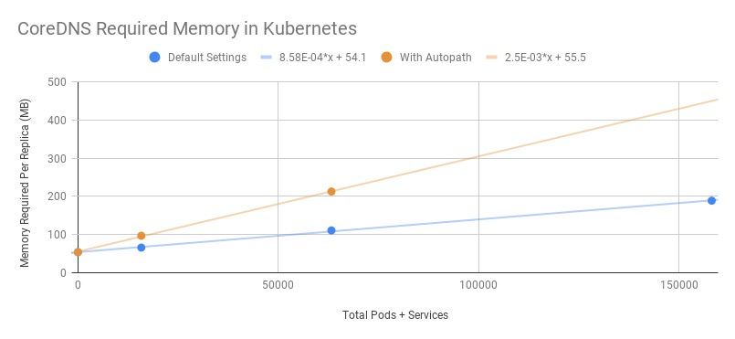

11 服务发现 DNS 的落地实践
=================

DNS 服务是 Kubernetes 内置的服务发现组件，它方便容器服务可以通过发布的唯一 App 名字找到对方的端口服务，再也不需要维护服务对应的 IP 关系。这个对传统企业内部的运维习惯也是有一些变革的。一般传统企业内部都会维护一套 CMDB 系统，专门来维护服务器和 IP 地址的对应关系，方便规划管理好应用服务集群。当落地 K8s 集群之后，因为应用容器的 IP 生命周期短暂，通过 App 名字来识别服务其实对运维和开发都会更方便。所以本篇就是结合实际的需求场景给大家详细介绍 DNS 的使用实践。

### CoreDNS 介绍

Kubernetes 早期的 DNS 组件叫 KubeDNS。CNCF 社区后来引入了更加成熟的开源项目 CoreDNS 替换了 KubeDNS。所以我们现在提到 KubeDNS，其实默认指代的是 CoreDNS 项目。在 Kubernetes 中部署 CoreDNS 作为集群内的 DNS 服务有很多种方式，例如可以使用官方 Helm Chart 库中的 Helm Chart 部署，具体可查看 [CoreDNS Helm Chart](https://github.com/helm/charts/tree/master/stable/coredns)。

```
helm install --name coredns --namespace=kube-system stable/coredns


```

查看 coredns 的 Pod，确认所有 Pod 都处于 Running 状态：

```
kubectl get pods -n kube-system -l k8s-app=kube-dns

NAME                       READY     STATUS    RESTARTS   AGE

coredns-699477c54d-9fsl2   1/1       Running   0          5m

coredns-699477c54d-d6tb2   1/1       Running   0          5m

coredns-699477c54d-qh54v   1/1       Running   0          5m

coredns-699477c54d-vvqj9   1/1       Running   0          5m

coredns-699477c54d-xcv8h   1/1       Running   0          6m


```

测试一下 DNS 功能是否好用：

```
kubectl run curl --image=radial/busyboxplus:curl -i --tty


nslookup kubernetes.default

Server:    10.96.0.10

Address 1: 10.96.0.10 kube-dns.kube-system.svc.cluster.local


Name:      kubernetes

Address 1: 10.96.0.1 kubernetes.default.svc.cluster.local


```

### 服务发现规则

DNS 支持的服务发现是支持 Service 和 Pod 的。它的规则如下。

#### **Services**

A 记录：

* Service（headless Service 除外）将被分配一个 DNS A 记录，格式为 my-svc.my-namespace.svc.cluster.local。该 DNS 记录解析到 Service 的 ClusterIP。
* Headless Service（没有 ClusterIP）也将被分配一个 DNS A 记录，格式为 my-svc.my-namespace.svc.cluster.local。该 DNS 记录解析到 Service 所选中的一组 Pod 的 IP 地址的集合。调用者应该使用该 IP 地址集合，或者按照轮询（round-robin）的方式从集合中选择一个 IP 地址使用。

SRV 记录：Service（含 headless Service）的命名端口（有 name 的端口）将被分配一个 SRV 记录，其格式为 \_my-port-name.\_my-port-protocol.my-svc.my-namespace.svc.cluster.local。

* 对于一个普通 Service（非 headless Service），该 SRV 记录解析到其端口号和域名 my-svc.my-namespace.svc.cluster.local。
* 对于一个 Headless Service，该 SRV 记录解析到多个结果：每一个结果都对应该 Service 的一个后端 Pod，包含其端口号和 Pod 的域名 auto-generated-pod-name.my-svc.my-namespace.svc.cluster.local。

#### **Pods**

Kubernetes 在创建 Pod 时，将 Pod 定义中的 metadata.name 的值作为 Pod 实例的 hostname。

* Pod 定义中有一个可选字段 spec.hostname 可用来直接指定 Pod 的 hostname。例如，某 Pod 的 spec.hostname 字段被设置为 my-host，则该 Pod 创建后 hostname 将被设为 my-host。
* Pod 定义中还有一个可选字段 spec.subdomain 可用来指定 Pod 的 subdomain。例如，名称空间 my-namespace 中，某 Pod 的 hostname 为 foo，并且 subdomain 为 bar，则该 Pod 的完整域名（FQDN）为 foo.bar.my-namespace.svc.cluster.local。

备注：A 记录不是根据 Pod name 创建的，而是根据 hostname 创建的。如果一个 Pod 没有 hostname 只有 subdomain，则 Kubernetes 将只为其 headless Service 创建一个 A 记录 default-subdomain.my-namespace.svc.cluster-domain.example，该记录指向 Pod 的 IP 地址。

### DNS 优化

社区根据压测数据，对 CoreDNS 需要的内存提供了一个计算公式：

```
MB required (default settings) = (Pods + Services) / 1000 + 54


```

注解：

* 30 MB 留给缓存，默认缓存大小为 1 万条记录。
* 5 MB 留给应用查询操作使用，默认压测单例 CoreDNS 支持大约 30K QPS。



### 集成外部 DNS 服务

我们在使用 Kubernetes 的场景中，企业经常已经默认有了自己的 DNS 服务，在部署容器集群的时候，肯定期望和外置的 DNS 服务做一些集成，方便企业内部的使用。

默认 DNS 查询策略是 ClusterFirst，也就是查询应用名字首先是让集群内部的 CoreDNS 提供名字服务。而我们需要解决的是让指定的别名访问外部的服务，这个时候就需要做如下配置：

```
apiVersion: v1


kind: ConfigMap


metadata:


  name: kube-dns


  namespace: kube-system


data:


  stubDomains: |


    {"consul.local": ["10.150.0.1"]}


  upstreamNameservers: |


    ["8.8.8.8", "8.8.4.4"]


```

上面这个例子很好的解释了外置 Consul 服务，也可以很好地集成到 Kubernetes 服务中。如果是正式的域名，直接转向查询 8.8.8.8 上游 DNS 服务器了。

### 总结

CoreDNS 是 Kubernetes 集群中最核心，也是最容易理解的一个组件，它的功能单一，很容易上手。但是名字解析的规则还是需要大家熟悉，避免一些不必要的认知错误。

参考：

* [https://github.com/coredns/deployment/blob/master/kubernetes/Scaling\_CoreDNS.md.html](https://github.com/coredns/deployment/blob/master/kubernetes/Scaling_CoreDNS.md.html)
* [https://kuboard.cn/learning/k8s-intermediate/service/dns.html](https://kuboard.cn/learning/k8s-intermediate/service/dns.html)
