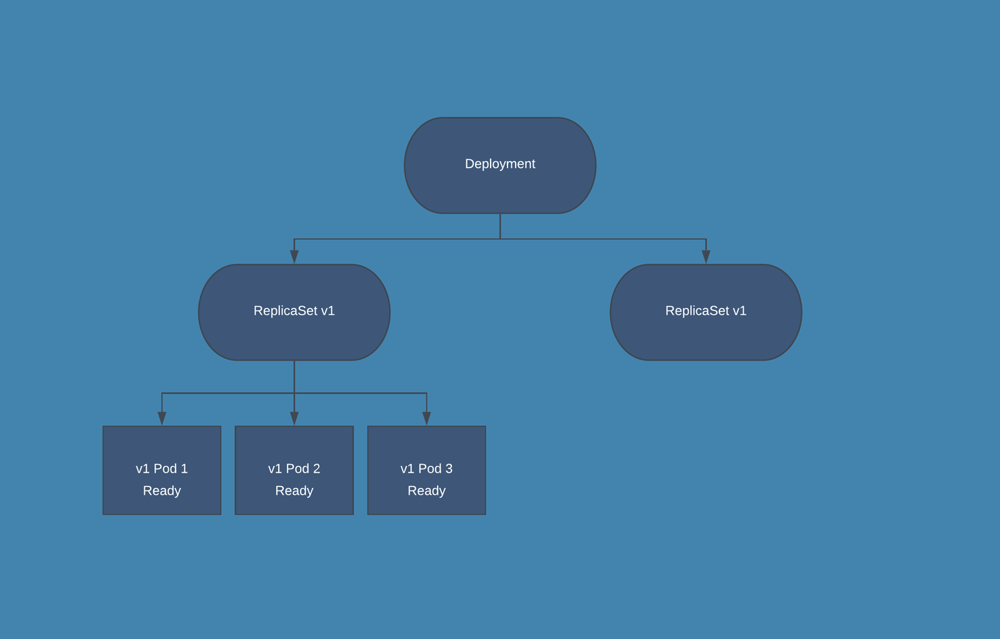

# 17 应用流量的优雅无损切换实践

Kubernetes 的部署基本上都是默认滚动式的，并且保证零宕机，但是它是有一个前置条件的。正是这个前置条件让零宕机部署表现为一个恼人的问题。为了实现 Kubernetes 真正的零宕机部署，不中断或不丢失任何一个运行中的请求，我们需要深入应用部署的运行细节并找到根源进行深入的根源分析。本篇的实践内容继承之前的知识体系，将更深入的总结零宕机部署方法。

### 刨根问底

#### **滚动更新** 我们首先来谈谈滚动更新的问题。根据默认情况，Kubernetes 部署会以滚动更新策略推动 Pod 容器版本更新。该策略的思想就是在执行更新的过程中，至少要保证部分老实例在此时是启动并运行的，这样就可以防止应用程序出现服务停止的情况了。在这个策略的执行过程中，新版的 Pod 启动成功并已经可以引流时才会关闭旧 Pod

Kubernetes 在更新过程中如何兼顾多个副本的具体运行方式提供了策略参数。根据我们配置的工作负载和可用的计算资源，滚动更新策略可以细调超额运行的 Pods（maxSurge）和多少不可用的 Pods （maxUnavailable）。例如，给定一个部署对象要求包含三个复制体，我们是应该立即创建三个新的 Pod，并等待所有的 Pod 启动，并终止除一个 Pod 之外的所有旧 Pod，还是逐一进行更新？下面的代码显示了一个名为 Demo 应用的 Deployment 对象，该应用采用默认的 RollingUpdate 升级策略，在更新过程中最多只能有一个超额运行的 Pods（maxSurge）并且没有不可用的 Pods。

```
kind: Deployment
apiVersion: apps/v1
metadata:
  name: demo
spec:
  replicas: 3
  template:
    # with image docker.example.com/demo:1
    # ...
  strategy:
    type: RollingUpdate
    rollingUpdate:
      maxSurge: 1
      maxUnavailable: 0
```



此部署对象将一次创建一个带有新版本的 Pod，等待 Pod 启动并准备好后触发其中一个旧 Pod 的终止，并继续进行下一个新 Pod，直到所有的副本都被更新。下面显示了 `kubectl get pods` 的输出和新旧 Pods 随时间的变化。

```
 kubectl get pods
NAME                             READY     STATUS             RESTARTS   AGE
demo-5444dd6d45-hbvql   1/1       Running            0          3m
demo-5444dd6d45-31f9a   1/1       Running            0          3m
demo-5444dd6d45-fa1bc   1/1       Running            0          3m
...
demo-5444dd6d45-hbvql   1/1       Running            0          3m
demo-5444dd6d45-31f9a   1/1       Running            0          3m
demo-5444dd6d45-fa1bc   1/1       Running            0          3m
demo-8dca50f432-bd431   0/1       ContainerCreating  0          12s
...
demo-5444dd6d45-hbvql   1/1       Running            0          4m
demo-5444dd6d45-31f9a   1/1       Running            0          4m
demo-5444dd6d45-fa1bc   0/1       Terminating        0          4m
demo-8dca50f432-bd431   1/1       Running            0          1m
...
demo-5444dd6d45-hbvql   1/1       Running            0          5m
demo-5444dd6d45-31f9a   1/1       Running            0          5m
demo-8dca50f432-bd431   1/1       Running            0          1m
demo-8dca50f432-ce9f1   0/1       ContainerCreating  0          10s
...
...
demo-8dca50f432-bd431   1/1       Running            0          2m
demo-8dca50f432-ce9f1   1/1       Running            0          1m
demo-8dca50f432-491fa   1/1       Running            0          30s
```

#### **应用可用性的理想和现实之间的差距** 通过上面的案例看执行效果可知，从旧版本到新版本的滚动更新看起来确实是平滑更新的。然而不希望发生的事情还是发生了，从旧版本到新版本的切换并不总是完美平滑的，也就是说应用程序可能会丢失一些客户端的请求。这是不可以接受的情况

为了真正测试当一个实例被退出服务时，请求是否会丢失。我们不得不对我们的服务进行压力测试并收集结果。我们感兴趣的主要一点是我们的传入的 HTTP 请求是否被正确处理，包括 HTTP 连接是否保持活着。

这里可以使用简单的 Fortio 负载测试工具，用一连续的请求访问 Demo 的 HTTP 端点。例子种配置包括 50 个并发连接 /goroutine，每秒请求比率为 500，测试超时 60 秒。

```
fortio load -a -c 50 -qps 500 -t 60s "<http://example.com/demo>"
```

我们在进行滚动更新部署时同时运行这个测试，如下图报告所示，会有一些连接失败的请求：

```
Fortio 1.1.0 running at 500 queries per second, 4->4 procs, for 20s
Starting at 500 qps with 50 thread(s) [gomax 4] for 20s : 200 calls each (total 10000)
08:49:55 W http_client.go:673> Parsed non ok code 502 (HTTP/1.1 502)
[...]
Code 200 : 9933 (99.3 %)
Code 502 : 67 (0.7 %)
Response Header Sizes : count 10000 avg 158.469 +/- 13.03 min 0 max 160 sum 1584692
Response Body/Total Sizes : count 10000 avg 169.786 +/- 12.1 min 161 max 314 sum 1697861
[...]
```

输出结果表明，并非所有的请求都被成功处理。

#### **了解问题根源**

现在需要搞清楚的问题是，Kubernetes 在滚动更新时将流量重新路由，从一个旧的 Pod 实例版本到新的 Pod 实例版本，到底发生了什么。让我们来看看 Kubernetes 是如何管理工作负载连接的。

假设我们的客户端是直接从集群内部连接到 Demo 服务，通常会使用通过 Cluster DNS 解析的服务虚拟 IP，最后到 Pod 实例。这是通过 kube-proxy 来实现的，kube-proxy 运行在每个 Kubernetes 节点上并动态更新 iptables，让请求路由到 Pod 的 IP 地址。Kubernetes 会更新 Pods 状态中的 endpoints 对象，因此 demo 服务只包含准备处理流量的 Pods。

还有一个情况，客户端流量是从 ingress 方式连接到 Pods 实例，它的连接方式不一样。滚动更新时应用请求会有不同的请求宕机行为。如 Nginx Ingress 是直接把 Pod IP 地址的 endpoints 对象观察起来，有变化时将重载 Nginx 实例，导致流量中断。

当然我们应该需要知道的是，Kubernetes 的目标时在滚动更新过程中尽量减少服务中断。一旦一个新的 Pod 还活着并且准备提供服务时，Kubernetes 就会将一个旧的 Pod 从 Service 中移除，具体操作是将 Pod 的状态更新为 Terminating，将其从 endpoints 对象中移除，并发送一个 SIGTERM 。SIGTERM 会导致容器以一种优雅的方式（需要应用程序能正确处理）关闭，并且不接受任何新的连接。在 Pod 被驱逐出 endpoints 对象后，负载均衡器将把流量路由到剩余的（新的）对象上。注意此时，Pod 在负载均衡器注意到变化并更新其配置的时候，移出 endpoints 对象记录和重新刷新负载均衡配置是异步发生的，因此不能保证正确的执行顺序还可能会导致一些请求被路由到终止的 Pod，这就是在部署过程中造成应用可用性差的真实原因。

### 实现零故障部署

现在我们的目标就是如何增强我们的应用程序能力，让它以真正的零宕机更新版本。

首先，实现这个目标的前提条件是我们的容器要能正确处理终止信号，即进程会在 SIGTERM 上优雅地关闭。如何实现可以网上查阅应用优雅关闭的最佳实践，这里不在赘述。

下一步是加入就绪探针，检查我们的应用是否已经准备好处理流量。理想情况下，探针已经检查了需要预热的功能的状态，比如缓存或数据库初始化。

为了解决 Pod terminations 目前没有阻塞和等待直到负载均衡器被重新配置的问题，包含一个 preStop 生命周期钩子。这个钩子会在容器终止之前被调用。生命周期钩子是同步的，因此必须在向容器发送最终终止信号之前完成。

在下面的例子中，在 SIGTERM 信号终止应用进程之前使用 preStop 钩子来等待 120 秒，并且同时 Kubernetes 将从 endpoints 对象中移除 Pod。这样可以确保在生命周期钩子等待期间，负载均衡器可以正确的刷新配置。

为了实现这个行为，在 demo 应用部署中定义一个 preStop 钩子如下：

```
kind: Deployment
apiVersion: apps/v1beta1
metadata:
  name: demo
spec:
  replicas: 3
  template:
    spec:
      containers:
      - name: zero-downtime
        image: docker.example.com/demo:1
        livenessProbe:
          # ...
        readinessProbe:
          # ...
        lifecycle:
          preStop:
            exec:
              command: ["/bin/bash", "-c", "sleep 120"]
  strategy:
    # ...
```

使用负载测试工具重新测试，发现失败的请求数为零，终于实现无损流量的更新。

```
Fortio 1.1.0 running at 500 queries per second, 4->4 procs, for 20s
Starting at 500 qps with 50 thread(s) [gomax 4] for 20s : 200 calls each (total 10000)
[...]
Code 200 : 10000 (100.0 %)
Response Header Sizes : count 10000 avg 159.530 +/- 0.706 min 154 max 160 sum 1595305
Response Body/Total Sizes : count 10000 avg 168.852 +/- 2.52 min 161 max 171 sum 1688525
[...]
```

### 实践总结

应用的滚动更新是流量平滑切换的原子操作基础。只有让 Kubernetes 能正确处理滚动更新，才有可能实现应用流量的无损更新。在此基础之上，通过部署多套 Ingress 资源来引入流量是可以解决平滑流量的切换的。另外，因为 Helm 支持部署一套应用的多个版本，通过版本的选择也是可以快速切换流量的。这样的技巧都是基于最底层的 Pod 能保证不中断请求才行。

### 参考资料

- [https://kubernetes.io/docs/tutorials/kubernetes-basics/update/update-intro/](https://kubernetes.io/docs/tutorials/kubernetes-basics/update/update-intro/)
