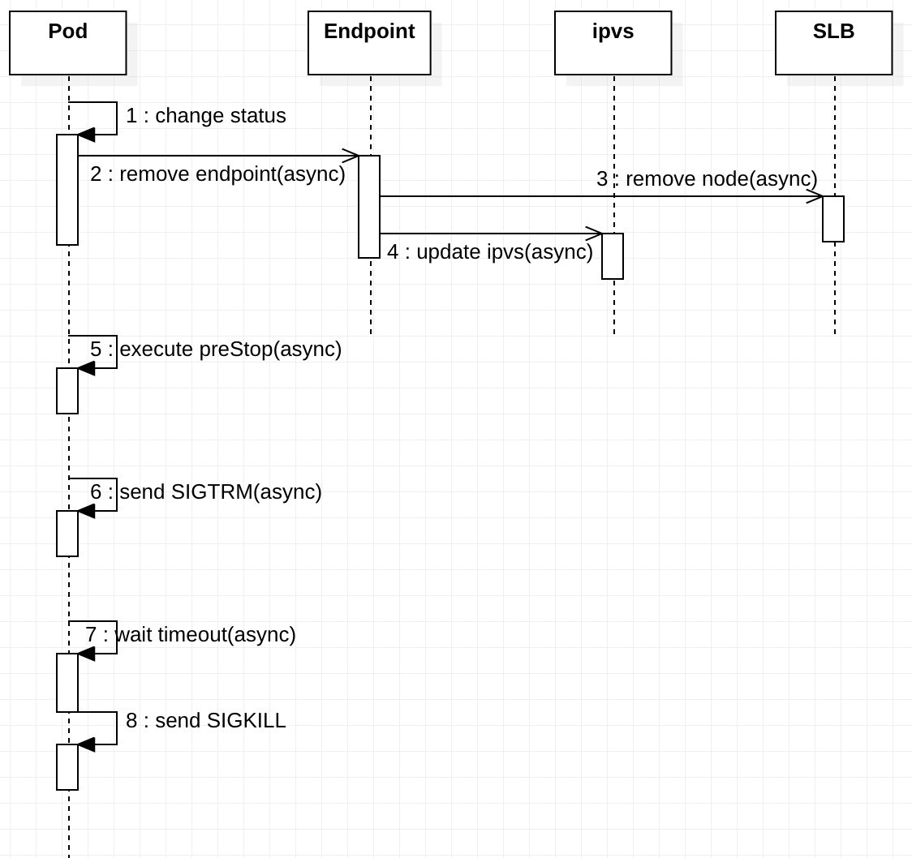
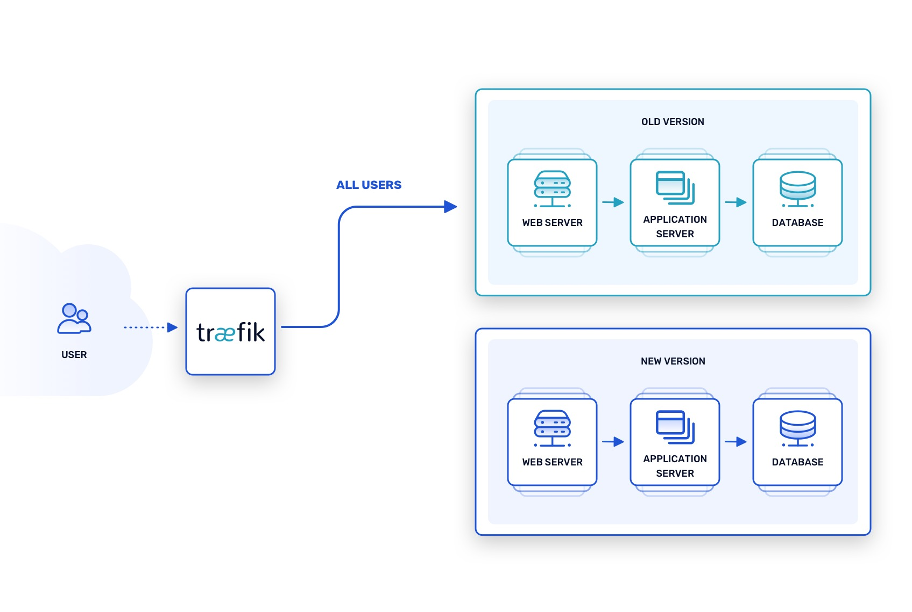
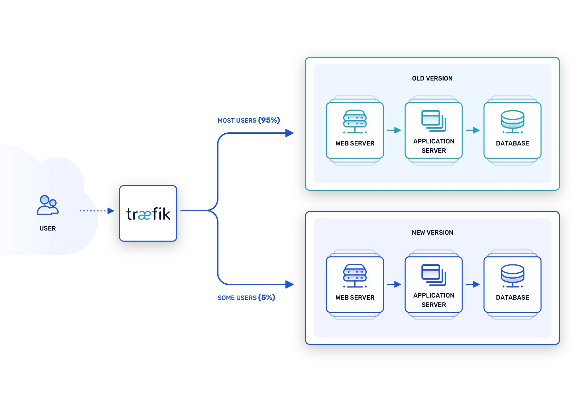
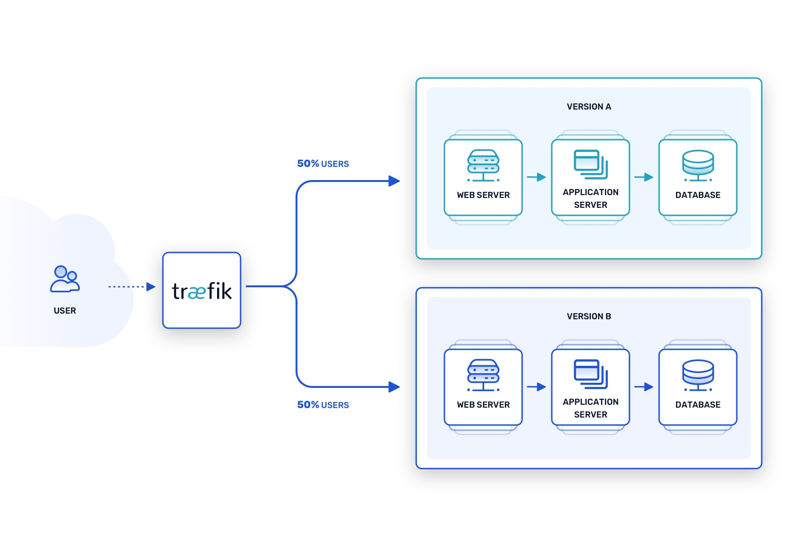

18 练习篇：应用流量无损切换技术测验
===================

经过连续 5 篇相关应用流量引流相关的技术探讨，相信大家已经对 Kubernetes 的服务引流架构有了更深入的了解。常言道好记性不如烂笔头，笔者在反复练习这些参数的过程中，也是费劲了很大的一段时间才对 Kubernetes 的集群引流技术有了一些运用。以下的练习案例都是笔者认为可以加固自身知识体系的必要练习，还请大家跟随我的记录一起练习吧。

### 练习 1：Deployment 下实现无损流量应用更新

我们在更新应用的时候，往往会发现即使发布应用的时候 Kubernetes 采用了滚动更新的策略，应用流量还是会秒断一下。这个困惑在于官方文档资料的介绍中这里都是重点说可以平滑更新的。注意这里，它是平滑更新，并不是无损流量的更新。所以到底问题出在哪里呢。笔者查阅了资料，发现核心问题是 Pod 生命周期中应用的版本更新如下图，关联对象资源如 Pod、Endpoint、IPVS、Ingress/SLB 等资源的更新操作都是异步执行的。往往流量还在处理中，Pod 容器就有可能给如下图：



依据 Pod 容器进程生命周期流程图中，容器进程的状态变更都是异步的，如果应用部署对象 Deployment 不增加 lifecycle 参数 preStop 的配置，即使南北向流量关闭了，进程仍然还需要几秒钟处理正在执行中的会话数据，才可以优雅退出。以下为应用部署 Deployment 对象的声明式配置：

```yaml
apiVersion: apps/v1

kind: Deployment

metadata:

  name: nginx

spec:

  replicas: 1

  selector:

    matchLabels:

      component: nginx

  progressDeadlineSeconds: 120

  strategy:

    type: RollingUpdate

    rollingUpdate:

      maxUnavailable: 0

  template:

    metadata:

      labels:

        component: nginx

    spec:

      terminationGracePeriodSeconds: 60

      containers:

      - name: nginx

        image: xds2000/nginx-hostname

        ports:

        - name: http

          containerPort: 80

          protocol: TCP

        readinessProbe:

          httpGet:

            path: /

            port: 80

            httpHeaders:

            - name: X-Custom-Header

              value: Awesome

          initialDelaySeconds: 15

          periodSeconds: 3

          timeoutSeconds: 1

        lifecycle:

          preStop:

            exec:

              command: ["/bin/bash", "-c", "sleep 10"]


```

就绪探测器（readinessProbe）可以知道容器什么时候准备好了并可以开始接受请求流量， 当一个 Pod 内的所有容器都准备好了，才能把这个 Pod 看作就绪。 这种信号的一个用途就是控制哪个 Pod 作为 Service 的后端。 在 Pod 还没有准备好的时候，会从 Service 的负载均衡器中剔除 Pod。periodSeconds 字段指定了 kubelet 每隔 3 秒执行一次存活探测。initialDelaySeconds 字段告诉 kubelet 在执行第一次探测前应该等待 15 秒。

kubectl 工具手动删除某个特定的 Pod，而该 Pod 的优雅终止限期默认值是 30 秒。preStop 回调所需要的时间长于默认的优雅终止限期，你必须修改 terminationGracePeriodSeconds 属性值来使其正常工作。

如果 Pod 中的容器之一定义了 preStop 回调，kubelet 开始在容器内运行该回调逻辑。如果超出体面终止限期时，preStop 回调逻辑 仍在运行，kubelet 会请求给予该 Pod 的宽限期一次性增加 2 秒钟。

在熟练掌握这些生命周期的配置属性后，单个 Pod 的流量就可以优雅处理，这个原子能力的处理让上层高级对象的处理也可以原生支持无损流量的切换。

### 练习 2：Ingress-nginx 流量无损切换更新应用

Ingress 对象是 Kubernetes 设计的引流对象，它直接监听 Service 的 Endpoints 接口列表的变化来更新负载均衡的接口列表，当前 ingress-nginx 的负载均衡算法已经采用 Lua 编写的 **数加权移动平均（EWMA）算法** 来实现流量的平滑处理。以下例子以 Nginx OSS 版本的 Ingress 来作为范例帮助大家理解。案例如下：

```bash
# 安装 Ingress

kubectl apply -f https://raw.githubusercontent.com/kubernetes/ingress-nginx/controller-0.32.0/deploy/static/provider/cloud/deploy.yaml

# 验证

❯ kubectl get pods --all-namespaces -l app.kubernetes.io/name=ingress-nginx

NAMESPACE       NAME                                        READY   STATUS      RESTARTS   AGE

ingress-nginx   ingress-nginx-admission-create-j5f8z        0/1     Completed   0          11m

ingress-nginx   ingress-nginx-admission-patch-btfd4         0/1     Completed   1          11m

ingress-nginx   ingress-nginx-controller-866488c6d4-snp4s   1/1     Running     0          11m


```

加载应用：

```
kubectl create -f sample/apple.yaml


# sample/apple.yaml

kind: Pod

apiVersion: v1

metadata:

  name: apple-app

  labels:

    app: apple

    version: apple-v1

spec:

  containers:

    - name: apple-app

      image: hashicorp/http-echo

      args:

        - "-text=apple"


---


kind: Service

apiVersion: v1

metadata:

  name: apple-service

spec:

  selector:

    version: apple-v1

  ports:

    - port: 5678 # Default port for image


```

加载应用：

```
kubectl create -f sample/banana.yaml


# sample/banana.yaml

kind: Pod

apiVersion: v1

metadata:

  name: banana-app

  labels:

    app: banana

    version: banana-v1

spec:

  containers:

    - name: banana-app

      image: hashicorp/http-echo

      args:

        - "-text=banana"


---


kind: Service

apiVersion: v1

metadata:

  name: banana-service

spec:

  selector:

    version: banana-v1

  ports:

    - port: 5678 # Default port for image


```

加载 Ingress 规则：

```yaml
# sample/ingress.yaml

apiVersion: extensions/v1beta1

kind: Ingress

metadata:

  name: example-ingress

  annotations:

    ingress.kubernetes.io/rewrite-target: /

spec:

  rules:

  - http:

      paths:

        - path: /apple

          backend:

            serviceName: apple-service

            servicePort: 5678

        - path: /banana

          backend:

            serviceName: banana-service

            servicePort: 5678


```

当你切换 ingress.yaml 里面的路由规则的时候，反向代理就会 reload 更新一次，连接就会中断。为了解决这个问题，我们必须防止 Ingress 发生变更，只在 Service 对象通过更新 selector 的方式变更 Endpoints 对象集合，因为 Ingress 的更新机制就是监听 Endpoints，会自动热加载更改代理配置，实现无重启的流量切换。更新例子如下：

```bash
# 这里 Service 的更新会触发 IPVS 更新 endpoints 的 Pod 地址，

export RELEASE_VERSION=banana-v2

kubectl patch svc default-www -p '{"spec":{"selector":{"version":"'${RELEASE_VERSION}'"}}}'


```

Ingress 监听 Endpoints 的 lua 函数如下：

```lua
# https://github.com/kubernetes/ingress-nginx/blob/8f413c4231a727b28c4c137a0fb3f7a790f156c4/rootfs/etc/nginx/lua/util.lua#L100


-- diff_endpoints compares old and new

-- and as a first argument returns what endpoints are in new

-- but are not in old, and as a second argument it returns

-- what endpoints are in old but are in new.

-- Both return values are normalized (ip:port).

function _M.diff_endpoints(old, new)

  local endpoints_added, endpoints_removed = {}, {}

  local normalized_old = normalize_endpoints(old)

  local normalized_new = normalize_endpoints(new)


  for endpoint_string, _ in pairs(normalized_old) do

    if not normalized_new[endpoint_string] then

      table.insert(endpoints_removed, endpoint_string)

    end

  end


  for endpoint_string, _ in pairs(normalized_new) do

    if not normalized_old[endpoint_string] then

      table.insert(endpoints_added, endpoint_string)

    end

  end


  return endpoints_added, endpoints_removed

end


```

### 练习 3：通过 Traefik 实现零停机时间部署

因为 Traefik 可以直接和 Kubernetes Apiserver 进行交互，所以对于流量的切换和部署会比 ingress-nginx 更加便捷。Traefik 在 Kubernetes 中也是一个 Ingress 对象，在第二个练习中我们已经介绍了通过 Service 的 selector 切换实现无损流量的部署方法，第三个例子我们介绍另外三种比较流行的方法，蓝绿部署、金丝雀发布和 A/B 测试。虽然这三种方式都有关联，但也各有不同。

通过 Kubernetes 不可变基础设施的支持，我们可以让同一软件的多个版本实例在同一集群内服务于请求，这种模式会让试验变得非常有趣。像这样混合使用新旧版本，就可以配置路由规则来测试生产环境的最新版本。更重要的是，新版本可以逐步发布——如果出现问题，甚至可以撤回——所有这一切几乎都没有停机时间。

蓝绿发布模式下，"绿色 "指的是应用的当前稳定版本，而“蓝色”指的是引入新功能和修复的即将发布的版本。两个版本的实例同时在同一生产环境中运行。同时，代理服务（如 Traefik）确保只有发送到私有地址的请求才能到达蓝色实例。例子如下图：



金丝雀发布模式将蓝绿测试又向前推进了一步，用一种谨慎的方式将新功能和补丁部署到活跃的生产环境中。路由配置让当前的稳定版本处理大多数请求，但有限比例的请求会被路由到新的“金丝雀”版本的实例。例子如下：



A/B 测试技术有时会与前两种技术混淆，但它有自己的目的，即评估即将发布的版本的两个不同的版本，看看哪个版本会更成功。这种策略在 UI 开发中很常见。例如，假设一个新功能很快就会推出到应用程序中，但不清楚如何最好地将其暴露给用户。为了找出答案，包括该功能在内的两个版本的 UI，同时运行 A 版本和 B 版本，代理路由器向每个版本发送有限数量的请求。例子如下：



这些技术对于测试现代的云原生软件架构是非常宝贵的，尤其是与传统的瀑布式部署模型相比。如果使用得当，它们可以帮助发现生产环境中不可预见的回归、集成失败、性能瓶颈和可用性问题，但要在新代码进入稳定的生产版本之前。

这三种方法的共同点是，它们依靠容器和 Kubernetes 提供的部署便利性，加上云原生网络技术，将请求路由到可测试的部署，同时最大限度地减少对生产代码的干扰。这是一个强大的组合——这正是 Traefik 的优势所在——如果明智地使用，它可以有效地将整体应用程序的停机时间降至零。

### 总结

应用的流量更新复杂程度涉及到应用状态的变更，以上的例子只是在有限的环境中验证无损流量的切换思路。在真实场景中，我们还需要考虑数据库，业务系统等关联应用的影响，很难像习题中一样直接用无状态应用来随意切换。但是这些因素都不妨碍我们确认一个事实，Kubernetes 确实可以通过参数实现无损流量的切换，它是可行的一套基础设施，你需要深入理解并掌握这些基本对象的实现细节，通过合理的配置就可以实现你需要的不可变基础设施。

### 参考资料

* [https://kubernetes.io/zh/docs/concepts/workloads/pods/pod-lifecycle/](https://kubernetes.io/zh/docs/concepts/workloads/pods/pod-lifecycle/)
* [https://itnext.io/improving-zero-downtime-on-kubernetes-95e3a2f623ba](https://itnext.io/improving-zero-downtime-on-kubernetes-95e3a2f623ba)
* [https://github.com/kubernetes/ingress-nginx/blob/0549d9b132f54d0ac8d956bc78427cd2734ffdcd/rootfs/etc/nginx/lua/balancer/ewma.lua](https://github.com/kubernetes/ingress-nginx/blob/0549d9b132f54d0ac8d956bc78427cd2734ffdcd/rootfs/etc/nginx/lua/balancer/ewma.lua)
* [https://traefik.io/blog/achieve-zero-downtime-deployments-with-traefik-and-kubernetes/](https://traefik.io/blog/achieve-zero-downtime-deployments-with-traefik-and-kubernetes/)
