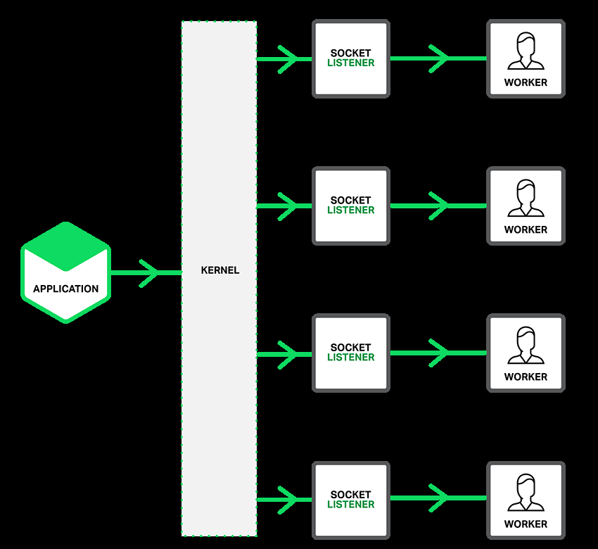

# 35 基础篇：C10K 和 C1000K 回顾

你好，我是倪朋飞。

前面内容，我们学习了 Linux 网络的基础原理以及性能观测方法。简单回顾一下，Linux 网络基于 TCP/IP 模型，构建了其网络协议栈，把繁杂的网络功能划分为应用层、传输层、网络层、网络接口层等四个不同的层次，既解决了网络环境中设备异构的问题，也解耦了网络协议的复杂性。

基于 TCP/IP 模型，我们还梳理了 Linux 网络收发流程和相应的性能指标。在应用程序通过套接字接口发送或者接收网络包时，这些网络包都要经过协议栈的逐层处理。我们通常用带宽、吞吐、延迟、PPS 等来衡量网络性能。

今天，我们主要来回顾下经典的 C10K 和 C1000K 问题，以更好理解 Linux 网络的工作原理，并进一步分析，如何做到单机支持 C10M。

注意，C10K 和 C1000K 的首字母 C 是 Client 的缩写。C10K 就是单机同时处理 1 万个请求（并发连接 1 万）的问题，而 C1000K 也就是单机支持处理 100 万个请求（并发连接 100 万）的问题。

## C10K

[C10K 问题](http://www.kegel.com/c10k.html)最早由 Dan Kegel 在 1999 年提出。那时的服务器还只是 32 位系统，运行着 Linux 2.2 版本（后来又升级到了 2.4 和 2.6，而 2.6 才支持 x86_64），只配置了很少的内存（2GB）和千兆网卡。

怎么在这样的系统中支持并发 1 万的请求呢？

从资源上来说，对 2GB 内存和千兆网卡的服务器来说，同时处理 10000 个请求，只要每个请求处理占用不到 200KB（2GB/10000）的内存和 100Kbit （1000Mbit/10000）的网络带宽就可以。所以，物理资源是足够的，接下来自然是软件的问题，特别是网络的 I/O 模型问题。

说到 I/O 的模型，我在文件系统的原理中，曾经介绍过文件 I/O，其实网络 I/O 模型也类似。在 C10K 以前，Linux 中网络处理都用同步阻塞的方式，也就是每个请求都分配一个进程或者线程。请求数只有 100 个时，这种方式自然没问题，但增加到 10000 个请求时，10000 个进程或线程的调度、上下文切换乃至它们占用的内存，都会成为瓶颈。

既然每个请求分配一个线程的方式不合适，那么，为了支持 10000 个并发请求，这里就有两个问题需要我们解决。

第一，怎样在一个线程内处理多个请求，也就是要在一个线程内响应多个网络 I/O。以前的同步阻塞方式下，一个线程只能处理一个请求，到这里不再适用，是不是可以用非阻塞 I/O 或者异步 I/O 来处理多个网络请求呢？

第二，怎么更节省资源地处理客户请求，也就是要用更少的线程来服务这些请求。是不是可以继续用原来的 100 个或者更少的线程，来服务现在的 10000 个请求呢？

当然，事实上，现在 C10K 的问题早就解决了，在继续学习下面的内容前，你可以先自己思考一下这两个问题。结合前面学过的内容，你是不是已经有了解决思路呢？

### I/O 模型优化

异步、非阻塞 I/O 的解决思路，你应该听说过，其实就是我们在网络编程中经常用到的 I/O 多路复用（I/O Multiplexing）。I/O 多路复用是什么意思呢？

别急，详细了解前，我先来讲两种 I/O 事件通知的方式：水平触发和边缘触发，它们常用在套接字接口的文件描述符中。

- 水平触发：只要文件描述符可以非阻塞地执行 I/O ，就会触发通知。也就是说，应用程序可以随时检查文件描述符的状态，然后再根据状态，进行 I/O 操作。
- 边缘触发：只有在文件描述符的状态发生改变（也就是 I/O 请求达到）时，才发送一次通知。这时候，应用程序需要尽可能多地执行 I/O，直到无法继续读写，才可以停止。如果 I/O 没执行完，或者因为某种原因没来得及处理，那么这次通知也就丢失了。

接下来，我们再回过头来看 I/O 多路复用的方法。这里其实有很多实现方法，我带你来逐个分析一下。

**第一种，使用非阻塞 I/O 和水平触发通知，比如使用 select 或者 poll。**根据刚才水平触发的原理，select 和 poll 需要从文件描述符列表中，找出哪些可以执行 I/O ，然后进行真正的网络 I/O 读写。由于 I/O 是非阻塞的，一个线程中就可以同时监控一批套接字的文件描述符，这样就达到了单线程处理多请求的目的。

所以，这种方式的最大优点，是对应用程序比较友好，它的 API 非常简单。

但是，应用软件使用 select 和 poll 时，需要对这些文件描述符列表进行轮询，这样，请求数多的时候就会比较耗时。并且，select 和 poll 还有一些其他的限制。

select 使用固定长度的位相量，表示文件描述符的集合，因此会有最大描述符数量的限制。比如，在 32 位系统中，默认限制是 1024。并且，在 select 内部，检查套接字状态是用轮询的方法，再加上应用软件使用时的轮询，就变成了一个 O(n2) 的关系。

而 poll 改进了 select 的表示方法，换成了一个没有固定长度的数组，这样就没有了最大描述符数量的限制（当然还会受到系统文件描述符限制）。但应用程序在使用 poll 时，同样需要对文件描述符列表进行轮询，这样，处理耗时跟描述符数量就是 O(N) 的关系。

除此之外，应用程序每次调用 select 和 poll 时，还需要把文件描述符的集合，从用户空间传入内核空间，由内核修改后，再传出到用户空间中。这一来一回的内核空间与用户空间切换，也增加了处理成本。

有没有什么更好的方式来处理呢？答案自然是肯定的。**第二种，使用非阻塞 I/O 和边缘触发通知，比如 epoll** 。

既然 select 和 poll 有那么多的问题，就需要继续对其进行优化，而 epoll 就很好地解决了这些问题。

- epoll 使用红黑树，在内核中管理文件描述符的集合，这样，就不需要应用程序在每次操作时都传入、传出这个集合。
- epoll 使用事件驱动的机制，只关注有 I/O 事件发生的文件描述符，不需要轮询扫描整个集合。

不过要注意，epoll 是在 Linux 2.6 中才新增的功能（2.4 虽然也有，但功能不完善）。由于边缘触发只在文件描述符可读或可写事件发生时才通知，那么应用程序就需要尽可能多地执行 I/O，并要处理更多的异常事件。

**第三种，使用异步 I/O（Asynchronous I/O，简称为 AIO）**。在前面文件系统原理的内容中，我曾介绍过异步 I/O 与同步 I/O 的区别。异步 I/O 允许应用程序同时发起很多 I/O 操作，而不用等待这些操作完成。而在 I/O 完成后，系统会用事件通知（比如信号或者回调函数）的方式，告诉应用程序。这时，应用程序才会去查询 I/O 操作的结果。

异步 I/O 也是到了 Linux 2.6 才支持的功能，并且在很长时间里都处于不完善的状态，比如 glibc 提供的异步 I/O 库，就一直被社区诟病。同时，由于异步 I/O 跟我们的直观逻辑不太一样，想要使用的话，一定要小心设计，其使用难度比较高。

### 工作模型优化

了解了 I/O 模型后，请求处理的优化就比较直观了。使用 I/O 多路复用后，就可以在一个进程或线程中处理多个请求，其中，又有下面两种不同的工作模型。**第一种，主进程 + 多个 worker 子进程，这也是最常用的一种模型** 。这种方法的一个通用工作模式就是：

- 主进程执行 bind() + listen() 后，创建多个子进程；
- 然后，在每个子进程中，都通过 accept() 或 epoll_wait() ，来处理相同的套接字。

比如，最常用的反向代理服务器 Nginx 就是这么工作的。它也是由主进程和多个 worker 进程组成。主进程主要用来初始化套接字，并管理子进程的生命周期；而 worker 进程，则负责实际的请求处理。我画了一张图来表示这个关系。

这里要注意，accept() 和 epoll_wait() 调用，还存在一个惊群的问题。换句话说，当网络 I/O 事件发生时，多个进程被同时唤醒，但实际上只有一个进程来响应这个事件，其他被唤醒的进程都会重新休眠。

- 其中，accept() 的惊群问题，已经在 Linux 2.6 中解决了；
- 而 epoll 的问题，到了 Linux 4.5 ，才通过 EPOLLEXCLUSIVE 解决。

为了避免惊群问题， Nginx 在每个 worker 进程中，都增加一个了全局锁（accept_mutex）。这些 worker 进程需要首先竞争到锁，只有竞争到锁的进程，才会加入到 epoll 中，这样就确保只有一个 worker 子进程被唤醒。

不过，根据前面 CPU 模块的学习，你应该还记得，进程的管理、调度、上下文切换的成本非常高。那为什么使用多进程模式的 Nginx ，却具有非常好的性能呢？

这里最主要的一个原因就是，这些 worker 进程，实际上并不需要经常创建和销毁，而是在没任务时休眠，有任务时唤醒。只有在 worker 由于某些异常退出时，主进程才需要创建新的进程来代替它。

当然，你也可以用线程代替进程：主线程负责套接字初始化和子线程状态的管理，而子线程则负责实际的请求处理。由于线程的调度和切换成本比较低，实际上你可以进一步把 epoll_wait() 都放到主线程中，保证每次事件都只唤醒主线程，而子线程只需要负责后续的请求处理。

**第二种，监听到相同端口的多进程模型** 。在这种方式下，所有的进程都监听相同的接口，并且开启 SO_REUSEPORT 选项，由内核负责将请求负载均衡到这些监听进程中去。这一过程如下图所示。

由于内核确保了只有一个进程被唤醒，就不会出现惊群问题了。比如，Nginx 在 1.9.1 中就已经支持了这种模式。

（图片来自 [Nginx 官网博客](https://www.nginx.com/blog/socket-sharding-nginx-release-1-9-1/)）

不过要注意，想要使用 SO_REUSEPORT 选项，需要用 Linux 3.9 以上的版本才可以。

## C1000K

基于 I/O 多路复用和请求处理的优化，C10K 问题很容易就可以解决。不过，随着摩尔定律带来的服务器性能提升，以及互联网的普及，你并不难想到，新兴服务会对性能提出更高的要求。

很快，原来的 C10K 已经不能满足需求，所以又有了 C100K 和 C1000K，也就是并发从原来的 1 万增加到 10 万、乃至 100 万。从 1 万到 10 万，其实还是基于 C10K 的这些理论，epoll 配合线程池，再加上 CPU、内存和网络接口的性能和容量提升。大部分情况下，C100K 很自然就可以达到。

那么，再进一步，C1000K 是不是也可以很容易就实现呢？这其实没有那么简单了。

首先从物理资源使用上来说，100 万个请求需要大量的系统资源。比如，

- 假设每个请求需要 16KB 内存的话，那么总共就需要大约 15 GB 内存。
- 而从带宽上来说，假设只有 20% 活跃连接，即使每个连接只需要 1KB/s 的吞吐量，总共也需要 1.6 Gb/s 的吞吐量。千兆网卡显然满足不了这么大的吞吐量，所以还需要配置万兆网卡，或者基于多网卡 Bonding 承载更大的吞吐量。

其次，从软件资源上来说，大量的连接也会占用大量的软件资源，比如文件描述符的数量、连接状态的跟踪（CONNTRACK）、网络协议栈的缓存大小（比如套接字读写缓存、TCP 读写缓存）等等。

最后，大量请求带来的中断处理，也会带来非常高的处理成本。这样，就需要多队列网卡、中断负载均衡、CPU 绑定、RPS/RFS（软中断负载均衡到多个 CPU 核上），以及将网络包的处理卸载（Offload）到网络设备（如 TSO/GSO、LRO/GRO、VXLAN OFFLOAD）等各种硬件和软件的优化。

C1000K 的解决方法，本质上还是构建在 epoll 的非阻塞 I/O 模型上。只不过，除了 I/O 模型之外，还需要从应用程序到 Linux 内核、再到 CPU、内存和网络等各个层次的深度优化，特别是需要借助硬件，来卸载那些原来通过软件处理的大量功能。

## C10M

显然，人们对于性能的要求是无止境的。再进一步，有没有可能在单机中，同时处理 1000 万的请求呢？这也就是 [C10M](http://c10m.robertgraham.com/p/blog-page.html) 问题。

实际上，在 C1000K 问题中，各种软件、硬件的优化很可能都已经做到头了。特别是当升级完硬件（比如足够多的内存、带宽足够大的网卡、更多的网络功能卸载等）后，你可能会发现，无论你怎么优化应用程序和内核中的各种网络参数，想实现 1000 万请求的并发，都是极其困难的。

究其根本，还是 Linux 内核协议栈做了太多太繁重的工作。从网卡中断带来的硬中断处理程序开始，到软中断中的各层网络协议处理，最后再到应用程序，这个路径实在是太长了，就会导致网络包的处理优化，到了一定程度后，就无法更进一步了。

要解决这个问题，最重要就是跳过内核协议栈的冗长路径，把网络包直接送到要处理的应用程序那里去。这里有两种常见的机制，DPDK 和 XDP。

第一种机制，DPDK，是用户态网络的标准。它跳过内核协议栈，直接由用户态进程通过轮询的方式，来处理网络接收。

（图片来自 [https://blog.selectel.com/introduction-dpdk-architecture-principles/](https://blog.selectel.com/introduction-dpdk-architecture-principles/)）

说起轮询，你肯定会下意识认为它是低效的象征，但是进一步反问下自己，它的低效主要体现在哪里呢？是查询时间明显多于实际工作时间的情况下吧！那么，换个角度来想，如果每时每刻都有新的网络包需要处理，轮询的优势就很明显了。比如：

- 在 PPS 非常高的场景中，查询时间比实际工作时间少了很多，绝大部分时间都在处理网络包；
- 而跳过内核协议栈后，就省去了繁杂的硬中断、软中断再到 Linux 网络协议栈逐层处理的过程，应用程序可以针对应用的实际场景，有针对性地优化网络包的处理逻辑，而不需要关注所有的细节。

此外，DPDK 还通过大页、CPU 绑定、内存对齐、流水线并发等多种机制，优化网络包的处理效率。

第二种机制，XDP（eXpress Data Path），则是 Linux 内核提供的一种高性能网络数据路径。它允许网络包，在进入内核协议栈之前，就进行处理，也可以带来更高的性能。XDP 底层跟我们之前用到的 bcc-tools 一样，都是基于 Linux 内核的 eBPF 机制实现的。

XDP 的原理如下图所示：

（图片来自 [https://www.iovisor.org/technology/xdp](https://www.iovisor.org/technology/xdp)）

你可以看到，XDP 对内核的要求比较高，需要的是 Linux [4.8 以上版本](https://github.com/iovisor/bcc/blob/master/docs/kernel-versions.md#xdp)，并且它也不提供缓存队列。基于 XDP 的应用程序通常是专用的网络应用，常见的有 IDS（入侵检测系统）、DDoS 防御、 [cilium](https://github.com/cilium/cilium) 容器网络插件等。

## 小结

今天我带你回顾了经典的 C10K 问题，并进一步延伸到了 C1000K 和 C10M 问题。

C10K 问题的根源，一方面在于系统有限的资源；另一方面，也是更重要的因素，是同步阻塞的 I/O 模型以及轮询的套接字接口，限制了网络事件的处理效率。Linux 2.6 中引入的 epoll ，完美解决了 C10K 的问题，现在的高性能网络方案都基于 epoll。

从 C10K 到 C100K ，可能只需要增加系统的物理资源就可以满足；但从 C100K 到 C1000K ，就不仅仅是增加物理资源就能解决的问题了。这时，就需要多方面的优化工作了，从硬件的中断处理和网络功能卸载、到网络协议栈的文件描述符数量、连接状态跟踪、缓存队列等内核的优化，再到应用程序的工作模型优化，都是考虑的重点。

再进一步，要实现 C10M ，就不只是增加物理资源，或者优化内核和应用程序可以解决的问题了。这时候，就需要用 XDP 的方式，在内核协议栈之前处理网络包；或者用 DPDK 直接跳过网络协议栈，在用户空间通过轮询的方式直接处理网络包。

当然了，实际上，在大多数场景中，我们并不需要单机并发 1000 万的请求。通过调整系统架构，把这些请求分发到多台服务器中来处理，通常是更简单和更容易扩展的方案。

## 思考

最后，我想请你来聊聊，你所理解的 C10K 和 C1000K 问题。你碰到过哪些网络并发相关的性能瓶颈？你又是怎么样来分析它们的呢？你可以结合今天学到的网络知识，提出自己的观点。

欢迎在留言区和我讨论，也欢迎你把这篇文章分享给你的同事、朋友。我们一起在实战中演练，在交流中进步。
