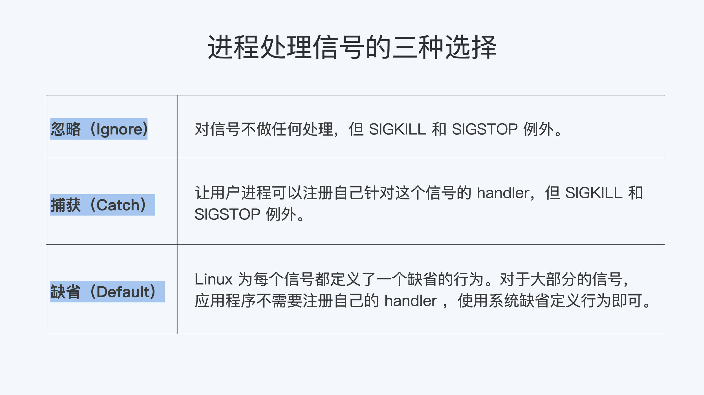
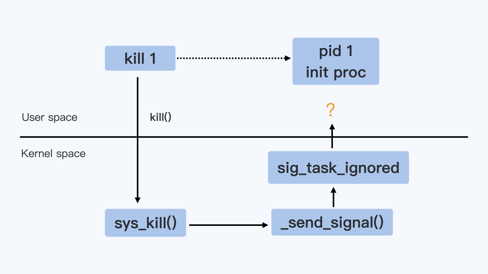

# 02 理解进程（1）：为什么我在容器中不能kill 1号进程？

你好，我是程远。

今天，我们正式进入理解进程的模块。我会通过 3 讲内容，带你了解容器 init 进程的特殊之处，还有它需要具备哪些功能，才能保证容器在运行过程中不会出现类似僵尸进程，或者应用程序无法 graceful shutdown 的问题。

那么通过这一讲，我会带你掌握 init 进程和 Linux 信号的核心概念。

## 问题再现

接下来，我们一起再现用 kill 1 命令重启容器的问题。

我猜你肯定想问，为什么要在容器中执行 kill 1 或者 kill -9 1 的命令呢？其实这是我们团队里的一位同学提出的问题。

这位同学当时遇到的情况是这样的，他想修改容器镜像里的一个 bug，但因为网路配置的问题，这个同学又不想为了重建 pod 去改变 pod IP。

如果你用过 Kubernetes 的话，你也肯定知道，Kubernetes 上是没有 restart pod 这个命令的。这样看来，他似乎只能让 pod 做个原地重启了。当时我首先想到的，就是在容器中使用 kill pid 1 的方式重启容器。

为了模拟这个过程，我们可以进行下面的这段操作。

如果你没有在容器中做过 kill 1 ，你可以下载我在 GitHub 上的这个例子，运行 make image 来做一个容器镜像。

然后，我们用 Docker 构建一个容器，用例子中的 init.sh 脚本作为这个容器的 init 进程。

最后，我们在容器中运行 kill 1 和 kill -9 1 ，看看会发生什么。

```
# docker stop sig-proc;docker rm sig-proc
# docker run --name sig-proc -d registry/sig-proc:v1 /init.sh
# docker exec -it sig-proc bash
[[email protected] /]# ps -ef
UID        PID  PPID  C STIME TTY          TIME CMD
root         1     0  0 07:23 ?        00:00:00 /bin/bash /init.sh
root         8     1  0 07:25 ?        00:00:00 /usr/bin/coreutils --coreutils-prog-shebang=sleep /usr/bin/sleep 100
root         9     0  6 07:27 pts/0    00:00:00 bash
root        22     9  0 07:27 pts/0    00:00:00 ps -ef
[[email protected] /]# kill 1
[[email protected] /]# kill -9 1
[[email protected] /]# ps -ef
UID        PID  PPID  C STIME TTY          TIME CMD
root         1     0  0 07:23 ?        00:00:00 /bin/bash /init.sh
root         9     0  0 07:27 pts/0    00:00:00 bash
root        23     1  0 07:27 ?        00:00:00 /usr/bin/coreutils --coreutils-prog-shebang=sleep /usr/bin/sleep 100
root        24     9  0 07:27 pts/0    00:00:00 ps -ef
```

当我们完成前面的操作，就会发现无论运行 kill 1 （对应 Linux 中的 SIGTERM 信号）还是 kill -9 1（对应 Linux 中的 SIGKILL 信号），都无法让进程终止。

那么问题来了，这两个常常用来终止进程的信号，都对容器中的 init 进程不起作用，这是怎么回事呢？

要解释这个问题，我们就要回到容器的两个最基本概念——init 进程和 Linux 信号中寻找答案。

## 知识详解

### 如何理解 init 进程？

init 进程的意思并不难理解，你只要认真听我讲完，这块内容基本就不会有问题了。我们下面来看一看。

使用容器的理想境界是一个容器只启动一个进程，但这在现实应用中有时是做不到的。

比如说，在一个容器中除了主进程之外，我们可能还会启动辅助进程，做监控或者 rotate logs；再比如说，我们需要把原来运行在虚拟机（VM）的程序移到容器里，这些原来跑在虚拟机上的程序本身就是多进程的。

一旦我们启动了多个进程，那么容器里就会出现一个 pid 1，也就是我们常说的 1 号进程或者 init 进程，然后由这个进程创建出其他的子进程。

接下来，我带你梳理一下 init 进程是怎么来的。

一个 Linux 操作系统，在系统打开电源，执行 BIOS/boot-loader 之后，就会由 boot-loader 负责加载 Linux 内核。

Linux 内核执行文件一般会放在 /boot 目录下，文件名类似 vmlinuz\*。在内核完成了操作系统的各种初始化之后，这个程序需要执行的第一个用户态程就是 init 进程。

内核代码启动 1 号进程的时候，在没有外面参数指定程序路径的情况下，一般会从几个缺省路径尝试执行 1 号进程的代码。这几个路径都是 Unix 常用的可执行代码路径。

系统启动的时候先是执行内核态的代码，然后在内核中调用 1 号进程的代码，从内核态切换到用户态。

目前主流的 Linux 发行版，无论是 RedHat 系的还是 Debian 系的，都会把 /sbin/init 作为符号链接指向 Systemd。Systemd 是目前最流行的 Linux init 进程，在它之前还有 SysVinit、UpStart 等 Linux init 进程。

但无论是哪种 Linux init 进程，它最基本的功能都是创建出 Linux 系统中其他所有的进程，并且管理这些进程。具体在 kernel 里的代码实现如下：

```
init/main.c
        /*
         * We try each of these until one succeeds.
         *
         * The Bourne shell can be used instead of init if we are
         * trying to recover a really broken machine.
         */
        if (execute_command) {
                ret = run_init_process(execute_command);
                if (!ret)
                        return 0;
                panic("Requested init %s failed (error %d).",
                      execute_command, ret);
        }
        if (!try_to_run_init_process("/sbin/init") ||
            !try_to_run_init_process("/etc/init") ||
            !try_to_run_init_process("/bin/init") ||
            !try_to_run_init_process("/bin/sh"))
                return 0;
        panic("No working init found.  Try passing init= option to kernel. "
              "See Linux Documentation/admin-guide/init.rst for guidance.");
$ ls -l /sbin/init
lrwxrwxrwx 1 root root 20 Feb  5 01:07 /sbin/init -> /lib/systemd/systemd
```

在 Linux 上有了容器的概念之后，一旦容器建立了自己的 Pid Namespace（进程命名空间），这个 Namespace 里的进程号也是从 1 开始标记的。所以，容器的 init 进程也被称为 1 号进程。

怎么样，1 号进程是不是不难理解？关于这个知识点，你只需要记住： 1 号进程是第一个用户态的进程，由它直接或者间接创建了 Namespace 中的其他进程。

### 如何理解 Linux 信号？

刚才我给你讲了什么是 1 号进程，要想解决“为什么我在容器中不能 kill 1 号进程”这个问题，我们还得看看 kill 命令起到的作用。

我们运行 kill 命令，其实在 Linux 里就是发送一个信号，那么信号到底是什么呢？这就涉及到 Linux 信号的概念了。

其实信号这个概念在很早期的 Unix 系统上就有了。它一般会从 1 开始编号，通常来说，信号编号是 1 到 31，这个编号在所有的 Unix 系统上都是一样的。

在 Linux 上我们可以用 kill -l 来看这些信号的编号和名字，具体的编号和名字我给你列在了下面，你可以看一看。

```
$ kill -l
 1) SIGHUP      2) SIGINT    3) SIGQUIT    4) SIGILL    5) SIGTRAP
 6) SIGABRT     7) SIGBUS    8) SIGFPE     9) SIGKILL  10) SIGUSR1
11) SIGSEGV    12) SIGUSR2  13) SIGPIPE   14) SIGALRM  15) SIGTERM
16) SIGSTKFLT  17) SIGCHLD  18) SIGCONT   19) SIGSTOP  20) SIGTSTP
21) SIGTTIN    22) SIGTTOU  23) SIGURG    24) SIGXCPU  25) SIGXFSZ
26) SIGVTALRM  27) SIGPROF  28) SIGWINCH  29) SIGIO    30) SIGPWR
31) SIGSYS
```

用一句话来概括，信号（Signal）其实就是 Linux 进程收到的一个通知。这些通知产生的源头有很多种，通知的类型也有很多种。

比如下面这几个典型的场景，你可以看一下：

如果我们按下键盘“Ctrl+C”，当前运行的进程就会收到一个信号 SIGINT 而退出；

如果我们的代码写得有问题，导致内存访问出错了，当前的进程就会收到另一个信号 SIGSEGV；

我们也可以通过命令 kill pid，直接向一个进程发送一个信号，缺省情况下不指定信号的类型，那么这个信号就是 SIGTERM。也可以指定信号类型，比如命令 "kill -9 pid", 这里的 9，就是编号为 9 的信号，SIGKILL 信号。

在这一讲中，我们主要用到 SIGTERM（15）和 SIGKILL（9）这两个信号，所以这里你主要了解这两个信号就可以了，其他信号以后用到时再做介绍。

进程在收到信号后，就会去做相应的处理。怎么处理呢？对于每一个信号，进程对它的处理都有下面三个选择。

第一个选择是忽略（Ignore），就是对这个信号不做任何处理，但是有两个信号例外，对于 SIGKILL 和 SIGSTOP 这个两个信号，进程是不能忽略的。这是因为它们的主要作用是为 Linux kernel 和超级用户提供删除任意进程的特权。

第二个选择，就是捕获（Catch），这个是指让用户进程可以注册自己针对这个信号的 handler。具体怎么做我们目前暂时涉及不到，你先知道就行，我们在后面课程会进行详细介绍。

对于捕获，SIGKILL 和 SIGSTOP 这两个信号也同样例外，这两个信号不能有用户自己的处理代码，只能执行系统的缺省行为。

还有一个选择是缺省行为（Default），Linux 为每个信号都定义了一个缺省的行为，你可以在 Linux 系统中运行 man 7 signal来查看每个信号的缺省行为。

对于大部分的信号而言，应用程序不需要注册自己的 handler，使用系统缺省定义行为就可以了。



我刚才说了，SIGTERM（15）和 SIGKILL（9）这两个信号是我们重点掌握的。现在我们已经讲解了信号的概念和处理方式，我就拿这两个信号为例，再带你具体分析一下。

首先我们来看 SIGTERM（15），这个信号是 Linux 命令 kill 缺省发出的。前面例子里的命令 kill 1 ，就是通过 kill 向 1 号进程发送一个信号，在没有别的参数时，这个信号类型就默认为 SIGTERM。

SIGTERM 这个信号是可以被捕获的，这里的“捕获”指的就是用户进程可以为这个信号注册自己的 handler，而这个 handler，我们后面会看到，它可以处理进程的 graceful-shutdown 问题。

我们再来了解一下 SIGKILL (9)，这个信号是 Linux 里两个特权信号之一。什么是特权信号呢？

前面我们已经提到过了，特权信号就是 Linux 为 kernel 和超级用户去删除任意进程所保留的，不能被忽略也不能被捕获。那么进程一旦收到 SIGKILL，就要退出。

在前面的例子里，我们运行的命令 kill -9 1 里的参数“-9”，其实就是指发送编号为 9 的这个 SIGKILL 信号给 1 号进程。

## 现象解释

现在，你应该理解 init 进程和 Linux 信号这两个概念了，让我们回到开头的问题上来：“为什么我在容器中不能 kill 1 号进程，甚至 SIGKILL 信号也不行？”

你还记得么，在课程的最开始，我们已经尝试过用 bash 作为容器 1 号进程，这样是无法把 1 号进程杀掉的。那么我们再一起来看一看，用别的编程语言写的 1 号进程是否也杀不掉。

我们现在用 C 程序作为 init 进程，尝试一下杀掉 1 号进程。和 bash init 进程一样，无论 SIGTERM 信号还是 SIGKILL 信号，在容器里都不能杀死这个 1 号进程。

```
# cat c-init-nosig.c
#include <stdio.h>
#include <unistd.h>
int main(int argc, char *argv[])
{
       printf("Process is sleeping\n");
       while (1) {
              sleep(100);
       }
       return 0;
}
```

```
# docker stop sig-proc;docker rm sig-proc
# docker run --name sig-proc -d registry/sig-proc:v1 /c-init-nosig
# docker exec -it sig-proc bash
[[email protected] /]# ps -ef
UID        PID  PPID  C STIME TTY          TIME CMD
root         1     0  0 07:48 ?        00:00:00 /c-init-nosig
root         6     0  5 07:48 pts/0    00:00:00 bash
root        19     6  0 07:48 pts/0    00:00:00 ps -ef
[[email protected] /]# kill 1
[[email protected] /]# kill -9 1
[[email protected] /]# ps -ef
UID        PID  PPID  C STIME TTY          TIME CMD
root         1     0  0 07:48 ?        00:00:00 /c-init-nosig
root         6     0  0 07:48 pts/0    00:00:00 bash
root        20     6  0 07:49 pts/0    00:00:00 ps -ef
```

我们是不是这样就可以得出结论——“容器里的 1 号进程，完全忽略了 SIGTERM 和 SIGKILL 信号了”呢？你先别着急，我们再拿其他语言试试。

接下来，我们用 Golang 程序作为 1 号进程，我们再在容器中执行 kill -9 1 和 kill 1 。

这次，我们发现 kill -9 1 这个命令仍然不能杀死 1 号进程，也就是说，SIGKILL 信号和之前的两个测试一样不起作用。

但是，我们执行 kill 1 以后，SIGTERM 这个信号把 init 进程给杀了，容器退出了。

```
# cat go-init.go
package main
import (
       "fmt"
       "time"
)
func main() {
       fmt.Println("Start app\n")
       time.Sleep(time.Duration(100000) * time.Millisecond)
}
```

```
# docker stop sig-proc;docker rm sig-proc
# docker run --name sig-proc -d registry/sig-proc:v1 /go-init
# docker exec -it sig-proc bash
[[email protected] /]# ps -ef
UID        PID  PPID  C STIME TTY          TIME CMD
root         1     0  1 08:04 ?        00:00:00 /go-init
root        10     0  9 08:04 pts/0    00:00:00 bash
root        23    10  0 08:04 pts/0    00:00:00 ps -ef
[[email protected] /]# kill -9 1
[[email protected] /]# kill 1
[[email protected] /]# [~]# docker ps
CONTAINER ID        IMAGE               COMMAND             CREATED             STATUS              PORTS               NAMES
```

对于这个测试结果，你是不是反而觉得更加困惑了？

为什么使用不同程序，结果就不一样呢？接下来我们就看看 kill 命令下达之后，Linux 里究竟发生了什么事，我给你系统地梳理一下整个过程。

在我们运行 kill 1 这个命令的时候，希望把 SIGTERM 这个信号发送给 1 号进程，就像下面图里的带箭头虚线。

在 Linux 实现里，kill 命令调用了 kill() 的这个系统调用（所谓系统调用就是内核的调用接口）而进入到了内核函数 sys_kill()， 也就是下图里的实线箭头。

而内核在决定把信号发送给 1 号进程的时候，会调用 sig_task_ignored() 这个函数来做个判断，这个判断有什么用呢？

它会决定内核在哪些情况下会把发送的这个信号给忽略掉。如果信号被忽略了，那么 init 进程就不能收到指令了。

所以，我们想要知道 init 进程为什么收到或者收不到信号，都要去看看 sig_task_ignored() 的这个内核函数的实现。



sig_task_ignored()内核函数实现示意图

在 sig_task_ignored() 这个函数中有三个 if{}判断，第一个和第三个 if{}判断和我们的问题没有关系，并且代码有注释，我们就不讨论了。

我们重点来看第二个 if{}。我来给你分析一下，在容器中执行 kill 1 或者 kill -9 1 的时候，这第二个 if{}里的三个子条件是否可以被满足呢？

我们来看下面这串代码，这里表示一旦这三个子条件都被满足，那么这个信号就不会发送给进程。

```
kernel/signal.c
static bool sig_task_ignored(struct task_struct *t, int sig, bool force)
{
        void __user *handler;
        handler = sig_handler(t, sig);
        /* SIGKILL and SIGSTOP may not be sent to the global init */
        if (unlikely(is_global_init(t) && sig_kernel_only(sig)))
                return true;
        if (unlikely(t->signal->flags & SIGNAL_UNKILLABLE) &&
            handler == SIG_DFL && !(force && sig_kernel_only(sig)))
                return true;
        /* Only allow kernel generated signals to this kthread */
        if (unlikely((t->flags & PF_KTHREAD) &&
                     (handler == SIG_KTHREAD_KERNEL) && !force))
                return true;
        return sig_handler_ignored(handler, sig);
}
```

接下来，我们就逐一分析一下这三个子条件，我们来说说这个"!(force && sig_kernel_only(sig))" 。

第一个条件里 force 的值，对于同一个 Namespace 里发出的信号来说，调用值是 0，所以这个条件总是满足的。

我们再来看一下第二个条件 “handler == SIG_DFL”，第二个条件判断信号的 handler 是否是 SIG_DFL。

那么什么是 SIG_DFL 呢？对于每个信号，用户进程如果不注册一个自己的 handler，就会有一个系统缺省的 handler，这个缺省的 handler 就叫作 SIG_DFL。

对于 SIGKILL，我们前面介绍过它是特权信号，是不允许被捕获的，所以它的 handler 就一直是 SIG_DFL。这第二个条件对 SIGKILL 来说总是满足的。

对于 SIGTERM，它是可以被捕获的。也就是说如果用户不注册 handler，那么这个条件对 SIGTERM 也是满足的。

最后再来看一下第三个条件，"t->signal->flags & SIGNAL_UNKILLABLE"，这里的条件判断是这样的，进程必须是 SIGNAL_UNKILLABLE 的。

这个 SIGNAL_UNKILLABLE flag 是在哪里置位的呢？

可以参考我们下面的这段代码，在每个 Namespace 的 init 进程建立的时候，就会打上 SIGNAL_UNKILLABLE 这个标签，也就是说只要是 1 号进程，就会有这个 flag，这个条件也是满足的。

```
kernel/fork.c
                       if (is_child_reaper(pid)) {
                                ns_of_pid(pid)->child_reaper = p;
                                p->signal->flags |= SIGNAL_UNKILLABLE;
                        }
/*
 * is_child_reaper returns true if the pid is the init process
 * of the current namespace. As this one could be checked before
 * pid_ns->child_reaper is assigned in copy_process, we check
 * with the pid number.
 */
static inline bool is_child_reaper(struct pid *pid)
{
        return pid->numbers[pid->level].nr == 1;
}
```

我们可以看出来，其实最关键的一点就是 handler == SIG_DFL 。Linux 内核针对每个 Nnamespace 里的 init 进程，把只有 default handler 的信号都给忽略了。

如果我们自己注册了信号的 handler（应用程序注册信号 handler 被称作"Catch the Signal"），那么这个信号 handler 就不再是 SIG_DFL 。即使是 init 进程在接收到 SIGTERM 之后也是可以退出的。

不过，由于 SIGKILL 是一个特例，因为 SIGKILL 是不允许被注册用户 handler 的（还有一个不允许注册用户 handler 的信号是 SIGSTOP），那么它只有 SIG_DFL handler。

所以 init 进程是永远不能被 SIGKILL 所杀，但是可以被 SIGTERM 杀死。

说到这里，我们该怎么证实这一点呢？我们可以做下面两件事来验证。

第一件事，你可以查看 1 号进程状态中 SigCgt Bitmap。

我们可以看到，在 Golang 程序里，很多信号都注册了自己的 handler，当然也包括了 SIGTERM(15)，也就是 bit 15。

而 C 程序里，缺省状态下，一个信号 handler 都没有注册；bash 程序里注册了两个 handler，bit 2 和 bit 17，也就是 SIGINT 和 SIGCHLD，但是没有注册 SIGTERM。

所以，C 程序和 bash 程序里 SIGTERM 的 handler 是 SIG_DFL（系统缺省行为），那么它们就不能被 SIGTERM 所杀。

具体我们可以看一下这段 /proc 系统的进程状态：

```
# ## golang init
# cat /proc/1/status | grep -i SigCgt
SigCgt:     fffffffe7fc1feff
# ## C init
# cat /proc/1/status | grep -i SigCgt
SigCgt:     0000000000000000
# ## bash init
# cat /proc/1/status | grep -i SigCgt
SigCgt:     0000000000010002
```

第二件事，给 C 程序注册一下 SIGTERM handler，捕获 SIGTERM。

我们调用 signal() 系统调用注册 SIGTERM 的 handler，在 handler 里主动退出，再看看容器中 kill 1 的结果。

这次我们就可以看到，在进程状态的 SigCgt bitmap 里，bit 15 (SIGTERM) 已经置位了。同时，运行 kill 1 也可以把这个 C 程序的 init 进程给杀死了。

```
# include <stdio.h>
# include <stdlib.h>
# include <sys/types.h>
# include <sys/wait.h>
# include <unistd.h>
void sig_handler(int signo)
{
    if (signo == SIGTERM) {
           printf("received SIGTERM\n");
           exit(0);
    }
}
int main(int argc, char *argv[])
{
    signal(SIGTERM, sig_handler);
    printf("Process is sleeping\n");
    while (1) {
           sleep(100);
    }
    return 0;
}
```

```
# docker stop sig-proc;docker rm sig-proc
# docker run --name sig-proc -d registry/sig-proc:v1 /c-init-sig
# docker exec -it sig-proc bash
[[email protected] /]# ps -ef
UID        PID  PPID  C STIME TTY          TIME CMD
root         1     0  0 09:05 ?        00:00:00 /c-init-sig
root         6     0 18 09:06 pts/0    00:00:00 bash
root        19     6  0 09:06 pts/0    00:00:00 ps -ef
[[email protected] /]# cat /proc/1/status | grep SigCgt
SigCgt: 0000000000004000
[[email protected] /]# kill 1
# docker ps
CONTAINER ID        IMAGE               COMMAND             CREATED             STATUS              PORTS               NAMES
```

好了，到这里我们可以确定这两点：

kill -9 1 在容器中是不工作的，内核阻止了 1 号进程对 SIGKILL 特权信号的响应。

kill 1 分两种情况，如果 1 号进程没有注册 SIGTERM 的 handler，那么对 SIGTERM 信号也不响应，如果注册了 handler，那么就可以响应 SIGTERM 信号。

## 重点总结

好了，今天的内容讲完了。我们来总结一下。

这一讲我们主要讲了 init 进程。围绕这个知识点，我提出了一个真实发生的问题：“为什么我在容器中不能 kill 1 号进程?”。

想要解决这个问题，我们需要掌握两个基本概念。

第一个概念是 Linux 1 号进程。它是第一个用户态的进程。它直接或者间接创建了 Namespace 中的其他进程。

第二个概念是 Linux 信号。Linux 有 31 个基本信号，进程在处理大部分信号时有三个选择：忽略、捕获和缺省行为。其中两个特权信号 SIGKILL 和 SIGSTOP 不能被忽略或者捕获。

只知道基本概念还不行，我们还要去解决问题。我带你尝试了用 bash, C 语言还有 Golang 程序作为容器 init 进程，发现它们对 kill 1 的反应是不同的。

因为信号的最终处理都是在 Linux 内核中进行的，因此，我们需要对 Linux 内核代码进行分析。

容器里 1 号进程对信号处理的两个要点，这也是这一讲里我想让你记住的两句话：

1. 在容器中，1 号进程永远不会响应 SIGKILL 和 SIGSTOP 这两个特权信号；
1. 对于其他的信号，如果用户自己注册了 handler，1 号进程可以响应。

## 思考题

这一讲的最开始，有这样一个 C 语言的 init 进程，它没有注册任何信号的 handler。如果我们从 Host Namespace 向它发送 SIGTERM，会发生什么情况呢？

欢迎留言和我分享你的想法。如果你的朋友也对 1 号进程有困惑，欢迎你把这篇文章分享给他，说不定就帮他解决了一个难题。
