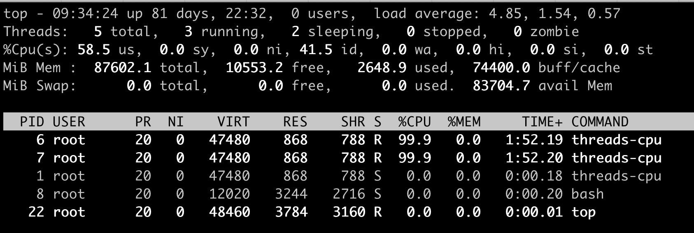
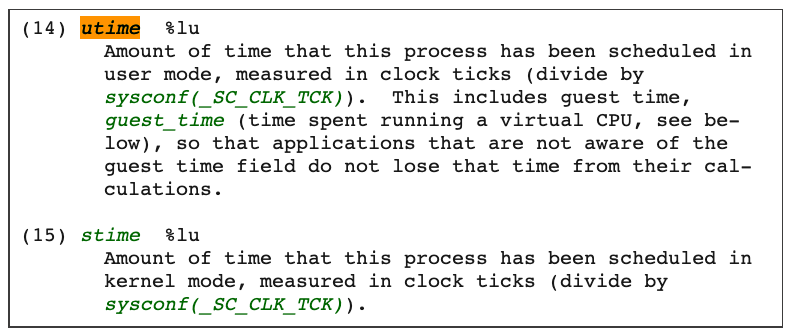
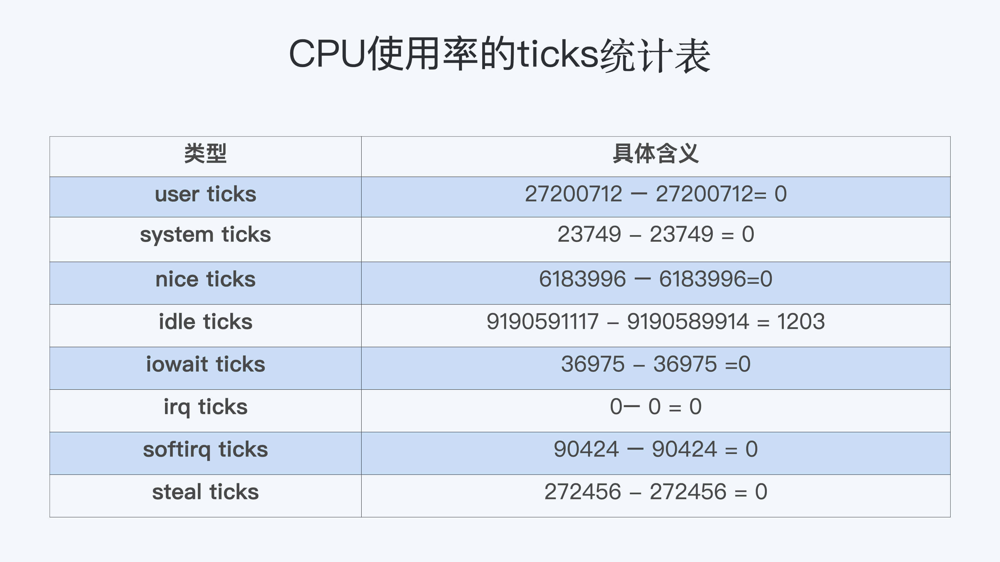

06 容器CPU（2）：如何正确地拿到容器CPU的开销？
============================

你好，我是程远。今天我们聊一聊，如何正确地拿到容器 CPU 的开销。

为啥要解决这个问题呢，还是来源于实际工作中的需要。

无论是容器的所有者还是容器平台的管理者，我们想要精准地对运行着众多容器的云平台做监控，快速排查例如应用的处理能力下降，节点负载过高等问题，就绕不开容器 CPU 开销。因为 CPU 开销的异常，往往是程序异常最明显的一个指标。

在一台物理机器或者虚拟机里，如果你想得到这个节点的 CPU 使用率，最常用的命令就是 top 了吧？top 一下子就能看到整个节点当前的 CPU 使用情况。

那么在容器里，top 命令也可以做到这点吗？想要知道答案，我们还是得实际动手试一试。

问题重现
----

实际上，你在使用容器的时候，如果运行 top 命令来查看当前容器总共使用了多少 CPU，你肯定马上就会失望了。

这是因为我们在容器中运行 top 命令，虽然可以看到容器中每个进程的 CPU 使用率，但是 top 中"%Cpu(s)"那一行中显示的数值，并不是这个容器的 CPU 整体使用率，而是容器宿主机的 CPU 使用率。

就像下面的这个例子，我们在一个 12 个 CPU 的宿主机上，启动一个容器，然后在容器里运行 top 命令。

这时我们可以看到，容器里有两个进程 threads-cpu，总共消耗了 200% 的 CPU（2 CPU Usage），而"%Cpu(s)"那一行的"us cpu"是 58.5%。对于 12CPU 的系统来说，12 \* 58.5%=7.02，也就是说这里显示总共消耗了 7 个 CPU，远远大于容器中 2 个 CPU 的消耗。



运行top的示意图

这个例子说明，top 这个工具虽然在物理机或者虚拟机上看得到系统 CPU 开销，但是如果是放在容器环境下，运行 top 就无法得到容器中总的 CPU 使用率。那么，我们还有什么其他的办法吗？

进程 CPU 使用率和系统 CPU 使用率
---------------------

通过问题重现，我们发现 top 工具主要显示了宿主机系统整体的 CPU 使用率，以及单个进程的 CPU 使用率。既然没有现成的工具可以得到容器 CPU 开销，那我们需要自己开发一个工具来解决问题了。

其实我们自己推导，也没有那么难。我认为，最有效的思路还是从原理上去理解问题。

所以，在解决怎样得到单个容器整体的 CPU 使用率这个问题之前，我们先来学习一下，在 Linux 中到底是如何计算单个进程的 CPU 使用率，还有整个系统的 CPU 使用率的。

### 进程 CPU 使用率

Linux 中每个进程的 CPU 使用率，我们都可以用 top 命令查看。

对照我们前面的那张示意图，我们可以发现，每个进程在 top 命令输出中都有对应的一行，然后“%CPU”的那一列就是这个进程的实时 CPU 使用率了。

比如说，100% 就表示这个进程在这个瞬时使用了 1 个 CPU，200% 就是使用了 2 个 CPU。那么这个百分比的数值是怎么得到呢？

最直接的方法，就是从源头开始寻找答案。因为是 top 命令的输出，我们可以去看一下 top 命令的源代码。在代码中你会看到对于每个进程，top 都会从 proc 文件系统中每个进程对应的 stat 文件中读取 2 个数值。我们先来看这个文件，再来解读文件中具体的两个数值。

这个 stat 文件就是 /proc/\[pid\]/stat ， \[pid\] 就是替换成具体一个进程的 PID 值。比如 PID 值为 1 的进程，这个文件就是 /proc/1/stat ，那么这个 /proc/\[pid\]/stat 文件里有什么信息呢？

其实这个 stat 文件实时输出了进程的状态信息，比如进程的运行态（Running 还是 Sleeping）、父进程 PID、进程优先级、进程使用的内存等等总共 50 多项。

完整的 stat 文件内容和格式在 proc 文件系统的 Linux programmer’s manual 里定义了。在这里，我们只需要重点关注这两项数值，stat 文件中的第 14 项 utime 和第 15 项 stime。



那么这两项数值 utime 和 stime 是什么含义呢？utime 是表示进程的用户态部分在 Linux 调度中获得 CPU 的 ticks，stime 是表示进程的内核态部分在 Linux 调度中获得 CPU 的 ticks。

看到这个解释，你可能又冒出一个新问题，疑惑 ticks 是什么? 这个 ticks 就是 Linux 操作系统中的一个时间单位，你可以理解成类似秒，毫秒的概念。

在 Linux 中有个自己的时钟，它会周期性地产生中断。每次中断都会触发 Linux 内核去做一次进程调度，而这一次中断就是一个 tick。因为是周期性的中断，比如 1 秒钟 100 次中断，那么一个 tick 作为一个时间单位看的话，也就是 1/100 秒。

我给你举个例子说明，假如进程的 utime 是 130ticks，就相当于 130 \* 1/100=1.3 秒，也就是进程从启动开始在用户态总共运行了 1.3 秒钟。

这里需要你注意，utime 和 stime 都是一个累计值，也就是说从进程启动开始，这两个值就是一直在累积增长的。

那么我们怎么计算，才能知道某一进程在用户态和内核态中，分别获得了多少 CPU 的 ticks 呢？

首先，我们可以假设这个瞬时是 1 秒钟，这 1 秒是 T1 时刻到 T2 时刻之间的，那么这样我们就能获得 T1 时刻的 utime\_1 和 stime\_1，同时获得 T2 时刻的 utime\_2 和 stime\_2。

在这 1 秒的瞬时，进程用户态获得的 CPU ticks 就是 (utime\_2 – utime\_1), 进程内核态获得的 CPU ticks 就是 (stime\_2 – stime\_1)。

那么我们可以推导出，进程 CPU 总的开销就是用户态加上内核态，也就是在 1 秒瞬时进程总的 CPU ticks 等于 (utime\_2 – utime\_1) + (stime\_2 – stime\_1)。

好了，现在我们得到了进程以 ticks 为单位的 CPU 开销，接下来还要做个转化。我们怎样才能把这个值转化成我们熟悉的百分比值呢？其实也不难，我们还是可以去 top 的源代码里得到这个百分比的计算公式。

简单总结一下，这个公式是这样的：

进程的 CPU 使用率 =((utime\_2 – utime\_1) + (stime\_2 – stime\_1)) \* 100.0 / (HZ \* et \* 1 )

接下来，我再给你讲一下，这个公式里每一个部分的含义。

首先， ((utime\_2 – utime\_1) + (stime\_2 – stime\_1)) 是瞬时进程总的 CPU ticks。这个我们已经在前面解释过了。

其次，我们来看 100.0，这里乘以 100.0 的目的是产生百分比数值。

最后，我再讲一下 (HZ \* et \* 1)。这是被除数这里的三个参数，我给你详细解释一下。

第一个 HZ 是什么意思呢？前面我们介绍 ticks 里说了，ticks 是按照固定频率发生的，在我们的 Linux 系统里 1 秒钟是 100 次，那么 HZ 就是 1 秒钟里 ticks 的次数，这里值是 100。

第二个参数 et 是我们刚才说的那个“瞬时”的时间，也就是得到 utime\_1 和 utime\_2 这两个值的时间间隔。

第三个“1”, 就更容易理解了，就是 1 个 CPU。那么这三个值相乘，你是不是也知道了它的意思呢？就是在这“瞬时”的时间（et）里，1 个 CPU 所包含的 ticks 数目。

解释了这些参数，我们可以把这个公式简化一下，就是下面这样：

进程的 CPU 使用率 =（进程的 ticks/ 单个 CPU 总 ticks）\*100.0

知道了这个公式，就需要上手来验证一下这个方法对不对，怎么验证呢？我们可以启动一个消耗 CPU 的小程序，然后读取一下进程对应的 /proc/\[pid\]/stat 中的 utime 和 stime，然后用这个方法来计算一下进程使用率这个百分比值，并且和 top 的输出对比一下，看看是否一致。

先启动一个消耗 200% 的小程序，它的 PID 是 10021，CPU 使用率是 200%。


然后，我们查看这个进程对应的 stat 文件 /proc/10021/stat，间隔 1 秒钟输出第二次，因为 stat 文件内容很多，我们知道 utime 和 stime 第 14 和 15 项，所以我们这里只截取了前 15 项的输出。这里可以看到，utime\_1 = 399，stime\_1=0，utime\_2=600，stime\_2=0。


根据前面的公式，我们计算一下进程 threads-cpu 的 CPU 使用率。套用前面的公式，计算的过程是：

((600 – 399) + (0 – 0)) \* 100.0 / (100 \* 1 \* 1) =201，也就是 201%。你会发现这个值和我们运行 top 里的值是一样的。同时，我们也就验证了这个公式是没问题的。

### 系统 CPU 使用率

前面我们介绍了 Linux 中如何获取单个进程的 CPU 使用率，下面我们再来看看 Linux 里是怎么计算系统的整体 CPU 使用率的。

其实知道了如何计算单个进程的 CPU 使用率之后，要理解系统整体的 CPU 使用率计算方法就简单多了。

同样，我们要计算 CPU 使用率，首先需要拿到数据，数据源也同样可以从 proc 文件系统里得到，对于整个系统的 CPU 使用率，这个文件就是 /proc/stat。

在 /proc/stat 文件的 cpu 这行有 10 列数据，同样我们可以在 proc 文件系统的 Linux programmer’s manual 里，找到每一列数据的定义，而前 8 列数据正好对应 top 输出中"%Cpu(s)"那一行里的 8 项数据，也就是在上一讲中，我们介绍过的 user/system/nice/idle/iowait/irq/softirq/steal 这 8 项。


而在 /proc/stat 里的每一项的数值，就是系统自启动开始的 ticks。那么要计算出“瞬时”的 CPU 使用率，首先就要算出这个“瞬时”的 ticks，比如 1 秒钟的“瞬时”，我们可以记录开始时刻 T1 的 ticks, 然后再记录 1 秒钟后 T2 时刻的 ticks，再把这两者相减，就可以得到这 1 秒钟的 ticks 了。


这里我们可以得到，在这 1 秒钟里每个 CPU 使用率的 ticks：



我们想要计算每一种 CPU 使用率的百分比，其实也很简单。我们只需要把所有在这 1 秒里的 ticks 相加得到一个总值，然后拿某一项的 ticks 值，除以这个总值。比如说计算 idle CPU 的使用率就是：

```
1203 /（ 0 + 0 + 0 + 1203 + 0 + 0 + 0 + 0）=100%

```

好了，我们现在来整体梳理一下，我们通过 Linux 里的工具，要怎样计算进程的 CPU 使用率和系统的 CPU 使用率。

对于单个进程的 CPU 使用率计算，我们需要读取对应进程的 /proc/\[pid\]/stat 文件，将进程瞬时用户态和内核态的 ticks 数相加，就能得到进程的总 ticks。

然后我们运用公式“(进程的 ticks / 单个 CPU 总 ticks) \* 100.0”计算出进程 CPU 使用率的百分比值。

对于系统的 CPU 使用率，需要读取 /proc/stat 文件，得到瞬时各项 CPU 使用率的 ticks 值，相加得到一个总值，单项值除以总值就是各项 CPU 的使用率。

解决问题
----

前面我们学习了在 Linux 中，top 工具是怎样计算每个进程的 CPU 使用率，以及系统总的 CPU 使用率。现在我们再来看最初的问题：为什么在容器中运行 top 命令不能得到容器中总的 CPU 使用率？

这就比较好解释了，对于系统总的 CPU 使用率，需要读取 /proc/stat 文件，但是这个文件中的各项 CPU ticks 是反映整个节点的，并且这个 /proc/stat 文件也不包含在任意一个 Namespace 里。

那么，对于 top 命令来说，它只能显示整个节点中各项 CPU 的使用率，不能显示单个容器的各项 CPU 的使用率。既然 top 命令不行，我们还有没有办法得到整个容器的 CPU 使用率呢？

我们之前已经学习过了 CPU Cgroup，每个容器都会有一个 CPU Cgroup 的控制组。在这个控制组目录下面有很多参数文件，有的参数可以决定这个控制组里最大的 CPU 可使用率外，除了它们之外，目录下面还有一个可读项 cpuacct.stat。

这里包含了两个统计值，这两个值分别是这个控制组里所有进程的内核态 ticks 和用户态的 ticks，那么我们就可以用前面讲过的公式，也就是计算进程 CPU 使用率的公式，去计算整个容器的 CPU 使用率：

CPU 使用率 =((utime\_2 – utime\_1) + (stime\_2 – stime\_1)) \* 100.0 / (HZ \* et \* 1 )

我们还是以问题重现中的例子说明，也就是最开始启动容器里的那两个容器 threads-cpu 进程。

就像下图显示的这样，整个容器的 CPU 使用率的百分比就是 ( (174021 - 173820) + (4 – 4)) \* 100.0 / (100 \* 1 \* 1) = 201, 也就是 201%。所以，我们从每个容器的 CPU Cgroup 控制组里的 cpuacct.stat 的统计值中，可以比较快地得到整个容器的 CPU 使用率。


重点总结
----

Linux 里获取 CPU 使用率的工具，比如 top，都是通过读取 proc 文件系统下的 stat 文件来得到 CPU 使用了多少 ticks。而这里的 ticks，是 Linux 操作系统里的一个时间单位，可以理解成类似秒，毫秒的概念。

对于每个进程来说，它的 stat 文件是 /proc/\[pid\]/stat，里面包含了进程用户态和内核态的 ticks 数目；对于整个节点，它的 stat 文件是 /proc/stat，里面包含了 user/system/nice/idle/iowait 等不同 CPU 开销类型的 ticks。

由于 /proc/stat 文件是整个节点全局的状态文件，不属于任何一个 Namespace，因此在容器中无法通过读取 /proc/stat 文件来获取单个容器的 CPU 使用率。

所以要得到单个容器的 CPU 使用率，我们可以从 CPU Cgroup 每个控制组里的统计文件 cpuacct.stat 中获取。单个容器 CPU 使用率 =((utime\_2 – utime\_1) + (stime\_2 – stime\_1)) \* 100.0 / (HZ \* et \* 1 )。

得到单个容器的 CPU 的使用率，那么当宿主机上负载变高的时候，就可以很快知道是哪个容器引起的问题。同时，用户在管理自己成百上千的容器的时候，也可以很快发现 CPU 使用率异常的容器，这样就能及早地介入去解决问题。

思考题
---

写一个小程序，在容器中执行，它可以显示当前容器中所有进程总的 CPU 使用率。

欢迎在留言区和我互动，一起探讨容器 CPU 的相关问题。如果这篇文章让你有所收获，也欢迎你分享给更多的朋友，一起学习进步
