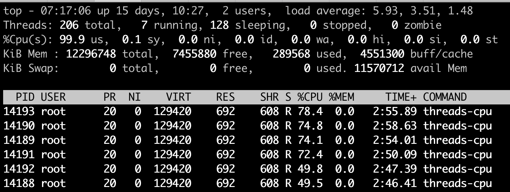
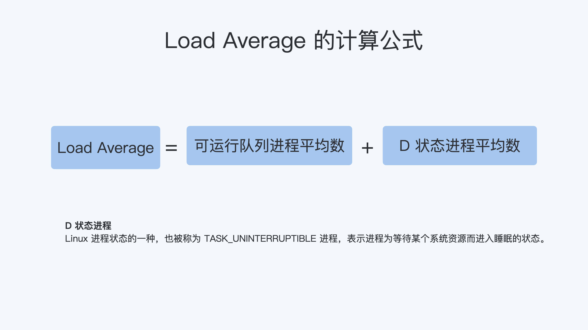

07 Load Average：加了CPU Cgroup限制，为什么我的容器还是很慢？
===========================================

你好，我是程远。今天我想聊一聊平均负载（Load Average）的话题。

在上一讲中，我们提到过 CPU Cgroup 可以限制进程的 CPU 资源使用，但是 CPU Cgroup 对容器的资源限制是存在盲点的。

什么盲点呢？就是无法通过 CPU Cgroup 来控制 Load Average 的平均负载。而没有这个限制，就会影响我们系统资源的合理调度，很可能导致我们的系统变得很慢。

那么今天这一讲，我们要来讲一下为什么加了 CPU Cgroup 的配置后，即使保证了容器的 CPU 资源，容器中的进程还是会运行得很慢？

问题再现
----

在 Linux 的系统维护中，我们需要经常查看 CPU 使用情况，再根据这个情况分析系统整体的运行状态。有时候你可能会发现，明明容器里所有进程的 CPU 使用率都很低，甚至整个宿主机的 CPU 使用率都很低，而机器的 Load Average 里的值却很高，容器里进程运行得也很慢。

这么说有些抽象，我们一起动手再现一下这个情况，这样你就能更好地理解这个问题了。

比如说下面的 top 输出，第三行可以显示当前的 CPU 使用情况，我们可以看到整个机器的 CPU Usage 几乎为 0，因为"id"显示 99.9%，这说明 CPU 是处于空闲状态的。

但是请你注意，这里 1 分钟的"load average"的值却高达 9.09，这里的数值 9 几乎就意味着使用了 9 个 CPU 了，这样 CPU Usage 和 Load Average 的数值看上去就很矛盾了。


那问题来了，我们在看一个系统里 CPU 使用情况时，到底是看 CPU Usage 还是 Load Average 呢？

这里就涉及到今天要解决的两大问题：

Load Average 到底是什么，CPU Usage 和 Load Average 有什么差别？

如果 Load Average 值升高，应用的性能下降了，这背后的原因是什么呢？

好了，这一讲我们就带着这两个问题，一起去揭开谜底。

什么是 Load Average?
-----------------

要回答前面的问题，很显然我们要搞明白这个 Linux 里的"load average"这个值是什么意思，又是怎样计算的。

Load Average 这个概念，你可能在使用 Linux 的时候就已经注意到了，无论你是运行 uptime, 还是 top，都可以看到类似这个输出"load average：2.02, 1.83, 1.20"。那么这一串输出到底是什么意思呢？

最直接的办法当然是看手册了，如果我们用"Linux manual page"搜索 uptime 或者 top，就会看到对这个"load average"和后面三个数字的解释是"the system load averages for the past 1, 5, and 15 minutes"。

这个解释就是说，后面的三个数值分别代表过去 1 分钟，5 分钟，15 分钟在这个节点上的 Load Average，但是看了手册上的解释，我们还是不能理解什么是 Load Average。

这个时候，你如果再去网上找资料，就会发现 Load Average 是一个很古老的概念了。上个世纪 70 年代，早期的 Unix 系统上就已经有了这个 Load Average，IETF 还有一个RFC546定义了 Load Average，这里定义的 Load Average 是一种 CPU 资源需求的度量。

举个例子，对于一个单个 CPU 的系统，如果在 1 分钟的时间里，处理器上始终有一个进程在运行，同时操作系统的进程可运行队列中始终都有 9 个进程在等待获取 CPU 资源。那么对于这 1 分钟的时间来说，系统的"load average"就是 1+9=10，这个定义对绝大部分的 Unix 系统都适用。

对于 Linux 来说，如果只考虑 CPU 的资源，Load Averag 等于单位时间内正在运行的进程加上可运行队列的进程，这个定义也是成立的。通过这个定义和我自己的观察，我给你归纳了下面三点对 Load Average 的理解。

第一，不论计算机 CPU 是空闲还是满负载，Load Average 都是 Linux 进程调度器中可运行队列（Running Queue）里的一段时间的平均进程数目。

第二，计算机上的 CPU 还有空闲的情况下，CPU Usage 可以直接反映到"load average"上，什么是 CPU 还有空闲呢？具体来说就是可运行队列中的进程数目小于 CPU 个数，这种情况下，单位时间进程 CPU Usage 相加的平均值应该就是"load average"的值。

第三，计算机上的 CPU 满负载的情况下，计算机上的 CPU 已经是满负载了，同时还有更多的进程在排队需要 CPU 资源。这时"load average"就不能和 CPU Usage 等同了。

比如对于单个 CPU 的系统，CPU Usage 最大只是有 100%，也就 1 个 CPU；而"load average"的值可以远远大于 1，因为"load average"看的是操作系统中可运行队列中进程的个数。

这样的解释可能太抽象了，为了方便你理解，我们一起动手验证一下。

怎么验证呢？我们可以执行个程序来模拟一下, 先准备好一个可以消耗任意 CPU Usage 的程序，在执行这个程序的时候，后面加个数字作为参数，

比如下面的设置，参数是 2，就是说这个进程会创建出两个线程，并且每个线程都跑满 100% 的 CPU，2 个线程就是 2 \* 100% = 200% 的 CPU Usage，也就是消耗了整整两个 CPU 的资源。

```
# ./threads-cpu 2

```

准备好了这个 CPU Usage 的模拟程序，我们就可以用它来查看 CPU Usage 和 Load Average 之间的关系了。

接下来我们一起跑两个例子，第一个例子是执行 2 个满负载的线程，第二个例子执行 6 个满负载的线程，同样都是在一台 4 个 CPU 的节点上。

先来看第一个例子，我们在一台 4 个 CPU 的计算机节点上运行刚才这个模拟程序，还是设置参数为 2，也就是使用 2 个 CPU Usage。在这个程序运行了几分钟之后，我们运行 top 来查看一下 CPU Usage 和 Load Average。

我们可以看到两个 threads-cpu 各自都占了将近 100% 的 CPU，两个就是 200%，2 个 CPU，对于 4 个 CPU 的计算机来说，CPU Usage 占了 50%，空闲了一半，这个我们也可以从 idle （id）：49.9% 得到印证。

这时候，Load Average 里第一项（也就是前 1 分钟的数值）为 1.98，近似于 2。这个值和我们一直运行的 200%CPU Usage 相对应，也验证了我们之前归纳的第二点——CPU Usage 可以反映到 Load Average 上。

因为运行的时间不够，前 5 分钟，前 15 分钟的 Load Average 还没有到 2，而且后面我们的例子程序一般都只会运行几分钟，所以这里我们只看前 1 分钟的 Load Average 值就行。

另外，Linux 内核中不使用浮点计算，这导致 Load Average 里的 1 分钟，5 分钟，15 分钟的时间值并不精确，但这不影响我们查看 Load Average 的数值，所以先不用管这个时间的准确性。


那我们再来跑第二个例子，同样在这个 4 个 CPU 的计算机节点上，如果我们执行 CPU Usage 模拟程序 threads-cpu，设置参数为 6，让这个进程建出 6 个线程，这样每个线程都会尽量去抢占 CPU，但是计算机总共只有 4 个 CPU，所以这 6 个线程的 CPU Usage 加起来只是 400%。

显然这时候 4 个 CPU 都被占满了，我们可以看到整个节点的 idle（id）也已经是 0.0% 了。

但这个时候，我们看看前 1 分钟的 Load Average，数值不是 4 而是 5.93 接近 6，我们正好模拟了 6 个高 CPU 需求的线程。这也告诉我们，Load Average 表示的是一段时间里运行队列中需要被调度的进程 / 线程平均数目。



讲到这里，我们是不是就可以认定 Load Average 就代表一段时间里运行队列中需要被调度的进程或者线程平均数目了呢? 或许对其他的 Unix 系统来说，这个理解已经够了，但是对于 Linux 系统还不能这么认定。

为什么这么说呢？故事还要从 Linux 早期的历史说起，那时开发者 Matthias 有这么一个发现，比如把快速的磁盘换成了慢速的磁盘，运行同样的负载，系统的性能是下降的，但是 Load Average 却没有反映出来。

他发现这是因为 Load Average 只考虑运行态的进程数目，而没有考虑等待 I/O 的进程。所以，他认为 Load Average 如果只是考虑进程运行队列中需要被调度的进程或线程平均数目是不够的，因为对于处于 I/O 资源等待的进程都是处于 TASK\_UNINTERRUPTIBLE 状态的。

那他是怎么处理这件事的呢？估计你也猜到了，他给内核加一个 patch（补丁），把处于 TASK\_UNINTERRUPTIBLE 状态的进程数目也计入了 Load Average 中。

在这里我们又提到了 TASK\_UNINTERRUPTIBLE 状态的进程，在前面的章节中我们介绍过，我再给你强调一下，TASK\_UNINTERRUPTIBLE 是 Linux 进程状态的一种，是进程为等待某个系统资源而进入了睡眠的状态，并且这种睡眠的状态是不能被信号打断的。

下面就是 1993 年 Matthias 的 kernel patch，你有兴趣的话，可以读一下。

```
From: Matthias Urlichs <[email protected]>

Subject: Load average broken ?

Date: Fri, 29 Oct 1993 11:37:23 +0200
The kernel only counts "runnable" processes when computing the load average.

I don't like that; the problem is that processes which are swapping or

waiting on "fast", i.e. noninterruptible, I/O, also consume resources.
It seems somewhat nonintuitive that the load average goes down when you

replace your fast swap disk with a slow swap disk...
Anyway, the following patch seems to make the load average much more

consistent WRT the subjective speed of the system. And, most important, the

load is still zero when nobody is doing anything. ;-)
--- kernel/sched.c.orig Fri Oct 29 10:31:11 1993

+++ kernel/sched.c Fri Oct 29 10:32:51 1993

@@ -414,7 +414,9 @@

unsigned long nr = 0;
    for(p = &LAST_TASK; p > &FIRST_TASK; --p)

-       if (*p && (*p)->state == TASK_RUNNING)

+       if (*p && ((*p)->state == TASK_RUNNING) ||

+                  (*p)->state == TASK_UNINTERRUPTIBLE) ||

+                  (*p)->state == TASK_SWAPPING))

            nr += FIXED_1;

    return nr;

 }
```

那么对于 Linux 的 Load Average 来说，除了可运行队列中的进程数目，等待队列中的 UNINTERRUPTIBLE 进程数目也会增加 Load Average。

为了验证这一点，我们可以模拟一下 UNINTERRUPTIBLE 的进程，来看看 Load Average 的变化。

这里我们做一个kernel module，通过一个 /proc 文件系统给用户程序提供一个读取的接口，只要用户进程读取了这个接口就会进入 UNINTERRUPTIBLE。这样我们就可以模拟两个处于 UNINTERRUPTIBLE 状态的进程，然后查看一下 Load Average 有没有增加。

我们发现程序跑了几分钟之后，前 1 分钟的 Load Average 差不多从 0 增加到了 2.16，节点上 CPU Usage 几乎为 0，idle 为 99.8%。

可以看到，可运行队列（Running Queue）中的进程数目是 0，只有休眠队列（Sleeping Queue）中有两个进程，并且这两个进程显示为 D state 进程，这个 D state 进程也就是我们模拟出来的 TASK\_UNINTERRUPTIBLE 状态的进程。

这个例子证明了 Linux 将 TASK\_UNINTERRUPTIBLE 状态的进程数目计入了 Load Average 中，所以即使 CPU 上不做任何的计算，Load Average 仍然会升高。如果 TASK\_UNINTERRUPTIBLE 状态的进程数目有几百几千个，那么 Load Average 的数值也可以达到几百几千。


好了，到这里我们就可以准确定义 Linux 系统里的 Load Average 了，其实也很简单，你只需要记住，平均负载统计了这两种情况的进程：

第一种是 Linux 进程调度器中可运行队列（Running Queue）一段时间（1 分钟，5 分钟，15 分钟）的进程平均数。

第二种是 Linux 进程调度器中休眠队列（Sleeping Queue）里的一段时间的 TASK\_UNINTERRUPTIBLE 状态下的进程平均数。

所以，最后的公式就是：Load Average= 可运行队列进程平均数 + 休眠队列中不可打断的进程平均数

如果打个比方来说明 Load Average 的统计原理。你可以想象每个 CPU 就是一条道路，每个进程都是一辆车，怎么科学统计道路的平均负载呢？就是看单位时间通过的车辆，一条道上的车越多，那么这条道路的负载也就越高。

此外，Linux 计算系统负载的时候，还额外做了个补丁把 TASK\_UNINTERRUPTIBLE 状态的进程也考虑了，这个就像道路中要把红绿灯情况也考虑进去。一旦有了红灯，汽车就要停下来排队，那么即使道路很空，但是红灯多了，汽车也要排队等待，也开不快。

现象解释：为什么 Load Average 会升高？
--------------------------

解释了 Load Average 这个概念，我们再回到这一讲最开始的问题，为什么对容器已经用 CPU Cgroup 限制了它的 CPU Usage，容器里的进程还是可以造成整个系统很高的 Load Average。

我们理解了 Load Average 这个概念之后，就能区分出 Load Averge 和 CPU 使用率的区别了。那么这个看似矛盾的问题也就很好回答了，因为 Linux 下的 Load Averge 不仅仅计算了 CPU Usage 的部分，它还计算了系统中 TASK\_UNINTERRUPTIBLE 状态的进程数目。

讲到这里为止，我们找到了第一个问题的答案，那么现在我们再看第二个问题：如果 Load Average 值升高，应用的性能已经下降了，真正的原因是什么？问题就出在 TASK\_UNINTERRUPTIBLE 状态的进程上了。

怎么验证这个判断呢？这时候我们只要运行 ps aux | grep “ D ” ，就可以看到容器中有多少 TASK\_UNINTERRUPTIBLE 状态（在 ps 命令中这个状态的进程标示为"D"状态）的进程，为了方便理解，后面我们简称为 D 状态进程。而正是这些 D 状态进程引起了 Load Average 的升高。

找到了 Load Average 升高的问题出在 D 状态进程了，我们想要真正解决问题，还有必要了解 D 状态进程产生的本质是什么？

在 Linux 内核中有数百处调用点，它们会把进程设置为 D 状态，主要集中在 disk I/O 的访问和信号量（Semaphore）锁的访问上，因此 D 状态的进程在 Linux 里是很常见的。

无论是对 disk I/O 的访问还是对信号量的访问，都是对 Linux 系统里的资源的一种竞争。当进程处于 D 状态时，就说明进程还没获得资源，这会在应用程序的最终性能上体现出来，也就是说用户会发觉应用的性能下降了。

那么 D 状态进程导致了性能下降，我们肯定是想方设法去做调试的。但目前 D 状态进程引起的容器中进程性能下降问题，Cgroups 还不能解决，这也就是为什么我们用 Cgroups 做了配置，即使保证了容器的 CPU 资源， 容器中的进程还是运行很慢的根本原因。

这里我们进一步做分析，为什么 CPU Cgroups 不能解决这个问题呢？就是因为 Cgroups 更多的是以进程为单位进行隔离，而 D 状态进程是内核中系统全局资源引入的，所以 Cgroups 影响不了它。

所以我们可以做的是，在生产环境中监控容器的宿主机节点里 D 状态的进程数量，然后对 D 状态进程数目异常的节点进行分析，比如磁盘硬件出现问题引起 D 状态进程数目增加，这时就需要更换硬盘。

重点总结
----

这一讲我们从 CPU Usage 和 Load Average 差异这个现象讲起，最主要的目的是讲清楚 Linux 下的 Load Average 这个概念。

在其他 Unix 操作系统里 Load Average 只考虑 CPU 部分，Load Average 计算的是进程调度器中可运行队列（Running Queue）里的一段时间（1 分钟，5 分钟，15 分钟）的平均进程数目，而 Linux 在这个基础上，又加上了进程调度器中休眠队列（Sleeping Queue）里的一段时间的 TASK\_UNINTERRUPTIBLE 状态的平均进程数目。

这里你需要重点掌握 Load Average 的计算公式，如下图。



因为 TASK\_UNINTERRUPTIBLE 状态的进程同样也会竞争系统资源，所以它会影响到应用程序的性能。我们可以在容器宿主机的节点对 D 状态进程做监控，定向分析解决。

最后，我还想强调一下，这一讲中提到的对 D 状态进程进行监控也很重要，因为这是通用系统性能的监控方法。

思考题
---

结合今天的学习，你可以自己动手感受一下 Load Average 是怎么产生的，请你创建一个容器，在容器中运行一个消耗 100%CPU 的进程，运行 10 分钟后，然后查看 Load Average 的值。

欢迎在留言区晒出你的经历和疑问。如果有收获，也欢迎你把这篇文章分享给你的朋友，一起学习和讨论。
