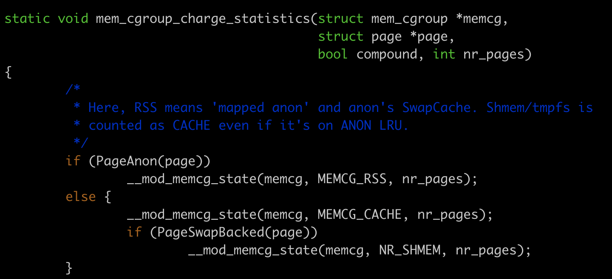

09 Page Cache：为什么我的容器内存使用量总是在临界点
================================

你好，我是程远。

上一讲，我们讲了 Memory Cgroup 是如何控制一个容器的内存的。我们已经知道了，如果容器使用的物理内存超过了 Memory Cgroup 里的 memory.limit\_in\_bytes 值，那么容器中的进程会被 OOM Killer 杀死。

不过在一些容器的使用场景中，比如容器里的应用有很多文件读写，你会发现整个容器的内存使用量已经很接近 Memory Cgroup 的上限值了，但是在容器中我们接着再申请内存，还是可以申请出来，并且没有发生 OOM。

这是怎么回事呢？今天这一讲我就来聊聊这个问题。

问题再现
----

我们可以用这里的代码做个容器镜像，然后用下面的这个脚本启动容器，并且设置容器 Memory Cgroup 里的内存上限值是 100MB（104857600bytes）。

```
# !/bin/bash
docker stop page_cache;docker rm page_cache
if [ ! -f ./test.file ]

then

  dd if=/dev/zero of=./test.file bs=4096 count=30000

  echo "Please run start_container.sh again "

  exit 0

fi

echo 3 > /proc/sys/vm/drop_caches

sleep 10
docker run -d --init --name page_cache -v $(pwd):/mnt registry/page_cache_test:v1

CONTAINER_ID=$(sudo docker ps --format "{{.ID}}\t{{.Names}}" | grep -i page_cache | awk '{print $1}')
echo $CONTAINER_ID

CGROUP_CONTAINER_PATH=$(find /sys/fs/cgroup/memory/ -name "*$CONTAINER_ID*")

echo 104857600 > $CGROUP_CONTAINER_PATH/memory.limit_in_bytes

cat $CGROUP_CONTAINER_PATH/memory.limit_in_bytes
```

把容器启动起来后，我们查看一下容器的 Memory Cgroup 下的 memory.limit\_in\_bytes 和 memory.usage\_in\_bytes 这两个值。

如下图所示，我们可以看到容器内存的上限值设置为 104857600bytes（100MB），而这时整个容器的已使用内存显示为 104767488bytes，这个值已经非常接近上限值了。

我们把容器内存上限值和已使用的内存数值做个减法，104857600–104767488= 90112bytes，只差大概 90KB 左右的大小。


但是，如果这时候我们继续启动一个程序，让这个程序申请并使用 50MB 的物理内存，就会发现这个程序还是可以运行成功，这时候容器并没有发生 OOM 的情况。

这时我们再去查看参数 memory.usage\_in\_bytes，就会发现它的值变成了 103186432bytes，比之前还少了一些。那这是怎么回事呢？


知识详解：Linux 系统有那些内存类型？
---------------------

要解释刚才我们看到的容器里内存分配的现象，就需要先理解 Linux 操作系统里有哪几种内存的类型。

因为我们只有知道了内存的类型，才能明白每一种类型的内存，容器分别使用了多少。而且，对于不同类型的内存，一旦总内存增高到容器里内存最高限制的数值，相应的处理方式也不同。

Linux 内存类型
----------

Linux 的各个模块都需要内存，比如内核需要分配内存给页表，内核栈，还有 slab，也就是内核各种数据结构的 Cache Pool；用户态进程里的堆内存和栈的内存，共享库的内存，还有文件读写的 Page Cache。

在这一讲里，我们讨论的 Memory Cgroup 里都不会对内核的内存做限制（比如页表，slab 等）。所以我们今天主要讨论与用户态相关的两个内存类型，RSS 和 Page Cache。

### RSS

先看什么是 RSS。RSS 是 Resident Set Size 的缩写，简单来说它就是指进程真正申请到物理页面的内存大小。这是什么意思呢？

应用程序在申请内存的时候，比如说，调用 malloc() 来申请 100MB 的内存大小，malloc() 返回成功了，这时候系统其实只是把 100MB 的虚拟地址空间分配给了进程，但是并没有把实际的物理内存页面分配给进程。

上一讲中，我给你讲过，当进程对这块内存地址开始做真正读写操作的时候，系统才会把实际需要的物理内存分配给进程。而这个过程中，进程真正得到的物理内存，就是这个 RSS 了。

比如下面的这段代码，我们先用 malloc 申请 100MB 的内存。

```
    p = malloc(100 * MB);

            if (p == NULL)

                    return 0;

```

然后，我们运行 top 命令查看这个程序在运行了 malloc() 之后的内存，我们可以看到这个程序的虚拟地址空间（VIRT）已经有了 106728KB（～100MB)，但是实际的物理内存 RSS（top 命令里显示的是 RES，就是 Resident 的简写，和 RSS 是一个意思）在这里只有 688KB。


接着我们在程序里等待 30 秒之后，我们再对这块申请的空间里写入 20MB 的数据。

```
            sleep(30);

            memset(p, 0x00, 20 * MB)

```

当我们用 memset() 函数对这块地址空间写入 20MB 的数据之后，我们再用 top 查看，这时候可以看到虚拟地址空间（VIRT）还是 106728，不过物理内存 RSS（RES）的值变成了 21432（大小约为 20MB）， 这里的单位都是 KB。


所以，通过刚才上面的小实验，我们可以验证 RSS 就是进程里真正获得的物理内存大小。

对于进程来说，RSS 内存包含了进程的代码段内存，栈内存，堆内存，共享库的内存, 这些内存是进程运行所必须的。刚才我们通过 malloc/memset 得到的内存，就是属于堆内存。

具体的每一部分的 RSS 内存的大小，你可以查看 /proc/\[pid\]/smaps 文件。

### Page Cache

每个进程除了各自独立分配到的 RSS 内存外，如果进程对磁盘上的文件做了读写操作，Linux 还会分配内存，把磁盘上读写到的页面存放在内存中，这部分的内存就是 Page Cache。

Page Cache 的主要作用是提高磁盘文件的读写性能，因为系统调用 read() 和 write() 的缺省行为都会把读过或者写过的页面存放在 Page Cache 里。

还是用我们这一讲最开始的的例子：代码程序去读取 100MB 的文件，在读取文件前，系统中 Page Cache 的大小是 388MB，读取后 Page Cache 的大小是 506MB，增长了大约 100MB 左右，多出来的这 100MB，正是我们读取文件的大小。


在 Linux 系统里只要有空闲的内存，系统就会自动地把读写过的磁盘文件页面放入到 Page Cache 里。那么这些内存都被 Page Cache 占用了，一旦进程需要用到更多的物理内存，执行 malloc() 调用做申请时，就会发现剩余的物理内存不够了，那该怎么办呢？

这就要提到 Linux 的内存管理机制了。 Linux 的内存管理有一种内存页面回收机制（page frame reclaim），会根据系统里空闲物理内存是否低于某个阈值（wartermark），来决定是否启动内存的回收。

内存回收的算法会根据不同类型的内存以及内存的最近最少用原则，就是 LRU（Least Recently Used）算法决定哪些内存页面先被释放。因为 Page Cache 的内存页面只是起到 Cache 作用，自然是会被优先释放的。

所以，Page Cache 是一种为了提高磁盘文件读写性能而利用空闲物理内存的机制。同时，内存管理中的页面回收机制，又能保证 Cache 所占用的页面可以及时释放，这样一来就不会影响程序对内存的真正需求了。

### RSS & Page Cache in Memory Cgroup

学习了 RSS 和 Page Cache 的基本概念之后，我们下面来看不同类型的内存，特别是 RSS 和 Page Cache 是如何影响 Memory Cgroup 的工作的。

我们先从 Linux 的内核代码看一下，从 mem\_cgroup\_charge\_statistics() 这个函数里，我们可以看到 Memory Cgroup 也的确只是统计了 RSS 和 Page Cache 这两部分的内存。

RSS 的内存，就是在当前 Memory Cgroup 控制组里所有进程的 RSS 的总和；而 Page Cache 这部分内存是控制组里的进程读写磁盘文件后，被放入到 Page Cache 里的物理内存。



Memory Cgroup 控制组里 RSS 内存和 Page Cache 内存的和，正好是 memory.usage\_in\_bytes 的值。

当控制组里的进程需要申请新的物理内存，而且 memory.usage\_in\_bytes 里的值超过控制组里的内存上限值 memory.limit\_in\_bytes，这时我们前面说的 Linux 的内存回收（page frame reclaim）就会被调用起来。

那么在这个控制组里的 page cache 的内存会根据新申请的内存大小释放一部分，这样我们还是能成功申请到新的物理内存，整个控制组里总的物理内存开销 memory.usage\_in\_bytes 还是不会超过上限值 memory.limit\_in\_bytes。

解决问题
----

明白了 Memory Cgroup 中内存类型的统计方法，我们再回过头看这一讲开头的问题，为什么 memory.usage\_in\_bytes 与 memory.limit\_in\_bytes 的值只相差了 90KB，我们在容器中还是可以申请出 50MB 的物理内存？

我想你应该已经知道答案了，容器里肯定有大于 50MB 的内存是 Page Cache，因为作为 Page Cache 的内存在系统需要新申请物理内存的时候（作为 RSS）是可以被释放的。

知道了这个答案，那么我们怎么来验证呢？验证的方法也挺简单的，在 Memory Cgroup 中有一个参数 memory.stat，可以显示在当前控制组里各种内存类型的实际的开销。

那我们还是拿这一讲的容器例子，再跑一遍代码，这次要查看一下 memory.stat 里的数据。

第一步，我们还是用同样的脚本来启动容器，并且设置好容器的 Memory Cgroup 里的 memory.limit\_in\_bytes 值为 100MB。

启动容器后，这次我们不仅要看 memory.usage\_in\_bytes 的值，还要看一下 memory.stat。虽然 memory.stat 里的参数有不少，但我们目前只需要关注"cache"和"rss"这两个值。

我们可以看到，容器启动后，cache，也就是 Page Cache 占的内存是 99508224bytes，大概是 99MB，而 RSS 占的内存只有 1826816bytes，也就是 1MB 多一点。

这就意味着，在这个容器的 Memory Cgroup 里大部分的内存都被用作了 Page Cache，而这部分内存是可以被回收的。


那么我们再执行一下我们的mem\_alloc 程序，申请 50MB 的物理内存。

我们可以再来查看一下 memory.stat，这时候 cache 的内存值降到了 46632960bytes，大概 46MB，而 rss 的内存值到了 54759424bytes，54MB 左右吧。总的 memory.usage\_in\_bytes 值和之前相比，没有太多的变化。


从这里我们发现，Page Cache 内存对我们判断容器实际内存使用率的影响，目前 Page Cache 完全就是 Linux 内核的一个自动的行为，只要读写磁盘文件，只要有空闲的内存，就会被用作 Page Cache。

所以，判断容器真实的内存使用量，我们不能用 Memory Cgroup 里的 memory.usage\_in\_bytes，而需要用 memory.stat 里的 rss 值。这个很像我们用 free 命令查看节点的可用内存，不能看"free"字段下的值，而要看除去 Page Cache 之后的"available"字段下的值。

重点总结
----

这一讲我想让你知道，每个容器的 Memory Cgroup 在统计每个控制组的内存使用时包含了两部分，RSS 和 Page Cache。

RSS 是每个进程实际占用的物理内存，它包括了进程的代码段内存，进程运行时需要的堆和栈的内存，这部分内存是进程运行所必须的。

Page Cache 是进程在运行中读写磁盘文件后，作为 Cache 而继续保留在内存中的，它的目的是为了提高磁盘文件的读写性能。

当节点的内存紧张或者 Memory Cgroup 控制组的内存达到上限的时候，Linux 会对内存做回收操作，这个时候 Page Cache 的内存页面会被释放，这样空出来的内存就可以分配给新的内存申请。

正是 Page Cache 内存的这种 Cache 的特性，对于那些有频繁磁盘访问容器，我们往往会看到它的内存使用率一直接近容器内存的限制值（memory.limit\_in\_bytes）。但是这时候，我们并不需要担心它内存的不够， 我们在判断一个容器的内存使用状况的时候，可以把 Page Cache 这部分内存使用量忽略，而更多的考虑容器中 RSS 的内存使用量。

思考题
---

在容器里启动一个写磁盘文件的程序，写入 100MB 的数据，查看写入前和写入后，容器对应的 Memory Cgroup 里 memory.usage\_in\_bytes 的值以及 memory.stat 里的 rss/cache 值。

欢迎在留言区写下你的思考或疑问，我们一起交流探讨。如果这篇文章让你有所收获，也欢迎你分享给更多的朋友，一起学习进步。
