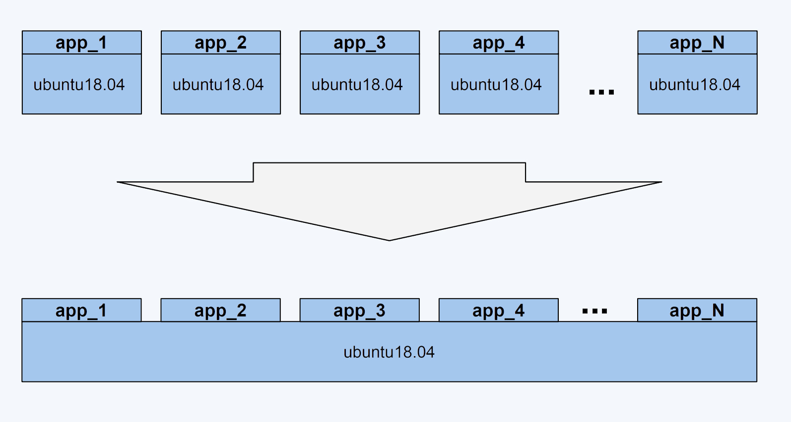
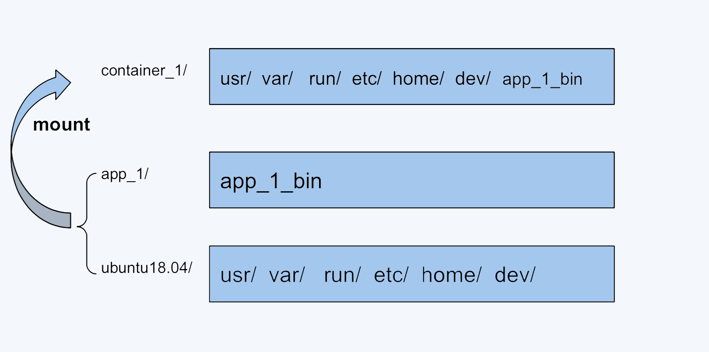
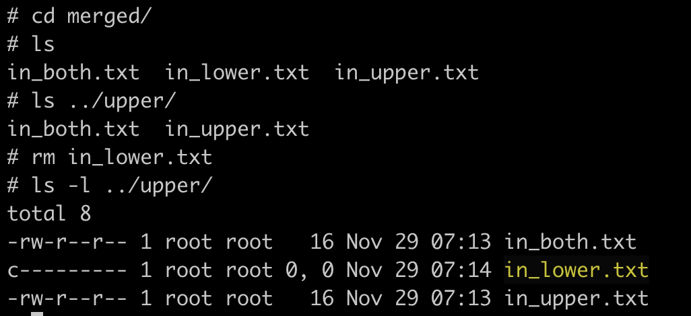

# 11 容器文件系统：我在容器中读写文件怎么变慢了

你好，我是程远。从这一讲开始，我们进入容器存储这个模块。

这一模块我们所讲的内容，都和容器里的文件读写密切相关。因为所有的容器的运行都需要一个容器文件系统，那么我们就从容器文件系统先开始讲起。

那我们还是和以前一样，先来看看我之前碰到了什么问题。

这个问题具体是我们在宿主机上，把 Linux 从 ubuntu18.04 升级到 ubuntu20.04 之后发现的。

在我们做了宿主机的升级后，启动了一个容器，在容器里用 fio 这个磁盘性能测试工具，想看一下容器里文件的读写性能。结果我们很惊讶地发现，在 ubuntu 20.04 宿主机上的容器中文件读写的性能只有 ubuntu18.04 宿主机上的 1/8 左右了，那这是怎么回事呢？

## 问题再现

这里我提醒一下你，因为涉及到两个 Linux 的虚拟机，问题再现这里我为你列出了关键的结果输出截图，不方便操作的同学可以重点看其中的思路。

我们可以先启动一个 ubuntu18.04 的虚拟机，它的 Linux 内核版本是 4.15 的，然后在虚拟机上用命令 docker run -it ubuntu:18.04 bash 启动一个容器，接着在容器里运行 fio 这条命令，看一下在容器中读取文件的性能。

```
# fio -direct=1 -iodepth=64 -rw=read -ioengine=libaio -bs=4k -size=10G -numjobs=1  -name=./fio.test

```

这里我给你解释一下 fio 命令中的几个主要参数：

第一个参数是"-direct=1"，代表采用非 buffered I/O 文件读写的方式，避免文件读写过程中内存缓冲对性能的影响。

接着我们来看这"-iodepth=64"和"-ioengine=libaio"这两个参数，这里指文件读写采用异步 I/O（Async I/O）的方式，也就是进程可以发起多个 I/O 请求，并且不用阻塞地等待 I/O 的完成。稍后等 I/O 完成之后，进程会收到通知。

这种异步 I/O 很重要，因为它可以极大地提高文件读写的性能。在这里我们设置了同时发出 64 个 I/O 请求。

然后是"-rw=read，-bs=4k，-size=10G"，这几个参数指这个测试是个读文件测试，每次读 4KB 大小数块，总共读 10GB 的数据。

最后一个参数是"-numjobs=1"，指只有一个进程 / 线程在运行。

所以，这条 fio 命令表示我们通过异步方式读取了 10GB 的磁盘文件，用来计算文件的读取性能。

那我们看到在 ubuntu 18.04，内核 4.15 上的容器 I/O 性能是 584MB/s 的带宽，IOPS（I/O per second）是 150K 左右。


同样我们再启动一个 ubuntu 20.04，内核 5.4 的虚拟机，然后在它的上面也启动一个容器。

我们运行 docker run -it ubuntu:20.04 bash ，接着在容器中使用同样的 fio 命令，可以看到它的 I/O 性能是 70MB 带宽，IOPS 是 18K 左右。实践证明，这的确比老版本的 ubuntu 18.04 差了很多。


## 知识详解

### 如何理解容器文件系统？

刚才我们对比了升级前后的容器读写性能差异，那想要分析刚刚说的这个性能的差异，我们需要先理解容器的文件系统。

我们在容器里，运行 df 命令，你可以看到在容器中根目录 (/) 的文件系统类型是"overlay"，它不是我们在普通 Linux 节点上看到的 Ext4 或者 XFS 之类常见的文件系统。

那么看到这里你肯定想问，Overlay 是一个什么样的文件系统呢，容器为什么要用这种文件系统？别急，我会一步一步带你分析。


在说容器文件系统前，我们先来想象一下如果没有文件系统管理的话会怎样。假设有这么一个场景，在一个宿主机上需要运行 100 个容器。

在我们这个课程的第一讲里，我们就说过每个容器都需要一个镜像，这个镜像就把容器中程序需要运行的二进制文件，库文件，配置文件，其他的依赖文件等全部都打包成一个镜像文件。

如果没有特别的容器文件系统，只是普通的 Ext4 或者 XFS 文件系统，那么每次启动一个容器，就需要把一个镜像文件下载并且存储在宿主机上。

我举个例子帮你理解，比如说，假设一个镜像文件的大小是 500MB，那么 100 个容器的话，就需要下载 500MB\*100= 50GB 的文件，并且占用 50GB 的磁盘空间。

如果你再分析一下这 50GB 里的内容，你会发现，在绝大部分的操作系统里，库文件都是差不多的。而且，在容器运行的时候，这类文件也不会被改动，基本上都是只读的。

特别是这样的情况：假如这 100 个容器镜像都是基于"ubuntu:18.04"的，每个容器镜像只是额外复制了 50MB 左右自己的应用程序到"ubuntu: 18.04"里，那么就是说在总共 50GB 的数据里，有 90% 的数据是冗余的。

讲到这里，你不难推测出理想的情况应该是什么样的？

没错，当然是在一个宿主机上只要下载并且存储存一份"ubuntu:18.04"，所有基于"ubuntu:18.04"镜像的容器都可以共享这一份通用的部分。这样设置的话，不同容器启动的时候，只需要下载自己独特的程序部分就可以。就像下面这张图展示的这样。



正是为了有效地减少磁盘上冗余的镜像数据，同时减少冗余的镜像数据在网络上的传输，选择一种针对于容器的文件系统是很有必要的，而这类的文件系统被称为 UnionFS。

UnionFS 这类文件系统实现的主要功能是把多个目录（处于不同的分区）一起挂载（mount）在一个目录下。这种多目录挂载的方式，正好可以解决我们刚才说的容器镜像的问题。

比如，我们可以把 ubuntu18.04 这个基础镜像的文件放在一个目录 ubuntu18.04/ 下，容器自己额外的程序文件 app_1_bin 放在 app_1/ 目录下。

然后，我们把这两个目录挂载到 container_1/ 这个目录下，作为容器 1 看到的文件系统；对于容器 2，就可以把 ubuntu18.04/ 和 app_2/ 两个目录一起挂载到 container_2 的目录下。

这样在节点上我们只要保留一份 ubuntu18.04 的文件就可以了。



### OverlayFS

UnionFS 类似的有很多种实现，包括在 Docker 里最早使用的 AUFS，还有目前我们使用的 OverlayFS。前面我们在运行df的时候，看到的文件系统类型"overlay"指的就是 OverlayFS。

在 Linux 内核 3.18 版本中，OverlayFS 代码正式合入 Linux 内核的主分支。在这之后，OverlayFS 也就逐渐成为各个主流 Linux 发行版本里缺省使用的容器文件系统了。

网上 Julia Evans 有个blog，里面有个的 OverlayFS 使用的例子，很简单，我们也拿这个例子来理解一下 OverlayFS 的一些基本概念。

你可以先执行一下这一组命令。

```
# !/bin/bash
umount ./merged

rm upper lower merged work -r
mkdir upper lower merged work

echo "I'm from lower!" > lower/in_lower.txt

echo "I'm from upper!" > upper/in_upper.txt

# `in_both` is in both directories

echo "I'm from lower!" > lower/in_both.txt

echo "I'm from upper!" > upper/in_both.txt
sudo mount -t overlay overlay \

 -o lowerdir=./lower,upperdir=./upper,workdir=./work \

 ./merged

```

我们可以看到，OverlayFS 的一个 mount 命令牵涉到四类目录，分别是 lower，upper，merged 和 work，那它们是什么关系呢？

我们看下面这张图，这和前面 UnionFS 的工作示意图很像，也不奇怪，OverlayFS 就是 UnionFS 的一种实现。接下来，我们从下往上依次看看每一层的功能。

首先，最下面的"lower/"，也就是被 mount 两层目录中底下的这层（lowerdir）。

在 OverlayFS 中，最底下这一层里的文件是不会被修改的，你可以认为它是只读的。我还想提醒你一点，在这个例子里我们只有一个 lower/ 目录，不过 OverlayFS 是支持多个 lowerdir 的。

然后我们看"uppder/"，它是被 mount 两层目录中上面的这层 （upperdir）。在 OverlayFS 中，如果有文件的创建，修改，删除操作，那么都会在这一层反映出来，它是可读写的。

接着是最上面的"merged" ，它是挂载点（mount point）目录，也是用户看到的目录，用户的实际文件操作在这里进行。

其实还有一个"work/"，这个目录没有在这个图里，它只是一个存放临时文件的目录，OverlayFS 中如果有文件修改，就会在中间过程中临时存放文件到这里。


从这个例子我们可以看到，OverlayFS 会 mount 两层目录，分别是 lower 层和 upper 层，这两层目录中的文件都会映射到挂载点上。

从挂载点的视角看，upper 层的文件会覆盖 lower 层的文件，比如"in_both.txt"这个文件，在 lower 层和 upper 层都有，但是挂载点 merged/ 里看到的只是 upper 层里的 in_both.txt.

如果我们在 merged/ 目录里做文件操作，具体包括这三种。

第一种，新建文件，这个文件会出现在 upper/ 目录中。

第二种是删除文件，如果我们删除"in_upper.txt"，那么这个文件会在 upper/ 目录中消失。如果删除"in_lower.txt", 在 lower/ 目录里的"in_lower.txt"文件不会有变化，只是在 upper/ 目录中增加了一个特殊文件来告诉 OverlayFS，"in_lower.txt'这个文件不能出现在 merged/ 里了，这就表示它已经被删除了。



还有一种操作是修改文件，类似如果修改"in_lower.txt"，那么就会在 upper/ 目录中新建一个"in_lower.txt"文件，包含更新的内容，而在 lower/ 中的原来的实际文件"in_lower.txt"不会改变。

通过这个例子，我们知道了 OverlayFS 是怎么工作了。那么我们可以再想一想，怎么把它运用到容器的镜像文件上？

其实也不难，从系统的 mounts 信息中，我们可以看到 Docker 是怎么用 OverlayFS 来挂载镜像文件的。容器镜像文件可以分成多个层（layer），每层可以对应 OverlayFS 里 lowerdir 的一个目录，lowerdir 支持多个目录，也就可以支持多层的镜像文件。

在容器启动后，对镜像文件中修改就会被保存在 upperdir 里了。


## 解决问题

在理解了容器使用的 OverlayFS 文件系统后，我们再回到开始的问题，为什么在宿主机升级之后，在容器里读写文件的性能降低了？现在我们至少应该知道，在容器中读写文件性能降低了，那么应该是 OverlayFS 的性能在新的 ubuntu20.04 中降低了。

要找到问题的根因，我们还需要进一步的 debug。对于性能问题，我们需要使用 Linux 下的 perf 工具来查看一下，具体怎么使用 perf 来解决问题，我们会在后面讲解。

这里你只要看一下结果就可以了，自下而上是函数的一个调用顺序。通过 perf 工具，我们可以比较在容器中运行 fio 的时候，ubuntu 18.04 和 ubuntu 20.04 在内核函数调用上的不同。

ubuntu 18.04 (Linux内核4.15)环境下使用perf输出的函数调用结果

ubuntu 20.04 (Linux内核 5.4)环境下使用perf输出的函数调用结果

我们从系统调用框架之后的函数 aio_read() 开始比较：Linux 内核 4.15 里 aio_read() 之后调用的是 xfs_file_read_iter()，而在 Linux 内核 5.4 里，aio_read() 之后调用的是 ovl_read_iter() 这个函数，之后再调用 xfs_file_read_iter()。

这样我们就可以去查看一下，在内核 4.15 之后新加入的这个函数 ovl_read_iter() 的代码。

查看代码后我们就能明白，Linux 为了完善 OverlayFS，增加了 OverlayFS 自己的 read/write 函数接口，从而不再直接调用 OverlayFS 后端文件系统（比如 XFS，Ext4）的读写接口。但是它只实现了同步 I/O（sync I/O），并没有实现异步 I/O。

而在 fio 做文件系统性能测试的时候使用的是异步 I/O，这样才可以得到文件系统的性能最大值。所以，在内核 5.4 上就无法对 OverlayFS 测出最高的性能指标了。

在 Linux 内核 5.6 版本中，这个问题已经通过下面的这个补丁给解决了，有兴趣的同学可以看一下。

```
commit 2406a307ac7ddfd7effeeaff6947149ec6a95b4e

Author: Jiufei Xue <[email protected]>

Date:   Wed Nov 20 17:45:26 2019 +0800
    ovl: implement async IO routines
    A performance regression was observed since linux v4.19 with aio test using

    fio with iodepth 128 on overlayfs.  The queue depth of the device was

    always 1 which is unexpected.
    After investigation, it was found that commit 16914e6fc7e1 ("ovl: add

    ovl_read_iter()") and commit 2a92e07edc5e ("ovl: add ovl_write_iter()")

    resulted in vfs_iter_{read,write} being called on underlying filesystem,

    which always results in syncronous IO.
    Implement async IO for stacked reading and writing.  This resolves the

    performance regresion.
    This is implemented by allocating a new kiocb for submitting the AIO

    request on the underlying filesystem.  When the request is completed, the

    new kiocb is freed and the completion callback is called on the original

    iocb.
    Signed-off-by: Jiufei Xue <[email protected]>

    Signed-off-by: Miklos Szeredi <[email protected]>
```

## 重点总结

这一讲，我们最主要的内容是理解容器文件系统。为什么要有容器自己的文件系统？很重要的一点是减少相同镜像文件在同一个节点上的数据冗余，可以节省磁盘空间，也可以减少镜像文件下载占用的网络资源。

作为容器文件系统，UnionFS 通过多个目录挂载的方式工作。OverlayFS 就是 UnionFS 的一种实现，是目前主流 Linux 发行版本中缺省使用的容器文件系统。

OverlayFS 也是把多个目录合并挂载，被挂载的目录分为两大类：lowerdir 和 upperdir。

lowerdir 允许有多个目录，在被挂载后，这些目录里的文件都是不会被修改或者删除的，也就是只读的；upperdir 只有一个，不过这个目录是可读写的，挂载点目录中的所有文件修改都会在 upperdir 中反映出来。

容器的镜像文件中各层正好作为 OverlayFS 的 lowerdir 的目录，然后加上一个空的 upperdir 一起挂载好后，就组成了容器的文件系统。

OverlayFS 在 Linux 内核中还在不断的完善，比如我们在这一讲看到的在 kenel 5.4 中对异步 I/O 操作的缺失，这也是我们在使用容器文件系统的时候需要注意的。

## 思考题

在这一讲 OverlayFS 的例子的基础上，建立 2 个 lowerdir 的目录，并且在目录中建立相同文件名的文件，然后一起做一个 overlay mount，看看会发生什么？

欢迎在留言区和我分享你的思考和疑问。如果这篇文章让你有所收获，也欢迎分享给你的同事、朋友，一起学习探讨。
