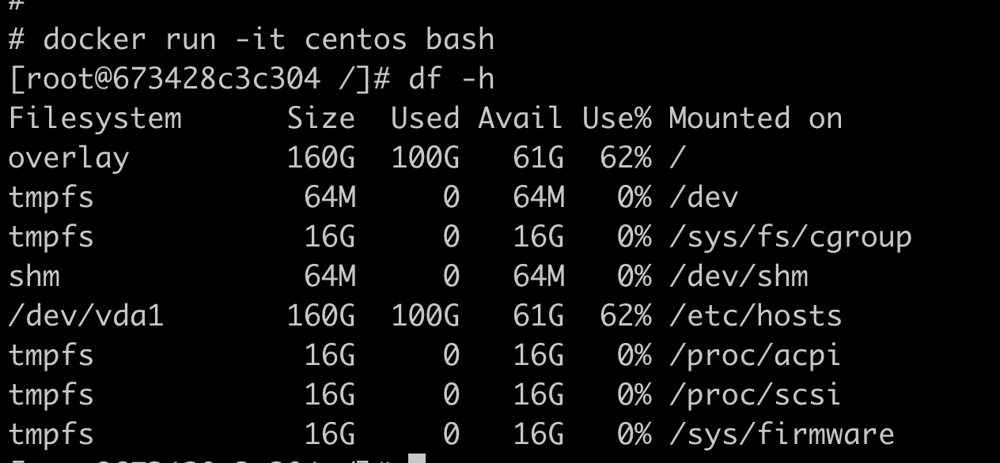
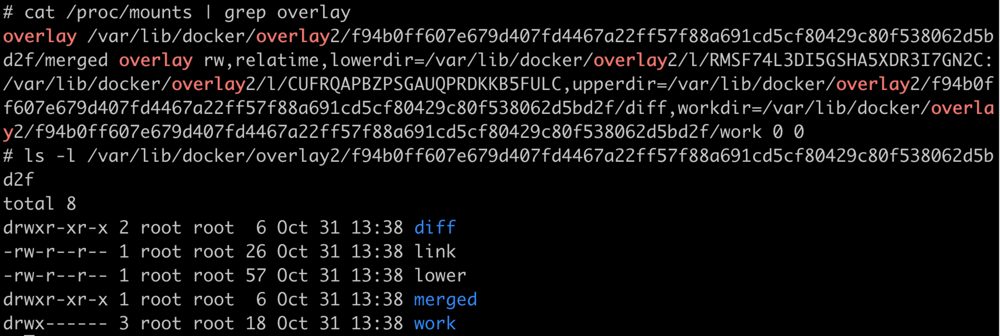

12 容器文件Quota：容器为什么把宿主机的磁盘写满了？
=============================

你好，我是程远。今天我们聊一聊容器文件 Quota。

上一讲，我们学习了容器文件系统 OverlayFS，这个 OverlayFS 有两层，分别是 lowerdir 和 upperdir。lowerdir 里是容器镜像中的文件，对于容器来说是只读的；upperdir 存放的是容器对文件系统里的所有改动，它是可读写的。

从宿主机的角度看，upperdir 就是一个目录，如果容器不断往容器文件系统中写入数据，实际上就是往宿主机的磁盘上写数据，这些数据也就存在于宿主机的磁盘目录中。

当然对于容器来说，如果有大量的写操作是不建议写入容器文件系统的，一般是需要给容器挂载一个 volume，用来满足大量的文件读写。

但是不能避免的是，用户在容器中运行的程序有错误，或者进行了错误的配置。

比如说，我们把 log 写在了容器文件系统上，并且没有做 log rotation，那么时间一久，就会导致宿主机上的磁盘被写满。这样影响的就不止是容器本身了，而是整个宿主机了。

那对于这样的问题，我们该怎么解决呢？

问题再现
----

我们可以自己先启动一个容器，一起试试不断地往容器文件系统中写入数据，看看是一个什么样的情况。

用 Docker 启动一个容器后，我们看到容器的根目录 (/) 也就是容器文件系统 OverlayFS，它的大小是 160G，已经使用了 100G。其实这个大小也是宿主机上的磁盘空间和使用情况。



这时候，我们可以回到宿主机上验证一下，就会发现宿主机的根目录 (/) 的大小也是 160G，同样是使用了 100G。


好，那现在我们再往容器的根目录里写入 10GB 的数据。

这里我们可以看到容器的根目录使用的大小增加了，从刚才的 100G 变成现在的 110G。而多写入的 10G 大小的数据，对应的是 test.log 这个文件。


接下来，我们再回到宿主机上，可以看到宿主机上的根目录 (/) 里使用的大小也是 110G 了。


我们还是继续看宿主机，看看 OverlayFS 里 upperdir 目录中有什么文件？

这里我们仍然可以通过 /proc/mounts 这个路径，找到容器 OverlayFS 对应的 lowerdir 和 upperdir。因为写入的数据都在 upperdir 里，我们就只要看 upperdir 对应的那个目录就行了。果然，里面存放着容器写入的文件 test.log，它的大小是 10GB。


通过这个例子，我们已经验证了在容器中对于 OverlayFS 中写入数据，其实就是往宿主机的一个目录（upperdir）里写数据。我们现在已经写了 10GB 的数据，如果继续在容器中写入数据，结果估计你也知道了，就是会写满宿主机的磁盘。

那遇到这种情况，我们该怎么办呢？

知识详解
----

容器写自己的 OverlayFS 根目录，结果把宿主机的磁盘写满了。发生这个问题，我们首先就会想到需要对容器做限制，限制它写入自己 OverlayFS 的数据量，比如只允许一个容器写 100MB 的数据。

不过我们实际查看 OverlayFS 文件系统的特性，就会发现没有直接限制文件写入量的特性。别担心，在没有现成工具的情况下，我们只要搞懂了原理，就能想出解决办法。

所以我们再来分析一下 OverlayFS，它是通过 lowerdir 和 upperdir 两层目录联合挂载来实现的，lowerdir 是只读的，数据只会写在 upperdir 中。

那我们是不是可以通过限制 upperdir 目录容量的方式，来限制一个容器 OverlayFS 根目录的写入数据量呢？

沿着这个思路继续往下想，因为 upperdir 在宿主机上也是一个普通的目录，这样就要看宿主机上的文件系统是否可以支持对一个目录限制容量了。

对于 Linux 上最常用的两个文件系统 XFS 和 ext4，它们有一个特性 Quota，那我们就以 XFS 文件系统为例，学习一下这个 Quota 概念，然后看看这个特性能不能限制一个目录的使用量。

### XFS Quota

在 Linux 系统里的 XFS 文件系统缺省都有 Quota 的特性，这个特性可以为 Linux 系统里的一个用户（user），一个用户组（group）或者一个项目（project）来限制它们使用文件系统的额度（quota），也就是限制它们可以写入文件系统的文件总量。

因为我们的目标是要限制一个目录中总体的写入文件数据量，那么显然给用户和用户组限制文件系统的写入数据量的模式，并不适合我们的这个需求。

因为同一个用户或者用户组可以操作多个目录，多个用户或者用户组也可以操作同一个目录，这样对一个用户或者用户组的限制，就很难用来限制一个目录。

那排除了限制用户或用户组的模式，我们再来看看 Project 模式。Project 模式是怎么工作的呢？

我举一个例子你会更好理解，对 Linux 熟悉的同学可以一边操作，一边体会一下它的工作方式。不熟悉的同学也没关系，可以重点关注我后面的讲解思路。

首先我们要使用 XFS Quota 特性，必须在文件系统挂载的时候加上对应的 Quota 选项，比如我们目前需要配置 Project Quota，那么这个挂载参数就是"pquota"。

对于根目录来说，这个参数必须作为一个内核启动的参数"rootflags=pquota"，这样设置就可以保证根目录在启动挂载的时候，带上 XFS Quota 的特性并且支持 Project 模式。

我们可以从 /proc/mounts 信息里，看看根目录是不是带"prjquota"字段。如果里面有这个字段，就可以确保文件系统已经带上了支持 project 模式的 XFS quota 特性。


下一步，我们还需要给一个指定的目录打上一个 Project ID。这个步骤我们可以使用 XFS 文件系统自带的工具 xfs\_quota 来完成，然后执行下面的这个命令就可以了。

执行命令之前，我先对下面的命令和输出做两点解释，让你理解这个命令的含义。

第一点，新建的目录 /tmp/xfs\_prjquota，我们想对它做 Quota 限制。所以在这里要对它打上一个 Project ID。

第二点，通过 xfs\_quota 这条命令，我们给 /tmp/xfs\_prjquota 打上 Project ID 值 101，这个 101 是我随便选的一个数字，就是个 ID 标识，你先有个印象。在后面针对 Project 进行 Quota 限制的时候，我们还会用到这个 ID。

```
# mkdir -p  /tmp/xfs_prjquota

# xfs_quota -x -c 'project -s -p /tmp/xfs_prjquota 101' /

Setting up project 101 (path /tmp/xfs_prjquota)...

Processed 1 (/etc/projects and cmdline) paths for project 101 with recursion depth infinite (-1).

```

最后，我们还是使用 xfs\_quota 命令，对 101（我们刚才建立的这个 Project ID）做 Quota 限制。

你可以执行下面这条命令，里面的"-p bhard=10m 101"就代表限制 101 这个 project ID，限制它的数据块写入量不能超过 10MB。

```
# xfs_quota -x -c 'limit -p bhard=10m 101' /

```

做好限制之后，我们可以尝试往 /tmp/xfs\_prjquota 写数据，看看是否可以超过 10MB。比如说，我们尝试写入 20MB 的数据到 /tmp/xfs\_prjquota 里。

我们可以看到，执行 dd 写入命令，就会有个出错返回信息"No space left on device"。这表示已经不能再往这个目录下写入数据了，而最后写入数据的文件 test.file 大小也停留在了 10MB。

```
# dd if=/dev/zero of=/tmp/xfs_prjquota/test.file bs=1024 count=20000

dd: error writing '/tmp/xfs_prjquota/test.file': No space left on device

10241+0 records in

10240+0 records out

10485760 bytes (10 MB, 10 MiB) copied, 0.0357122 s, 294 MB/s
# ls -l /tmp/xfs_prjquota/test.file

-rw-r--r-- 1 root root 10485760 Oct 31 10:00 /tmp/xfs_prjquota/test.file

```

好了，做到这里，我们发现使用 XFS Quota 的 Project 模式，确实可以限制一个目录里的写入数据量，它实现的方式其实也不难，就是下面这两步。

第一步，给目标目录打上一个 Project ID，这个 ID 最终是写到目录对应的 inode 上。

这里我解释一下，inode 是文件系统中用来描述一个文件或者一个目录的元数据，里面包含文件大小，数据块的位置，文件所属用户 / 组，文件读写属性以及其他一些属性。

那么一旦目录打上这个 ID 之后，在这个目录下的新建的文件和目录也都会继承这个 ID。

第二步，在 XFS 文件系统中，我们需要给这个 project ID 设置一个写入数据块的限制。

有了 ID 和限制值之后，文件系统就可以统计所有带这个 ID 文件的数据块大小总和，并且与限制值进行比较。一旦所有文件大小的总和达到限制值，文件系统就不再允许更多的数据写入了。

用一句话概括，XFS Quota 就是通过前面这两步限制了一个目录里写入的数据量。

解决问题
----

我们理解了 XFS Quota 对目录限流的机制之后，再回到我们最开始的问题，如何确保容器不会写满宿主机上的磁盘。

你应该已经想到了，方法就是对 OverlayFS 的 upperdir 目录做 XFS Quota 的限流，没错，就是这个解决办法！

其实 Docker 也已经实现了限流功能，也就是用 XFS Quota 来限制容器的 OverlayFS 大小。

我们在用 docker run 启动容器的时候，加上一个参数 --storage-opt size= ，就能限制住容器 OverlayFS 文件系统可写入的最大数据量了。

我们可以一起试一下，这里我们限制的 size 是 10MB。

进入容器之后，先运行 df -h 命令，这时候你可以看到根目录 (/)overlayfs 文件系统的大小就 10MB，而不是我们之前看到的 160GB 的大小了。这样容器在它的根目录下，最多只能写 10MB 数据，就不会把宿主机的磁盘给写满了。


完成了上面这个小试验之后，我们可以再看一下 Docker 的代码，看看它的实现是不是和我们想的一样。

Docker 里SetQuota()函数就是用来实现 XFS Quota 限制的，我们可以看到它里面最重要的两步，分别是 setProjectID 和 setProjectQuota 。

其实，这两步做的就是我们在基本概念中提到的那两步：

第一步，给目标目录打上一个 Project ID；第二步，为这个 Project ID 在 XFS 文件系统中，设置一个写入数据块的限制。

```
// SetQuota - assign a unique project id to directory and set the quota limits

// for that project id
func (q *Control) SetQuota(targetPath string, quota Quota) error {

        q.RLock()

        projectID, ok := q.quotas[targetPath]

        q.RUnlock()
        if !ok {

                q.Lock()

                projectID = q.nextProjectID
                //

                // assign project id to new container directory

                //
                err := setProjectID(targetPath, projectID)

                if err != nil {

                        q.Unlock()

                        return err

                }
                q.quotas[targetPath] = projectID

                q.nextProjectID++

                q.Unlock()

        }
        //

        // set the quota limit for the container's project id

        //
        logrus.Debugf("SetQuota(%s, %d): projectID=%d", targetPath, quota.Size, projectID)

        return setProjectQuota(q.backingFsBlockDev, projectID, quota)

}

```

那 setProjectID 和 setProjectQuota 是如何实现的呢？

你可以进入到这两个函数里看一下，它们分别调用了 ioctl() 和 quotactl() 这两个系统调用来修改内核中 XFS 的数据结构，从而完成 project ID 的设置和 Quota 值的设置。具体的细节，我不在这里展开了，如果你有兴趣，可以继续去查看内核中对应的代码。

好了，Docker 里 XFS Quota 操作的步骤完全和我们先前设想的一样，那么还有最后一个问题要解决，XFS Quota 限制的目录是哪一个？

这个我们可以根据 /proc/mounts 中容器的 OverlayFS Mount 信息，再结合 Docker 的代码，就可以知道限制的目录是"/var/lib/docker/overlay2/<docker\_id>"。那这个目录下有什么呢？果然 upperdir 目录中有对应的"diff"目录，就在里面！



讲到这里，我想你已经清楚了对于使用 OverlayFS 的容器，我们应该如何去防止它把宿主机的磁盘给写满了吧？方法就是对 OverlayFS 的 upperdir 目录做 XFS Quota 的限流。

重点总结
----

我们这一讲的问题是，容器写了大量数据到 OverlayFS 文件系统的根目录，在这个情况下，就会把宿主机的磁盘写满。

由于 OverlayFS 自己没有专门的特性，可以限制文件数据写入量。这时我们通过实际试验找到了解决思路：依靠底层文件系统的 Quota 特性来限制 OverlayFS 的 upperdir 目录的大小，这样就能实现限制容器写磁盘的目的。

底层文件系统 XFS Quota 的 Project 模式，能够限制一个目录的文件写入量，这个功能具体是通过这两个步骤实现：

第一步，给目标目录打上一个 Project ID。

第二步，给这个 Project ID 在 XFS 文件系统中设置一个写入数据块的限制。

Docker 正是使用了这个方法，也就是用 XFS Quota 来限制 OverlayFS 的 upperdir 目录，通过这个方式控制容器 OverlayFS 的根目录大小。

当我们理解了这个方法后，对于不是用 Docker 启动的容器，比如直接由 containerd 启动起来的容器，也可以自己实现 XFS Quota 限制 upperdir 目录。这样就能有效控制容器对 OverlayFS 的写数据操作，避免宿主机的磁盘被写满。

思考题
---

在正文知识详解的部分，我们使用"xfs\_quota"给目录打了 project ID 并且限制了文件写入的数据量。那在做完这样的限制之后，我们是否能用 xfs\_quota 命令，查询到被限制目录的 project ID 和限制的数据量呢？

欢迎你在留言区分享你的思考或疑问。如果这篇文章让你有所收获，也欢迎转发给你的同事、朋友，一起交流和学习。
