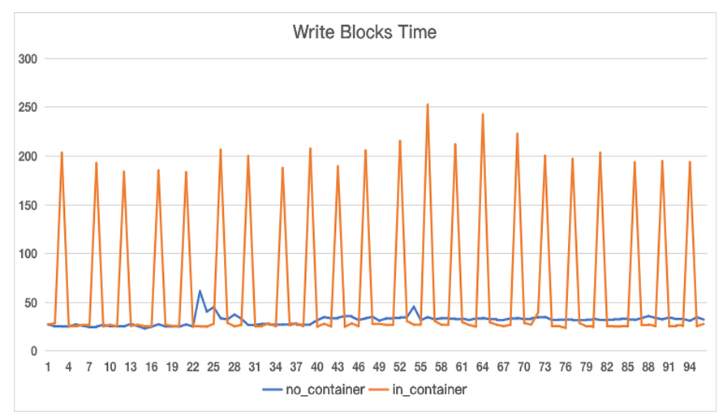
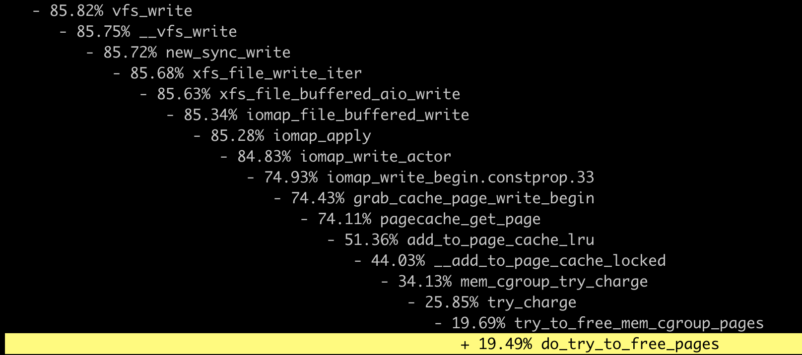

# 14 容器中的内存与IO：容器写文件的延时为什么波动很大？

你好，我是程远。这一讲，我们继续聊一聊容器中写文件性能波动的问题。

你应该还记得，我们上一讲中讲过 Linux 中的两种 I/O 模式，Direct I/O 和 Buffered I/O。

对于 Linux 的系统调用 write() 来说，Buffered I/O 是缺省模式，使用起来比较方便，而且从用户角度看，在大多数的应用场景下，用 Buffered I/O 的 write() 函数调用返回要快一些。所以，Buffered I/O 在程序中使用得更普遍一些。

当使用 Buffered I/O 的应用程序从虚拟机迁移到容器，这时我们就会发现多了 Memory Cgroup 的限制之后，write() 写相同大小的数据块花费的时间，延时波动会比较大。

这是怎么回事呢？接下来我们就带着问题开始今天的学习。

## 问题再现

我们可以先动手写一个小程序，用来模拟刚刚说的现象。

这个小程序我们这样来设计：从一个文件中每次读取一个 64KB 大小的数据块，然后写到一个新文件中，它可以不断读写 10GB 大小的数据。同时我们在这个小程序中做个记录，记录写每个 64KB 的数据块需要花费的时间。

我们可以先在虚拟机里直接运行，虚拟机里内存大小是大于 10GB 的。接着，我们把这个程序放到容器中运行，因为这个程序本身并不需要很多的内存，我们给它做了一个 Memory Cgroup 的内存限制，设置为 1GB。

运行结束后，我们比较一下程序写数据块的时间。我把结果画了一张图，图里的纵轴是时间，单位 us；横轴是次数，在这里我们记录了 96 次。图中橘红色的线是在容器里运行的结果，蓝色的线是在虚拟机上运行的结果。

结果很明显，在容器中写入数据块的时间会时不时地增高到 200us；而在虚拟机里的写入数据块时间就比较平稳，一直在 30～50us 这个范围内。



通过这个小程序，我们再现了问题，那我们就来分析一下，为什么会产生这样的结果。

## 时间波动是因为 Dirty Pages 的影响么？

我们对文件的写入操作是 Buffered I/O。在前一讲中，我们其实已经知道了，对于 Buffer I/O，用户的数据是先写入到 Page Cache 里的。而这些写入了数据的内存页面，在它们没有被写入到磁盘文件之前，就被叫作 dirty pages。

Linux 内核会有专门的内核线程（每个磁盘设备对应的 kworker/flush 线程）把 dirty pages 写入到磁盘中。那我们自然会这样猜测，也许是 Linux 内核对 dirty pages 的操作影响了 Buffered I/O 的写操作？

想要验证这个想法，我们需要先来看看 dirty pages 是在什么时候被写入到磁盘的。这里就要用到 /proc/sys/vm 里和 dirty page 相关的内核参数了，我们需要知道所有相关参数的含义，才能判断出最后真正导致问题发生的原因。

现在我们挨个来看一下。为了方便后面的讲述，我们可以设定一个比值 A，A 等于 dirty pages 的内存 / 节点可用内存 \*100%。

第一个参数，dirty_background_ratio，这个参数里的数值是一个百分比值，缺省是 10%。如果比值 A 大于 dirty_background_ratio 的话，比如大于默认的 10%，内核 flush 线程就会把 dirty pages 刷到磁盘里。

第二个参数，是和 dirty_background_ratio 相对应一个参数，也就是 dirty_background_bytes，它和 dirty_background_ratio 作用相同。区别只是 dirty_background_bytes 是具体的字节数，它用来定义的是 dirty pages 内存的临界值，而不是比例值。

这里你还要注意，dirty_background_ratio 和 dirty_background_bytes 只有一个可以起作用，如果你给其中一个赋值之后，另外一个参数就归 0 了。

接下来我们看第三个参数，dirty_ratio，这个参数的数值也是一个百分比值，缺省是 20%。

如果比值 A，大于参数 dirty_ratio 的值，比如大于默认设置的 20%，这时候正在执行 Buffered I/O 写文件的进程就会被阻塞住，直到它写的数据页面都写到磁盘为止。

同样，第四个参数 dirty_bytes 与 dirty_ratio 相对应，它们的关系和 dirty_background_ratio 与 dirty_background_bytes 一样。我们给其中一个赋值后，另一个就会归零。

然后我们来看 dirty_writeback_centisecs，这个参数的值是个时间值，以百分之一秒为单位，缺省值是 500，也就是 5 秒钟。它表示每 5 秒钟会唤醒内核的 flush 线程来处理 dirty pages。

最后还有 dirty_expire_centisecs，这个参数的值也是一个时间值，以百分之一秒为单位，缺省值是 3000，也就是 30 秒钟。它定义了 dirty page 在内存中存放的最长时间，如果一个 dirty page 超过这里定义的时间，那么内核的 flush 线程也会把这个页面写入磁盘。

好了，从这些 dirty pages 相关的参数定义，你会想到些什么呢？

进程写操作上的时间波动，只有可能是因为 dirty pages 的数量很多，已经达到了第三个参数 dirty_ratio 的值。这时执行写文件功能的进程就会被暂停，直到写文件的操作将数据页面写入磁盘，写文件的进程才能继续运行，所以进程里一次写文件数据块的操作时间会增加。

刚刚说的是我们的推理，那情况真的会是这样吗？其实我们可以在容器中进程不断写入数据的时候，查看节点上 dirty pages 的实时数目。具体操作如下：

```
watch -n 1 "cat /proc/vmstat | grep dirty"
```

当我们的节点可用内存是 12GB 的时候，假设 dirty_ratio 是 20%，dirty_background_ratio 是 10%，那么我们在 1GB memory 容器中写 10GB 的数据，就会看到它实时的 dirty pages 数目，也就是 / proc/vmstat 里的 nr_dirty 的数值，这个数值对应的内存并不能达到 dirty_ratio 所占的内存值。


其实我们还可以再做个实验，就是在 dirty_bytes 和 dirty_background_bytes 里写入一个很小的值。

```
echo 8192 > /proc/sys/vm/dirty_bytes
echo 4096 > /proc/sys/vm/dirty_background_bytes
```

然后再记录一下容器程序里每写入 64KB 数据块的时间，这时候，我们就会看到，时不时一次写入的时间就会达到 9ms，这已经远远高于我们之前看到的 200us 了。

因此，我们知道了这个时间的波动，并不是强制把 dirty page 写入到磁盘引起的。

## 调试问题

那接下来，我们还能怎么分析这个问题呢？

我们可以用 perf 和 ftrace 这两个工具，对容器里写数据块的进程做个 profile，看看到底是调用哪个函数花费了比较长的时间。顺便说一下，我们在专题加餐里会专门介绍如何使用 perf、ftrace 等工具以及它们的工作原理，在这里你只要了解我们的调试思路就行。

怎么使用这两个工具去定位耗时高的函数呢？我大致思路是这样的：我们发现容器中的进程用到了 write() 这个函数调用，然后写 64KB 数据块的时间增加了，而 write() 是一个系统调用，那我们需要进行下面这两步操作。

第一步，我们要找到内核中 write() 这个系统调用函数下，又调用了哪些子函数。想找出主要的子函数我们可以查看代码，也可以用 perf 这个工具来得到。

然后是第二步，得到了 write() 的主要子函数之后，我们可以用 ftrace 这个工具来 trace 这些函数的执行时间，这样就可以找到花费时间最长的函数了。

好，下面我们就按照刚才梳理的思路来做一下。首先是第一步，我们在容器启动写磁盘的进程后，在宿主机上得到这个进程的 pid，然后运行下面的 perf 命令。

```
perf record -a -g -p <pid>
```

等写磁盘的进程退出之后，这个 perf record 也就停止了。

这时我们再执行 perf report 查看结果。把 vfs_write() 函数展开之后，我们就可以看到，write() 这个系统调用下面的调用到了哪些主要的子函数，到这里第一步就完成了。



下面再来做第二步，我们把主要的函数写入到 ftrace 的 set_ftrace_filter 里，然后把 ftrace 的 tracer 设置为 function_graph，并且打开 tracing_on 开启追踪。

```
# cd /sys/kernel/debug/tracing
# echo vfs_write >> set_ftrace_filter
# echo xfs_file_write_iter >> set_ftrace_filter
# echo xfs_file_buffered_aio_write >> set_ftrace_filter
# echo iomap_file_buffered_write
# echo iomap_file_buffered_write >> set_ftrace_filter
# echo pagecache_get_page >> set_ftrace_filter
# echo try_to_free_mem_cgroup_pages >> set_ftrace_filter
# echo try_charge >> set_ftrace_filter
# echo mem_cgroup_try_charge >> set_ftrace_filter
# echo function_graph > current_tracer
# echo 1 > tracing_on
```

这些设置完成之后，我们再运行一下容器中的写磁盘程序，同时从 ftrace 的 trace_pipe 中读取出追踪到的这些函数。

这时我们可以看到，当需要申请 Page Cache 页面的时候，write() 系统调用会反复地调用 mem_cgroup_try_charge()，并且在释放页面的时候，函数 do_try_to_free_pages() 花费的时间特别长，有 50+us（时间单位，micro-seconds）这么多。

```
  1)               |  vfs_write() {
  1)               |    xfs_file_write_iter [xfs]() {
  1)               |      xfs_file_buffered_aio_write [xfs]() {
  1)               |        iomap_file_buffered_write() {
  1)               |          pagecache_get_page() {
  1)               |            mem_cgroup_try_charge() {
  1)   0.338 us    |              try_charge();
  1)   0.791 us    |            }
  1)   4.127 us    |          }
…
  1)               |          pagecache_get_page() {
  1)               |            mem_cgroup_try_charge() {
  1)               |              try_charge() {
  1)               |                try_to_free_mem_cgroup_pages() {
  1) + 52.798 us   |                  do_try_to_free_pages();
  1) + 53.958 us   |                }
  1) + 54.751 us   |              }
  1) + 55.188 us   |            }
  1) + 56.742 us   |          }
…
  1) ! 109.925 us  |        }
  1) ! 110.558 us  |      }
  1) ! 110.984 us  |    }
  1) ! 111.515 us  |  }
```

看到这个 ftrace 的结果，你是不是会想到，我们在容器内存那一讲中提到的 Page Cahe 呢？

是的，这个问题的确和 Page Cache 有关，Linux 会把所有的空闲内存利用起来，一旦有 Buffered I/O，这些内存都会被用作 Page Cache。

当容器加了 Memory Cgroup 限制了内存之后，对于容器里的 Buffered I/O，就只能使用容器中允许使用的最大内存来做 Page Cache。

那么如果容器在做内存限制的时候，Cgroup 中 memory.limit_in_bytes 设置得比较小，而容器中的进程又有很大量的 I/O，这样申请新的 Page Cache 内存的时候，又会不断释放老的内存页面，这些操作就会带来额外的系统开销了。

## 重点总结

我们今天讨论的问题是在容器中用 Buffered I/O 方式写文件的时候，会出现写入时间波动的问题。

由于这是 Buffered I/O 方式，对于写入文件会先写到内存里，这样就产生了 dirty pages，所以我们先研究了一下 Linux 对 dirty pages 的回收机制是否会影响到容器中写入数据的波动。

在这里我们最主要的是理解这两个参数，dirty_background_ratio 和 dirty_ratio，这两个值都是相对于节点可用内存的百分比值。

当 dirty pages 数量超过 dirty_background_ratio 对应的内存量的时候，内核 flush 线程就会开始把 dirty pages 写入磁盘 ; 当 dirty pages 数量超过 dirty_ratio 对应的内存量，这时候程序写文件的函数调用 write() 就会被阻塞住，直到这次调用的 dirty pages 全部写入到磁盘。

在节点是大内存容量，并且 dirty_ratio 为系统缺省值 20%，dirty_background_ratio 是系统缺省值 10% 的情况下，我们通过观察 /proc/vmstat 中的 nr_dirty 数值可以发现，dirty pages 不会阻塞进程的 Buffered I/O 写文件操作。

所以我们做了另一种尝试，使用 perf 和 ftrace 工具对容器中的写文件进程进行 profile。我们用 perf 得到了系统调用 write() 在内核中的一系列子函数调用，再用 ftrace 来查看这些子函数的调用时间。

根据 ftrace 的结果，我们发现写数据到 Page Cache 的时候，需要不断地去释放原有的页面，这个时间开销是最大的。造成容器中 Buffered I/O write() 不稳定的原因，正是容器在限制内存之后，Page Cache 的数量较小并且不断申请释放。

其实这个问题也提醒了我们：在对容器做 Memory Cgroup 限制内存大小的时候，不仅要考虑容器中进程实际使用的内存量，还要考虑容器中程序 I/O 的量，合理预留足够的内存作为 Buffered I/O 的 Page Cache。

比如，如果知道需要反复读写文件的大小，并且在内存足够的情况下，那么 Memory Cgroup 的内存限制可以超过这个文件的大小。

还有一个解决思路是，我们在程序中自己管理文件的 cache 并且调用 Direct I/O 来读写文件，这样才会对应用程序的性能有一个更好的预期。

## 思考题

我们对 dirty_bytes 和 dirty_background_bytes 做下面的设置：

```
-bash-4.2# echo 8192 > /proc/sys/vm/dirty_bytes
-bash-4.2# echo 4096 > /proc/sys/vm/dirty_background_bytes
```

然后再运行下面的 fio 测试，得到的结果和缺省 dirty\_\* 配置的时候会有差别吗？

```
# fio -direct=1 -iodepth=64 -rw=write -ioengine=libaio -bs=4k -size=10G -numjobs=1  -name=./fio.test
```

欢迎你在留言区提出你的思考或是疑问。如果这篇文章对你有帮助的话，也欢迎你分享给你的朋友、同事，一起学习进步。
