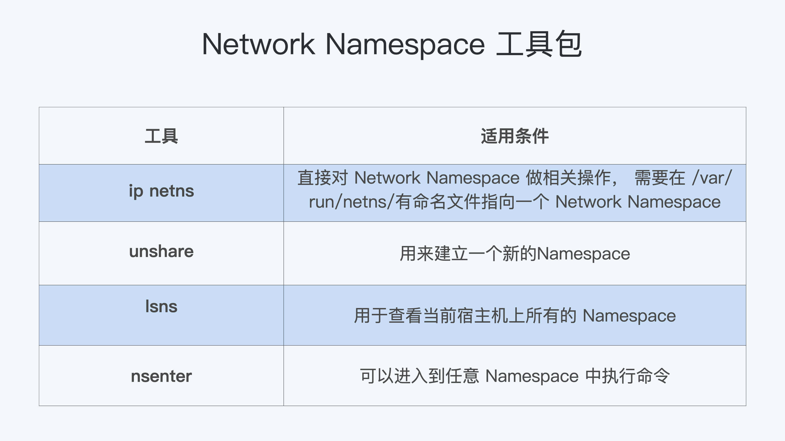

15 容器网络：我修改了procsysnet下的参数，为什么在容器中不起效？
======================================

你好，我是程远。

从这一讲开始，我们进入到了容器网络这个模块。容器网络最明显的一个特征就是它有自己的 Network Namespace 了。你还记得，在我们这个课程的第一讲里，我们就提到过 Network Namespace 负责管理网络环境的隔离。

今天呢，我们更深入地讨论一下和 Network Namespace 相关的一个问题——容器中的网络参数。

和之前的思路一样，我们先来看一个问题。然后在解决问题的过程中，更深入地理解容器的网络参数配置。

问题再现
----

在容器中运行的应用程序，如果需要用到 tcp/ip 协议栈的话，常常需要修改一些网络参数（内核中网络协议栈的参数）。

很大一部分网络参数都在 /proc 文件系统下的/proc/sys/net/目录里。

修改这些参数主要有两种方法：一种方法是直接到 /proc 文件系统下的"/proc/sys/net/"目录里对参数做修改；还有一种方法是使用sysctl这个工具来修改。

在启动容器之前呢，根据我们的需要我们在宿主机上已经修改过了几个参数，也就是说这些参数的值已经不是内核里原来的缺省值了.

比如我们改了下面的几个参数：

```
# # The default value:

# cat /proc/sys/net/ipv4/tcp_congestion_control

cubic

# cat /proc/sys/net/ipv4/tcp_keepalive_time

7200

# cat /proc/sys/net/ipv4/tcp_keepalive_intvl

75

# cat /proc/sys/net/ipv4/tcp_keepalive_probes

9
# # To update the value:

# echo bbr > /proc/sys/net/ipv4/tcp_congestion_control

# echo 600 > /proc/sys/net/ipv4/tcp_keepalive_time

# echo 10 > /proc/sys/net/ipv4/tcp_keepalive_intvl

# echo 6 > /proc/sys/net/ipv4/tcp_keepalive_probes

#
# # Double check the value after update:

# cat /proc/sys/net/ipv4/tcp_congestion_control

bbr

# cat /proc/sys/net/ipv4/tcp_keepalive_time

600

# cat /proc/sys/net/ipv4/tcp_keepalive_intvl

10

# cat /proc/sys/net/ipv4/tcp_keepalive_probes

6

```

然后我们启动一个容器， 再来查看一下容器里这些参数的值。

你可以先想想，容器里这些参数的值会是什么？我最初觉得容器里参数值应该会继承宿主机 Network Namesapce 里的值，实际上是不是这样呢？

我们还是先按下面的脚本，启动容器，然后运行 docker exec 命令一起看一下：

```
# docker run -d --name net_para centos:8.1.1911 sleep 3600

deec6082bac7b336fa28d0f87d20e1af21a784e4ef11addfc2b9146a9fa77e95

# docker exec -it net_para bash

[[email protected] /]# cat /proc/sys/net/ipv4/tcp_congestion_control

bbr

[[email protected] /]# cat /proc/sys/net/ipv4/tcp_keepalive_time

7200

[[email protected] /]# cat /proc/sys/net/ipv4/tcp_keepalive_intvl

75

[[email protected] /]# cat /proc/sys/net/ipv4/tcp_keepalive_probes

9

```

从这个结果我们看到，tcp\_congestion\_control 的值是 bbr，和宿主机 Network Namespace 里的值是一样的，而其他三个 tcp keepalive 相关的值，都不是宿主机 Network Namespace 里设置的值，而是原来系统里的缺省值了。

那为什么会这样呢？在分析这个问题之前，我们需要先来看看 Network Namespace 这个概念。

知识详解
----

### 如何理解 Network Namespace？

对于 Network Namespace，我们从字面上去理解的话，可以知道它是在一台 Linux 节点上对网络的隔离，不过它具体到底隔离了哪部分的网络资源呢？

我们还是先来看看操作手册，在Linux Programmer’s Manual里对 Network Namespace 有一个段简短的描述，在里面就列出了最主要的几部分资源，它们都是通过 Network Namespace 隔离的。

我把这些资源给你做了一个梳理：

第一种，网络设备，这里指的是 lo，eth0 等网络设备。你可以通过 ip link命令看到它们。

第二种是 IPv4 和 IPv6 协议栈。从这里我们可以知道，IP 层以及上面的 TCP 和 UDP 协议栈也是每个 Namespace 独立工作的。

所以 IP、TCP、UDP 的很多协议，它们的相关参数也是每个 Namespace 独立的，这些参数大多数都在 /proc/sys/net/ 目录下面，同时也包括了 TCP 和 UDP 的 port 资源。

第三种，IP 路由表，这个资源也是比较好理解的，你可以在不同的 Network Namespace 运行 ip route 命令，就能看到不同的路由表了。

第四种是防火墙规则，其实这里说的就是 iptables 规则了，每个 Namespace 里都可以独立配置 iptables 规则。

最后一种是网络的状态信息，这些信息你可以从 /proc/net 和 /sys/class/net 里得到，这里的状态基本上包括了前面 4 种资源的的状态信息。

### Namespace 的操作

那我们怎么建立一个新的 Network Namespace 呢？

我们可以通过系统调用 clone() 或者 unshare() 这两个函数来建立新的 Network Namespace。

下面我们会讲两个例子，带你体会一下这两个方法具体怎么用。

第一种方法呢，是在新的进程创建的时候，伴随新进程建立，同时也建立出新的 Network Namespace。这个方法，其实就是通过 clone() 系统调用带上 CLONE\_NEWNET flag 来实现的。

Clone 建立出来一个新的进程，这个新的进程所在的 Network Namespace 也是新的。然后我们执行 ip link 命令查看 Namespace 里的网络设备，就可以确认一个新的 Network Namespace 已经建立好了。

具体操作你可以看一下这段代码。

```
int new_netns(void *para)

{

            printf("New Namespace Devices:\n");

            system("ip link");

            printf("\n\n");
            sleep(100);

            return 0;

}
int main(void)

{

            pid_t pid;
            printf("Host Namespace Devices:\n");

            system("ip link");

            printf("\n\n");
            pid =

                clone(new_netns, stack + STACK_SIZE, CLONE_NEWNET | SIGCHLD, NULL);

            if (pid == -1)

                        errExit("clone");
            if (waitpid(pid, NULL, 0) == -1)

                        errExit("waitpid");
            return 0;

}

```

第二种方法呢，就是调用 unshare() 这个系统调用来直接改变当前进程的 Network Namespace，你可以看一下这段代码。

```
int main(void)

{

            pid_t pid;
            printf("Host Namespace Devices:\n");

            system("ip link");

            printf("\n\n");

 

            if (unshare(CLONE_NEWNET) == -1)

                        errExit("unshare");
            printf("New Namespace Devices:\n");

            system("ip link");

            printf("\n\n");
            return 0;

}

```

其实呢，不仅是 Network Namespace，其它的 Namespace 也是通过 clone() 或者 unshare() 系统调用来建立的。

而创建容器的程序，比如runC也是用 unshare() 给新建的容器建立 Namespace 的。

这里我简单地说一下 runC 是什么，我们用 Docker 或者 containerd 去启动容器，最后都会调用 runC 在 Linux 中把容器启动起来。

除了在代码中用系统调用来建立 Network Namespace，我们也可以用命令行工具来建立 Network Namespace。比如用 ip netns 命令，在下一讲学习容器网络配置的时候呢，我们会用到 ip netns，这里你先有个印象就行。

在 Network Namespace 创建好了之后呢，我们可以在宿主机上运行 lsns -t net 这个命令来查看系统里已有的 Network Namespace。当然，lsns也可以用来查看其它 Namespace。

用 lsns 查看已有的 Namespace 后，我们还可以用 nsenter 这个命令进入到某个 Network Namespace 里，具体去查看这个 Namespace 里的网络配置。

比如下面的这个例子，用我们之前的 clone() 的例子里的代码，编译出 clone-ns 这个程序，运行后，再使用 lsns 查看新建的 Network Namespace，并且用nsenter进入到这个 Namespace，查看里面的 lo device。

具体操作你可以参考下面的代码：

```
# ./clone-ns &

[1] 7732

# Host Namespace Devices:

1: lo: <LOOPBACK,UP,LOWER_UP> mtu 65536 qdisc noqueue state UNKNOWN mode DEFAULT group default qlen 1000

    link/loopback 00:00:00:00:00:00 brd 00:00:00:00:00:00

2: eth0: <BROADCAST,MULTICAST,UP,LOWER_UP> mtu 1500 qdisc fq_codel state UP mode DEFAULT group default qlen 1000

    link/ether 74:db:d1:80:54:14 brd ff:ff:ff:ff:ff:ff

3: docker0: <NO-CARRIER,BROADCAST,MULTICAST,UP> mtu 1500 qdisc noqueue state DOWN mode DEFAULT group default

    link/ether 02:42:0c:ff:2b:77 brd ff:ff:ff:ff:ff:ff
New Namespace Devices:

1: lo: <LOOPBACK> mtu 65536 qdisc noop state DOWN mode DEFAULT group default qlen 1000

    link/loopback 00:00:00:00:00:00 brd 00:00:00:00:00:00
# lsns -t net

        NS TYPE NPROCS   PID USER    NETNSID NSFS COMMAND

4026531992 net     283     1 root unassigned      /usr/lib/systemd/systemd --switched-root --system --deserialize 16

4026532241 net       1  7734 root unassigned      ./clone-ns

# nsenter -t 7734 -n ip addr

1: lo: <LOOPBACK> mtu 65536 qdisc noop state DOWN group default qlen 1000

    link/loopback 00:00:00:00:00:00 brd 00:00:00:00:00:00

```

解决问题
----

那理解了 Network Namespace 之后，我们再来看看这一讲最开始的问题，我们应该怎么来设置容器里的网络相关参数呢？

首先你要避免走入误区。从我们一开始的例子里，也可以看到，容器里 Network Namespace 的网络参数并不是完全从宿主机 Host Namespace 里继承的，也不是完全在新的 Network Namespace 建立的时候重新初始化的。

其实呢，这一点我们只要看一下内核代码中对协议栈的初始化函数，很快就可以知道为什么会有这样的情况。

在我们的例子里 tcp\_congestion\_control 的值是从 Host Namespace 里继承的，而 tcp\_keepalive 相关的几个值会被重新初始化了。

在函数tcp\_sk\_init() 里，tcp\_keepalive 的三个参数都是重新初始化的，而 tcp\_congestion\_control 的值是从 Host Namespace 里复制过来的。

```
static int __net_init tcp_sk_init(struct net *net)

{

…

        net->ipv4.sysctl_tcp_keepalive_time = TCP_KEEPALIVE_TIME;

        net->ipv4.sysctl_tcp_keepalive_probes = TCP_KEEPALIVE_PROBES;

        net->ipv4.sysctl_tcp_keepalive_intvl = TCP_KEEPALIVE_INTVL;
…

        /* Reno is always built in */

        if (!net_eq(net, &init_net) &&

            try_module_get(init_net.ipv4.tcp_congestion_control->owner))

                net->ipv4.tcp_congestion_control = init_net.ipv4.tcp_congestion_control;

        else

                net->ipv4.tcp_congestion_control = &tcp_reno;
…
}

```

那么我们现在知道 Network Namespace 的网络参数是怎么初始化的了，你可能会问了，我在容器里也可以修改这些参数吗？

我们可以启动一个普通的容器，这里的“普通”呢，我指的不是"privileged"的那种容器，也就是在这个容器中，有很多操作都是不允许做的，比如 mount 一个文件系统。这个 privileged 容器概念，我们会在后面容器安全这一讲里详细展开，这里你有个印象。

那么在启动完一个普通容器后，我们尝试一下在容器里去修改"/proc/sys/net/"下的参数。

这时候你会看到，容器中"/proc/sys/"是只读 mount 的，那么在容器里是不能修改"/proc/sys/net/"下面的任何参数了。

```
# docker run -d --name net_para centos:8.1.1911 sleep 3600

977bf3f07da90422e9c1e89e56edf7a59fab5edff26317eeb253700c2fa657f7

# docker exec -it net_para bash

[[email protected] /]# echo 600 > /proc/sys/net/ipv4/tcp_keepalive_time

bash: /proc/sys/net/ipv4/tcp_keepalive_time: Read-only file system

[[email protected] /]# cat /proc/mounts | grep "proc/sys"

proc /proc/sys proc ro,relatime 0 0

```

为什么“/proc/sys/” 在容器里是只读 mount 呢？ 这是因为 runC 当初出于安全的考虑，把容器中所有 /proc 和 /sys 相关的目录缺省都做了 read-only mount 的处理。详细的说明你可以去看看这两个 commits:

Mount /proc and /sys read-only, except in privileged containers

Make /proc writable, but not /proc/sys and /proc/sysrq-trigger

那我们应该怎么来修改容器中 Network Namespace 的网络参数呢？

当然，如果你有宿主机上的 root 权限，最简单粗暴的方法就是用我们之前说的"nsenter"工具，用它修改容器里的网络参数的。不过这个方法在生产环境里显然是不会被允许的，因为我们不会允许用户拥有宿主机的登陆权限。

其次呢，一般来说在容器中的应用已经启动了之后，才会做这样的修改。也就是说，很多 tcp 链接已经建立好了，那么即使新改了参数，对已经建立好的链接也不会生效了。这就需要重启应用，我们都知道生产环境里通常要避免应用重启，那这样做显然也不合适。

通过刚刚的排除法，我们推理出了网络参数修改的“正确时机”：想修改 Network Namespace 里的网络参数，要选择容器刚刚启动，而容器中的应用程序还没启动之前进行。

其实，runC 也在对 /proc/sys 目录做 read-only mount 之前，预留出了修改接口，就是用来修改容器里 "/proc/sys"下参数的，同样也是 sysctl 的参数。

而 Docker 的–sysctl或者 Kubernetes 里的allowed-unsafe-sysctls特性也都利用了 runC 的 sysctl 参数修改接口，允许容器在启动时修改容器 Namespace 里的参数。

比如，我们可以试一下 docker –sysctl，这时候我们会发现，在容器的 Network Namespace 里，/proc/sys/net/ipv4/tcp\_keepalive\_time 这个网络参数终于被修改了！

```
# docker run -d --name net_para --sysctl net.ipv4.tcp_keepalive_time=600 centos:8.1.1911 sleep 3600

7efed88a44d64400ff5a6d38fdcc73f2a74a7bdc3dbc7161060f2f7d0be170d1

# docker exec net_para cat /proc/sys/net/ipv4/tcp_keepalive_time

600

```

重点总结
----

好了，今天的课我们讲完了，那么下面我来给你做个总结。

今天我们讨论问题是容器中网络参数的问题，因为是问题发生在容器里，又是网络的参数，那么自然就和 Network Namespace 有关，所以我们首先要理解 Network Namespace。

Network Namespace 可以隔离网络设备，ip 协议栈，ip 路由表，防火墙规则，以及可以显示独立的网络状态信息。

我们可以通过 clone() 或者 unshare() 系统调用来建立新的 Network Namespace。

此外，还有一些工具"ip""netns""unshare""lsns"和"nsenter"，也可以用来操作 Network Namespace。

这些工具的适用条件，我用表格的形式整理如下，你可以做个参考。



接着我们分析了如何修改普通容器（非 privileged）的网络参数。

由于安全的原因，普通容器的 /proc/sys 是 read-only mount 的，所以在容器启动以后，我们无法在容器内部修改 /proc/sys/net 下网络相关的参数。

这时可行的方法是通过 runC sysctl 相关的接口，在容器启动的时候对容器内的网络参数做配置。

这样一来，想要修改网络参数就可以这么做：如果是使用 Docker，我们可以加上"—sysctl"这个参数；而如果使用 Kubernetes 的话，就需要用到"allowed unsaft sysctl"这个特性了。

思考题
---

这一讲中，我们提到了可以使用"nsenter"这个工具，从宿主机上修改容器里的 /proc/sys/net/ 下的网络参数，你可以试试看具体怎么修改。

欢迎你在留言区分享你的收获和疑问。如果这篇文章对你有帮助，也欢迎转发给你的同事和朋友，一起交流探讨。
