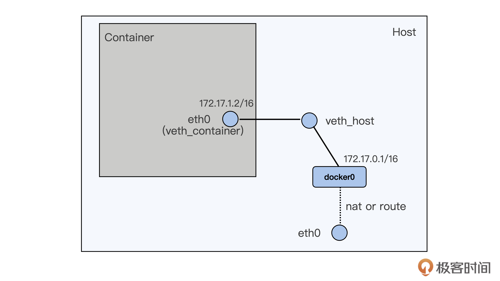
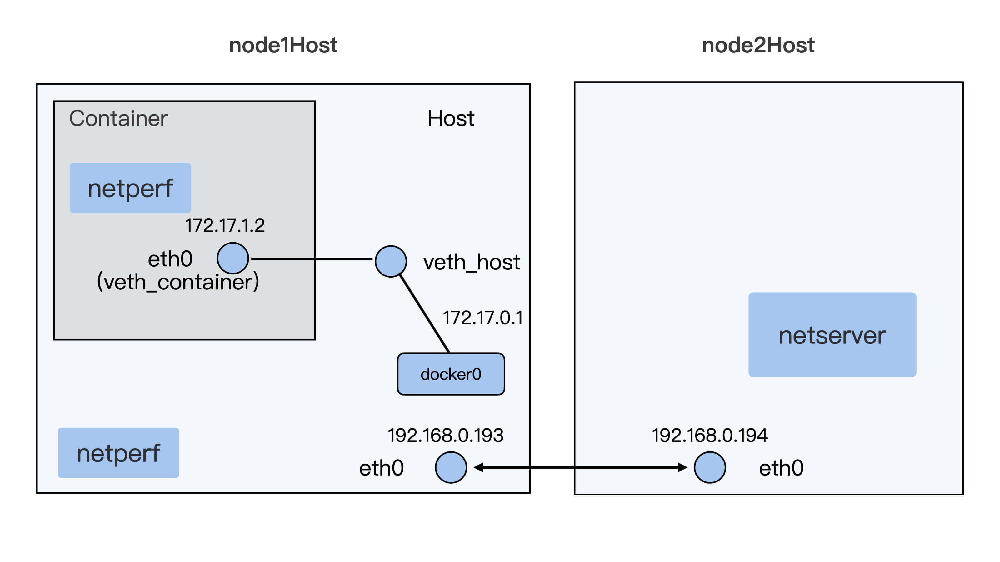
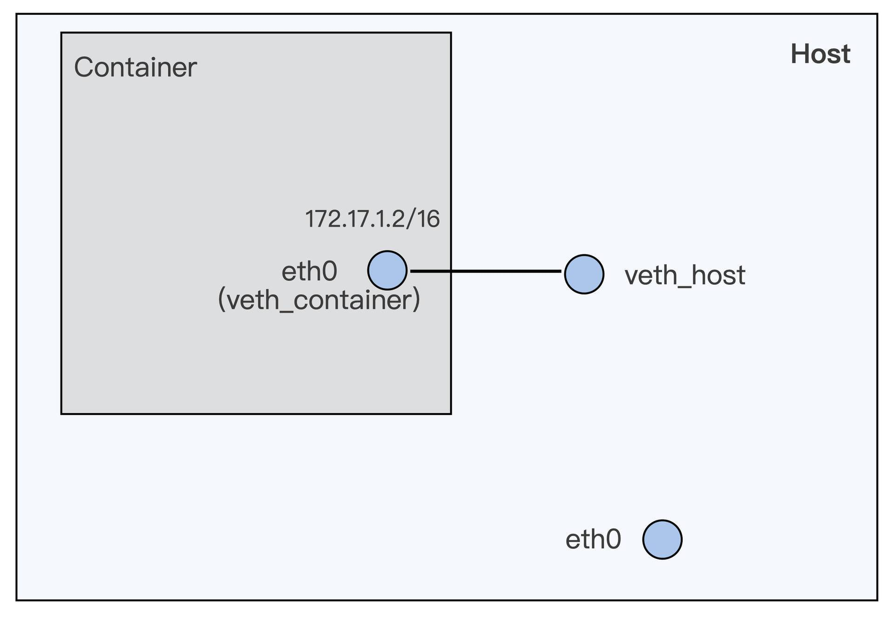
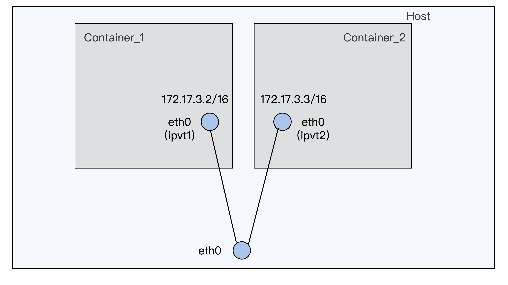
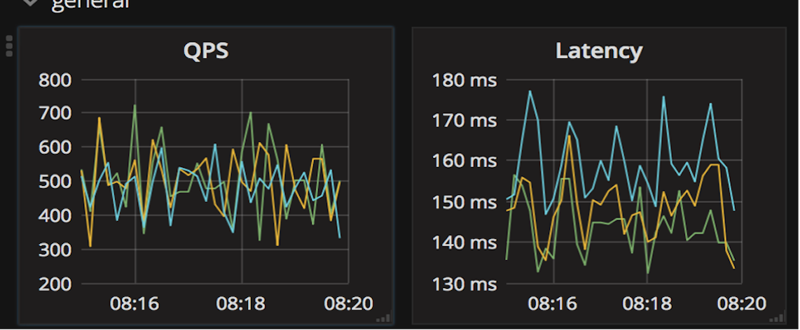

# 17 容器网络配置（2）：容器网络延时要比宿主机上的高吗

你好，我是程远。

在上一讲里，我们学习了在容器中的网络接口配置，重点讲解的是 veth 的接口配置方式，这也是绝大部分容器用的缺省的网络配置方式。

不过呢，从 veth 的这种网络接口配置上看，一个数据包要从容器里发送到宿主机外，需要先从容器里的 eth0 (veth_container) 把包发送到宿主机上 veth_host，然后再在宿主机上通过 nat 或者路由的方式，经过宿主机上的 eth0 向外发送。



这种容器向外发送数据包的路径，相比宿主机上直接向外发送数据包的路径，很明显要多了一次接口层的发送和接收。尽管 veth 是虚拟网络接口，在软件上还是会增加一些开销。

如果我们的应用程序对网络性能有很高的要求，特别是之前运行在物理机器上，现在迁移到容器上的，如果网络配置采用 veth 方式，就会出现网络延时增加的现象。

那今天我们就来聊一聊，容器网络接口对于容器中应用程序网络延时有怎样的影响，还有这个问题应该怎么解决。

## 问题重现

对于这种 veth 接口配置导致网络延时增加的现象，我们可以通过运行netperf（Netperf 是一个衡量网络性能的工具，它可以提供单向吞吐量和端到端延迟的测试）来模拟一下。

这里我们需要两台虚拟机或者物理机，这两台机器需要同处于一个二层的网络中。

具体的配置示意图如下：



首先，我们需要在第一台机器上启动一个 veth 接口的容器，容器的启动和宿主机上的配置你可以参考一下这里的脚本。在第二台机器上，我们只要启动一个 netserver 就可以了。

然后呢，我们分别在容器里和宿主机上运行与 netserver 交互的 netperf，再比较一下它们延时的差异。

我们可以运行 netperf 的 TCP_RR 测试用例，TCP_RR 是 netperf 里专门用来测试网络延时的，缺省每次运行 10 秒钟。运行以后，我们还要计算平均每秒钟 TCP request/response 的次数，这个次数越高，就说明延时越小。

接下来，我们先在第一台机器的宿主机上直接运行 netperf 的 TCP_RR 测试用例 3 轮，得到的值分别是 2504.92，2410.14 和 2422.81，计算一下可以得到三轮 Transactions 平均值是 2446/s。

```
# ./netperf -H 192.168.0.194 -t TCP_RR

MIGRATED TCP REQUEST/RESPONSE TEST from 0.0.0.0 (0.0.0.0) port 0 AF_INET to 192.168.0.194 () port 0 AF_INET : first burst 0

Local /Remote

Socket Size   Request  Resp.   Elapsed  Trans.

Send   Recv   Size     Size    Time     Rate

bytes  Bytes  bytes    bytes   secs.    per sec
16384  131072 1        1       10.00    2504.92

16384  131072

# ./netperf -H 192.168.0.194 -t TCP_RR

MIGRATED TCP REQUEST/RESPONSE TEST from 0.0.0.0 (0.0.0.0) port 0 AF_INET to 192.168.0.194 () port 0 AF_INET : first burst 0

Local /Remote

Socket Size   Request  Resp.   Elapsed  Trans.

Send   Recv   Size     Size    Time     Rate

bytes  Bytes  bytes    bytes   secs.    per sec
16384  131072 1        1       10.00    2410.14

16384  131072
# ./netperf -H 192.168.0.194 -t TCP_RR

MIGRATED TCP REQUEST/RESPONSE TEST from 0.0.0.0 (0.0.0.0) port 0 AF_INET to 192.168.0.194 () port 0 AF_INET : first burst 0

Local /Remote

Socket Size   Request  Resp.   Elapsed  Trans.

Send   Recv   Size     Size    Time     Rate

bytes  Bytes  bytes    bytes   secs.    per sec
16384  131072 1        1       10.00    2422.81

16384  131072

```

同样，我们再在容器中运行一下 netperf 的 TCP_RR，也一样运行三轮，计算一下这三次的平均值，得到的值是 2141。

那么我们拿这次容器环境中的平均值和宿主机上得到的值 2446 做比较，会发现 Transactions 下降了大概 12.5%，也就是网络的延时超过了 10%。

```
[[email protected] /]# ./netperf -H 192.168.0.194 -t TCP_RR

MIGRATED TCP REQUEST/RESPONSE TEST from 0.0.0.0 (0.0.0.0) port 0 AF_INET to 192.168.0.194 () port 0 AF_INET : first burst 0

Local /Remote

Socket Size   Request  Resp.   Elapsed  Trans.

Send   Recv   Size     Size    Time     Rate

bytes  Bytes  bytes    bytes   secs.    per sec
16384  131072 1        1       10.00    2104.68

16384  131072
[[email protected] /]# ./netperf -H 192.168.0.194 -t TCP_RR

MIGRATED TCP REQUEST/RESPONSE TEST from 0.0.0.0 (0.0.0.0) port 0 AF_INET to 192.168.0.194 () port 0 AF_INET : first burst 0

Local /Remote

Socket Size   Request  Resp.   Elapsed  Trans.

Send   Recv   Size     Size    Time     Rate

bytes  Bytes  bytes    bytes   secs.    per sec
16384  131072 1        1       10.00    2146.34

16384  131072
[[email protected] /]# ./netperf -H 192.168.0.194 -t TCP_RR

MIGRATED TCP REQUEST/RESPONSE TEST from 0.0.0.0 (0.0.0.0) port 0 AF_INET to 192.168.0.194 () port 0 AF_INET : first burst 0

Local /Remote

Socket Size   Request  Resp.   Elapsed  Trans.

Send   Recv   Size     Size    Time     Rate

bytes  Bytes  bytes    bytes   secs.    per sec
16384  131072 1        1       10.00    2173.79

16384  131072

```

## 分析问题

刚才我们已经得到了测试的数值，我们发现 veth 方式的确带来了很高的网络延时。那现在我们先来分析一下，为什么 veth 会带来这么大的网络延时，然后再看看有什么方法可以降低容器里的网络延时。

我们先回顾一下容器里 veth 接口的配置，还是拿我们上一讲里容器 veth 的图作为例子。



上一讲中我提到过，veth 的虚拟网络接口一般都是成对出现，就像上面图里的 veth_container 和 veth_host 一样。

在每次网络传输的过程中，数据包都需要通过 veth_container 这个接口向外发送，而且必须保证 veth_host 先接收到这个数据包。

虽然 veth 是一个虚拟的网络接口，但是在接收数据包的操作上，这个虚拟接口和真实的网路接口并没有太大的区别。这里除了没有硬件中断的处理，其他操作都差不多，特别是软中断（softirq）的处理部分其实就和真实的网络接口是一样的。

我们可以通过阅读 Linux 内核里的 veth 的驱动代码（drivers/net/veth.c）确认一下。

veth 发送数据的函数是 veth_xmit()，它里面的主要操作就是找到 veth peer 设备，然后触发 peer 设备去接收数据包。

比如 veth_container 这个接口调用了 veth_xmit() 来发送数据包，最后就是触发了它的 peer 设备 veth_host 去调用 netif_rx() 来接收数据包。主要的代码我列在下面了：

```
static netdev_tx_t veth_xmit(struct sk_buff *skb, struct net_device *dev)

{

…

       /* 拿到veth peer设备的net_device */

       rcv = rcu_dereference(priv->peer);

…

       /* 将数据送到veth peer设备 */ 

       if (likely(veth_forward_skb(rcv, skb, rq, rcv_xdp) == NET_RX_SUCCESS)) {
…

}
static int veth_forward_skb(struct net_device *dev, struct sk_buff *skb,

                            struct veth_rq *rq, bool xdp)

{

        /* 这里最后调用了 netif_rx() */

        return __dev_forward_skb(dev, skb) ?: xdp ?

                veth_xdp_rx(rq, skb) :

                netif_rx(skb);

}

```

而 netif_rx() 是一个网络设备驱动里面标准的接收数据包的函数，netif_rx() 里面会为这个数据包 raise 一个 softirq。

```
   __raise_softirq_irqoff(NET_RX_SOFTIRQ);

```

其实 softirq 这个概念，我们之前在CPU 的模块中也提到过。在处理网络数据的时候，一些运行时间较长而且不能在硬中断中处理的工作，就会通过 softirq 来处理。

一般在硬件中断处理结束之后，网络 softirq 的函数才会再去执行没有完成的包的处理工作。即使这里 softirq 的执行速度很快，还是会带来额外的开销。

所以，根据 veth 这个虚拟网络设备的实现方式，我们可以看到它必然会带来额外的开销，这样就会增加数据包的网络延时。

## 解决问题

那么我们有什么方法可以减少容器的网络延时呢？你可能会想到，我们可不可以不使用 veth 这个方式配置网络接口，而是换成别的方式呢？

的确是这样，其实除了 veth 之外，容器还可以选择其他的网络配置方式。在 Docker 的文档中提到了 macvlan 的配置方式，和 macvlan 很类似的方式还有 ipvlan。

那我们先来简单看一下 macvlan 和 ipvlan 的异同点。

我们先来看这两个方式的相同之处，无论是 macvlan 还是 ipvlan，它们都是在一个物理的网络接口上再配置几个虚拟的网络接口。在这些虚拟的网络接口上，都可以配置独立的 IP，并且这些 IP 可以属于不同的 Namespace。

然后我再说说它们的不同点。对于 macvlan，每个虚拟网络接口都有自己独立的 mac 地址；而 ipvlan 的虚拟网络接口是和物理网络接口共享同一个 mac 地址。而且它们都有自己的 L2/L3 的配置方式，不过我们主要是拿 macvlan/ipvlan 来和 veth 做比较，这里可以先忽略 macvlan/ipvlan 这些详细的特性。

我们就以 ipvlan 为例，运行下面的这个脚本，为容器手动配置上 ipvlan 的网络接口。

```
docker run --init --name lat-test-1 --network none -d registry/latency-test:v1 sleep 36000
pid1=$(docker inspect lat-test-1 | grep -i Pid | head -n 1 | awk '{print $2}' | awk -F "," '{print $1}')

echo $pid1

ln -s /proc/$pid1/ns/net /var/run/netns/$pid1

 

ip link add link eth0 ipvt1 type ipvlan mode l2

ip link set dev ipvt1 netns $pid1
ip netns exec $pid1 ip link set ipvt1 name eth0

ip netns exec $pid1 ip addr add 172.17.3.2/16 dev eth0

ip netns exec $pid1 ip link set eth0 up

```

在这个脚本里，我们先启动一个容器，这里我们用"—network none"的方式来启动，也就是在容器中没有配置任何的网络接口。

接着我们在宿主机 eth0 的接口上增加一个 ipvlan 虚拟网络接口 ipvt1，再把它加入到容器的 Network Namespace 里面，重命名为容器内的 eth0，并且配置上 IP。这样我们就配置好了第一个用 ipvlan 网络接口的容器。

我们可以用同样的方式配置第二个容器，这样两个容器可以相互 ping 一下 IP，看看网络是否配置成功了。脚本你可以在这里得到。

两个容器配置好之后，就像下面图中描述的一样了。从这张图里，你很容易就能看出 macvlan/ipvlan 与 veth 网络配置有什么不一样。容器的虚拟网络接口，直接连接在了宿主机的物理网络接口上了，形成了一个网络二层的连接。



如果从容器里向宿主机外发送数据，看上去通过的接口要比 veth 少了，那么实际情况是不是这样呢？我们先来看一下 ipvlan 接口发送数据的代码。

从下面的 ipvlan 接口的发送代码中，我们可以看到，如果是往宿主机外发送数据，发送函数会直接找到 ipvlan 虚拟接口对应的物理网络接口。

比如在我们的例子中，这个物理接口就是宿主机上的 eth0，然后直接调用 dev_queue_xmit()，通过物理接口把数据直接发送出去。

```
static int ipvlan_xmit_mode_l2(struct sk_buff *skb, struct net_device *dev)

{

…

        if (!ipvlan_is_vepa(ipvlan->port) &&

            ether_addr_equal(eth->h_dest, eth->h_source)) {

…

        } else if (is_multicast_ether_addr(eth->h_dest)) {

…

        }

        /* 

         \* 对于普通的对外发送数据，上面的if 和 else if中的条件都不成立，

         \* 所以会执行到这一步，拿到ipvlan对应的物理网路接口设备，

         \* 然后直接从这个设备发送数据。

         */ 

        skb->dev = ipvlan->phy_dev;

        return dev_queue_xmit(skb);

}

```

和 veth 接口相比，我们用 ipvlan 发送对外数据就要简单得多，因为这种方式没有内部额外的 softirq 处理开销。

现在我们还可以看一下，在实际生产环境中，一个应用程序跑在使用 veth 接口的容器中，跟这个应用程序跑在使用 ipvlan 接口的容器中，两者的网络延时差异是怎样的。

下面这张图是网络延时的监控图，图里蓝色的线表示程序运行在 veth 容器中，黄色线表示程序运行在 ipvlan 的容器里，绿色的线代表程序直接运行在物理机上。

从这张延时（Latency）图里，我们可以看到，在 veth 容器里程序的网络延时要明显高一些，而程序在 ipvlan 容器里的网络延时已经比较接近物理机上的网络延时了。



所以对于网络延时敏感的应用程序，我们可以考虑使用 ipvlan/macvlan 的容器网络配置方式来替换缺省的 veth 网络配置。

## 重点小结

好了，今天的内容讲完了，我们来做个总结。今天我们主要讨论了容器网络接口对容器中应用程序网络延时的影响。

容器通常缺省使用 veth 虚拟网络接口，不过 veth 接口会有比较大的网络延时。我们可以使用 netperf 这个工具来比较网络延时，相比物理机上的网络延时，使用 veth 接口容器的网络延时会增加超过 10%。

我们通过对 veth 实现的代码做分析，可以看到由于 veth 接口是成对工作，在对外发送数据的时候，peer veth 接口都会 raise softirq 来完成一次收包操作，这样就会带来数据包处理的额外开销。

如果要减小容器网络延时，就可以给容器配置 ipvlan/macvlan 的网络接口来替代 veth 网络接口。Ipvlan/macvlan 直接在物理网络接口上虚拟出接口，在发送对外数据包的时候可以直接通过物理接口完成，没有节点内部类似 veth 的那种 softirq 的开销。容器使用 ipvlan/maclan 的网络接口，它的网络延时可以非常接近物理网络接口的延时。

对于延时敏感的应用程序，我们可以考虑使用 ipvlan/macvlan 网络接口的容器。不过，由于 ipvlan/macvlan 网络接口直接挂载在物理网络接口上，对于需要使用 iptables 规则的容器，比如 Kubernetes 里使用 service 的容器，就不能工作了。这就需要你结合实际应用的需求做个判断，再选择合适的方案。

## 思考题

在这节课的最后，我提到“由于 ipvlan/macvlan 网络接口直接挂载在物理网络接口上，对于需要使用 iptables 规则的容器，比如 Kubernetes 里使用 service 的容器，就不能工作了”，请你思考一下这个判断背后的具体原因。

欢迎你在留言区写下你的思考和疑问。如果这篇文章让你有所收获，也欢迎分享给你的朋友，一起交流进步。
