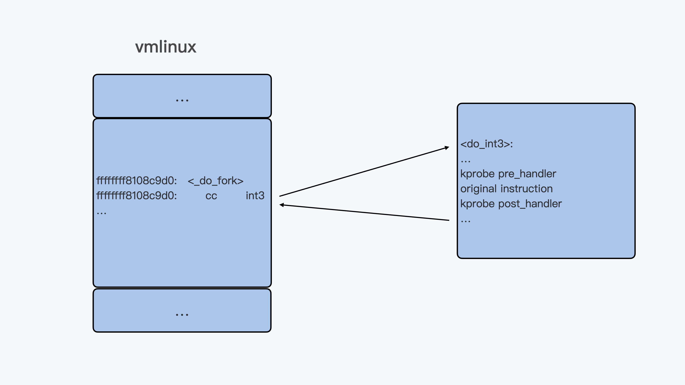
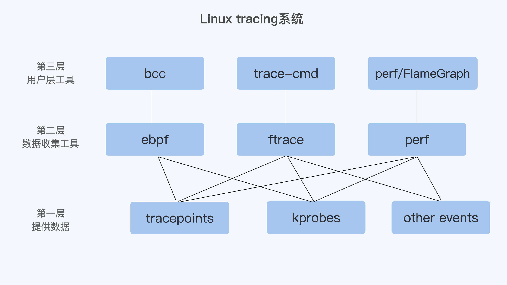

# 加餐04 理解ftrace（2）：怎么理解ftrace背后的技术tracepoint和kprobe？

你好，我是程远。

前面两讲，我们分别学习了 perf 和 ftrace 这两个最重要 Linux tracing 工具。在学习过程中，我们把重点放在了这两个工具最基本的功能点上。

不过你学习完这些之后，我们内核调试版图的知识点还没有全部点亮。

如果你再去查看一些 perf、ftrace 或者其他 Linux tracing 相关资料，你可能会常常看到两个单词，“tracepoint”和“kprobe”。你有没有好奇过，这两个名词到底是什么意思，它们和 perf、ftrace 这些工具又是什么关系呢？

这一讲，我们就来学习这两个在 Linux tracing 系统中非常重要的概念，它们就是 tracepoint 和 kprobe。

## tracepoint 和 kprobe 的应用举例

如果你深入地去看一些 perf 或者 ftrace 的功能，这时候你会发现它们都有跟 tracepoint、kprobe 相关的命令。我们先来看几个例子，通过这几个例子，你可以大概先了解一下 tracepoint 和 kprobe 的应用，这样我们后面做详细的原理介绍时，你也会更容易理解。

首先看看 tracepoint，tracepoint 其实就是在 Linux 内核的一些关键函数中埋下的 hook 点，这样在 tracing 的时候，我们就可以在这些固定的点上挂载调试的函数，然后查看内核的信息。

我们通过下面的这个 perf list 命令，就可以看到所有的 tracepoints：

```
# perf list | grep Tracepoint
  alarmtimer:alarmtimer_cancel                       [Tracepoint event]
  alarmtimer:alarmtimer_fired                        [Tracepoint event]
  alarmtimer:alarmtimer_start                        [Tracepoint event]
  alarmtimer:alarmtimer_suspend                      [Tracepoint event]
  block:block_bio_backmerge                          [Tracepoint event]
  block:block_bio_bounce                             [Tracepoint event]
  block:block_bio_complete                           [Tracepoint event]
  block:block_bio_frontmerge                         [Tracepoint event]
  block:block_bio_queue                              [Tracepoint event]
…
```

至于 ftrace，你在 tracefs 文件系统中，也会看到一样的 tracepoints：

```
# find /sys/kernel/debug/tracing/events -type d | sort
/sys/kernel/debug/tracing/events
/sys/kernel/debug/tracing/events/alarmtimer
/sys/kernel/debug/tracing/events/alarmtimer/alarmtimer_cancel
/sys/kernel/debug/tracing/events/alarmtimer/alarmtimer_fired
/sys/kernel/debug/tracing/events/alarmtimer/alarmtimer_start
/sys/kernel/debug/tracing/events/alarmtimer/alarmtimer_suspend
/sys/kernel/debug/tracing/events/block
/sys/kernel/debug/tracing/events/block/block_bio_backmerge
/sys/kernel/debug/tracing/events/block/block_bio_bounce
/sys/kernel/debug/tracing/events/block/block_bio_complete
/sys/kernel/debug/tracing/events/block/block_bio_frontmerge
…
```

为了让你更好理解，我们就拿“do_sys_open”这个 tracepoint 做例子。在内核函数 do_sys_open() 中，有一个 trace_do_sys_open() 调用，其实它这就是一个 tracepoint：

```
long do_sys_open(int dfd, const char __user *filename, int flags, umode_t mode)
{
        struct open_flags op;
        int fd = build_open_flags(flags, mode, &op);
        struct filename *tmp;
        if (fd)
                return fd;
        tmp = getname(filename);
        if (IS_ERR(tmp))
                return PTR_ERR(tmp);
        fd = get_unused_fd_flags(flags);
        if (fd >= 0) {
                struct file *f = do_filp_open(dfd, tmp, &op);
                if (IS_ERR(f)) {
                        put_unused_fd(fd);
                        fd = PTR_ERR(f);
                } else {
                        fsnotify_open(f);
                        fd_install(fd, f);
                        trace_do_sys_open(tmp->name, flags, mode);
                }
        }
        putname(tmp);
        return fd;
}
```

接下来，我们可以通过 perf 命令，利用 tracepoint 来查看一些内核函数发生的频率，比如在节点上，统计 10 秒钟内调用 do_sys_open 成功的次数，也就是打开文件的次数。

```
# # perf stat -a -e fs:do_sys_open -- sleep 10
 Performance counter stats for 'system wide':
                 7      fs:do_sys_open
      10.001954100 seconds time elapsed
```

同时，如果我们把 tracefs 中 do_sys_open 的 tracepoint 打开，那么在 ftrace 的 trace 输出里，就可以看到具体 do_sys_open 每次调用成功时，打开的文件名、文件属性、对应的进程等信息。

```
# pwd
/sys/kernel/debug/tracing
# echo 1 > events/fs/do_sys_open/enable
# cat trace
# tracer: nop
#
#                              _-----=> irqs-off
#                             / _----=> need-resched
#                            | / _---=> hardirq/softirq
#                            || / _--=> preempt-depth
#                            ||| /     delay
#           TASK-PID   CPU#  ||||    TIMESTAMP  FUNCTION
#              | |       |   ||||       |         |
         systemd-1     [011] .... 17133447.451839: do_sys_open: "/proc/22597/cgroup" 88000 666
            bash-4118  [009] .... 17133450.076026: do_sys_open: "/" 98800 0
     salt-minion-7101  [010] .... 17133450.478659: do_sys_open: "/etc/hosts" 88000 666
 systemd-journal-2199  [011] .... 17133450.487930: do_sys_open: "/proc/6989/cgroup" 88000 666
 systemd-journal-2199  [011] .... 17133450.488019: do_sys_open: "/var/log/journal/d4f76e4bf5414ac78e1c534ebe5d0a72" 98800 0
 systemd-journal-2199  [011] .... 17133450.488080: do_sys_open: "/proc/6989/comm" 88000 666
 systemd-journal-2199  [011] .... 17133450.488114: do_sys_open: "/proc/6989/cmdline" 88000 666
 systemd-journal-2199  [011] .... 17133450.488143: do_sys_open: "/proc/6989/status" 88000 666
 systemd-journal-2199  [011] .... 17133450.488185: do_sys_open: "/proc/6989/sessionid" 88000 666
…
```

请注意，Tracepoint 是在内核中固定的 hook 点，并不是在所有的函数中都有 tracepoint。

比如在上面的例子里，我们看到 do_sys_open() 调用到了 do_filp_open()，但是 do_filp_open() 函数里是没有 tracepoint 的。那如果想看到 do_filp_open() 函数被调用的频率，或者 do_filp_open() 在被调用时传入参数的情况，我们又该怎么办呢？

这时候，我们就需要用到 kprobe 了。kprobe 可以动态地在所有的内核函数（除了 inline 函数）上挂载 probe 函数。我们还是结合例子做理解，先看看 perf 和 ftraces 是怎么利用 kprobe 来做调试的。

比如对于 do_filp_open() 函数，我们可以通过perf probe添加一下，然后用perf stat 看看在 10 秒钟的时间里，这个函数被调用到的次数。

```
# perf probe --add do_filp_open
# perf stat -a -e probe:do_filp_open -- sleep 10
 Performance counter stats for 'system wide':
                11      probe:do_filp_open
      10.001489223 seconds time elapsed
```

我们也可以通过 ftrace 的 tracefs 给 do_filp_open() 添加一个 kprobe event，这样就能查看 do_filp_open() 每次被调用的时候，前面两个参数的值了。

这里我要给你说明一下，在写入 kprobe_event 的时候，对于参数的定义我们用到了“%di”和“%si”。这是 x86 处理器里的寄存器，根据 x86 的Application Binary Interface 的文档，在函数被调用的时候，%di 存放了第一个参数，%si 存放的是第二个参数。

```
# echo 'p:kprobes/myprobe do_filp_open dfd=+0(%di):u32 pathname=+0(+0(%si)):string' > /sys/kernel/debug/tracing/kprobe_event
```

完成上面的写入之后，我们再 enable 这个新建的 kprobe event。这样在 trace 中，我们就可以看到每次 do_filp_open（）被调用时前两个参数的值了。

```
# echo 1 > /sys/kernel/debug/tracing/events/kprobes/myprobe/enable
# cat /sys/kernel/debug/tracing/trace
…
      irqbalance-1328  [005] .... 2773211.189573: myprobe: (do_filp_open+0x0/0x100) dfd=4294967295 pathname="/proc/interrupts"
      irqbalance-1328  [005] .... 2773211.189740: myprobe: (do_filp_open+0x0/0x100) dfd=638399 pathname="/proc/stat"
      irqbalance-1328  [005] .... 2773211.189800: myprobe: (do_filp_open+0x0/0x100) dfd=638399 pathname="/proc/irq/8/smp_affinity"
            bash-15864 [004] .... 2773211.219048: myprobe: (do_filp_open+0x0/0x100) dfd=14819 pathname="/sys/kernel/debug/tracing/"
            bash-15864 [004] .... 2773211.891472: myprobe: (do_filp_open+0x0/0x100) dfd=6859 pathname="/sys/kernel/debug/tracing/"
            bash-15864 [004] .... 2773212.036449: myprobe: (do_filp_open+0x0/0x100) dfd=4294967295 pathname="/sys/kernel/debug/tracing/"
            bash-15864 [004] .... 2773212.197525: myprobe: (do_filp_open+0x0/0x100) dfd=638259 pathname="/sys/kernel/debug/tracing/
…
```

好了，我们通过 perf 和 ftrace 的几个例子，简单了解了 tracepoint 和 kprobe 是怎么用的。那下面我们再来看看它们的实现原理。

## Tracepoint

刚才，我们已经看到了内核函数 do_sys_open() 里调用了 trace_do_sys_open() 这个 treacepoint，那这个 tracepoint 是怎么实现的呢？我们还要再仔细研究一下。

如果你在内核代码中，直接搜索“trace_do_sys_open”字符串的话，并不能找到这个函数的直接定义。这是因为在 Linux 中，每一个 tracepoint 的相关数据结构和函数，主要是通过"DEFINE_TRACE"和"DECLARE_TRACE"这两个宏来定义的。

完整的“DEFINE_TRACE”和“DECLARE_TRACE”宏里，给每个 tracepoint 都定义了一组函数。在这里，我会选择最主要的几个函数，把定义一个 tracepoint 的过程给你解释一下。

首先，我们来看“trace\_##name”这个函数（提示一下，这里的“##”是 C 语言的预编译宏，表示把两个字符串连接起来）。

对于每个命名为“name”的 tracepoint，这个宏都会帮助它定一个函数。这个函数的格式是这样的，以“trace\_”开头，再加上 tracepoint 的名字。

我们举个例子吧。比如说，对于“do_sys_open”这个 tracepoint，它生成的函数名就是 trace_do_sys_open。而这个函数会被内核函数 do_sys_open() 调用，从而实现了一个内核的 tracepoint。

```
static inline void trace_##name(proto)                          \
        {                                                               \
                if (static_key_false(&__tracepoint_##name.key))         \
                        __DO_TRACE(&__tracepoint_##name,                \
                                TP_PROTO(data_proto),                   \
                                TP_ARGS(data_args),                     \
                                TP_CONDITION(cond), 0);                 \
                if (IS_ENABLED(CONFIG_LOCKDEP) && (cond)) {             \
                        rcu_read_lock_sched_notrace();                  \
                        rcu_dereference_sched(__tracepoint_##name.funcs);\
                        rcu_read_unlock_sched_notrace();                \
                }                                                       \
        }
```

在这个 tracepoint 函数里，主要的功能是这样实现的，通过 \_\_DO_TRACE 来调用所有注册在这个 tracepoint 上的 probe 函数。

```
#define __DO_TRACE(tp, proto, args, cond, rcuidle)                      \
…
                it_func_ptr = rcu_dereference_raw((tp)->funcs);         \
                                                                        \
                if (it_func_ptr) {                                      \
                        do {                                            \
                                it_func = (it_func_ptr)->func;          \
                                __data = (it_func_ptr)->data;           \
                                ((void(*)(proto))(it_func))(args);      \
                        } while ((++it_func_ptr)->func);                \
                }
…
…
```

而 probe 函数的注册，它可以通过宏定义的“register_trace\_##name”函数完成。

```
        static inline int                                               \
        register_trace_##name(void (*probe)(data_proto), void *data)    \
        {                                                               \
                return tracepoint_probe_register(&__tracepoint_##name,  \
                                                (void *)probe, data);   \
        }
```

我们可以自己写一个简单kernel module来注册一个 probe 函数，把它注册到已有的 treacepoint 上。这样，这个 probe 函数在每次 tracepoint 点被调用到的时候就会被执行。你可以动手试一下。

好了，说到这里，tracepoint 的实现方式我们就讲完了。简单来说就是在内核代码中需要被 trace 的地方显式地加上 hook 点，然后再把自己的 probe 函数注册上去，那么在代码执行的时候，就可以执行 probe 函数。

## Kprobe

我们已经知道了，tracepoint 为内核 trace 提供了 hook 点，但是这些 hook 点需要在内核源代码中预先写好。如果在 debug 的过程中，我们需要查看的内核函数中没有 hook 点，就需要像前面 perf/ftrace 的例子中那样，要通过 Linux kprobe 机制来加载 probe 函数。

那我们要怎么来理解 kprobe 的实现机制呢？

你可以先从内核 samples 代码里，看一下

kprobe_example.c代码。这段代码里实现了一个 kernel module，可以在内核中任意一个函数名 / 符号对应的代码地址上注册三个 probe 函数，分别是“pre_handler”、 “post_handler”和“fault_handler”。

```
#define MAX_SYMBOL_LEN   64
static char symbol[MAX_SYMBOL_LEN] = "_do_fork";
module_param_string(symbol, symbol, sizeof(symbol), 0644);
/* For each probe you need to allocate a kprobe structure */
static struct kprobe kp = {
            .symbol_name = symbol,
};
…
static int __init kprobe_init(void)
{
            int ret;
            kp.pre_handler = handler_pre;
            kp.post_handler = handler_post;
            kp.fault_handler = handler_fault;
            ret = register_kprobe(&kp);
            if (ret < 0) {
                        pr_err("register_kprobe failed, returned %d\n", ret);
                        return ret;
            }
            pr_info("Planted kprobe at %p\n", kp.addr);
            return 0;
}
```

当这个内核函数被执行的时候，已经注册的 probe 函数也会被执行 （handler_fault 只有在发生异常的时候才会被调用到）。

比如，我们加载的这个 kernel module 不带参数，那么缺省的情况就是这样的：在“\_do_fork”内核函数的入口点注册了这三个 probe 函数。

当 \_do_fork() 函数被调用到的时候，换句话说，也就是创建新的进程时，我们通过 dmesg 就可以看到 probe 函数的输出了。

```
[8446287.087641] <_do_fork> pre_handler: p->addr = 0x00000000d301008e, ip = ffffffffb1e8c9d1, flags = 0x246
[8446287.087643] <_do_fork> post_handler: p->addr = 0x00000000d301008e, flags = 0x246
[8446288.019731] <_do_fork> pre_handler: p->addr = 0x00000000d301008e, ip = ffffffffb1e8c9d1, flags = 0x246
[8446288.019733] <_do_fork> post_handler: p->addr = 0x00000000d301008e, flags = 0x246
[8446288.022091] <_do_fork> pre_handler: p->addr = 0x00000000d301008e, ip = ffffffffb1e8c9d1, flags = 0x246
[8446288.022093] <_do_fork> post_handler: p->addr = 0x00000000d301008e, flags = 0x246
```

kprobe 的基本工作原理其实也很简单。当 kprobe 函数注册的时候，其实就是把目标地址上内核代码的指令码，替换成了“cc”，也就是 int3 指令。这样一来，当内核代码执行到这条指令的时候，就会触发一个异常而进入到 Linux int3 异常处理函数 do_int3() 里。

在 do_int3() 这个函数里，如果发现有对应的 kprobe 注册了 probe，就会依次执行注册的 pre_handler()，原来的指令，最后是 post_handler()。



理论上 kprobe 其实只要知道内核代码中任意一条指令的地址，就可以为这个地址注册 probe 函数，kprobe 结构中的“addr”成员就可以接受内核中的指令地址。

```
static int __init kprobe_init(void)
{
        int ret;
        kp.addr = (kprobe_opcode_t *)0xffffffffb1e8ca02; /* 把一条指令的地址赋值给 kprobe.addr */
        kp.pre_handler = handler_pre;
        kp.post_handler = handler_post;
        kp.fault_handler = handler_fault;
        ret = register_kprobe(&kp);
        if (ret < 0) {
                pr_err("register_kprobe failed, returned %d\n", ret);
                return ret;
        }
        pr_info("Planted kprobe at %p\n", kp.addr);
        return 0;
}
```

还要说明的是，如果内核可以使用我们上一讲 ftrace 对函数的 trace 方式，也就是函数头上预留了“callq \<**fentry**>”的 5 个字节（在启动的时候被替换成了 nop）。Kprobe 对于函数头指令的 trace 方式，也会用“ftrace_caller”指令替换的方式，而不再使用 int3 指令替换。

不论是哪种替换方式，kprobe 的基本实现原理都是一样的，那就是把目标指令替换，替换的指令可以使程序跑到一个特定的 handler 里，去执行 probe 的函数。

## 重点小结

这一讲我们主要学习了 tracepoint 和 kprobe，这两个概念在 Linux tracing 系统中非常重要。

为什么说它们重要呢？因为从 Linux tracing 系统看，我的理解是可以大致分成大致这样三层。

第一层是最基础的提供数据的机制，这里就包含了 tracepoints、kprobes，还有一些别的 events，比如 perf 使用的 HW/SW events。

第二层是进行数据收集的工具，这里包含了 ftrace、perf，还有 ebpf。

第三层是用户层工具。虽然有了第二层，用户也可以得到数据。不过，对于大多数用户来说，第二层使用的友好程度还不够，所以又有了这一层。



很显然，如果要对 Linux 内核调试，很难绕过 tracepoint 和 kprobe。如果不刨根问底的话，前面我们讲的 perf、trace 工具对你来说还是黑盒。因为你只是知道了这些工具怎么用，但是并不知道它们依赖的底层技术。

在后面介绍 ebpf 的时候，我们还会继续学习 ebpf 是如何使用 tracepoint 和 kprobe 来做 Linux tracing 的，希望你可以把相关知识串联起来。

## 思考题

想想看，当我们用 kprobe 为一个内核函数注册了 probe 之后，怎样能看到对应内核函数的第一条指令被替换了呢？

欢迎你在留言区记录你的思考或者疑问。如果这一讲对你有帮助，也欢迎你转发给同事、朋友，跟他们一起交流、进步。
