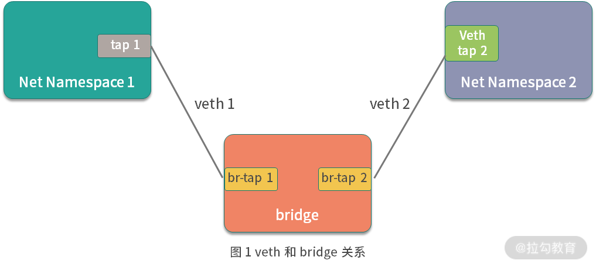
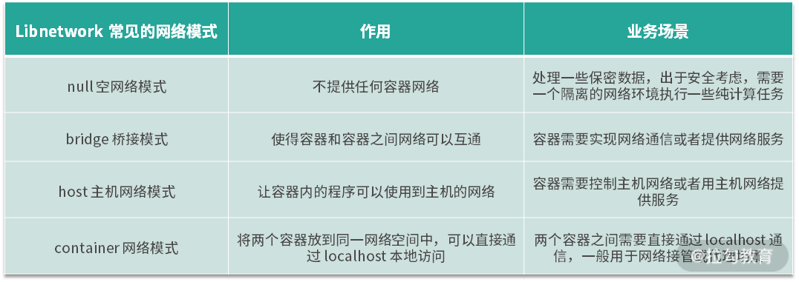

# 12 网络模型：剖析 Docker 网络实现及 Libnetwork 底层原理

前几课时，我介绍了 Linux 的 Namespace 和 Cgroups 技术，利用这两项技术可以实现各种资源的隔离和主机资源的限制，让我们的容器可以像一台虚拟机一样。但这时我们的容器就像一台未联网的电脑，不能被外部访问到，也不能主动与外部通信，这样的容器只能做一些离线的处理任务，无法通过外部访问。所以今天这一讲，我将介绍 Docker 网络相关的知识，使 Docker 容器接通网络。

### 容器网络发展史

提起 Docker 网络，我们不得不从容器战争说起。Docker 从 2013 年诞生，到后来逐渐成为了容器的代名词，然而 Docker 的野心也不止于此，它还想在更多的领域独占鳌头，比如制定容器的网络和存储标准。

于是 Docker 从 1.7 版本开始，便把网络和存储从 Docker 中正式以插件的形式剥离开来，并且分别为其定义了标准，Docker 定义的网络模型标准称之为 CNM (Container Network Model) 。

> Docker 推出 CNM 的同时，CoreOS 推出了 CNI（Container Network Model）。起初，以 Kubernetes 为代表的容器编排阵营考虑过使用 CNM 作为容器的网络标准，但是后来由于很多技术和非技术原因（如果你对详细原因感兴趣，可以参考这篇博客），Kubernetes 决定支持 CoreOS 推出的容器网络标准 CNI。

从此，容器的网络标准便分为两大阵营，一个是以 Docker 公司为代表的 CNM，另一个便是以 Google、Kubernetes、CoreOS 为代表的 CNI 网络标准。

### CNM

CNM (Container Network Model) 是 Docker 发布的容器网络标准，意在规范和指定容器网络发展标准，CNM 抽象了容器的网络接口 ，使得只要满足 CNM 接口的网络方案都可以接入到 Docker 容器网络，更好地满足了用户网络模型多样化的需求。

CNM 只是定义了网络标准，对于底层的具体实现并不太关心，这样便解耦了容器和网络，使得容器的网络模型更加灵活。

CNM 定义的网络标准包含三个重要元素。

- **沙箱（Sandbox）** ：沙箱代表了一系列网络堆栈的配置，其中包含路由信息、网络接口等网络资源的管理，沙箱的实现通常是 Linux 的 Net Namespace，但也可以通过其他技术来实现，比如 [FreeBSD jail](https://zh.wikipedia.org/wiki/FreeBSD_jail) 等。
- **接入点（Endpoint）** ：接入点将沙箱连接到网络中，代表容器的网络接口，接入点的实现通常是 Linux 的 veth 设备对。
- **网络（Network** ）：网络是一组可以互相通信的接入点，它将多接入点组成一个子网，并且多个接入点之间可以相互通信。

CNM 的三个要素基本抽象了所有网络模型，使得网络模型的开发更加规范。

为了更好地构建容器网络标准，Docker 团队把网络功能从 Docker 中剥离出来，成为独立的项目 libnetwork，它通过插件的形式为 Docker 提供网络功能。Libnetwork 是开源的，使用 Golang 编写，它完全遵循 CNM 网络规范，是 CNM 的官方实现。Libnetwork 的工作流程也是完全围绕 CNM 的三个要素进行的，下面我们来详细了解一下 Libnetwork 是如何围绕 CNM 的三要素工作的。

### Libnetwork 的工作流程

Libnetwork 是 Docker 启动容器时，用来为 Docker 容器提供网络接入功能的插件，它可以让 Docker 容器顺利接入网络，实现主机和容器网络的互通。下面，我们来详细了解一下 Libnetwork 是如何为 Docker 容器提供网络的。

第一步：Docker 通过调用 libnetwork.New 函数来创建 NetworkController 实例。NetworkController 是一个接口类型，提供了各种接口，代码如下：

```
type NetworkController interface {
   // 创建一个新的网络。 options 参数用于指定特性类型的网络选项。
   NewNetwork(networkType, name string, id string, options ...NetworkOption) (Network, error)
   // ... 此次省略部分接口
}
```

第二步：通过调用 NewNetwork 函数创建指定名称和类型的 Network，其中 Network 也是接口类型，代码如下:

```
type Network interface {
   // 为该网络创建一个具有唯一指定名称的接入点（Endpoint）
   CreateEndpoint(name string, options ...EndpointOption) (Endpoint, error)
   // 删除网络
   Delete() error
// ... 此次省略部分接口
}
```

第三步：通过调用 CreateEndpoint 来创建接入点（Endpoint）。在 CreateEndpoint 函数中为容器分配了 IP 和网卡接口。其中 Endpoint 也是接口类型，代码如下：

```
// Endpoint 表示网络和沙箱之间的逻辑连接。
type Endpoint interface {
   // 将沙箱连接到接入点，并将为接入点分配的网络资源填充到沙箱中。
   // the network resources allocated for the endpoint.
   Join(sandbox Sandbox, options ...EndpointOption) error
   // 删除接入点
   Delete(force bool) error
   // ... 此次省略部分接口
}
```

第四步：调用 NewSandbox 来创建容器沙箱，主要是初始化 Namespace 相关的资源。

第五步：调用 Endpoint 的 Join 函数将沙箱和网络接入点关联起来，此时容器就加入了 Docker 网络并具备了网络访问能力。

Libnetwork 基于以上工作流程可以构建出多种网络模式，以满足我们的在不同场景下的需求，下面我们来详细了解一下 Libnetwork 提供的常见的四种网络模式。

### Libnetwork 常见网络模式

Libnetwork 比较典型的网络模式主要有四种，这四种网络模式基本满足了我们单机容器的所有场景。

1. null 空网络模式：可以帮助我们构建一个没有网络接入的容器环境，以保障数据安全。
1. bridge 桥接模式：可以打通容器与容器间网络通信的需求。
1. host 主机网络模式：可以让容器内的进程共享主机网络，从而监听或修改主机网络。
1. container 网络模式：可以将两个容器放在同一个网络命名空间内，让两个业务通过 localhost 即可实现访问。

下面我们对 libnetwork 的四种网络模式逐一讲解：

#### （1）null 空网络模式

有时候，我们需要处理一些保密数据，出于安全考虑，我们需要一个隔离的网络环境执行一些纯计算任务。这时候 null 网络模式就派上用场了，这时候我们的容器就像一个没有联网的电脑，处于一个相对较安全的环境，确保我们的数据不被他人从网络窃取。

使用 Docker 创建 null 空网络模式的容器时，容器拥有自己独立的 Net Namespace，但是此时的容器并没有任何网络配置。在这种模式下，Docker 除了为容器创建了 Net Namespace 外，没有创建任何网卡接口、IP 地址、路由等网络配置。我们可以一起来验证下。

我们使用 `docker run` 命令启动时，添加 --net=none 参数启动一个空网络模式的容器，命令如下：

```
$ docker run --net=none -it busybox
/ #
```

容器启动后，我们使用 `ifconfig` 命令查看一下容器内网络配置信息：

```
/ # ifconfig
lo        Link encap:Local Loopback
          inet addr:127.0.0.1  Mask:255.0.0.0
          UP LOOPBACK RUNNING  MTU:65536  Metric:1
          RX packets:0 errors:0 dropped:0 overruns:0 frame:0
          TX packets:0 errors:0 dropped:0 overruns:0 carrier:0
          collisions:0 txqueuelen:1000
          RX bytes:0 (0.0 B)  TX bytes:0 (0.0 B)
```

可以看到容器内除了 Net Namespace 自带的 lo 网卡并没有创建任何虚拟网卡，然后我们再使用 `route -n` 命令查看一下容器内的路由信息:

```
/ # route -n
Kernel IP routing table
Destination     Gateway         Genmask         Flags Metric Ref    Use Iface
```

可以看到，容器内也并没有配置任何路由信息。

#### （2）bridge 桥接模式

Docker 的 bridge 网络是启动容器时默认的网络模式，使用 bridge 网络可以实现容器与容器的互通，可以从一个容器直接通过容器 IP 访问到另外一个容器。同时使用 bridge 网络可以实现主机与容器的互通，我们在容器内启动的业务，可以从主机直接请求。

在介绍 Docker 的 bridge 桥接模式前，我们需要先了解一下 Linux 的 veth 和 bridge 相关的技术，因为 Docker 的 bridge 模式正是由这两种技术实现的。

- Linux veth

veth 是 Linux 中的虚拟设备接口，veth 都是成对出现的，它在容器中，通常充当一个桥梁。veth 可以用来连接虚拟网络设备，例如 veth 可以用来连通两个 Net Namespace，从而使得两个 Net Namespace 之间可以互相访问。

- Linux bridge

Linux bridge 是一个虚拟设备，是用来连接网络的设备，相当于物理网络环境中的交换机。Linux bridge 可以用来转发两个 Net Namespace 内的流量。

- veth 与 bridge 的关系



通过图 1 ，我们可以看到，bridge 就像一台交换机，而 veth 就像一根网线，通过交换机和网线可以把两个不同 Net Namespace 的容器连通，使得它们可以互相通信。

Docker 的 bridge 模式也是这种原理。Docker 启动时，libnetwork 会在主机上创建 docker0 网桥，docker0 网桥就相当于图 1 中的交换机，而 Docker 创建出的 brige 模式的容器则都会连接 docker0 上，从而实现网络互通。

**bridge 桥接模式是 Docker 的默认网络模式，当我们创建容器时不指定任何网络模式，Docker 启动容器默认的网络模式为 bridge。**

#### （3）host 主机网络模式

容器内的网络并不是希望永远跟主机是隔离的，有些基础业务需要创建或更新主机的网络配置，我们的程序必须以主机网络模式运行才能够修改主机网络，这时候就需要用到 Docker 的 host 主机网络模式。

使用 host 主机网络模式时：

- libnetwork 不会为容器创建新的网络配置和 Net Namespace。
- Docker 容器中的进程直接共享主机的网络配置，可以直接使用主机的网络信息，此时，在容器内监听的端口，也将直接占用到主机的端口。
- 除了网络共享主机的网络外，其他的包括进程、文件系统、主机名等都是与主机隔离的。

host 主机网络模式通常适用于想要使用主机网络，但又不想把运行环境直接安装到主机上的场景中。例如我想在主机上运行一个 busybox 服务，但又不想直接把 busybox 安装到主机上污染主机环境，此时我可以使用以下命令启动一个主机网络模式的 busybox 镜像：

```
$ docker run -it --net=host busybox
/ #
```

然后我们使用`ip a` 命令查看一下容器内的网络环境：

```
/ # ip a
1: lo: <LOOPBACK,UP,LOWER\_UP> mtu 65536 qdisc noqueue qlen 1000
link/loopback 00:00:00:00:00:00 brd 00:00:00:00:00:00
inet 127.0.0.1/8 scope host lo
valid\_lft forever preferred\_lft forever
inet6 ::1/128 scope host
valid\_lft forever preferred\_lft forever
2: eth0: <BROADCAST,MULTICAST,UP,LOWER\_UP> mtu 1500 qdisc pfifo\_fast qlen 1000
link/ether 02:11:b0:14:01:0c brd ff:ff:ff:ff:ff:ff
inet 172.20.1.11/24 brd 172.20.1.255 scope global dynamic eth0
valid\_lft 85785286sec preferred\_lft 85785286sec
inet6 fe80::11:b0ff:fe14:10c/64 scope link
valid\_lft forever preferred\_lft forever
3: docker0: \<NO-CARRIER,BROADCAST,MULTICAST,UP> mtu 1500 qdisc noqueue
link/ether 02:42:82:8d:a0:df brd ff:ff:ff:ff:ff:ff
inet 172.17.0.1/16 scope global docker0
valid\_lft forever preferred\_lft forever
inet6 fe80::42:82ff:fe8d:a0df/64 scope link
valid\_lft forever preferred\_lft forever
```

可以看到容器内的网络环境与主机完全一致。

#### （4）container 网络模式

container 网络模式允许一个容器共享另一个容器的网络命名空间。当两个容器需要共享网络，但其他资源仍然需要隔离时就可以使用 container 网络模式，例如我们开发了一个 http 服务，但又想使用 nginx 的一些特性，让 nginx 代理外部的请求然后转发给自己的业务，这时我们使用 container 网络模式将自己开发的服务和 nginx 服务部署到同一个网络命名空间中。

下面我举例说明。首先我们使用以下命令启动一个 busybox1 容器：

```
docker run -d --name=busybox1 busybox sleep 3600
```

然后我们使用 `docker exec` 命令进入到 centos 容器中查看一下网络配置：

```
$ docker exec -it busybox1 sh
/ # ifconfig
eth0 Link encap:Ethernet HWaddr 02:42:AC:11:00:02
inet addr:172.17.0.2 Bcast:172.17.255.255 Mask:255.255.0.0
UP BROADCAST RUNNING MULTICAST MTU:1500 Metric:1
RX packets:11 errors:0 dropped:0 overruns:0 frame:0
TX packets:0 errors:0 dropped:0 overruns:0 carrier:0
collisions:0 txqueuelen:0
RX bytes:906 (906.0 B) TX bytes:0 (0.0 B)
lo Link encap:Local Loopback
inet addr:127.0.0.1 Mask:255.0.0.0
UP LOOPBACK RUNNING MTU:65536 Metric:1
RX packets:0 errors:0 dropped:0 overruns:0 frame:0
TX packets:0 errors:0 dropped:0 overruns:0 carrier:0
collisions:0 txqueuelen:1000
RX bytes:0 (0.0 B) TX bytes:0 (0.0 B)
```

可以看到 busybox1 的 IP 地址为 172.17.0.2。

然后我们新打开一个命令行窗口，再启动一个 busybox2 容器，通过 container 网络模式连接到 busybox1 的网络，命令如下：

```
$ docker run -it --net=container:busybox1 --name=busybox2 busybox sh
/ #
```

在 busybox2 容器内同样使用 ifconfig 命令查看一下容器内的网络配置：

```
/ # ifconfig
eth0 Link encap:Ethernet HWaddr 02:42:AC:11:00:02
inet addr:172.17.0.2 Bcast:172.17.255.255 Mask:255.255.0.0
UP BROADCAST RUNNING MULTICAST MTU:1500 Metric:1
RX packets:14 errors:0 dropped:0 overruns:0 frame:0
TX packets:0 errors:0 dropped:0 overruns:0 carrier:0
collisions:0 txqueuelen:0
RX bytes:1116 (1.0 KiB) TX bytes:0 (0.0 B)
lo Link encap:Local Loopback
inet addr:127.0.0.1 Mask:255.0.0.0
UP LOOPBACK RUNNING MTU:65536 Metric:1
RX packets:0 errors:0 dropped:0 overruns:0 frame:0
TX packets:0 errors:0 dropped:0 overruns:0 carrier:0
collisions:0 txqueuelen:1000
RX bytes:0 (0.0 B) TX bytes:0 (0.0 B)
```

可以看到 busybox2 容器的网络 IP 也为 172.17.0.2，与 busybox1 的网络一致。

以上就是 Libnetwork 常见的四种网络模式，它们的作用及业务场景帮你总结如下：



### 结语

我上面有说到 Libnetwork 的工作流程是完全围绕 CNM 的三个要素进行的，CNM 制定标准之初不仅仅是为了单台主机上的容器互通，更多的是为了定义跨主机之间的容器通信标准。但是后来由于 Kubernetes 逐渐成为了容器编排的标准，而 Kubernetes 最终选择了 CNI 作为容器网络的定义标准（具体原因可以参考[这里](https://kubernetes.io/blog/2016/01/why-kubernetes-doesnt-use-libnetwork/)），很遗憾 CNM 最终没有成为跨主机容器通信的标准，但是CNM 却为推动容器网络标准做出了重大贡献，且 Libnetwork 也是 Docker 的默认网络实现，提供了单独使用 Docker 容器时的多种网络接入功能。
