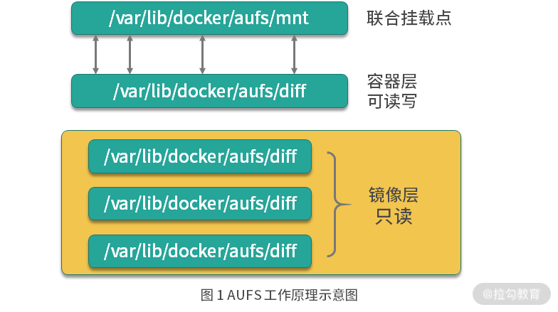

# 14 文件存储驱动：AUFS 文件系统原理及生产环境的最佳配置

我们知道，Docker 主要是基于 Namespace、cgroups 和联合文件系统这三大核心技术实现的。前面的课时我详细讲解了 Namespace 和 cgroups 的相关原理，那么你知道联合文件系统是什么吗？它的原理又是什么呢？

首先我们来了解一下什么是联合文件系统。

### 什么是联合文件系统

联合文件系统（Union File System，Unionfs）是一种分层的轻量级文件系统，它可以把多个目录内容联合挂载到同一目录下，从而形成一个单一的文件系统，这种特性可以让使用者像是使用一个目录一样使用联合文件系统。

那联合文件系统对于 Docker 是一个怎样的存在呢？它可以说是 Docker 镜像和容器的基础，因为它可以使 Docker 可以把镜像做成分层的结构，从而使得镜像的每一层可以被共享。例如两个业务镜像都是基于 CentOS 7 镜像构建的，那么这两个业务镜像在物理机上只需要存储一次 CentOS 7 这个基础镜像即可，从而节省大量存储空间。

说到这儿，你有没有发现，联合文件系统只是一个概念，真正实现联合文件系统才是关键，那如何实现呢？其实实现方案有很多，Docker 中最常用的联合文件系统有三种：AUFS、Devicemapper 和 OverlayFS。

今天我主要讲解 Docker 中最常用的联合文件系统里的 AUFS，为什么呢？因为 AUFS 是 Docker 最早使用的文件系统驱动，多用于 Ubuntu 和 Debian 系统中。在 Docker 早期，OverlayFS 和 Devicemapper 相对不够成熟，AUFS 是最早也是最稳定的文件系统驱动。 Devicemapper 和 OverlayFS 联合文件系统，我将在第 15 和 16 课时为你详细剖析 。

接下来，我们就看看如何配置 Docker 的 AUFS 模式。

### 如何配置 Docker 的 AUFS 模式

AUFS 目前并未被合并到 Linux 内核主线，因此只有 Ubuntu 和 Debian 等少数操作系统支持 AUFS。你可以使用以下命令查看你的系统是否支持 AUFS：

```
$ grep aufs /proc/filesystems
nodev   aufs
```

执行以上命令后，如果输出结果包含`aufs`，则代表当前操作系统支持 AUFS。AUFS 推荐在 Ubuntu 或 Debian 操作系统下使用，如果你想要在 CentOS 等操作系统下使用 AUFS，需要单独安装 AUFS 模块（生产环境不推荐在 CentOS 下使用 AUFS，如果你想在 CentOS 下安装 AUFS 用于研究和测试，可以参考这个[链接](https://github.com/bnied/kernel-ml-aufs)），安装完成后使用上述命令输出结果中有`aufs`即可。 当确认完操作系统支持 AUFS 后，你就可以配置 Docker 的启动参数了。

先在 /etc/docker 下新建 daemon.json 文件，并写入以下内容：

```
{
  "storage-driver": "aufs"
}
```

然后使用以下命令重启 Docker：

```
sudo systemctl restart docker
```

Docker 重启以后使用`docker info`命令即可查看配置是否生效：

```
$ sudo docker info
Client:
 Debug Mode: false
Server:
 Containers: 0
  Running: 0
  Paused: 0
  Stopped: 0
 Images: 1
 Server Version: 19.03.12
 Storage Driver: aufs
  Root Dir: /var/lib/docker/aufs
  Backing Filesystem: extfs
  Dirs: 1
  Dirperm1 Supported: true
```

可以看到 Storage Driver 已经变为 aufs，证明配置已经生效，配置生效后就可以使用 AUFS 为 Docker 提供联合文件系统了。

配置好 Docker 的 AUFS 联合文件系统后，你一定很好奇 AUFS 到底是如何工作的呢？下面我带你详细学习一下 AUFS 的工作原理。

### AUFS 工作原理

#### AUFS 是如何存储文件的？

AUFS 是联合文件系统，意味着它在主机上使用多层目录存储，**每一个目录在 AUFS 中都叫作分支，而在 Docker 中则称之为层（layer），但最终呈现给用户的则是一个普通单层的文件系统，我们把多层以单一层的方式呈现出来的过程叫作联合挂载。**



图 1 AUFS 工作原理示意图

如图 1 所示，每一个镜像层和容器层都是 /var/lib/docker 下的一个子目录，镜像层和容器层都在 aufs/diff 目录下，每一层的目录名称是镜像或容器的 ID 值，联合挂载点在 aufs/mnt 目录下，mnt 目录是真正的容器工作目录。

下面我们针对 aufs 文件夹下的各目录结构，在创建容器前后的变化做详细讲述。

当一个镜像未生成容器时，AUFS 的存储结构如下。

- diff 文件夹：存储镜像内容，每一层都存储在以镜像层 ID 命名的子文件夹中。
- layers 文件夹：存储镜像层关系的元数据，在 diif 文件夹下的每个镜像层在这里都会有一个文件，文件的内容为该层镜像的父级镜像的 ID。
- mnt 文件夹：联合挂载点目录，未生成容器时，该目录为空。

当一个镜像已经生成容器时，AUFS 存储结构会发生如下变化。

- diff 文件夹：当容器运行时，会在 diff 目录下生成容器层。
- layers 文件夹：增加容器层相关的元数据。
- mnt 文件夹：容器的联合挂载点，这和容器中看到的文件内容一致。

以上便是 AUFS 的工作原理，那你知道容器的在工作过程中是如何使用 AUFS 的吗？

#### AUFS 是如何工作的？

AUFS 的工作过程中对文件的操作分为读取文件和修改文件。下面我们分别来看下 AUFS 对于不同的文件操作是如何工作的。

##### 1. 读取文件

当我们在容器中读取文件时，可能会有以下场景。

- 文件在容器层中存在时：当文件存在于容器层时，直接从容器层读取。
- 当文件在容器层中不存在时：当容器运行时需要读取某个文件，如果容器层中不存在时，则从镜像层查找该文件，然后读取文件内容。
- 文件既存在于镜像层，又存在于容器层：当我们读取的文件既存在于镜像层，又存在于容器层时，将会从容器层读取该文件。

##### 2. 修改文件或目录

AUFS 对文件的修改采用的是写时复制的工作机制，这种工作机制可以最大程度节省存储空间。

具体的文件操作机制如下。

- 第一次修改文件：当我们第一次在容器中修改某个文件时，AUFS 会触发写时复制操作，AUFS 首先从镜像层复制文件到容器层，然后再执行对应的修改操作。

> AUFS 写时复制的操作将会复制整个文件，如果文件过大，将会大大降低文件系统的性能，因此当我们有大量文件需要被修改时，AUFS 可能会出现明显的延迟。好在，写时复制操作只在第一次修改文件时触发，对日常使用没有太大影响。

- 删除文件或目录：当文件或目录被删除时，AUFS 并不会真正从镜像中删除它，因为镜像层是只读的，AUFS 会创建一个特殊的文件或文件夹，这种特殊的文件或文件夹会阻止容器的访问。

下面我们通过一个实例来演示一下 AUFS 。

### AUFS 演示

#### 准备演示目录和文件

首先我们在 /tmp 目录下创建 aufs 目录：

```
$ cd /tmp
/tmp$ mkdir aufs
```

准备挂载点目录：

```
/tmp$ cd aufs
/tmp/aufs$ mkdir mnt
```

接下来准备容器层内容：

```
## 创建镜像层目录
/tmp/aufs$ mkdir container1
## 在镜像层目录下准备一个文件
/tmp/aufs$ echo Hello, Container layer! > container1/container1.txt
```

最后准备镜像层内容：

```
## 创建两个镜像层目录
/tmp/aufs$ mkdir image1 && mkdir image2
## 分别写入数据
/tmp/aufs$ echo Hello, Image layer1! > image1/image1.txt
/tmp/aufs$ echo Hello, Image layer2! > image2/image2.txt
```

准备好的目录和文件结构如下：

```
/tmp/aufs$ tree .
.
|-- container1
|   `-- container1.txt
|-- image1
|   `-- image1.txt
|-- image2
|   `-- image2.txt
`-- mnt
4 directories, 3 files
```

#### 创建 AUFS 联合文件系统

使用 mount 命令可以创建 AUFS 类型的文件系统，命令如下：

```
/tmp/aufs$ sudo mount -t aufs -o dirs=./container1:./image2:./image1  none ./mnt
```

mount 命令创建 AUFS 类型文件系统时，这里要注意，**dirs 参数第一个冒号默认为读写权限，后面的目录均为只读权限，与 Docker 容器使用 AUFS 的模式一致。**

执行完上述命令后，mnt 变成了 AUFS 的联合挂载目录，我们可以使用 mount 命令查看一下已经创建的 AUFS 文件系统：

```
/tmp/aufs$ mount -t aufs
none on /tmp/aufs/mnt type aufs (rw,relatime,si=4174b83d649ffb7c)
```

我们每创建一个 AUFS 文件系统，AUFS 都会为我们生成一个 ID，这个 ID 在 /sys/fs/aufs/ 会创建对应的目录，在这个 ID 的目录下可以查看文件挂载的权限。

```
tmp/aufs$ cat /sys/fs/aufs/si_4174b83d649ffb7c/*
/tmp/aufs/container1=rw
/tmp/aufs/image2=ro
/tmp/aufs/image1=ro
64
65
66
```

可以看到 container1 目录的权限为 rw（代表可读写），image1 和 image2 的权限为 ro（代表只读）。

为了验证 mnt 目录下可以看到 container1、image1 和 image2 目录下的所有内容，我们使用 ls 命令查看一下 mnt 目录：

```
/tmp/aufs$ ls -l mnt/
total 12
-rw-rw-r-- 1 ubuntu ubuntu 24 Sep  9 16:55 container1.txt
-rw-rw-r-- 1 ubuntu ubuntu 21 Sep  9 16:59 image1.txt
-rw-rw-r-- 1 ubuntu ubuntu 21 Sep  9 16:59 image2.txt
```

可以看到 mnt 目录下已经出现了我们准备的所有镜像层和容器层的文件。下面让我们来验证一下 AUFS 的写时复制。

#### 验证 AUFS 的写时复制

AUFS 的写时复制是指在容器中，只有需要修改某个文件时，才会把文件从镜像层复制到容器层，下面我们通过修改联合挂载目录 mnt 下的内容来验证下这个过程。

我们使用以下命令修改 mnt 目录下的 image1.txt 文件：

```
/tmp/aufs$ echo Hello, Image layer1 changed! > mnt/image1.txt
```

然后我们查看下 image1/image1.txt 文件内容：

```
/tmp/aufs$ cat image1/image1.txt
Hello, Image layer1!
```

发现“镜像层”的 image1.txt 文件并未被修改。 然后我们查看一下"容器层"对应的 image1.txt 文件内容：

```
/tmp/aufs$ ls -l container1/
total 8
-rw-rw-r-- 1 ubuntu ubuntu 24 Sep  9 16:55 container1.txt
-rw-rw-r-- 1 ubuntu ubuntu 29 Sep  9 17:21 image1.txt
## 查看文件内容
/tmp/aufs$ cat container1/image1.txt
Hello, Image layer1 changed!
```

发现 AUFS 在“容器层”自动创建了 image1.txt 文件，并且内容为我们刚才写入的内容。

至此，我们完成了 AUFS 写时复制的验证。我们在第一次修改镜像内某个文件时，AUFS 会复制这个文件到容器层，然后在容器层对该文件进行修改操作，这就是 AUFS 最典型的特性写时复制。

### 结语

到此，相信你知道了联合文件系统是一种分层的轻量级文件系统，它可以把多个目录内容联合挂载到同一目录下，从而形成一个单一的文件系统。同时也学会了如何配置 Docker 使用 AUFS ，并且明白了 AUFS 的工作原理。

那么你知道 AUFS 为什么一直没能成功进入 Linux 内核主线吗？ 思考后，可以把你的想法写在留言区。

下一课时，我将讲解 Docker 的另一个文件存储驱动：Devicemapper 文件系统原理及生产环境的最佳配置。
