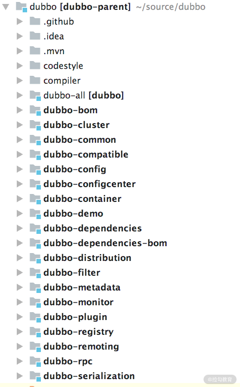
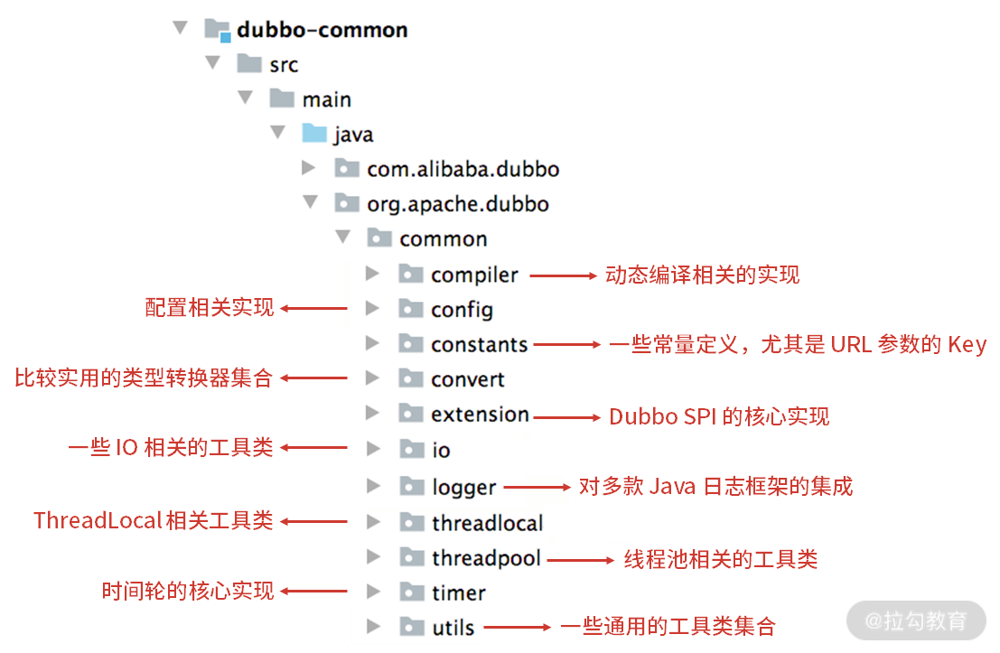
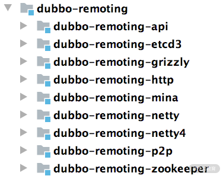
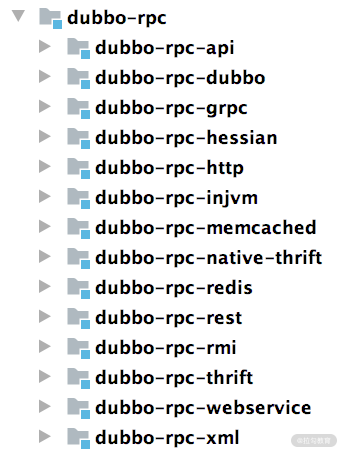
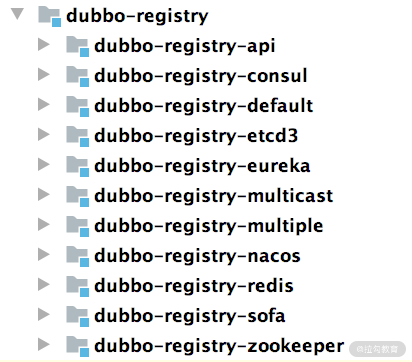
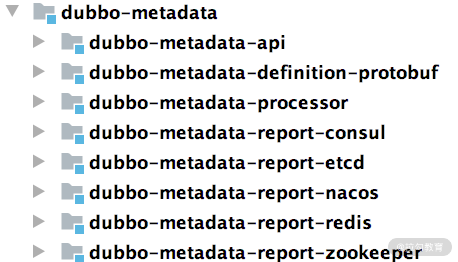
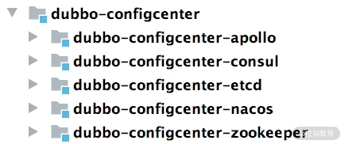
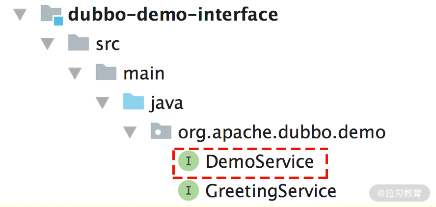
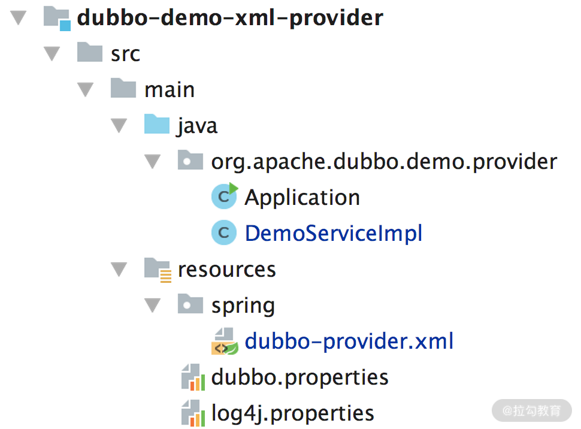
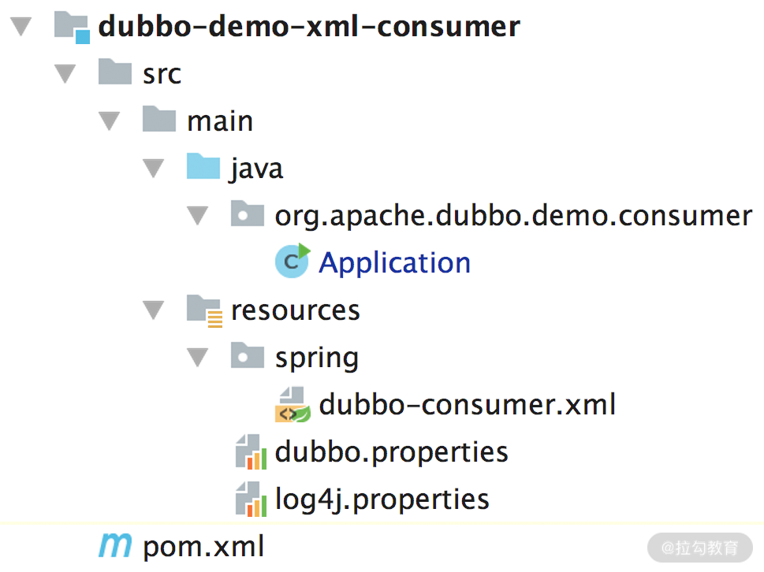

# 01 Dubbo 源码环境搭建：千里之行，始于足下

**好的开始是成功的一半，阅读源码也是一样。** 很多同学在下定决心阅读一个开源框架之后，就一头扎进去，迷失在代码“迷宫”中。此时，有同学意识到，需要一边 Debug 一边看；然后又有一批同学在搭建源码环境的时候兜兜转转，走上了放弃之路；最后剩下为数不多的同学，搭建完了源码环境，却又不知道如何模拟请求让源码执行到自己想要 Debug 的地方。

以上这些痛点问题你是不是很熟悉？是不是也曾遇到过？没关系，本课时我就来手把手带领你搭建 Dubbo 源码环境。

- 在开始搭建源码环境之前，我们会先整体过一下 Dubbo 的架构，这可以帮助你了解 Dubbo 的基本功能以及核心角色。
- 之后我们再动手搭建 Dubbo 源码环境，构建一个 Demo 示例可运行的最简环境。
- 完成源码环境搭建之后，我们还会深入介绍 Dubbo 源码中各个核心模块的功能，这会为后续分析各个模块的实现做铺垫。
- 最后，我们再详细分析下 Dubbo 源码自带的三个 Demo 示例，简单回顾一下 Dubbo 的基本用法，这三个示例也将是我们后续 Debug 源码的入口。

### Dubbo 架构简介

为便于你更好理解和学习，在开始搭建 Dubbo 源码环境之前，我们先来简单介绍一下 Dubbo 架构中的核心角色，帮助你简单回顾一下 Dubbo 的架构，也帮助不熟悉 Dubbo 的小伙伴快速了解 Dubbo。下图展示了 Dubbo 核心架构：


Dubbo 核心架构图

- **Registry：注册中心。** 负责服务地址的注册与查找，服务的 Provider 和 Consumer 只在启动时与注册中心交互。注册中心通过长连接感知 Provider 的存在，在 Provider 出现宕机的时候，注册中心会立即推送相关事件通知 Consumer。
- **Provider：服务提供者。** 在它启动的时候，会向 Registry 进行注册操作，将自己服务的地址和相关配置信息封装成 URL 添加到 ZooKeeper 中。
- **Consumer：服务消费者。** 在它启动的时候，会向 Registry 进行订阅操作。订阅操作会从 ZooKeeper 中获取 Provider 注册的 URL，并在 ZooKeeper 中添加相应的监听器。获取到 Provider URL 之后，Consumer 会根据负载均衡算法从多个 Provider 中选择一个 Provider 并与其建立连接，最后发起对 Provider 的 RPC 调用。 如果 Provider URL 发生变更，Consumer 将会通过之前订阅过程中在注册中心添加的监听器，获取到最新的 Provider URL 信息，进行相应的调整，比如断开与宕机 Provider 的连接，并与新的 Provider 建立连接。Consumer 与 Provider 建立的是长连接，且 Consumer 会缓存 Provider 信息，所以一旦连接建立，即使注册中心宕机，也不会影响已运行的 Provider 和 Consumer。
- **Monitor：监控中心。** 用于统计服务的调用次数和调用时间。Provider 和 Consumer 在运行过程中，会在内存中统计调用次数和调用时间，定时每分钟发送一次统计数据到监控中心。监控中心在上面的架构图中并不是必要角色，监控中心宕机不会影响 Provider、Consumer 以及 Registry 的功能，只会丢失监控数据而已。

### 搭建Dubbo源码环境

当然，要搭建Dubbo 源码环境，你首先需要下载源码。这里你可以直接从官方仓库 [https://github.com/apache/dubbo](https://github.com/apache/dubbo)Fork 到自己的仓库，直接执行下面的命令去下载代码：

```
git clone [email protected]:xxxxxxxx/dubbo.git 
```

然后切换分支，因为目前最新的是 Dubbo 2.7.7 版本，所以这里我们就用这个新版本：

```
git checkout -b dubbo-2.7.7 dubbo-2.7.7 
```

接下来，执行 mvn 命令进行编译：

```
mvn clean install -Dmaven.test.skip=true 
```

最后，执行下面的命令转换成 IDEA 项目：

```
mvn idea:idea // 要是执行报错，就执行这个 mvn idea:workspace 
```

然后，在 IDEA 中导入源码，因为这个导入过程中会下载所需的依赖包，所以会耗费点时间。

### Dubbo源码核心模块

在 IDEA 成功导入 Dubbo 源码之后，你看到的项目结构如下图所示：



下面我们就来简单介绍一下这些核心模块的功能，至于详细分析，在后面的课时中我们还会继续讲解。

- **dubbo-common 模块：** Dubbo 的一个公共模块，其中有很多工具类以及公共逻辑，例如课程后面紧接着要介绍的 Dubbo SPI 实现、时间轮实现、动态编译器等。



- **dubbo-remoting 模块：** Dubbo 的远程通信模块，其中的子模块依赖各种开源组件实现远程通信。在 dubbo-remoting-api 子模块中定义该模块的抽象概念，在其他子模块中依赖其他开源组件进行实现，例如，dubbo-remoting-netty4 子模块依赖 Netty 4 实现远程通信，dubbo-remoting-zookeeper 通过 Apache Curator 实现与 ZooKeeper 集群的交互。



- **dubbo-rpc 模块：** Dubbo 中对远程调用协议进行抽象的模块，其中抽象了各种协议，依赖于 dubbo-remoting 模块的远程调用功能。dubbo-rpc-api 子模块是核心抽象，其他子模块是针对具体协议的实现，例如，dubbo-rpc-dubbo 子模块是对 Dubbo 协议的实现，依赖了 dubbo-remoting-netty4 等 dubbo-remoting 子模块。 dubbo-rpc 模块的实现中只包含一对一的调用，不关心集群的相关内容。



- **dubbo-cluster 模块：** Dubbo 中负责管理集群的模块，提供了负载均衡、容错、路由等一系列集群相关的功能，最终的目的是将多个 Provider 伪装为一个 Provider，这样 Consumer 就可以像调用一个 Provider 那样调用 Provider 集群了。
- **dubbo-registry 模块：** Dubbo 中负责与多种开源注册中心进行交互的模块，提供注册中心的能力。其中， dubbo-registry-api 子模块是顶层抽象，其他子模块是针对具体开源注册中心组件的具体实现，例如，dubbo-registry-zookeeper 子模块是 Dubbo 接入 ZooKeeper 的具体实现。



- **dubbo-monitor 模块：** Dubbo 的监控模块，主要用于统计服务调用次数、调用时间以及实现调用链跟踪的服务。
- **dubbo-config 模块：** Dubbo 对外暴露的配置都是由该模块进行解析的。例如，dubbo-config-api 子模块负责处理 API 方式使用时的相关配置，dubbo-config-spring 子模块负责处理与 Spring 集成使用时的相关配置方式。有了 dubbo-config 模块，用户只需要了解 Dubbo 配置的规则即可，无须了解 Dubbo 内部的细节。


- **dubbo-metadata 模块：** Dubbo 的元数据模块（本课程后续会详细介绍元数据的内容）。dubbo-metadata 模块的实现套路也是有一个 api 子模块进行抽象，然后其他子模块进行具体实现。



- **dubbo-configcenter 模块：**Dubbo 的动态配置模块，主要负责外部化配置以及服务治理规则的存储与通知，提供了多个子模块用来接入多种开源的服务发现组件。



### Dubbo 源码中的 Demo 示例

在 Dubbo 源码中我们可以看到一个 dubbo-demo 模块，共包括三个非常基础 的 Dubbo 示例项目，分别是：**使用 XML 配置的 Demo 示例、使用注解配置的 Demo 示例 **以及** 直接使用 API 的 Demo 示例**。下面我们将从这三个示例的角度，简单介绍 Dubbo 的基本使用。同时，这三个项目也将作为后续 Debug Dubbo 源码的入口，我们会根据需要在其之上进行修改 。不过在这儿之前，你需要先启动 ZooKeeper 作为注册中心，然后编写一个业务接口作为 Provider 和 Consumer 的公约。

#### 启动 ZooKeeper

在前面 Dubbo 的架构图中，你可以看到 Provider 的地址以及配置信息是通过注册中心传递给 Consumer 的。 Dubbo 支持的注册中心尽管有很多， 但在生产环境中，**基本都是用 ZooKeeper 作为注册中心** 。因此，在调试 Dubbo 源码时，自然需要在本地启动 ZooKeeper。

那怎么去启动 ZooKeeper 呢？

首先，你得下载 zookeeper-3.4.14.tar.gz 包（下载地址： [https://archive.apache.org/dist/zookeeper/zookeeper-3.4.14/](https://archive.apache.org/dist/zookeeper/zookeeper-3.4.14/)）。下载完成之后执行如下命令解压缩：

```
tar -zxf zookeeper-3.4.14.tar.gz 
```

解压完成之后，进入 zookeeper-3.4.14 目录，复制 conf/zoo_sample.cfg 文件并重命名为 conf/zoo.cfg，之后执行如下命令就可以启动 ZooKeeper了。

```
>./bin/zkServer.sh start 
# 下面为输出内容 
ZooKeeper JMX enabled by default 
Using config: /Users/xxx/zookeeper-3.4.14/bin/../conf/zoo.cfg # 配置文件 
Starting zookeeper ... STARTED # 启动成功 
```

#### 业务接口

在使用 Dubbo 之前，你还需要一个业务接口，这个业务接口可以认为是 Dubbo Provider 和 Dubbo Consumer 的公约，反映出很多信息：

- Provider ，如何提供服务、提供的服务名称是什么、需要接收什么参数、需要返回什么响应；
- Consumer ，如何使用服务、使用的服务名称是什么、需要传入什么参数、会得到什么响应。

dubbo-demo-interface 模块就是定义业务接口的地方，如下图所示：



其中，DemoService 接口中定义了两个方法：

```
public interface DemoService { 
    String sayHello(String name); // 同步调用 
    // 异步调用 
    default CompletableFuture<String> sayHelloAsync(String name) {  
        return CompletableFuture.completedFuture(sayHello(name)); 
    } 
} 
```

#### Demo 1：基于 XML 配置

在 dubbo-demo 模块下的 dubbo-demo-xml 模块，提供了基于 Spring XML 的 Provider 和 Consumer。

我们先来看 dubbo-demo-xml-provider 模块，其结构如下图所示：



在其 pom.xml 中除了一堆 dubbo 的依赖之外，还有依赖了 DemoService 这个公共接口：

```
<dependency> 
    <groupId>org.apache.dubbo</groupId> 
    <artifactId>dubbo-demo-interface</artifactId> 
    <version>${project.parent.version}</version> 
</dependency> 
```

DemoServiceImpl 实现了 DemoService 接口，sayHello() 方法直接返回一个字符串，sayHelloAsync() 方法返回一个 CompletableFuture 对象。

在 dubbo-provider.xml 配置文件中，会将 DemoServiceImpl 配置成一个 Spring Bean，并作为 DemoService 服务暴露出去：

```
<!-- 配置为 Spring Bean --> 
<bean id="demoService" class="org.apache.dubbo.demo.provider.DemoServiceImpl"/> 
<!-- 作为 Dubbo 服务暴露出去 --> 
<dubbo:service interface="org.apache.dubbo.demo.DemoService" ref="demoService"/> 
```

还有就是指定注册中心地址（就是前面 ZooKeeper 的地址），这样 Dubbo 才能把暴露的 DemoService 服务注册到 ZooKeeper 中：

```
<!-- Zookeeper 地址 --> 
<dubbo:registry address="zookeeper://127.0.0.1:2181"/> 
```

最后，在 Application 中写个 main() 方法，指定 Spring 配置文件并启动 ClassPathXmlApplicationContext 即可。

接下来再看 dubbo-demo-xml-consumer 模块，结构如下图所示：



在 pom.xml 中同样依赖了 dubbo-demo-interface 这个公共模块。

在 dubbo-consumer.xml 配置文件中，会指定注册中心地址（就是前面 ZooKeeper 的地址），这样 Dubbo 才能从 ZooKeeper 中拉取到 Provider 暴露的服务列表信息：

```
<!-- Zookeeper地址 --> 
<dubbo:registry address="zookeeper://127.0.0.1:2181"/> 
```

还会使用 [dubbo:reference](dubbo:reference) 引入 DemoService 服务，后面可以作为 Spring Bean 使用：

```
<!--引入DemoService服务，并配置成Spring Bean--> 
<dubbo:reference id="demoService" check="false"  
                 interface="org.apache.dubbo.demo.DemoService"/> 
```

最后，在 Application 中写个 main() 方法，指定 Spring 配置文件并启动 ClassPathXmlApplicationContext 之后，就可以远程调用 Provider 端的 DemoService 的 sayHello() 方法了。

#### Demo 2：基于注解配置

dubbo-demo-annotation 模块是基于 Spring 注解配置的示例，无非就是将 XML 的那些配置信息转移到了注解上。

我们先来看 dubbo-demo-annotation-provider 这个示例模块：

```
public class Application { 
    public static void main(String[] args) throws Exception { 
     // 使用AnnotationConfigApplicationContext初始化Spring容器， 
        // 从ProviderConfiguration这个类的注解上拿相关配置信息 
        AnnotationConfigApplicationContext context =  
              new AnnotationConfigApplicationContext( 
                  ProviderConfiguration.class); 
        context.start(); 
        System.in.read(); 
    } 
    @Configuration // 配置类 
    // @EnableDubbo注解指定包下的Bean都会被扫描，并做Dubbo服务暴露出去 
    @EnableDubbo(scanBasePackages = "org.apache.dubbo.demo.provider")      
    // @PropertySource注解指定了其他配置信息 
    @PropertySource("classpath:/spring/dubbo-provider.properties")      
    static class ProviderConfiguration { 
        @Bean 
        public RegistryConfig registryConfig() { 
            RegistryConfig registryConfig = new RegistryConfig(); 
            registryConfig.setAddress("zookeeper://127.0.0.1:2181"); 
            return registryConfig; 
        } 
    } 
} 
```

这里，同样会有一个 DemoServiceImpl 实现了 DemoService 接口，并且在 org.apache.dubbo.demo.provider 目录下，能被扫描到，暴露成 Dubbo 服务。

接着再来看 dubbo-demo-annotation-consumer 模块，其中 Application 中也是通过 AnnotationConfigApplicationContext 初始化 Spring 容器，也会扫描指定目录下的 Bean，会扫到 DemoServiceComponent 这个 Bean，其中就通过 @Reference 注解注入 Dubbo 服务相关的 Bean：

```
@Component("demoServiceComponent") 
public class DemoServiceComponent implements DemoService { 
    @Reference // 注入Dubbo服务 
    private DemoService demoService; 
    @Override 
    public String sayHello(String name) { 
        return demoService.sayHello(name); 
    } 
   // 其他方法 
} 
```

#### Demo 3：基于 API 配置

在有的场景中，不能依赖于 Spring 框架，只能使用 API 来构建 Dubbo Provider 和 Consumer，比较典型的一种场景就是在写 SDK 的时候。

先来看 dubbo-demo-api-provider 模块，其中 Application.main() 方法是入口：

```
// 创建一个ServiceConfig的实例，泛型参数是业务接口实现类， 
// 即DemoServiceImpl 
ServiceConfig<DemoServiceImpl> service = new ServiceConfig<>(); 
// 指定业务接口 
service.setInterface(DemoService.class); 
// 指定业务接口的实现，由该对象来处理Consumer的请求 
service.setRef(new DemoServiceImpl()); 
// 获取DubboBootstrap实例，这是个单例的对象 
DubboBootstrap bootstrap = DubboBootstrap.getInstance(); 
//生成一个 ApplicationConfig 的实例、指定ZK地址以及ServiceConfig实例 
bootstrap.application(new ApplicationConfig("dubbo-demo-api-provider")) 
        .registry(new RegistryConfig("zookeeper://127.0.0.1:2181")) 
        .service(service) 
        .start() 
        .await(); 
```

这里，同样会有一个 DemoServiceImpl 实现了 DemoService 接口，并且在 org.apache.dubbo.demo.provider 目录下，能被扫描到，暴露成 Dubbo 服务。

再来看 dubbo-demo-api-consumer 模块，其中 Application 中包含一个普通的 main() 方法入口：

```
 // 创建ReferenceConfig,其中指定了引用的接口DemoService 
 ReferenceConfig<DemoService> reference = new ReferenceConfig<>(); 
 reference.setInterface(DemoService.class); 
 reference.setGeneric("true"); 
 // 创建DubboBootstrap，指定ApplicationConfig以及RegistryConfig 
 DubboBootstrap bootstrap = DubboBootstrap.getInstance(); 
 bootstrap.application(new ApplicationConfig("dubbo-demo-api-consumer")) 
         .registry(new RegistryConfig("zookeeper://127.0.0.1:2181")) 
         .reference(reference) 
         .start(); 
 // 获取DemoService实例并调用其方法 
 DemoService demoService = ReferenceConfigCache.getCache() 
    .get(reference); 
 String message = demoService.sayHello("dubbo"); 
 System.out.println(message); 
```

### 总结

在本课时，我们首先介绍了 Dubbo 的核心架构以及各核心组件的功能，接下来又搭建了 Dubbo 源码环境，并详细介绍了 Dubbo 核心模块的功能，为后续分析 Dubbo 源码打下了基础。最后我们还深入分析了 Dubbo 源码中自带的三个 Demo 示例，现在你就可以以这三个 Demo 示例为入口 Debug Dubbo 源码了。

在后面的课时中，我们将解决几个问题：Dubbo 是如何与 ZooKeeper 等注册中心进行交互的？Provider 与 Consumer 之间是如何交互的？为什么我们在编写业务代码的时候，感受不到任何网络交互？Dubbo Provider 发布到注册中心的数据是什么？Consumer 为何能正确识别？两者的统一契约是什么？这个契约是如何做到可扩展的？这个契约还会用在 Dubbo 的哪些地方？这些问题你也可以提前思考一下，在后面的课程中我会一一为你解答。
