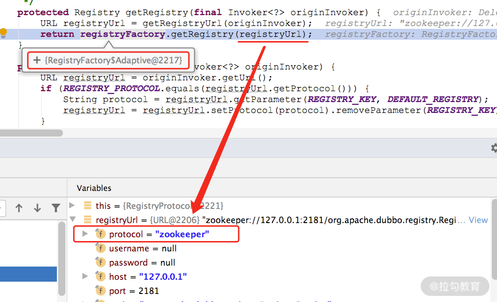
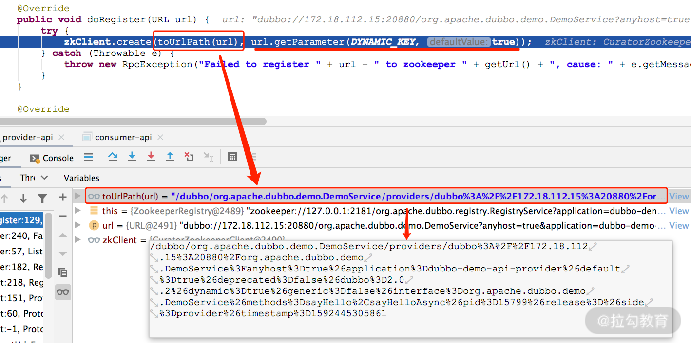
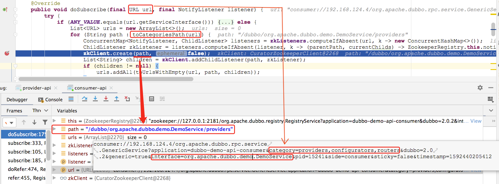

# 02 Dubbo 的配置总线：抓住 URL，就理解了半个 Dubbo

你好，我是杨四正，今天我和你分享的主题是 Dubbo 的配置总线：抓住 URL，就理解了半个 Dubbo 。

在互联网领域，每个信息资源都有统一的且在网上唯一的地址，该地址就叫 URL（Uniform Resource Locator，统一资源定位符），它是互联网的统一资源定位标志，也就是指网络地址。

URL 本质上就是一个特殊格式的字符串。一个标准的 URL 格式可以包含如下的几个部分：

```
protocol://username:[email protected]:port/path?key=value&key=value
```

- **protocol**：URL 的协议。我们常见的就是 HTTP 协议和 HTTPS 协议，当然，还有其他协议，如 FTP 协议、SMTP 协议等。
- **username/password**：用户名/密码。 HTTP Basic Authentication 中多会使用在 URL 的协议之后直接携带用户名和密码的方式。
- **host/port**：主机/端口。在实践中一般会使用域名，而不是使用具体的 host 和 port。
- **path**：请求的路径。
- **parameters**：参数键值对。一般在 GET 请求中会将参数放到 URL 中，POST 请求会将参数放到请求体中。

URL 是整个 Dubbo 中非常基础，也是非常核心的一个组件，阅读源码的过程中你会发现很多方法都是以 URL 作为参数的，在方法内部解析传入的 URL 得到有用的参数，所以有人将 URL 称为**Dubbo 的配置总线**。

例如，在下一课时介绍的 Dubbo SPI 核心实现中，你会看到 URL 参与了扩展实现的确定；在本课程后续介绍注册中心实现的时候，你还会看到 Provider 将自身的信息封装成 URL 注册到 ZooKeeper 中，从而暴露自己的服务， Consumer 也是通过 URL 来确定自己订阅了哪些 Provider 的。

由此可见，URL 之于 Dubbo 是非常重要的，所以说“抓住 URL，就理解了半个 Dubbo”。那本文我们就来介绍 URL 在 Dubbo 中的应用，以及 URL 作为 Dubbo 统一契约的重要性，最后我们再通过示例说明 URL 在 Dubbo 中的具体应用。

### Dubbo 中的 URL

Dubbo 中任意的一个实现都可以抽象为一个 URL，Dubbo 使用 URL 来统一描述了所有对象和配置信息，并贯穿在整个 Dubbo 框架之中。这里我们来看 Dubbo 中一个典型 URL 的示例，如下：

```
dubbo://172.17.32.91:20880/org.apache.dubbo.demo.DemoService?anyhost=true&application=dubbo-demo-api-provider&dubbo=2.0.2&interface=org.apache.dubbo.demo.DemoService&methods=sayHello,sayHelloAsync&pid=32508&release=&side=provider&timestamp=1593253404714dubbo://172.17.32.91:20880/org.apache.dubbo.demo.DemoService?anyhost=true&application=dubbo-demo-api-provider&dubbo=2.0.2&interface=org.apache.dubbo.demo.DemoService&methods=sayHello,sayHelloAsync&pid=32508&release=&side=provider&timestamp=1593253404714
```

这个 Demo Provider 注册到 ZooKeeper 上的 URL 信息，简单解析一下这个 URL 的各个部分：

- **protocol**：dubbo 协议。
- **username/password**：没有用户名和密码。
- **host/port**：172.17.32.91:20880。
- **path**：org.apache.dubbo.demo.DemoService。
- **parameters**：参数键值对，这里是问号后面的参数。

下面是 URL 的构造方法，你可以看到其核心字段与前文分析的 URL 基本一致：

```
public URL(String protocol, 
            String username, 
            String password, 
            String host, 
            int port, 
            String path, 
            Map<String, String> parameters, 
            Map<String, Map<String, String>> methodParameters) { 
    if (StringUtils.isEmpty(username) 
            && StringUtils.isNotEmpty(password)) { 
        throw new IllegalArgumentException("Invalid url"); 
    } 
    this.protocol = protocol; 
    this.username = username; 
    this.password = password; 
    this.host = host; 
    this.port = Math.max(port, 0); 
    this.address = getAddress(this.host, this.port); 
    while (path != null && path.startsWith("/")) { 
        path = path.substring(1); 
    } 
    this.path = path; 
    if (parameters == null) { 
        parameters = new HashMap<>(); 
    } else { 
        parameters = new HashMap<>(parameters); 
    } 
    this.parameters = Collections.unmodifiableMap(parameters); 
    this.methodParameters = Collections.unmodifiableMap(methodParameters); 
}
```

另外，在 dubbo-common 包中还提供了 URL 的辅助类：

- **URLBuilder，** 辅助构造 URL；
- \*\*URLStrParser，\*\*将字符串解析成 URL 对象。

### 契约的力量

对于 Dubbo 中的 URL，很多人称之为“配置总线”，也有人称之为“统一配置模型”。虽然说法不同，但都是在表达一个意思，URL 在 Dubbo 中被当作是“**公共的契约**”。一个 URL 可以包含非常多的扩展点参数，URL 作为上下文信息贯穿整个扩展点设计体系。

其实，一个优秀的开源产品都有一套灵活清晰的扩展契约，不仅是第三方可以按照这个契约进行扩展，其自身的内核也可以按照这个契约进行搭建。如果没有一个公共的契约，只是针对每个接口或方法进行约定，就会导致不同的接口甚至同一接口中的不同方法，以不同的参数类型进行传参，一会儿传递 Map，一会儿传递字符串，而且字符串的格式也不确定，需要你自己进行解析，这就多了一层没有明确表现出来的隐含的约定。

所以说，在 Dubbo 中使用 URL 的好处多多，增加了便捷性：

- 使用 URL 这种公共契约进行上下文信息传递，最重要的就是代码更加易读、易懂，不用花大量时间去揣测传递数据的格式和含义，进而形成一个统一的规范，使得代码易写、易读。
- 使用 URL 作为方法的入参（相当于一个 Key/Value 都是 String 的 Map)，它所表达的含义比单个参数更丰富，当代码需要扩展的时候，可以将新的参数以 Key/Value 的形式追加到 URL 之中，而不需要改变入参或是返回值的结构。
- 使用 URL 这种“公共的契约”可以简化沟通，人与人之间的沟通消耗是非常大的，信息传递的效率非常低，使用统一的契约、术语、词汇范围，可以省去很多沟通成本，尽可能地提高沟通效率。

### Dubbo 中的 URL 示例

了解了 URL 的结构以及 Dubbo 使用 URL 的原因之后，我们再来看 Dubbo 中的三个真实示例，进一步感受 URL 的重要性。

#### 1. URL 在 SPI 中的应用

Dubbo SPI 中有一个依赖 URL 的重要场景——适配器方法，是被 @Adaptive 注解标注的， URL 一个很重要的作用就是与 @Adaptive 注解一起选择合适的扩展实现类。

例如，在 dubbo-registry-api 模块中我们可以看到 RegistryFactory 这个接口，其中的 getRegistry() 方法上有 @Adaptive({"protocol"}) 注解，说明这是一个适配器方法，Dubbo 在运行时会为其动态生成相应的 “$Adaptive” 类型，如下所示：

```
public class RegistryFactory$Adaptive
              implements RegistryFactory { 
    public Registry getRegistry(org.apache.dubbo.common.URL arg0) { 
        if (arg0 == null) throw new IllegalArgumentException("..."); 
        org.apache.dubbo.common.URL url = arg0; 
        // 尝试获取URL的Protocol，如果Protocol为空，则使用默认值"dubbo" 
        String extName = (url.getProtocol() == null ? "dubbo" : 
             url.getProtocol()); 
        if (extName == null) 
            throw new IllegalStateException("..."); 
        // 根据扩展名选择相应的扩展实现，Dubbo SPI的核心原理在下一课时深入分析 
        RegistryFactory extension = (RegistryFactory) ExtensionLoader 
          .getExtensionLoader(RegistryFactory.class) 
                .getExtension(extName); 
        return extension.getRegistry(arg0); 
    } 
}
```

我们会看到，在生成的 RegistryFactory$Adaptive 类中会自动实现 getRegistry() 方法，其中会根据 URL 的 Protocol 确定扩展名称，从而确定使用的具体扩展实现类。我们可以找到 RegistryProtocol 这个类，并在其 getRegistry() 方法中打一个断点， Debug 启动上一课时介绍的任意一个 Demo 示例中的 Provider，得到如下图所示的内容：



这里传入的 registryUrl 值为：

```
zookeeper://127.0.0.1:2181/org.apache.dubbo...
```

那么在 RegistryFactory$Adaptive 中得到的扩展名称为 zookeeper，此次使用的 Registry 扩展实现类就是 ZookeeperRegistryFactory。至于 Dubbo SPI 的完整内容，我们将在下一课时详细介绍，这里就不再展开了。

#### 2. URL 在服务暴露中的应用

我们再来看另一个与 URL 相关的示例。上一课时我们在介绍 Dubbo 的简化架构时提到，Provider 在启动时，会将自身暴露的服务注册到 ZooKeeper 上，具体是注册哪些信息到 ZooKeeper 上呢？我们来看 ZookeeperRegistry.doRegister() 方法，在其中打个断点，然后 Debug 启动 Provider，会得到下图：



传入的 URL 中包含了 Provider 的地址（172.18.112.15:20880）、暴露的接口（org.apache.dubbo.demo.DemoService）等信息， toUrlPath() 方法会根据传入的 URL 参数确定在 ZooKeeper 上创建的节点路径，还会通过 URL 中的 dynamic 参数值确定创建的 ZNode 是临时节点还是持久节点。

#### 3. URL 在服务订阅中的应用

Consumer 启动后会向注册中心进行订阅操作，并监听自己关注的 Provider。那 Consumer 是如何告诉注册中心自己关注哪些 Provider 呢？

我们来看 ZookeeperRegistry 这个实现类，它是由上面的 ZookeeperRegistryFactory 工厂类创建的 Registry 接口实现，其中的 doSubscribe() 方法是订阅操作的核心实现，在第 175 行打一个断点，并 Debug 启动 Demo 中 Consumer，会得到下图所示的内容：



我们看到传入的 URL 参数如下：

```
consumer://...?application=dubbo-demo-api-consumer&category=providers,configurators,routers&interface=org.apache.dubbo.demo.DemoService...
```

其中 Protocol 为 consumer ，表示是 Consumer 的订阅协议，其中的 category 参数表示要订阅的分类，这里要订阅 providers、configurators 以及 routers 三个分类；interface 参数表示订阅哪个服务接口，这里要订阅的是暴露 org.apache.dubbo.demo.DemoService 实现的 Provider。

通过 URL 中的上述参数，ZookeeperRegistry 会在 toCategoriesPath() 方法中将其整理成一个 ZooKeeper 路径，然后调用 zkClient 在其上添加监听。

通过上述示例，相信你已经感觉到 URL 在 Dubbo 体系中称为“总线”或是“契约”的原因了，在后面的源码分析中，我们还将看到更多关于 URL 的实现。

### 总结

在本课时，我们重点介绍了 Dubbo 对 URL 的封装以及相关的工具类，然后说明了统一契约的好处，当然也是 Dubbo 使用 URL 作为统一配置总线的好处，最后我们还介绍了 Dubbo SPI、Provider 注册、Consumer 订阅等场景中与 URL 相关的实现，这些都可以帮助你更好地感受 URL 在其中发挥的作用。

这里你可以想一下，在其他框架或是实际工作中，有没有类似 Dubbo URL 这种统一的契约？欢迎你在留言区分享你的想法。
