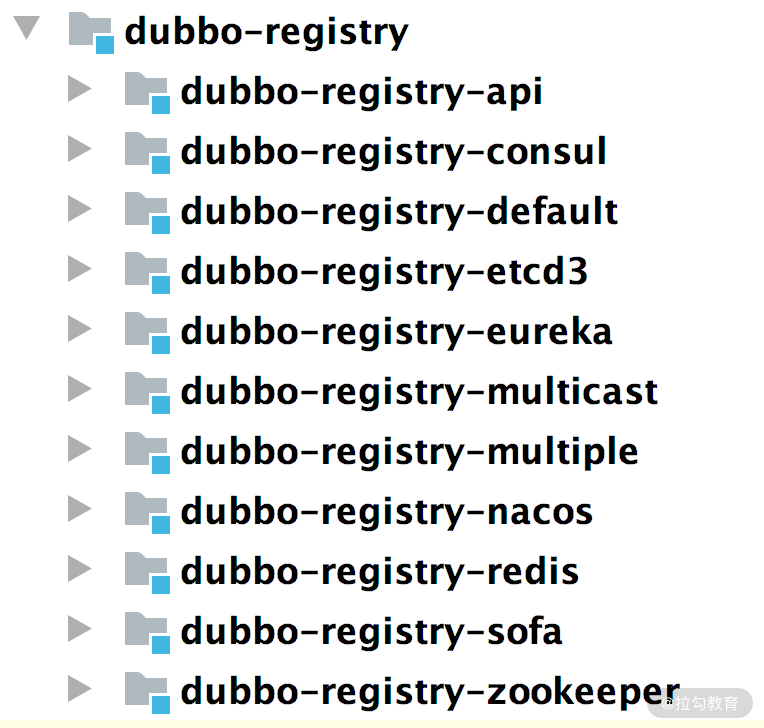
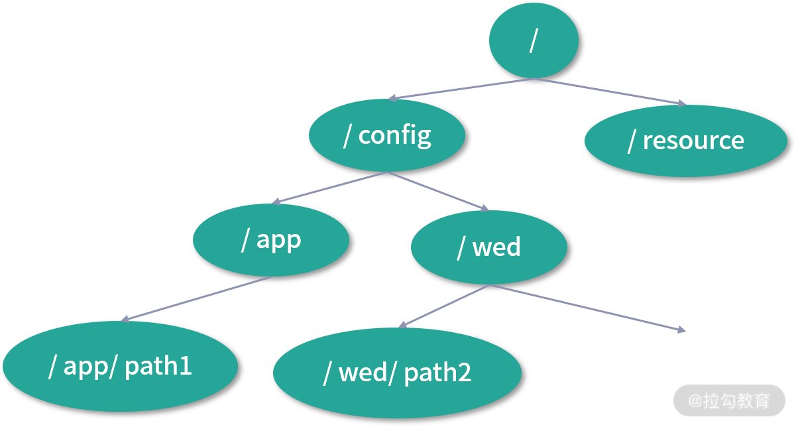
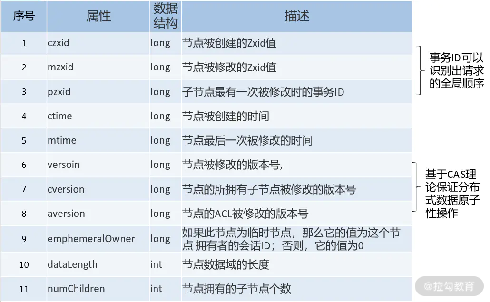
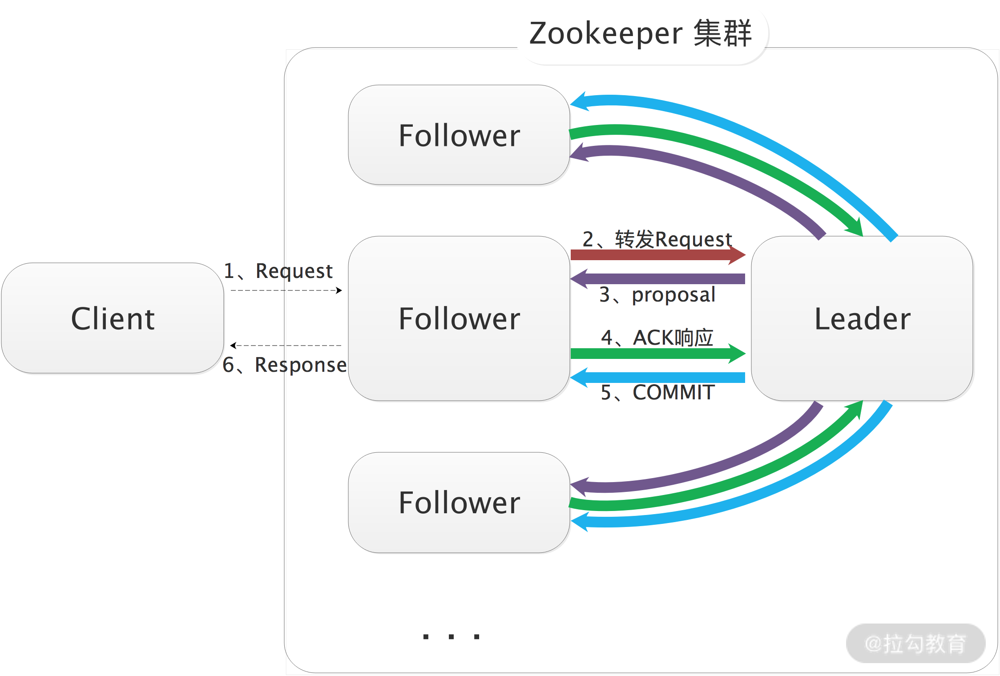

06 ZooKeeper 与 Curator，求你别用 ZkClient 了（上）
=========================================

在前面我们介绍 Dubbo 简化架构的时候提到过，Dubbo Provider 在启动时会将自身的服务信息整理成 URL 注册到注册中心，Dubbo Consumer 在启动时会向注册中心订阅感兴趣的 Provider 信息，之后 Provider 和 Consumer 才能建立连接，进行后续的交互。可见， **一个稳定、高效的注册中心对基于 Dubbo 的微服务来说是至关重要的** 。

Dubbo 目前支持 Consul、etcd、Nacos、ZooKeeper、Redis 等多种开源组件作为注册中心，并且在 Dubbo 源码也有相应的接入模块，如下图所示：

**Dubbo 官方推荐使用 ZooKeeper 作为注册中心**，它是在实际生产中最常用的注册中心实现，这也是我们本课时要介绍 ZooKeeper 核心原理的原因。

要与 ZooKeeper 集群进行交互，我们可以使用 ZooKeeper 原生客户端或是 ZkClient、Apache Curator 等第三方开源客户端。在后面介绍 dubbo-registry-zookeeper 模块的具体实现时你会看到，Dubbo 底层使用的是 Apache Curator。**Apache Curator 是实践中最常用的 ZooKeeper 客户端。 **### ZooKeeper 核心概念** Apache ZooKeeper 是一个针对分布式系统的、可靠的、可扩展的协调服务 **，它通常作为统一命名服务、统一配置管理、注册中心（分布式集群管理）、分布式锁服务、Leader 选举服务等角色出现。很多分布式系统都依赖与 ZooKeeper 集群实现分布式系统间的协调调度，例如：Dubbo、HDFS 2.x、HBase、Kafka 等。** ZooKeeper 已经成为现代分布式系统的标配**。

ZooKeeper 本身也是一个分布式应用程序，下图展示了 ZooKeeper 集群的核心架构。

ZooKeeper 集群的核心架构图

* **Client 节点**：从业务角度来看，这是分布式应用中的一个节点，通过 ZkClient 或是其他 ZooKeeper 客户端与 ZooKeeper 集群中的一个 Server 实例维持长连接，并定时发送心跳。从 ZooKeeper 集群的角度来看，它是 ZooKeeper 集群的一个客户端，可以主动查询或操作 ZooKeeper 集群中的数据，也可以在某些 ZooKeeper 节点（ZNode）上添加监听。当被监听的 ZNode 节点发生变化时，例如，该 ZNode 节点被删除、新增子节点或是其中数据被修改等，ZooKeeper 集群都会立即通过长连接通知 Client。
* **Leader 节点**：ZooKeeper 集群的主节点，负责整个 ZooKeeper 集群的写操作，保证集群内事务处理的顺序性。同时，还要负责整个集群中所有 Follower 节点与 Observer 节点的数据同步。
* **Follower 节点**：ZooKeeper 集群中的从节点，可以接收 Client 读请求并向 Client 返回结果，并不处理写请求，而是转发到 Leader 节点完成写入操作。另外，Follower 节点还会参与 Leader 节点的选举。
* **Observer 节点**：ZooKeeper 集群中特殊的从节点，不会参与 Leader 节点的选举，其他功能与 Follower 节点相同。引入 Observer 角色的目的是增加 ZooKeeper 集群读操作的吞吐量，如果单纯依靠增加 Follower 节点来提高 ZooKeeper 的读吞吐量，那么有一个很严重的副作用，就是 ZooKeeper 集群的写能力会大大降低，因为 ZooKeeper 写数据时需要 Leader 将写操作同步给半数以上的 Follower 节点。引入 Observer 节点使得 ZooKeeper 集群在写能力不降低的情况下，大大提升了读操作的吞吐量。

了解了 ZooKeeper 整体的架构之后，我们再来了解一下 ZooKeeper 集群存储数据的逻辑结构。ZooKeeper 逻辑上是按照**树型结构 **进行数据存储的（如下图），其中的节点称为** ZNode**。每个 ZNode 有一个名称标识，即树根到该节点的路径（用 “/” 分隔），ZooKeeper 树中的每个节点都可以拥有子节点，这与文件系统的目录树类似。

ZooKeeper 树型存储结构

ZNode 节点类型有如下四种：

* **持久节点。** 持久节点创建后，会一直存在，不会因创建该节点的 Client 会话失效而删除。
* **持久顺序节点。** 持久顺序节点的基本特性与持久节点一致，创建节点的过程中，ZooKeeper 会在其名字后自动追加一个单调增长的数字后缀，作为新的节点名。
* **临时节点。** 创建临时节点的 ZooKeeper Client 会话失效之后，其创建的临时节点会被 ZooKeeper 集群自动删除。与持久节点的另一点区别是，临时节点下面不能再创建子节点。
* **临时顺序节点。** 基本特性与临时节点一致，创建节点的过程中，ZooKeeper 会在其名字后自动追加一个单调增长的数字后缀，作为新的节点名。

在每个 ZNode 中都维护着一个 stat 结构，记录了该 ZNode 的元数据，其中包括版本号、操作控制列表（ACL）、时间戳和数据长度等信息，如下表所示：

我们除了可以通过 ZooKeeper Client 对 ZNode 进行增删改查等基本操作，还可以注册 Watcher 监听 ZNode 节点、其中的数据以及子节点的变化。一旦监听到变化，则相应的 Watcher 即被触发，相应的 ZooKeeper Client 会立即得到通知。Watcher 有如下特点：

* **主动推送。** Watcher 被触发时，由 ZooKeeper 集群主动将更新推送给客户端，而不需要客户端轮询。
* **一次性。** 数据变化时，Watcher 只会被触发一次。如果客户端想得到后续更新的通知，必须要在 Watcher 被触发后重新注册一个 Watcher。
* **可见性。** 如果一个客户端在读请求中附带 Watcher，Watcher 被触发的同时再次读取数据，客户端在得到 Watcher 消息之前肯定不可能看到更新后的数据。换句话说，更新通知先于更新结果。
* **顺序性。**如果多个更新触发了多个 Watcher ，那 Watcher 被触发的顺序与更新顺序一致。

### 消息广播流程概述

ZooKeeper 集群中三种角色的节点（Leader、Follower 和 Observer）都可以处理 Client 的读请求，因为每个节点都保存了相同的数据副本，直接进行读取即可返回给 Client。

对于写请求，如果 Client 连接的是 Follower 节点（或 Observer 节点），则在 Follower 节点（或 Observer 节点）收到写请求将会被转发到 Leader 节点。下面是 Leader 处理写请求的核心流程：

1. Leader 节点接收写请求后，会为写请求赋予一个全局唯一的 zxid（64 位自增 id），通过 zxid 的大小比较就可以实现写操作的顺序一致性。
2. Leader 通过先进先出队列（会给每个 Follower 节点都创建一个队列，保证发送的顺序性），将带有 zxid 的消息作为一个 proposal（提案）分发给所有 Follower 节点。
3. 当 Follower 节点接收到 proposal 之后，会先将 proposal 写到本地事务日志，写事务成功后再向 Leader 节点回一个 ACK 响应。
4. 当 Leader 节点接收到过半 Follower 的 ACK 响应之后，Leader 节点就向所有 Follower 节点发送 COMMIT 命令，并在本地执行提交。
5. 当 Follower 收到消息的 COMMIT 命令之后也会提交操作，写操作到此完成。
6. 最后，Follower 节点会返回 Client 写请求相应的响应。

下图展示了写操作的核心流程：

写操作核心流程图

### 崩溃恢复

上面写请求处理流程中，如果发生 Leader 节点宕机，整个 ZooKeeper 集群可能处于如下两种状态：

1. 当 Leader 节点收到半数以上 Follower 节点的 ACK 响应之后，会向各个 Follower 节点广播 COMMIT 命令，同时也会在本地执行 COMMIT 并向连接的客户端进行响应。如果在各个 Follower 收到 COMMIT 命令前 Leader 就宕机了，就会导致剩下的服务器没法执行这条消息。
2. 当 Leader 节点生成 proposal 之后就宕机了，而其他 Follower 并没有收到此 proposal（或者只有一小部分 Follower 节点收到了这条 proposal），那么此次写操作就是执行失败的。

在 Leader 宕机后，ZooKeeper 会进入崩溃恢复模式，重新进行 Leader 节点的选举。

ZooKeeper 对新 Leader 有如下两个要求：

1. 对于原 Leader 已经提交了的 proposal，新 Leader 必须能够广播并提交，这样就需要选择拥有最大 zxid 值的节点作为 Leader。
2. 对于原 Leader 还未广播或只部分广播成功的 proposal，新 Leader 能够通知原 Leader 和已经同步了的 Follower 删除，从而保证集群数据的一致性。

ZooKeeper 选主使用的是 ZAB 协议，如果展开介绍的话内容会非常多，这里我们就通过一个示例简单介绍 ZooKeeper 选主的大致流程。

比如，当前集群中有 5 个 ZooKeeper 节点构成，sid 分别为 1、2、3、4 和 5，zxid 分别为 10、10、9、9 和 8，此时，sid 为 1 的节点是 Leader 节点。实际上，zxid 包含了**epoch（高 32 位）和自增计数器（低 32 位）** 两部分。其中，epoch 是“纪元”的意思，标识当前 Leader 周期，每次选举时 epoch 部分都会递增，这就防止了网络隔离之后，上一周期的旧 Leader 重新连入集群造成不必要的重新选举。该示例中我们假设各个节点的 epoch 都相同。

某一时刻，节点 1 的服务器宕机了，ZooKeeper 集群开始进行选主。由于无法检测到集群中其他节点的状态信息（处于 Looking 状态），因此每个节点都将自己作为被选举的对象来进行投票。于是 sid 为 2、3、4、5 的节点，投票情况分别为（2,10）、（3,9）、（4,9）、（5,8），同时各个节点也会接收到来自其他节点的投票（这里以（sid, zxid）的形式来标识一次投票信息）。

* 对于节点 2 来说，接收到（3,9）、（4,9）、（5,8）的投票，对比后发现自己的 zxid 最大，因此不需要做任何投票变更。
* 对于节点 3 来说，接收到（2,10）、（4,9）、（5,8）的投票，对比后由于 2 的 zxid 比自己的 zxid 要大，因此需要更改投票，改投（2,10），并将改投后的票发给其他节点。
* 对于节点 4 来说，接收到（2,10）、（3,9）、（5,8）的投票，对比后由于 2 的 zxid 比自己的 zxid 要大，因此需要更改投票，改投（2,10），并将改投后的票发给其他节点。
* 对于节点 5 来说，也是一样，最终改投（2,10）。

经过第二轮投票后，集群中的每个节点都会再次收到其他机器的投票，然后开始统计投票，如果有过半的节点投了同一个节点，则该节点成为新的 Leader，这里显然 **节点 2 成了新 Leader节点** 。

Leader 节点此时会将 epoch 值加 1，并将新生成的 epoch 分发给各个 Follower 节点。各个 Follower 节点收到全新的 epoch 后，返回 ACK 给 Leader 节点，并带上各自最大的 zxid 和历史事务日志信息。Leader 选出最大的 zxid，并更新自身历史事务日志，示例中的节点 2 无须更新。Leader 节点紧接着会将最新的事务日志同步给集群中所有的 Follower 节点，只有当半数 Follower 同步成功，这个准 Leader 节点才能成为正式的 Leader 节点并开始工作。

### 总结

本课时我们重点介绍了 ZooKeeper 的核心概念以及 ZooKeeper 集群的基本工作原理：

* 首先介绍了 ZooKeeper 集群中各个节点的角色以及职能；
* 然后介绍了 ZooKeeper 中存储数据的逻辑结构以及 ZNode 节点的相关特性；
* 紧接着又讲解了 ZooKeeper 集群读写数据的核心流程；
* 最后我们通过示例分析了 ZooKeeper 集群的崩溃恢复流程。

在下一课时，我们将介绍 Apache Curator 的相关内容。
