# 10 Netty 入门，用它做网络编程都说好（下）

在上一课时，我们从 I/O 模型以及线程模型两个角度，宏观介绍了 Netty 的设计。在本课时，我们就深入到 Netty 内部，介绍一下 Netty 框架核心组件的功能，并概述它们的实现原理，进一步帮助你了解 Netty 的内核。

这里我们依旧采用之前的思路来介绍 Netty 的核心组件：首先是 Netty 对 I/O 模型设计中概念的抽象，如 Selector 等组件；接下来是线程模型的相关组件介绍，主要是 NioEventLoop、NioEventLoopGroup 等；最后再深入剖析 Netty 处理数据的相关组件，例如 ByteBuf、内存管理的相关知识。

### Channel

Channel 是 Netty 对网络连接的抽象，核心功能是执行网络 I/O 操作。不同协议、不同阻塞类型的连接对应不同的 Channel 类型。我们一般用的都是 NIO 的 Channel，下面是一些常用的 NIO Channel 类型。

- **NioSocketChannel**：对应异步的 TCP Socket 连接。
- **NioServerSocketChannel**：对应异步的服务器端 TCP Socket 连接。
- **NioDatagramChannel**：对应异步的 UDP 连接。

上述异步 Channel 主要提供了**异步**的网络 I/O 操作，例如：建立连接、读写操作等。异步调用意味着任何 I/O 调用都将立即返回，并且不保证在调用返回时所请求的 I/O 操作已完成。I/O 操作返回的是一个 ChannelFuture 对象，无论 I/O 操作是否成功，Channel 都可以通过监听器通知调用方，我们通过向 ChannelFuture 上注册监听器来监听 I/O 操作的结果。

Netty 也支持同步 I/O 操作，但在实践中几乎不使用。绝大多数情况下，我们使用的是 Netty 中异步 I/O 操作。虽然立即返回一个 ChannelFuture 对象，但不能立刻知晓 I/O 操作是否成功，这时我们就需要向 ChannelFuture 中注册一个监听器，当操作执行成功或失败时，监听器会自动触发注册的监听事件。

另外，Channel 还提供了检测当前网络连接状态等功能，这些可以帮助我们实现网络异常断开后自动重连的功能。

### Selector**Selector 是对多路复用器的抽象**，也是 Java NIO 的核心基础组件之一。Netty 就是基于 Selector 对象实现 I/O 多路复用的，在 Selector 内部，会通过系统调用不断地查询这些注册在其上的 Channel 是否有已就绪的 I/O 事件，例如，可读事件（OP_READ）、可写事件（OP_WRITE）或是网络连接事件（OP_ACCEPT）等，而无须使用用户线程进行轮询。这样，我们就可以用一个线程监听多个 Channel 上发生的事件

### ChannelPipeline&ChannelHandler

提到 Pipeline，你可能最先想到的是 Linux 命令中的管道，它可以实现将一条命令的输出作为另一条命令的输入。Netty 中的 ChannelPipeline 也可以实现类似的功能：**ChannelPipeline 会将一个 ChannelHandler 处理后的数据作为下一个 ChannelHandler 的输入**。

下图我们引用了 Netty Javadoc 中对 ChannelPipeline 的说明，描述了 ChannelPipeline 中 ChannelHandler 通常是如何处理 I/O 事件的。Netty 中定义了两种事件类型：**入站（Inbound）事件 **和** 出站（Outbound）事件 **。这两种事件就像 Linux 管道中的数据一样，在 ChannelPipeline 中传递，事件之中也可能会附加数据。ChannelPipeline 之上可以注册多个 ChannelHandler（ChannelInboundHandler 或 ChannelOutboundHandler），我们在 ChannelHandler 注册的时候决定处理 I/O 事件的顺序，这就是典型的** 责任链模式**。

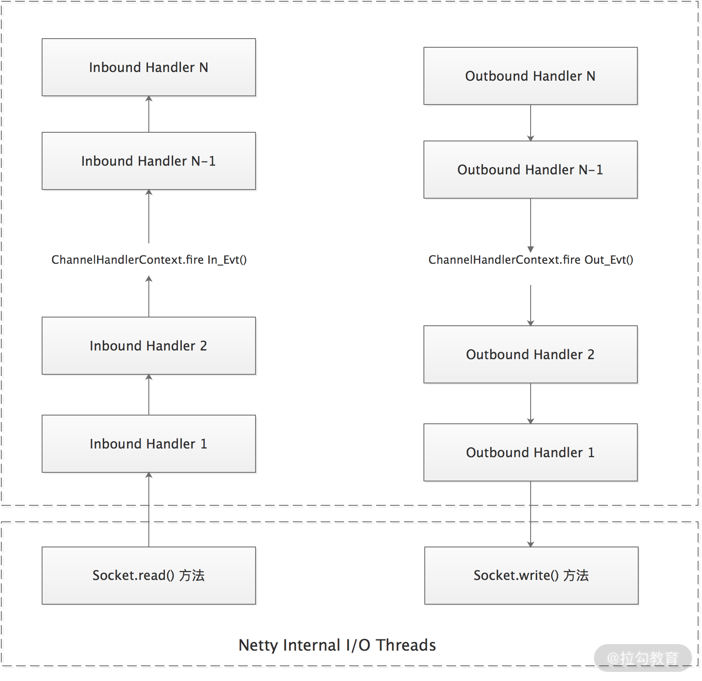

从图中我们还可以看到，I/O 事件不会在 ChannelPipeline 中自动传播，而是需要调用ChannelHandlerContext 中定义的相应方法进行传播，例如：fireChannelRead() 方法和 write() 方法等。

这里我们举一个简单的例子，如下所示，在该 ChannelPipeline 上，我们添加了 5 个 ChannelHandler 对象：

```
ChannelPipeline p = socketChannel.pipeline(); 
p.addLast("1", new InboundHandlerA()); 
p.addLast("2", new InboundHandlerB());
p.addLast("3", new OutboundHandlerA());
p.addLast("4", new OutboundHandlerB());
p.addLast("5", new InboundOutboundHandlerX());
```

- 对于入站（Inbound）事件，处理序列为：1 → 2 → 5；
- 对于出站（Outbound）事件，处理序列为：5 → 4 → 3。

**可见，入站（Inbound）与出站（Outbound）事件处理顺序正好相反。 **** 入站（Inbound）事件一般由 I/O 线程触发**。举个例子，我们自定义了一种消息协议，一条完整的消息是由消息头和消息体两部分组成，其中消息头会含有消息类型、控制位、数据长度等元数据，消息体则包含了真正传输的数据。在面对一块较大的数据时，客户端一般会将数据切分成多条消息发送，服务端接收到数据后，一般会先进行解码和缓存，待收集到长度足够的字节数据，组装成有固定含义的消息之后，才会传递给下一个 ChannelInboudHandler 进行后续处理。

在 Netty 中就提供了很多 Encoder 的实现用来解码读取到的数据，Encoder 会处理多次 channelRead() 事件，等拿到有意义的数据之后，才会触发一次下一个 ChannelInboundHandler 的 channelRead() 方法。**出站（Outbound）事件与入站（Inbound）事件相反，一般是由用户触发的。**ChannelHandler 接口中并没有定义方法来处理事件，而是由其子类进行处理的，如下图所示，ChannelInboundHandler 拦截并处理入站事件，ChannelOutboundHandler 拦截并处理出站事件。

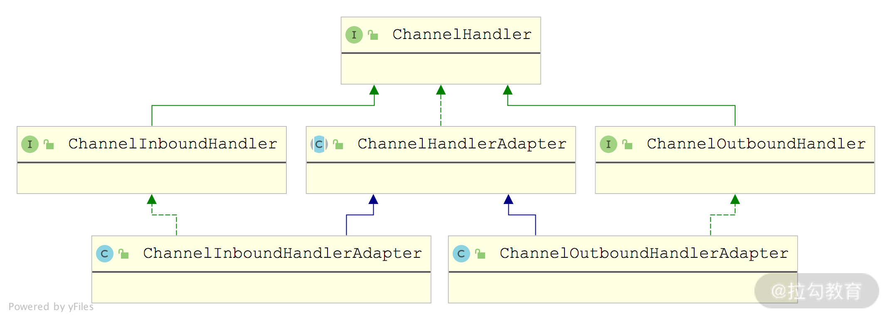

Netty 提供的 ChannelInboundHandlerAdapter 和 ChannelOutboundHandlerAdapter 主要是帮助完成事件流转功能的，即自动调用传递事件的相应方法。这样，我们在自定义 ChannelHandler 实现类的时候，就可以直接继承相应的 Adapter 类，并覆盖需要的事件处理方法，其他不关心的事件方法直接使用默认实现即可，从而提高开发效率。

ChannelHandler 中的很多方法都需要一个 ChannelHandlerContext 类型的参数，ChannelHandlerContext 抽象的是 ChannleHandler 之间的关系以及 ChannelHandler 与ChannelPipeline 之间的关系。**ChannelPipeline 中的事件传播主要依赖于ChannelHandlerContext 实现**，在 ChannelHandlerContext 中维护了 ChannelHandler 之间的关系，所以我们可以从 ChannelHandlerContext 中得到当前 ChannelHandler 的后继节点，从而将事件传播到后续的 ChannelHandler。

ChannelHandlerContext 继承了 AttributeMap，所以提供了 attr() 方法设置和删除一些状态属性信息，我们可将业务逻辑中所需使用的状态属性值存入到 ChannelHandlerContext 中，然后这些属性就可以随它传播了。Channel 中也维护了一个 AttributeMap，与 ChannelHandlerContext 中的 AttributeMap，从 Netty 4.1 开始，都是作用于整个 ChannelPipeline。

通过上述分析，我们可以了解到，**一个 Channel 对应一个 ChannelPipeline，一个 ChannelHandlerContext 对应一个ChannelHandler。** 如下图所示：


最后，需要注意的是，如果要在 ChannelHandler 中执行耗时较长的逻辑，例如，操作 DB 、进行网络或磁盘 I/O 等操作，一般会在注册到 ChannelPipeline 的同时，指定一个线程池异步执行 ChannelHandler 中的操作。

### NioEventLoop

在前文介绍 Netty 线程模型的时候，我们简单提到了 NioEventLoop 这个组件，当时为了便于理解，只是简单将其描述成了一个线程。

一个 EventLoop 对象由一个永远都不会改变的线程驱动，同时一个 NioEventLoop 包含了一个 Selector 对象，可以支持多个 Channel 注册在其上，该 NioEventLoop 可以同时服务多个 Channel，每个 Channel 只能与一个 NioEventLoop 绑定，这样就实现了线程与 Channel 之间的关联。

我们知道，Channel 中的 I/O 操作是由 ChannelPipeline 中注册的 ChannelHandler 进行处理的，而 ChannelHandler 的逻辑都是由相应 NioEventLoop 关联的那个线程执行的。

除了与一个线程绑定之外，NioEvenLoop 中还维护了两个任务队列：

- **普通任务队列**。用户产生的普通任务可以提交到该队列中暂存，NioEventLoop 发现该队列中的任务后会立即执行。这是一个多生产者、单消费者的队列，Netty 使用该队列将外部用户线程产生的任务收集到一起，并在 Reactor 线程内部用单线程的方式串行执行队列中的任务。例如，外部非 I/O 线程调用了 Channel 的 write() 方法，Netty 会将其封装成一个任务放入 TaskQueue 队列中，这样，所有的 I/O 操作都会在 I/O 线程中串行执行。

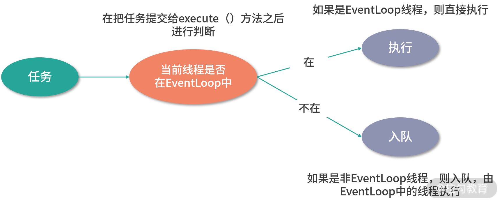

- **定时任务队列**。当用户在非 I/O 线程产生定时操作时，Netty 将用户的定时操作封装成定时任务，并将其放入该定时任务队列中等待相应 NioEventLoop 串行执行。

到这里我们可以看出，**NioEventLoop 主要做三件事：监听 I/O 事件、执行普通任务以及执行定时任务**。NioEventLoop 到底分配多少时间在不同类型的任务上，是可以配置的。另外，为了防止 NioEventLoop 长时间阻塞在一个任务上，一般会将耗时的操作提交到其他业务线程池处理。

### NioEventLoopGroup**NioEventLoopGroup 表示的是一组 NioEventLoop**。Netty 为了能更充分地利用多核 CPU 资源，一般会有多个 NioEventLoop 同时工作，至于多少线程可由用户决定，Netty 会根据实际上的处理器核数计算一个默认值，具体计算公式是：CPU 的核心数 * 2，当然我们也可以根据实际情况手动调整

当一个 Channel 创建之后，Netty 会调用 NioEventLoopGroup 提供的 next() 方法，按照一定规则获取其中一个 NioEventLoop 实例，并将 Channel 注册到该 NioEventLoop 实例，之后，就由该 NioEventLoop 来处理 Channel 上的事件。EventLoopGroup、EventLoop 以及 Channel 三者的关联关系，如下图所示：

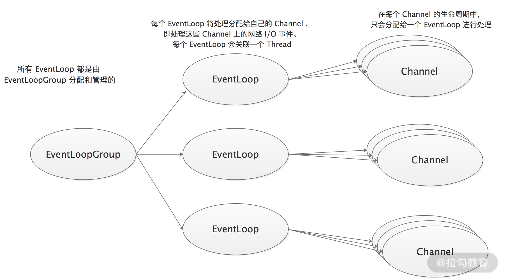

前面我们提到过，在 Netty 服务器端中，会有 BossEventLoopGroup 和 WorkerEventLoopGroup 两个 NioEventLoopGroup。通常一个服务端口只需要一个ServerSocketChannel，对应一个 Selector 和一个 NioEventLoop 线程。

BossEventLoop 负责接收客户端的连接事件，即 OP_ACCEPT 事件，然后将创建的 NioSocketChannel 交给 WorkerEventLoopGroup； WorkerEventLoopGroup 会由 next() 方法选择其中一个 NioEventLoopGroup，并将这个 NioSocketChannel 注册到其维护的 Selector 并对其后续的I/O事件进行处理。

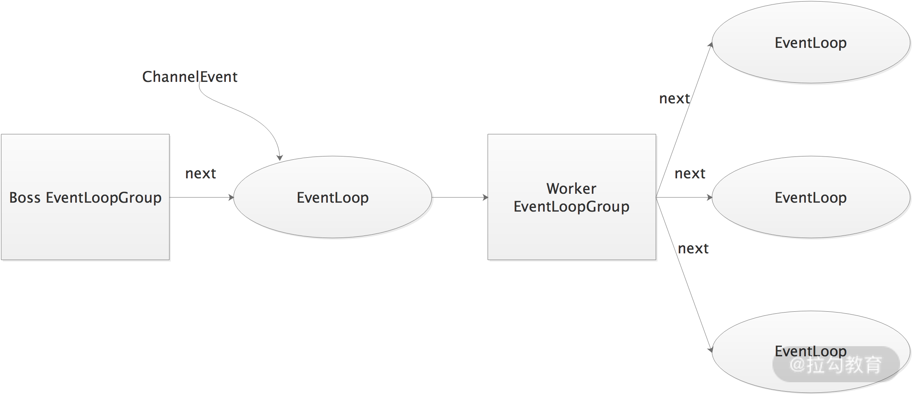

如上图，BossEventLoopGroup 通常是一个单线程的 EventLoop，EventLoop 维护着一个 Selector 对象，其上注册了一个 ServerSocketChannel，BoosEventLoop 会不断轮询 Selector 监听连接事件，在发生连接事件时，通过 accept 操作与客户端创建连接，创建 SocketChannel 对象。然后将 accept 操作得到的 SocketChannel 交给 WorkerEventLoopGroup，在Reactor 模式中 WorkerEventLoopGroup 中会维护多个 EventLoop，而每个 EventLoop 都会监听分配给它的 SocketChannel 上发生的 I/O 事件，并将这些具体的事件分发给业务线程池处理。

### ByteBuf

通过前文的介绍，我们了解了 Netty 中数据的流向，这里我们再来介绍一下 **数据的容器——ByteBuf** 。

在进行跨进程远程交互的时候，我们需要以字节的形式发送和接收数据，发送端和接收端都需要一个高效的数据容器来缓存字节数据，ByteBuf 就扮演了这样一个数据容器的角色。

ByteBuf 类似于一个字节数组，其中维护了一个读索引和一个写索引，分别用来控制对 ByteBuf 中数据的读写操作，两者符合下面的不等式：

```
0 <= readerIndex <= writerIndex <= capacity
```


ByteBuf 提供的读写操作 API 主要操作底层的字节容器（byte\[\]、ByteBuffer 等）以及读写索引这两指针，你若感兴趣的话，可以查阅相关的 API 说明，这里不再展开介绍。

Netty 中主要分为以下三大类 ByteBuf：

- **Heap Buffer（堆缓冲区）**。这是最常用的一种 ByteBuf，它将数据存储在 JVM 的堆空间，其底层实现是在 JVM 堆内分配一个数组，实现数据的存储。堆缓冲区可以快速分配，当不使用时也可以由 GC 轻松释放。它还提供了直接访问底层数组的方法，通过 ByteBuf.array() 来获取底层存储数据的 byte\[\] 。
- **Direct Buffer（直接缓冲区）**。直接缓冲区会使用堆外内存存储数据，不会占用 JVM 堆的空间，使用时应该考虑应用程序要使用的最大内存容量以及如何及时释放。直接缓冲区在使用 Socket 传递数据时性能很好，当然，它也是有缺点的，因为没有了 JVM GC 的管理，在分配内存空间和释放内存时，比堆缓冲区更复杂，Netty 主要使用内存池来解决这样的问题，这也是 Netty 使用内存池的原因之一。
- **Composite Buffer（复合缓冲区）**。我们可以创建多个不同的 ByteBuf，然后提供一个这些 ByteBuf 组合的视图，也就是 CompositeByteBuf。它就像一个列表，可以动态添加和删除其中的 ByteBuf。

### 内存管理

Netty 使用 ByteBuf 对象作为数据容器，进行 I/O 读写操作，其实 Netty 的内存管理也是围绕着ByteBuf 对象高效地分配和释放。从内存管理角度来看，ByteBuf 可分为 Unpooled 和 Pooled 两类。

- **Unpooled，是指非池化的内存管理方式**。每次分配时直接调用系统 API 向操作系统申请 ByteBuf，在使用完成之后，通过系统调用进行释放。Unpooled 将内存管理完全交给系统，不做任何特殊处理，使用起来比较方便，对于申请和释放操作不频繁、操作成本比较低的 ByteBuf 来说，是比较好的选择。
- **Pooled，是指池化的内存管理方式**。该方式会预先申请一块大内存形成内存池，在需要申请 ByteBuf 空间的时候，会将内存池中一部分合理的空间封装成 ByteBuf 给服务使用，使用完成后回收到内存池中。前面提到 DirectByteBuf 底层使用的堆外内存管理比较复杂，池化技术很好地解决了这一问题。

下面我们从如何高效分配和释放内存、如何减少内存碎片以及在多线程环境下如何减少锁竞争这三个方面介绍一下 Netty 提供的 ByteBuf 池化技术。

Netty 首先会向系统申请一整块连续内存，称为 Chunk（默认大小为 16 MB），这一块连续的内存通过 PoolChunk 对象进行封装。之后，Netty 将 Chunk 空间进一步拆分为 Page，每个 Chunk 默认包含 2048 个 Page，每个 Page 的大小为 8 KB。

在同一个 Chunk 中，Netty 将 Page 按照不同粒度进行分层管理。如下图所示，从下数第 1 层中每个分组的大小为 1 *PageSize，一共有 2048 个分组；第 2 层中每个分组大小为 2* PageSize，一共有 1024 个组；第 3 层中每个分组大小为 4 * PageSize，一共有 512 个组；依次类推，直至最顶层。


#### 1. 内存分配&释放

当服务向内存池请求内存时，Netty 会将请求分配的内存数向上取整到最接近的分组大小，然后在该分组的相应层级中从左至右寻找空闲分组。例如，服务请求分配 3 *PageSize 的内存，向上取整得到的分组大小为 4* PageSize，在该层分组中找到完全空闲的一组内存进行分配即可，如下图：

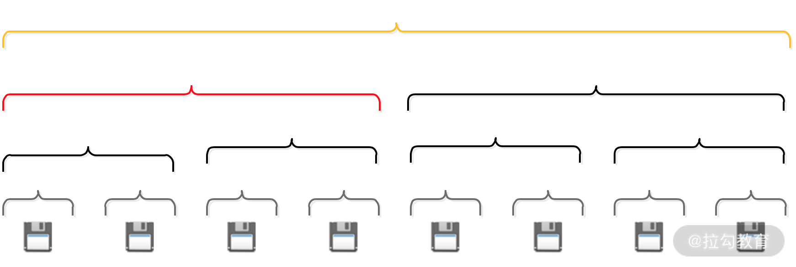

当分组大小 4 * PageSize 的内存分配出去后，为了方便下次内存分配，分组被标记为全部已使用（图中红色标记），向上更粗粒度的内存分组被标记为部分已使用（图中黄色标记）。

Netty 使用 **完全平衡树的结构** 实现了上述算法，这个完全平衡树底层是基于一个 byte 数组构建的，如下图所示：

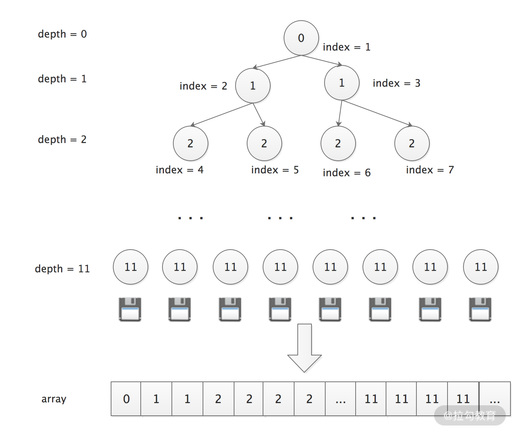

具体的实现逻辑这里就不再展开讲述了，你若感兴趣的话，可以参考 Netty 代码。

#### 2. 大对象&小对象的处理

当申请分配的对象是超过 Chunk 容量的大型对象，Netty 就不再使用池化管理方式了，在每次请求分配内存时单独创建特殊的非池化 PoolChunk 对象进行管理，当对象内存释放时整个PoolChunk 内存释放。

如果需要一定数量空间远小于 PageSize 的 ByteBuf 对象，例如，创建 256 Byte 的 ByteBuf，按照上述算法，就需要为每个小 ByteBuf 对象分配一个 Page，这就出现了很多内存碎片。Netty 通过再将 Page 细分的方式，解决这个问题。Netty 将请求的空间大小向上取最近的 16 的倍数（或 2 的幂），规整后小于 PageSize 的小 Buffer 可分为两类。

- 微型对象：规整后的大小为 16 的整倍数，如 16、32、48、……、496，一共 31 种大小。
- 小型对象：规整后的大小为 2 的幂，如 512、1024、2048、4096，一共 4 种大小。

Netty 的实现会先从 PoolChunk 中申请空闲 Page，同一个 Page 分为相同大小的小 Buffer 进行存储；这些 Page 用 PoolSubpage 对象进行封装，PoolSubpage 内部会记录它自己能分配的小 Buffer 的规格大小、可用内存数量，并通过 bitmap 的方式记录各个小内存的使用情况（如下图所示）。虽然这种方案不能完美消灭内存碎片，但是很大程度上还是减少了内存浪费。

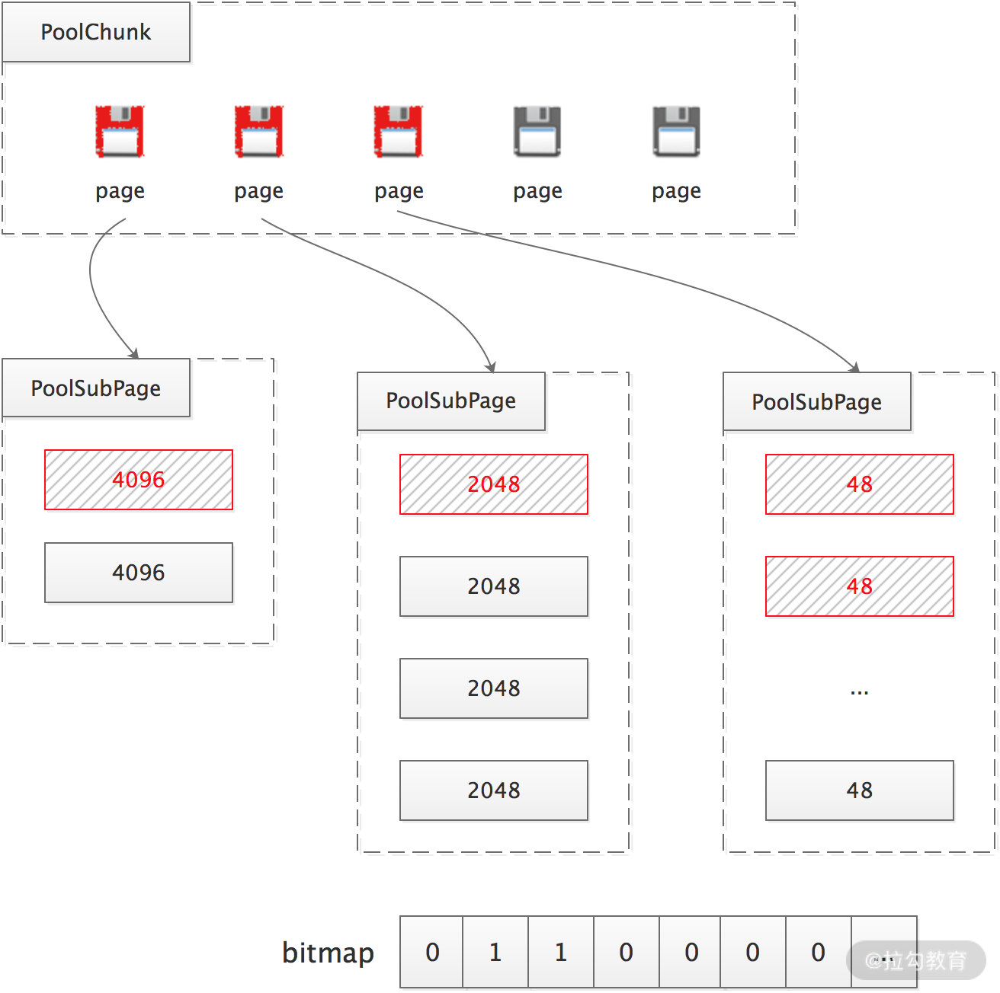

为了解决单个 PoolChunk 容量有限的问题，Netty 将多个 PoolChunk 组成链表一起管理，然后用 PoolChunkList 对象持有链表的 head。

**Netty 通过 PoolArena 管理 PoolChunkList 以及 PoolSubpage**。

PoolArena 内部持有 6 个 PoolChunkList，各个 PoolChunkList 持有的 PoolChunk 的使用率区间有所不同，如下图所示：

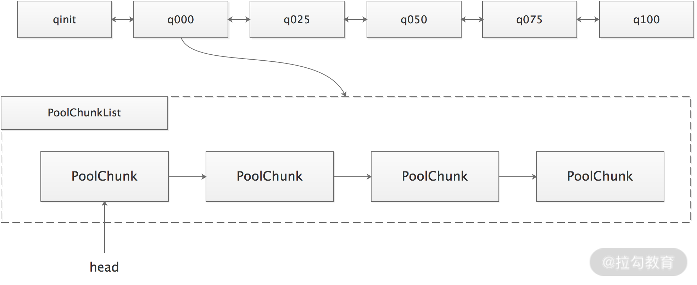

6 个 PoolChunkList 对象组成双向链表，当 PoolChunk 内存分配、释放，导致使用率变化，需要判断 PoolChunk 是否超过所在 PoolChunkList 的限定使用率范围，如果超出了，需要沿着 6 个 PoolChunkList 的双向链表找到新的合适的 PoolChunkList ，成为新的 head。同样，当新建 PoolChunk 分配内存或释放空间时，PoolChunk 也需要按照上面逻辑放入合适的PoolChunkList 中。

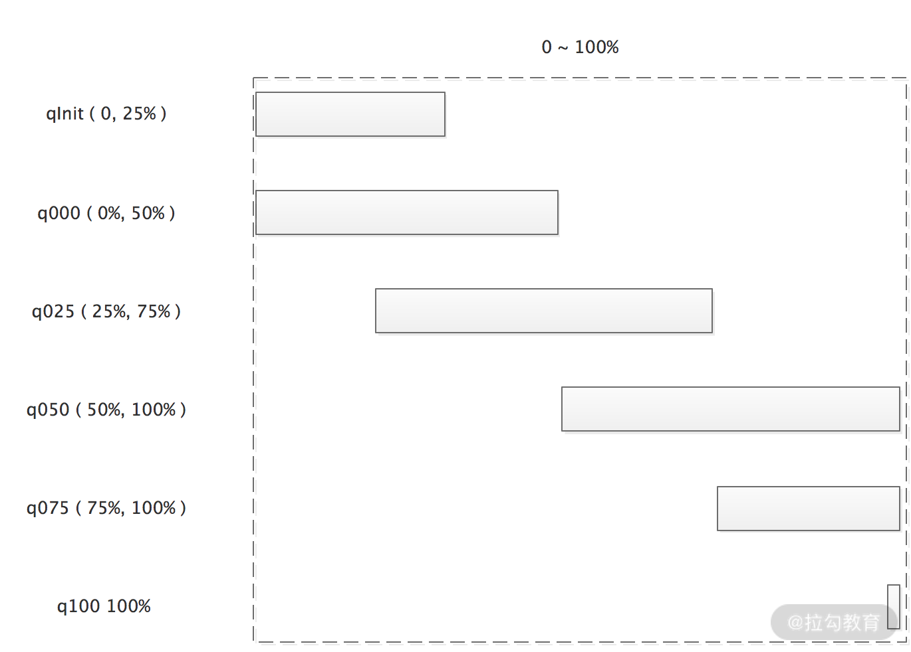

从上图可以看出，这 6 个 PoolChunkList 额定使用率区间存在交叉，这样设计的原因是：如果使用单个临界值的话，当一个 PoolChunk 被来回申请和释放，内存使用率会在临界值上下徘徊，这就会导致它在两个 PoolChunkList 链表中来回移动。

PoolArena 内部持有 2 个 PoolSubpage 数组，分别存储微型 Buffer 和小型 Buffer 的PoolSubpage。相同大小的 PoolSubpage 组成链表，不同大小的 PoolSubpage 链表的 head 节点保存在 tinySubpagePools 或者 smallSubpagePools 数组中，如下图：

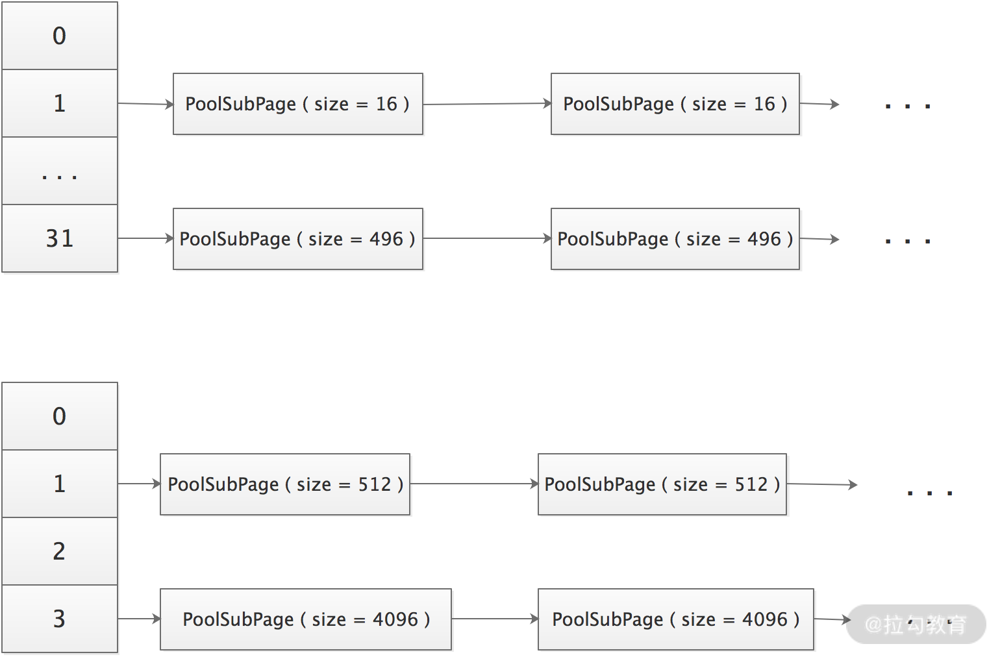

#### 3. 并发处理

内存分配释放不可避免地会遇到多线程并发场景，PoolChunk 的完全平衡树标记以及 PoolSubpage 的 bitmap 标记都是多线程不安全的，都是需要加锁同步的。为了减少线程间的竞争，Netty 会提前创建多个 PoolArena（默认数量为 2 * CPU 核心数），当线程首次请求池化内存分配，会找被最少线程持有的 PoolArena，并保存线程局部变量 PoolThreadCache 中，实现线程与 PoolArena 的关联绑定。

Netty 还提供了延迟释放的功能，来提升并发性能。当内存释放时，PoolArena 并没有马上释放，而是先尝试将该内存关联的 PoolChunk 和 Chunk 中的偏移位置等信息存入 ThreadLocal 的固定大小缓存队列中，如果该缓存队列满了，则马上释放内存。当有新的分配请求时，PoolArena 会优先访问线程本地的缓存队列，查询是否有缓存可用，如果有，则直接分配，提高分配效率。

### 总结

在本课时，我们主要介绍了 Netty 核心组件的功能和原理：

- 首先介绍了 Channel、ChannelFuture、Selector 等组件，它们是构成 I/O 多路复用的核心。
- 之后介绍了 EventLoop、EventLoopGroup 等组件，它们与 Netty 使用的主从 Reactor 线程模型息息相关。
- 最后深入介绍了 Netty 的内存管理，主要从内存分配管理、内存碎片优化以及并发分配内存等角度进行了介绍。

那你还知道哪些优秀的网络库或网络层设计呢？欢迎你留言讨论。
