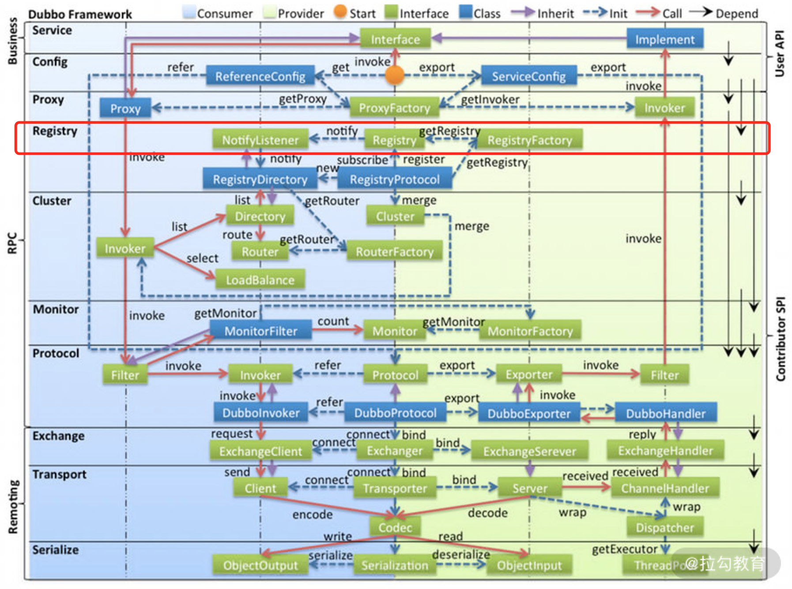
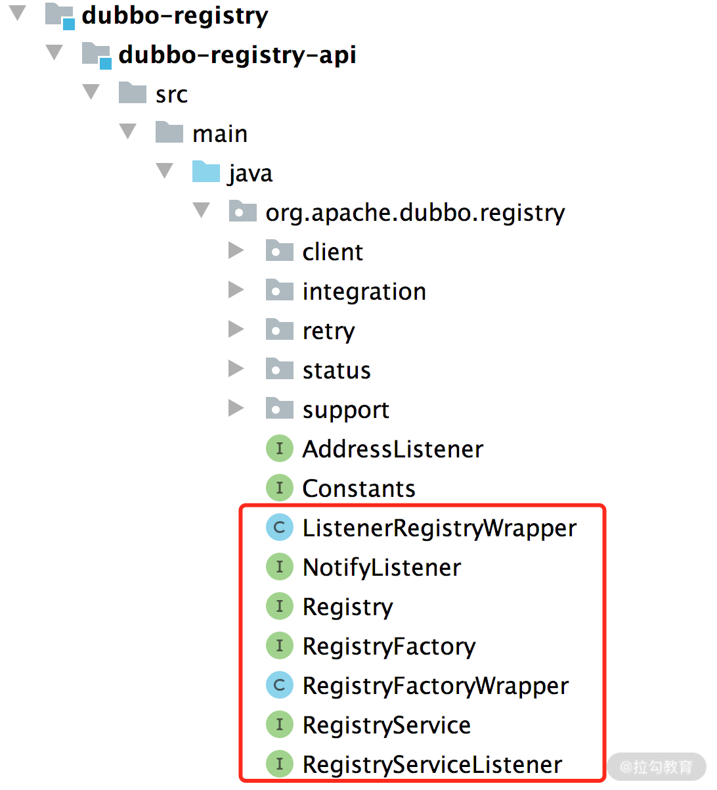
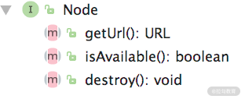
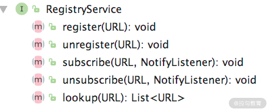
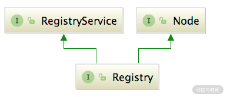

# 13 本地缓存：降低 ZooKeeper 压力的一个常用手段

从这一课时开始，我们就进入了第二部分：注册中心。注册中心（Registry）在微服务架构中的作用举足轻重，有了它，**服务提供者（Provider） **和** 消费者（Consumer）** 就能感知彼此。从下面的 Dubbo 架构图中可知：


Dubbo 架构图

- Provider 从容器启动后的初始化阶段便会向注册中心完成注册操作；
- Consumer 启动初始化阶段会完成对所需 Prov·ider 的订阅操作；
- 另外，在 Provider 发生变化时，需要通知监听的 Consumer。

Registry 只是 Consumer 和 Provider 感知彼此状态变化的一种便捷途径而已，它们彼此的实际通讯交互过程是直接进行的，对于 Registry 来说是透明无感的。Provider 状态发生变化了，会由 Registry 主动推送订阅了该 Provider 的所有 Consumer，这保证了 Consumer 感知 Provider 状态变化的及时性，也将和具体业务需求逻辑交互解耦，提升了系统的稳定性。

Dubbo 中存在很多概念，但有些理解起来就特别费劲，如本文的 Registry，翻译过来的意思是“注册中心”，但它其实是应用本地的注册中心客户端， **真正的“注册中心”服务是其他独立部署的进程，或进程组成的集群，比如 ZooKeeper 集群** 。本地的 Registry 通过和 ZooKeeper 等进行实时的信息同步，维持这些内容的一致性，从而实现了注册中心这个特性。另外，就 Registry 而言，Consumer 和 Provider 只是个用户视角的概念，它们被抽象为了一条 URL 。

从本课时开始，我们就真正开始分析 Dubbo 源码了。首先看一下本课程第二部分内容在 Dubbo 架构中所处的位置（如下图红框所示），可以看到这部分内容在整个 Dubbo 体系中还是相对独立的，没有涉及 Protocol、Invoker 等 Dubbo 内部的概念。等介绍完这些概念之后，我们还会回看图中 Registry 红框之外的内容。



整个 Dubbo 体系图

### 核心接口

作为“注册中心”部分的第一课时，我们有必要介绍下 dubbo-registry-api 模块中的核心抽象接口，如下图所示：



在 Dubbo 中，一般使用 Node 这个接口来抽象节点的概念。 **Node** 不仅可以表示 Provider 和 Consumer 节点，还可以表示注册中心节点。Node 接口中定义了三个非常基础的方法（如下图所示）：



- getUrl() 方法返回表示当前节点的 URL；
- isAvailable() 检测当前节点是否可用；
- destroy() 方法负责销毁当前节点并释放底层资源。

**RegistryService 接口**抽象了注册服务的基本行为，如下图所示：



- register() 方法和 unregister() 方法分别表示 **注册** 和**取消注册**一个 URL。
- subscribe() 方法和 unsubscribe() 方法分别表示 **订阅** 和**取消订阅**一个 URL。订阅成功之后，当订阅的数据发生变化时，注册中心会主动通知第二个参数指定的 NotifyListener 对象，NotifyListener 接口中定义的 notify() 方法就是用来接收该通知的。
- lookup() 方法能够 **查询** 符合条件的注册数据，它与 subscribe() 方法有一定的区别，subscribe() 方法采用的是 push 模式，lookup() 方法采用的是 pull 模式。

**Registry 接口**继承了 RegistryService 接口和 Node 接口，如下图所示，它表示的就是一个拥有注册中心能力的节点，其中的 reExportRegister() 和 reExportUnregister() 方法都是委托给 RegistryService 中的相应方法。

**RegistryFactory 接口**是 Registry 的工厂接口，负责创建 Registry 对象，具体定义如下所示，其中 @SPI 注解指定了默认的扩展名为 dubbo，@Adaptive 注解表示会生成适配器类并根据 URL 参数中的 protocol 参数值选择相应的实现。

```
@SPI("dubbo")
public interface RegistryFactory {
    @Adaptive({"protocol"})
    Registry getRegistry(URL url);
}
```

通过下面两张继承关系图可以看出，每个 Registry 实现类都有对应的 RegistryFactory 工厂实现，每个 RegistryFactory 工厂实现只负责创建对应的 Registry 对象。


RegistryFactory 继承关系图


Registry 继承关系图

其中，RegistryFactoryWrapper 是 RegistryFactory 接口的 Wrapper 类，它在底层 RegistryFactory 创建的 Registry 对象外层封装了一个 ListenerRegistryWrapper ，ListenerRegistryWrapper 中维护了一个 RegistryServiceListener 集合，会将 register()、subscribe() 等事件通知到 RegistryServiceListener 监听器。

AbstractRegistryFactory 是一个实现了 RegistryFactory 接口的抽象类，提供了规范 URL 的操作以及缓存 Registry 对象的公共能力。其中，缓存 Registry 对象是使用 HashMap\<String, Registry> 集合实现的（REGISTRIES 静态字段）。在规范 URL 的实现逻辑中，AbstractRegistryFactory 会将 RegistryService 的类名设置为 URL path 和 interface 参数，同时删除 export 和 refer 参数。

### AbstractRegistry

AbstractRegistry 实现了 Registry 接口，虽然 AbstractRegistry 本身在内存中实现了注册数据的读写功能，也没有什么抽象方法，但它依然被标记成了抽象类，从前面的Registry 继承关系图中可以看出，**Registry 接口的所有实现类都继承了 AbstractRegistry**。

为了减轻注册中心组件的压力，AbstractRegistry 会把当前节点订阅的 URL 信息缓存到本地的 Properties 文件中，其核心字段如下：

- **registryUrl（URL类型）。** 该 URL 包含了创建该 Registry 对象的全部配置信息，是 AbstractRegistryFactory 修改后的产物。
- **properties（Properties 类型）、file（File 类型）。** 本地的 Properties 文件缓存，properties 是加载到内存的 Properties 对象，file 是磁盘上对应的文件，两者的数据是同步的。在 AbstractRegistry 初始化时，会根据 registryUrl 中的 file.cache 参数值决定是否开启文件缓存。如果开启文件缓存功能，就会立即将 file 文件中的 KV 缓存加载到 properties 字段中。当 properties 中的注册数据发生变化时，会写入本地的 file 文件进行同步。properties 是一个 KV 结构，其中 Key 是当前节点作为 Consumer 的一个 URL，Value 是对应的 Provider 列表，包含了所有 Category（例如，providers、routes、configurators 等） 下的 URL。properties 中有一个特殊的 Key 值为 registies，对应的 Value 是注册中心列表，其他记录的都是 Provider 列表。
- **syncSaveFile（boolean 类型）。** 是否同步保存文件的配置，对应的是 registryUrl 中的 save.file 参数。
- **registryCacheExecutor（ExecutorService 类型）。** 这是一个单线程的线程池，在一个 Provider 的注册数据发生变化的时候，会将该 Provider 的全量数据同步到 properties 字段和缓存文件中，如果 syncSaveFile 配置为 false，就由该线程池异步完成文件写入。
- **lastCacheChanged（AtomicLong 类型）。** 注册数据的版本号，每次写入 file 文件时，都是全覆盖写入，而不是修改文件，所以需要版本控制，防止旧数据覆盖新数据。
- **registered（Set 类型）。** 这个比较简单，它是注册的 URL 集合。
- **subscribed（ConcurrentMap\<URL, Set> 类型）。** 表示订阅 URL 的监听器集合，其中 Key 是被监听的 URL， Value 是相应的监听器集合。
- \*\*notified（ConcurrentMap\<URL, Map\<String, List>>类型）。\*\*该集合第一层 Key 是当前节点作为 Consumer 的一个 URL，表示的是该节点的某个 Consumer 角色（一个节点可以同时消费多个 Provider 节点）；Value 是一个 Map 集合，该 Map 集合的 Key 是 Provider URL 的分类（Category），例如 providers、routes、configurators 等，Value 就是相应分类下的 URL 集合。

介绍完 AbstractRegistry 的核心字段之后，我们接下来就再看看 AbstractRegistry 依赖这些字段都提供了哪些公共能力。

#### 1. 本地缓存

作为一个 RPC 框架，Dubbo 在微服务架构中解决了各个服务间协作的难题；作为 Provider 和 Consumer 的底层依赖，它会与服务一起打包部署。dubbo-registry 也仅仅是其中一个依赖包，负责完成与 ZooKeeper、etcd、Consul 等服务发现组件的交互。

当 Provider 端暴露的 URL 发生变化时，ZooKeeper 等服务发现组件会通知 Consumer 端的 Registry 组件，Registry 组件会调用 notify() 方法，被通知的 Consumer 能匹配到所有 Provider 的 URL 列表并写入 properties 集合中。

下面我们来看 notify() 方法的核心实现：

```
// 注意入参，第一个URL参数表示的是Consumer，第二个NotifyListener是第一个参数对应的监听器，第三个参数是Provider端暴露的URL的全量数据
protected void notify(URL url, NotifyListener listener,
    List<URL> urls) {
    ... // 省略一系列边界条件的检查
    Map<String, List<URL>> result = new HashMap<>();
    for (URL u : urls) {
        // 需要Consumer URL与Provider URL匹配，具体匹配规则后面详述
        if (UrlUtils.isMatch(url, u)) { 
            // 根据Provider URL中的category参数进行分类
            String category = u.getParameter("category", "providers");
            List<URL> categoryList = result.computeIfAbsent(category, 
                k -> new ArrayList<>());
            categoryList.add(u);
        }
    }
    if (result.size() == 0) {
        return;
    }
    Map<String, List<URL>> categoryNotified = 
      notified.computeIfAbsent(url, u -> new ConcurrentHashMap<>());
    for (Map.Entry<String, List<URL>> entry : result.entrySet()) {
        String category = entry.getKey();
        List<URL> categoryList = entry.getValue();
        categoryNotified.put(category, categoryList); // 更新notified
        listener.notify(categoryList); // 调用NotifyListener
        // 更新properties集合以及底层的文件缓存
        saveProperties(url);
    }
}
```

在 saveProperties() 方法中会取出 Consumer 订阅的各个分类的 URL 连接起来（中间以空格分隔），然后以 Consumer 的 ServiceKey 为键值写到 properties 中，同时 lastCacheChanged 版本号会自增。完成 properties 字段的更新之后，会根据 syncSaveFile 字段值来决定是在当前线程同步更新 file 文件，还是向 registryCacheExecutor 线程池提交任务，异步完成 file 文件的同步。本地缓存文件的具体路径是：

```
/.dubbo/dubbo-registry-[当前应用名]-[当前Registry所在的IP地址].cache
```

这里首先关注**第一个细节：UrlUtils.isMatch() 方法**。该方法会完成 Consumer URL 与 Provider URL 的匹配，依次匹配的部分如下所示：

- 匹配 Consumer 和 Provider 的接口（优先取 interface 参数，其次再取 path）。双方接口相同或者其中一方为“\*”，则匹配成功，执行下一步。
- 匹配 Consumer 和 Provider 的 category。
- 检测 Consumer URL 和 Provider URL 中的 enable 参数是否符合条件。
- 检测 Consumer 和 Provider 端的 group、version 以及 classifier 是否符合条件。

**第二个细节是：URL.getServiceKey() 方法**。该方法返回的 ServiceKey 是 properties 集合以及相应缓存文件中的 Key。ServiceKey 的格式如下：

````
[group]/{interface(或path)}[:version]
```** AbstractRegistry 的核心是本地文件缓存的功能。 **在 AbstractRegistry 的构造方法中，会调用 loadProperties() 方法将上面写入的本地缓存文件，加载到 properties 对象中。

在网络抖动等原因而导致订阅失败时，Consumer 端的 Registry 就可以调用 getCacheUrls() 方法获取本地缓存，从而得到最近注册的 Provider URL。可见，** AbstractRegistry 通过本地缓存提供了一种容错机制，保证了服务的可靠性 **。

#### 2\. 注册/订阅

AbstractRegistry 实现了 Registry 接口，它实现的 registry() 方法会将当前节点要注册的 URL 缓存到 registered 集合，而 unregistry() 方法会从 registered 集合删除指定的 URL，例如当前节点下线的时候。

subscribe() 方法会将当前节点作为 Consumer 的 URL 以及相关的 NotifyListener 记录到 subscribed 集合，unsubscribe() 方法会将当前节点的 URL 以及关联的 NotifyListener 从 subscribed 集合删除。

这四个方法都是简单的集合操作，这里我们就不再展示具体代码了。

单看 AbstractRegistry 的实现，上述四个基础的注册、订阅方法都是内存操作，但是 Java 有继承和多态的特性，AbstractRegistry 的子类会覆盖上述四个基础的注册、订阅方法进行增强。


#### 3\. 恢复/销毁

AbstractRegistry 中还有另外两个需要关注的方法：** recover() 方法 **和** destroy() 方法**。

在 Provider 因为网络问题与注册中心断开连接之后，会进行重连，重新连接成功之后，会调用 recover() 方法将 registered 集合中的全部 URL 重新走一遍 register() 方法，恢复注册数据。同样，recover() 方法也会将 subscribed 集合中的 URL 重新走一遍 subscribe() 方法，恢复订阅监听器。recover() 方法的具体实现比较简单，这里就不再展示，你若感兴趣的话，可以参考源码进行学习。

在当前节点下线的时候，会调用 Node.destroy() 方法释放底层资源。AbstractRegistry 实现的 destroy() 方法会调用 unregister() 方法和 unsubscribe() 方法将当前节点注册的 URL 以及订阅的监听全部清理掉，其中不会清理非动态注册的 URL（即 dynamic 参数明确指定为 false）。AbstractRegistry 中 destroy() 方法的实现比较简单，这里我们也不再展示，如果你感兴趣话，同样可以参考源码进行学习。

### 总结

本课时是 Dubbo 注册中心分析的第一个课时，我们首先介绍了注册中心在整个 Dubbo 架构中的位置，以及 Registry、 RegistryService、 RegistryFactory 等核心接口的功能。接下来我们还详细讲解了 AbstractRegistry 这个抽象类提供的公共能力，主要是从本地缓存、注册/订阅、恢复/销毁这三方面进行了分析。
````
