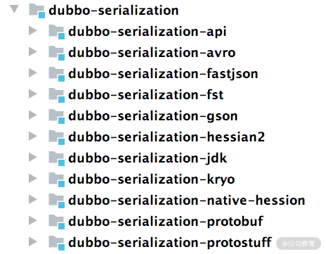
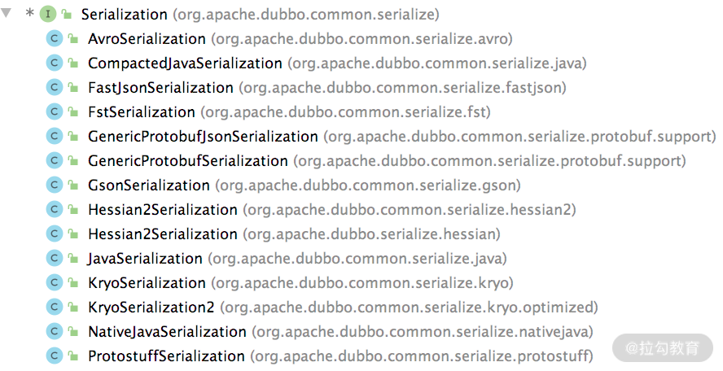
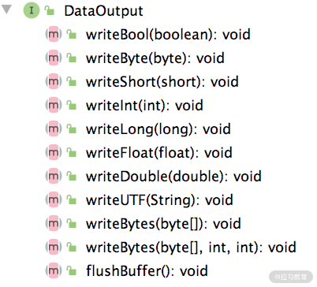

16 Dubbo Serialize 层：多种序列化算法，总有一款适合你
====================================

通过前面课时的介绍，我们知道一个 RPC 框架需要通过网络通信实现跨 JVM 的调用。既然需要网络通信，那就必然会使用到序列化与反序列化的相关技术，Dubbo 也不例外。下面我们从 Java 序列化的基础内容开始，介绍一下常见的序列化算法，最后再分析一下 Dubbo 是如何支持这些序列化算法的。

### Java 序列化基础

Java 中的序列化操作一般有如下四个步骤。

第一步，被序列化的对象需要实现 Serializable 接口，示例代码如下：

```
public class Student implements Serializable {
    private static final long serialVersionUID = 1L;
    private String name;
    private int age;
    private transient StudentUtil studentUtil;
}

```

在这个示例中我们可以看到 **transient 关键字** ，它的作用就是： **在对象序列化过程中忽略被其修饰的成员属性变量** 。一般情况下，它可以用来修饰一些非数据型的字段以及一些可以通过其他字段计算得到的值。通过合理地使用 transient 关键字，可以降低序列化后的数据量，提高网络传输效率。

第二步，生成一个序列号 serialVersionUID，这个序列号不是必需的，但还是建议你生成。serialVersionUID 的字面含义是序列化的版本号，只有序列化和反序列化的 serialVersionUID 都相同的情况下，才能够成功地反序列化。如果类中没有定义 serialVersionUID，那么 JDK 也会随机生成一个 serialVersionUID。如果在某些场景中，你希望不同版本的类序列化和反序列化相互兼容，那就需要定义相同的 serialVersionUID。

第三步，根据需求决定是否要重写 writeObject()/readObject() 方法，实现自定义序列化。

最后一步，调用 java.io.ObjectOutputStream 的 writeObject()/readObject() 进行序列化与反序列化。

既然 Java 本身的序列化操作如此简单，那为什么市面上还依旧出现了各种各样的序列化框架呢？因为这些 **第三方序列化框架的速度更快、序列化的效率更高，而且支持跨语言操作** 。

### 常见序列化算法

为了帮助你快速了解 Dubbo 支持的序列化算法，我们这里就对其中常见的序列化算法进行简单介绍。

**Apache Avro 是一种与编程语言无关的序列化格式 **。Avro 依赖于用户自定义的 Schema，在进行序列化数据的时候，无须多余的开销，就可以快速完成序列化，并且生成的序列化数据也较小。当进行反序列化的时候，需要获取到写入数据时用到的 Schema。在 Kafka、Hadoop 以及 Dubbo 中都可以使用 Avro 作为序列化方案。** FastJson 是阿里开源的 JSON 解析库，可以解析 JSON 格式的字符串 **。它支持将 Java 对象序列化为 JSON 字符串，反过来从 JSON 字符串也可以反序列化为 Java 对象。FastJson 是 Java 程序员常用到的类库之一，正如其名，“快”是其主要卖点。从官方的测试结果来看，FastJson 确实是最快的，比 Jackson 快 20% 左右，但是近几年 FastJson 的安全漏洞比较多，所以你在选择版本的时候，还是需要谨慎一些。** Fst（全称是 fast-serialization）是一款高性能 Java 对象序列化工具包 **，100% 兼容 JDK 原生环境，序列化速度大概是JDK 原生序列化的 4~10 倍，序列化后的数据大小是 JDK 原生序列化大小的 1/3 左右。目前，Fst 已经更新到 3.x 版本，支持 JDK 14。** Kryo 是一个高效的 Java 序列化/反序列化库 **，目前 Twitter、Yahoo、Apache 等都在使用该序列化技术，特别是 Spark、Hive 等大数据领域用得较多。Kryo 提供了一套快速、高效和易用的序列化 API。无论是数据库存储，还是网络传输，都可以使用 Kryo 完成 Java 对象的序列化。Kryo 还可以执行自动深拷贝和浅拷贝，支持环形引用。Kryo 的特点是 API 代码简单，序列化速度快，并且序列化之后得到的数据比较小。另外，Kryo 还提供了 NIO 的网络通信库——KryoNet，你若感兴趣的话可以自行查询和了解一下。** Hessian2 序列化是一种支持动态类型、跨语言的序列化协议 **，Java 对象序列化的二进制流可以被其他语言使用。Hessian2 序列化之后的数据可以进行自描述，不会像 Avro 那样依赖外部的 Schema 描述文件或者接口定义。Hessian2 可以用一个字节表示常用的基础类型，这极大缩短了序列化之后的二进制流。需要注意的是，在 Dubbo 中使用的 Hessian2 序列化并不是原生的 Hessian2 序列化，而是阿里修改过的 Hessian Lite，它是 Dubbo 默认使用的序列化方式。其序列化之后的二进制流大小大约是 Java 序列化的 50%，序列化耗时大约是 Java 序列化的 30%，反序列化耗时大约是 Java 序列化的 20%。** Protobuf（Google Protocol Buffers）是 Google 公司开发的一套灵活、高效、自动化的、用于对结构化数据进行序列化的协议**。但相比于常用的 JSON 格式，Protobuf 有更高的转化效率，时间效率和空间效率都是 JSON 的 5 倍左右。Protobuf 可用于通信协议、数据存储等领域，它本身是语言无关、平台无关、可扩展的序列化结构数据格式。目前 Protobuf提供了 C++、Java、Python、Go 等多种语言的 API，gRPC 底层就是使用 Protobuf 实现的序列化。

### dubbo-serialization

Dubbo 为了支持多种序列化算法，单独抽象了一层 Serialize 层，在整个 Dubbo 架构中处于最底层，对应的模块是 dubbo-serialization 模块。 dubbo-serialization 模块的结构如下图所示：



dubbo-serialization-api 模块中定义了 Dubbo 序列化层的核心接口，其中最核心的是 Serialization 这个接口，它是一个扩展接口，被 @SPI 接口修饰，默认扩展实现是 Hessian2Serialization。Serialization 接口的具体实现如下：

```
@SPI("hessian2") // 被@SPI注解修饰，默认是使用hessian2序列化算法
public interface Serialization {
    // 每一种序列化算法都对应一个ContentType，该方法用于获取ContentType
    String getContentType();
    // 获取ContentType的ID值，是一个byte类型的值，唯一确定一个算法
    byte getContentTypeId();
    // 创建一个ObjectOutput对象，ObjectOutput负责实现序列化的功能，即将Java
    // 对象转化为字节序列
    @Adaptive
    ObjectOutput serialize(URL url, OutputStream output) throws IOException;
    // 创建一个ObjectInput对象，ObjectInput负责实现反序列化的功能，即将
    // 字节序列转换成Java对象
    @Adaptive
    ObjectInput deserialize(URL url, InputStream input) throws IOException;
}

```

Dubbo 提供了多个 Serialization 接口实现，用于接入各种各样的序列化算法，如下图所示：



这里我们**以默认的 hessian2 序列化方式为例**，介绍 Serialization 接口的实现以及其他相关实现。 Hessian2Serialization 实现如下所示：

```
public class Hessian2Serialization implements Serialization {
    public byte getContentTypeId() {
        return HESSIAN2_SERIALIZATION_ID; // hessian2的ContentType ID
    }
    public String getContentType() { // hessian2的ContentType
        return "x-application/hessian2";
    }
    public ObjectOutput serialize(URL url, OutputStream out) throws IOException { // 创建ObjectOutput对象
        return new Hessian2ObjectOutput(out);
    }
    public ObjectInput deserialize(URL url, InputStream is) throws IOException { // 创建ObjectInput对象
        return new Hessian2ObjectInput(is);
    }
}

```

Hessian2Serialization 中的 serialize() 方法创建的 ObjectOutput 接口实现为 Hessian2ObjectOutput，继承关系如下图所示：


在 DataOutput 接口中定义了序列化 Java 中各种数据类型的相应方法，如下图所示，其中有序列化 boolean、short、int、long 等基础类型的方法，也有序列化 String、byte\[\] 的方法。



ObjectOutput 接口继承了 DataOutput 接口，并在其基础之上，添加了序列化对象的功能，具体定义如下图所示，其中的 writeThrowable()、writeEvent() 和 writeAttachments() 方法都是调用 writeObject() 方法实现的。


Hessian2ObjectOutput 中会封装一个 Hessian2Output 对象，需要注意，这个对象是 ThreadLocal 的，与线程绑定。在 DataOutput 接口以及 ObjectOutput 接口中，序列化各类型数据的方法都会委托给 Hessian2Output 对象的相应方法完成，实现如下：

```
public class Hessian2ObjectOutput implements ObjectOutput {
    private static ThreadLocal<Hessian2Output> OUTPUT_TL = ThreadLocal.withInitial(() -> {
        // 初始化Hessian2Output对象
        Hessian2Output h2o = new Hessian2Output(null);        h2o.setSerializerFactory(Hessian2SerializerFactory.SERIALIZER_FACTORY);
        h2o.setCloseStreamOnClose(true);
        return h2o;
    });
    private final Hessian2Output mH2o;
    public Hessian2ObjectOutput(OutputStream os) {
        mH2o = OUTPUT_TL.get(); // 触发OUTPUT_TL的初始化
        mH2o.init(os);
    }
    public void writeObject(Object obj) throws IOException {
        mH2o.writeObject(obj);
    }
    ... // 省略序列化其他类型数据的方法
}

```

Hessian2Serialization 中的 deserialize() 方法创建的 ObjectInput 接口实现为 Hessian2ObjectInput，继承关系如下所示：


Hessian2ObjectInput 具体的实现与 Hessian2ObjectOutput 类似：在 DataInput 接口中实现了反序列化各种类型的方法，在 ObjectInput 接口中提供了反序列化 Java 对象的功能，在 Hessian2ObjectInput 中会将所有反序列化的实现委托为 Hessian2Input。

了解了 Dubbo Serialize 层的核心接口以及 Hessian2 序列化算法的接入方式之后，你就可以亲自动手，去阅读其他序列化算法对应模块的代码。

### 总结

在本课时，我们首先介绍了 Java 序列化的基础知识，帮助你快速了解序列化和反序列化的基本概念。然后，介绍了常见的序列化算法，例如，Arvo、Fastjson、Fst、Kryo、Hessian、Protobuf 等。最后，深入分析了 dubbo-serialization 模块对各个序列化算法的接入方式，其中重点说明了 Hessian2 序列化方式。

关于本课时，你若还有什么疑问或想法，欢迎你留言跟我分享。
