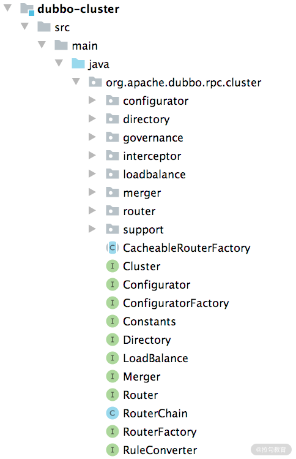
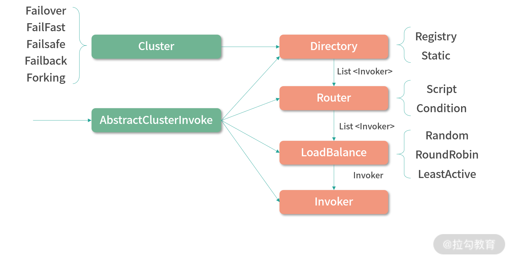
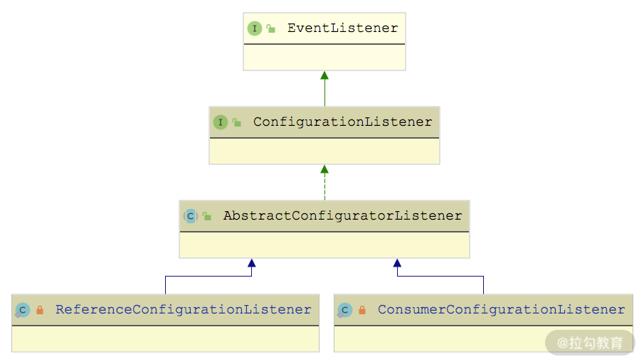

# 31 加餐：深潜 Directory 实现，探秘服务目录玄机

从这一课时我们就进入“集群”模块了，今天我们分享的是一篇加餐文章，主题是：深潜 Directory 实现，探秘服务目录玄机。

在生产环境中，为了保证服务的可靠性、吞吐量以及容错能力，我们通常会在多个服务器上运行相同的服务端程序，然后以 **集群** 的形式对外提供服务。根据各项性能指标的要求不同，各个服务端集群中服务实例的个数也不尽相同，从几个实例到几百个实例不等。

对于客户端程序来说，就会出现几个问题：

- 客户端程序是否要感知每个服务端地址？
- 客户端程序的一次请求，到底调用哪个服务端程序呢？
- 请求失败之后的处理是重试，还会是抛出异常？
- 如果是重试，是再次请求该服务实例，还是尝试请求其他服务实例？
- 服务端集群如何做到负载均衡，负载均衡的标准是什么呢？
- ……

为了解决上述问题， **Dubbo 独立出了一个实现集群功能的模块—— dubbo-cluster** 。



dubbo-cluster 结构图

作为 dubbo-cluster 模块分析的第一课时，我们就首先来了解一下 dubbo-cluster 模块的架构以及最核心的 Cluster 接口。

### Cluster 架构

dubbo-cluster 模块的主要功能是将多个 Provider 伪装成一个 Provider 供 Consumer 调用，其中涉及集群的容错处理、路由规则的处理以及负载均衡。下图展示了 dubbo-cluster 的核心组件：



Cluster 核心接口图

由图我们可以看出，dubbo-cluster 主要包括以下四个核心接口：

- **Cluster 接口**，是集群容错的接口，主要是在某些 Provider 节点发生故障时，让 Consumer 的调用请求能够发送到正常的 Provider 节点，从而保证整个系统的可用性。
- **Directory 接口**，表示多个 Invoker 的集合，是后续路由规则、负载均衡策略以及集群容错的基础。
- **Router 接口**，抽象的是路由器，请求经过 Router 的时候，会按照用户指定的规则匹配出符合条件的 Provider。
- **LoadBalance 接口**，是负载均衡接口，Consumer 会按照指定的负载均衡策略，从 Provider 集合中选出一个最合适的 Provider 节点来处理请求。

Cluster 层的核心流程是这样的：当调用进入 Cluster 的时候，Cluster 会创建一个 AbstractClusterInvoker 对象，在这个 AbstractClusterInvoker 中，首先会从 Directory 中获取当前 Invoker 集合；然后按照 Router 集合进行路由，得到符合条件的 Invoker 集合；接下来按照 LoadBalance 指定的负载均衡策略得到最终要调用的 Invoker 对象。

了解了 dubbo-cluster 模块的核心架构和基础组件之后，我们后续将会按照上面架构图的顺序介绍每个接口的定义以及相关实现。

### Directory 接口详解

Directory 接口表示的是一个集合，该集合由多个 Invoker 构成，后续的路由处理、负载均衡、集群容错等一系列操作都是在 Directory 基础上实现的。

下面我们深入分析一下 Directory 的相关内容，首先是 Directory 接口中定义的方法：

````
public interface Directory<T> extends Node {
    // 服务接口类型
    Class<T> getInterface();
    // list()方法会根据传入的Invocation请求，过滤自身维护的Invoker集合，返回符合条件的Invoker集合
    List<Invoker<T>> list(Invocation invocation) throws RpcException;
    // getAllInvokers()方法返回当前Directory对象维护的全部Invoker对象
    List<Invoker<T>> getAllInvokers();
    // Consumer端的URL
    URL getConsumerUrl();
}

```** AbstractDirectory 是 Directory 接口的抽象实现 **，其中除了维护 Consumer 端的 URL 信息，还维护了一个 RouterChain 对象，用于记录当前使用的 Router 对象集合，也就是后面课时要介绍的路由规则。

AbstractDirectory 对 list() 方法的实现也比较简单，就是直接委托给了 doList() 方法，doList() 是个抽象方法，由 AbstractDirectory 的子类具体实现。** Directory 接口有 RegistryDirectory 和 StaticDirectory 两个具体实现 **，如下图所示：


Directory 接口继承关系图

其中，** RegistryDirectory 实现 **中维护的 Invoker 集合会随着注册中心中维护的注册信息** 动态 **发生变化，这就依赖了 ZooKeeper 等注册中心的推送能力；** StaticDirectory 实现 **中维护的 Invoker 集合则是** 静态 **的，在 StaticDirectory 对象创建完成之后，不会再发生变化。

下面我们就来分别介绍 Directory 接口的这两个具体实现。

#### 1\. StaticDirectory

StaticDirectory 这个 Directory 实现比较简单，在构造方法中，StaticDirectory 会接收一个 Invoker 集合，并赋值到自身的 invokers 字段中，作为底层的 Invoker 集合。在 doList() 方法中，StaticDirectory 会使用 RouterChain 中的 Router 从 invokers 集合中过滤出符合路由规则的 Invoker 对象集合，具体实现如下：

````

protected List\<Invoker<T>> doList(Invocation invocation) throws RpcException {
List\<Invoker<T>> finalInvokers = invokers;
if (routerChain != null) { // 通过RouterChain过滤出符合条件的Invoker集合
finalInvokers = routerChain.route(getConsumerUrl(), invocation);
}
return finalInvokers == null ? Collections.emptyList() : finalInvokers;
}

```

在创建 StaticDirectory 对象的时候，如果没有传入 RouterChain 对象，则会根据 URL 构造一个包含内置 Router 的 RouterChain 对象：

```

public void buildRouterChain() {
RouterChain<T> routerChain = RouterChain.buildChain(getUrl()); // 创建内置Router集合
// 将invokers与RouterChain关联
routerChain.setInvokers(invokers);
this.setRouterChain(routerChain); // 设置routerChain字段
}

```

#### 2\. RegistryDirectory

RegistryDirectory 是一个动态的 Directory 实现，** 实现了 NotifyListener 接口**，当注册中心的服务配置发生变化时，RegistryDirectory 会收到变更通知，然后RegistryDirectory 会根据注册中心推送的通知，动态增删底层 Invoker 集合。

下面我们先来看一下 RegistryDirectory 中的核心字段。

*   cluster（Cluster 类型）：集群策略适配器，这里通过 Dubbo SPI 方式（即 ExtensionLoader.getAdaptiveExtension() 方法）动态创建适配器实例。
*   routerFactory（RouterFactory 类型）：路由工厂适配器，也是通过 Dubbo SPI 动态创建的适配器实例。routerFactory 字段和 cluster 字段都是静态字段，多个 RegistryDirectory 对象通用。
*   serviceKey（String 类型）：服务对应的 ServiceKey，默认是 {interface}:\[group\]:\[version\] 三部分构成。
*   serviceType（Class 类型）：服务接口类型，例如，org.apache.dubbo.demo.DemoService。
*   queryMap（Map<String, String> 类型）：Consumer URL 中 refer 参数解析后得到的全部 KV。
*   directoryUrl（URL 类型）：只保留 Consumer 属性的 URL，也就是由 queryMap 集合重新生成的 URL。
*   multiGroup（boolean类型）：是否引用多个服务组。
*   protocol（Protocol 类型）：使用的 Protocol 实现。
*   registry（Registry 类型）：使用的注册中心实现。
*   invokers（volatile List 类型）：动态更新的 Invoker 集合。
*   urlInvokerMap（volatile Map< String, Invoker> 类型）：Provider URL 与对应 Invoker 之间的映射，该集合会与 invokers 字段同时动态更新。
*   cachedInvokerUrls（volatile Set类型）：当前缓存的所有 Provider 的 URL，该集合会与 invokers 字段同时动态更新。
*   configurators（volatile List< Configurator>类型）：动态更新的配置信息，配置的具体内容在后面的分析中会介绍到。

在 RegistryDirectory 的构造方法中，会 **根据传入的注册中心 URL 初始化上述核心字段** ，具体实现如下：

```

public RegistryDirectory(Class<T> serviceType, URL url) {
// 传入的url参数是注册中心的URL，例如，zookeeper://127.0.0.1:2181/org.apache.dubbo.registry.RegistryService?...，其中refer参数包含了Consumer信息，例如，refer=application=dubbo-demo-api-consumer&dubbo=2.0.2&interface=org.apache.dubbo.demo.DemoService&pid=13423&register.ip=192.168.124.3&side=consumer(URLDecode之后的值)
super(url);
shouldRegister = !ANY_VALUE.equals(url.getServiceInterface()) && url.getParameter(REGISTER_KEY, true);
shouldSimplified = url.getParameter(SIMPLIFIED_KEY, false);
this.serviceType = serviceType;
this.serviceKey = url.getServiceKey();
// 解析refer参数值，得到其中Consumer的属性信息
this.queryMap = StringUtils.parseQueryString(url.getParameterAndDecoded(REFER_KEY));
// 将queryMap中的KV作为参数，重新构造URL，其中的protocol和path部分不变
this.overrideDirectoryUrl = this.directoryUrl = turnRegistryUrlToConsumerUrl(url);
String group = directoryUrl.getParameter(GROUP_KEY, "");
this.multiGroup = group != null && (ANY_VALUE.equals(group) || group.contains(","));
}

```

在完成初始化之后，我们来看 subscribe() 方法，该方法会在 Consumer 进行订阅的时候被调用，其中调用 Registry 的 subscribe() 完成订阅操作，同时还会将当前 RegistryDirectory 对象作为 NotifyListener 监听器添加到 Registry 中，具体实现如下：

```

public void subscribe(URL url) {
setConsumerUrl(url);
// 将当前RegistryDirectory对象作为ConfigurationListener记录到CONSUMER_CONFIGURATION_LISTENER中
CONSUMER_CONFIGURATION_LISTENER.addNotifyListener(this);
serviceConfigurationListener = new ReferenceConfigurationListener(this, url);
// 完成订阅操作，注册中心的相关操作在前文已经介绍过了，这里不再重复
registry.subscribe(url, this);
}

```

我们看到除了作为 NotifyListener 监听器之外，RegistryDirectory 内部还有两个 ConfigurationListener 的内部类（继承关系如下图所示），为了保持连贯，这两个监听器的具体原理我们在后面的课时中会详细介绍，这里先不展开讲述。



RegistryDirectory 内部的 ConfigurationListener 实现

通过前面对 Registry 的介绍我们知道，在注册 NotifyListener 的时候，监听的是 providers、configurators 和 routers 三个目录，所以在这三个目录下发生变化的时候，就会触发 RegistryDirectory 的 notify() 方法。

在 RegistryDirectory.notify() 方法中，首先会按照 category 对发生变化的 URL 进行分类，分成 configurators、routers、providers 三类，并分别对不同类型的 URL 进行处理：

*   将 configurators 类型的 URL 转化为 Configurator，保存到 configurators 字段中；
*   将 router 类型的 URL 转化为 Router，并通过 routerChain.addRouters() 方法添加 routerChain 中保存；
*   将 provider 类型的 URL 转化为 Invoker 对象，并记录到 invokers 集合和 urlInvokerMap 集合中。

notify() 方法的具体实现如下：

```

public synchronized void notify(List<URL> urls) {
// 按照category进行分类，分成configurators、routers、providers三类
Map\<String, List<URL>> categoryUrls = urls.stream()
.filter(Objects::nonNull)
.filter(this::isValidCategory)
.filter(this::isNotCompatibleFor26x)
.collect(Collectors.groupingBy(this::judgeCategory));
// 获取configurators类型的URL，并转换成Configurator对象
List<URL> configuratorURLs = categoryUrls.getOrDefault(CONFIGURATORS_CATEGORY, Collections.emptyList());
this.configurators = Configurator.toConfigurators(configuratorURLs).orElse(this.configurators);
// 获取routers类型的URL，并转成Router对象，添加到RouterChain中
List<URL> routerURLs = categoryUrls.getOrDefault(ROUTERS_CATEGORY, Collections.emptyList());
toRouters(routerURLs).ifPresent(this::addRouters);
// 获取providers类型的URL，调用refreshOverrideAndInvoker()方法进行处理
List<URL> providerURLs = categoryUrls.getOrDefault(PROVIDERS_CATEGORY, Collections.emptyList());
... // 在Dubbo3.0中会触发AddressListener监听器，但是现在AddressListener接口还没有实现，所以省略这段代码
refreshOverrideAndInvoker(providerURLs);
}

```

我们这里首先来专注 **providers 类型 URL 的处理** ，具体实现位置在 refreshInvoker() 方法中，具体实现如下：

```

private void refreshInvoker(List<URL> invokerUrls) {
// 如果invokerUrls集合不为空，长度为1，并且协议为empty，则表示该服务的所有Provider都下线了，会销毁当前所有Provider对应的Invoker。
if (invokerUrls.size() == 1 && invokerUrls.get(0) != null
&& EMPTY_PROTOCOL.equals(invokerUrls.get(0).getProtocol())) {
this.forbidden = true; // forbidden标记设置为true，后续请求将直接抛出异常
this.invokers = Collections.emptyList();
routerChain.setInvokers(this.invokers); // 清空RouterChain中的Invoker集合
destroyAllInvokers(); // 关闭所有Invoker对象
} else {
this.forbidden = false; // forbidden标记设置为false，RegistryDirectory可以正常处理后续请求
Map\<String, Invoker<T>> oldUrlInvokerMap = this.urlInvokerMap; // 保存本地引用
if (invokerUrls == Collections.<URL>emptyList()) {
invokerUrls = new ArrayList\<>();
}
if (invokerUrls.isEmpty() && this.cachedInvokerUrls != null) {
// 如果invokerUrls集合为空，并且cachedInvokerUrls不为空，则将使用cachedInvokerUrls缓存的数据，
// 也就是说注册中心中的providers目录未发生变化，invokerUrls则为空，表示cachedInvokerUrls集合中缓存的URL为最新的值
invokerUrls.addAll(this.cachedInvokerUrls);
} else {
// 如果invokerUrls集合不为空，则用invokerUrls集合更新cachedInvokerUrls集合
// 也就是说，providers发生变化，invokerUrls集合中会包含此时注册中心所有的服务提供者
this.cachedInvokerUrls = new HashSet\<>();
this.cachedInvokerUrls.addAll(invokerUrls);//Cached invoker urls, convenient for comparison
}
if (invokerUrls.isEmpty()) {
return; // 如果invokerUrls集合为空，即providers目录未发生变更，则无须处理，结束本次更新服务提供者Invoker操作。
}
// 将invokerUrls转换为对应的Invoker映射关系
Map\<String, Invoker<T>> newUrlInvokerMap = toInvokers(invokerUrls);
if (CollectionUtils.isEmptyMap(newUrlInvokerMap)) {
return;
}
// 更新invokers字段和urlInvokerMap集合
List\<Invoker<T>> newInvokers = Collections.unmodifiableList(new ArrayList\<>(newUrlInvokerMap.values()));
routerChain.setInvokers(newInvokers);
// 针对multiGroup的特殊处理，合并多个group的Invoker
this.invokers = multiGroup ? toMergeInvokerList(newInvokers) : newInvokers;
this.urlInvokerMap = newUrlInvokerMap;
// 比较新旧两组Invoker集合，销毁掉已经下线的Invoker
destroyUnusedInvokers(oldUrlInvokerMap, newUrlInvokerMap);
}
}

```

通过对 refreshInvoker() 方法的介绍，我们可以看出，其 **最核心的逻辑是 Provider URL 转换成 Invoker 对象，也就是 toInvokers() 方法** 。下面我们就来深入 toInvokers() 方法内部，看看其具体的转换逻辑：

```

private Map\<String, Invoker<T>> toInvokers(List<URL> urls) {
... // urls集合为空时，直接返回空Map
Set<String> keys = new HashSet\<>();
String queryProtocols = this.queryMap.get(PROTOCOL_KEY); // 获取Consumer端支持的协议，即protocol参数指定的协议
for (URL providerUrl : urls) {
if (queryProtocols != null && queryProtocols.length() > 0) {
boolean accept = false;
String\[\] acceptProtocols = queryProtocols.split(",");
for (String acceptProtocol : acceptProtocols) { // 遍历所有Consumer端支持的协议
if (providerUrl.getProtocol().equals(acceptProtocol)) {
accept = true;
break;
}
}
if (!accept) {
continue; // 如果当前URL不支持Consumer端的协议，也就无法执行后续转换成Invoker的逻辑
}
}
if (EMPTY_PROTOCOL.equals(providerUrl.getProtocol())) {
continue; // 跳过empty协议的URL
}
// 如果Consumer端不支持该URL的协议（这里通过SPI方式检测是否有对应的Protocol扩展实现），也会跳过该URL
if (!ExtensionLoader.getExtensionLoader(Protocol.class).hasExtension(providerUrl.getProtocol())) {
logger.error("...");
continue;
}
// 合并URL参数，这个合并过程，在本课时后面展开介绍
URL url = mergeUrl(providerUrl);
// 获取完整URL对应的字符串，也就是在urlInvokerMap集合中的key
String key = url.toFullString();
if (keys.contains(key)) { // 跳过重复的URL
continue;
}
keys.add(key); // 记录key
// 匹配urlInvokerMap缓存中的Invoker对象，如果命中缓存，直接将Invoker添加到newUrlInvokerMap这个新集合中即可；
// 如果未命中缓存，则创建新的Invoker对象，然后添加到newUrlInvokerMap这个新集合中
Map\<String, Invoker<T>> localUrlInvokerMap = this.urlInvokerMap;
Invoker<T> invoker = localUrlInvokerMap == null ? null : localUrlInvokerMap.get(key);
if (invoker == null) {
try {
boolean enabled = true;
if (url.hasParameter(DISABLED_KEY)) { // 检测URL中的disable和enable参数，决定是否能够创建Invoker对象
enabled = !url.getParameter(DISABLED_KEY, false);
} else {
enabled = url.getParameter(ENABLED_KEY, true);
}
if (enabled) { // 这里通过Protocol.refer()方法创建对应的Invoker对象
invoker = new InvokerDelegate\<>(protocol.refer(serviceType, url), url, providerUrl);
}
} catch (Throwable t) {
logger.error("Failed to refer invoker for interface:" + serviceType + ",url:(" + url + ")" + t.getMessage(), t);
}
if (invoker != null) { // 将key和Invoker对象之间的映射关系记录到newUrlInvokerMap中
newUrlInvokerMap.put(key, invoker);
}
} else {// 缓存命中，直接将urlInvokerMap中的Invoker转移到newUrlInvokerMap即可
newUrlInvokerMap.put(key, invoker);
}
}
keys.clear();
return newUrlInvokerMap;
}

```

**toInvokers() 方法的代码虽然有点长，但核心逻辑就是调用 Protocol.refer() 方法创建 Invoker 对象，其他的逻辑都是在判断是否调用该方法。 **在 toInvokers() 方法内部，我们可以看到** 调用了 mergeUrl() 方法对 URL 参数进行合并 **。在 mergeUrl() 方法中，会将注册中心中 configurators 目录下的 URL（override 协议），以及服务治理控制台动态添加的配置与 Provider URL 进行合并，即覆盖 Provider URL 原有的一些信息，具体实现如下：

```

private URL mergeUrl(URL providerUrl) {
// 首先，移除Provider URL中只在Provider端生效的属性，例如，threadname、threadpool、corethreads、threads、queues等参数。
// 然后，用Consumer端的配置覆盖Provider URL的相应配置，其中，version、group、methods、timestamp等参数以Provider端的配置优先
// 最后，合并Provider端和Consumer端配置的Filter以及Listener
providerUrl = ClusterUtils.mergeUrl(providerUrl, queryMap);
// 合并configurators类型的URL，configurators类型的URL又分为三类：
// 第一类是注册中心Configurators目录下新增的URL(override协议)
// 第二类是通过ConsumerConfigurationListener监听器(监听应用级别的配置)得到的动态配置
// 第三类是通过ReferenceConfigurationListener监听器(监听服务级别的配置)得到的动态配置
// 这里只需要先了解：除了注册中心的configurators目录下有配置信息之外，还有可以在服务治理控制台动态添加配置，
// ConsumerConfigurationListener、ReferenceConfigurationListener监听器就是用来监听服务治理控制台的动态配置的
// 至于服务治理控制台的具体使用，在后面详细介绍
providerUrl = overrideWithConfigurator(providerUrl);
// 增加check=false，即只有在调用时，才检查Provider是否可用
providerUrl = providerUrl.addParameter(Constants.CHECK_KEY, String.valueOf(false));
// 重新复制overrideDirectoryUrl，providerUrl在经过第一步参数合并后（包含override协议覆盖后的属性）赋值给overrideDirectoryUrl。
this.overrideDirectoryUrl = this.overrideDirectoryUrl.addParametersIfAbsent(providerUrl.getParameters());
... // 省略对Dubbo低版本的兼容处理逻辑
return providerUrl;
}

```

完成 URL 到 Invoker 对象的转换（toInvokers() 方法）之后，其实在 refreshInvoker() 方法的最后，还会** 根据 multiGroup 的配置决定是否调用 toMergeInvokerList() 方法将每个 group 中的 Invoker 合并成一个 Invoker **。下面我们一起来看 toMergeInvokerList() 方法的具体实现：

```

private List\<Invoker<T>> toMergeInvokerList(List\<Invoker<T>> invokers) {
List\<Invoker<T>> mergedInvokers = new ArrayList\<>();
Map\<String, List\<Invoker<T>>> groupMap = new HashMap\<>();
for (Invoker<T> invoker : invokers) { // 按照group将Invoker分组
String group = invoker.getUrl().getParameter(GROUP_KEY, "");
groupMap.computeIfAbsent(group, k -> new ArrayList\<>());
groupMap.get(group).add(invoker);
}
if (groupMap.size() == 1) { // 如果只有一个group，则直接使用该group分组对应的Invoker集合作为mergedInvokers
mergedInvokers.addAll(groupMap.values().iterator().next());
} else if (groupMap.size() > 1) { // 将每个group对应的Invoker集合合并成一个Invoker
for (List\<Invoker<T>> groupList : groupMap.values()) {
// 这里使用到StaticDirectory以及Cluster合并每个group中的Invoker
StaticDirectory<T> staticDirectory = new StaticDirectory\<>(groupList);
staticDirectory.buildRouterChain();
mergedInvokers.add(CLUSTER.join(staticDirectory));
}
} else {
mergedInvokers = invokers;
}
return mergedInvokers;
}

```

这里使用到了 Cluster 接口的相关功能，我们在后面课时还会继续深入分析 Cluster 接口及其实现，你现在可以将 Cluster 理解为一个黑盒，知道其 join() 方法会将多个 Invoker 对象转换成一个 Invoker 对象即可。

到此为止，RegistryDirectory 处理一次完整的动态 Provider 发现流程就介绍完了。

最后，我们再分析下** RegistryDirectory 中另外一个核心方法—— doList() 方法**，该方法是 AbstractDirectory 留给其子类实现的一个方法，也是通过 Directory 接口获取 Invoker 集合的核心所在，具体实现如下：

```

public List\<Invoker<T>> doList(Invocation invocation) {
if (forbidden) { // 检测forbidden字段，当该字段在refreshInvoker()过程中设置为true时，表示无Provider可用，直接抛出异常
throw new RpcException("...");
}
if (multiGroup) {
// multiGroup为true时的特殊处理，在refreshInvoker()方法中针对multiGroup为true的场景，已经使用Router进行了筛选，所以这里直接返回接口
return this.invokers == null ? Collections.emptyList() : this.invokers;
}
List\<Invoker<T>> invokers = null;
// 通过RouterChain.route()方法筛选Invoker集合，最终得到符合路由条件的Invoker集合
invokers = routerChain.route(getConsumerUrl(), invocation);
return invokers == null ? Collections.emptyList() : invokers;
}

```

### 总结

在本课时，我们首先介绍了 dubbo-cluster 模块的整体架构，简单说明了 Cluster、Directory、Router、LoadBalance 四个核心接口的功能。接下来我们就深入介绍了 Directory 接口的定义以及 StaticDirectory、RegistryDirectory 两个类的核心实现，其中 RegistryDirectory 涉及动态查找 Provider URL 以及处理动态配置的相关逻辑，显得略微复杂了一点，希望你能耐心学习和理解。关于这部分内容，你若有不懂或不理解的地方，也欢迎你留言和我交流。
```
