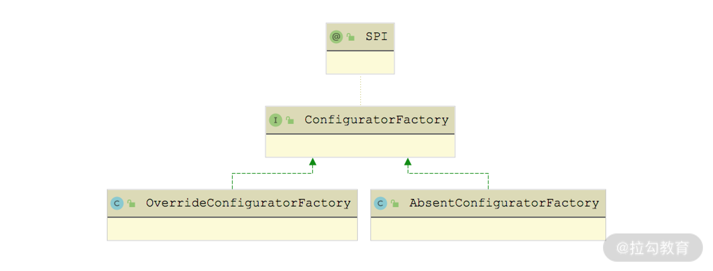
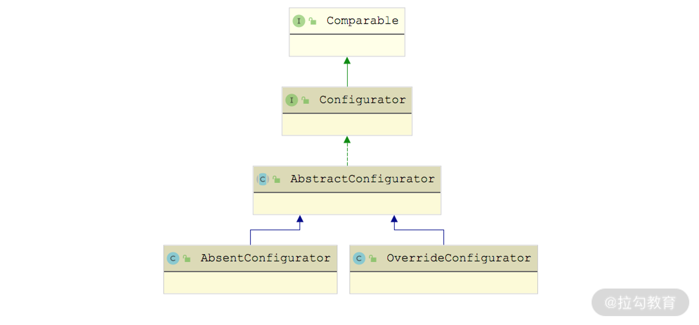

# 34 加餐：初探 Dubbo 动态配置的那些事儿

在前面第 31 课时中我们详细讲解了 RegistryDirectory 相关的内容，作为一个 NotifyListener 监听器，RegistryDirectory 会同时监听注册中心的 providers、routers 和 configurators 三个目录。通过 RegistryDirectory 处理 configurators 目录的逻辑，我们了解到 configurators 目录中动态添加的 URL 会覆盖 providers 目录下注册的 Provider URL，Dubbo 还会按照 configurators 目录下的最新配置，重新创建 Invoker 对象（同时会销毁原来的 Invoker 对象）。

在老版本的 Dubbo 中，我们可以通过服务治理控制台向注册中心的 configurators 目录写入动态配置的 URL。在 Dubbo 2.7.x 版本中，动态配置信息除了可以写入注册中心的 configurators 目录之外，还可以写入外部的配置中心，这部分内容我们将在后面的课时详细介绍，今天这一课时我们重点来看**写入注册中心的动态配置。**首先，我们需要了解一下 configurators 目录中 URL 都有哪些协议以及这些协议的含义，然后还要知道 Dubbo 是如何解析这些 URL 得到 Configurator 对象的，以及 Configurator 是如何与已有的 Provider URL 共同作用得到实现动态更新配置的效果。

### 基础协议

首先，我们需要了解**写入注册中心 configurators 中的动态配置有 override 和 absent 两种协议**。下面是一个 override 协议的示例：

```
override://0.0.0.0/org.apache.dubbo.demo.DemoService?category=configurators&dynamic=false&enabled=true&application=dubbo-demo-api-consumer&timeout=1000
```

那这个 URL 中各个部分的含义是怎样的呢？下面我们就一个一个来分析下。

- override，表示采用覆盖方式。Dubbo 支持 override 和 absent 两种协议，我们也可以通过 SPI 的方式进行扩展。
- 0.0.0.0，表示对所有 IP 生效。如果只想覆盖某个特定 IP 的 Provider 配置，可以使用该 Provider 的具体 IP。
- org.apache.dubbo.demo.DemoService，表示只对指定服务生效。
- category=configurators，表示该 URL 为动态配置类型。
- dynamic=false，表示该 URL 为持久数据，即使注册该 URL 的节点退出，该 URL 依旧会保存在注册中心。
- enabled=true，表示该 URL 的覆盖规则已生效。
- application=dubbo-demo-api-consumer，表示只对指定应用生效。如果不指定，则默认表示对所有应用都生效。
- timeout=1000，表示将满足以上条件 Provider URL 中的 timeout 参数值覆盖为 1000。如果想覆盖其他配置，可以直接以参数的形式添加到 override URL 之上。

在 Dubbo 的官网中，还提供了一些简单示例，我们这里也简单解读一下。

- 禁用某个 Provider，通常用于临时剔除某个 Provider 节点：

```
override://10.20.153.10/com.foo.BarService?category=configurators&dynamic=false&disabled=true
```

- 调整某个 Provider 的权重为 200：

```
override://10.20.153.10/com.foo.BarService?category=configurators&dynamic=false&weight=200
```

- 调整负载均衡策略为 LeastActiveLoadBalance（负载均衡的内容会在下一课时详细介绍）：

```
override://10.20.153.10/com.foo.BarService?category=configurators&dynamic=false&loadbalance=leastactive
```

- 服务降级，通常用于临时屏蔽某个出错的非关键服务（mock 机制的具体实现我们会在后面的课时详细介绍）：

```
override://0.0.0.0/com.foo.BarService?category=configurators&dynamic=false&application=foo&mock=force:return+null
```

### Configurator

当我们在注册中心的 configurators 目录中添加 override（或 absent）协议的 URL 时，Registry 会收到注册中心的通知，回调注册在其上的 NotifyListener，其中就包括 RegistryDirectory。我们在第 31 课时中已经详细分析了 RegistryDirectory.notify() 处理 providers、configurators 和 routers 目录变更的流程，其中 configurators 目录下 URL 会被解析成 Configurator 对象。

Configurator 接口抽象了一条配置信息，同时提供了将配置 URL 解析成 Configurator 对象的工具方法。Configurator 接口具体定义如下：

```
public interface Configurator extends Comparable<Configurator> {
    // 获取该Configurator对象对应的配置URL，例如前文介绍的override协议URL
    URL getUrl();
    // configure()方法接收的参数是原始URL，返回经过Configurator修改后的URL
    URL configure(URL url);
    // toConfigurators()工具方法可以将多个配置URL对象解析成相应的Configurator对象
    static Optional<List<Configurator>> toConfigurators(List<URL> urls) {
        // 创建ConfiguratorFactory适配器
        ConfiguratorFactory configuratorFactory = ExtensionLoader.getExtensionLoader(ConfiguratorFactory.class)
                .getAdaptiveExtension();
        List<Configurator> configurators = new ArrayList<>(urls.size()); // 记录解析的结果
        for (URL url : urls) {
            // 遇到empty协议，直接清空configurators集合，结束解析，返回空集合
            if (EMPTY_PROTOCOL.equals(url.getProtocol())) {
                configurators.clear();
                break;
            }
            Map<String, String> override = new HashMap<>(url.getParameters());
            override.remove(ANYHOST_KEY);
            if (override.size() == 0) { // 如果该配置URL没有携带任何参数，则跳过该URL
                configurators.clear();
                continue;
            }
            // 通过ConfiguratorFactory适配器选择合适ConfiguratorFactory扩展，并创建Configurator对象
          configurators.add(configuratorFactory.getConfigurator(url));
        }
        Collections.sort(configurators); // 排序
        return Optional.of(configurators);
    }
    // 排序首先按照ip进行排序，所有ip的优先级都高于0.0.0.0，当ip相同时，会按照priority参数值进行排序
    default int compareTo(Configurator o) {
        if (o == null) {
            return -1;
        }
        int ipCompare = getUrl().getHost().compareTo(o.getUrl().getHost());
        if (ipCompare == 0) {
            int i = getUrl().getParameter(PRIORITY_KEY, 0);
            int j = o.getUrl().getParameter(PRIORITY_KEY, 0);
            return Integer.compare(i, j);
        } else {
            return ipCompare;
        }
    }
```

ConfiguratorFactory 接口是一个扩展接口，Dubbo 提供了两个实现类，如下图所示：



ConfiguratorFactory 继承关系图

其中，OverrideConfiguratorFactory 对应的扩展名为 override，创建的 Configurator 实现是 OverrideConfigurator；AbsentConfiguratorFactory 对应的扩展名是 absent，创建的 Configurator 实现类是 AbsentConfigurator。

Configurator 接口的继承关系如下图所示：



Configurator 继承关系图

其中，AbstractConfigurator 中维护了一个 configuratorUrl 字段，记录了完整的配置 URL。 **AbstractConfigurator 是一个模板类，其核心实现是 configure() 方法** ，具体实现如下：

```
public URL configure(URL url) {
    // 这里会根据配置URL的enabled参数以及host决定该URL是否可用，同时还会根据原始URL是否为空以及原始URL的host是否为空，决定当前是否执行后续覆盖逻辑
    if (!configuratorUrl.getParameter(ENABLED_KEY, true) || configuratorUrl.getHost() == null || url == null || url.getHost() == null) {
        return url;
    }
    // 针对2.7.0之后版本，这里添加了一个configVersion参数作为区分
    String apiVersion = configuratorUrl.getParameter(CONFIG_VERSION_KEY);
    if (StringUtils.isNotEmpty(apiVersion)) { // 对2.7.0之后版本的配置处理
        String currentSide = url.getParameter(SIDE_KEY);
        String configuratorSide = configuratorUrl.getParameter(SIDE_KEY);
        // 根据配置URL中的side参数以及原始URL中的side参数值进行匹配
        if (currentSide.equals(configuratorSide) && CONSUMER.equals(configuratorSide) && 0 == configuratorUrl.getPort()) {
            url = configureIfMatch(NetUtils.getLocalHost(), url);
        } else if (currentSide.equals(configuratorSide) && PROVIDER.equals(configuratorSide) && url.getPort() == configuratorUrl.getPort()) {
            url = configureIfMatch(url.getHost(), url);
        }
    } else { // 2.7.0版本之前对配置的处理
        url = configureDeprecated(url);
    }
    return url;
}
```

这里我们需要关注下 **configureDeprecated() 方法对历史版本的兼容** ，其实这也是对注册中心 configurators 目录下配置 URL 的处理，具体实现如下：

```
private URL configureDeprecated(URL url) {
    // 如果配置URL中的端口不为空，则是针对Provider的，需要判断原始URL的端口，两者端口相同，才能执行configureIfMatch()方法中的配置方法
    if (configuratorUrl.getPort() != 0) {
        if (url.getPort() == configuratorUrl.getPort()) {
            return configureIfMatch(url.getHost(), url);
        }
    } else {
        // 如果没有指定端口，则该配置URL要么是针对Consumer的，要么是针对任意URL的（即host为0.0.0.0）
        // 如果原始URL属于Consumer，则使用Consumer的host进行匹配
        if (url.getParameter(SIDE_KEY, PROVIDER).equals(CONSUMER)) {
            return configureIfMatch(NetUtils.getLocalHost(), url);
        } else if (url.getParameter(SIDE_KEY, CONSUMER).equals(PROVIDER)) {
            // 如果是Provider URL，则用0.0.0.0来配置
            return configureIfMatch(ANYHOST_VALUE, url);
        }
    }
    return url;
}
```

configureIfMatch() 方法会排除匹配 URL 中不可动态修改的参数，并调用 Configurator 子类的 doConfigurator() 方法重写原始 URL，具体实现如下：

```
private URL configureIfMatch(String host, URL url) {
    if (ANYHOST_VALUE.equals(configuratorUrl.getHost()) || host.equals(configuratorUrl.getHost())) { // 匹配host
        String providers = configuratorUrl.getParameter(OVERRIDE_PROVIDERS_KEY);
        if (StringUtils.isEmpty(providers) || providers.contains(url.getAddress()) || providers.contains(ANYHOST_VALUE)) { 
            String configApplication = configuratorUrl.getParameter(APPLICATION_KEY,
                    configuratorUrl.getUsername());
            String currentApplication = url.getParameter(APPLICATION_KEY, url.getUsername());
            if (configApplication == null || ANY_VALUE.equals(configApplication)
                    || configApplication.equals(currentApplication)) { // 匹配application
                // 排除不能动态修改的属性，其中包括category、check、dynamic、enabled还有以~开头的属性
                Set<String> conditionKeys = new HashSet<String>(); 
                conditionKeys.add(CATEGORY_KEY);
                conditionKeys.add(Constants.CHECK_KEY);
                conditionKeys.add(DYNAMIC_KEY);
                conditionKeys.add(ENABLED_KEY);
                conditionKeys.add(GROUP_KEY);
                conditionKeys.add(VERSION_KEY);
                conditionKeys.add(APPLICATION_KEY);
                conditionKeys.add(SIDE_KEY);
                conditionKeys.add(CONFIG_VERSION_KEY);
                conditionKeys.add(COMPATIBLE_CONFIG_KEY);
                conditionKeys.add(INTERFACES);
                for (Map.Entry<String, String> entry : configuratorUrl.getParameters().entrySet()) {
                    String key = entry.getKey();
                    String value = entry.getValue();
                    if (key.startsWith("~") || APPLICATION_KEY.equals(key) || SIDE_KEY.equals(key)) {
                        conditionKeys.add(key);
                        // 如果配置URL与原URL中以~开头的参数值不相同，则不使用该配置URL重写原URL
                        if (value != null && !ANY_VALUE.equals(value)
                                && !value.equals(url.getParameter(key.startsWith("~") ? key.substring(1) : key))) {
                            return url;
                        }
                    }
                }
                // 移除配置URL不支持动态配置的参数之后，调用Configurator子类的doConfigure方法重新生成URL
                return doConfigure(url, configuratorUrl.removeParameters(conditionKeys));
            }
        }
    }
    return url;
}
```

我们再反过来仔细审视一下 AbstractConfigurator.configure() 方法中针对 2.7.0 版本之后动态配置的处理，其中会根据 side 参数明确判断配置 URL 和原始 URL 属于 Consumer 端还是 Provider 端，判断逻辑也更加清晰。匹配之后的具体替换过程同样是调用 configureIfMatch() 方法实现的，这里不再重复。

Configurator 的两个子类实现非常简单。在 OverrideConfigurator 的 doConfigure() 方法中，会直接用配置 URL 中剩余的全部参数，覆盖原始 URL 中的相应参数，具体实现如下：

```
public URL doConfigure(URL currentUrl, URL configUrl) {
    // 直接调用addParameters()方法，进行覆盖
    return currentUrl.addParameters(configUrl.getParameters());
}
```

在 AbsentConfigurator 的 doConfigure() 方法中，会尝试用配置 URL 中的参数添加到原始 URL 中，如果原始 URL 中已经有了该参数是不会被覆盖的，具体实现如下：

```
public URL doConfigure(URL currentUrl, URL configUrl) {
    // 直接调用addParametersIfAbsent()方法尝试添加参数
    return currentUrl.addParametersIfAbsent(configUrl.getParameters());
}
```

到这里，Dubbo 2.7.0 版本之前的 **动态配置核心实现** 就介绍完了，其中我们也简单涉及了 Dubbo 2.7.0 版本之后一些逻辑，只不过没有全面介绍 Dubbo 2.7.0 之后的配置格式以及核心处理逻辑，不用担心，这些内容我们将会在后面的“配置中心”章节继续深入分析。

### 总结

本课时我们主要介绍了 Dubbo 中配置相关的实现。我们首先通过示例分析了 configurators 目录中涉及的 override 协议 URL、absent 协议 URL 的格式以及各个参数的含义，然后还详细讲解了 Dubbo 解析 configurator URL 得到的 Configurator 对象，以及 Configurator 覆盖 Provider URL 各个参数的具体实现。
