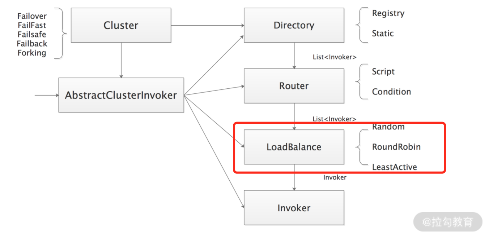
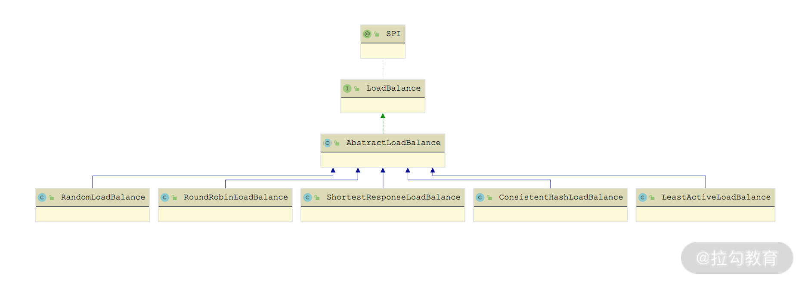
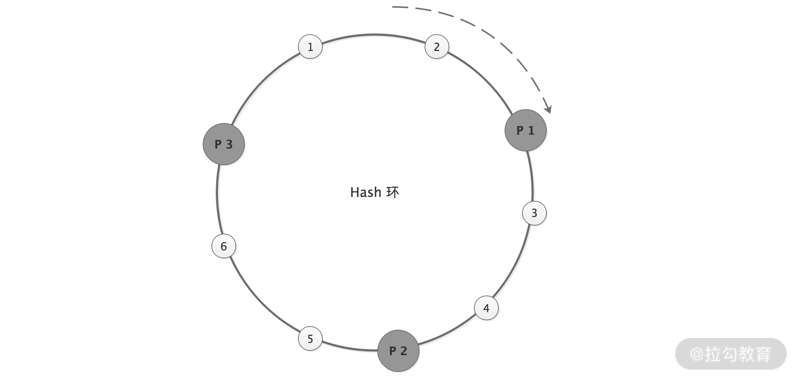
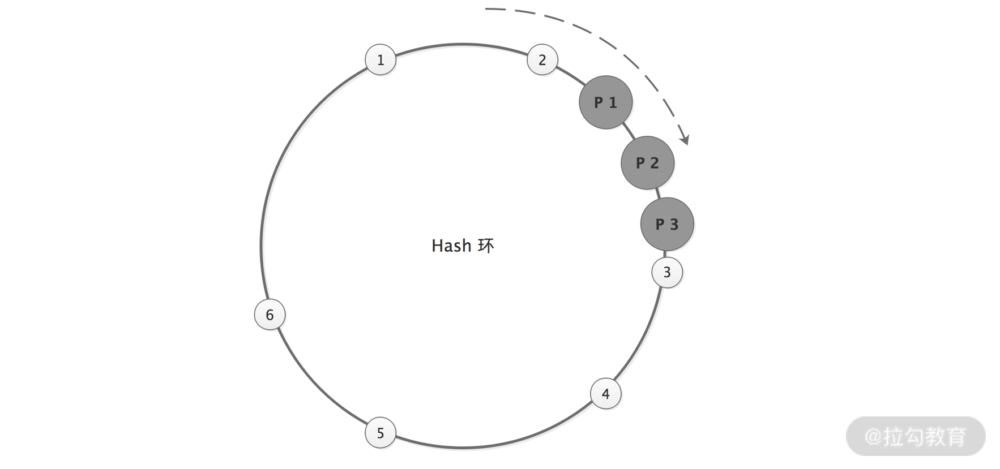
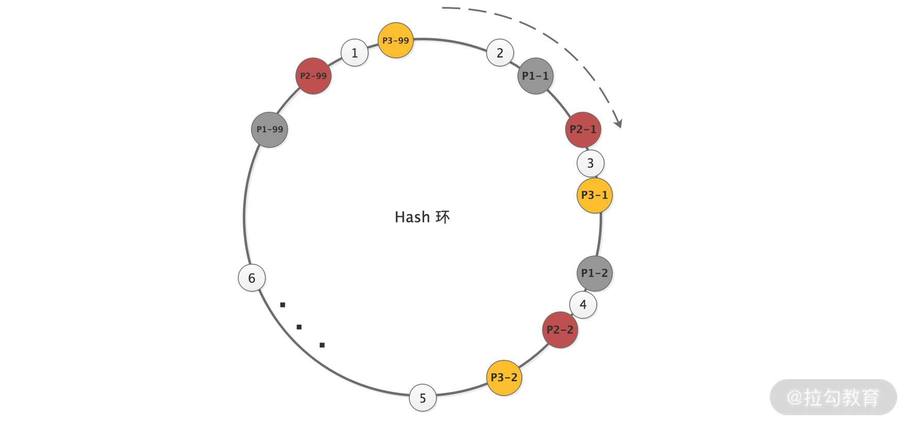

# 35 负载均衡：公平公正物尽其用的负载均衡策略，这里都有（上）

在前面的课时中，我们已经详细介绍了 dubbo-cluster 模块中的 Directory 和 Router 两个核心接口以及核心实现，同时也介绍了这两个接口相关的周边知识。本课时我们继续按照下图的顺序介绍 LoadBalance 的相关内容。



LoadBalance 核心接口图

**LoadBalance（负载均衡）的职责是将网络请求或者其他形式的负载“均摊”到不同的服务节点上，从而避免服务集群中部分节点压力过大、资源紧张，而另一部分节点比较空闲的情况。** 通过合理的负载均衡算法，我们希望可以让每个服务节点获取到适合自己处理能力的负载， **实现处理能力和流量的合理分配** 。常用的负载均衡可分为 **软件负载均衡** （比如，日常工作中使用的 Nginx）和 **硬件负载均衡** （主要有 F5、Array、NetScaler 等，不过开发工程师在实践中很少直接接触到）。

常见的 RPC 框架中都有负载均衡的概念和相应的实现，Dubbo 也不例外。Dubbo 需要对 Consumer 的调用请求进行分配，避免少数 Provider 节点负载过大，而剩余的其他 Provider 节点处于空闲的状态。因为当 Provider 负载过大时，就会导致一部分请求超时、丢失等一系列问题发生，造成线上故障。

Dubbo 提供了 5 种负载均衡实现，分别是：

- 基于 Hash 一致性的 ConsistentHashLoadBalance；
- 基于权重随机算法的 RandomLoadBalance；
- 基于最少活跃调用数算法的 LeastActiveLoadBalance；
- 基于加权轮询算法的 RoundRobinLoadBalance；
- 基于最短响应时间的 ShortestResponseLoadBalance 。

### LoadBalance 接口

上述 Dubbo 提供的负载均衡实现，都是 LoadBalance 接口的实现类，如下图所示：



LoadBalance 继承关系图

**LoadBalance 是一个扩展接口，默认使用的扩展实现是 RandomLoadBalance** ，其定义如下所示，其中的 @Adaptive 注解参数为 loadbalance，即动态生成的适配器会按照 URL 中的 loadbalance 参数值选择扩展实现类。

```
@SPI(RandomLoadBalance.NAME)
public interface LoadBalance {
    @Adaptive("loadbalance")
    <T> Invoker<T> select(List<Invoker<T>> invokers, URL url, Invocation invocation) throws RpcException;
}
```

LoadBalance 接口中 select() 方法的核心功能是根据传入的 URL 和 Invocation，以及自身的负载均衡算法，从 Invoker 集合中选择一个 Invoker 返回。

AbstractLoadBalance 抽象类并没有真正实现 select() 方法，只是对 Invoker 集合为空或是只包含一个 Invoker 对象的特殊情况进行了处理，具体实现如下：

```
public <T> Invoker<T> select(List<Invoker<T>> invokers, URL url, Invocation invocation) {
    if (CollectionUtils.isEmpty(invokers)) { 
        return null; // Invoker集合为空，直接返回null
    }
    if (invokers.size() == 1) { // Invoker集合只包含一个Invoker，则直接返回该Invoker对象
        return invokers.get(0);
    }
    // Invoker集合包含多个Invoker对象时，交给doSelect()方法处理，这是个抽象方法，留给子类具体实现
    return doSelect(invokers, url, invocation);
}
```

另外，AbstractLoadBalance 还提供了一个 getWeight() 方法，该方法用于计算 Provider 权重，具体实现如下：

```
int getWeight(Invoker<?> invoker, Invocation invocation) {
    int weight;
    URL url = invoker.getUrl();
    if (REGISTRY_SERVICE_REFERENCE_PATH.equals(url.getServiceInterface())) {
        // 如果是RegistryService接口的话，直接获取权重即可
        weight = url.getParameter(REGISTRY_KEY + "." + WEIGHT_KEY, DEFAULT_WEIGHT);
    } else {
        weight = url.getMethodParameter(invocation.getMethodName(), WEIGHT_KEY, DEFAULT_WEIGHT);
        if (weight > 0) {
            // 获取服务提供者的启动时间戳
            long timestamp = invoker.getUrl().getParameter(TIMESTAMP_KEY, 0L);
            if (timestamp > 0L) {
                // 计算Provider运行时长
                long uptime = System.currentTimeMillis() - timestamp;
                if (uptime < 0) {
                    return 1;
                }
                // 计算Provider预热时长
                int warmup = invoker.getUrl().getParameter(WARMUP_KEY, DEFAULT_WARMUP);
                // 如果Provider运行时间小于预热时间，则该Provider节点可能还在预热阶段，需要重新计算服务权重(降低其权重)
                if (uptime > 0 && uptime < warmup) {
                    weight = calculateWarmupWeight((int)uptime, warmup, weight);
                }
            }
        }
    }
    return Math.max(weight, 0);
}
```

calculateWarmupWeight() 方法的目的是对还在预热状态的 Provider 节点进行降权，避免 Provider 一启动就有大量请求涌进来。服务预热是一个优化手段，这是由 JVM 本身的一些特性决定的，例如，JIT 等方面的优化，我们一般会在服务启动之后，让其在小流量状态下运行一段时间，然后再逐步放大流量。

```
static int calculateWarmupWeight(int uptime, int warmup, int weight) {
    // 计算权重，随着服务运行时间uptime增大，权重ww的值会慢慢接近配置值weight
    int ww = (int) ( uptime / ((float) warmup / weight));
    return ww < 1 ? 1 : (Math.min(ww, weight));
}
```

了解了 LoadBalance 接口的定义以及 AbstractLoadBalance 提供的公共能力之后，下面我们开始逐个介绍 LoadBalance 接口的具体实现。

### ConsistentHashLoadBalance

ConsistentHashLoadBalance 底层使用一致性 Hash 算法实现负载均衡。为了让你更好地理解这部分内容，我们先来简单介绍一下一致性 Hash 算法相关的知识点。

#### 1. 一致性 Hash 简析 **一致性 Hash 负载均衡可以让参数相同的请求每次都路由到相同的服务节点上** ，这种负载均衡策略可以在某些 Provider 节点下线的时候，让这些节点上的流量平摊到其他 Provider 上，不会引起流量的剧烈波动

下面我们通过一个示例，简单介绍一致性 Hash 算法的原理。

假设现在有 1、2、3 三个 Provider 节点对外提供服务，有 100 个请求同时到达，如果想让请求尽可能均匀地分布到这三个 Provider 节点上，我们可能想到的最简单的方法就是 Hash 取模，即 hash(请求参数) % 3。如果参与 Hash 计算的是请求的全部参数，那么参数相同的请求将会落到同一个 Provider 节点上。不过此时如果突然有一个 Provider 节点出现宕机的情况，那我们就需要对 2 取模，即请求会重新分配到相应的 Provider 之上。在极端情况下，甚至会出现所有请求的处理节点都发生了变化，这就会造成比较大的波动。

为了避免因一个 Provider 节点宕机，而导致大量请求的处理节点发生变化的情况，我们可以考虑使用一致性 Hash 算法。 **一致性 Hash 算法的原理也是取模算法，与 Hash 取模的不同之处在于：Hash 取模是对 Provider 节点数量取模，而一致性 Hash 算法是对 2^32 取模。** 一致性 Hash 算法需要同时对 Provider 地址以及请求参数进行取模：

```
hash(Provider地址) % 232
hash(请求参数) % 232
```

Provider 地址和请求经过对 232 取模得到的结果值，都会落到一个 Hash 环上，如下图所示：



一致性 Hash 节点均匀分布图

我们按顺时针的方向，依次将请求分发到对应的 Provider。这样，当某台 Provider 节点宕机或增加新的 Provider 节点时，只会影响这个 Provider 节点对应的请求。

在理想情况下，一致性 Hash 算法会将这三个 Provider 节点均匀地分布到 Hash 环上，请求也可以均匀地分发给这三个 Provider 节点。但在实际情况中，这三个 Provider 节点地址取模之后的值，可能差距不大，这样会导致大量的请求落到一个 Provider 节点上，如下图所示：



一致性 Hash 节点非均匀分布图

这就出现了数据倾斜的问题。 **所谓数据倾斜是指由于节点不够分散，导致大量请求落到了同一个节点上，而其他节点只会接收到少量请求的情况** 。

为了解决一致性 Hash 算法中出现的数据倾斜问题，又演化出了 Hash 槽的概念。

Hash 槽解决数据倾斜的思路是：既然问题是由 Provider 节点在 Hash 环上分布不均匀造成的，那么可以虚拟出 n 组 P1、P2、P3 的 Provider 节点 ，让多组 Provider 节点相对均匀地分布在 Hash 环上。如下图所示，相同阴影的节点均为同一个 Provider 节点，比如 P1-1、P1-2……P1-99 表示的都是 P1 这个 Provider 节点。引入 Provider 虚拟节点之后，让 Provider 在圆环上分散开来，以避免数据倾斜问题。



数据倾斜解决示意图

#### 2. ConsistentHashSelector 实现分析

了解了一致性 Hash 算法的基本原理之后，我们再来看一下 ConsistentHashLoadBalance 一致性 Hash 负载均衡的具体实现。首先来看 doSelect() 方法的实现，其中会根据 ServiceKey 和 methodName 选择一个 ConsistentHashSelector 对象， **核心算法都委托给 ConsistentHashSelector 对象完成。**

```
protected <T> Invoker<T> doSelect(List<Invoker<T>> invokers, URL url, Invocation invocation) {
    // 获取调用的方法名称
    String methodName = RpcUtils.getMethodName(invocation);
    // 将ServiceKey和方法拼接起来，构成一个key
    String key = invokers.get(0).getUrl().getServiceKey() + "." + methodName;
    // 注意：这是为了在invokers列表发生变化时都会重新生成ConsistentHashSelector对象
    int invokersHashCode = invokers.hashCode();
    // 根据key获取对应的ConsistentHashSelector对象，selectors是一个ConcurrentMap<String, ConsistentHashSelector>集合
    ConsistentHashSelector<T> selector = (ConsistentHashSelector<T>) selectors.get(key);
    if (selector == null || selector.identityHashCode != invokersHashCode) { // 未查找到ConsistentHashSelector对象，则进行创建
        selectors.put(key, new ConsistentHashSelector<T>(invokers, methodName, invokersHashCode));
        selector = (ConsistentHashSelector<T>) selectors.get(key);
    }
    // 通过ConsistentHashSelector对象选择一个Invoker对象
    return selector.select(invocation);
}
```

下面我们来看 ConsistentHashSelector，其核心字段如下所示。

- virtualInvokers（TreeMap\<Long, Invoker`<T>`> 类型）：用于记录虚拟 Invoker 对象的 Hash 环。这里使用 TreeMap 实现 Hash 环，并将虚拟的 Invoker 对象分布在 Hash 环上。
- replicaNumber（int 类型）：虚拟 Invoker 个数。
- identityHashCode（int 类型）：Invoker 集合的 HashCode 值。
- argumentIndex（int\[\] 类型）：需要参与 Hash 计算的参数索引。例如，argumentIndex = \[0, 1, 2\] 时，表示调用的目标方法的前三个参数要参与 Hash 计算。

接下来看 ConsistentHashSelector 的构造方法，其中的主要任务是：

- 构建 Hash 槽；
- 确认参与一致性 Hash 计算的参数，默认是第一个参数。

这些操作的目的就是为了让 Invoker 尽可能均匀地分布在 Hash 环上，具体实现如下：

```
ConsistentHashSelector(List<Invoker<T>> invokers, String methodName, int identityHashCode) {
    // 初始化virtualInvokers字段，也就是虚拟Hash槽
    this.virtualInvokers = new TreeMap<Long, Invoker<T>>();
    // 记录Invoker集合的hashCode，用该hashCode值来判断Provider列表是否发生了变化
    this.identityHashCode = identityHashCode;
    URL url = invokers.get(0).getUrl();
    // 从hash.nodes参数中获取虚拟节点的个数
    this.replicaNumber = url.getMethodParameter(methodName, HASH_NODES, 160);
    // 获取参与Hash计算的参数下标值，默认对第一个参数进行Hash运算
    String[] index = COMMA_SPLIT_PATTERN.split(url.getMethodParameter(methodName, HASH_ARGUMENTS, "0"));
    argumentIndex = new int[index.length];
    for (int i = 0; i < index.length; i++) {
        argumentIndex[i] = Integer.parseInt(index[i]);
    }
    // 构建虚拟Hash槽，默认replicaNumber=160，相当于在Hash槽上放160个槽位
    // 外层轮询40次，内层轮询4次，共40*4=160次，也就是同一节点虚拟出160个槽位
    for (Invoker<T> invoker : invokers) {
        String address = invoker.getUrl().getAddress();
        for (int i = 0; i < replicaNumber / 4; i++) {
            // 对address + i进行md5运算，得到一个长度为16的字节数组
            byte[] digest = md5(address + i);
            // 对digest部分字节进行4次Hash运算，得到4个不同的long型正整数
            for (int h = 0; h < 4; h++) {
                // h = 0 时，取 digest 中下标为 0~3 的 4 个字节进行位运算
                // h = 1 时，取 digest 中下标为 4~7 的 4 个字节进行位运算
                // h = 2 和 h = 3时，过程同上
                long m = hash(digest, h);
                virtualInvokers.put(m, invoker);
            }
        }
    }
}
```

最后，请求会通过 ConsistentHashSelector.select() 方法选择合适的 Invoker 对象，其中会先对请求参数进行 md5 以及 Hash 运算，得到一个 Hash 值，然后再通过这个 Hash 值到 TreeMap 中查找目标 Invoker。具体实现如下：

```
public Invoker<T> select(Invocation invocation) {
    // 将参与一致性Hash的参数拼接到一起
    String key = toKey(invocation.getArguments());
    // 计算key的Hash值
    byte[] digest = md5(key);
    // 匹配Invoker对象
    return selectForKey(hash(digest, 0));
}
private Invoker<T> selectForKey(long hash) {
    // 从virtualInvokers集合（TreeMap是按照Key排序的）中查找第一个节点值大于或等于传入Hash值的Invoker对象
    Map.Entry<Long, Invoker<T>> entry = virtualInvokers.ceilingEntry(hash);
    // 如果Hash值大于Hash环中的所有Invoker，则回到Hash环的开头，返回第一个Invoker对象
    if (entry == null) {
        entry = virtualInvokers.firstEntry();
    }
    return entry.getValue();
}
```

### RandomLoadBalance

RandomLoadBalance 使用的负载均衡算法是 **加权随机算法** 。RandomLoadBalance 是一个简单、高效的负载均衡实现，它也是 Dubbo 默认使用的 LoadBalance 实现。

这里我们通过一个示例来说明加权随机算法的核心思想。假设我们有三个 Provider 节点 A、B、C，它们对应的权重分别为 5、2、3，权重总和为 10。现在把这些权重值放到一维坐标轴上，\[0, 5) 区间属于节点 A，\[5, 7) 区间属于节点 B，\[7, 10) 区间属于节点 C，如下图所示：


权重坐标轴示意图

下面我们通过随机数生成器在 \[0, 10) 这个范围内生成一个随机数，然后计算这个随机数会落到哪个区间中。例如，随机生成 4，就会落到 Provider A 对应的区间中，此时 RandomLoadBalance 就会返回 Provider A 这个节点。

接下来我们再来看 RandomLoadBalance 中 doSelect() 方法的实现，其核心逻辑分为三个关键点：

- 计算每个 Invoker 对应的权重值以及总权重值；
- 当各个 Invoker 权重值不相等时，计算随机数应该落在哪个 Invoker 区间中，返回对应的 Invoker 对象；
- 当各个 Invoker 权重值相同时，随机返回一个 Invoker 即可。

RandomLoadBalance 经过多次请求后，能够将调用请求按照权重值均匀地分配到各个 Provider 节点上。下面是 RandomLoadBalance 的核心实现：

```
protected <T> Invoker<T> doSelect(List<Invoker<T>> invokers, URL url, Invocation invocation) {
    int length = invokers.size();
    boolean sameWeight = true;
    // 计算每个Invoker对象对应的权重，并填充到weights[]数组中
    int[] weights = new int[length];
    // 计算第一个Invoker的权重
    int firstWeight = getWeight(invokers.get(0), invocation);
    weights[0] = firstWeight;
    // totalWeight用于记录总权重值
    int totalWeight = firstWeight;
    for (int i = 1; i < length; i++) {
        // 计算每个Invoker的权重，以及总权重totalWeight
        int weight = getWeight(invokers.get(i), invocation);
        weights[i] = weight;
        // Sum
        totalWeight += weight;
        // 检测每个Provider的权重是否相同
        if (sameWeight && weight != firstWeight) {
            sameWeight = false;
        }
    }
    // 各个Invoker权重值不相等时，计算随机数落在哪个区间上
    if (totalWeight > 0 && !sameWeight) {
        // 随机获取一个[0, totalWeight) 区间内的数字
        int offset = ThreadLocalRandom.current().nextInt(totalWeight);
        // 循环让offset数减去Invoker的权重值，当offset小于0时，返回相应的Invoker
        for (int i = 0; i < length; i++) {
            offset -= weights[i];
            if (offset < 0) {
                return invokers.get(i);
            }
        }
    }
    // 各个Invoker权重值相同时，随机返回一个Invoker即可
    return invokers.get(ThreadLocalRandom.current().nextInt(length));
}
```

### 总结

本课时我们重点介绍了 Dubbo Cluster 层中负载均衡相关的内容。首先我们介绍了 LoadBalance 接口的定义以及 AbstractLoadBalance 抽象类提供的公共能力。然后我们还详细讲解了 ConsistentHashLoadBalance 的核心实现，其中还简单说明了一致性 Hash 算法的基础知识点。最后，我们又一块儿分析了 RandomLoadBalance 的基本原理和核心实现。
