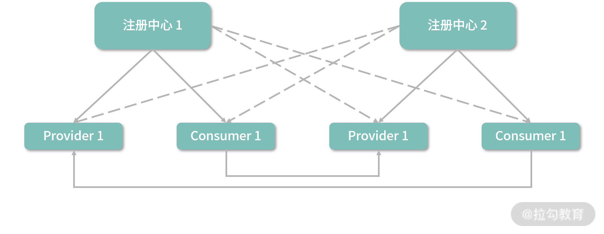
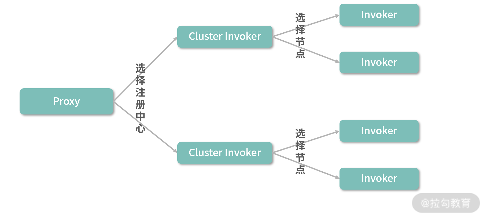

# 38 集群容错：一个好汉三个帮（下）

你好，我是杨四正，今天我和你分享的主题是集群容错：一个好汉三个帮（下篇）。

在上一课时，我们介绍了 Dubbo Cluster 层中集群容错机制的基础知识，还说明了 Cluster 接口的定义以及其各个实现类的核心功能。同时，我们还分析了 AbstractClusterInvoker 抽象类以及 AbstractCluster 抽象实现类的核心实现。

那接下来在本课时，我们将介绍 Cluster 接口的全部实现类，以及相关的 Cluster Invoker 实现类。

### FailoverClusterInvoker

通过前面对 Cluster 接口的介绍我们知道，Cluster 默认的扩展实现是 FailoverCluster，其 doJoin() 方法中会创建一个 FailoverClusterInvoker 对象并返回，具体实现如下：

```
public <T> AbstractClusterInvoker<T> doJoin(Directory<T> directory) throws RpcException {
    return new FailoverClusterInvoker<>(directory);
}
```

**FailoverClusterInvoker 会在调用失败的时候，自动切换 Invoker 进行重试**。下面来看 FailoverClusterInvoker 的核心实现：

```
public Result doInvoke(Invocation invocation, final List<Invoker<T>> invokers, LoadBalance loadbalance) throws RpcException {
    List<Invoker<T>> copyInvokers = invokers;
    // 检查copyInvokers集合是否为空，如果为空会抛出异常
    checkInvokers(copyInvokers, invocation);
    String methodName = RpcUtils.getMethodName(invocation);
    // 参数重试次数，默认重试2次，总共执行3次
    int len = getUrl().getMethodParameter(methodName, RETRIES_KEY, DEFAULT_RETRIES) + 1;
    if (len <= 0) {
        len = 1;
    }
    RpcException le = null;
    // 记录已经尝试调用过的Invoker对象
    List<Invoker<T>> invoked = new ArrayList<Invoker<T>>(copyInvokers.size());
    Set<String> providers = new HashSet<String>(len);
    for (int i = 0; i < len; i++) {
        // 第一次传进来的invokers已经check过了，第二次则是重试，需要重新获取最新的服务列表
        if (i > 0) {
            checkWhetherDestroyed();
            // 这里会重新调用Directory.list()方法，获取Invoker列表
            copyInvokers = list(invocation);
            // 检查copyInvokers集合是否为空，如果为空会抛出异常
            checkInvokers(copyInvokers, invocation);
        }
        // 通过LoadBalance选择Invoker对象，这里传入的invoked集合，
        // 就是前面介绍AbstractClusterInvoker.select()方法中的selected集合
        Invoker<T> invoker = select(loadbalance, invocation, copyInvokers, invoked);
        // 记录此次要尝试调用的Invoker对象，下一次重试时就会过滤这个服务
        invoked.add(invoker);
        RpcContext.getContext().setInvokers((List) invoked);
        try {
            // 调用目标Invoker对象的invoke()方法，完成远程调用
            Result result = invoker.invoke(invocation);
            // 经过尝试之后，终于成功，这里会打印一个警告日志，将尝试过来的Provider地址打印出来
            if (le != null && logger.isWarnEnabled()) {
                logger.warn("...");
            }
            return result;
        } catch (RpcException e) {
            if (e.isBiz()) { // biz exception.
                throw e;
            }
            le = e;
        } catch (Throwable e) { // 抛出异常，表示此次尝试失败，会进行重试
            le = new RpcException(e.getMessage(), e);
        } finally {
            // 记录尝试过的Provider地址，会在上面的警告日志中打印出来
            providers.add(invoker.getUrl().getAddress());
        }
    }
    // 达到重试次数上限之后，会抛出异常，其中会携带调用的方法名、尝试过的Provider节点的地址(providers集合)、全部的Provider个数(copyInvokers集合)以及Directory信息
    throw new RpcException(le.getCode(), "...");
}
```

### FailbackClusterInvoker

FailbackCluster 是 Cluster 接口的另一个扩展实现，扩展名是 failback，其 doJoin() 方法中创建的 Invoker 对象是 FailbackClusterInvoker 类型，具体实现如下：

```
public <T> AbstractClusterInvoker<T> doJoin(Directory<T> directory) throws RpcException {
    return new FailbackClusterInvoker<>(directory);
}
```** FailbackClusterInvoker 在请求失败之后，返回一个空结果给 Consumer，同时还会添加一个定时任务对失败的请求进行重试 **。下面来看 FailbackClusterInvoker 的具体实现：
```

protected Result doInvoke(Invocation invocation, List\<Invoker<T>> invokers, LoadBalance loadbalance) throws RpcException {
Invoker<T> invoker = null;
try {
// 检测Invoker集合是否为空
checkInvokers(invokers, invocation);
// 调用select()方法得到此次尝试的Invoker对象
invoker = select(loadbalance, invocation, invokers, null);
// 调用invoke()方法完成远程调用
return invoker.invoke(invocation);
} catch (Throwable e) {
// 请求失败之后，会添加一个定时任务进行重试
addFailed(loadbalance, invocation, invokers, invoker);
return AsyncRpcResult.newDefaultAsyncResult(null, null, invocation); // 请求失败时，会返回一个空结果
}
}

```

在 doInvoke() 方法中，请求失败时会调用 addFailed() 方法添加定时任务进行重试，默认每隔 5 秒执行一次，总共重试 3 次，具体实现如下：
```

private void addFailed(LoadBalance loadbalance, Invocation invocation, List\<Invoker<T>> invokers, Invoker<T> lastInvoker) {
if (failTimer == null) {
synchronized (this) {
if (failTimer == null) { // Double Check防止并发问题
// 初始化时间轮，这个时间轮有32个槽，每个槽代表1秒
failTimer = new HashedWheelTimer(
new NamedThreadFactory("failback-cluster-timer", true),
1,
TimeUnit.SECONDS, 32, failbackTasks);
}
}
}
// 创建一个定时任务
RetryTimerTask retryTimerTask = new RetryTimerTask(loadbalance, invocation, invokers, lastInvoker, retries, RETRY_FAILED_PERIOD);
try {
// 将定时任务添加到时间轮中
failTimer.newTimeout(retryTimerTask, RETRY_FAILED_PERIOD, TimeUnit.SECONDS);
} catch (Throwable e) {
logger.error("...");
}
}

```

在 RetryTimerTask 定时任务中，会重新调用 select() 方法筛选合适的 Invoker 对象，并尝试进行请求。如果请求再次失败且重试次数未达到上限，则调用 rePut() 方法再次添加定时任务，等待进行重试；如果请求成功，也不会返回任何结果。RetryTimerTask 的核心实现如下：
```

public void run(Timeout timeout) {
try {
// 重新选择Invoker对象，注意，这里会将上次重试失败的Invoker作为selected集合传入
Invoker<T> retryInvoker = select(loadbalance, invocation, invokers, Collections.singletonList(lastInvoker));
lastInvoker = retryInvoker;
retryInvoker.invoke(invocation); // 请求对应的Provider节点
} catch (Throwable e) {
if ((++retryTimes) >= retries) { // 重试次数达到上限，输出警告日志
logger.error("...");
} else {
rePut(timeout); // 重试次数未达到上限，则重新添加定时任务，等待重试
}
}
}
private void rePut(Timeout timeout) {
if (timeout == null) { // 边界检查
return;
}
Timer timer = timeout.timer();
if (timer.isStop() || timeout.isCancelled()) { // 检查时间轮状态、检查定时任务状态
return;
}
// 重新添加定时任务
timer.newTimeout(timeout.task(), tick, TimeUnit.SECONDS);
}

```

### FailfastClusterInvoker

FailfastCluster 的扩展名是 failfast，在其 doJoin() 方法中会创建 FailfastClusterInvoker 对象，具体实现如下：
```

public <T> AbstractClusterInvoker<T> doJoin(Directory<T> directory) throws RpcException {
return new FailfastClusterInvoker\<>(directory);
}

```** FailfastClusterInvoker 只会进行一次请求，请求失败之后会立即抛出异常，这种策略适合非幂等的操作 **，具体实现如下：
```

public Result doInvoke(Invocation invocation, List\<Invoker<T>> invokers, LoadBalance loadbalance) throws RpcException {
checkInvokers(invokers, invocation);
// 调用select()得到此次要调用的Invoker对象
Invoker<T> invoker = select(loadbalance, invocation, invokers, null);
try {
return invoker.invoke(invocation); // 发起请求
} catch (Throwable e) {
// 请求失败，直接抛出异常
if (e instanceof RpcException && ((RpcException) e).isBiz()) {
throw (RpcException) e;
}
throw new RpcException("...");
}
}

```

### FailsafeClusterInvoker

FailsafeCluster 的扩展名是 failsafe，在其 doJoin() 方法中会创建 FailsafeClusterInvoker 对象，具体实现如下：
```

public <T> AbstractClusterInvoker<T> doJoin(Directory<T> directory) throws RpcException {
return new FailsafeClusterInvoker\<>(directory);
}

```** FailsafeClusterInvoker 只会进行一次请求，请求失败之后会返回一个空结果 **，具体实现如下：
```

public Result doInvoke(Invocation invocation, List\<Invoker<T>> invokers, LoadBalance loadbalance) throws RpcException {
try {
// 检测Invoker集合是否为空
checkInvokers(invokers, invocation);
// 调用select()得到此次要调用的Invoker对象
Invoker<T> invoker = select(loadbalance, invocation, invokers, null);
// 发起请求
return invoker.invoke(invocation);
} catch (Throwable e) {
// 请求失败之后，会打印一行日志并返回空结果
logger.error("...");
return AsyncRpcResult.newDefaultAsyncResult(null, null, invocation);
}
}

```

### ForkingClusterInvoker

ForkingCluster 的扩展名称为 forking，在其 doJoin() 方法中，会创建一个 ForkingClusterInvoker 对象，具体实现如下：
```

public <T> AbstractClusterInvoker<T> doJoin(Directory<T> directory) throws RpcException {
return new ForkingClusterInvoker\<>(directory);
}

```

ForkingClusterInvoker 中会** 维护一个线程池 **（executor 字段，通过 Executors.newCachedThreadPool() 方法创建的线程池），** 并发调用多个 Provider 节点，只要有一个 Provider 节点成功返回了结果，ForkingClusterInvoker 的 doInvoke() 方法就会立即结束运行 **。

ForkingClusterInvoker 主要是为了应对一些实时性要求较高的读操作，因为没有并发控制的多线程写入，可能会导致数据不一致。

ForkingClusterInvoker.doInvoke() 方法首先从 Invoker 集合中选出指定个数（forks 参数决定）的 Invoker 对象，然后通过 executor 线程池并发调用这些 Invoker，并将请求结果存储在 ref 阻塞队列中，则当前线程会阻塞在 ref 队列上，等待第一个请求结果返回。下面是 ForkingClusterInvoker 的具体实现：
```

public Result doInvoke(final Invocation invocation, List\<Invoker<T>> invokers, LoadBalance loadbalance) throws RpcException {
try {
// 检查Invoker集合是否为空
checkInvokers(invokers, invocation);
final List\<Invoker<T>> selected;
// 从URL中获取forks参数，作为并发请求的上限，默认值为2
final int forks = getUrl().getParameter(FORKS_KEY, DEFAULT_FORKS);
final int timeout = getUrl().getParameter(TIMEOUT_KEY, DEFAULT_TIMEOUT);
if (forks \<= 0 || forks >= invokers.size()) {
// 如果forks为负数或是大于Invoker集合的长度，会直接并发调用全部Invoker
selected = invokers;
} else {
// 按照forks指定的并发度，选择此次并发调用的Invoker对象
selected = new ArrayList\<>(forks);
while (selected.size() \< forks) {
Invoker<T> invoker = select(loadbalance, invocation, invokers, selected);
if (!selected.contains(invoker)) {
selected.add(invoker); // 避免重复选择
}
}
}
RpcContext.getContext().setInvokers((List) selected);
// 记录失败的请求个数
final AtomicInteger count = new AtomicInteger();
// 用于记录请求结果
final BlockingQueue<Object> ref = new LinkedBlockingQueue\<>();
for (final Invoker<T> invoker : selected) {  // 遍历 selected 列表
executor.execute(() -> { // 为每个Invoker创建一个任务，并提交到线程池中
try {
// 发起请求
Result result = invoker.invoke(invocation);
// 将请求结果写到ref队列中
ref.offer(result);
} catch (Throwable e) {
int value = count.incrementAndGet();
if (value >= selected.size()) {
// 如果失败的请求个数超过了并发请求的个数，则向ref队列中写入异常
ref.offer(e);
}
}
});
}
try {
// 当前线程会阻塞等待任意一个请求结果的出现
Object ret = ref.poll(timeout, TimeUnit.MILLISECONDS);
if (ret instanceof Throwable) { // 如果结果类型为Throwable，则抛出异常
Throwable e = (Throwable) ret;
throw new RpcException("...");
}
return (Result) ret; // 返回结果
} catch (InterruptedException e) {
throw new RpcException("...");
}
} finally {
// 清除上下文信息
RpcContext.getContext().clearAttachments();
}
}

```

### BroadcastClusterInvoker

BroadcastCluster 这个 Cluster 实现类的扩展名为 broadcast，在其 doJoin() 方法中创建的是 BroadcastClusterInvoker 类型的 Invoker 对象，具体实现如下：
```

public <T> AbstractClusterInvoker<T> doJoin(Directory<T> directory) throws RpcException {
return new BroadcastClusterInvoker\<>(directory);
}

```** 在 BroadcastClusterInvoker 中，会逐个调用每个 Provider 节点，其中任意一个 Provider 节点报错，都会在全部调用结束之后抛出异常 **。BroadcastClusterInvoker** 通常用于通知类的操作 **，例如通知所有 Provider 节点更新本地缓存。

下面来看 BroadcastClusterInvoker 的具体实现：
```

public Result doInvoke(final Invocation invocation, List\<Invoker<T>> invokers, LoadBalance loadbalance) throws RpcException {
// 检测Invoker集合是否为空
checkInvokers(invokers, invocation);
RpcContext.getContext().setInvokers((List) invokers);
RpcException exception = null; // 用于记录失败请求的相关异常信息
Result result = null;
// 遍历所有Invoker对象
for (Invoker<T> invoker : invokers) {
try {
// 发起请求
result = invoker.invoke(invocation);
} catch (RpcException e) {
exception = e;
logger.warn(e.getMessage(), e);
} catch (Throwable e) {
exception = new RpcException(e.getMessage(), e);
logger.warn(e.getMessage(), e);
}
}
if (exception != null) { // 出现任何异常，都会在这里抛出
throw exception;
}
return result;
}

```

### AvailableClusterInvoker

AvailableCluster 这个 Cluster 实现类的扩展名为 available，在其 join() 方法中创建的是 AvailableClusterInvoker 类型的 Invoker 对象，具体实现如下：
```

public <T> Invoker<T> join(Directory<T> directory) throws RpcException {
return new AvailableClusterInvoker\<>(directory);
}

```

在 AvailableClusterInvoker 的 doInvoke() 方法中，会遍历整个 Invoker 集合，** 逐个调用对应的 Provider 节点，当遇到第一个可用的 Provider 节点时，就尝试访问该 Provider 节点，成功则返回结果；如果访问失败，则抛出异常终止遍历 **。

下面是 AvailableClusterInvoker 的具体实现：
```

public Result doInvoke(Invocation invocation, List\<Invoker<T>> invokers, LoadBalance loadbalance) throws RpcException {
for (Invoker<T> invoker : invokers) { // 遍历整个Invoker集合
if (invoker.isAvailable()) { // 检测该Invoker是否可用
// 发起请求，调用失败时的异常会直接抛出
return invoker.invoke(invocation);
}
}
// 没有找到可用的Invoker，也会抛出异常
throw new RpcException("No provider available in " + invokers);
}

```

### MergeableClusterInvoker

MergeableCluster 这个 Cluster 实现类的扩展名为 mergeable，在其 doJoin() 方法中创建的是 MergeableClusterInvoker 类型的 Invoker 对象，具体实现如下：
```

public <T> AbstractClusterInvoker<T> doJoin(Directory<T> directory) throws RpcException {
return new MergeableClusterInvoker<T>(directory);
}

```** MergeableClusterInvoker 会对多个 Provider 节点返回结果合并 **。如果请求的方法没有配置 Merger 合并器（即没有指定 merger 参数），则不会进行结果合并，而是直接将第一个可用的 Invoker 结果返回。下面来看 MergeableClusterInvoker 的具体实现：
```

protected Result doInvoke(Invocation invocation, List\<Invoker<T>> invokers, LoadBalance loadbalance) throws RpcException {
checkInvokers(invokers, invocation);
String merger = getUrl().getMethodParameter(invocation.getMethodName(), MERGER_KEY);
// 判断要调用的目标方法是否有合并器，如果没有，则不会进行合并，
// 找到第一个可用的Invoker直接调用并返回结果
if (ConfigUtils.isEmpty(merger)) {
for (final Invoker<T> invoker : invokers) {
if (invoker.isAvailable()) {
try {
return invoker.invoke(invocation);
} catch (RpcException e) {
if (e.isNoInvokerAvailableAfterFilter()) {
log.debug("No available provider for service" + getUrl().getServiceKey() + " on group " + invoker.getUrl().getParameter(GROUP_KEY) + ", will continue to try another group.");
} else {
throw e;
}
}
}
}
return invokers.iterator().next().invoke(invocation);
}
// 确定目标方法的返回值类型
Class\<?> returnType;
try {
returnType = getInterface().getMethod(
invocation.getMethodName(), invocation.getParameterTypes()).getReturnType();
} catch (NoSuchMethodException e) {
returnType = null;
}
// 调用每个Invoker对象(异步方式)，将请求结果记录到results集合中
Map\<String, Result> results = new HashMap\<>();
for (final Invoker<T> invoker : invokers) {
RpcInvocation subInvocation = new RpcInvocation(invocation, invoker);
subInvocation.setAttachment(ASYNC_KEY, "true");
results.put(invoker.getUrl().getServiceKey(), invoker.invoke(subInvocation));
}
Object result = null;
List<Result> resultList = new ArrayList<Result>(results.size());
// 等待结果返回
for (Map.Entry\<String, Result> entry : results.entrySet()) {
Result asyncResult = entry.getValue();
try {
Result r = asyncResult.get();
if (r.hasException()) {
log.error("Invoke " + getGroupDescFromServiceKey(entry.getKey()) +
" failed: " + r.getException().getMessage(),
r.getException());
} else {
resultList.add(r);
}
} catch (Exception e) {
throw new RpcException("Failed to invoke service " + entry.getKey() + ": " + e.getMessage(), e);
}
}
if (resultList.isEmpty()) {
return AsyncRpcResult.newDefaultAsyncResult(invocation);
} else if (resultList.size() == 1) {
return resultList.iterator().next();
}
if (returnType == void.class) {
return AsyncRpcResult.newDefaultAsyncResult(invocation);
}
// merger如果以"."开头，后面为方法名，这个方法名是远程目标方法的返回类型中的方法
// 得到每个Provider节点返回的结果对象之后，会遍历每个返回对象，调用merger参数指定的方法
if (merger.startsWith(".")) {
merger = merger.substring(1);
Method method;
try {
method = returnType.getMethod(merger, returnType);
} catch (NoSuchMethodException e) {
throw new RpcException("Can not merge result because missing method \[ " + merger + " \] in class \[ " +
returnType.getName() + " \]");
}
if (!Modifier.isPublic(method.getModifiers())) {
method.setAccessible(true);
}
// resultList集合保存了所有的返回对象，method是Method对象，也就是merger指定的方法
// result是最后返回调用方的结果
result = resultList.remove(0).getValue();
try {
if (method.getReturnType() != void.class
&& method.getReturnType().isAssignableFrom(result.getClass())) {
for (Result r : resultList) { // 反射调用
result = method.invoke(result, r.getValue());
}
} else {
for (Result r : resultList) { // 反射调用
method.invoke(result, r.getValue());
}
}
} catch (Exception e) {
throw new RpcException("Can not merge result: " + e.getMessage(), e);
}
} else {
Merger resultMerger;
if (ConfigUtils.isDefault(merger)) {
// merger参数为true或者default，表示使用默认的Merger扩展实现完成合并
// 在后面课时中会介绍Merger接口
resultMerger = MergerFactory.getMerger(returnType);
} else {
//merger参数指定了Merger的扩展名称，则使用SPI查找对应的Merger扩展实现对象
resultMerger = ExtensionLoader.getExtensionLoader(Merger.class).getExtension(merger);
}
if (resultMerger != null) {
List<Object> rets = new ArrayList<Object>(resultList.size());
for (Result r : resultList) {
rets.add(r.getValue());
}
// 执行合并操作
result = resultMerger.merge(
rets.toArray((Object\[\]) Array.newInstance(returnType, 0)));
} else {
throw new RpcException("There is no merger to merge result.");
}
}
return AsyncRpcResult.newDefaultAsyncResult(result, invocation);
}

```

### ZoneAwareClusterInvoker

ZoneAwareCluster 这个 Cluster 实现类的扩展名为 zone-aware，在其 doJoin() 方法中创建的是 ZoneAwareClusterInvoker 类型的 Invoker 对象，具体实现如下：
```

protected <T> AbstractClusterInvoker<T> doJoin(Directory<T> directory) throws RpcException {
return new ZoneAwareClusterInvoker<T>(directory);
}

```

在 Dubbo 中使用多个注册中心的架构如下图所示：



双注册中心结构图

Consumer 可以使用 ZoneAwareClusterInvoker 先在多个注册中心之间进行选择，选定注册中心之后，再选择 Provider 节点，如下图所示：



ZoneAwareClusterInvoker 在多注册中心之间进行选择的策略有以下四种。

1.  找到** preferred 属性为 true 的注册中心，它是优先级最高的注册中心 **，只有该中心无可用 Provider 节点时，才会回落到其他注册中心。
2.  根据** 请求中的 zone key 做匹配 **，优先派发到相同 zone 的注册中心。
3.  根据** 权重 **（也就是注册中心配置的 weight 属性）进行轮询。
4.  如果上面的策略都未命中，则选择** 第一个可用的 Provider 节点**。

下面来看 ZoneAwareClusterInvoker 的具体实现：
```

public Result doInvoke(Invocation invocation, final List\<Invoker<T>> invokers, LoadBalance loadbalance) throws RpcException {
// 首先找到preferred属性为true的注册中心，它是优先级最高的注册中心，只有该中心无可用 Provider 节点时，才会回落到其他注册中心
for (Invoker<T> invoker : invokers) {
MockClusterInvoker<T> mockClusterInvoker = (MockClusterInvoker<T>) invoker;
if (mockClusterInvoker.isAvailable() && mockClusterInvoker.getRegistryUrl()
.getParameter(REGISTRY_KEY + "." + PREFERRED_KEY, false)) {
return mockClusterInvoker.invoke(invocation);
}
}
// 根据请求中的registry_zone做匹配，优先派发到相同zone的注册中心
String zone = (String) invocation.getAttachment(REGISTRY_ZONE);
if (StringUtils.isNotEmpty(zone)) {
for (Invoker<T> invoker : invokers) {
MockClusterInvoker<T> mockClusterInvoker = (MockClusterInvoker<T>) invoker;
if (mockClusterInvoker.isAvailable() && zone.equals(mockClusterInvoker.getRegistryUrl().getParameter(REGISTRY_KEY + "." + ZONE_KEY))) {
return mockClusterInvoker.invoke(invocation);
}
}
String force = (String) invocation.getAttachment(REGISTRY_ZONE_FORCE);
if (StringUtils.isNotEmpty(force) && "true".equalsIgnoreCase(force)) {
throw new IllegalStateException("...");
}
}
// 根据权重（也就是注册中心配置的weight属性）进行轮询
Invoker<T> balancedInvoker = select(loadbalance, invocation, invokers, null);
if (balancedInvoker.isAvailable()) {
return balancedInvoker.invoke(invocation);
}
// 选择第一个可用的 Provider 节点
for (Invoker<T> invoker : invokers) {
MockClusterInvoker<T> mockClusterInvoker = (MockClusterInvoker<T>) invoker;
if (mockClusterInvoker.isAvailable()) {
return mockClusterInvoker.invoke(invocation);
}
}
throw new RpcException("No provider available in " + invokers);
}

```

### 总结

本课时我们重点介绍了 Dubbo 中 Cluster 接口的各个实现类的原理以及相关 Invoker 的实现原理。这里重点分析的 Cluster 实现有：Failover Cluster、Failback Cluster、Failfast Cluster、Failsafe Cluster、Forking Cluster、Broadcast Cluster、Available Cluster 和 Mergeable Cluster。除此之外，我们还分析了多注册中心的 ZoneAware Cluster 实现。
```
