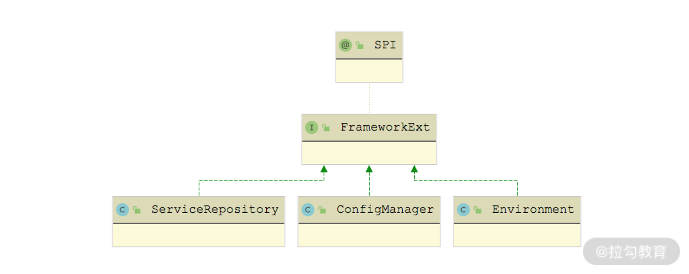
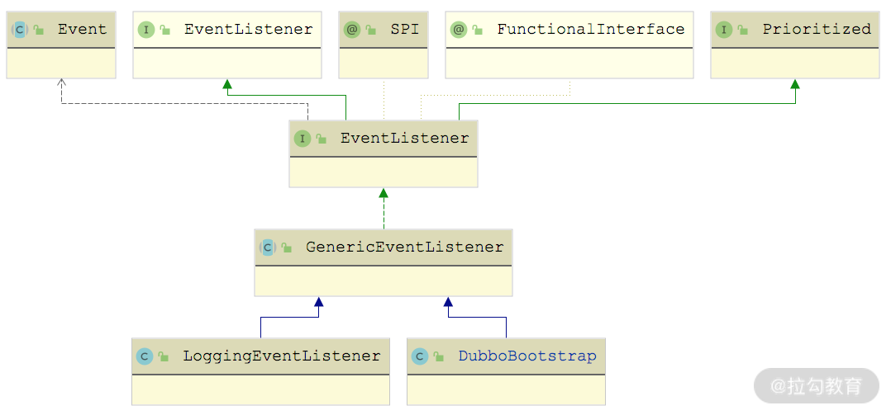
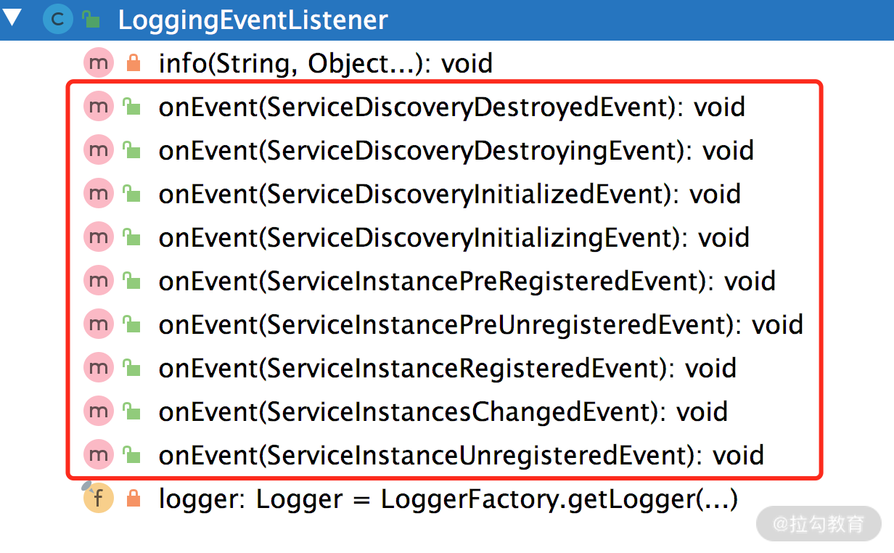

48 配置中心设计与实现：集中化配置 and 本地化配置，我都要（下）
===================================

在上一课时，我们详细分析了 Configuration 接口以及 DynamicConfiguration 接口的实现， **其中 DynamicConfiguration 接口实现是动态配置中心的基础** 。那 Dubbo 中的动态配置中心是如何启动的呢？我们将在本课时详细介绍。

### 基础配置类

在 DubboBootstrap 初始化的过程中，会调用 ApplicationModel.initFrameworkExts() 方法初始化所有 FrameworkExt 接口实现，继承关系如下图所示：



FrameworkExt 继承关系图

相关代码片段如下：

```
public static void initFrameworkExts() {

    Set<FrameworkExt> exts = ExtensionLoader.getExtensionLoader(FrameworkExt.class).getSupportedExtensionInstances();

    for (FrameworkExt ext : exts) {

        ext.initialize();

    }

}

```

**ConfigManager 用于管理当前 Dubbo 节点中全部 AbstractConfig 对象 **，其中就包括 ConfigCenterConfig 这个实现的对象，我们通过 XML、Annotation 或是 API 方式添加的配置中心的相关信息（例如，配置中心的地址、端口、协议等），会转换成 ConfigCenterConfig 对象。** 在 Environment 中维护了上一课时介绍的多个 Configuration 对象**，具体含义如下。

* propertiesConfiguration（PropertiesConfiguration 类型）：全部 OrderedPropertiesProvider 实现提供的配置以及环境变量或是 -D 参数中指定配置文件的相关配置信息。
* systemConfiguration（SystemConfiguration 类型）：-D 参数配置直接添加的配置信息。
* environmentConfiguration（EnvironmentConfiguration 类型）：环境变量中直接添加的配置信息。
* externalConfiguration、appExternalConfiguration（InmemoryConfiguration 类型）：使用 Spring 框架且将 include-spring-env 配置为 true 时，会自动从 Spring Environment 中读取配置。默认依次读取 key 为 dubbo.properties 和 application.dubbo.properties 到这里两个 InmemoryConfiguration 对象中。
* globalConfiguration（CompositeConfiguration 类型）：用于组合上述各个配置来源。
* dynamicConfiguration（CompositeDynamicConfiguration 类型）：用于组合当前全部的配置中心对应的 DynamicConfiguration。
* configCenterFirst（boolean 类型）：用于标识配置中心的配置是否为最高优先级。

在 Environment 的构造方法中会初始化上述 Configuration 对象，在 initialize() 方法中会将从 Spring Environment 中读取到的配置填充到 externalConfiguration 以及 appExternalConfiguration 中。相关的实现片段如下：

```
public Environment() {

    // 创建上述Configuration对象

    this.propertiesConfiguration = new PropertiesConfiguration();

    this.systemConfiguration = new SystemConfiguration();

    this.environmentConfiguration = new EnvironmentConfiguration();

    this.externalConfiguration = new InmemoryConfiguration();

    this.appExternalConfiguration = new InmemoryConfiguration();

}

public void initialize() throws IllegalStateException {

    // 读取对应配置，填充上述Configuration对象

    ConfigManager configManager = ApplicationModel.getConfigManager();

    Optional<Collection<ConfigCenterConfig>> defaultConfigs = configManager.getDefaultConfigCenter();

    defaultConfigs.ifPresent(configs -> {

        for (ConfigCenterConfig config : configs) {

            this.setExternalConfigMap(config.getExternalConfiguration());

            this.setAppExternalConfigMap(config.getAppExternalConfiguration());

        }

    });

this.externalConfiguration.setProperties(externalConfigurationMap);

    this.appExternalConfiguration.setProperties(appExternalConfigurationMap);

}

```

### 启动配置中心

完成了 Environment 的初始化之后，DubboBootstrap 接下来会调用 startConfigCenter() 方法启动一个或多个配置中心客户端，核心操作有两个：一个是调用 ConfigCenterConfig.refresh() 方法 **刷新配置中心的相关配置** ；另一个是通过 prepareEnvironment() 方法根据 ConfigCenterConfig 中的配置 **创建 DynamicConfiguration 对象** 。

```
private void startConfigCenter() {

    Collection<ConfigCenterConfig> configCenters = configManager.getConfigCenters();

    if (CollectionUtils.isEmpty(configCenters)) { // 未指定配置中心

        ... ... // 省略该部分逻辑

    } else {

        for (ConfigCenterConfig configCenterConfig : configCenters) { // 可能配置了多个配置中心

            configCenterConfig.refresh(); // 刷新配置

            // 检查配置中心的配置是否合法           ConfigValidationUtils.validateConfigCenterConfig(configCenterConfig);

        }

    }

    if (CollectionUtils.isNotEmpty(configCenters)) {

        // 创建CompositeDynamicConfiguration对象，用于组装多个DynamicConfiguration对象

        CompositeDynamicConfiguration compositeDynamicConfiguration = new CompositeDynamicConfiguration();

        for (ConfigCenterConfig configCenter : configCenters) {

            // 根据ConfigCenterConfig创建相应的DynamicConfig对象，并添加到CompositeDynamicConfiguration中

compositeDynamicConfiguration.addConfiguration(prepareEnvironment(configCenter));

        }

        // 将CompositeDynamicConfiguration记录到Environment中的dynamicConfiguration字段

        environment.setDynamicConfiguration(compositeDynamicConfiguration);

    }

    configManager.refreshAll(); // 刷新所有AbstractConfig配置

}

```

#### 1\. 刷新配置中心的配置

首先来看 ConfigCenterConfig.refresh() 方法，该方法会组合 Environment 对象中全部已初始化的 Configuration，然后遍历 ConfigCenterConfig 中全部字段的 setter 方法，并从 Environment 中获取对应字段的最终值。具体实现如下：

```
public void refresh() {

    // 获取Environment对象

    Environment env = ApplicationModel.getEnvironment();

    // 将当前已初始化的所有Configuration合并返回

    CompositeConfiguration compositeConfiguration = env.getPrefixedConfiguration(this);

    Method[] methods = getClass().getMethods();

    for (Method method : methods) {

        if (MethodUtils.isSetter(method)) { // 获取ConfigCenterConfig中各个字段的setter方法

            // 根据配置中心的相关配置以及Environment中的各个Configuration，获取该字段的最终值

            String value = StringUtils.trim(compositeConfiguration.getString(extractPropertyName(getClass(), method)));

            // 调用setter方法更新ConfigCenterConfig的相应字段

            if (StringUtils.isNotEmpty(value) && ClassUtils.isTypeMatch(method.getParameterTypes()[0], value)) {

                method.invoke(this, ClassUtils.convertPrimitive(method.getParameterTypes()[0], value));

            }

        } else if (isParametersSetter(method)) { // 设置parameters字段，与设置其他字段的逻辑基本类似，但是实现有所不同

            String value = StringUtils.trim(compositeConfiguration.getString(extractPropertyName(getClass(), method)));

            if (StringUtils.isNotEmpty(value)) {

                // 获取当前已有的parameters字段

                Map<String, String> map = invokeGetParameters(getClass(), this);

                map = map == null ? new HashMap<>() : map;

                // 覆盖parameters集合 

                map.putAll(convert(StringUtils.parseParameters(value), ""));

                // 设置parameters字段

                invokeSetParameters(getClass(), this, map);

            }

        }

    }

}

```

这里我们关注一下 Environment.getPrefixedConfiguration() 方法，该方法会将 Environment 中已有的 Configuration 对象以及当前的 ConfigCenterConfig 按照顺序合并，得到一个 CompositeConfiguration 对象，用于确定配置中心的最终配置信息。具体实现如下：

```
public synchronized CompositeConfiguration getPrefixedConfiguration(AbstractConfig config) {

    // 创建CompositeConfiguration对象，这里的prefix和id是根据ConfigCenterConfig确定的

    CompositeConfiguration prefixedConfiguration = new CompositeConfiguration(config.getPrefix(), config.getId());

    // 将ConfigCenterConfig封装成ConfigConfigurationAdapter

    Configuration configuration = new ConfigConfigurationAdapter(config);

    if (this.isConfigCenterFirst()) { // 根据配置确定ConfigCenterConfig配置的位置

        // The sequence would be: SystemConfiguration -> AppExternalConfiguration -> ExternalConfiguration -> AbstractConfig -> PropertiesConfiguration

        // 按序组合已有Configuration对象以及ConfigCenterConfig

        prefixedConfiguration.addConfiguration(systemConfiguration);

        prefixedConfiguration.addConfiguration(environmentConfiguration);

        prefixedConfiguration.addConfiguration(appExternalConfiguration);

        prefixedConfiguration.addConfiguration(externalConfiguration);

        prefixedConfiguration.addConfiguration(configuration);

        prefixedConfiguration.addConfiguration(propertiesConfiguration);

    } else {

        // 配置优先级如下：SystemConfiguration -> AbstractConfig -> AppExternalConfiguration -> ExternalConfiguration -> PropertiesConfiguration

        prefixedConfiguration.addConfiguration(systemConfiguration);

        prefixedConfiguration.addConfiguration(environmentConfiguration);

        prefixedConfiguration.addConfiguration(configuration);

        prefixedConfiguration.addConfiguration(appExternalConfiguration);

        prefixedConfiguration.addConfiguration(externalConfiguration);

        prefixedConfiguration.addConfiguration(propertiesConfiguration);

    }

    return prefixedConfiguration;

}

```

#### 2\. 创建 DynamicConfiguration 对象

通过 ConfigCenterConfig.refresh() 方法确定了所有配置中心的最终配置之后，接下来就会对每个配置中心执行 prepareEnvironment() 方法，得到对应的 DynamicConfiguration 对象。具体实现如下：

```
private DynamicConfiguration prepareEnvironment(ConfigCenterConfig configCenter) {

    if (configCenter.isValid()) { // 检查ConfigCenterConfig是否合法

        if (!configCenter.checkOrUpdateInited()) { 

            return null; // 检查ConfigCenterConfig是否已初始化，这里不能重复初始化

        }

        // 根据ConfigCenterConfig中的各个字段，拼接出配置中心的URL，创建对应的DynamicConfiguration对象

        DynamicConfiguration dynamicConfiguration = getDynamicConfiguration(configCenter.toUrl());

        // 从配置中心获取externalConfiguration和appExternalConfiguration，并进行覆盖

        String configContent = dynamicConfiguration.getProperties(configCenter.getConfigFile(), configCenter.getGroup());
        String appGroup = getApplication().getName();

        String appConfigContent = null;

        if (isNotEmpty(appGroup)) {

            appConfigContent = dynamicConfiguration.getProperties

                    (isNotEmpty(configCenter.getAppConfigFile()) ? configCenter.getAppConfigFile() : configCenter.getConfigFile(),

                            appGroup

                    );

        }

        try {

            // 更新Environment

            environment.setConfigCenterFirst(configCenter.isHighestPriority());

            environment.updateExternalConfigurationMap(parseProperties(configContent));

            environment.updateAppExternalConfigurationMap(parseProperties(appConfigContent));

        } catch (IOException e) {

            throw new IllegalStateException("Failed to parse configurations from Config Center.", e);

        }

        return dynamicConfiguration; // 返回通过该ConfigCenterConfig创建的DynamicConfiguration对象

    }

    return null;

}

```

完成 DynamicConfiguration 的创建之后，DubboBootstrap 会将多个配置中心对应的 DynamicConfiguration 对象封装成一个 CompositeDynamicConfiguration 对象，并记录到 Environment.dynamicConfiguration 字段中，等待后续使用。另外，还会调用全部 AbstractConfig 的 refresh() 方法（即根据最新的配置更新各个 AbstractConfig 对象的字段）。这些逻辑都在 DubboBootstrap.startConfigCenter() 方法中，前面已经展示过了，这里不再重复。

### 配置中心初始化的后续流程

完成明确指定的配置中心初始化之后，DubboBootstrap 接下来会执行 useRegistryAsConfigCenterIfNecessary() 方法，检测当前 Dubbo 是否要将注册中心也作为一个配置中心使用（常见的注册中心，都可以直接作为配置中心使用，这样可以降低运维成本）。

```
private void useRegistryAsConfigCenterIfNecessary() {

    if (environment.getDynamicConfiguration().isPresent()) {

        return; // 如果当前配置中心已经初始化完成，则不会将注册中心作为配置中心

    }

    if (CollectionUtils.isNotEmpty(configManager.getConfigCenters())) {

        return; // 明确指定了配置中心的配置，哪怕配置中心初始化失败，也不会将注册中心作为配置中心

    }

    // 从ConfigManager中获取注册中心的配置（即RegistryConfig），并转换成配置中心的配置（即ConfigCenterConfig）

    configManager.getDefaultRegistries().stream()

            .filter(registryConfig -> registryConfig.getUseAsConfigCenter() == null || registryConfig.getUseAsConfigCenter())

            .forEach(registryConfig -> {

                String protocol = registryConfig.getProtocol();

                String id = "config-center-" + protocol + "-" + registryConfig.getPort();

                ConfigCenterConfig cc = new ConfigCenterConfig();

                cc.setId(id);

                if (cc.getParameters() == null) {

                    cc.setParameters(new HashMap<>());

                }

                if (registryConfig.getParameters() != null) {

                    cc.getParameters().putAll(registryConfig.getParameters());

                }

                cc.getParameters().put(CLIENT_KEY, registryConfig.getClient());

                cc.setProtocol(registryConfig.getProtocol());

                cc.setPort(registryConfig.getPort());

                cc.setAddress(registryConfig.getAddress());

                cc.setNamespace(registryConfig.getGroup());

                cc.setUsername(registryConfig.getUsername());

                cc.setPassword(registryConfig.getPassword());

                if (registryConfig.getTimeout() != null) {

                    cc.setTimeout(registryConfig.getTimeout().longValue());

                }

                cc.setHighestPriority(false); // 这里优先级较低

                configManager.addConfigCenter(cc);

            });

    startConfigCenter(); // 重新调用startConfigCenter()方法，初始化配置中心

}

```

完成配置中心的初始化之后，后续需要 DynamicConfiguration 的地方直接从 Environment 中获取即可，例如，DynamicConfigurationServiceNameMapping 就是依赖 DynamicConfiguration 实现 Service ID 与 Service Name 映射的管理。

接下来，DubboBootstrap 执行 loadRemoteConfigs() 方法，根据前文更新后的 externalConfigurationMap 和 appExternalConfigurationMap 配置信息，确定是否配置了额外的注册中心或 Protocol，如果有，则在此处转换成 RegistryConfig 和 ProtocolConfig，并记录到 ConfigManager 中，等待后续逻辑使用。

随后，DubboBootstrap 执行 checkGlobalConfigs() 方法完成 ProviderConfig、ConsumerConfig、MetadataReportConfig 等一系列 AbstractConfig 的检查和初始化，具体实现比较简单，这里就不再展示。

再紧接着，DubboBootstrap 会通过 initMetadataService() 方法初始化 MetadataReport、MetadataReportInstance 以及 MetadataService、MetadataServiceExporter，这些元数据相关的组件在前面的课时中已经深入分析过了，这里的初始化过程并不复杂，你若感兴趣的话可以参考[源码](https://github.com/xxxlxy2008/dubbo)进行学习。

在 DubboBootstrap 初始化的最后，会调用 initEventListener() 方法将 DubboBootstrap 作为 EventListener 监听器添加到 EventDispatcher 中。DubboBootstrap 继承了 GenericEventListener 抽象类，如下图所示：



EventListener 继承关系图

**GenericEventListener 是一个泛型监听器，它可以让子类监听任意关心的 Event 事件，只需定义相关的 onEvent() 方法即可**。在 GenericEventListener 中维护了一个 handleEventMethods 集合，其中 Key 是 Event 的子类，即监听器关心的事件，Value 是处理该类型 Event 的相应 onEvent() 方法。

在 GenericEventListener 的构造方法中，通过反射将当前 GenericEventListener 实现的全部 onEvent() 方法都查找出来，并记录到 handleEventMethods 字段中。具体查找逻辑在 findHandleEventMethods() 方法中实现：

```
private Map<Class<?>, Set<Method>> findHandleEventMethods() {

    Map<Class<?>, Set<Method>> eventMethods = new HashMap<>();

    of(getClass().getMethods()) // 遍历当前GenericEventListener子类的全部方法

            // 过滤得到onEvent()方法，具体过滤条件在isHandleEventMethod()方法之中：

            // 1.方法必须是public的

            // 2.方法参数列表只有一个参数，且该参数为Event子类

            // 3.方法返回值为void，且没有声明抛出异常

            .filter(this::isHandleEventMethod) 

            .forEach(method -> {

                Class<?> paramType = method.getParameterTypes()[0];

                Set<Method> methods = eventMethods.computeIfAbsent(paramType, key -> new LinkedHashSet<>());

                methods.add(method);

            });

    return eventMethods;

}

```

在 GenericEventListener 的 onEvent() 方法中，会根据收到的 Event 事件的具体类型，从 handleEventMethods 集合中找到相应的 onEvent() 方法进行调用，如下所示：

```
public final void onEvent(Event event) {

    // 获取Event的实际类型

    Class<?> eventClass = event.getClass(); 

    // 根据Event的类型获取对应的onEvent()方法并调用

    handleEventMethods.getOrDefault(eventClass,  emptySet()).forEach(method -> {

        ThrowableConsumer.execute(method, m -> {

            m.invoke(this, event);

        });

    });

}

```

我们可以查看 DubboBootstrap 的所有方法，目前并没有发现符合 isHandleEventMethod() 条件的方法。但在 GenericEventListener 的另一个实现—— LoggingEventListener 中，可以看到多个符合 isHandleEventMethod() 条件的方法（如下图所示），在这些 onEvent() 方法重载中会输出 INFO 日志。



LoggingEventListener 中 onEvent 方法重载

至此，DubboBootstrap 整个初始化过程，以及该过程中与配置中心相关的逻辑就介绍完了。

### 总结

本课时我们重点介绍了 Dubbo 动态配置中心启动的核心流程，以及该流程涉及的重要组件类。

首先，我们介绍了 ConfigManager 和 Environment 这两个非常基础的配置类；然后又讲解了 DubboBootstrap 初始化动态配置中心的核心流程，以及动态配置中心启动的流程；最后，还分析了 GenericEventListener 监听器的相关内容。

关于这部分的内容，如果你有什么问题或者好的经验，欢迎你在留言区和我分享。
