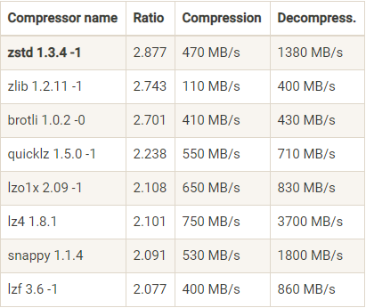

# 10 生产者压缩算法面面观

你好，我是胡夕。今天我要和你分享的内容是：生产者压缩算法面面观。

说起压缩（compression），我相信你一定不会感到陌生。它秉承了用时间去换空间的经典 trade-off 思想，具体来说就是用 CPU 时间去换磁盘空间或网络 I/O 传输量，希望以较小的 CPU 开销带来更少的磁盘占用或更少的网络 I/O 传输。在 Kafka 中，压缩也是用来做这件事的。今天我就来跟你分享一下 Kafka 中压缩的那些事儿。

## 怎么压缩？

Kafka 是如何压缩消息的呢？要弄清楚这个问题，就要从 Kafka 的消息格式说起了。目前 Kafka 共有两大类消息格式，社区分别称之为 V1 版本和 V2 版本。V2 版本是 Kafka 0.11.0.0 中正式引入的。

不论是哪个版本，Kafka 的消息层次都分为两层：消息集合（message set）以及消息（message）。一个消息集合中包含若干条日志项（record item），而日志项才是真正封装消息的地方。Kafka 底层的消息日志由一系列消息集合日志项组成。Kafka 通常不会直接操作具体的一条条消息，它总是在消息集合这个层面上进行写入操作。

那么社区引入 V2 版本的目的是什么呢？V2 版本主要是针对 V1 版本的一些弊端做了修正，和我们今天讨论的主题相关的修正有哪些呢？先介绍一个，就是把消息的公共部分抽取出来放到外层消息集合里面，这样就不用每条消息都保存这些信息了。

我来举个例子。原来在 V1 版本中，每条消息都需要执行 CRC 校验，但有些情况下消息的 CRC 值是会发生变化的。比如在 Broker 端可能会对消息时间戳字段进行更新，那么重新计算之后的 CRC 值也会相应更新；再比如 Broker 端在执行消息格式转换时（主要是为了兼容老版本客户端程序），也会带来 CRC 值的变化。鉴于这些情况，再对每条消息都执行 CRC 校验就有点没必要了，不仅浪费空间还耽误 CPU 时间，因此在 V2 版本中，消息的 CRC 校验工作就被移到了消息集合这一层。

V2 版本还有一个和压缩息息相关的改进，就是保存压缩消息的方法发生了变化。之前 V1 版本中保存压缩消息的方法是把多条消息进行压缩然后保存到外层消息的消息体字段中；而 V2 版本的做法是对整个消息集合进行压缩。显然后者应该比前者有更好的压缩效果。

我对两个版本分别做了一个简单的测试，结果显示，在相同条件下，不论是否启用压缩，V2 版本都比 V1 版本节省磁盘空间。当启用压缩时，这种节省空间的效果更加明显，就像下面这两张图展示的那样：


## 何时压缩？

在 Kafka 中，压缩可能发生在两个地方：生产者端和 Broker 端。

生产者程序中配置 compression.type 参数即表示启用指定类型的压缩算法。比如下面这段程序代码展示了如何构建一个开启 GZIP 的 Producer 对象：

```
 Properties props = new Properties();
 props.put("bootstrap.servers", "localhost:9092");
 props.put("acks", "all");
 props.put("key.serializer", "org.apache.kafka.common.serialization.StringSerializer");
 props.put("value.serializer", "org.apache.kafka.common.serialization.StringSerializer");
 // 开启 GZIP 压缩
 props.put("compression.type", "gzip");
 Producer<String, String> producer = new KafkaProducer<>(props);
```

这里比较关键的代码行是 props.put(“compression.type”, “gzip”)，它表明该 Producer 的压缩算法使用的是 GZIP。这样 Producer 启动后生产的每个消息集合都是经 GZIP 压缩过的，故而能很好地节省网络传输带宽以及 Kafka Broker 端的磁盘占用。

在生产者端启用压缩是很自然的想法，那为什么我说在 Broker 端也可能进行压缩呢？其实大部分情况下 Broker 从 Producer 端接收到消息后仅仅是原封不动地保存而不会对其进行任何修改，但这里的“大部分情况”也是要满足一定条件的。有两种例外情况就可能让 Broker 重新压缩消息。

情况一：Broker 端指定了和 Producer 端不同的压缩算法。

先看一个例子。想象这样一个对话。

Producer 说：“我要使用 GZIP 进行压缩。”

Broker 说：“不好意思，我这边接收的消息必须使用 Snappy 算法进行压缩。”

你看，这种情况下 Broker 接收到 GZIP 压缩消息后，只能解压缩然后使用 Snappy 重新压缩一遍。如果你翻开 Kafka 官网，你会发现 Broker 端也有一个参数叫 compression.type，和上面那个例子中的同名。但是这个参数的默认值是 producer，这表示 Broker 端会“尊重”Producer 端使用的压缩算法。可一旦你在 Broker 端设置了不同的 compression.type 值，就一定要小心了，因为可能会发生预料之外的压缩 / 解压缩操作，通常表现为 Broker 端 CPU 使用率飙升。

情况二：Broker 端发生了消息格式转换。

所谓的消息格式转换主要是为了兼容老版本的消费者程序。还记得之前说过的 V1、V2 版本吧？在一个生产环境中，Kafka 集群中同时保存多种版本的消息格式非常常见。为了兼容老版本的格式，Broker 端会对新版本消息执行向老版本格式的转换。这个过程中会涉及消息的解压缩和重新压缩。一般情况下这种消息格式转换对性能是有很大影响的，除了这里的压缩之外，它还让 Kafka 丧失了引以为豪的 Zero Copy 特性。

所谓“Zero Copy”就是“零拷贝”，我在专栏\[第 6 期\]提到过，说的是当数据在磁盘和网络进行传输时避免昂贵的内核态数据拷贝，从而实现快速的数据传输。因此如果 Kafka 享受不到这个特性的话，性能必然有所损失，所以尽量保证消息格式的统一吧，这样不仅可以避免不必要的解压缩 / 重新压缩，对提升其他方面的性能也大有裨益。如果有兴趣你可以深入地了解下 Zero Copy 的原理。

## 何时解压缩？

有压缩必有解压缩！通常来说解压缩发生在消费者程序中，也就是说 Producer 发送压缩消息到 Broker 后，Broker 照单全收并原样保存起来。当 Consumer 程序请求这部分消息时，Broker 依然原样发送出去，当消息到达 Consumer 端后，由 Consumer 自行解压缩还原成之前的消息。

那么现在问题来了，Consumer 怎么知道这些消息是用何种压缩算法压缩的呢？其实答案就在消息中。Kafka 会将启用了哪种压缩算法封装进消息集合中，这样当 Consumer 读取到消息集合时，它自然就知道了这些消息使用的是哪种压缩算法。如果用一句话总结一下压缩和解压缩，那么我希望你记住这句话：\*\*Producer 端压缩、Broker 端保持、Consumer 端解压缩。\*\*除了在 Consumer 端解压缩，Broker 端也会进行解压缩。注意了，这和前面提到消息格式转换时发生的解压缩是不同的场景。每个压缩过的消息集合在 Broker 端写入时都要发生解压缩操作，目的就是为了对消息执行各种验证。我们必须承认这种解压缩对 Broker 端性能是有一定影响的，特别是对 CPU 的使用率而言。

事实上，最近国内京东的小伙伴们刚刚向社区提出了一个 bugfix，建议去掉因为做消息校验而引入的解压缩。据他们称，去掉了解压缩之后，Broker 端的 CPU 使用率至少降低了 50%。不过有些遗憾的是，目前社区并未采纳这个建议，原因就是这种消息校验是非常重要的，不可盲目去之。毕竟先把事情做对是最重要的，在做对的基础上，再考虑把事情做好做快。针对这个使用场景，你也可以思考一下，是否有一个两全其美的方案，既能避免消息解压缩也能对消息执行校验。**各种压缩算法对比**------------

那么我们来谈谈压缩算法。这可是重头戏！之前说了这么多，我们还是要比较一下各个压缩算法的优劣，这样我们才能有针对性地配置适合我们业务的压缩策略。

在 Kafka 2.1.0 版本之前，Kafka 支持 3 种压缩算法：GZIP、Snappy 和 LZ4。从 2.1.0 开始，Kafka 正式支持 Zstandard 算法（简写为 zstd）。它是 Facebook 开源的一个压缩算法，能够提供超高的压缩比（compression ratio）。

对了，看一个压缩算法的优劣，有两个重要的指标：一个指标是压缩比，原先占 100 份空间的东西经压缩之后变成了占 20 份空间，那么压缩比就是 5，显然压缩比越高越好；另一个指标就是压缩 / 解压缩吞吐量，比如每秒能压缩或解压缩多少 MB 的数据。同样地，吞吐量也是越高越好。

下面这张表是 Facebook Zstandard 官网提供的一份压缩算法 benchmark 比较结果：



从表中我们可以发现 zstd 算法有着最高的压缩比，而在吞吐量上的表现只能说中规中矩。反观 LZ4 算法，它在吞吐量方面则是毫无疑问的执牛耳者。当然对于表格中数据的权威性我不做过多解读，只想用它来说明一下当前各种压缩算法的大致表现。

## 在实际使用中，GZIP、Snappy、LZ4 甚至是 zstd 的表现各有千秋。但对于 Kafka 而言，它们的性能测试结果却出奇得一致，即在吞吐量方面：LZ4 > Snappy > zstd 和 GZIP；而在压缩比方面，zstd > LZ4 > GZIP > Snappy。具体到物理资源，使用 Snappy 算法占用的网络带宽最多，zstd 最少，这是合理的，毕竟 zstd 就是要提供超高的压缩比；在 CPU 使用率方面，各个算法表现得差不多，只是在压缩时 Snappy 算法使用的 CPU 较多一些，而在解压缩时 GZIP 算法则可能使用更多的 CPU。**最佳实践**

了解了这些算法对比，我们就能根据自身的实际情况有针对性地启用合适的压缩算法。

首先来说压缩。何时启用压缩是比较合适的时机呢？

你现在已经知道 Producer 端完成的压缩，那么启用压缩的一个条件就是 Producer 程序运行机器上的 CPU 资源要很充足。如果 Producer 运行机器本身 CPU 已经消耗殆尽了，那么启用消息压缩无疑是雪上加霜，只会适得其反。

除了 CPU 资源充足这一条件，如果你的环境中带宽资源有限，那么我也建议你开启压缩。事实上我见过的很多 Kafka 生产环境都遭遇过带宽被打满的情况。这年头，带宽可是比 CPU 和内存还要珍贵的稀缺资源，毕竟万兆网络还不是普通公司的标配，因此千兆网络中 Kafka 集群带宽资源耗尽这件事情就特别容易出现。如果你的客户端机器 CPU 资源有很多富余，我强烈建议你开启 zstd 压缩，这样能极大地节省网络资源消耗。

其次说说解压缩。其实也没什么可说的。一旦启用压缩，解压缩是不可避免的事情。这里只想强调一点：我们对不可抗拒的解压缩无能为力，但至少能规避掉那些意料之外的解压缩。就像我前面说的，因为要兼容老版本而引入的解压缩操作就属于这类。有条件的话尽量保证不要出现消息格式转换的情况。

## 小结

总结一下今天分享的内容：我们主要讨论了 Kafka 压缩的各个方面，包括 Kafka 是如何对消息进行压缩的、何时进行压缩及解压缩，还对比了目前 Kafka 支持的几个压缩算法，最后我给出了工程化的最佳实践。分享这么多内容，我就只有一个目的：就是希望你能根据自身的实际情况恰当地选择合适的 Kafka 压缩算法，以求实现最大的资源利用率。
