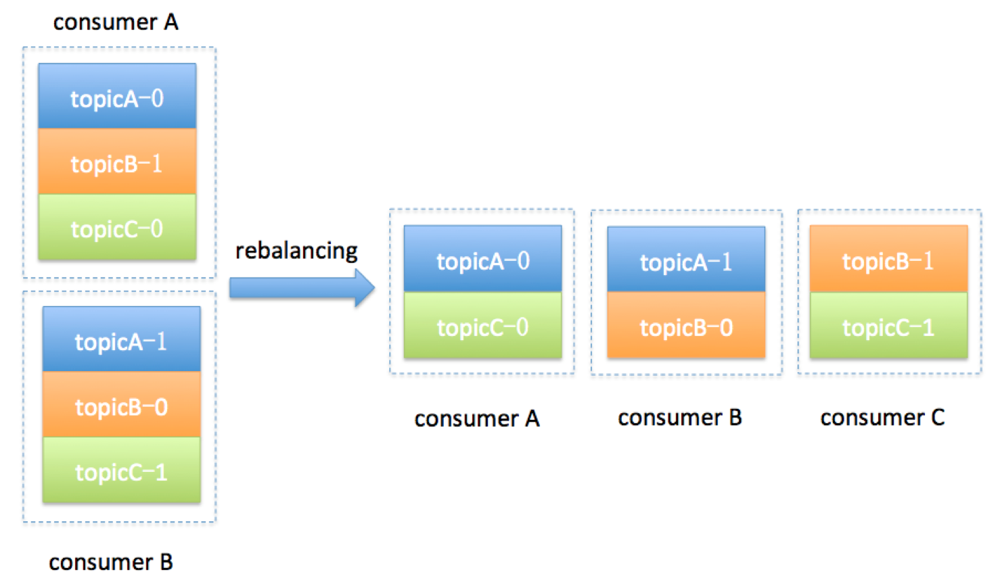

# 15 消费者组到底是什么？

你好，我是胡夕。今天我要和你分享的主题是：Kafka 的消费者组。

消费者组，即 Consumer Group，应该算是 Kafka 比较有亮点的设计了。那么何谓 Consumer Group 呢？用一句话概括就是： **Consumer Group 是 Kafka 提供的可扩展且具有容错性的消费者机制** 。既然是一个组，那么组内必然可以有多个消费者或消费者实例（Consumer Instance），它们共享一个公共的 ID，这个 ID 被称为 Group ID。组内的所有消费者协调在一起来消费订阅主题（Subscribed Topics）的所有分区（Partition）。当然，每个分区只能由同一个消费者组内的一个 Consumer 实例来消费。个人认为，理解 Consumer Group 记住下面这三个特性就好了。

1. Consumer Group 下可以有一个或多个 Consumer 实例。这里的实例可以是一个单独的进程，也可以是同一进程下的线程。在实际场景中，使用进程更为常见一些。
1. Group ID 是一个字符串，在一个 Kafka 集群中，它标识唯一的一个 Consumer Group。
1. Consumer Group 下所有实例订阅的主题的单个分区，只能分配给组内的某个 Consumer 实例消费。这个分区当然也可以被其他的 Group 消费。

你应该还记得我在专栏\[第 1 期\]中提到的两种消息引擎模型吧？它们分别是 **点对点模型和发布 / 订阅模型** ，前者也称为消费队列。当然，你要注意区分很多架构文章中涉及的消息队列与这里的消息队列。国内很多文章都习惯把消息中间件这类框架统称为消息队列，我在这里不评价这种提法是否准确，只是想提醒你注意这里所说的消息队列，特指经典的消息引擎模型。

好了，传统的消息引擎模型就是这两大类，它们各有优劣。我们来简单回顾一下。传统的消息队列模型的缺陷在于消息一旦被消费，就会从队列中被删除，而且只能被下游的一个 Consumer 消费。严格来说，这一点不算是缺陷，只能算是它的一个特性。但很显然，这种模型的伸缩性（scalability）很差，因为下游的多个 Consumer 都要“抢”这个共享消息队列的消息。发布 / 订阅模型倒是允许消息被多个 Consumer 消费，但它的问题也是伸缩性不高，因为每个订阅者都必须要订阅主题的所有分区。这种全量订阅的方式既不灵活，也会影响消息的真实投递效果。

如果有这么一种机制，既可以避开这两种模型的缺陷，又兼具它们的优点，那就太好了。幸运的是，Kafka 的 Consumer Group 就是这样的机制。当 Consumer Group 订阅了多个主题后，组内的每个实例不要求一定要订阅主题的所有分区，它只会消费部分分区中的消息。

Consumer Group 之间彼此独立，互不影响，它们能够订阅相同的一组主题而互不干涉。再加上 Broker 端的消息留存机制，Kafka 的 Consumer Group 完美地规避了上面提到的伸缩性差的问题。可以这么说， **Kafka 仅仅使用 Consumer Group 这一种机制，却同时实现了传统消息引擎系统的两大模型** ：如果所有实例都属于同一个 Group，那么它实现的就是消息队列模型；如果所有实例分别属于不同的 Group，那么它实现的就是发布 / 订阅模型。

在了解了 Consumer Group 以及它的设计亮点之后，你可能会有这样的疑问：在实际使用场景中，我怎么知道一个 Group 下该有多少个 Consumer 实例呢？\*\*理想情况下，Consumer 实例的数量应该等于该 Group 订阅主题的分区总数。\*\*举个简单的例子，假设一个 Consumer Group 订阅了 3 个主题，分别是 A、B、C，它们的分区数依次是 1、2、3，那么通常情况下，为该 Group 设置 6 个 Consumer 实例是比较理想的情形，因为它能最大限度地实现高伸缩性。

你可能会问，我能设置小于或大于 6 的实例吗？当然可以！如果你有 3 个实例，那么平均下来每个实例大约消费 2 个分区（6 / 3 = 2）；如果你设置了 8 个实例，那么很遗憾，有 2 个实例（8 – 6 = 2）将不会被分配任何分区，它们永远处于空闲状态。因此，在实际使用过程中一般不推荐设置大于总分区数的 Consumer 实例。设置多余的实例只会浪费资源，而没有任何好处。

好了，说完了 Consumer Group 的设计特性，我们来讨论一个问题：针对 Consumer Group，Kafka 是怎么管理位移的呢？你还记得吧，消费者在消费的过程中需要记录自己消费了多少数据，即消费位置信息。在 Kafka 中，这个位置信息有个专门的术语：位移（Offset）。

看上去该 Offset 就是一个数值而已，其实对于 Consumer Group 而言，它是一组 KV 对，Key 是分区，V 对应 Consumer 消费该分区的最新位移。如果用 Java 来表示的话，你大致可以认为是这样的数据结构，即 Map\<TopicPartition, Long>，其中 TopicPartition 表示一个分区，而 Long 表示位移的类型。当然，我必须承认 Kafka 源码中并不是这样简单的数据结构，而是要比这个复杂得多，不过这并不会妨碍我们对 Group 位移的理解。

我在专栏\[第 4 期\]中提到过 Kafka 有新旧客户端 API 之分，那自然也就有新旧 Consumer 之分。老版本的 Consumer 也有消费者组的概念，它和我们目前讨论的 Consumer Group 在使用感上并没有太多的不同，只是它管理位移的方式和新版本是不一样的。

老版本的 Consumer Group 把位移保存在 ZooKeeper 中。Apache ZooKeeper 是一个分布式的协调服务框架，Kafka 重度依赖它实现各种各样的协调管理。将位移保存在 ZooKeeper 外部系统的做法，最显而易见的好处就是减少了 Kafka Broker 端的状态保存开销。现在比较流行的提法是将服务器节点做成无状态的，这样可以自由地扩缩容，实现超强的伸缩性。Kafka 最开始也是基于这样的考虑，才将 Consumer Group 位移保存在独立于 Kafka 集群之外的框架中。

不过，慢慢地人们发现了一个问题，即 ZooKeeper 这类元框架其实并不适合进行频繁的写更新，而 Consumer Group 的位移更新却是一个非常频繁的操作。这种大吞吐量的写操作会极大地拖慢 ZooKeeper 集群的性能，因此 Kafka 社区渐渐有了这样的共识：将 Consumer 位移保存在 ZooKeeper 中是不合适的做法。

于是，在新版本的 Consumer Group 中，Kafka 社区重新设计了 Consumer Group 的位移管理方式，采用了将位移保存在 Kafka 内部主题的方法。这个内部主题就是让人既爱又恨的 \_\_consumer_offsets。我会在专栏后面的内容中专门介绍这个神秘的主题。不过，现在你需要记住新版本的 Consumer Group 将位移保存在 Broker 端的内部主题中。

最后，我们来说说 Consumer Group 端大名鼎鼎的重平衡，也就是所谓的 Rebalance 过程。我形容其为“大名鼎鼎”，从某种程度上来说其实也是“臭名昭著”，因为有关它的 bug 真可谓是此起彼伏，从未间断。这里我先卖个关子，后面我会解释它“遭人恨”的地方。我们先来了解一下什么是 Rebalance。**Rebalance 本质上是一种协议，规定了一个 Consumer Group 下的所有 Consumer 如何达成一致，来分配订阅 Topic 的每个分区**。比如某个 Group 下有 20 个 Consumer 实例，它订阅了一个具有 100 个分区的 Topic。正常情况下，Kafka 平均会为每个 Consumer 分配 5 个分区。这个分配的过程就叫 Rebalance。

那么 Consumer Group 何时进行 Rebalance 呢？Rebalance 的触发条件有 3 个。

1. 组成员数发生变更。比如有新的 Consumer 实例加入组或者离开组，抑或是有 Consumer 实例崩溃被“踢出”组。
1. 订阅主题数发生变更。Consumer Group 可以使用正则表达式的方式订阅主题，比如 consumer.subscribe(Pattern.compile(“t.\*c”)) 就表明该 Group 订阅所有以字母 t 开头、字母 c 结尾的主题。在 Consumer Group 的运行过程中，你新创建了一个满足这样条件的主题，那么该 Group 就会发生 Rebalance。
1. 订阅主题的分区数发生变更。Kafka 当前只能允许增加一个主题的分区数。当分区数增加时，就会触发订阅该主题的所有 Group 开启 Rebalance。

Rebalance 发生时，Group 下所有的 Consumer 实例都会协调在一起共同参与。你可能会问，每个 Consumer 实例怎么知道应该消费订阅主题的哪些分区呢？这就需要分配策略的协助了。

当前 Kafka 默认提供了 3 种分配策略，每种策略都有一定的优势和劣势，我们今天就不展开讨论了，你只需要记住社区会不断地完善这些策略，保证提供最公平的分配策略，即每个 Consumer 实例都能够得到较为平均的分区数。比如一个 Group 内有 10 个 Consumer 实例，要消费 100 个分区，理想的分配策略自然是每个实例平均得到 10 个分区。这就叫公平的分配策略。如果出现了严重的分配倾斜，势必会出现这种情况：有的实例会“闲死”，而有的实例则会“忙死”。

我们举个简单的例子来说明一下 Consumer Group 发生 Rebalance 的过程。假设目前某个 Consumer Group 下有两个 Consumer，比如 A 和 B，当第三个成员 C 加入时，Kafka 会触发 Rebalance，并根据默认的分配策略重新为 A、B 和 C 分配分区，如下图所示：

显然，Rebalance 之后的分配依然是公平的，即每个 Consumer 实例都获得了 3 个分区的消费权。这是我们希望出现的情形。

讲完了 Rebalance，现在我来说说它“遭人恨”的地方。

首先，Rebalance 过程对 Consumer Group 消费过程有极大的影响。如果你了解 JVM 的垃圾回收机制，你一定听过万物静止的收集方式，即著名的 stop the world，简称 STW。在 STW 期间，所有应用线程都会停止工作，表现为整个应用程序僵在那边一动不动。Rebalance 过程也和这个类似，在 Rebalance 过程中，所有 Consumer 实例都会停止消费，等待 Rebalance 完成。这是 Rebalance 为人诟病的一个方面。

其次，目前 Rebalance 的设计是所有 Consumer 实例共同参与，全部重新分配所有分区。其实更高效的做法是尽量减少分配方案的变动。例如实例 A 之前负责消费分区 1、2、3，那么 Rebalance 之后，如果可能的话，最好还是让实例 A 继续消费分区 1、2、3，而不是被重新分配其他的分区。这样的话，实例 A 连接这些分区所在 Broker 的 TCP 连接就可以继续用，不用重新创建连接其他 Broker 的 Socket 资源。

最后，Rebalance 实在是太慢了。曾经，有个国外用户的 Group 内有几百个 Consumer 实例，成功 Rebalance 一次要几个小时！这完全是不能忍受的。最悲剧的是，目前社区对此无能为力，至少现在还没有特别好的解决方案。所谓“本事大不如不摊上”，也许最好的解决方案就是避免 Rebalance 的发生吧。

## 小结

总结一下，今天我跟你分享了 Kafka Consumer Group 的方方面面，包括它是怎么定义的，它解决了哪些问题，有哪些特性。同时，我们也聊到了 Consumer Group 的位移管理以及著名的 Rebalance 过程。希望在你开发 Consumer 应用时，它们能够助你一臂之力。
