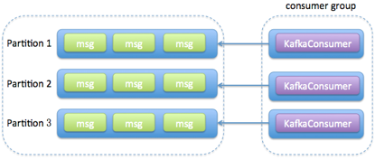
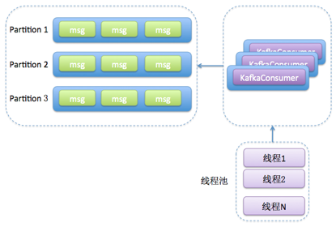
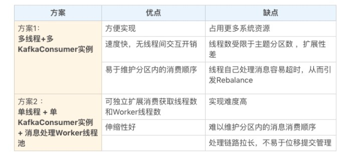

20 多线程开发消费者实例
=============

你好，我是胡夕。今天我们来聊聊 Kafka Java Consumer 端多线程消费的实现方案。

目前，计算机的硬件条件已经大大改善，即使是在普通的笔记本电脑上，多核都已经是标配了，更不用说专业的服务器了。如果跑在强劲服务器机器上的应用程序依然是单线程架构，那实在是有点暴殄天物了。不过，Kafka Java Consumer 就是单线程的设计，你是不是感到很惊讶。所以，探究它的多线程消费方案，就显得非常必要了。

Kafka Java Consumer 设计原理
------------------------

在开始探究之前，我先简单阐述下 Kafka Java Consumer 为什么采用单线程的设计。了解了这一点，对我们后面制定多线程方案大有裨益。

谈到 Java Consumer API，最重要的当属它的入口类 KafkaConsumer 了。我们说 KafkaConsumer 是单线程的设计，严格来说这是不准确的。因为，从 Kafka 0.10.1.0 版本开始，KafkaConsumer 就变为了双线程的设计，即 **用户主线程和心跳线程** 。

**所谓用户主线程，就是你启动 Consumer 应用程序 main 方法的那个线程，而新引入的心跳线程（Heartbeat Thread）只负责定期给对应的 Broker 机器发送心跳请求，以标识消费者应用的存活性（liveness）**。引入这个心跳线程还有一个目的，那就是期望它能将心跳频率与主线程调用 KafkaConsumer.poll 方法的频率分开，从而解耦真实的消息处理逻辑与消费者组成员存活性管理。

不过，虽然有心跳线程，但实际的消息获取逻辑依然是在用户主线程中完成的。因此，在消费消息的这个层面上，我们依然可以安全地认为 KafkaConsumer 是单线程的设计。

其实，在社区推出 Java Consumer API 之前，Kafka 中存在着一组统称为 Scala Consumer 的 API。这组 API，或者说这个 Consumer，也被称为老版本 Consumer，目前在新版的 Kafka 代码中已经被完全移除了。

我之所以重提旧事，是想告诉你，老版本 Consumer 是多线程的架构，每个 Consumer 实例在内部为所有订阅的主题分区创建对应的消息获取线程，也称 Fetcher 线程。老版本 Consumer 同时也是阻塞式的（blocking），Consumer 实例启动后，内部会创建很多阻塞式的消息获取迭代器。但在很多场景下，Consumer 端是有非阻塞需求的，比如在流处理应用中执行过滤（filter）、连接（join）、分组（group by）等操作时就不能是阻塞式的。基于这个原因，社区为新版本 Consumer 设计了单线程 + 轮询的机制。这种设计能够较好地实现非阻塞式的消息获取。

除此之外，单线程的设计能够简化 Consumer 端的设计。Consumer 获取到消息后，处理消息的逻辑是否采用多线程，完全由你决定。这样，你就拥有了把消息处理的多线程管理策略从 Consumer 端代码中剥离的权利。

另外，不论使用哪种编程语言，单线程的设计都比较容易实现。相反，并不是所有的编程语言都能够很好地支持多线程。从这一点上来说，单线程设计的 Consumer 更容易移植到其他语言上。毕竟，Kafka 社区想要打造上下游生态的话，肯定是希望出现越来越多的客户端的。

多线程方案
-----

了解了单线程的设计原理之后，我们来具体分析一下 KafkaConsumer 这个类的使用方法，以及如何推演出对应的多线程方案。

首先，我们要明确的是，KafkaConsumer 类不是线程安全的 (thread-safe)。所有的网络 I/O 处理都是发生在用户主线程中，因此，你在使用过程中必须要确保线程安全。简单来说，就是你不能在多个线程中共享同一个 KafkaConsumer 实例，否则程序会抛出 ConcurrentModificationException 异常。

当然了，这也不是绝对的。KafkaConsumer 中有个方法是例外的，它就是**wakeup()**，你可以在其他线程中安全地调用\*\*KafkaConsumer.wakeup()\*\*来唤醒 Consumer。

鉴于 KafkaConsumer 不是线程安全的事实，我们能够制定两套多线程方案。

1. **消费者程序启动多个线程，每个线程维护专属的 KafkaConsumer 实例，负责完整的消息获取、消息处理流程**。如下图所示：



1.**消费者程序使用单或多线程获取消息，同时创建多个消费线程执行消息处理逻辑 **。获取消息的线程可以是一个，也可以是多个，每个线程维护专属的 KafkaConsumer 实例，处理消息则交由** 特定的线程池**来做，从而实现消息获取与消息处理的真正解耦。具体架构如下图所示：



总体来说，这两种方案都会创建多个线程，这些线程都会参与到消息的消费过程中，但各自的思路是不一样的。

我们来打个比方。比如一个完整的消费者应用程序要做的事情是 1、2、3、4、5，那么方案 1 的思路是**粗粒度化 **的工作划分，也就是说方案 1 会创建多个线程，每个线程完整地执行 1、2、3、4、5，以实现并行处理的目标，它不会进一步分割具体的子任务；而方案 2 则更** 细粒度化**，它会将 1、2 分割出来，用单线程（也可以是多线程）来做，对于 3、4、5，则用另外的多个线程来做。

这两种方案孰优孰劣呢？应该说是各有千秋。我总结了一下这两种方案的优缺点，我们先来看看下面这张表格。



接下来，我来具体解释一下表格中的内容。

我们先看方案 1，它的优势有 3 点。

1. 实现起来简单，因为它比较符合目前我们使用 Consumer API 的习惯。我们在写代码的时候，使用多个线程并在每个线程中创建专属的 KafkaConsumer 实例就可以了。
2. 多个线程之间彼此没有任何交互，省去了很多保障线程安全方面的开销。
3. 由于每个线程使用专属的 KafkaConsumer 实例来执行消息获取和消息处理逻辑，因此，Kafka 主题中的每个分区都能保证只被一个线程处理，这样就很容易实现分区内的消息消费顺序。这对在乎事件先后顺序的应用场景来说，是非常重要的优势。

说完了方案 1 的优势，我们来看看这个方案的不足之处。

1. 每个线程都维护自己的 KafkaConsumer 实例，必然会占用更多的系统资源，比如内存、TCP 连接等。在资源紧张的系统环境中，方案 1 的这个劣势会表现得更加明显。
2. 这个方案能使用的线程数受限于 Consumer 订阅主题的总分区数。我们知道，在一个消费者组中，每个订阅分区都只能被组内的一个消费者实例所消费。假设一个消费者组订阅了 100 个分区，那么方案 1 最多只能扩展到 100 个线程，多余的线程无法分配到任何分区，只会白白消耗系统资源。当然了，这种扩展性方面的局限可以被多机架构所缓解。除了在一台机器上启用 100 个线程消费数据，我们也可以选择在 100 台机器上分别创建 1 个线程，效果是一样的。因此，如果你的机器资源很丰富，这个劣势就不足为虑了。
3. 每个线程完整地执行消息获取和消息处理逻辑。一旦消息处理逻辑很重，造成消息处理速度慢，就很容易出现不必要的 Rebalance，从而引发整个消费者组的消费停滞。这个劣势你一定要注意。我们之前讨论过如何避免 Rebalance，如果你不记得的话，可以回到专栏第 17 讲复习一下。

下面我们来说说方案 2。

与方案 1 的粗粒度不同，方案 2 将任务切分成了**消息获取 **和** 消息处理 **两个部分，分别由不同的线程处理它们。比起方案 1，方案 2 的最大优势就在于它的** 高伸缩性**，就是说我们可以独立地调节消息获取的线程数，以及消息处理的线程数，而不必考虑两者之间是否相互影响。如果你的消费获取速度慢，那么增加消费获取的线程数即可；如果是消息的处理速度慢，那么增加 Worker 线程池线程数即可。

不过，这种架构也有它的缺陷。

1. 它的实现难度要比方案 1 大得多，毕竟它有两组线程，你需要分别管理它们。
2. 因为该方案将消息获取和消息处理分开了，也就是说获取某条消息的线程不是处理该消息的线程，因此无法保证分区内的消费顺序。举个例子，比如在某个分区中，消息 1 在消息 2 之前被保存，那么 Consumer 获取消息的顺序必然是消息 1 在前，消息 2 在后，但是，后面的 Worker 线程却有可能先处理消息 2，再处理消息 1，这就破坏了消息在分区中的顺序。还是那句话，如果你在意 Kafka 中消息的先后顺序，方案 2 的这个劣势是致命的。
3. 方案 2 引入了多组线程，使得整个消息消费链路被拉长，最终导致正确位移提交会变得异常困难，结果就是可能会出现消息的重复消费。如果你在意这一点，那么我不推荐你使用方案 2。

实现代码示例
------

讲了这么多纯理论的东西，接下来，我们来看看实际的实现代码大概是什么样子。毕竟，就像 Linus 说的：“Talk is cheap, show me the code!”

我先跟你分享一段方案 1 的主体代码：

```
public class KafkaConsumerRunner implements Runnable {

     private final AtomicBoolean closed = new AtomicBoolean(false);

     private final KafkaConsumer consumer;

 

 

     public void run() {

         try {

             consumer.subscribe(Arrays.asList("topic"));

             while (!closed.get()) {

   ConsumerRecords records = 

    consumer.poll(Duration.ofMillis(10000));

                 //  执行消息处理逻辑

             }

         } catch (WakeupException e) {

             // Ignore exception if closing

             if (!closed.get()) throw e;

         } finally {

             consumer.close();

         }

     }

 

 

     // Shutdown hook which can be called from a separate thread

     public void shutdown() {

         closed.set(true);

         consumer.wakeup();

     }

```

这段代码创建了一个 Runnable 类，表示执行消费获取和消费处理的逻辑。每个 KafkaConsumerRunner 类都会创建一个专属的 KafkaConsumer 实例。在实际应用中，你可以创建多个 KafkaConsumerRunner 实例，并依次执行启动它们，以实现方案 1 的多线程架构。

对于方案 2 来说，核心的代码是这样的：

```
private final KafkaConsumer<String, String> consumer;

private ExecutorService executors;

...

 

 

private int workerNum = ...;

executors = new ThreadPoolExecutor(

 workerNum, workerNum, 0L, TimeUnit.MILLISECONDS,

 new ArrayBlockingQueue<>(1000), 

 new ThreadPoolExecutor.CallerRunsPolicy());

 

 

...

while (true)  {

 ConsumerRecords<String, String> records = 

  consumer.poll(Duration.ofSeconds(1));

 for (final ConsumerRecord record : records) {

  executors.submit(new Worker(record));

 }

}

..

```

这段代码最重要的地方是我标为橙色的那个语句：当 Consumer 的 poll 方法返回消息后，由专门的线程池来负责处理具体的消息。调用 poll 方法的主线程不负责消息处理逻辑，这样就实现了方案 2 的多线程架构。

小结
--

总结一下，今天我跟你分享了 Kafka Java Consumer 多线程消费的实现方案。我给出了比较通用的两种方案，并介绍了它们各自的优缺点以及代码示例。我希望你能根据这些内容，结合你的实际业务场景，实现适合你自己的多线程架构，真正做到举一反三、融会贯通，彻底掌握多线程消费的精髓，从而在日后实现更宏大的系统。
