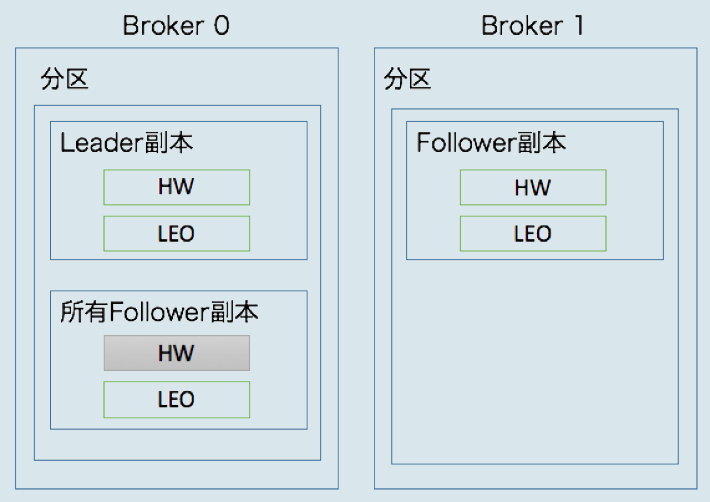
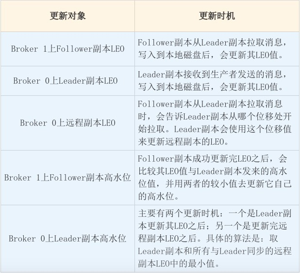
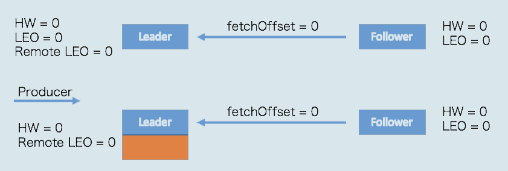
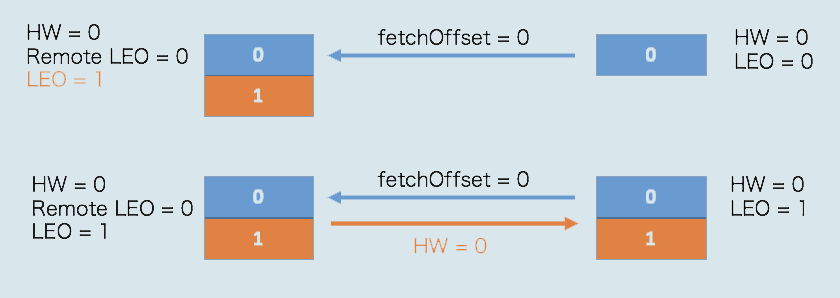
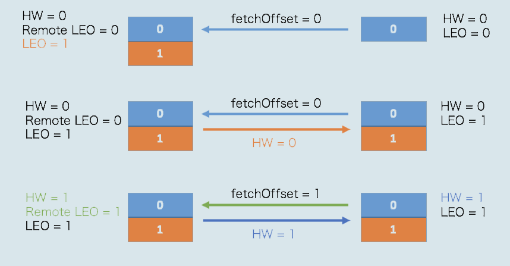
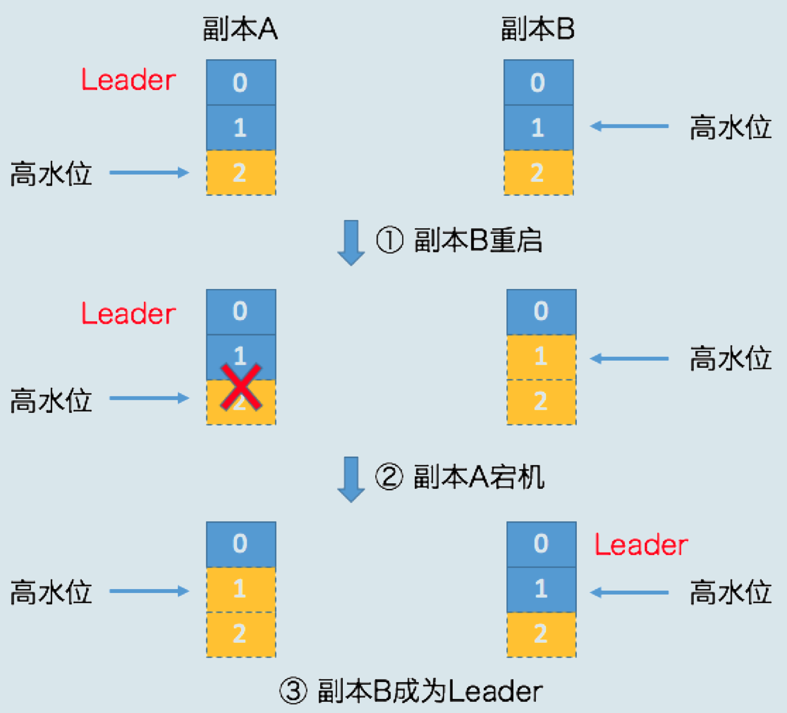
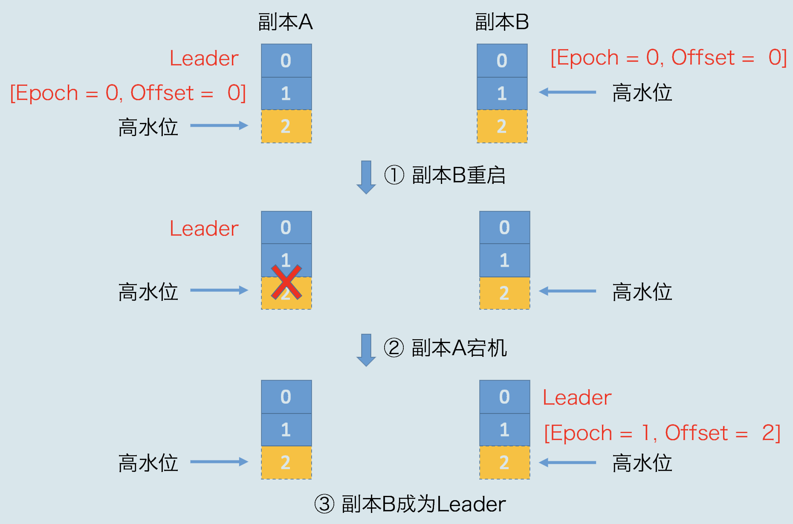
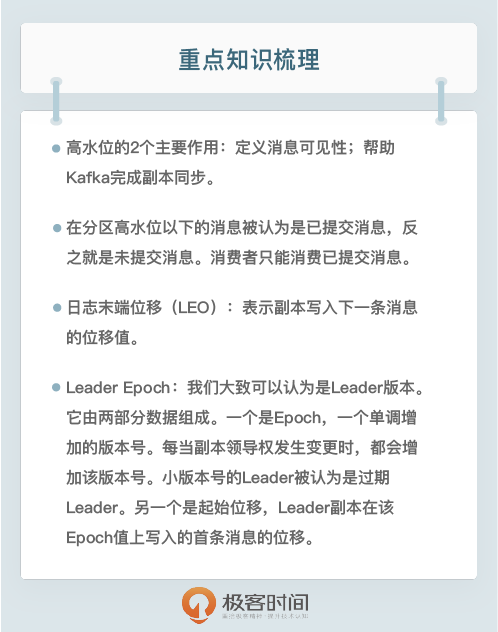

27 关于高水位和Leader Epoch的讨论
========================

你好，我是胡夕。今天我要和你分享的主题是：Kafka 中的高水位和 Leader Epoch 机制。

你可能听说过高水位（High Watermark），但不一定耳闻过 Leader Epoch。前者是 Kafka 中非常重要的概念，而后者是社区在 0.11 版本中新推出的，主要是为了弥补高水位机制的一些缺陷。鉴于高水位机制在 Kafka 中举足轻重，而且深受各路面试官的喜爱，今天我们就来重点说说高水位。当然，我们也会花一部分时间来讨论 Leader Epoch 以及它的角色定位。

什么是高水位？
-------

首先，我们要明确一下基本的定义：什么是高水位？或者说什么是水位？水位一词多用于流式处理领域，比如，Spark Streaming 或 Flink 框架中都有水位的概念。教科书中关于水位的经典定义通常是这样的：

> 在时刻 T，任意创建时间（Event Time）为 T’，且 T’≤T 的所有事件都已经到达或被观测到，那么 T 就被定义为水位。

“Streaming System”一书则是这样表述水位的：

> 水位是一个单调增加且表征最早未完成工作（oldest work not yet completed）的时间戳。

为了帮助你更好地理解水位，我借助这本书里的一张图来说明一下。

图中标注“Completed”的蓝色部分代表已完成的工作，标注“In-Flight”的红色部分代表正在进行中的工作，两者的边界就是水位线。

在 Kafka 的世界中，水位的概念有一点不同。Kafka 的水位不是时间戳，更与时间无关。它是和位置信息绑定的，具体来说，它是用消息位移来表征的。另外，Kafka 源码使用的表述是高水位，因此，今天我也会统一使用“高水位”或它的缩写 HW 来进行讨论。值得注意的是，Kafka 中也有低水位（Low Watermark），它是与 Kafka 删除消息相关联的概念，与今天我们要讨论的内容没有太多联系，我就不展开讲了。

高水位的作用
------

在 Kafka 中，高水位的作用主要有 2 个。

1. 定义消息可见性，即用来标识分区下的哪些消息是可以被消费者消费的。
2. 帮助 Kafka 完成副本同步。

下面这张图展示了多个与高水位相关的 Kafka 术语。我来详细解释一下图中的内容，同时澄清一些常见的误区。

我们假设这是某个分区 Leader 副本的高水位图。首先，请你注意图中的“已提交消息”和“未提交消息”。我们之前在专栏\[第 11 讲\]谈到 Kafka 持久性保障的时候，特意对两者进行了区分。现在，我借用高水位再次强调一下。在分区高水位以下的消息被认为是已提交消息，反之就是未提交消息。消费者只能消费已提交消息，即图中位移小于 8 的所有消息。注意，这里我们不讨论 Kafka 事务，因为事务机制会影响消费者所能看到的消息的范围，它不只是简单依赖高水位来判断。它依靠一个名为 LSO（Log Stable Offset）的位移值来判断事务型消费者的可见性。

另外，需要关注的是， **位移值等于高水位的消息也属于未提交消息。也就是说，高水位上的消息是不能被消费者消费的** 。

图中还有一个日志末端位移的概念，即 Log End Offset，简写是 LEO。它表示副本写入下一条消息的位移值。注意，数字 15 所在的方框是虚线，这就说明，这个副本当前只有 15 条消息，位移值是从 0 到 14，下一条新消息的位移是 15。显然，介于高水位和 LEO 之间的消息就属于未提交消息。这也从侧面告诉了我们一个重要的事实，那就是： **同一个副本对象，其高水位值不会大于 LEO 值** 。

**高水位和 LEO 是副本对象的两个重要属性 **。Kafka 所有副本都有对应的高水位和 LEO 值，而不仅仅是 Leader 副本。只不过 Leader 副本比较特殊，Kafka 使用 Leader 副本的高水位来定义所在分区的高水位。换句话说，** 分区的高水位就是其 Leader 副本的高水位**。

高水位更新机制
-------

现在，我们知道了每个副本对象都保存了一组高水位值和 LEO 值，但实际上，在 Leader 副本所在的 Broker 上，还保存了其他 Follower 副本的 LEO 值。我们一起来看看下面这张图。

在这张图中，我们可以看到，Broker 0 上保存了某分区的 Leader 副本和所有 Follower 副本的 LEO 值，而 Broker 1 上仅仅保存了该分区的某个 Follower 副本。Kafka 把 Broker 0 上保存的这些 Follower 副本又称为**远程副本**（Remote Replica）。Kafka 副本机制在运行过程中，会更新 Broker 1 上 Follower 副本的高水位和 LEO 值，同时也会更新 Broker 0 上 Leader 副本的高水位和 LEO 以及所有远程副本的 LEO，但它不会更新远程副本的高水位值，也就是我在图中标记为灰色的部分。

为什么要在 Broker 0 上保存这些远程副本呢？其实，它们的主要作用是，**帮助 Leader 副本确定其高水位，也就是分区高水位**。

为了帮助你更好地记忆这些值被更新的时机，我做了一张表格。只有搞清楚了更新机制，我们才能开始讨论 Kafka 副本机制的原理，以及它是如何使用高水位来执行副本消息同步的。

在这里，我稍微解释一下，什么叫与 Leader 副本保持同步。判断的条件有两个。

1. 该远程 Follower 副本在 ISR 中。
2. 该远程 Follower 副本 LEO 值落后于 Leader 副本 LEO 值的时间，不超过 Broker 端参数 replica.lag.time.max.ms 的值。如果使用默认值的话，就是不超过 10 秒。

乍一看，这两个条件好像是一回事，因为目前某个副本能否进入 ISR 就是靠第 2 个条件判断的。但有些时候，会发生这样的情况：即 Follower 副本已经“追上”了 Leader 的进度，却不在 ISR 中，比如某个刚刚重启回来的副本。如果 Kafka 只判断第 1 个条件的话，就可能出现某些副本具备了“进入 ISR”的资格，但却尚未进入到 ISR 中的情况。此时，分区高水位值就可能超过 ISR 中副本 LEO，而高水位 > LEO 的情形是不被允许的。

下面，我们分别从 Leader 副本和 Follower 副本两个维度，来总结一下高水位和 LEO 的更新机制。**Leader 副本**处理生产者请求的逻辑如下：

1. 写入消息到本地磁盘。
2. 更新分区高水位值。 i. 获取 Leader 副本所在 Broker 端保存的所有远程副本 LEO 值{LEO-1，LEO-2，……，LEO-n}。 ii. 获取 Leader 副本高水位值：currentHW。 iii. 更新 currentHW = min(currentHW, LEO-1，LEO-2，……，LEO-n)。

处理 Follower 副本拉取消息的逻辑如下：

1. 读取磁盘（或页缓存）中的消息数据。
2. 使用 Follower 副本发送请求中的位移值更新远程副本 LEO 值。
3. 更新分区高水位值（具体步骤与处理生产者请求的步骤相同）。**Follower 副本**从 Leader 拉取消息的处理逻辑如下：

1. 写入消息到本地磁盘。
2. 更新 LEO 值。
3. 更新高水位值。 i. 获取 Leader 发送的高水位值：currentHW。 ii. 获取步骤 2 中更新过的 LEO 值：currentLEO。 iii. 更新高水位为 min(currentHW, currentLEO)。

副本同步机制解析
--------

搞清楚了这些值的更新机制之后，我来举一个实际的例子，说明一下 Kafka 副本同步的全流程。该例子使用一个单分区且有两个副本的主题。

当生产者发送一条消息时，Leader 和 Follower 副本对应的高水位是怎么被更新的呢？我给出了一些图片，我们一一来看。

首先是初始状态。下面这张图中的 remote LEO 就是刚才的远程副本的 LEO 值。在初始状态时，所有值都是 0。

当生产者给主题分区发送一条消息后，状态变更为：

此时，Leader 副本成功将消息写入了本地磁盘，故 LEO 值被更新为 1。

Follower 再次尝试从 Leader 拉取消息。和之前不同的是，这次有消息可以拉取了，因此状态进一步变更为：

这时，Follower 副本也成功地更新 LEO 为 1。此时，Leader 和 Follower 副本的 LEO 都是 1，但各自的高水位依然是 0，还没有被更新。**它们需要在下一轮的拉取中被更新**，如下图所示：

在新一轮的拉取请求中，由于位移值是 0 的消息已经拉取成功，因此 Follower 副本这次请求拉取的是位移值 =1 的消息。Leader 副本接收到此请求后，更新远程副本 LEO 为 1，然后更新 Leader 高水位为 1。做完这些之后，它会将当前已更新过的高水位值 1 发送给 Follower 副本。Follower 副本接收到以后，也将自己的高水位值更新成 1。至此，一次完整的消息同步周期就结束了。事实上，Kafka 就是利用这样的机制，实现了 Leader 和 Follower 副本之间的同步。

Leader Epoch 登场
---------------

故事讲到这里似乎很完美，依托于高水位，Kafka 既界定了消息的对外可见性，又实现了异步的副本同步机制。不过，我们还是要思考一下这里面存在的问题。

从刚才的分析中，我们知道，Follower 副本的高水位更新需要一轮额外的拉取请求才能实现。如果把上面那个例子扩展到多个 Follower 副本，情况可能更糟，也许需要多轮拉取请求。也就是说，Leader 副本高水位更新和 Follower 副本高水位更新在时间上是存在错配的。这种错配是很多“数据丢失”或“数据不一致”问题的根源。基于此，社区在 0.11 版本正式引入了 Leader Epoch 概念，来规避因高水位更新错配导致的各种不一致问题。

所谓 Leader Epoch，我们大致可以认为是 Leader 版本。它由两部分数据组成。

1. Epoch。一个单调增加的版本号。每当副本领导权发生变更时，都会增加该版本号。小版本号的 Leader 被认为是过期 Leader，不能再行使 Leader 权力。
2. 起始位移（Start Offset）。Leader 副本在该 Epoch 值上写入的首条消息的位移。

我举个例子来说明一下 Leader Epoch。假设现在有两个 Leader Epoch<0, 0> 和 <1, 120>，那么，第一个 Leader Epoch 表示版本号是 0，这个版本的 Leader 从位移 0 开始保存消息，一共保存了 120 条消息。之后，Leader 发生了变更，版本号增加到 1，新版本的起始位移是 120。

Kafka Broker 会在内存中为每个分区都缓存 Leader Epoch 数据，同时它还会定期地将这些信息持久化到一个 checkpoint 文件中。当 Leader 副本写入消息到磁盘时，Broker 会尝试更新这部分缓存。如果该 Leader 是首次写入消息，那么 Broker 会向缓存中增加一个 Leader Epoch 条目，否则就不做更新。这样，每次有 Leader 变更时，新的 Leader 副本会查询这部分缓存，取出对应的 Leader Epoch 的起始位移，以避免数据丢失和不一致的情况。

接下来，我们来看一个实际的例子，它展示的是 Leader Epoch 是如何防止数据丢失的。请先看下图。

我稍微解释一下，单纯依赖高水位是怎么造成数据丢失的。开始时，副本 A 和副本 B 都处于正常状态，A 是 Leader 副本。某个使用了默认 acks 设置的生产者程序向 A 发送了两条消息，A 全部写入成功，此时 Kafka 会通知生产者说两条消息全部发送成功。

现在我们假设 Leader 和 Follower 都写入了这两条消息，而且 Leader 副本的高水位也已经更新了，但 Follower 副本高水位还未更新——这是可能出现的。还记得吧，Follower 端高水位的更新与 Leader 端有时间错配。倘若此时副本 B 所在的 Broker 宕机，当它重启回来后，副本 B 会执行日志截断操作，将 LEO 值调整为之前的高水位值，也就是 1。这就是说，位移值为 1 的那条消息被副本 B 从磁盘中删除，此时副本 B 的底层磁盘文件中只保存有 1 条消息，即位移值为 0 的那条消息。

当执行完截断操作后，副本 B 开始从 A 拉取消息，执行正常的消息同步。如果就在这个节骨眼上，副本 A 所在的 Broker 宕机了，那么 Kafka 就别无选择，只能让副本 B 成为新的 Leader，此时，当 A 回来后，需要执行相同的日志截断操作，即将高水位调整为与 B 相同的值，也就是 1。这样操作之后，位移值为 1 的那条消息就从这两个副本中被永远地抹掉了。这就是这张图要展示的数据丢失场景。

严格来说，这个场景发生的前提是**Broker 端参数 min.insync.replicas 设置为 1**。此时一旦消息被写入到 Leader 副本的磁盘，就会被认为是“已提交状态”，但现有的时间错配问题导致 Follower 端的高水位更新是有滞后的。如果在这个短暂的滞后时间窗口内，接连发生 Broker 宕机，那么这类数据的丢失就是不可避免的。

现在，我们来看下如何利用 Leader Epoch 机制来规避这种数据丢失。我依然用图的方式来说明。

场景和之前大致是类似的，只不过引用 Leader Epoch 机制后，Follower 副本 B 重启回来后，需要向 A 发送一个特殊的请求去获取 Leader 的 LEO 值。在这个例子中，该值为 2。当获知到 Leader LEO=2 后，B 发现该 LEO 值不比它自己的 LEO 值小，而且缓存中也没有保存任何起始位移值 > 2 的 Epoch 条目，因此 B 无需执行任何日志截断操作。这是对高水位机制的一个明显改进，即副本是否执行日志截断不再依赖于高水位进行判断。

现在，副本 A 宕机了，B 成为 Leader。同样地，当 A 重启回来后，执行与 B 相同的逻辑判断，发现也不用执行日志截断，至此位移值为 1 的那条消息在两个副本中均得到保留。后面当生产者程序向 B 写入新消息时，副本 B 所在的 Broker 缓存中，会生成新的 Leader Epoch 条目：\[Epoch=1, Offset=2\]。之后，副本 B 会使用这个条目帮助判断后续是否执行日志截断操作。这样，通过 Leader Epoch 机制，Kafka 完美地规避了这种数据丢失场景。

小结
--

今天，我向你详细地介绍了 Kafka 的高水位机制以及 Leader Epoch 机制。高水位在界定 Kafka 消息对外可见性以及实现副本机制等方面起到了非常重要的作用，但其设计上的缺陷给 Kafka 留下了很多数据丢失或数据不一致的潜在风险。为此，社区引入了 Leader Epoch 机制，尝试规避掉这类风险。事实证明，它的效果不错，在 0.11 版本之后，关于副本数据不一致性方面的 Bug 的确减少了很多。如果你想深入学习 Kafka 的内部原理，今天的这些内容是非常值得你好好琢磨并熟练掌握的。

