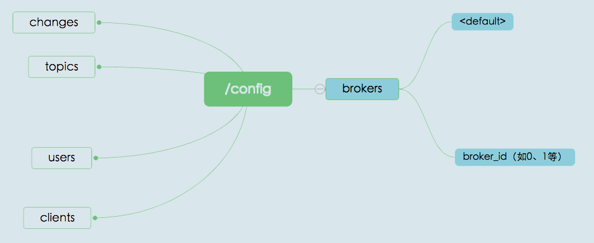
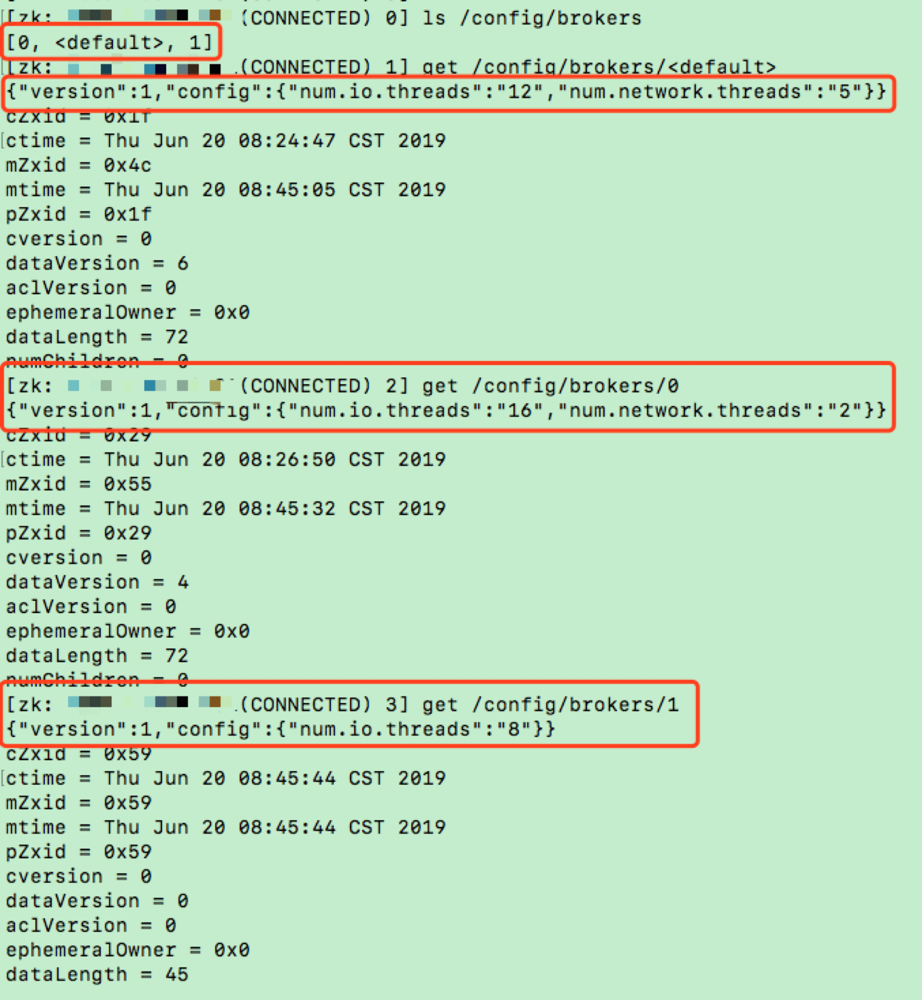
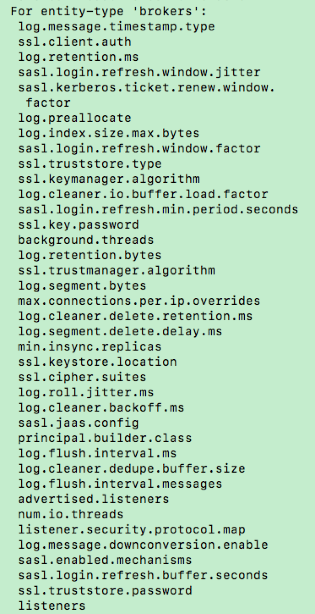
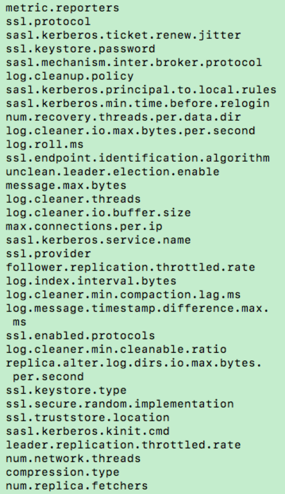
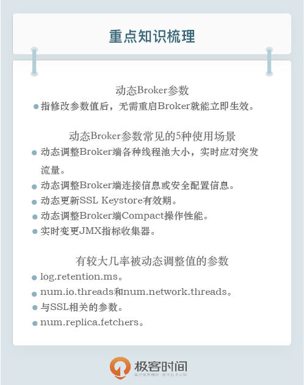

# 29 Kafka动态配置了解下？

你好，我是胡夕。今天我要和你讨论的主题是：Kafka 的动态 Broker 参数配置。

## 什么是动态 Broker 参数配置？

在开始今天的分享之前，我们先来复习一下设置 Kafka 参数，特别是 Broker 端参数的方法。

在 Kafka 安装目录的 config 路径下，有个 server.properties 文件。通常情况下，我们会指定这个文件的路径来启动 Broker。如果要设置 Broker 端的任何参数，我们必须在这个文件中显式地增加一行对应的配置，之后启动 Broker 进程，令参数生效。我们常见的做法是，一次性设置好所有参数之后，再启动 Broker。当后面需要变更任何参数时，我们必须重启 Broker。但生产环境中的服务器，怎么能随意重启呢？所以，目前修改 Broker 端参数是非常痛苦的过程。

基于这个痛点，社区于 1.1.0 版本中正式引入了动态 Broker 参数（Dynamic Broker Configs）。所谓动态，就是指修改参数值后，无需重启 Broker 就能立即生效，而之前在 server.properties 中配置的参数则称为静态参数（Static Configs）。显然，动态调整参数值而无需重启服务，是非常实用的功能。如果你想体验动态 Broker 参数的话，那就赶快升级到 1.1 版本吧。

当然了，当前最新的 2.3 版本中的 Broker 端参数有 200 多个，社区并没有将每个参数都升级成动态参数，它仅仅是把一部分参数变成了可动态调整。那么，我们应该如何分辨哪些参数是动态参数呢？

如果你打开 1.1 版本之后（含 1.1）的 Kafka 官网，你会发现[Broker Configs](https://kafka.apache.org/documentation/#brokerconfigs)表中增加了 Dynamic Update Mode 列。该列有 3 类值，分别是 read-only、per-broker 和 cluster-wide。我来解释一下它们的含义。

- read-only。被标记为 read-only 的参数和原来的参数行为一样，只有重启 Broker，才能令修改生效。
- per-broker。被标记为 per-broker 的参数属于动态参数，修改它之后，只会在对应的 Broker 上生效。
- cluster-wide。被标记为 cluster-wide 的参数也属于动态参数，修改它之后，会在整个集群范围内生效，也就是说，对所有 Broker 都生效。你也可以为具体的 Broker 修改 cluster-wide 参数。

我来举个例子说明一下 per-broker 和 cluster-wide 的区别。Broker 端参数 listeners 想必你应该不陌生吧。它是一个 per-broker 参数，这表示你只能为单个 Broker 动态调整 listeners，而不能直接调整一批 Broker 的 listeners。log.retention.ms 参数是 cluster-wide 级别的，Kafka 允许为集群内所有 Broker 统一设置一个日志留存时间值。当然了，你也可以为单个 Broker 修改此值。

## 使用场景

你可能会问，动态 Broker 参数的使用场景都有哪些呢？实际上，因为不必重启 Broker，动态 Broker 参数的使用场景非常广泛，通常包括但不限于以下几种：

- 动态调整 Broker 端各种线程池大小，实时应对突发流量。
- 动态调整 Broker 端连接信息或安全配置信息。
- 动态更新 SSL Keystore 有效期。
- 动态调整 Broker 端 Compact 操作性能。
- 实时变更 JMX 指标收集器 (JMX Metrics Reporter)。

在这些使用场景中，动态调整线程池大小应该算是最实用的功能了。很多时候，当 Kafka Broker 入站流量（inbound data）激增时，会造成 Broker 端请求积压（Backlog）。有了动态参数，我们就能够动态增加网络线程数和 I/O 线程数，快速消耗一些积压。当突发流量过去后，我们也能将线程数调整回来，减少对资源的浪费。整个过程都不需要重启 Broker。你甚至可以将这套调整线程数的动作，封装进定时任务中，以实现自动扩缩容。

## 如何保存？

由于动态配置的特殊性，它必然有和普通只读参数不同的保存机制。下面我来介绍一下 Kafka 是如何保存动态配置的。

首先，Kafka 将动态 Broker 参数保存在 ZooKeeper 中，具体的 znode 路径如下图所示。



我来解释一下图中的内容。changes 是用来实时监测动态参数变更的，不会保存参数值；topics 是用来保存 Kafka 主题级别参数的。虽然它们不属于动态 Broker 端参数，但其实它们也是能够动态变更的。

users 和 clients 则是用于动态调整客户端配额（Quota）的 znode 节点。所谓配额，是指 Kafka 运维人员限制连入集群的客户端的吞吐量或者是限定它们使用的 CPU 资源。

分析到这里，我们就会发现，/config/brokers znode 才是真正保存动态 Broker 参数的地方。该 znode 下有两大类子节点。第一类子节点就只有一个，它有个固定的名字叫 \< default >，保存的是前面说过的 cluster-wide 范围的动态参数；另一类则以 broker.id 为名，保存的是特定 Broker 的 per-broker 范围参数。由于是 per-broker 范围，因此这类子节点可能存在多个。

我们一起来看一张图片，它展示的是我的一个 Kafka 集群环境上的动态 Broker 端参数。



在这张图中，我首先查看了 /config/brokers 下的子节点，我们可以看到，这里面有 \< default > 节点和名为 0、1 的子节点。\< default > 节点中保存了我设置的 cluster-wide 范围参数；0 和 1 节点中分别保存了我为 Broker 0 和 Broker 1 设置的 per-broker 参数。

接下来，我分别展示了 cluster-wide 范围和 per-broker 范围的参数设置。拿 num.io.threads 参数为例，其 cluster-wide 值被动态调整为 12，而在 Broker 0 上被设置成 16，在 Broker 1 上被设置成 8。我为 Broker 0 和 Broker 1 单独设置的值，会覆盖掉 cluster-wide 值，但在其他 Broker 上，该参数默认值还是按 12 计算。

如果我们再把静态参数加进来一起讨论的话，cluster-wide、per-broker 和 static 参数的优先级是这样的：per-broker 参数 > cluster-wide 参数 > static 参数 > Kafka 默认值。

另外，如果你仔细查看上图中的 **ephemeralOwner 字段** ，你会发现它们的值都是 0x0。这表示这些 znode 都是持久化节点，它们将一直存在。即使 ZooKeeper 集群重启，这些数据也不会丢失，这样就能保证这些动态参数的值会一直生效。

## 如何配置？

讲完了保存原理，我们来说说如何配置动态 Broker 参数。目前，设置动态参数的工具行命令只有一个，那就是 Kafka 自带的 kafka-configs 脚本。接下来，我来以 unclean.leader.election.enable 参数为例，演示一下如何动态调整。

下面这条命令展示了如何在集群层面设置全局值，即设置 cluster-wide 范围值。

```
$ bin/kafka-configs.sh --bootstrap-server kafka-host:port --entity-type brokers --entity-default --alter --add-config unclean.leader.election.enable=true

Completed updating default config for brokers in the cluster,

```

总体来说命令很简单，但有一点需要注意。 **如果要设置 cluster-wide 范围的动态参数，需要显式指定 entity-default** 。现在，我们使用下面的命令来查看一下刚才的配置是否成功。

```
$ bin/kafka-configs.sh --bootstrap-server kafka-host:port --entity-type brokers --entity-default --describe

Default config for brokers in the cluster are:

  unclean.leader.election.enable=true sensitive=false synonyms={DYNAMIC_DEFAULT_BROKER_CONFIG:unclean.leader.election.enable=true}

```

从输出来看，我们成功地在全局层面上设置该参数值为 true。注意 sensitive=false 的字眼，它表明我们要调整的参数不是敏感数据。如果我们调整的是类似于密码这样的参数时，该字段就会为 true，表示这属于敏感数据。

好了，调整完 cluster-wide 范围的参数，我来演示下如何设置 per-broker 范围参数。我们还是以 unclean.leader.election.enable 参数为例，我现在为 ID 为 1 的 Broker 设置一个不同的值。命令如下：

```
$ bin/kafka-configs.sh --bootstrap-server kafka-host:port --entity-type brokers --entity-name 1 --alter --add-config unclean.leader.election.enable=false

Completed updating config for broker: 1.

```

同样，我们使用下列命令，来查看一下刚刚的设置是否生效了。

```
$ bin/kafka-configs.sh --bootstrap-server kafka-host:port --entity-type brokers --entity-name 1 --describe

Configs for broker 1 are:

  unclean.leader.election.enable=false sensitive=false synonyms={DYNAMIC_BROKER_CONFIG:unclean.leader.election.enable=false, DYNAMIC_DEFAULT_BROKER_CONFIG:unclean.leader.election.enable=true, DEFAULT_CONFIG:unclean.leader.election.enable=false}

```

这条命令的输出信息很多。我们关注两点即可。

1. 在 Broker 1 层面上，该参数被设置成了 false，这表明命令运行成功了。
1. 从倒数第二行可以看出，在全局层面上，该参数值依然是 true。这表明，我们之前设置的 cluster-wide 范围参数值依然有效。

如果我们要删除 cluster-wide 范围参数或 per-broker 范围参数，也非常简单，分别执行下面的命令就可以了。

```
# 删除 cluster-wide 范围参数

$ bin/kafka-configs.sh --bootstrap-server kafka-host:port --entity-type brokers --entity-default --alter --delete-config unclean.leader.election.enable

Completed updating default config for brokers in the cluster,

# 删除 per-broker 范围参数

$ bin/kafka-configs.sh --bootstrap-server kafka-host:port --entity-type brokers --entity-name 1 --alter --delete-config unclean.leader.election.enable

Completed updating config for broker: 1.

```

**删除动态参数要指定 delete-config**。当我们删除完动态参数配置后，再次运行查看命令，结果如下：

```
# 查看 cluster-wide 范围参数

 bin/kafka-configs.sh --bootstrap-server kafka-host:port  --entity-type brokers --entity-default --describe

Default config for brokers in the cluster are:

# 查看 Broker 1 上的动态参数配置

 bin/kafka-configs.sh --bootstrap-server kafka-host:port  --entity-type brokers --entity-name 1 --describe

Configs for broker 1 are:

```

此时，刚才配置的所有动态参数都已经被成功移除了。

刚刚我只是举了一个参数的例子，如果你想要知道动态 Broker 参数都有哪些，一种方式是在 Kafka 官网中查看 Broker 端参数列表，另一种方式是直接运行无参数的 kafka-configs 脚本，该脚本的说明文档会告诉你当前动态 Broker 参数都有哪些。我们可以先来看看下面这两张图。





看到有这么多动态 Broker 参数，你可能会问：这些我都需要调整吗？你能告诉我最常用的几个吗？根据我的实际使用经验，我来跟你分享一些有较大几率被动态调整值的参数。**1.log.retention.ms。 **修改日志留存时间应该算是一个比较高频的操作，毕竟，我们不可能完美地预估所有业务的消息留存时长。虽然该参数有对应的主题级别参数可以设置，但拥有在全局层面上动态变更的能力，依然是一个很好的功能亮点。** 2.num.io.threads 和 num.network.threads。 **这是我们在前面提到的两组线程池。就我个人而言，我觉得这是动态 Broker 参数最实用的场景了。毕竟，在实际生产环境中，Broker 端请求处理能力经常要按需扩容。如果没有动态 Broker 参数，我们是无法做到这一点的。** 3. 与 SSL 相关的参数。 **主要是 4 个参数（ssl.keystore.type、ssl.keystore.location、ssl.keystore.password 和 ssl.key.password）。允许动态实时调整它们之后，我们就能创建那些过期时间很短的 SSL 证书。每当我们调整时，Kafka 底层会重新配置 Socket 连接通道并更新 Keystore。新的连接会使用新的 Keystore，阶段性地调整这组参数，有利于增加安全性。** 4.num.replica.fetchers。**

这也是我认为的最实用的动态 Broker 参数之一。Follower 副本拉取速度慢，在线上 Kafka 环境中一直是一个老大难的问题。针对这个问题，常见的做法是增加该参数值，确保有充足的线程可以执行 Follower 副本向 Leader 副本的拉取。现在有了动态参数，你不需要再重启 Broker，就能立即在 Follower 端生效，因此我说这是很实用的应用场景。

## 小结

好了，我们来小结一下。今天，我们重点讨论了 Kafka 1.1.0 版本引入的动态 Broker 参数。这类参数最大的好处在于，无需重启 Broker，就可以令变更生效，因此能够极大地降低运维成本。除此之外，我还给出了动态参数的保存机制和设置方法。在专栏的后面，我还会给出动态参数设置的另一种方法，敬请期待。


