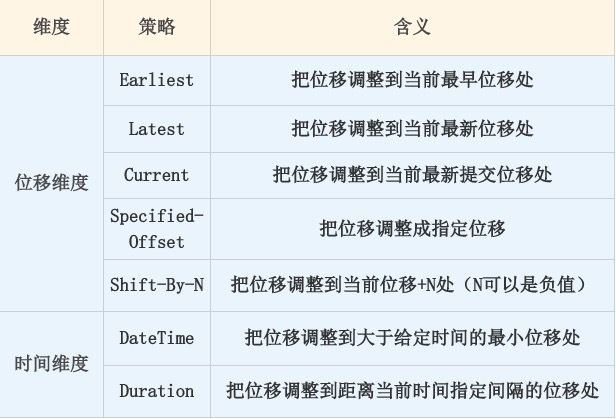
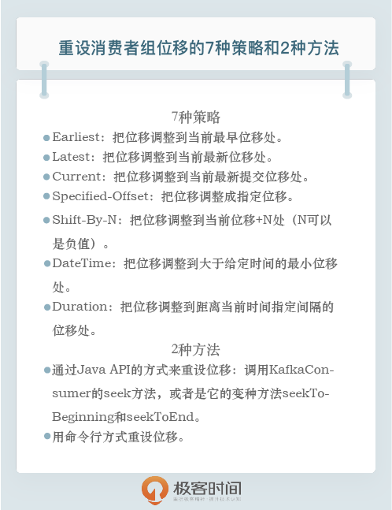

30 怎么重设消费者组位移？
==============

你好，我是胡夕。今天我要跟你分享的主题是：如何重设消费者组位移。

为什么要重设消费者组位移？
-------------

我们知道，Kafka 和传统的消息引擎在设计上是有很大区别的，其中一个比较显著的区别就是，Kafka 的消费者读取消息是可以重演的（replayable）。

像 RabbitMQ 或 ActiveMQ 这样的传统消息中间件，它们处理和响应消息的方式是破坏性的（destructive），即一旦消息被成功处理，就会被从 Broker 上删除。

反观 Kafka，由于它是基于日志结构（log-based）的消息引擎，消费者在消费消息时，仅仅是从磁盘文件上读取数据而已，是只读的操作，因此消费者不会删除消息数据。同时，由于位移数据是由消费者控制的，因此它能够很容易地修改位移的值，实现重复消费历史数据的功能。

对了，之前有很多同学在专栏的留言区提问：在实际使用场景中，我该如何确定是使用传统的消息中间件，还是使用 Kafka 呢？我在这里统一回答一下。如果在你的场景中，消息处理逻辑非常复杂，处理代价很高，同时你又不关心消息之间的顺序，那么传统的消息中间件是比较合适的；反之，如果你的场景需要较高的吞吐量，但每条消息的处理时间很短，同时你又很在意消息的顺序，此时，Kafka 就是你的首选。

重设位移策略
------

不论是哪种设置方式，重设位移大致可以从两个维度来进行。

1. 位移维度。这是指根据位移值来重设。也就是说，直接把消费者的位移值重设成我们给定的位移值。
2. 时间维度。我们可以给定一个时间，让消费者把位移调整成大于该时间的最小位移；也可以给出一段时间间隔，比如 30 分钟前，然后让消费者直接将位移调回 30 分钟之前的位移值。

下面的这张表格罗列了 7 种重设策略。接下来，我来详细解释下这些策略。



Earliest 策略表示将位移调整到主题当前最早位移处。这个最早位移不一定就是 0，因为在生产环境中，很久远的消息会被 Kafka 自动删除，所以当前最早位移很可能是一个大于 0 的值。 **如果你想要重新消费主题的所有消息，那么可以使用 Earliest 策略** 。

Latest 策略表示把位移重设成最新末端位移。如果你总共向某个主题发送了 15 条消息，那么最新末端位移就是 15。**如果你想跳过所有历史消息，打算从最新的消息处开始消费的话，可以使用 Latest 策略。**Current 策略表示将位移调整成消费者当前提交的最新位移。有时候你可能会碰到这样的场景：你修改了消费者程序代码，并重启了消费者，结果发现代码有问题，你需要回滚之前的代码变更，同时也要把位移重设到消费者重启时的位置，那么，Current 策略就可以帮你实现这个功能。

表中第 4 行的 Specified-Offset 策略则是比较通用的策略，表示消费者把位移值调整到你指定的位移处。**这个策略的典型使用场景是，消费者程序在处理某条错误消息时，你可以手动地“跳过”此消息的处理**。在实际使用过程中，可能会出现 corrupted 消息无法被消费的情形，此时消费者程序会抛出异常，无法继续工作。一旦碰到这个问题，你就可以尝试使用 Specified-Offset 策略来规避。

如果说 Specified-Offset 策略要求你指定位移的**绝对数值 **的话，那么 Shift-By-N 策略指定的就是位移的** 相对数值**，即你给出要跳过的一段消息的距离即可。这里的“跳”是双向的，你既可以向前“跳”，也可以向后“跳”。比如，你想把位移重设成当前位移的前 100 条位移处，此时你需要指定 N 为 -100。

刚刚讲到的这几种策略都是位移维度的，下面我们来聊聊从时间维度重设位移的 DateTime 和 Duration 策略。

DateTime 允许你指定一个时间，然后将位移重置到该时间之后的最早位移处。常见的使用场景是，你想重新消费昨天的数据，那么你可以使用该策略重设位移到昨天 0 点。

Duration 策略则是指给定相对的时间间隔，然后将位移调整到距离当前给定时间间隔的位移处，具体格式是 PnDTnHnMnS。如果你熟悉 Java 8 引入的 Duration 类的话，你应该不会对这个格式感到陌生。它就是一个符合 ISO-8601 规范的 Duration 格式，以字母 P 开头，后面由 4 部分组成，即 D、H、M 和 S，分别表示天、小时、分钟和秒。举个例子，如果你想将位移调回到 15 分钟前，那么你就可以指定 PT0H15M0S。

我会在后面分别给出这 7 种重设策略的实现方式。不过在此之前，我先来说一下重设位移的方法。目前，重设消费者组位移的方式有两种。

* 通过消费者 API 来实现。
* 通过 kafka-consumer-groups 命令行脚本来实现。

消费者 API 方式设置
------------

首先，我们来看看如何通过 API 的方式来重设位移。我主要以 Java API 为例进行演示。如果你使用的是其他语言，方法应该是类似的，不过你要参考具体的 API 文档。

通过 Java API 的方式来重设位移，你需要调用 KafkaConsumer 的 seek 方法，或者是它的变种方法 seekToBeginning 和 seekToEnd。我们来看下它们的方法签名。

```
void seek(TopicPartition partition, long offset);

void seek(TopicPartition partition, OffsetAndMetadata offsetAndMetadata);

void seekToBeginning(Collection<TopicPartition> partitions);

void seekToEnd(Collection<TopicPartition> partitions);

```

根据方法的定义，我们可以知道，每次调用 seek 方法只能重设一个分区的位移。OffsetAndMetadata 类是一个封装了 Long 型的位移和自定义元数据的复合类，只是一般情况下，自定义元数据为空，因此你基本上可以认为这个类表征的主要是消息的位移值。seek 的变种方法 seekToBeginning 和 seekToEnd 则拥有一次重设多个分区的能力。我们在调用它们时，可以一次性传入多个主题分区。

好了，有了这些方法，我们就可以逐一地实现上面提到的 7 种策略了。我们先来看 Earliest 策略的实现方式，代码如下：

```
Properties consumerProperties = new Properties();

consumerProperties.put(ConsumerConfig.ENABLE_AUTO_COMMIT_CONFIG, false);

consumerProperties.put(ConsumerConfig.GROUP_ID_CONFIG, groupID);

consumerProperties.put(ConsumerConfig.AUTO_OFFSET_RESET_CONFIG, "earliest");

consumerProperties.put(ConsumerConfig.KEY_DESERIALIZER_CLASS_CONFIG, StringDeserializer.class.getName());

consumerProperties.put(ConsumerConfig.VALUE_DESERIALIZER_CLASS_CONFIG, StringDeserializer.class.getName());

consumerProperties.put(ConsumerConfig.BOOTSTRAP_SERVERS_CONFIG, brokerList);

 

String topic = "test";  // 要重设位移的 Kafka 主题 

try (final KafkaConsumer<String, String> consumer = 

 new KafkaConsumer<>(consumerProperties)) {

         consumer.subscribe(Collections.singleton(topic));

         consumer.poll(0);

         consumer.seekToBeginning(

 consumer.partitionsFor(topic).stream().map(partitionInfo ->          

 new TopicPartition(topic, partitionInfo.partition()))

 .collect(Collectors.toList()));

} 

```

这段代码中有几个比较关键的部分，你需要注意一下。

1. 你要创建的消费者程序，要禁止自动提交位移。
2. 组 ID 要设置成你要重设的消费者组的组 ID。
3. 调用 seekToBeginning 方法时，需要一次性构造主题的所有分区对象。
4. 最重要的是，一定要调用带长整型的 poll 方法，而不要调用 consumer.poll(Duration.ofSecond(0))。

虽然社区已经不推荐使用 poll(long) 了，但短期内应该不会移除它，所以你可以放心使用。另外，为了避免重复，在后面的实例中，我只给出最关键的代码。

Latest 策略和 Earliest 是类似的，我们只需要使用 seekToEnd 方法即可，如下面的代码所示：

```
consumer.seekToEnd(

 consumer.partitionsFor(topic).stream().map(partitionInfo ->          

 new TopicPartition(topic, partitionInfo.partition()))

 .collect(Collectors.toList()));

```

实现 Current 策略的方法很简单，我们需要借助 KafkaConsumer 的 committed 方法来获取当前提交的最新位移，代码如下：

```
consumer.partitionsFor(topic).stream().map(info -> 

 new TopicPartition(topic, info.partition()))

 .forEach(tp -> {

 long committedOffset = consumer.committed(tp).offset();

 consumer.seek(tp, committedOffset);

});

```

这段代码首先调用 partitionsFor 方法获取给定主题的所有分区，然后依次获取对应分区上的已提交位移，最后通过 seek 方法重设位移到已提交位移处。

如果要实现 Specified-Offset 策略，直接调用 seek 方法即可，如下所示：

```
long targetOffset = 1234L;

for (PartitionInfo info : consumer.partitionsFor(topic)) {

 TopicPartition tp = new TopicPartition(topic, info.partition());

 consumer.seek(tp, targetOffset);

}

```

这次我没有使用 Java 8 Streams 的写法，如果你不熟悉 Lambda 表达式以及 Java 8 的 Streams，这种写法可能更加符合你的习惯。

接下来我们来实现 Shift-By-N 策略，主体代码逻辑如下：

```
for (PartitionInfo info : consumer.partitionsFor(topic)) {

         TopicPartition tp = new TopicPartition(topic, info.partition());

 // 假设向前跳 123 条消息

         long targetOffset = consumer.committed(tp).offset() + 123L; 

         consumer.seek(tp, targetOffset);

}

```

如果要实现 DateTime 策略，我们需要借助另一个方法：**KafkaConsumer.****offsetsForTimes 方法**。假设我们要重设位移到 2019 年 6 月 20 日晚上 8 点，那么具体代码如下：

```
long ts = LocalDateTime.of(

 2019, 6, 20, 20, 0).toInstant(ZoneOffset.ofHours(8)).toEpochMilli();

Map<TopicPartition, Long> timeToSearch = 

         consumer.partitionsFor(topic).stream().map(info -> 

 new TopicPartition(topic, info.partition()))

 .collect(Collectors.toMap(Function.identity(), tp -> ts));

 

for (Map.Entry<TopicPartition, OffsetAndTimestamp> entry : 

 consumer.offsetsForTimes(timeToSearch).entrySet()) {

consumer.seek(entry.getKey(), entry.getValue().offset());

}

```

这段代码构造了 LocalDateTime 实例，然后利用它去查找对应的位移值，最后调用 seek，实现了重设位移。

最后，我来给出实现 Duration 策略的代码。假设我们要将位移调回 30 分钟前，那么代码如下：

```
Map<TopicPartition, Long> timeToSearch = consumer.partitionsFor(topic).stream()

         .map(info -> new TopicPartition(topic, info.partition()))

         .collect(Collectors.toMap(Function.identity(), tp -> System.currentTimeMillis() - 30 * 1000  * 60));

 

for (Map.Entry<TopicPartition, OffsetAndTimestamp> entry : 

         consumer.offsetsForTimes(timeToSearch).entrySet()) {

         consumer.seek(entry.getKey(), entry.getValue().offset());

}

```

**总之，使用 Java API 的方式来实现重设策略的主要入口方法，就是 seek 方法**。

命令行方式设置
-------

位移重设还有另一个重要的途径：**通过 kafka-consumer-groups 脚本**。需要注意的是，这个功能是在 Kafka 0.11 版本中新引入的。这就是说，如果你使用的 Kafka 是 0.11 版本之前的，那么你只能使用 API 的方式来重设位移。

比起 API 的方式，用命令行重设位移要简单得多。针对我们刚刚讲过的 7 种策略，有 7 个对应的参数。下面我来一一给出实例。

Earliest 策略直接指定\*\*–to-earliest\*\*。

```
bin/kafka-consumer-groups.sh --bootstrap-server kafka-host:port --group test-group --reset-offsets --all-topics --to-earliest –execute

```

Latest 策略直接指定\*\*–to-latest\*\*。

```
bin/kafka-consumer-groups.sh --bootstrap-server kafka-host:port --group test-group --reset-offsets --all-topics --to-latest --execute

```

Current 策略直接指定\*\*–to-current\*\*。

```
bin/kafka-consumer-groups.sh --bootstrap-server kafka-host:port --group test-group --reset-offsets --all-topics --to-current --execute

```

Specified-Offset 策略直接指定\*\*–to-offset\*\*。

```
bin/kafka-consumer-groups.sh --bootstrap-server kafka-host:port --group test-group --reset-offsets --all-topics --to-offset <offset> --execute

```

Shift-By-N 策略直接指定\*\*–shift-by N\*\*。

```
bin/kafka-consumer-groups.sh --bootstrap-server kafka-host:port --group test-group --reset-offsets --shift-by <offset_N> --execute

```

DateTime 策略直接指定\*\*–to-datetime\*\*。

```
bin/kafka-consumer-groups.sh --bootstrap-server kafka-host:port --group test-group --reset-offsets --to-datetime 2019-06-20T20:00:00.000 --execute

```

最后是实现 Duration 策略，我们直接指定\*\*–by-duration\*\*。

```
bin/kafka-consumer-groups.sh --bootstrap-server kafka-host:port --group test-group --reset-offsets --by-duration PT0H30M0S --execute

```

小结
--

至此，重设消费者组位移的 2 种方式我都讲完了。我们来小结一下。今天，我们主要讨论了在 Kafka 中，为什么要重设位移以及如何重设消费者组位移。重设位移主要是为了实现消息的重演。目前 Kafka 支持 7 种重设策略和 2 种重设方法。在实际使用过程中，我推荐你使用第 2 种方法，即用命令行的方式来重设位移。毕竟，执行命令要比写程序容易得多。但是需要注意的是，0.11 及 0.11 版本之后的 Kafka 才提供了用命令行调整位移的方法。如果你使用的是之前的版本，那么就只能依靠 API 的方式了。


