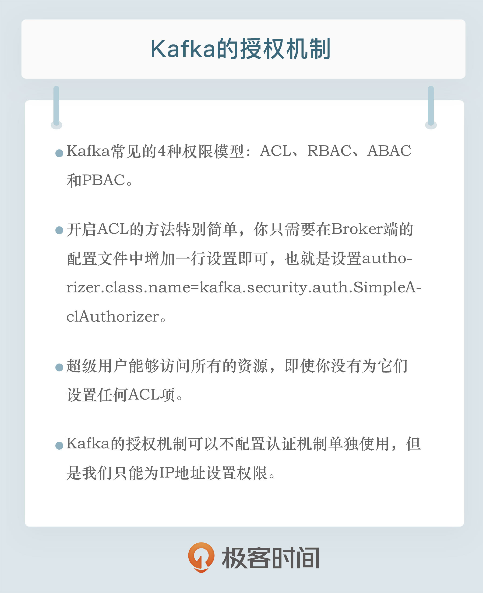

# 34 云环境下的授权该怎么做？

你好，我是胡夕。今天我要分享的主题是：Kafka 的授权机制。

## 什么是授权机制？

我们在上一讲中花了不少时间讨论 Kafka 的认证机制，今天我们来看看 Kafka 的授权机制（Authorization）。所谓授权，一般是指对与信息安全或计算机安全相关的资源授予访问权限，特别是存取控制。

具体到权限模型，常见的有四种。

- ACL：Access-Control List，访问控制列表。
- RBAC：Role-Based Access Control，基于角色的权限控制。
- ABAC：Attribute-Based Access Control，基于属性的权限控制。
- PBAC：Policy-Based Access Control，基于策略的权限控制。

在典型的互联网场景中，前两种模型应用得多，后面这两种则比较少用。

ACL 模型很简单，它表征的是用户与权限的直接映射关系，如下图所示：


而 RBAC 模型则加入了角色的概念，支持对用户进行分组，如下图所示：


Kafka 没有使用 RBAC 模型，它用的是 ACL 模型。简单来说，这种模型就是规定了什么用户对什么资源有什么样的访问权限。我们可以借用官网的一句话来统一表示这种模型：“ **Principal P is [Allowed/Denied] Operation O From Host H On Resource R.** ” 这句话中出现了很多个主体，我来分别解释下它们的含义。

- Principal：表示访问 Kafka 集群的用户。
- Operation：表示一个具体的访问类型，如读写消息或创建主题等。
- Host：表示连接 Kafka 集群的客户端应用程序 IP 地址。Host 支持星号占位符，表示所有 IP 地址。
- Resource：表示 Kafka 资源类型。如果以最新的 2.3 版本为例，Resource 共有 5 种，分别是 TOPIC、CLUSTER、GROUP、TRANSACTIONALID 和 DELEGATION TOKEN。

当前，Kafka 提供了一个可插拔的授权实现机制。该机制会将你配置的所有 ACL 项保存在 ZooKeeper 下的 /kafka-acl 节点中。你可以通过 Kafka 自带的 kafka-acls 脚本动态地对 ACL 项进行增删改查，并让它立即生效。

## 如何开启 ACL？

在 Kafka 中，开启 ACL 的方法特别简单，你只需要在 Broker 端的配置文件中增加一行设置即可，也就是在 server.properties 文件中配置下面这个参数值：

```
authorizer.class.name=kafka.security.auth.SimpleAclAuthorizer
```

authorizer.class.name 参数指定了 ACL 授权机制的实现类。当前 Kafka 提供了 Authorizer 接口，允许你实现你自己的授权机制，但更常见的做法，还是直接使用 Kafka 自带的 **SimpleAclAuthorizer 实现类** 。一旦设置好这个参数的值，并且启动 Broker 后，该 Broker 就默认开启了 ACL 授权验证。在实际生产环境中，你需要为集群中的每台 Broker 都做此设置。

## 超级用户（Super User）

在开启了 ACL 授权之后，你还必须显式地为不同用户设置访问某项资源的权限，否则，在默认情况下，没有配置任何 ACL 的资源是不能被访问的。不过，这里也有一个例外： **超级用户能够访问所有的资源，即使你没有为它们设置任何 ACL 项** 。

那么，我们如何在一个 Kafka 集群中设置超级用户呢？方法很简单，只需要在 Broker 端的配置文件 server.properties 中，设置 super.users 参数即可，比如：

```
super.users=User:superuser1;User:superuser2
```

**注意，如果你要一次性指定多个超级用户，那么分隔符是分号而不是逗号，这是为了避免出现用户名中包含逗号从而无法分割的问题** 。

除了设置 super.users 参数，Kafka 还支持将所有用户都配置成超级用户的用法。如果我们在 server.properties 文件中设置 allow.everyone.if.no.acl.found=true，那么所有用户都可以访问没有设置任何 ACL 的资源。不过，我个人不太建议进行这样的设置。毕竟，在生产环境中，特别是在那些对安全有较高要求的环境中，采用白名单机制要比黑名单机制更加令人放心。

## kafka-acls 脚本

在了解了 Kafka 的 ACL 概念之后，我们来看一下如何设置它们。当前在 Kafka 中，配置授权的方法是通过 kafka-acls 脚本。举个例子，如果我们要为用户 Alice 增加了集群级别的所有权限，那么我们可以使用下面这段命令。

```
kafka-acls --authorizer-properties zookeeper.connect=localhost:2181 --add --allow-principal User:Alice --operation All --topic '*' --cluster
```

在这个命令中，All 表示所有操作，topic 中的星号则表示所有主题，指定 --cluster 则说明我们要为 Alice 设置的是集群权限。

这个脚本的参数有很多，我们再来看看它的另一个常见用法。

```
bin/kafka-acls --authorizer-properties zookeeper.connect=localhost:2181 --add --allow-principal User:'*' --allow-host '*' --deny-principal User:BadUser --deny-host 10.205.96.119 --operation Read --topic test-topic
```

User 后面的星号表示所有用户，allow-host 后面的星号则表示所有 IP 地址。这个命令的意思是，允许所有的用户使用任意的 IP 地址读取名为 test-topic 的主题数据，同时也禁止 BadUser 用户和 10.205.96.119 的 IP 地址访问 test-topic 下的消息。

kafka-acls 脚本还有其他的功能，比如删除 ACL、查询已有 ACL 等。它们的实际用法与上面这条命令类似，我在这里就不一一列举了，你可以使用 kafka-acls.sh 来查询它的所有用法。

## ACL 权限列表

刚才的这两条命令，分别涉及了主题的集群权限和读权限。你可能会问，Kafka 到底提供了多少种 ACL 权限呢？我们一起来看看下面这张表格，它完整地展示了 Kafka 所有的 ACL 权限。


看到这么大一张表格，你是不是很惊讶？其实，这恰好证明 Kafka 当前提供的授权机制是非常细粒度的。现在，我来跟你分享一下这个表格的使用方法。

举个例子，假如你要为你的生产者程序赋予写权限，那么首先，你要在 Resource 列找到 Topic 类型的权限，然后在 Operation 列寻找 WRITE 操作权限。这个 WRITE 权限是限制 Producer 程序能否向对应主题发送消息的关键。通常情况下，Producer 程序还可能有 **创建主题、获取主题数据** 的权限，所以 Kafka 为 Producer 需要的这些常见权限创建了快捷方式，即 --producer。也就是说，在执行 kafka-acls 命令时，直接指定 --producer 就能同时获得这三个权限了。 --consumer 也是类似的，指定 --consumer 可以同时获得 Consumer 端应用所需的权限。

## 授权机制能否单独使用？

关于授权，有一个很常见的问题是，Kafka 授权机制能不配置认证机制而单独使用吗？其实，这是可以的，只是你只能为 IP 地址设置权限。比如，下面这个命令会禁止运行在 127.0.0.1IP 地址上的 Producer 应用向 test 主题发送数据：

```
$ bin/kafka-acls.sh --authorizer-properties zookeeper.connect=localhost:2181 --add --deny-principal User:* --deny-host 127.0.0.1 --operation Write --topic test
$ bin/kafka-console-producer.sh --broker-list localhost:9092 --topic test
>hello
[2019-07-16 10:10:57,283] WARN [Producer clientId=console-producer] Error while fetching metadata with correlation id 3 : {test=TOPIC_AUTHORIZATION_FAILED} (org.apache.kafka.clients.NetworkClient)
[2019-07-16 10:10:57,284] ERROR [Producer clientId=console-producer] Topic authorization failed for topics [test] (org.apache.kafka.clients.Metadata)
[2019-07-16 10:10:57,284] ERROR Error when sending message to topic test with key: null, value: 5 bytes with error: (org.apache.kafka.clients.producer.internals.ErrorLoggingCallback)
org.apache.kafka.common.errors.TopicAuthorizationException: Not authorized to access topics: [test]
```

请注意一下输出中的橙色字体部分。虽然没有设置任何认证机制，但是通过设置 IP 地址的 ACL 授权，我们依然可以禁止这些 IP 地址上的客户端访问 Kafka 资源。不过，尽管授权机制能够有限度地单独使用，但我更推荐的做法是，和我们在专栏上一讲提到的认证机制搭配使用。

接下来，我来给出一个 SSL + ACL 配置的实例，来演示一下云环境下的 ACL 授权应该怎么做。

## 配置实例

在演示 ACL 之前，我先简单说一下 SSL 的配置。我给出一个 SHELL 脚本，它可以方便你设置 SSL，代码如下：

```
#!/bin/bash
# 设置环境变量
BASE_DIR=/Users/huxi/testenv # 你需要修改此处
CERT_OUTPUT_PATH="$BASE_DIR/certificates"
PASSWORD=test1234
KEY_STORE="$CERT_OUTPUT_PATH/server.keystore.jks"
TRUST_STORE="$CERT_OUTPUT_PATH/server.truststore.jks"
CLIENT_KEY_STORE="$CERT_OUTPUT_PATH/client.keystore.jks"
CLIENT_TRUST_STORE="$CERT_OUTPUT_PATH/client.truststore.jks"
KEY_PASSWORD=$PASSWORD
STORE_PASSWORD=$PASSWORD
TRUST_KEY_PASSWORD=$PASSWORD
TRUST_STORE_PASSWORD=$PASSWORD
CERT_AUTH_FILE="$CERT_OUTPUT_PATH/ca-cert"
DAYS_VALID=365
DNAME="CN=Xi Hu, OU=YourDept, O=YourCompany, L=Beijing, ST=Beijing, C=CN"
mkdir -p $CERT_OUTPUT_PATH
echo "1. 产生 key 和证书......"
keytool -keystore $KEY_STORE -alias kafka-server -validity $DAYS_VALID -genkey -keyalg RSA \
-storepass $STORE_PASSWORD -keypass $KEY_PASSWORD -dname "$DNAME"
keytool -keystore $CLIENT_KEY_STORE -alias kafka-client -validity $DAYS_VALID -genkey -keyalg RSA \
-storepass $STORE_PASSWORD -keypass $KEY_PASSWORD -dname "$DNAME"
echo "2. 创建 CA......"
openssl req -new -x509 -keyout $CERT_OUTPUT_PATH/ca-key -out "$CERT_AUTH_FILE" -days "$DAYS_VALID" \
-passin pass:"$PASSWORD" -passout pass:"$PASSWORD" \
-subj "/C=CN/ST=Beijing/L=Beijing/O=YourCompany/OU=YourDept,CN=Xi Hu"
echo "3. 添加 CA 文件到 broker truststore......"
keytool -keystore "$TRUST_STORE" -alias CARoot \
-importcert -file "$CERT_AUTH_FILE" -storepass "$TRUST_STORE_PASSWORD" -keypass "$TRUST_KEY_PASS" -noprompt
echo "4. 添加 CA 文件到 client truststore......"
keytool -keystore "$CLIENT_TRUST_STORE" -alias CARoot \
-importcert -file "$CERT_AUTH_FILE" -storepass "$TRUST_STORE_PASSWORD" -keypass "$TRUST_KEY_PASS" -noprompt
echo "5. 从 keystore 中导出集群证书......"
keytool -keystore "$KEY_STORE" -alias kafka-server -certreq -file "$CERT_OUTPUT_PATH/server-cert-file" \
-storepass "$STORE_PASSWORD" -keypass "$KEY_PASSWORD" -noprompt
keytool -keystore "$CLIENT_KEY_STORE" -alias kafka-client -certreq -file "$CERT_OUTPUT_PATH/client-cert-file" \
-storepass "$STORE_PASSWORD" -keypass "$KEY_PASSWORD" -noprompt
echo "6. 使用 CA 签发证书......"
openssl x509 -req -CA "$CERT_AUTH_FILE" -CAkey $CERT_OUTPUT_PATH/ca-key -in "$CERT_OUTPUT_PATH/server-cert-file" \
-out "$CERT_OUTPUT_PATH/server-cert-signed" -days "$DAYS_VALID" -CAcreateserial -passin pass:"$PASSWORD"
openssl x509 -req -CA "$CERT_AUTH_FILE" -CAkey $CERT_OUTPUT_PATH/ca-key -in "$CERT_OUTPUT_PATH/client-cert-file" \
-out "$CERT_OUTPUT_PATH/client-cert-signed" -days "$DAYS_VALID" -CAcreateserial -passin pass:"$PASSWORD"
echo "7. 导入 CA 文件到 keystore......"
keytool -keystore "$KEY_STORE" -alias CARoot -import -file "$CERT_AUTH_FILE" -storepass "$STORE_PASSWORD" \
 -keypass "$KEY_PASSWORD" -noprompt
keytool -keystore "$CLIENT_KEY_STORE" -alias CARoot -import -file "$CERT_AUTH_FILE" -storepass "$STORE_PASSWORD" \
 -keypass "$KEY_PASSWORD" -noprompt
echo "8. 导入已签发证书到 keystore......"
keytool -keystore "$KEY_STORE" -alias kafka-server -import -file "$CERT_OUTPUT_PATH/server-cert-signed" \
 -storepass "$STORE_PASSWORD" -keypass "$KEY_PASSWORD" -noprompt
keytool -keystore "$CLIENT_KEY_STORE" -alias kafka-client -import -file "$CERT_OUTPUT_PATH/client-cert-signed" \
 -storepass "$STORE_PASSWORD" -keypass "$KEY_PASSWORD" -noprompt
echo "9. 删除临时文件......"
rm "$CERT_OUTPUT_PATH/ca-cert.srl"
rm "$CERT_OUTPUT_PATH/server-cert-signed"
rm "$CERT_OUTPUT_PATH/client-cert-signed"
rm "$CERT_OUTPUT_PATH/server-cert-file"
rm "$CERT_OUTPUT_PATH/client-cert-file"
```

你可以把上面的代码保存成一个 SHELL 脚本，然后在一台 Broker 上运行。该脚本主要的产出是 4 个文件，分别是：server.keystore.jks、server.truststore.jks、client.keystore.jks 和 client.truststore.jks。

你需要把以 server 开头的两个文件，拷贝到集群中的所有 Broker 机器上，把以 client 开头的两个文件，拷贝到所有要连接 Kafka 集群的客户端应用程序机器上。

接着，你要配置每个 Broker 的 server.properties 文件，增加以下内容：

```
listeners=SSL://localhost:9093
ssl.truststore.location=/Users/huxi/testenv/certificates/server.truststore.jks
ssl.truststore.password=test1234
ssl.keystore.location=/Users/huxi/testenv/certificates/server.keystore.jks
ssl.keystore.password=test1234
security.inter.broker.protocol=SSL
ssl.client.auth=required
ssl.key.password=test1234
```

现在我们启动 Broker 进程。倘若你发现无法启动或启动失败，那么你需要检查一下报错信息，看看和上面的哪些配置有关，然后有针对性地进行调整。接下来，我们来配置客户端的 SSL。

首先，我们要创建一个名为 client-ssl.config 的文件，内容如下：

```
security.protocol=SSL
ssl.truststore.location=/Users/huxi/testenv/certificates/client.truststore.jks
ssl.truststore.password=test1234
ssl.keystore.location=/Users/huxi/testenv/certificates/server.keystore.jks
ssl.keystore.password=test1234
ssl.key.password=test1234
ssl.endpoint.identification.algorithm=
```

注意，一定要加上最后一行。因为自 Kafka 2.0 版本开始，它默认会验证服务器端的主机名是否匹配 Broker 端证书里的主机名。如果你要禁掉此功能的话，一定要将该参数设置为空字符串。

配置好这些，你可以使用 ConsoleConsumer 和 ConsoleProducer 来测试一下 Producer 和 Consumer 是否能够正常工作。比如，下列命令指定 producer-config 指向刚才我们创建的 client-ssl 配置文件。

```
bin/kafka-console-producer.sh --broker-list localhost:9093 --topic test --producer.config client-ssl.config
```

好了，现在我们来说说 ACL 的配置。

如果你在运营一个云上的 Kafka 集群，那么势必会面临多租户的问题。 **除了设置合理的认证机制外，为每个连接 Kafka 集群的客户端授予恰当的权限，也是非常关键的** 。现在我来给出一些最佳实践。

第一，就像前面说的，要开启 ACL，你需要设置 authorizer.class.name=kafka.security.auth.SimpleAclAuthorizer。

第二，我建议你采用白名单机制，这样的话，没有显式设置权限的用户就无权访问任何资源。也就是说，在 Kafka 的 server.properties 文件中，不要设置 allow.everyone.if.no.acl.found=true。

第三，你可以使用 kafka-acls 脚本为 SSL 用户授予集群的权限。我们以前面的例子来进行一下说明。

在配置 SSL 时，我们指定用户的 Distinguished Name 为“CN=Xi Hu, OU=YourDept, O=YourCompany, L=Beijing, ST=Beijing, C=CN”。之前在设置 Broker 端参数时，我们指定了 security.inter.broker.protocol=SSL，即强制指定 Broker 间的通讯也采用 SSL 加密。

如果不为指定的 Distinguished Name 授予集群操作的权限，你是无法成功启动 Broker 的。因此，你需要在启动 Broker 之前执行下面的命令：

```
bin/kafka-acls.sh --authorizer-properties zookeeper.connect=localhost:2181 --add --allow-principal User:"CN=Xi Hu,OU=YourDept,O=YourCompany,L=Beijing,ST=Beijing,C=CN" --operation All --cluster
```

第四，你要为客户端程序授予相应的权限，比如为生产者授予 producer 权限，为消费者授予 consumer 权限。假设客户端要访问的主题名字是 test，那么命令如下：

```
bin/kafka-acls.sh --authorizer-properties zookeeper.connect=localhost:2181 --add --allow-principal User:"CN=Xi Hu,OU=YourDept,O=YourCompany,L=Beijing,ST=Beijing,C=CN" --producer --topic 'test'
bin/kafka-acls.sh --authorizer-properties zookeeper.connect=localhost:2181 --add --allow-principal User:"CN=Xi Hu,OU=YourDept,O=YourCompany,L=Beijing,ST=Beijing,C=CN" --consumer --topic 'test' --group '*'
```

注意这两条命令中的 --producer 和 --consumer，它们类似于一个快捷方式，直接将 Producer 和 Consumer 常用的权限进行了一次性的授予。

作为云环境 PaaS 管理员，除了以上这些必要的权限，你最好不要把其他权限授予客户端，比如创建主题的权限。总之，你授予的权限越少，你的 Kafka 集群就越安全。

## 小结

讲到这里，我们就完整地把 Kafka 授权机制梳理了一遍。除此之外，我还附赠了 SSL 端配置方法。希望你能将这两讲关于安全配置的内容结合起来学习，打造一个超级安全的 Kafka 集群。



## 开放讨论
