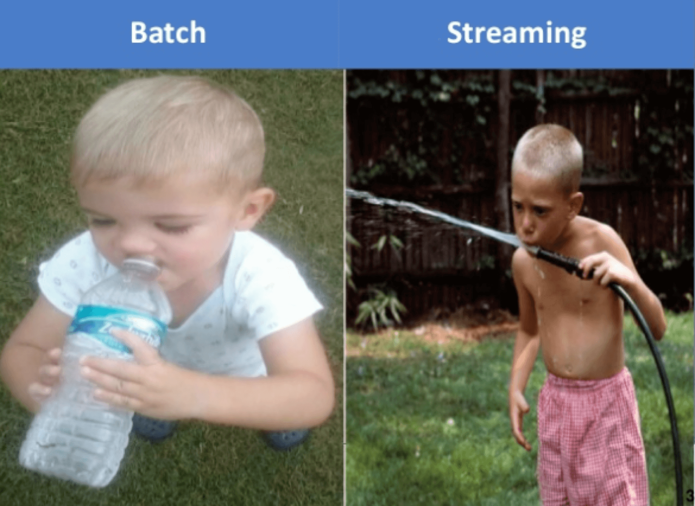
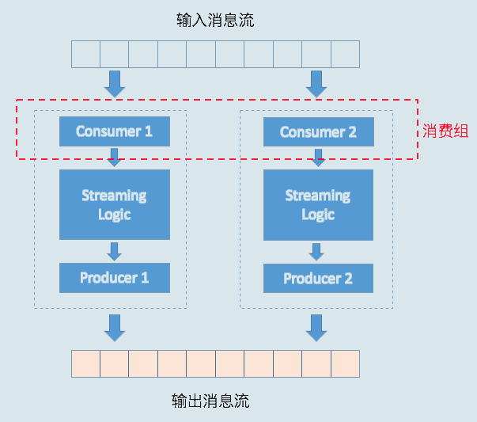
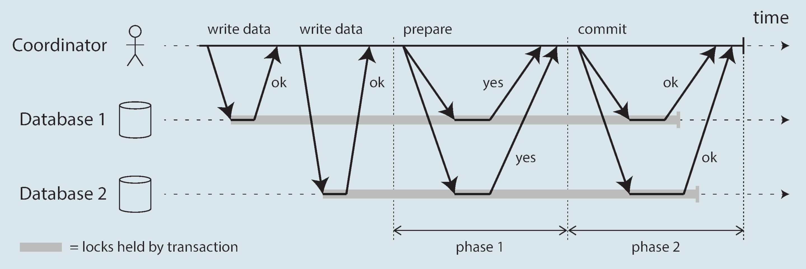
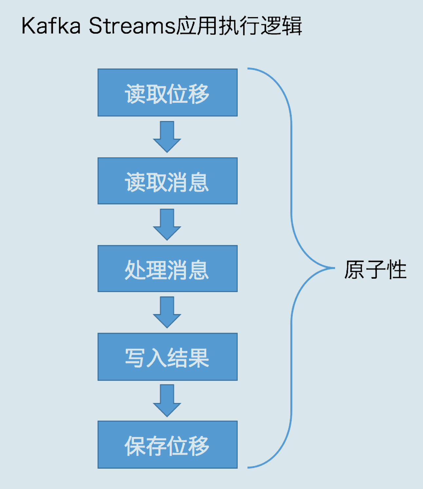
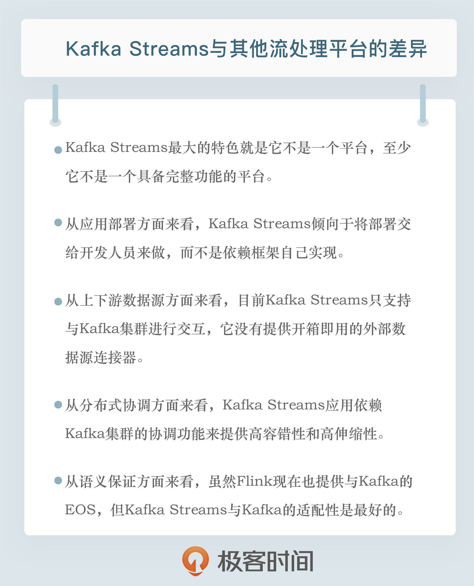

40 Kafka Streams与其他流处理平台的差异在哪里？
===============================

你好，我是胡夕。今天我要和你分享的主题是：Kafka Streams 与其他流处理平台的差异。

近些年来，开源流处理领域涌现出了很多优秀框架。光是在 Apache 基金会孵化的项目，关于流处理的大数据框架就有十几个之多，比如早期的 Apache Samza、Apache Storm，以及这两年火爆的 Spark 以及 Flink 等。

应该说，每个框架都有自己独特的地方，也都有自己的缺陷。面对这众多的流处理框架，我们应该如何选择呢？今天，我就来梳理几个主流的流处理平台，并重点分析一下 Kafka Streams 与其他流处理平台的差异。

什么是流处理平台？
---------

首先，我们有必要了解一下流处理平台的概念。[“Streaming Systems”](https://www.oreilly.com/library/view/streaming-systems/9781491983867/ch01.html)一书是这么定义“流处理平台”的：**流处理平台（Streaming System）是处理无限数据集（Unbounded Dataset）的数据处理引擎，而流处理是与批处理（Batch Processing）相对应的。**所谓的无限数据，是指数据永远没有尽头。流处理平台是专门处理这种数据集的系统或框架。当然，这并不是说批处理系统不能处理这种无限数据集，只是通常情况下，它更擅长处理有限数据集（Bounded Dataset）。

那流处理和批处理究竟该如何区分呢？下面这张图应该能帮助你快速且直观地理解它们的区别。

好了，现在我来详细解释一下流处理和批处理的区别。

长期以来，流处理给人的印象通常是低延时，但是结果不准确。每来一条消息，它就能计算一次结果，但由于它处理的大多是无界数据，可能永远也不会结束，因此在流处理中，我们很难精确描述结果何时是精确的。理论上，流处理的计算结果会不断地逼近精确结果。

但是，它的竞争对手批处理则正好相反。批处理能提供准确的计算结果，但往往延时很高。

因此，业界的大神们扬长避短，将两者结合在一起使用。一方面，利用流处理快速地给出不那么精确的结果；另一方面，依托于批处理，最终实现数据一致性。这就是所谓的**Lambda 架构**。

延时低是个很好的特性，但如果计算结果不准确，流处理是无法完全替代批处理的。所谓计算结果准确，在教科书或文献中有个专属的名字，叫正确性（Correctness）。可以这么说，**目前难以实现正确性是流处理取代批处理的最大障碍**，而实现正确性的基石是精确一次处理语义（Exactly Once Semantics，EOS）。

这里的精确一次是流处理平台能提供的一类一致性保障。常见的一致性保障有三类：

* 至多一次（At most once）语义：消息或事件对应用状态的影响最多只有一次。
* 至少一次（At least once）语义：消息或事件对应用状态的影响最少一次。
* 精确一次（Exactly once）语义：消息或事件对应用状态的影响有且只有一次。

注意，我这里说的都是 **对应用状态的影响** 。对于很多有副作用（Side Effect）的操作而言，实现精确一次语义几乎是不可能的。举个例子，假设流处理中的某个步骤是发送邮件操作，当邮件发送出去后，倘若后面出现问题要回滚整个流处理流程，已发送的邮件是没法追回的，这就是所谓的副作用。当你的流处理逻辑中存在包含副作用的操作算子时，该操作算子的执行是无法保证精确一次处理的。因此，我们通常只是保证这类操作对应用状态的影响精确一次罢了。后面我们会重点讨论 Kafka Streams 是如何实现 EOS 的。

我们今天讨论的流处理既包含真正的实时流处理，也包含微批化（Microbatch）的流处理。 **所谓的微批化，其实就是重复地执行批处理引擎来实现对无限数据集的处理** 。典型的微批化实现平台就是 **Spark Streaming** 。

Kafka Streams 的特色
-----------------

相比于其他流处理平台， **Kafka Streams 最大的特色就是它不是一个平台** ，至少它不是一个具备完整功能（Full-Fledged）的平台，比如其他框架中自带的调度器和资源管理器，就是 Kafka Streams 不提供的。

Kafka 官网明确定义 Kafka Streams 是一个 **Java 客户端库** （Client Library）。 **你可以使用这个库来构建高伸缩性、高弹性、高容错性的分布式应用以及微服务** 。

使用 Kafka Streams API 构建的应用就是一个普通的 Java 应用程序。你可以选择任何熟悉的技术或框架对其进行编译、打包、部署和上线。

在我看来，这是 Kafka Streams 与 Storm、Spark Streaming 或 Flink 最大的区别。

Java 客户端库的定位既可以说是特色，也可以说是一个缺陷。目前 Kafka Streams 在国内推广缓慢的一个重要原因也在于此。毕竟，很多公司希望它是一个功能完备的平台，既能提供流处理应用 API，也能提供集群资源管理与调度方面的能力。所以，这个定位到底是特色还是缺陷，仁者见仁、智者见智吧。

Kafka Streams 与其他框架的差异
----------------------

接下来，我从应用部署、上下游数据源、协调方式和消息语义保障（Semantic Guarantees）4 个方面，详细分析一下 Kafka Streams 与其他框架的差异。

### 应用部署

首先，我们从流处理应用部署方式上对 Kafka Streams 及其他框架进行区分。

我们刚刚提到过，Kafka Streams 应用需要开发人员自行打包和部署，你甚至可以将 Kafka Streams 应用嵌入到其他 Java 应用中。因此，作为开发者的你，除了要开发代码之外，还要自行管理 Kafka Streams 应用的生命周期，要么将其打包成独立的 jar 包单独运行，要么将流处理逻辑嵌入到微服务中，开放给其他服务调用。

但不论是哪种部署方式，你需要自己处理，不要指望 Kafka Streams 帮你做这些事情。

相反地，其他流处理平台则提供了完整的部署方案。我以 Apache Flink 为例来解释一下。在 Flink 中，流处理应用会被建模成单个的流处理计算逻辑，并封装进 Flink 的作业中。类似地，Spark 中也有作业的概念，而在 Storm 中则叫拓扑（Topology）。作业的生命周期由框架来管理，特别是在 Flink 中，Flink 框架自行负责管理作业，包括作业的部署和更新等。这些都无需应用开发人员干预。

另外，Flink 这类框架都存在 **资源管理器** （Resource Manager）的角色。一个作业所需的资源完全由框架层的资源管理器来支持。常见的资源管理器，如 YARN、Kubernetes、Mesos 等，比较新的流处理框架（如 Spark、Flink 等）都是支持的。像 Spark 和 Flink 这样的框架，也支持 Standalone 集群的方式，即不借助于任何已有的资源管理器，完全由集群自己来管理资源。这些都是 Kafka Streams 无法提供的。

因此，从应用部署方面来看，Kafka Streams 更倾向于将部署交给开发人员来做，而不是依赖于框架自己实现。

### 上下游数据源

谈完了部署方式的差异，我们来说说连接上下游数据源方面的差异。简单来说， **Kafka Streams 目前只支持从 Kafka 读数据以及向 Kafka 写数据** 。在没有 Kafka Connect 组件的支持下，Kafka Streams 只能读取 Kafka 集群上的主题数据，在完成流处理逻辑后也只能将结果写回到 Kafka 主题上。

反观 Spark Streaming 和 Flink 这类框架，它们都集成了丰富的上下游数据源连接器（Connector），比如常见的连接器 MySQL、ElasticSearch、HBase、HDFS、Kafka 等。如果使用这些框架，你可以很方便地集成这些外部框架，无需二次开发。

当然，由于开发 Connector 通常需要同时掌握流处理框架和外部框架，因此在实际使用过程中，Connector 的质量参差不齐，在具体使用的时候，你可以多查查对应的 **jira 官网** ，看看有没有明显的“坑”，然后再决定是否使用。

在这个方面，我是有前车之鉴的。曾经，我使用过一个 Connector，我发现它在读取 Kafka 消息向其他系统写入的时候似乎总是重复消费。费了很多周折之后，我才发现这是一个已知的 Bug，而且早就被记录在 jira 官网上了。因此，我推荐你多逛下 jira，也许能提前避开一些“坑”。

**总之，目前 Kafka Streams 只支持与 Kafka 集群进行交互，它没有提供开箱即用的外部数据源连接器。**### 协调方式

在分布式协调方面，Kafka Streams 应用依赖于 Kafka 集群提供的协调功能，来提供**高容错性和高伸缩性 **。** Kafka Streams 应用底层使用了消费者组机制来实现任意的流处理扩缩容**。应用的每个实例或节点，本质上都是相同消费者组下的独立消费者，彼此互不影响。它们之间的协调工作，由 Kafka 集群 Broker 上对应的协调者组件来完成。当有实例增加或退出时，协调者自动感知并重新分配负载。

我画了一张图来展示每个 Kafka Streams 实例内部的构造，从这张图中，我们可以看出，每个实例都由一个消费者实例、特定的流处理逻辑，以及一个生产者实例组成，而这些实例中的消费者实例，共同构成了一个消费者组。

通过这个机制，Kafka Streams 应用同时实现了**高伸缩性和高容错性**，而这一切都是自动提供的，不需要你手动实现。

而像 Flink 这样的框架，它的容错性和扩展性是通过专属的主节点（Master Node）全局来协调控制的。

Flink 支持通过 ZooKeeper 实现主节点的高可用性，避免单点失效：**某个节点出现故障会自动触发恢复操作 **。** 这种全局性协调模型对于流处理中的作业而言非常实用，但不太适配单独的流处理应用程序**。原因就在于它不像 Kafka Streams 那样轻量级，应用程序必须要实现特定的 API 来开启检查点机制（checkpointing），同时还需要亲身参与到错误恢复的过程中。

应该这样说，在不同的场景下，Kafka Streams 和 Flink 这种重量级的协调模型各有优劣。

### 消息语义保障

我们刚刚提到过 EOS，目前很多流处理框架都宣称它们实现了 EOS，也包括 Kafka Streams 本身。关于精确一次处理语义，有一些地方需要澄清一下。

实际上，当把 Spark、Flink 与 Kafka 结合使用时，如果不使用 Kafka 在 0.11.0.0 版本引入的幂等性 Producer 和事务型 Producer，这些框架是无法实现端到端的 EOS 的。

因为这些框架与 Kafka 是相互独立的，彼此之间没有任何语义保障机制。但如果使用了事务机制，情况就不同了。这些外部系统利用 Kafka 的事务机制，保障了消息从 Kafka 读取到计算再到写入 Kafka 的全流程 EOS。这就是所谓的端到端精确一次处理语义。

之前 Spark 和 Flink 宣称的 EOS 都是在各自的框架内实现的，无法实现端到端的 EOS。只有使用了 Kafka 的事务机制，它们对应的 Connector 才有可能支持端到端精确一次处理语义。

Spark 官网上明确指出了**用户若要实现与 Kafka 的 EOS，必须自己确保幂等输出和位移保存在同一个事务中。如果你不能自己实现这套机制，那么就要依赖于 Kafka 提供的事务机制来保证**。

而 Flink 在 Kafka 0.11 之前也宣称提供 EOS，不过是有前提条件的，即每条消息对**Flink 应用状态**的影响有且只有一次。

举个例子，如果你使用 Flink 从 Kafka 读取消息，然后不加任何处理直接写入到 MySQL，那么这个操作就是无状态的，此时 Flink 无法保证端到端的 EOS。

换句话说，Flink 最后写入到 MySQL 的 Kafka 消息可能有重复的。当然，Flink 社区自 1.4 版本起正式实现了端到端的 EOS，其基本设计思想正是基于 Kafka 0.11 幂等性 Producer 的两阶段提交机制。

两阶段提交（2-Phase Commit，2PC）机制是一种分布式事务机制，用于实现分布式系统上跨多个节点事务的原子性提交。下面这张图来自于神书“Designing Data-Intensive Applications”中关于 2PC 讲解的章节。它清晰地描述了一次成功 2PC 的过程。在这张图中，两个数据库参与到分布式事务的提交过程中，它们各自做了一些变更，现在需要使用 2PC 来保证两个数据库的变更被原子性地提交。如图所示，2PC 被分为两个阶段：Prepare 阶段和 Commit 阶段。只有完整地执行了这两个阶段，这个分布式事务才算是提交成功。

分布式系统中的 2PC 常见于数据库内部实现或以 XA 事务的方式供各种异质系统使用。Kafka 也借鉴了 2PC 的思想，在 Kafka 内部实现了基于 2PC 的事务机制。

但是，对于 Kafka Streams 而言，情况就不同了。它天然支持端到端的 EOS，因为它本来就是和 Kafka 紧密相连的。

下图展示了一个典型的 Kafka Streams 应用的执行逻辑。

通常情况下，一个 Kafka Streams 需要执行 5 个步骤：

1. 读取最新处理的消息位移；
2. 读取消息数据；
3. 执行处理逻辑；
4. 将处理结果写回到 Kafka；
5. 保存位置信息。

这五步的执行必须是**原子性**的，否则无法实现精确一次处理语义。

在设计上，Kafka Streams 在底层大量使用 Kafka 事务机制和幂等性 Producer 来实现多分区的原子性写入，又因为它只能读写 Kafka，因此 Kafka Streams 很容易地就实现了端到端的 EOS。

总之，虽然 Flink 自 1.4 版本也提供与 Kafka 的 EOS，但从适配性来考量的话，应该说 Kafka Streams 与 Kafka 的适配性是最好的。

小结
--

好了，我们来小结一下。今天，我重点分享了 Kafka Streams 与其他流处理框架或平台的差异。总的来说，Kafka Streams 是一个轻量级的客户端库，而其他流处理平台都是功能完备的流处理解决方案。这是 Kafka Streams 的特色所在，但同时可能也是缺陷。不过，我认为很多情况下我们并不需要重量级的流处理解决方案，采用轻量级的库 API 帮助我们实现实时计算是很方便的情形，我想，这或许是 Kafka Streams 未来的破局之路吧。

在专栏后面的内容中，我会详细介绍如何使用 Kafka Streams API 实现实时计算，并跟你分享一个实际的案例，希望这些能激发你对 Kafka Streams 的兴趣，并为你以后的探索奠定基础。

