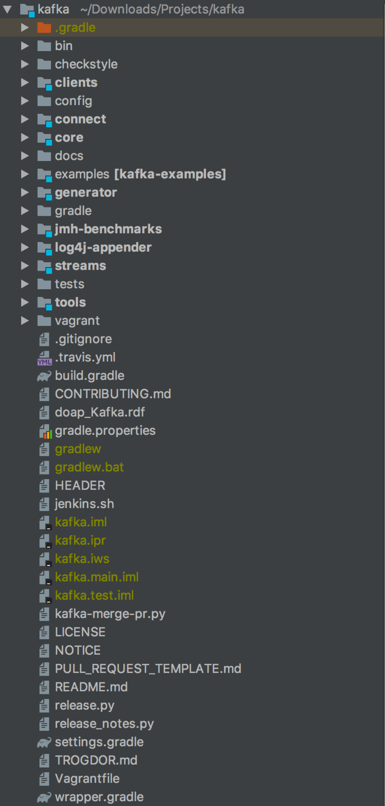
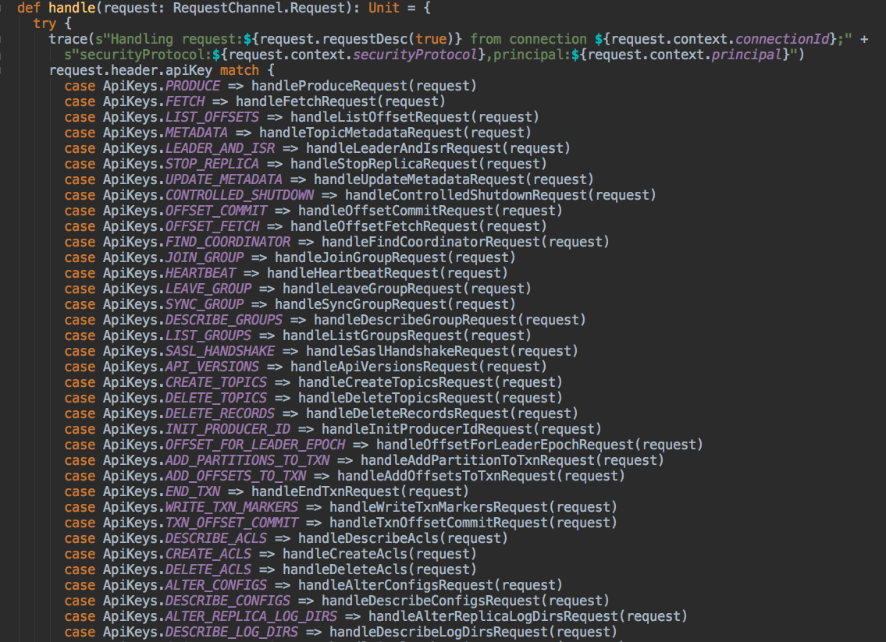
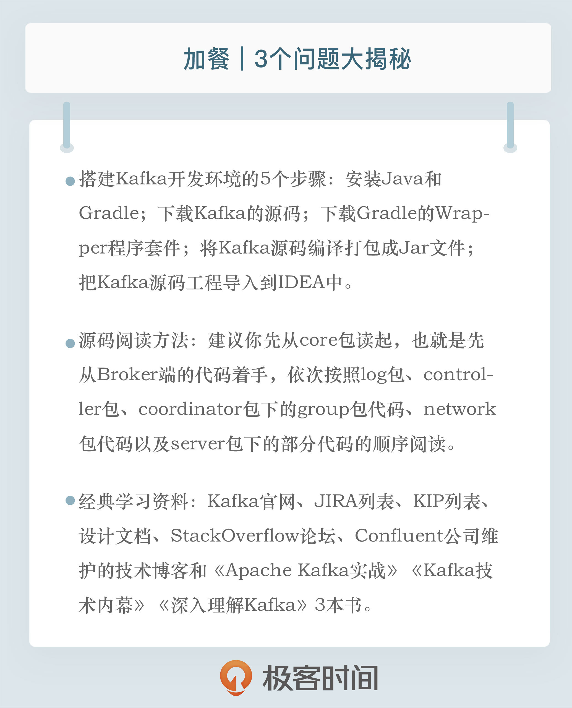

# 加餐 搭建开发环境、阅读源码方法、经典学习资料大揭秘

你好，我是胡夕。

截止到现在，专栏已经更新了 38 讲，你掌握得怎么样了呢？如果暂时掌握得不是很好，也没有关系，慢慢来，有问题记得在留言区留言，我们一起讨论。

今天，我们来聊点儿不一样的。我总结了 3 个讨论热度很高的话题，现在一一来为你“揭秘”。

1. 如何搭建 Kafka 开发环境？很多人对于编译和调试 Kafka 饶有兴致，却苦于无从下手。今天我就给你完整地演示一遍搭建 Kafka 开发环境的过程。
1. 如何阅读 Kafka 源码？我曾经在专栏\[第 1 讲\]提到过我自己阅读 Kafka 源码的经历，后来我收到很多留言，问我是如何阅读的，今天，我就跟你分享一些阅读 Kafka 源代码的比较好的法则或者技巧。
1. Kafka 的学习资料。幸运的是，我在这方面还是有过一些总结的，今天我会毫无保留地把资料全部分享给你。

## Kafka 开发环境搭建

现在，我先来回答第 1 个问题：如何搭建 Kafka 开发环境。我以 IDEA 为例进行说明，Eclipse 应该也是类似的。

### 第 1 步：安装 Java 和 Gradle

要搭建 Kafka 开发环境，你必须要安装好 Java 和 Gradle，同时在 IDEA 中安装 Scala 插件。你最好把 Java 和 Gradle 环境加入到环境变量中。

### 第 2 步：下载 Kafka 的源码

完成第 1 步之后，下载 Kafka 的源码，命令如下：

```
cd Projects
git clone https://github.com/apache/kafka.git
```

这个命令下载的是 Kafka 的 trunk 分支代码，也就是 **当前包含所有已提交 Patch 的最新代码，甚至比 Kafka 官网上能够下载到的最新版本还要超前很多** 。值得注意的是，如果你想向 Kafka 社区贡献代码，通常要以 trunk 代码为主体进行开发。

### 第 3 步：下载 Gradle 的 Wrapper 程序套件

代码下载完成之后，会自动创建一个名为 kafka 的子目录，此时需要进入到该目录下，执行下面的这条命令，主要目的是下载 Gradle 的 Wrapper 程序套件。

```
$ gradle
Starting a Gradle Daemon (subsequent builds will be faster)
> Configure project :
Building project 'core' with Scala version 2.12.9
Building project 'streams-scala' with Scala version 2.12.9
Deprecated Gradle features were used in this build, making it incompatible with Gradle 6.0.
Use '--warning-mode all' to show the individual deprecation warnings.
See https://docs.gradle.org/5.3/userguide/command_line_interface.html#sec:command_line_warning
```

### 第 4 步：将 Kafka 源码编译打包成 Jar 文件

现在，你可以运行下列命令，将 Kafka 源码编译打包成 Jar 文件：

```
./gradlew clean releaseTarGz
```

通常你需要等待一段时间，经过一系列操作之后，比如 Gradle 拉取依赖 Jar 包、编译 Kafka 源码、打包等，你可以在 core 的 build/distributions 下面找到生成的 tgz 包：kafka_2.12-2.4.0-SNAPSHOT。解压之后，这就是一个可以正常启动运行的 Kafka 环境了。

### 第 5 步：把 Kafka 源码工程导入到 IDEA 中

这也是搭建开发环境的最后一步。你可以先执行下面的命令去创建 IDEA 项目所需要的项目文件：

```
./gradlew idea  # 如果你用的是 Eclipse，执行./gradlew eclipse 即可
```

接着，你需要打开 IDEA，选择“打开工程”，然后再选择 kafka 目录即可。

至此，我们就在 IDEA 中搭建了 Kafka 源码环境。你可以打开 Kafka.scala 文件，右键选择“运行”，这时，你应该可以看到启动 Kafka Broker 的命令行用法说明，如下图所示：


总体来说，Kafka 工程自从由使用 sbt 改为使用 Gradle 管理之后，整个项目的编译和构建变得简单多了，只需要 3、4 条命令就能在本机环境中搭建测试开发环境了。

## Kafka 源码阅读方法

搭建好了开发环境，下一步自然就是阅读 Kafka 源码并尝试自行修改源码了。下图是 IDEA 上 Kafka 工程的完整目录列表。



在这张图中，有几个子目录需要你重点关注一下。

- **core**：Broker 端工程，保存 Broker 代码。
- **clients**：Client 端工程，保存所有 Client 代码以及所有代码都会用到的一些公共代码。
- **streams**：Streams 端工程，保存 Kafka Streams 代码。
- **connect**：Connect 端工程，保存 Kafka Connect 框架代码以及 File Connector 代码。

我之前说过，Kafka 源码有 50 万行之多，没有重点地进行通读，效率会特别低。最初我就是盲读源码的，深感效果极差，所以，我觉得非常有必要为你推荐几条最佳实践。

我建议你**先从 core 包读起，也就是先从 Broker 端的代码着手**。你可以按照下面的顺序进行阅读。

1.**log 包 **。log 包中定义了 Broker 底层消息和索引保存机制以及物理格式，非常值得一读。特别是 Log、LogSegment 和 LogManager 这几个类，几乎定义了 Kafka 底层的消息存储机制，一定要重点关注。
2.** controller 包 **。controller 包实现的是 Kafka Controller 的所有功能，特别是里面的 KafkaController.scala 文件，它封装了 Controller 的所有事件处理逻辑。如果你想弄明白 Controller 的工作原理，最好多读几遍这个将近 2000 行的大文件。
3.** coordinator 包下的 group 包代码 **。当前，coordinator 包有两个子 package：group 和 transaction。前者封装的是 Consumer Group 所用的 Coordinator；后者封装的是支持 Kafka 事务的 Transaction Coordinator。我个人觉得你最好把 group 包下的代码通读一遍，了解下 Broker 端是如何管理 Consumer Group 的。这里比较重要的是** GroupMetadataManager 和 GroupCoordinator 类 **，它们定义了 Consumer Group 的元数据信息以及管理这些元数据的状态机机制。
4.** network 包代码以及 server 包下的部分代码**。如果你还有余力的话，可以再读一下这些代码。前者的 SocketServer 实现了 Broker 接收外部请求的完整网络流程。我们在专栏第 24 讲说过，Kafka 用的是 Reactor 模式。如果你想搞清楚 Reactor 模式是怎么在 Kafka“落地”的，就把这个类搞明白吧。

从总体流程上看，Broker 端顶部的入口类是 KafkaApis.scala。这个类是处理所有入站请求的总入口，下图展示了部分请求的处理方法：



你可以进到不同的方法里面去看实际的请求处理逻辑。比如 handleProduceRequest 方法是处理 Producer 生产消息请求的，而 handleFetchRequest 方法则是处理消息读取请求的。

我们刚刚说的都是 core 代码包下的重要类文件。在客户端 clients 包下，我推荐你重点阅读 4 个部分的内容。

1. **org.apache.kafka.common.record 包。**这个包下面是各种 Kafka 消息实体类，比如用于在内存中传输的 MemoryRecords 类以及用于在磁盘上保存的 FileRecords 类。
1. **org.apache.kafka.common.network 包。**这个包不用全看，你重点关注下 Selector、KafkaChannel 就好了，尤其是前者，它们是实现 Client 和 Broker 之间网络传输的重要机制。如果你完全搞懂了这个包下的 Java 代码，Kafka 的很多网络异常问题也就迎刃而解了。
1. **org.apache.kafka.clients.producer 包**。顾名思义，它是 Producer 的代码实现包，里面的 Java 类很多，你可以重点看看 KafkaProducer、Sender 和 RecordAccumulator 这几个类。
1. **org.apache.kafka.clients.consumer 包。**它是 Consumer 的代码实现包。同样地，我推荐你重点阅读 KafkaConsumer、AbstractCoordinator 和 Fetcher 这几个 Java 文件。

另外，在阅读源码的时候，不管是 Broker 端还是 Client 端，你最好结合 Java 调试一起来做。通过 Debug 模式下打断点的方式，一步一步地深入了解 Kafka 中各个类的状态以及在内存中的保存信息，这种阅读方式会让你事半功倍。

## Kafka 推荐学习资料

如果你暂时对搭建开发环境或阅读源码没有兴趣，但又想快速深入地学习 Kafka 的话，直接学习现成的资料也不失为一个妙法。接下来，我就向你推荐一些很有价值的 Kafka 学习资料。

第 1 个不得不提的当然就是[Kafka 官网](https://kafka.apache.org/documentation/)。很多人会忽视官网，但其实官网才是最重要的学习资料。你只需要通读几遍官网，并切实掌握里面的内容，就已经能够较好地掌握 Kafka 了。

第 2 个是 Kafka 的\[JIRA 列表\](<https://issues.apache.org/jira/browse/KAFKA-8832?filter=-4&jql=project> %3D KAFKA ORDER BY created DESC)。当你碰到 Kafka 抛出的异常的时候，不妨使用异常的关键字去 JIRA 中搜索一下，看看是否是已知的 Bug。很多时候，我们碰到的问题早就已经被别人发现并提交到社区了。此时， **JIRA 列表就是你排查问题的好帮手** 。

第 3 个是[Kafka KIP 列表](https://cwiki.apache.org/confluence/display/KAFKA/Kafka+Improvement+Proposals)。KIP 的全称是 Kafka Improvement Proposals，即 Kafka 新功能提议。你可以看到 Kafka 的新功能建议及其讨论。如果你想了解 Kafka 未来的发展路线，KIP 是不能不看的。当然，如果你想到了一些 Kafka 暂时没有的新功能，也可以在 KIP 中提交自己的提议申请，等待社区的评审。

第 4 个是 Kafka 内部团队维护的[设计文档](https://cwiki.apache.org/confluence/display/KAFKA/Index)。在这里，你几乎可以找到所有的 Kafka 设计文档。其中关于 Controller 和新版本 Consumer 的文章都很有深度，我建议你一定要重点读一读。

第 5 个是著名的[StackOverflow 论坛](https://stackoverflow.com/questions/tagged/apache-kafka?sort=newest&pageSize=15)。当今，StackOverflow 论坛对程序员意味着什么，想必我不说你也知道。这里面的 Kafka 问题很有深度。事实上，从仅仅是 StackOverflow 上的一个问题，到最后演变成了 Kafka 的 Bug 修复或新功能实现的情况屡见不鲜。

第 6 个是 Confluent 公司维护的[技术博客](https://www.confluent.io/blog/)。这是 Kafka 商业化公司 Confluent 团队自己维护的技术博客，里面的技术文章皆出自 Kafka Committer 之手，质量上乘，我从中受益匪浅。比如讲述 Kafka 精确一次处理语义和事务的文章，含金量极高，你一定要去看一下。

第 7 个是我自己的[博客](https://www.cnblogs.com/huxi2b/)。我会定期在博客上更新 Kafka 方面的原创文章。有的是我对 Kafka 技术的一些理解，有的是 Kafka 的最新动态。虽然不是国内质量最好的，但应该是坚持时间最长的。毕竟，我这个博客就只有 Kafka 的内容，而且已经写了好几年了。

最后，我给推荐你 3 本学习 Kafka 的书。

第 1 本是我的[《Apache Kafka 实战》](https://book.douban.com/subject/30221096/)，我在里面总结了我这几年使用和学习 Kafka 的各种实战心得。这本书成书于 2018 年，虽然是以 Kafka 1.0 为模板撰写的，而 Kafka 目前已经出到了 2.3 版本，但其消息引擎方面的功能并没有什么重大变化，因此绝大部分内容依然是有效的。

第 2 本是[《Kafka 技术内幕》](https://book.douban.com/subject/27179953/)。我个人非常喜欢这个作者的书写风格，而且这本书内容翔实，原理分析得很透彻，配图更是精彩。

第 3 本是 2019 年新出的一本名为[《深入理解 Kafka》](https://book.douban.com/subject/30437872/)的书。这本书的作者是一位精通 RabbitMQ 和 Kafka 的著名技术人，对消息中间件有着自己独特的见解。

这些资料各有侧重，你可以根据自己的实际需求，选择相应的资料进行学习。

## 小结

好了，我们来小结一下。在今天的文章里，我跟你分享了很多经验，比如如何搭建 Kafka 开发环境、如何阅读 Kafka 源码等，希望这些经验可以帮你有效地节省时间，避免走一些弯路。另外，我把我收集到的相关学习资料全部列了出来，分享给你，也希望这些资料能够帮你更好地学习 Kafka。

讲到这里，我想再强调一下，学习是个持续的过程。经验和外部帮助固然重要，但最关键的，还是自己要付出努力，持之以恒。

还是那句话：Stay focused and work hard！


