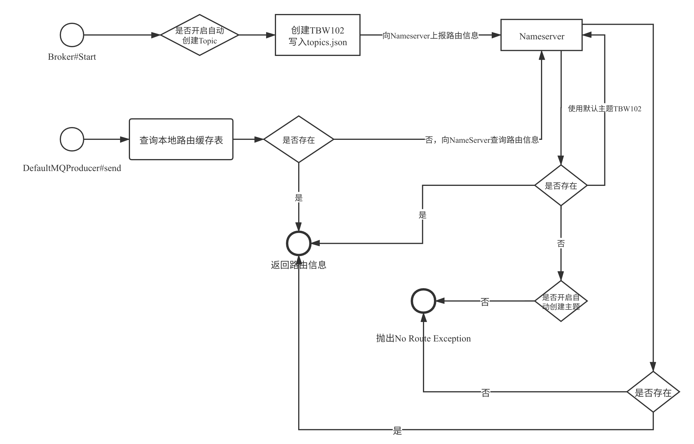
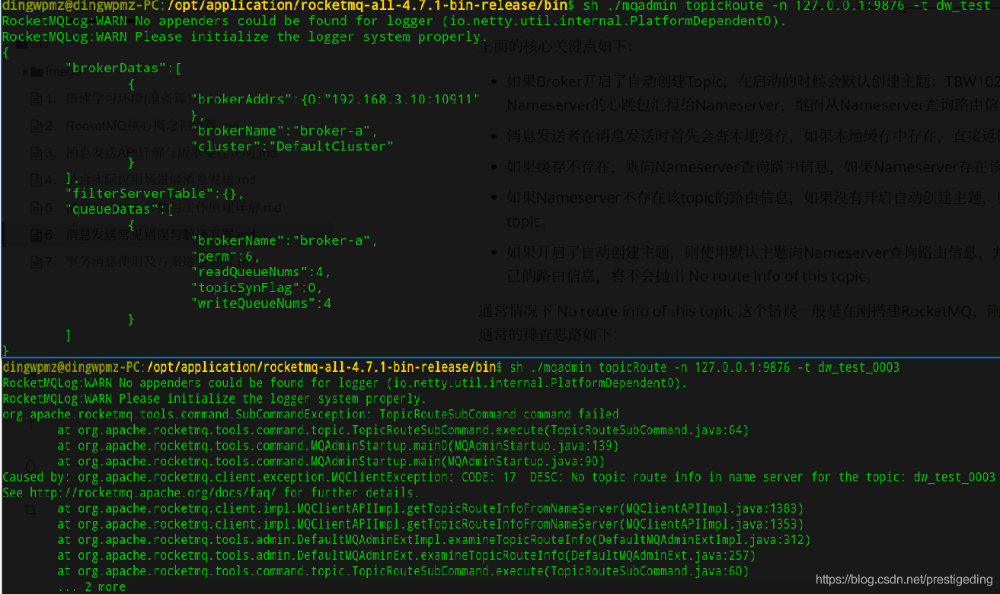
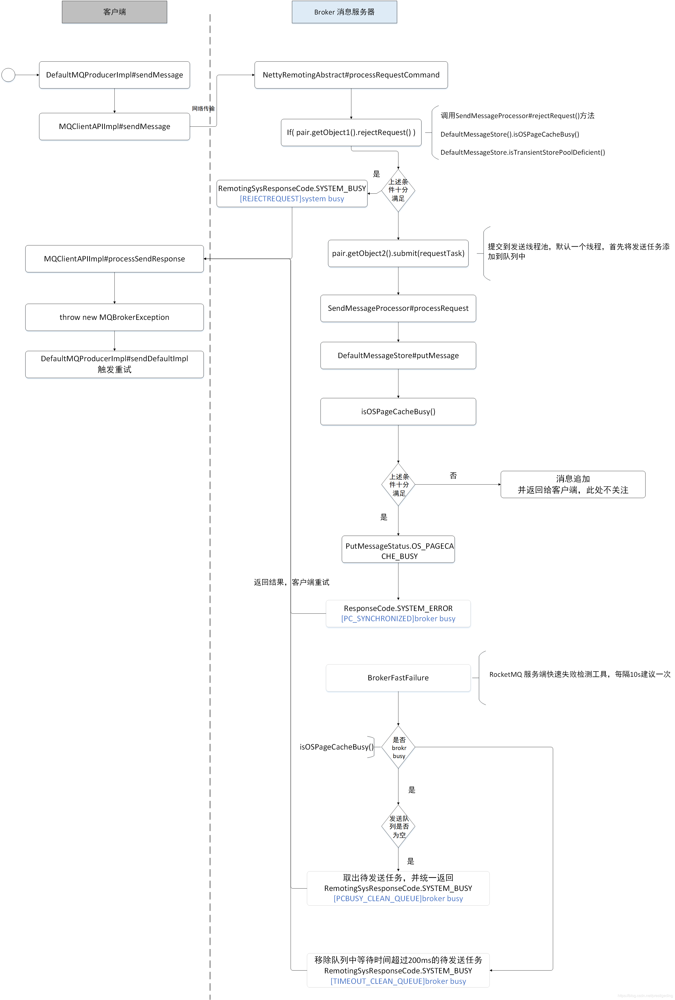
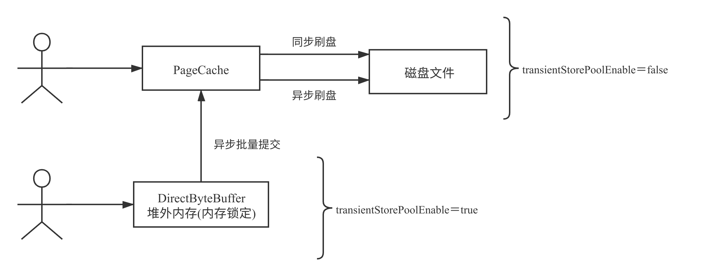

06 消息发送常见错误与解决方案
================

本篇将结合自己使用 RocketMQ 的经验，对消息发送常见的问题进行分享，基本会遵循出现问题，分析问题、解决问题。

### No route info of this topic

无法找到路由信息，其完整的错误堆栈信息如下：


而且很多读者朋友会说，Broker 端开启了自动创建主题也会出现上述问题。

RocketMQ 的路由寻找流程如下图所示：



上面的核心关键点如下：

* 如果 Broker 开启了自动创建 Topic，在启动的时候会默认创建主题 TBW102，并会随着 Broker 发送到 NameServer 的心跳包汇报给 NameServer，继而从 NameServer 查询路由信息时能返回路由信息。
* 消息发送者在消息发送时首先会查本地缓存，如果本地缓存中存在，直接返回路由信息。
* 如果缓存不存在，则向 NameServer 查询路由信息，如果 NameServer 存在该路由信息，就直接返回。
* 如果 NameServer 不存在该 Topic 的路由信息，如果没有开启自动创建主题，则抛出 `No route info of this topic`。
* 如果开启了自动创建主题，则使用默认主题向 NameServer 查询路由信息，并使用默认 Topic 的路由信息为自己的路由信息，将不会抛出 `No route info of this topic`。

通常情况下 `No route info of this topic` 这个错误一般是在刚搭建 RocketMQ、刚入门 RocketMQ 遇到的比较多。通常的排查思路如下。

\\1. 可以通过 RocketMQ-Console 查询路由信息是否存在，或使用如下命令查询路由信息：

```
cd ${ROCKETMQ_HOME}/bin

sh ./mqadmin topicRoute -n 127.0.0.1:9876 -t dw_test_0003


```

其输出结果如下所示：



\\2. 如果通过命令无法查询到路由信息，则查看 Broker 是否开启了自动创建 Topic，参数为 autoCreateTopicEnable，该参数默认为 true。但在生产环境不建议开启。

\\3. 如果开启了自动创建路由信息，但还是抛出这个错误，这个时候请检查客户端（Producer）连接的 NameServer 地址是否与 Broker 中配置的 NameServer 地址是否一致。

经过上面的步骤，基本就能解决该错误。

### 消息发送超时

消息发送超时，通常客户端的日志如下：


客户端报消息发送超时，通常第一怀疑的对象是 RocketMQ 服务器，是不是 Broker 性能出现了抖动，无法抗住当前的量。

那我们如何来排查 RocketMQ 当前是否有性能瓶颈呢？

首先我们执行如下命令查看 RocketMQ 消息写入的耗时分布情况：

```
cd /${USER.HOME}/logs/rocketmqlogs/

grep -n 'PAGECACHERT' store.log | more


```

输出结果如下所示：


RocketMQ 会每一分钟打印前一分钟内消息发送的耗时情况分布，我们从这里就能窥探 RocketMQ 消息写入是否存在明细的性能瓶颈，其区间如下：

* \[<=0ms\] 小于 0ms，即微妙级别的
* \[0~10ms\] 小于 10ms 的个数
* \[10~50ms\] 大于 10ms 小于 50ms 的个数

其他区间显示，绝大多数会落在微妙级别完成，按照笔者的经验如果 100~200ms 及以上的区间超过 20 个后，说明 Broker 确实存在一定的瓶颈，如果只是少数几个，说明这个是内存或 PageCache 的抖动，问题不大。

通常情况下超时通常与 Broker 端的处理能力关系不大，还有另外一个佐证，在 RocketMQ broker 中还存在快速失败机制，即当 Broker 收到客户端的请求后会将消息先放入队列，然后顺序执行，如果一条消息队列中等待超过 200ms 就会启动快速失败，向客户端返回 `[TIMEOUT_CLEAN_QUEUE]broker busy`，这个在本专栏的第 3 部分会详细介绍。

在 RocketMQ 客户端遇到网络超时，通常可以考虑一些应用本身的垃圾回收，是否由于 GC 的停顿时间导致的消息发送超时，这个我在测试环境进行压力测试时遇到过，但生产环境暂时没有遇到过，大家稍微留意一下。

在 RocketMQ 中通常遇到网络超时，通常与网络的抖动有关系，但由于我对网络不是特别擅长，故暂时无法找到直接证据，但能找到一些间接证据，例如在一个应用中同时连接了 Kafka、RocketMQ 集群，发现在出现超时的同一时间发现连接到 RocketMQ 集群内所有 Broker，连接到 Kafka 集群都出现了超时。

**但出现网络超时，我们总得解决，那有什么解决方案吗？ **我们对消息中间件的最低期望就是高并发低延迟，从上面的消息发送耗时分布情况也可以看出 RocketMQ 确实符合我们的期望，绝大部分请求都是在微妙级别内，故我给出的方案时，** 减少消息发送的超时时间，增加重试次数，并增加快速失败的最大等待时长**。具体措施如下。

\\1. 增加 Broker 端快速失败的时长，建议为 1000，在 Broker 的配置文件中增加如下配置：

```
maxWaitTimeMillsInQueue=1000


```

主要原因是在当前的 RocketMQ 版本中，快速失败导致的错误为 system\_busy，并不会触发重试，适当增大该值，尽可能避免触发该机制，详情可以参考本专栏第 3 部分内容，会重点介绍 system\_busy、broker\_busy。**如果 RocketMQ 的客户端版本为 4.3.0 以下版本（不含 4.3.0）：**将超时时间设置消息发送的超时时间为 500ms，并将重试次数设置为 6 次（这个可以适当进行调整，尽量大于 3），其背后的哲学是尽快超时，并进行重试，因为发现局域网内的网络抖动是瞬时的，下次重试的是就能恢复，并且 RocketMQ 有故障规避机制，重试的时候会尽量选择不同的 Broker，相关的代码如下：

```
  DefaultMQProducer producer = new DefaultMQProducer("dw_test_producer_group");

  producer.setNamesrvAddr("127.0.0.1:9876");

  producer.setRetryTimesWhenSendFailed(5);//　同步发送模式：重试次数

  producer.setRetryTimesWhenSendAsyncFailed(5);// 异步发送模式：重试次数

  producer.start();

  producer.send(msg,500);//消息发送超时时间


```** 如果 RocketMQ 的客户端版本为 4.3.0 及以上版本： **如果客户端版本为 4.3.0 及其以上版本，由于其设置的消息发送超时时间为所有重试的总的超时时间，故不能直接通过设置 RocketMQ 的发送 API 的超时时间，而是需要对其 API 进行包装，重试需要在外层收到进行，例如示例代码如下：

```

  public static SendResult send(DefaultMQProducer producer, Message msg, int

                                retryCount) {

      Throwable e = null;

      for(int i =0; i < retryCount; i ++ ) {

          try {

              return producer.send(msg,500); //设置超时时间，为 500ms，内部有重试机制

          } catch (Throwable e2) {

              e = e2;

          }

      }

      throw new RuntimeException("消息发送异常",e);

   }

```

### System busy、Broker busy

在使用 RocketMQ 中，如果 RocketMQ 集群达到 1W/tps 的压力负载水平，System busy、Broker busy 就会是大家经常会遇到的问题。例如如下图所示的异常栈。


纵观 RocketMQ 与 System busy、Broker busy 相关的错误关键字，总共包含如下 5 个：

```

[REJECTREQUEST]system busy

too many requests and system thread pool busy

[PC_SYNCHRONIZED]broker busy

[PCBUSY_CLEAN_QUEUE]broker busy

[TIMEOUT_CLEAN_QUEUE]broker busy

```

####** 原理分析 **我们先用一张图来阐述一下，在消息发送的全生命周期中，分别在什么时候会抛出上述错误。



根据上述 5 类错误日志，其触发的原由可以归纳为如下 3 种。** 1\. PageCache 压力较大 **其中如下三类错误属于此种情况：

```

[REJECTREQUEST]system busy

[PC_SYNCHRONIZED]broker busy

[PCBUSY_CLEAN_QUEUE]broker busy

```

判断 PageCache 是否忙的依据就是，在写入消息、向内存追加消息时加锁的时间，默认的判断标准是加锁时间超过 1s，就认为是 PageCache 压力大，向客户端抛出相关的错误日志。** 2\. 发送线程池挤压的拒绝策略 **在 RocketMQ 中处理消息发送的，是一个只有一个线程的线程池，内部会维护一个有界队列，默认长度为 1W。如果当前队列中挤压的数量超过 1w，执行线程池的拒绝策略，从而抛出 \[too many requests and system thread pool busy\] 错误。** 3\. Broker 端快速失败 **默认情况下 Broker 端开启了快速失败机制，就是在 Broker 端还未发生 PageCache 繁忙（加锁超过 1s）的情况，但存在一些请求在消息发送队列中等待 200ms 的情况，RocketMQ 会不再继续排队，直接向客户端返回 System busy，但由于 RocketMQ 客户端目前对该错误没有进行重试处理，所以在解决这类问题的时候需要额外处理。

####** PageCache 繁忙解决方案 **一旦消息服务器出现大量 PageCache 繁忙（在向内存追加数据加锁超过 1s）的情况，这个是比较严重的问题，需要人为进行干预解决，解决的问题思路如下。** 1\. transientStorePoolEnable**

开启 transientStorePoolEnable 机制，即在 Broker 中配置文件中增加如下配置：

```

transientStorePoolEnable=true

```

transientStorePoolEnable 的原理如下图所示：



引入 transientStorePoolEnable 能缓解 PageCache 的压力背后关键如下：

*   消息先写入到堆外内存中，该内存由于启用了内存锁定机制，故消息的写入是接近直接操作内存，性能可以得到保证。
*   消息进入到堆外内存后，后台会启动一个线程，一批一批将消息提交到 PageCache，即写消息时对 PageCache 的写操作由单条写入变成了批量写入，降低了对 PageCache 的压力。

引入 transientStorePoolEnable 会增加数据丢失的可能性，如果 Broker JVM 进程异常退出，提交到 PageCache 中的消息是不会丢失的，但存在堆外内存（DirectByteBuffer）中但还未提交到 PageCache 中的这部分消息，将会丢失。但通常情况下，RocketMQ 进程退出的可能性不大，通常情况下，如果启用了 transientStorePoolEnable，消息发送端需要有重新推送机制（补偿思想）。

**2\. 扩容 **如果在开启了 transientStorePoolEnable 后，还会出现 PageCache 级别的繁忙，那需要集群进行扩容，或者对集群中的 Topic 进行拆分，即将一部分 Topic 迁移到其他集群中，降低集群的负载。关于 RocketMQ 优雅停机、扩容方案等，将在本专栏的** 运维实战部分 **做专题介绍。

> 温馨提示：在 RocketMQ 出现 PageCache 繁忙造成的 Broker busy，RocketMQ Client 会有重试机制。

####** TIMEOUT\_CLEAN\_QUEUE 解决方案**

由于如果出现 TIMEOUT\_CLEAN\_QUEUE 的错误，客户端暂时不会对其进行重试，故现阶段的建议是适当增加快速失败的判断标准，即在 Broker 的配置文件中增加如下配置：

```

＃该值默认为 200，表示 200ms

waitTimeMillsInSendQueue=1000

```

温馨提示，关于 Broker busy，笔者发表过两篇文章，大家也可以结合着看：

*   [RocketMQ 消息发送 System busy、Broker busy 原因分析与解决方案](https://mp.weixin.qq.com/s/N_ttVjBpqVUA0CGrOybNLA)
*   [再谈 RocketMQ Broker busy](https://mp.weixin.qq.com/s/1yFedcwtQ7mYcuHDvGCrqw)

### 小结

本篇主要对实际中常遇到的，关于消息发送方面经常遇到的问题进行剖析，从而提出解决方案。
