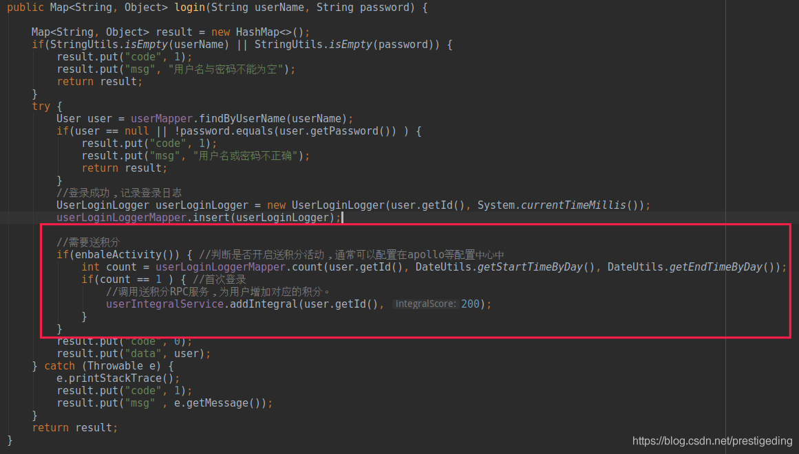
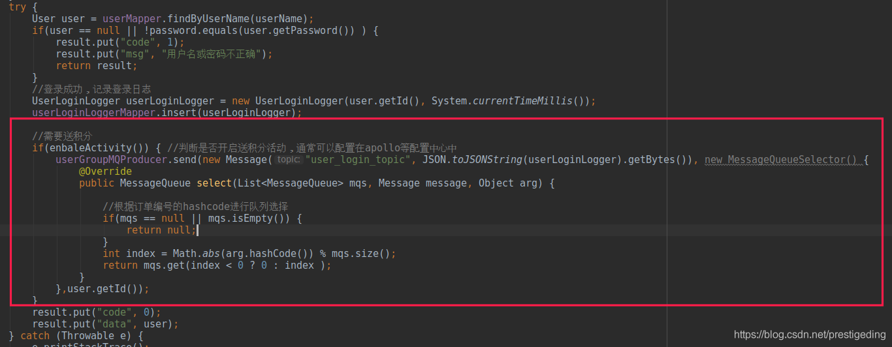
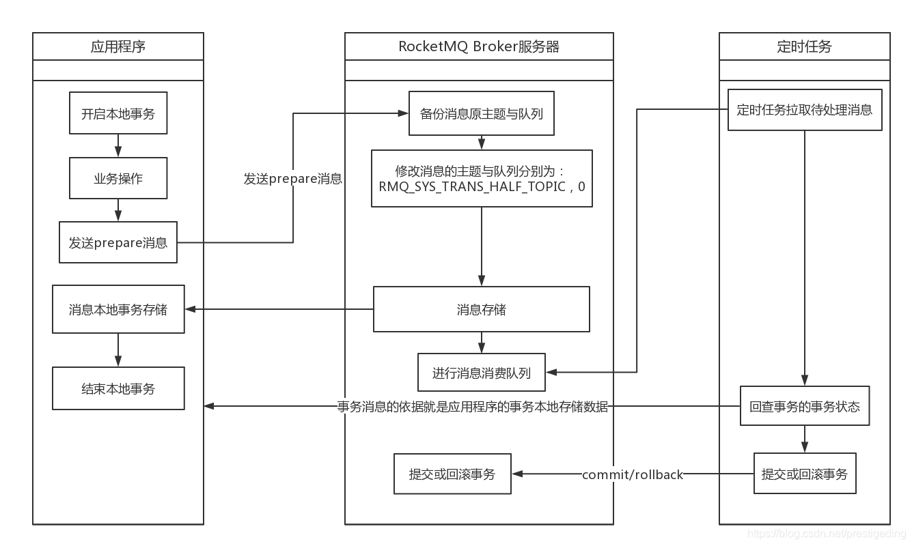
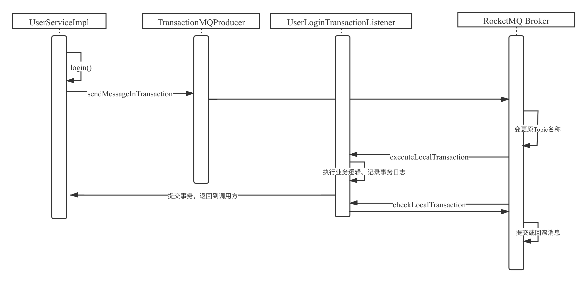
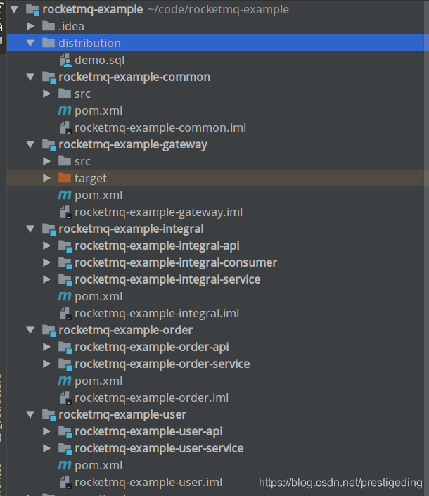
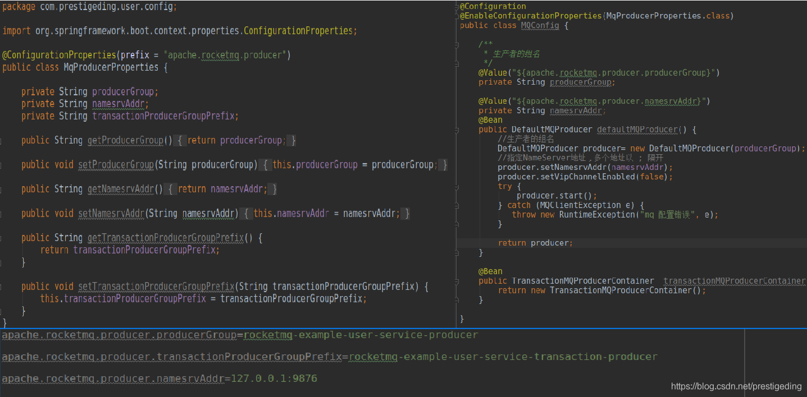
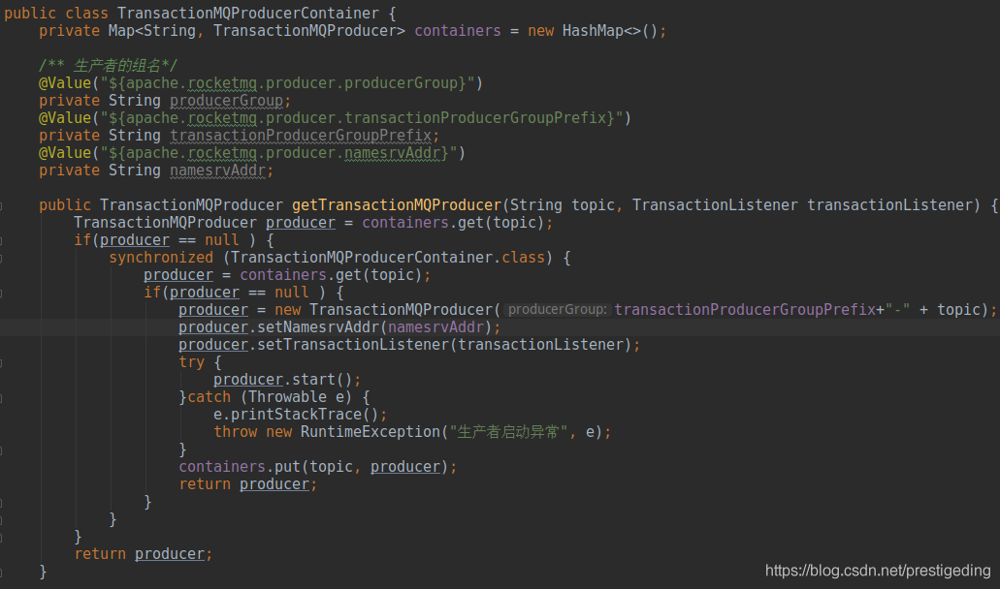
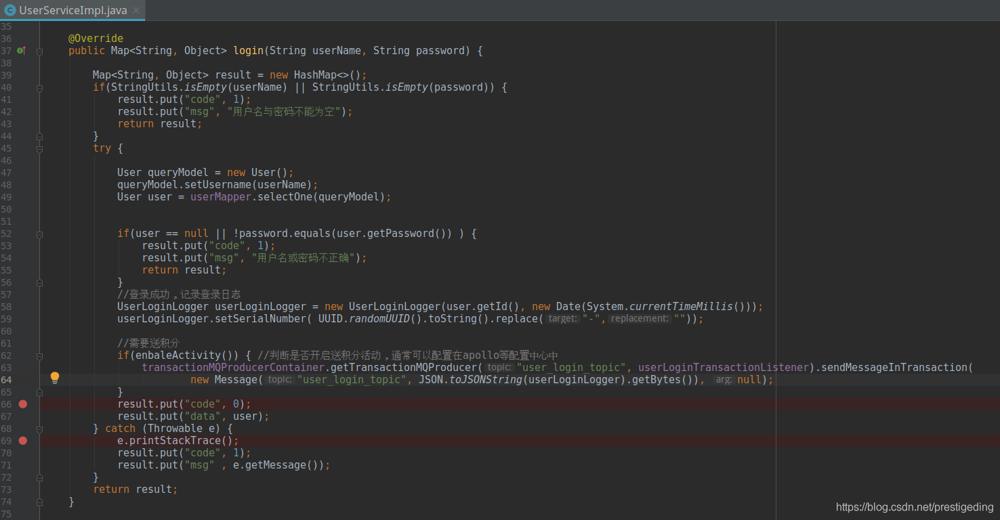
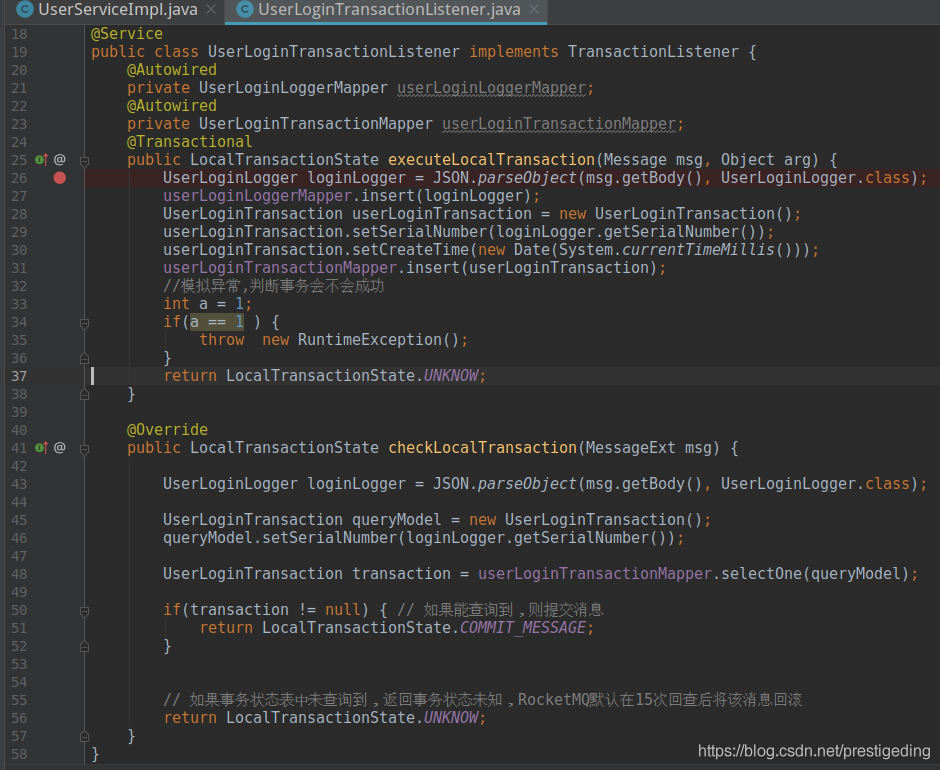
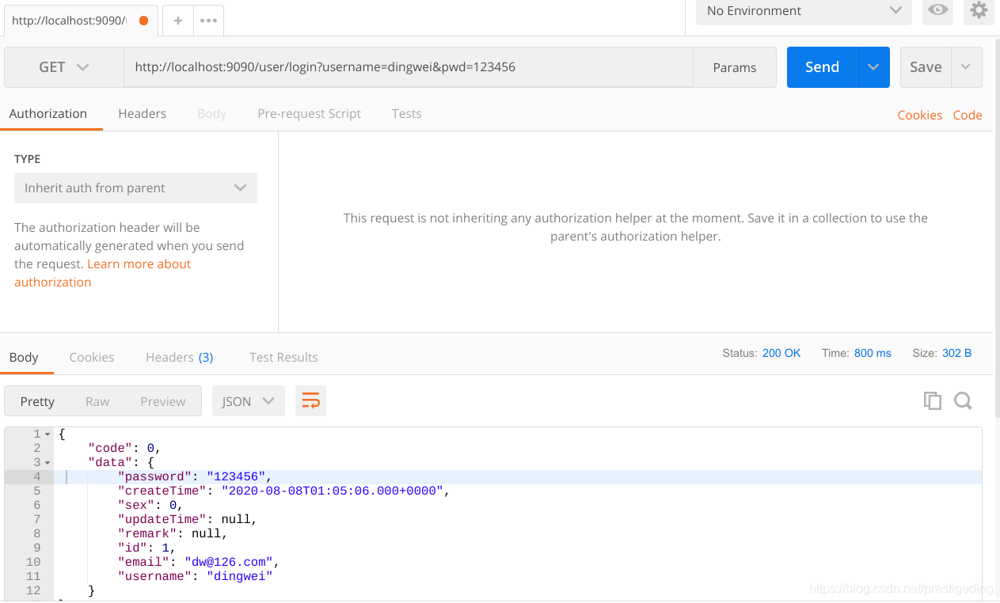

# 07 事务消息使用及方案选型思考

### 事务消息应用场景

首先需要申明的是，事务消息与业界用 RocketMQ 解决分布式事务，并不是一回事。

RocketMQ 引入事务消息，主要是要解决什么问题呢？接下来以电商一个登录送积分的示例来展开本文的叙述。

在互联网电商发展的初期，为了提高用户的活跃度，通常会采取这样一个提高用户活跃度：一个用户每一天首次登录送积分活动。

在没有提出送积分活动时，用户登录的代码如下：

```
public Map<String, Object> login(String userName, String password) {
    Map<String, Object> result = new HashMap<>();
    if(StringUtils.isEmpty(userName) || StringUtils.isEmpty(password)) {
       result.put("code", 1);
       result.put("msg", "用户名与密码不能为空");
       return result;
     }
     try {
        User user = userMapper.findByUserName(userName);
        if(user == null || !password.equals(user.getPassword()) ) {
            result.put("code", 1);
            result.put("msg", "用户名或密码不正确");
            return result;
         }
         //登录成功，记录登录日志
         UserLoginLogger userLoginLogger = new UserLoginLogger(user.getId(),                               System.currentTimeMillis());
         userLoginLoggerMapper.insert(userLoginLogger);
         result.put("code", 0);
         result.put("data", user);
     } catch (Throwable e) {
         e.printStackTrace();
         result.put("code", 1);
         result.put("msg" , e.getMessage());
     }
     return result;
 }
```

> 温馨提示：本文所有的示例代码只是用来描述场景，但代码的实现只是用来阐述最基本的场景，与具体的生产代码还是存在一些差别，主要是指在业务的完备性方面。

上面的示例代码完成用户登录主要分成了 3 个步骤：

1. 验证用户参数是否合法
1. 验证用户名密码是否正确
1. 记录此次登录操作记录日志

现在为了提高用户的日活，活动部推出了一个活动，从 2020-09-01 到 09-15 号，用户每天首次登录，送 200 积分。

开发收到这个需求后，三下两除二就搞定了，写出如下代码：



红色部分为本次送积分需求新增的代码，这种方式存在一个明显的弊端，就是会增加用户登录的耗时，因为需要调用一个积分的 RPC 服务。经分析我们可以任务用户登录操作为主流程，应该重复降低该服务的延迟，送积分这个只是一个辅助流程，完全可以将其解耦，这个时候自然而言会想到利用消息中间件来完成解耦。没错，经过改造后的代码如下图所示：



但这样问题又来了，如果消息发送成功了，然后被用户直接用 `kill -9` 命令将应用程序关闭，这样导致数据库并没有存储此次登录日志。但由于消息发送成功了，会送积分，那等用户再次登录的时候，再次发送消息会出现积分被重复发放，即这里的关键是无法保证 MySQL 数据库事务与消息发送这两个独立的操作要么同时成功，要么同时失败，即需要具备分布式事务的处理能力。

故为了解决上述消息发送与数据库事务的不一致性带来的业务出错，RocketMQ 在 4.3.0 版本引入了事务消息，完美解决上述难题。

### RocketMQ 事务消息原理

事务消息实现原理如下图所示：



应用程序在事务内完成相关业务数据落库后，需要同步调用 RocketMQ 消息发送接口，发送状态为 prepare 的消息，消息发送成功后 RocketMQ 服务器会回调 RocketMQ 消息发送者的事件监听程序，记录消息的本地事务状态，该相关标记与本地业务操作同属一个事务，确保消息发送与本地事务的原子性。

RocketMQ 在收到类型为 prepare 的消息时，会首先备份消息的原主题与原消息消费队列，然后将消息存储在主题为 RMQ_SYS_TRANS_HALF_TOPIC 的消息消费队列中，就是因为这样，消费端并不会立即被消费到。

RocketMQ 消息服务器开启一个定时任务，消费 RMQ_SYS_TRANS_HALF_TOPIC 的消息，向消息发送端（应用程序）发起消息事务状态回查，应用程序根据保存的事务状态回馈消息服务器事务的状态（提交、回滚、未知），如果是提交或回滚，则消息服务器提交或回滚消息，如果是未知，待下一次回查，RocketMQ 允许设置一条消息的回查间隔与回查次数，如果在超过回查次数后未知消息的事务状态，则默认回滚消息。

### 事务消息实战

从上面的过程，其实可以基本看成 RocketMQ 事务消息的实现原理有点类似于两阶段提交＋定时轮循，其实现套路其实与在没有事务消息之前，我们会通过数据库＋定时任务的机制来实现，只不过 RocketMQ 的事务消息自动提供了定时回查的功能。接下来我们将以上述用户登录＋送积分这个场景，来基于 Spring Boot 的真实应用，使用事务消息来解决我们遇到的问题，实现用户登录、消息发送这两个分布式操作的一致性。

本次事务消息的整体时序图如下：



接下来我将给出关键代码的截图，笔者为了后续对专栏的演示更贴近实战，从本篇文章开始给出了一个基于 Spring Boot、Dubbo、MyBatis、RocketMQ 的项目。项目的下载信息：

> [https://pan.baidu.com/s/1ccSMN_dGMaUrFr-57UTn_A](https://pan.baidu.com/s/1ccSMN_dGMaUrFr-57UTn_A)
>
> 提取码：srif

项目的整体目录如下：



事务实战的代码位于 rocketmq-example-user-service 模块。

#### **RocketMQ 生产者初始化** 



代码解读：上述引入了 TransactionMQProducerContainer，主要的目的是事务消息需要关联一个事务回调监听器，故这里采取的是每一个 Topic 单独一个 TransactionMQProducer，所属的生产者组为一个固定前缀与 Topic 的组合。

#### **UserServiceImpl 业务方法实现概述** 

代码解决：UserServiceImpl 的 login 就是实现登录的处理逻辑，首先先执行普通的业务逻辑，即验证登录用户的用户名与密码，如果不匹配，返回对应的业务错误提示；如果符合登录后，构建登录日志，并为登录日志生成全局唯一的业务流水号。该流水号将贯穿整个业务处理路程，即事务回调、消息消费等各个环节。

> 注意：这里并不会操作有数据库的写入操作，数据库的写入操作放在了事务消息的监听器中。

#### **事件回调监听器** 

代码解读：

```
executeLocalTransaction
```

引入了一个事务本地表，在一个事务中将业务数据，本地事务日志一起操作数据库，该事务提交成功。业务写的类型为什么要放在这里主要是 RocketMQ 对该方法中产生的异常进行捕获，这样如果将业务操作放在 UserServiceImpl 类中，将记录本地事务日志表放在该回调函数中，这样会导致两者并不会具备一致性。

```
checkLocalTransaction
```

该方法由 RocketMQ Broker 会主动调用，在该方法我们如果能根据唯一流水号查询到记录，则任务事务成功提交，则返回 COMMIT_MESSAGE，RocketMQ 会提交事务，将处于 PREPARE 状态的消息发送到用户真实的 Topic 中，这样消费端就能正常消费消息；如果从本地事务表中未查询到消息，返回 UNOWN 即可，不能直接返回 ROLL_BACK，只有当 RocketMQ 在指定回查次数后还未查询到，则会回滚该条消息，客户端不会消费到消息， **实现业务与消息发送的分布式事务一致性** 。

上面有增加测试代码，就是该事务成功与事务失败，看数据库与 MQ 是否是一致性。

本例的测试方法，启动 rocketmq-example-gateway、rocketmq-example-user-service 两个模块，并且需要启动 RocketMQ 服务器、ZooKeeper 服务器，然后可以通过浏览器或 Postman 发送请求，进行测试，示例如下：



然后可以通过 RocketMQ-Console 查看消息是否已成功发送，其截图如下：


### 事务消息架构思考

事务消息能保证业务与消息发送这两个操作的强一致性，以前在没有事务消息时，通常有两种方式解决方案。

- 严格的事务一致性，采用与 RocketMQ 事务消息的实现模型，自己实现本地事务表与回调，即多了一个步骤，通过定时任务扫描本地事务消息，进行消息发送。
- 基于补偿的思想，例如只在消息发送时采用消息重试机制，确保消息发送成功，另外结合业务的状态，以订单流为例，订单状态为已成功支付后，向 RocketMQ 集群发送一条消息，然后商户物流系统订阅该 Topic，对其进行消费，处理完后会将订单的状态变更为已发货，但如果这条消息被丢失，那无法驱动订单的后续流程，故这里可以基于补偿思想，用一个定时器扫描订单表，查找那些已支付但未发货的订单，并且已超过多少时间的订单，补发一条消息，同样能够最终的一致性。

事务消息确实能提供强一致性，但需要引入事务本地表，每一次业务都需要增加一次数据库的写入开销，而基于补偿思路，采取的是乐观的机制，并且出错的概率本来就很低，故效率通常会更好。

故大家可以根据实际情况进行技术选型，不要觉得事务消息这项技术和牛，就必须选用此种方案。

### 小结

本文的行文思路是先介绍事务消息的使用场景，然后详细介绍 RocketMQ 事务消息的实现原理，最后贴近实战，给出可以运行的 Spring Boot + MyBatis + RocketMQ + Dubbo 的项目示例，最后给出自己对其架构的一些简单思考。
