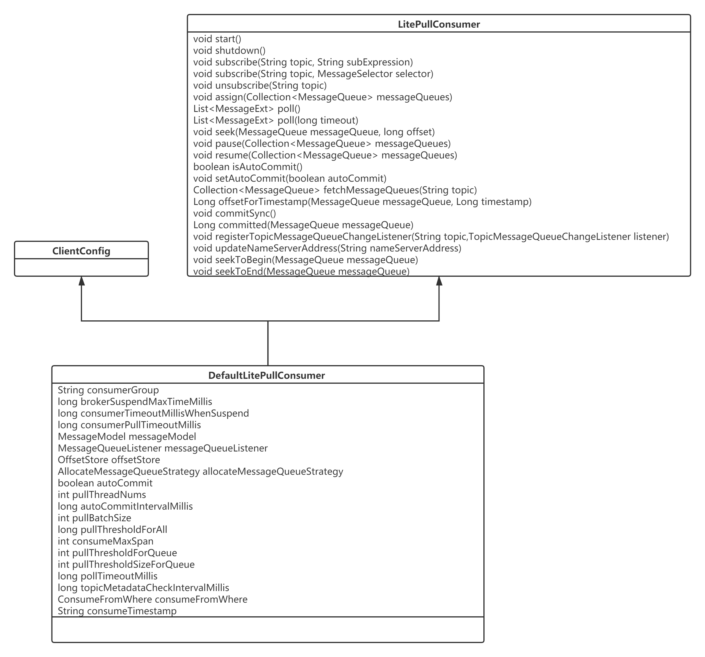
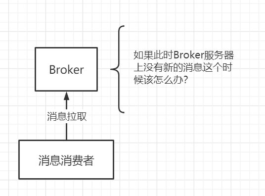

11 DefaultLitePullConsumer 核心参数与实战
==================================

在《消息消费 API 与版本变更》中也提到 DefaultMQPullConsumer（PULL 模式）的 API 太底层，使用起来及其不方便，RocketMQ 官方设计者也注意到这个问题，为此在 RocketMQ 4.6.0 版本中引入了 PULL 模式的另外一个实现类 DefaultLitePullConsumer，即从 4.6.0 版本后，DefaultMQPullConsumer 已经被标记为废弃，故接下来将重点介绍 DefaultLitePullConsumer，并探究如何在实际中运用它解决相关问题。

### DefaultLitePullConsumer 类图

首先我们来看一下 DefaultLitePullConsumer 的类图结构，如下图所示：



#### **核心方法详解**核心方法说明如下

```
void start()


```

启动消费者。

```
void shutdown()


```

关闭消费者。

```
void subscribe(String topic, String subExpression)


```

按照主题与消息过滤表达式进行订阅。

```
void subscribe(String topic, MessageSelector selector)


```

按照主题与过滤表达式订阅消息，过滤表达式可通过 MessageSelector 的 bySql、byTag 来创建，这个与 PUSH 模式类似，故不重复展开。

> 温馨提示：通过 subscribe 方式订阅 Topic，具备消息消费队列的重平衡，即如果消费消费者数量、主题的队列数发生变化时，各个消费者订阅的队列信息会动态变化。

```
void unsubscribe(String topic)


```

取消订阅。

```
void assign(Collection< MessageQueue > messageQueues)


```

收到指定该消费者消费的队列，这种消费模式不具备消息消费队列的自动重平衡。

```
List<MessageExt> poll()


```

消息拉取 API，默认超时时间为 5s。

```
List<MessageExt> poll(long timeout)


```

消息拉取 API，可指定消息拉取超时时间。在学习中笔者通常喜欢进行对比学习，故我们不妨对比一下 DefaultMQPullConsumer 的 pull 方法。


可以看出 LIte Pull Consumer 的拉取风格发生了变化，不需要用户手动指定队列拉取，而是通过订阅或指定队列，然后自动根据位点进行消息拉取，显得更加方便，个人觉得 DefaultLitePullConsumer 相关的 API 有点类似 Kafka 的工作模式了。

```
void seek(MessageQueue messageQueue, long offset)


```

改变下一次消息拉取的偏移量，即改变 poll() 方法下一次运行的拉取消息偏移量，类似于回溯或跳过消息，注意：如果设置的 offset 大于当前消费队列的消费偏移量，就会造成部分消息直接跳过没有消费，使用时请慎重。

```
void seekToBegin(MessageQueue messageQueue)


```

改变下一次消息拉取的偏移量到消息队列最小偏移量。其效果相当于重新来过一次。

```
void seekToEnd(MessageQueue messageQueue)


```

该变下一次消息拉取偏移量到队列的最大偏移量，即跳过当前所有的消息，从最新的偏移量开始消费。

```
void pause(Collection< MessageQueue > messageQueues)


```

暂停消费，支持将某些消息消费队列挂起，即 poll() 方法在下一次拉取消息时会暂时忽略这部分消息消费队列，可用于消费端的限流。

```
void resume(Collection< MessageQueue > messageQueues)


```

恢复消费。

```
boolean isAutoCommit()


```

是否自动提交消费位点，Lite Pull 模式下可设置是否自动提交位点。

```
void setAutoCommit(boolean autoCommit)


```

设置是否自动提交位点。

```
Collection<MessageQueue> fetchMessageQueues(String topic)


```

获取 Topic 的路由信息。

```
Long offsetForTimestamp(MessageQueue messageQueue, Long timestamp)


```

根据时间戳查找最接近该时间戳的消息偏移量。

```
void commitSync()


```

手动提交消息消费位点，在集群消费模式下，调用该方法只是将消息偏移量提交到 OffsetStore 在内存中，并不是实时向 Broker 提交位点，位点的提交还是按照定时任务定时向 Broker 汇报。

```
Long committed(MessageQueue messageQueue)


```

获取该消息消费队列已提交的消费位点（从 OffsetStore 中获取，即集群模式下会向 Broker 中的消息消费进度文件中获取。

```
void registerTopicMessageQueueChangeListener(String topic,TopicMessageQueueChangeListener listener)


```

注册主题队列变化事件监听器，客户端会每 30s 查询一下 订阅的 Topic 的路由信息（队列信息）的变化情况，如果发生变化，会调用注册的事件监听器。关于 TopicMessageQueueChangeListener 事件监听器说明如下：


事件监听参数说明如下。

```
String topic


```

主题名称。

```
Set<MessageQueue> messageQueues


```

当前该 Topic 所有的队列信息。

```
void updateNameServerAddress(String nameServerAddress)


```

更新 NameServer 的地址。

#### **核心属性介绍**通过对 DefaultLitePullConsumer 核心方法的了解，再结合我们目前已掌握的 DefaultMQPullConsumer、DefaultMQPushConsumer 相关知识，我相信大家对如何使用 DefaultLitePullConsumer 显得胸有成竹了，故暂时先不进入实战，我们一鼓作气看一下其核心属性

```
String consumerGroup


```

消息消费组。

```
long brokerSuspendMaxTimeMillis


```

长轮询模式，如果开启长轮询模式，当 Broker 收到客户端的消息拉取请求时如果当时并没有新的消息，可以在 Broker 端挂起当前请求，一旦新消息到达则唤醒线程，从 Broker 端拉取消息后返回给客户端，该值设置在 Broker 等待的最大超时时间，默认为 20s，建议保持默认值即可。

```
long consumerTimeoutMillisWhenSuspend


```

消息消费者拉取消息最大的超时时间，该值必须大于 brokerSuspendMaxTimeMillis，默认值为 30s，同样不建议修改该值。

```
long consumerPullTimeoutMillis


```

客户端与 Broker 建立网络连接的最大超时时间，默认为 10s。

```
MessageModel messageModel


```

消息组消费模型，可选值：集群模式、广播模式。

```
MessageQueueListener messageQueueListener


```

消息消费负载队列变更事件。

```
OffsetStore offsetStore


```

消息消费进度存储器，与 PUSH 模式机制一样。

```
AllocateMessageQueueStrategy allocateMessageQueueStrategy


```

消息消费队列负载策略，与 PUSH 模式机制一样。

```
boolean autoCommit


```

设置是否提交消息消费进度，默认为 true。

```
int pullThreadNums


```

消息拉取线程数量，默认为 20 个，注意这个是每一个消费者默认 20 个线程往 Broker 拉取消息。**这个应该是 Lite PULL 模式对比 PUSH 模式一个非常大的优势。**

```
long autoCommitIntervalMillis


```

自动汇报消息位点的间隔时间，默认为 5s。

```
int pullBatchSize


```

一次消息拉取最多返回的消息条数，默认为 10。

```
int pullThresholdForQueue


```

对于单个队列挤压的消息条数触发限流的阔值，默认为 1000，即如果某一个队列在本地挤压超过 1000 条消息，则停止消息拉取。

```
int pullThresholdSizeForQueue


```

对于单个队列挤压的消息总大小触发限流的阔值，默认为 100M。

```
int consumeMaxSpan


```

单个消息处理队列中最大消息偏移量与最小偏移量的差值触发限流的阔值，默认为 2000。

```
long pullThresholdForAll


```

针对所有队列的消息消费请求数触发限流的阔值，默认为 10000。

```
long pollTimeoutMillis


```

一次消息拉取默认的超时时间为 5s。

```
long topicMetadataCheckIntervalMillis


```

topic 路由信息更新频率，默认 30s 更新一次。

```
ConsumeFromWhere consumeFromWhere


```

初次启动时从什么位置开始消费，同 PUSH 模式。

```
String consumeTimestamp


```

如果初次启动时 consumeFromWhere 策略选择为基于时间戳，通过该属性设置定位的时间，同 PUSH 模式。

### DefaultLitePullConsumer 简单使用示例

介绍了 DefaultLitePullConsumer 的方法与核心属性后，我们先来运用其 API 完成 Demo 程序的调试，在下一篇文章中将会结合应用场景再进一步学习使用 DefaultLitePullConsumer，示例代码如下：

```
public class LitePullConsumerSubscribe02 {

    public static volatile boolean running = true;

    public static void main(String[] args) throws Exception {

        DefaultLitePullConsumer litePullConsumer = new 

            DefaultLitePullConsumer("dw_lite_pull_consumer_test");

        litePullConsumer.setNamesrvAddr("192.168.3.166:9876");

        litePullConsumer.setConsumeFromWhere(ConsumeFromWhere.CONSUME_FROM_FIRST_OFFSET);

        litePullConsumer.subscribe("TopicTest", "*");

        litePullConsumer.setAutoCommit(true); //该值默认为 true

        litePullConsumer.start();

        try {

            while (running) {

                List<MessageExt> messageExts = litePullConsumer.poll();

                doConsumeSomething(messageExts);

            }

        } finally {

            litePullConsumer.shutdown();

        }

    }

    private static void doConsumeSomething(List<MessageExt> messageExts) {

        // 真正的业务处理

        System.out.printf("%s%n", messageExts);

    }

}


```

上面的示例是基于自动提交消息消费进度的，如果采取手动提交，需要应用程序手动调用 consumer 的 commitSync() 方法，乍一看，大家是不是觉得 Lite Pull 模式并且采用自动提交消费位点与 PUSH 模式差别不大，那果真如此吗？接下来我们来对比一下 Lite Pull 与 PUSH 模式的异同。

### Lite Pull 与 PUSH 模式之对比

从上面的示例可以看出 Lite PULL 相关的 API 比 4.6.0 之前的 DefaultMQPullConsumer 的使用上要简便不少，从编程风格上已非常接近了 PUSH 模式，其底层的实现原理是否也一致呢？显然不是的，请听我我慢慢道来。

不知大家是否注意到，Lite PULL 模式下只是通过 poll() 方法拉取一批消息，然后提交给应用程序处理，\*\*采取自动提交模式下位点的提交与消费结果并没有直接挂钩，即消息如果处理失败，其消费位点还是继续向前继续推进，缺乏消息的重试机制。\*\*为了论证笔者的观点，这里给出 DefaultLitePullConsumer 的 poll() 方法执行流程图，请大家重点关注位点提交所处的位置。


**Lite Pull 模式的自动提交位点，一个非常重要的特征是 poll() 方法一返回，这批消息就默认是消费成功了 **，一旦没有处理好，就会造成消息丢失，那有没有方法解决上述这个问题呢，** seek 方法就闪亮登场了**，在业务方法处理过程中，如果处理失败，可以通过 seek 方法重置消费位点，即在捕获到消息业务处理后，需要根据返回的第一条消息中（MessageExt）信息构建一个 MessageQueue 对象以及需要重置的位点。

Lite Pull 模式的消费者相比 PUSH 模式的另外一个不同点事 Lite Pull 模式没有消息消费重试机制，PUSH 模式在并发消费模式下默认提供了 16 次重试，并且每一次重试的间隔不一致，极大的简化了编程模型。在这方面 Lite Pull 模型还是会稍显复杂。

Lite Pull 模式针对 PUSH 模式一个非常大亮点是消息拉取线程是以消息消费组为维度的，而且一个消费者默认会创建 20 个拉取任务，在消息拉取效率方面比 PUSH 模型具有无可比拟的优势，特别适合大数据领域的批处理任务，即每隔多久运行一次的拉取任务。

### 长轮询实现原理

PULL 模式通常适合大数据领域的批处理操作，对消息的实时性要求不高，更加看重的是消息的拉取效率，即一次消息需要拉取尽可能多的消息，这样方便一次性对大量数据进行处理，提高数据的处理效率，特别是希望一次消息拉取再不济也要拉取点消息，不要出现太多无效的拉取请求（没有返回消息的拉取请求）。

首先大家来看一下如下这个场景：



即 Broker 端没有新消息时，Broker 端采取何种措施呢？我想基本有如下两种策略进行选择：

* Broker 端没有新消息，立即返回，拉取结果中不包含任何消息。
* 当前拉取请求在 Broker 端挂起，在 Broker 端挂起，并且轮询 Broker 端是否有新消息，即轮询机制。

上面说的第二种方式，有一个“高大上”的名字—— **轮询** ，根据轮询的方式又可以分为 **长轮询、短轮询** 。

* **短轮询 **：第一次未拉取到消息后等待一个时间间隔后再试，默认为 1s，可以在 Broker 的配置文件中设置 shortPollingTimeMills 改变默认值，即轮询一次，** 注意：只轮询一次**。
* **长轮询**：可以由 PULL 客户端设置在 Broker 端挂起的超时时间，默认为 20s，然后在 Broker 端没有拉取到消息后默认每隔 5s 一次轮询，并且在 Broker 端获取到新消息后，会唤醒拉取线程，结束轮询，尝试一次消息拉取，然后返回一批消息到客户端，长轮询的时序图如下所示：


从这里可以看出，长轮询比短轮询，轮询等待的时间长，短轮询只轮询一次，并且默认等待时间为 1s，而长轮询默认一次阻塞 5s，但支持被唤醒。

在 broker 端与长轮询相关的参数如下：

* longPollingEnable：是否开启长轮询，默认为 true。
* shortPollingTimeMills：短轮询等待的时间，默认为 1000，表示 1s。

### 小结

本篇详细介绍了 RocketMQ 于 4.6.0 版本引入的新版 PULL 模式消息者实现类核心方法与核心属性，并给出简单的使用示例，然后重点总结了 Lite Pull 与 PUSH 模式的差异，并思考其使用场景，最后总结了一下消息拉取模式中一个非常重要的机制——长轮询机制，一次消息拉取尽可能拉取到消息做最大努力。
