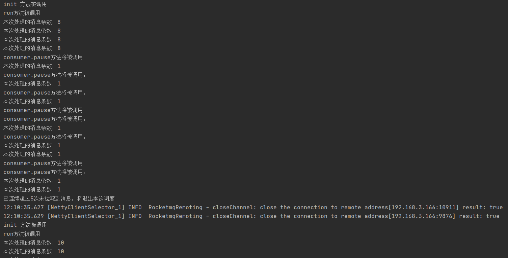

# 12 结合实际场景再聊 DefaultLitePullConsumer 的使用

通过上文的讲解，各位读者朋友们应该对 DefaultLitePullConsumer 有了一个全面的理解，但会不会觉得意犹未尽之感，因为在实战环节只是给出了一个 Demo 级别的示例，本篇将一个大数据领域的消息拉取批处理场景丰富一些 DefaultLitePullConsumer 的使用技巧。

### 场景描述

现在订单系统会将消息发送到 ORDER_TOPIC 中，大数据这边需要将订单数据导入自己的计算平台，对用户、商家的订单行为进行分析。

### PUSH 与 PULL 模式选型

大数据这边只需订阅 ORDER_TOPIC 主题就可以完成数据的同步，那是采用 PUSH 模式还是 PULL 模式呢？

大数据领域通常采用 PULL 模式，因为大数据数据计算都是基于 Spark 等批处理框架，基本都是批处理任务，例如每 5 分钟、每 10 分钟执行一次，而且一个批次能处理的数据越多越好，这样有利于大量数据分布式计算，整体性能计算效能更佳，如果采用 PUSH 模式，虽然也可以指定一次拉取的消息调试，但由于 PUSH 模式是几乎实时的，故每次拉取时服务端几乎不可能挤满了大量的消息，导致一次拉取的消息其实不多，再者是对于一个消费 JVM 来说，面对一个 RocketMQ 集群只会开启一条线程进行消息拉取，而 PULL 模式每一个消费者就可以指定多个消息拉取线程（默认为 20 个），故从消息拉取效能这个方面，PULL 模式占优，并且这个对实时性要求没那么高，故 综合考虑下来，该场景最终采用 PULL 模式。

### 方案设计

大概的实现思路如下图所示：


### 代码实现与代码解读

```
// BigDataPullConsumer.java
package org.apache.rocketmq.example.simple.litepull;
import org.apache.rocketmq.client.consumer.DefaultLitePullConsumer;
import org.apache.rocketmq.client.producer.DefaultMQProducer;
import org.apache.rocketmq.common.consumer.ConsumeFromWhere;
import org.apache.rocketmq.common.message.MessageExt;
import org.apache.rocketmq.common.message.MessageQueue;
import org.apache.rocketmq.common.protocol.heartbeat.MessageModel;
import java.util.HashSet;
import java.util.List;
import java.util.Set;
import java.util.concurrent.*;
import java.util.stream.Collectors;
public class BigDataPullConsumer {
    private final ExecutorService executorService = new ThreadPoolExecutor(30, 30, 0L,
            TimeUnit.SECONDS, new ArrayBlockingQueue<>(10000), new DefaultThreadFactory("business-executer-
                                                                                        "));
    private final ExecutorService pullTaskExecutor = new ThreadPoolExecutor(1, 1, 0L,
            TimeUnit.SECONDS, new ArrayBlockingQueue<>(10), new DefaultThreadFactory("pull-batch-"));
    private String consumerGroup;
    private String nameserverAddr;
    private String topic;
    private String filter;
    private MessageListener messageListener;
    private DefaultMQProducer rertyMQProducer;
    private PullBatchTask pullBatchTask;
    public BigDataPullConsumer(String consumerGroup, String nameserverAddr, String topic, String filter) {
        this.consumerGroup = consumerGroup;
        this.nameserverAddr = nameserverAddr;
        this.topic = topic;
        this.filter = filter;
        initRetryMQProducer();
    }
    private void initRetryMQProducer() {
        this.rertyMQProducer = new DefaultMQProducer(consumerGroup + "-retry");
        this.rertyMQProducer.setNamesrvAddr(this.nameserverAddr);
        try {
            this.rertyMQProducer.start();
        } catch (Throwable e) {
            throw new RuntimeException("启动失败", e);
        }
    }
    public void registerMessageListener(MessageListener messageListener) {
        this.messageListener = messageListener;
    }
    public void start() {
        //没有考虑重复调用问题
        this.pullBatchTask = new PullBatchTask(consumerGroup, nameserverAddr, topic,filter,messageListener);
        pullTaskExecutor.submit(this.pullBatchTask);
    }
    public void stop() {
        while(this.pullBatchTask.isRunning()) {
            try {
                Thread.sleep(1 * 1000);
            } catch (Throwable e) {
                //ignore
            }
        }
        this.pullBatchTask.stop();
        pullTaskExecutor.shutdown();
        executorService.shutdown();
        try {
            //等待重试任务结束
            while(executorService.awaitTermination(5, TimeUnit.SECONDS)) {
                this.rertyMQProducer.shutdown();
                break;
            }
        } catch (Throwable e) {
            //igonre
        }
    }
    /**
     * 任务监听
     */
    static interface MessageListener {
        boolean consumer(List<MessageExt> msgs);
    }
    /**
     * 定时调度任务，例如每 10 分钟会被调度一次
     */
    class PullBatchTask implements Runnable {
        DefaultLitePullConsumer consumer;
        String consumerGroup;
        String nameserverAddr;
        String topic;
        String filter;
        private volatile boolean running = true;
        private MessageListener messageListener;
        public PullBatchTask(String consumerGroup, String nameserverAddr,String topic, String filter, 
                             MessageListener messageListener) {
            this.consumerGroup = consumerGroup;
            this.nameserverAddr = nameserverAddr;
            this.topic = topic;
            this.filter = filter;
            this.messageListener = messageListener;
            init();
        }
        private void init() {
            System.out.println("init 方法被调用");
            consumer = new DefaultLitePullConsumer(this.consumerGroup);
            consumer.setNamesrvAddr(this.nameserverAddr);
            consumer.setAutoCommit(true);
            consumer.setMessageModel(MessageModel.CLUSTERING);
            consumer.setConsumeFromWhere(ConsumeFromWhere.CONSUME_FROM_FIRST_OFFSET);
            try {
                consumer.subscribe(topic, filter);
                consumer.start();
            } catch (Throwable e) {
                e.printStackTrace();
            }
        }
        public void stop() {
            this.running = false;
            this.consumer.shutdown();
        }
        public boolean isRunning() {
            return this.running;
        }
        @Override
        public void run() {
            this.running = true;
            long startTime = System.currentTimeMillis() - 5 * 1000;
            System.out.println("run 方法被调用");
            int notFoundMsgCount = 0;
            while(running) {
                try {
                    // 拉取一批消息
                    List<MessageExt> messageExts = consumer.poll();
                    if(messageExts != null && !messageExts.isEmpty()) {
                        notFoundMsgCount = 0;//查询到数据，重置为 0；
                        // 使用一个业务线程池专门消费消息
                        try {
                            executorService.submit(new ExecuteTask(messageExts, messageListener));
                        } catch (RejectedExecutionException e) { //如果被拒绝，停止拉取，业务代码不去拉取，在
                            // RocketMQ 内部会最终也会触发限流，不会再拉取更多的消息，确保不会触发内存溢出。
                            boolean retry = true;
                            while (retry)
                            try {
                                Thread.sleep(5 * 1000);//简单的限流
                                executorService.submit(new ExecuteTask(messageExts, messageListener));
                                retry = false;
                            } catch (RejectedExecutionException e2) {
                                retry = true;
                            }
                        }
                        MessageExt last = messageExts.get(messageExts.size() - 1);
                        /**
                         * 如果消息处理的时间超过了该任务的启动时间，本次批处理就先结束
                         * 停掉该消费者之前，建议先暂停拉取，这样就不会从 broker 中拉取消息
                         * */
                        if(last.getStoreTimestamp() > startTime) {
                            System.out.println("consumer.pause 方法将被调用。");
                            consumer.pause(buildMessageQueues(last));
                        }
                    } else {
                        notFoundMsgCount ++;
                    }
                    //如果连续出现 5 次未拉取到消息，说明本地缓存的消息全部处理，并且 pull 线程已经停止拉取了,此时可以结束本次消
                    //息拉取，等待下一次调度任务
                    if(notFoundMsgCount > 5) {
                        System.out.println("已连续超过 5 次未拉取到消息，将退出本次调度");
                        break;
                    }
                } catch (Throwable e) {
                    e.printStackTrace();
                }
            }
            this.running = false;
        }
        /**
         * 构建 MessageQueue
         * @param msg
         * @return
         */
        private Set<MessageQueue> buildMessageQueues(MessageExt msg) {
            Set<MessageQueue> queues = new HashSet<>();
            MessageQueue queue = new MessageQueue(msg.getTopic(), msg.getBrokerName(), msg.getQueueId());
            queues.add(queue);
            return queues;
        }
    }
    /**
     * 任务执行
     */
    class ExecuteTask implements Runnable {
        private List<MessageExt> msgs;
        private MessageListener messageListener;
        public ExecuteTask(List<MessageExt> allMsgs, MessageListener messageListener) {
            this.msgs = allMsgs.stream().filter((MessageExt msg) -> msg.getReconsumeTimes() <= 
                                                16).collect(Collectors.toList());
            this.messageListener = messageListener;
        }
        @Override
        public void run() {
            try {
                 this.messageListener.consumer(this.msgs);
            } catch (Throwable e) {
                //消息消费失败，需要触发重试
                //这里可以参考 PUSH 模式，将消息再次发送到服务端。
                try {
                    for(MessageExt msg : this.msgs) {
                        msg.setReconsumeTimes(msg.getReconsumeTimes() + 1);
                        rertyMQProducer.send(msg);
                    }
                } catch (Throwable e2) {
                    e2.printStackTrace();
                    // todo 重试
                }
            }
        }
    }
}
// DefaultThreadFactory.java
package org.apache.rocketmq.example.simple.litepull;
import java.util.concurrent.ThreadFactory;
import java.util.concurrent.atomic.AtomicInteger;
public class DefaultThreadFactory implements ThreadFactory {
    private AtomicInteger num = new AtomicInteger(0);
    private String prefix;
    public DefaultThreadFactory(String prefix) {
        this.prefix = prefix;
    }
    @Override
    public Thread newThread(Runnable r) {
        Thread t = new Thread(r);
        t.setName(prefix + num.incrementAndGet());
        return t;
    }
}
// LitePullMain.java
package org.apache.rocketmq.example.simple.litepull;
import org.apache.rocketmq.common.message.MessageExt;
import java.util.List;
import java.util.concurrent.*;
public class LitePullMain {
    public static void main(String[] args) {
        String consumerGroup = "dw_test_consumer_group";
        String nameserverAddr = "192.168.3.166:9876";
        String topic = "dw_test";
        String filter = "*";
        /** 创建调度任务线程池 */
        ScheduledExecutorService schedule = new ScheduledThreadPoolExecutor(1, new 
                                                 DefaultThreadFactory("main-schdule-"));
        schedule.scheduleWithFixedDelay(new Runnable() {
            @Override
            public void run() {
                BigDataPullConsumer demoMain = new BigDataPullConsumer(consumerGroup, nameserverAddr, topic, 
                                                                       filter);
                demoMain.registerMessageListener(new BigDataPullConsumer.MessageListener() {
                    /**
                     * 业务处理
                     * @param msgs
                     * @return
                     */
                    @Override
                    public boolean consumer(List<MessageExt> msgs) {
                        System.out.println("本次处理的消息条数：" + msgs.size());
                        return true;
                    }
                });
                demoMain.start();
                demoMain.stop();
            }
        }, 1000, 30 * 1000, TimeUnit.MILLISECONDS);
        try {
            CountDownLatch cdh = new CountDownLatch(1);
            cdh.await(10 , TimeUnit.MINUTES);
            schedule.shutdown();
        } catch (Throwable e) {
            //ignore
        }
    }
}
```

程序运行结果如下图所示：



符合预期，可以看到两次调度，并且每一次调度都正常结束。

首先对各个类的职责做一个简单介绍：

- MessageListener：用来定义用户的消息处理逻辑。
- PullBatchTask：使用 RocketMQ Lite Pull 消费者进行消息拉取的核心实现。
- ExecuteTask：业务处理任务，在内部实现调用业务监听器，并执行重试相关的逻辑。
- BigDataPullConsumer：本次业务的具体实现类
- LitePullMain：本次测试主入口类。

接下来对 PullBatchTask、ExecuteTask 的实现思路进行一个简单介绍，从而窥探一下消息 PULL 模式的一些使用要点。

PullBatchTask 的 run 方法主要是使用一个 while 循环，但通常不会用向 PUSH 模式实时监听，而是进行批量处理，即通过定时调度按批次进行处理，故需要有结束本次调度的逻辑，主要是为了提高消息拉取的效率，故本示例采用了本次任务启动只消费本次启动之前发送的消息，后面的新消息等聚集后在另一次调度时再消费，这里为了保证消费者停止时消息消费进度已经被持久化，这里并不会立即结束,而是在没有拉取合适的消息后调用 pause 方法暂停队列的消息，然后再连续多少次后并未拉取到消息后，在调用 DefaultLitePullConsumer 的 shutdown 方法，确保消息进度完整无误的提交到 Broker，从而避免大量消息重复消费。

消息消费端的业务处理这里引入了一个业务线程池，并且如果业务线程池积压，会触发消息拉取端的限流，从而避免内存溢出。

消息消费端在业务处理失败后，需要重试，将消息先发送到 Broker（主要的目的时方便消息消费进度向前推进）。
