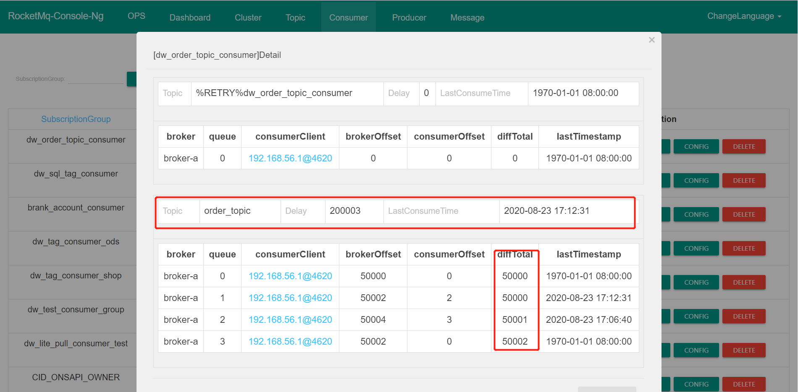
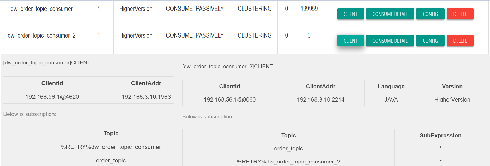
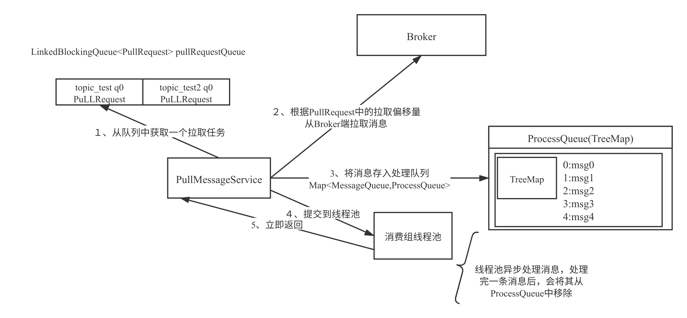
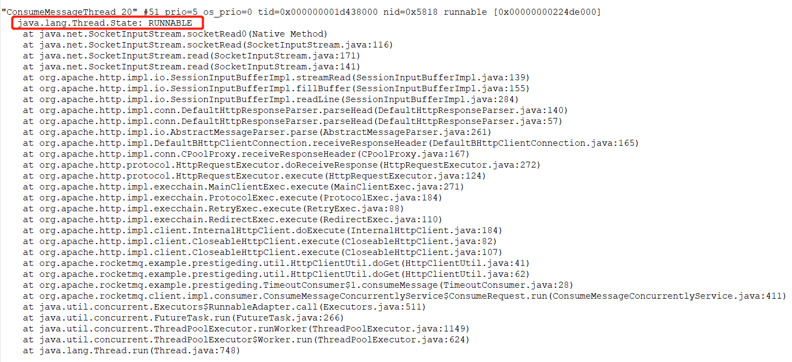
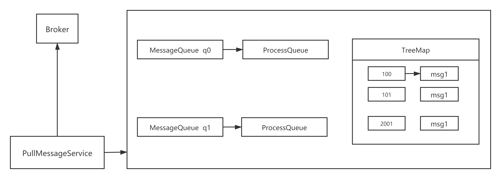
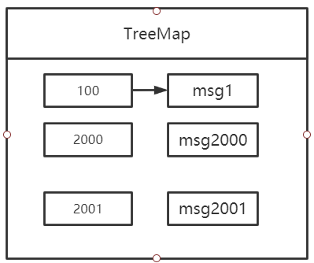

14 消息消费积压问题排查实战
===============

### 问题描述

在 RocketMQ 消息消费方面一个最常见的问题是消息积压，其现象如下图所示：



所谓的消息积压：就是 Broker 端当前队列有效数据最大的偏移量（brokerOffset）与消息消费端的当前处理进度（consumerOffset）之间的差值，即表示当前需要消费但没有消费的消息。

### 问题分析与解决方案

项目组遇到消息积压问题通常第一时间都会怀疑是 RocketMQ Broker 的问题，会第一时间联系到消息中间件的负责，消息中间件负责人当然会首先排查 Broker 端的异常，但根据笔者的境遇，此种情况通常是消费端的问题，反而是消息发送遇到的问题更有可能是 Broker 端的问题，当然笔者也有方法进行举证，服务端的诊断方法稍后会给出，这里基本可以采用类比法，因为一个 Topic 通常会被多个消费端订阅，我们只要看看其他消费组是否也积压，例如如下图所示：



从上图看出，两个不同的消费组订阅了同一个 Topic，一个出现消息积压，一个却消费正常，从这里就可以将分析的重点定位到具体项目组。那如何具体分析这个问题呢？

要能更好的掌握问题分析的切入点，在这里我想再重复介绍一下 RocketMQ 消息拉取模型与消息消费进度提交机制。消息的拉取模型如下图所示：



在 RocketMQ 中每一客户端会单独创建一个线程 PullMessageService 会循环从 Broker 拉取一批消息，然后提交到消费端的线程池中进行消费，线程池中的线程消费完一条消息后会上服务端上报当前消费端的消费进度，而且在提交消费进度时是提交当前处理队列中消息消费偏移量最小的消息作为消费组的进度，即如果消息偏移量为 100 的消息，如果由于某种原因迟迟没有消费成功，那该消费组的进度则无法向前推进，久而久之，Broker 端的消息偏移量就会远远大于消费组当前消费的进度，从而造成消息积压现象。

故遇到这种情况，通常应该去查看消费端线程池中线程的状态，故可以通过如下命令获取应用程序的线程栈。


即可通过 `jps -m` 或者 `ps -ef | grep java` 命令获取当前正在运行的 Java 程序，通过启动主类即可获得应用的进程 id，然后可以通过 `jstack pid > j.log` 命令获取线程的堆栈，在这里我建议大家连续运行 5 次该命令，分别获取 5 个线程堆栈文件，主要用于对比线程的状态是否在向前推进。

通过 jstack 获取堆栈信息后，可以重点搜索 ConsumeMessageThread\_ 开头的线程状态，例如下图所示：



状态为 RUNABLE 的消费端线程正在等待网络读取，我们再去其他文件看该线程的状态，如果其状态一直是 RUNNABLE，表示线程一直在等待网络读取，及线程一直“阻塞”在网络读取上，一旦阻塞，那该线程正在处理的消息就一直处于消费中，消息消费进度就会卡在这里，不会继续向前推进，久而久之，就会出现消息积压情况。

从调用线程栈就可以找到阻塞的具体方法，从这里看出是在调用一个 HTTP 请求，跟踪到代码，截图如下：


定位到代码后再定位问题就比较简单的，通常的网络调用需要设置超时时间，这里由于没有设置超时时间，导致一直在等待对端的返回，从而消息消费进度无法向前推进，解决方案：设置超时时间。

通常会造成线程阻塞的场景如下：

* HTTP 请求未设置超时时间
* 数据库查询慢查询导致查询时间过长，一条消息消费延时过高

### 线程栈分析经验

网上说分析线程栈，一般盯着 WAIT、Block、TIMEOUT\_WAIT 等状态，其实不然，处于 RUNNABLE 状态的线程也不能忽略，因为 MySQL 的读写、HTTP 请求等网络读写，即在等待对端网络的返回数据时线程的状态是 RUNNABLE，并不是所谓的 BLOCK 状态。

如果处于下图所示的线程栈中的线程数量越多，说明消息消费端的处理能力很好，反而是拉取消息的速度跟不上消息消费的速度。


### RocketMQ 消费端限流机制

RocketMQ 消息消费端会从 3 个维度进行限流：

1. 消息消费端队列中积压的消息超过 1000 条
2. 消息处理队列中尽管积压没有超过 1000 条，但最大偏移量与最小偏移量的差值超过 2000
3. 消息处理队列中积压的消息总大小超过 100M

为了方便理解上述三条规则的设计理念，我们首先来看一下消费端的数据结构，如下图所示：



PullMessageService 线程会按照队列向 Broker 拉取一批消息，然后会存入到 ProcessQueue 队列中，即所谓的处理队列，然后再提交到消费端线程池中进行消息消费，消息消费完成后会将对应的消息从 ProcessQueue 中移除，然后向 Broker 端提交消费进度，提交的消费偏移量为 ProceeQueue 中的最小偏移量。

**规则一：消息消费端队列中积压的消息超过 1000 条值的就是 ProcessQueue 中存在的消息条数超过指定值 **，默认为 1000 条，就触发限流，限流的具体做法就是暂停向 Broker 拉取该队列中的消息，但并不会阻止其他队列的消息拉取。例如如果 q0 中积压的消息超过 1000 条，但 q1 中积压的消息不足 1000，那 q1 队列中的消息会继续消费。其目的就是担心积压的消息太多，如果再继续拉取，会造成内存溢出。** 规则二：消息在 ProcessQueue 中实际上维护的是一个 TreeMap**，key 为消息的偏移量、vlaue 为消息对象，由于 TreeMap 本身是排序的，故很容易得出最大偏移量与最小偏移量的差值，即有可能存在处理队列中其实就只有 3 条消息，但偏移量确超过了 2000，例如如下图所示：



出现这种情况也是非常有可能的，其主要原因就是消费偏移量为 100 的这个线程由于某种情况卡主了（“阻塞”了），其他消息却能正常消费，这种情况虽然不会造成内存溢出，但大概率会造成大量消息重复消费，究其原因与消息消费进度的提交机制有关，在 RocketMQ 中，例如消息偏移量为 2001 的消息消费成功后，向服务端汇报消费进度时并不是报告 2001，而是取处理队列中最小偏移量 100，这样虽然消息一直在处理，但消息消费进度始终无法向前推进，试想一下如果此时最大的消息偏移量为 1000，项目组发现出现了消息积压，然后重启消费端，那消息就会从 100 开始重新消费，会造成大量消息重复消费，RocketMQ 为了避免出现大量消息重复消费，故对此种情况会对其进行限制，超过 2000 就不再拉取消息了。**规则三：消息处理队列中积压的消息总大小超过 100M。**

这个就更加直接了，不仅从消息数量考虑，再结合从消息体大小考虑，处理队列中消息总大小超过 100M 进行限流，这个显而易见就是为了避免内存溢出。

在了解了 RocketMQ 消息限流规则后，会在 rocketmq\_client.log 中输出相关的限流日志，具体搜索“so do flow control”，详细如下图所示：


### RocketMQ 服务端性能自查技巧

那如何证明 RocketMQ 集群本身没有问题呢？其实也很简单，我们通常一个常用的技巧是查看 RocketMQ 消息写入的性能，执行如下命令：

```
cd ~/logs/rocketmqlogs/

grep 'PAGECACHERT' store.log  | more


```

其输出的结果如下图所示：


在 RocketMQ Broker 中会每隔 1 分钟打印出上一分钟消息写入的耗时分布，例如 \[<=0ms\] 表示在这一秒钟写入消息在 Broker 端的延时小鱼 0ms 的消息条数，其他的依次类推，通常在 100~200ms 在上万次消息发送中也不会出现 1 次。从这里基本能看出 Broker 端写入的压力。

### 小结

本节首先从消息积压的现象说起，然后分析问题、解决问题，最后再加以一些原理上的补充，尽量避免知其然而不知其所以然。
