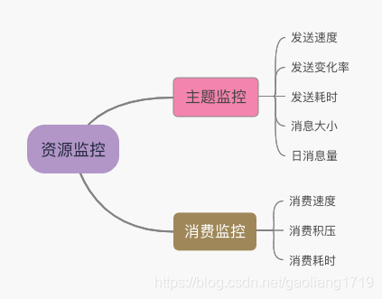
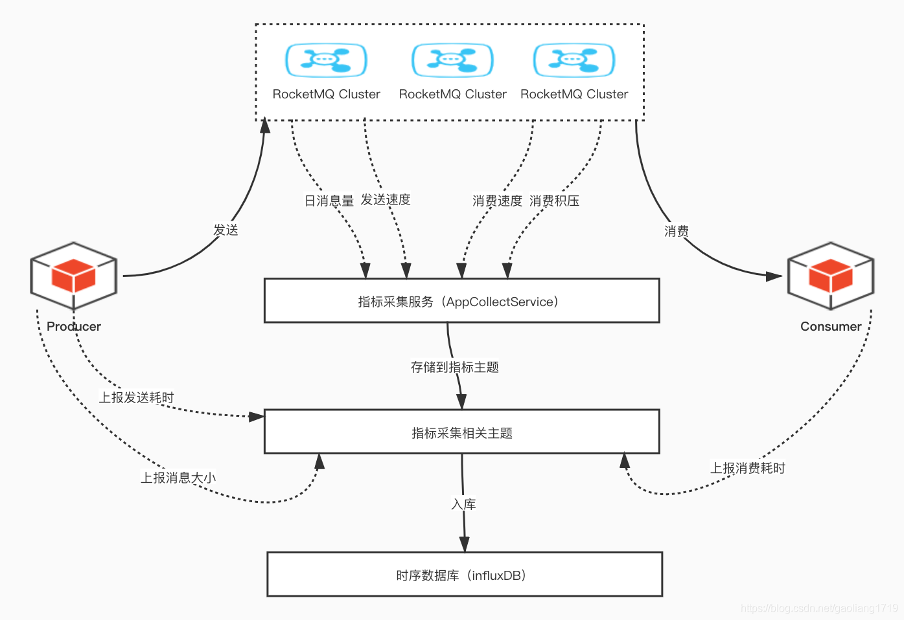

# 20 RocketMQ 集群监控（二）

### 前言

主题和消费组通常使用方比较关心的资源，发送方关注主题，消费方关注消费组。管理员更侧重关注集群的健康状况。本文介绍主题和消费组的监控实战，包括监控项的设计、及每个监控项的代码实现。

### 监控项设计

我们先把主题监控和消费监控统称为资源监控，下图分列了主题和消费组包含的监控项。



#### **主题监控 **从发送速度、发送耗时、消息大小、日消息量方面整理主题监控项，下面分别介绍这些监控项的重要性。** 发送速度 **通过实时采集主题的发送速度，来掌握主题的流量情况。例如：有些业务场景不允许主题的发送速度掉为 0，那通过实时采集发送速度指标，为将来告警做准备。** 发送变化率 **发送变化率是指，特定时间内主题的发送速度变化了多少。例如：5 分钟内发送速率陡增了 2 倍。通常用于两方面，一个是保护集群，某个 Topic 过高的瞬时流量可能对集群安全造成影响。例如：一个发送速率为 5000 的主题，在 3 分钟内陡增了 5 倍，到了 25000 的高度，这种流量对集群存在安全隐患。另一个是使用角度检测业务是否正常，比如一个发送速率为 8000 的主题，在 3 分钟内掉为 80，类似这种断崖式下跌是否是业务正常逻辑，可以对业务健康情况反向检测。** 发送耗时 **通过采集发送消息的耗时分布情况，了解客户端的发送情况，耗时分布可以为下面区间，单位毫秒。\[0, 1), \[1, 5), \[5, 10), \[10, 50), \[50, 100), \[100, 500), \[500, 1000), \[1000, ∞)。例如：如果发送的消息耗时分布集中在大于 500ms~1000ms，那需要介入分析原因为何耗时如此长。** 消息大小 **通过采集消息大小的分布情况，了解那些客户端存在大消息。发送速率过高的大消息同样存在集群的安全隐患。比如那些主题发送的消息大于 5K，为日后需要专项治理或者实时告警提供数据支撑。消息大小分布区间如下参考，单位 KB。\[0, 1), \[1, 5), \[5, 10), \[10, 50), \[50, 100), \[500, 1000), \[1000, ∞)。** 日消息量**日消息量是指通过每天采集的发送的消息数量，形成时间曲线。可以分析一周、一月的消息总量变化情况

#### **消费监控 **** 消费速度 **通过实时采集消费速度指标，掌握消费组健康情况。同样有些场景对消费速度大小比较关心。通过采集实时消息消费速率情况，为告警提供数据支撑。** 消费积压 **消费积压是指某一时刻还有多少消息没有消费，消费积压 = 发送消息总量 - 消费消息总量。消息积压是消费组监控指标中最重要的一项，有一些准实时场景对积压有着严苛的要求，那对消费积压指标的采集和告警就尤为重要。** 消费耗时**消费耗时是从客户端采集的指标，通过采集客户端消费耗时分布情况检测客户端消费情况。通过消费耗时可以观察到客户端是否有阻塞情况、以及协助使用同学排查定位问题

### 监控开发实战

在上面梳理的主题监控和消费监控的指标中，有些指标需要从 RocketMQ 集群采集，例如：发送速度、日消息量、消费速度、消费积压。有些指标需要客户端上报，例如：发送耗时、发送消息体大小、消费耗时。



#### **实战部分说明**下面代码中用到的定时任务调度、getMqAdmin 等工具类见 《RocketMQ 集群监控（一）》，关于调度采集频率，可以选择 1 秒或者 5 秒均可

上图中的“指标采集相关主题”，考虑到有的公司可能几千上万的应用，可以采用 Kafka 来做。

下面实战中主要关注 RocketMQ 相关指标如何收集，上报到 Kafka 的指标主题以及存储时序数据库代码没有给出，这部分逻辑一个是发送，一个插入数据库，并不复杂，自行完善即可。

实践中建议提供 SDK 来封装发送和消费，同时将监控指标的采集也封装进去，这样对用户来说是无感知的。

#### **收集主题发送速度**

先获取了集群中的主题列表，然后统计每个主题在每个 Master 中的速率。最后将统计的结果上报到统计主题或者直接写入时序数据库。

另外，统计时将 MQ 内置一些主题过滤掉无需统计。例如：重试队列（%RETRY%）、死信队列（%DLQ%）。

```
public void collectTopicTps() throws Exception {
    DefaultMQAdminExt mqAdmin = getMqAdmin();
    Set<String> topicList = mqAdmin.fetchTopicsByCLuster("demo_mq").getTopicList();
    ClusterInfo clusterInfo = mqAdmin.examineBrokerClusterInfo();
    Map<String/*主题名称*/, Double/*Tps*/> topicTps = Maps.newHashMap();
    // 统计主题在每个 Master 上的速度
    for (Map.Entry<String, BrokerData> stringBrokerDataEntry : clusterInfo.getBrokerAddrTable().entrySet()) {
        BrokerData brokerData = stringBrokerDataEntry.getValue();
        // 获取 Master 节点
        String brokerAddr = brokerData.getBrokerAddrs().get(MixAll.MASTER_ID);
        for (String topic : topicList) {
            try {
                //注意此处将%DLQ%、%RETRY%等 MQ 内置主题过滤掉
                if(topic.contains("%DLQ%")|| topic.contains("%RETRY%")){
                    continue;
                }
                BrokerStatsData topicPutNums = mqAdmin.viewBrokerStatsData(brokerAddr, BrokerStatsManager.TOPIC_PUT_NUMS, topic);
                double topicTpsOnBroker = topicPutNums.getStatsMinute().getTps();
                if(topicTps.containsKey(topic)){
                    topicTps.put(topic, topicTps.get(topic) + topicTpsOnBroker);
                }else{
                    topicTps.put(topic,topicTpsOnBroker);
                }
            } catch (MQClientException ex) {
                ex.printStackTrace();
            }
        }
    }
    // 将采集到的主题速度，topicTps 上报到主题或者直接写入时序数据库即可
}
```

#### **收集主题日消息量**

日消息量的采集方式与主题发送速度的采集方式类似。由于是日消息量，采集频率可以一天执行一次。

```
public void collectTopicMsgNums() throws Exception {
    DefaultMQAdminExt mqAdmin = getMqAdmin();
    Set<String> topicList = mqAdmin.fetchTopicsByCLuster("demo_mq").getTopicList();
    ClusterInfo clusterInfo = mqAdmin.examineBrokerClusterInfo();
    Map<String/*主题名称*/, Long/*日消息量*/> topicMsgNum = Maps.newHashMap();
    // 统计主题在每个 Master 上日消息量
    for (Map.Entry<String, BrokerData> stringBrokerDataEntry : clusterInfo.getBrokerAddrTable().entrySet()) {
        BrokerData brokerData = stringBrokerDataEntry.getValue();
        // 获取 Master 节点
        String brokerAddr = brokerData.getBrokerAddrs().get(MixAll.MASTER_ID);
        for (String topic : topicList) {
            try {
                //注意此处将%DLQ%、%RETRY%等 MQ 内置主题过滤掉
                if(topic.contains("%DLQ%")|| topic.contains("%RETRY%")){
                    continue;
                }
                BrokerStatsData topicPutNums = mqAdmin.viewBrokerStatsData(brokerAddr, BrokerStatsManager.TOPIC_PUT_NUMS, topic);
                long topicMsgNumOnBroker = topicPutNums.getStatsDay().getSum();
                if(topicMsgNum.containsKey(topic)){
                    topicMsgNum.put(topic, topicMsgNum.get(topic) + topicMsgNumOnBroker);
                }else{
                    topicMsgNum.put(topic,topicMsgNumOnBroker);
                }
            } catch (MQClientException ex) {
                // ex.printStackTrace();
            }
        }
    }
    // 将采集到的主题日消息量，topicMsgNum 上报到指标主题或者直接写入时序数据库即可
}
```

#### **收集消费速度**

下面代码循环集群中每个 Broker，汇总每个 Broker 中每个 messageQueue 的消费速度。代码 consumerTps 即包含了消费组与其对应的消费速度。

```
public void collectConsumerTps() throws Exception {
    DefaultMQAdminExt mqAdmin = getMqAdmin();
    ClusterInfo clusterInfo = mqAdmin.examineBrokerClusterInfo();
    Map<String/*消费者名称*/, Double/*消费 Tps*/> consumerTps = Maps.newHashMap();
    // 统计主题在每个 Master 上的消费速率
    for (Map.Entry<String, BrokerData> stringBrokerDataEntry : clusterInfo.getBrokerAddrTable().entrySet()) {
        BrokerData brokerData = stringBrokerDataEntry.getValue();
        // 获取 Master 节点
        String brokerAddr = brokerData.getBrokerAddrs().get(MixAll.MASTER_ID);
        ConsumeStatsList consumeStatsList = mqAdmin.fetchConsumeStatsInBroker(brokerAddr, false, 5000);
        for (Map<String, List<ConsumeStats>> consumerStats : consumeStatsList.getConsumeStatsList()) {
            for (Map.Entry<String, List<ConsumeStats>> stringListEntry : consumerStats.entrySet()) {
                String consumer = stringListEntry.getKey();
                List<ConsumeStats> consumeStats = stringListEntry.getValue();
                Double tps = 0d;
                for (ConsumeStats consumeStat : consumeStats) {
                    tps += consumeStat.getConsumeTps();
                }
                if(consumerTps.containsKey(consumer)){
                    consumerTps.put(consumer, consumerTps.get(consumer) + tps);
                }else{
                    consumerTps.put(consumer,tps);
                }
            }
        }
    }
    // 将采集到的消费速率，consumerTps 上报到指标主题或者直接写入时序数据库即可
}
```

#### **收集消费积压**

消费组的积压统计，需要计算各个消费队列的积压，并将积压求和汇总。

```
public void collectConsumerLag() throws Exception {
    DefaultMQAdminExt mqAdmin = getMqAdmin();
    ClusterInfo clusterInfo = mqAdmin.examineBrokerClusterInfo();
    Map<String/*消费者名称*/, Long/*消费积压*/> consumerLags = Maps.newHashMap();
    // 统计主题在每个 Master 上的消费积压
    for (Map.Entry<String, BrokerData> stringBrokerDataEntry : clusterInfo.getBrokerAddrTable().entrySet()) {
        BrokerData brokerData = stringBrokerDataEntry.getValue();
        // 获取 Master 节点
        String brokerAddr = brokerData.getBrokerAddrs().get(MixAll.MASTER_ID);
        ConsumeStatsList consumeStatsList = mqAdmin.fetchConsumeStatsInBroker(brokerAddr, false, 5000);
        for (Map<String, List<ConsumeStats>> consumerStats : consumeStatsList.getConsumeStatsList()) {
            for (Map.Entry<String, List<ConsumeStats>> stringListEntry : consumerStats.entrySet()) {
                String consumer = stringListEntry.getKey();
                List<ConsumeStats> consumeStats = stringListEntry.getValue();
                Long lag = 0L;
                for (ConsumeStats consumeStat : consumeStats) {
                    lag += computeTotalDiff(consumeStat.getOffsetTable());
                }
                if(consumerLags.containsKey(consumer)){
                    consumerLags.put(consumer, consumerLags.get(consumer) + lag);
                }else{
                    consumerLags.put(consumer,lag);
                }
            }
        }
    }
    // 将采集到的消费积压，consumerLags 上报到指标主题或者直接写入时序数据库即可
}
public long computeTotalDiff(HashMap<MessageQueue, OffsetWrapper> offsetTable) {
    long diffTotal = 0L;
    long diff = 0l;
    for(Iterator it = offsetTable.entrySet().iterator(); it.hasNext(); diffTotal += diff) {
        Map.Entry<MessageQueue, OffsetWrapper> next = (Map.Entry)it.next();
        long consumerOffset = next.getValue().getConsumerOffset();
        if(consumerOffset > 0){
            diff = ((OffsetWrapper)next.getValue()).getBrokerOffset() - consumerOffset;
        }
    }
    return diffTotal;
}
```

#### **收集发送耗时及消息大小**

DistributionMetric 提供了两个方法，分别用于统计消息大小和发送耗时。耗时分布区间为：\[0, 1), \[1, 5), \[5, 10), \[10, 50), \[50, 100), \[100, 500), \[500, 1000), \[1000, ∞)，单位毫秒。消息大小分布区为：\[0, 1), \[1, 5), \[5, 10), \[10, 50), \[50, 100), \[500, 1000), \[1000, ∞)，单位 KB。

```
public class DistributionMetric {
    private String name;
    private LongAdder lessThan1Ms = new LongAdder();
    private LongAdder lessThan5Ms = new LongAdder();
    private LongAdder lessThan10Ms = new LongAdder();
    private LongAdder lessThan50Ms = new LongAdder();
    private LongAdder lessThan100Ms = new LongAdder();
    private LongAdder lessThan500Ms = new LongAdder();
    private LongAdder lessThan1000Ms = new LongAdder();
    private LongAdder moreThan1000Ms = new LongAdder();
    private LongAdder lessThan1KB = new LongAdder();
    private LongAdder lessThan5KB = new LongAdder();
    private LongAdder lessThan10KB = new LongAdder();
    private LongAdder lessThan50KB = new LongAdder();
    private LongAdder lessThan100KB = new LongAdder();
    private LongAdder lessThan500KB = new LongAdder();
    private LongAdder lessThan1000KB = new LongAdder();
    private LongAdder moreThan1000KB = new LongAdder();
    public static DistributionMetric newDistributionMetric(String name) {
        DistributionMetric distributionMetric = new DistributionMetric();
        distributionMetric.setName(name);
        return distributionMetric;
    }
    public void markTime(long costInMs) {
        if (costInMs < 1) {
            lessThan1Ms.increment();
        } else if (costInMs < 5) {
            lessThan5Ms.increment();
        } else if (costInMs < 10) {
            lessThan10Ms.increment();
        } else if (costInMs < 50) {
            lessThan50Ms.increment();
        } else if (costInMs < 100) {
            lessThan100Ms.increment();
        } else if (costInMs < 500) {
            lessThan500Ms.increment();
        } else if (costInMs < 1000) {
            lessThan1000Ms.increment();
        } else {
            moreThan1000Ms.increment();
        }
    }
    public void markSize(long costInMs) {
        if (costInMs < 1024) {
            lessThan1KB.increment();
        } else if (costInMs < 5 * 1024) {
            lessThan5KB.increment();
        } else if (costInMs < 10 * 1024) {
            lessThan10KB.increment();
        } else if (costInMs < 50 * 1024) {
            lessThan50KB.increment();
        } else if (costInMs < 100 * 1024) {
            lessThan100KB.increment();
        } else if (costInMs < 500 * 1024) {
            lessThan500KB.increment();
        } else if (costInMs < 1024 * 1024) {
            lessThan1000KB.increment();
        } else {
            moreThan1000KB.increment();
        }
    }
    public String getName() {
        return name;
    }
    public void setName(String name) {
        this.name = name;
    }
}
public class MetricInfo {
    private String name;
    private long lessThan1Ms;
    private long lessThan5Ms;
    private long lessThan10Ms;
    private long lessThan50Ms;
    private long lessThan100Ms;
    private long lessThan500Ms;
    private long lessThan1000Ms;
    private long moreThan1000Ms;
    private long lessThan1KB;
    private long lessThan5KB;
    private long lessThan10KB;
    private long lessThan50KB;
    private long lessThan100KB;
    private long lessThan500KB;
    private long lessThan1000KB;
    private long moreThan1000KB;
    public String getName() {
        return name;
    }
    public void setName(String name) {
        this.name = name;
    }
    public long getLessThan1Ms() {
        return lessThan1Ms;
    }
    public void setLessThan1Ms(long lessThan1Ms) {
        this.lessThan1Ms = lessThan1Ms;
    }
    public long getLessThan5Ms() {
        return lessThan5Ms;
    }
    public void setLessThan5Ms(long lessThan5Ms) {
        this.lessThan5Ms = lessThan5Ms;
    }
    public long getLessThan10Ms() {
        return lessThan10Ms;
    }
    public void setLessThan10Ms(long lessThan10Ms) {
        this.lessThan10Ms = lessThan10Ms;
    }
    public long getLessThan50Ms() {
        return lessThan50Ms;
    }
    public void setLessThan50Ms(long lessThan50Ms) {
        this.lessThan50Ms = lessThan50Ms;
    }
    public long getLessThan100Ms() {
        return lessThan100Ms;
    }
    public void setLessThan100Ms(long lessThan100Ms) {
        this.lessThan100Ms = lessThan100Ms;
    }
    public long getLessThan500Ms() {
        return lessThan500Ms;
    }
    public void setLessThan500Ms(long lessThan500Ms) {
        this.lessThan500Ms = lessThan500Ms;
    }
    public long getLessThan1000Ms() {
        return lessThan1000Ms;
    }
    public void setLessThan1000Ms(long lessThan1000Ms) {
        this.lessThan1000Ms = lessThan1000Ms;
    }
    public long getMoreThan1000Ms() {
        return moreThan1000Ms;
    }
    public void setMoreThan1000Ms(long moreThan1000Ms) {
        this.moreThan1000Ms = moreThan1000Ms;
    }
    public long getLessThan1KB() {
        return lessThan1KB;
    }
    public void setLessThan1KB(long lessThan1KB) {
        this.lessThan1KB = lessThan1KB;
    }
    public long getLessThan5KB() {
        return lessThan5KB;
    }
    public void setLessThan5KB(long lessThan5KB) {
        this.lessThan5KB = lessThan5KB;
    }
    public long getLessThan10KB() {
        return lessThan10KB;
    }
    public void setLessThan10KB(long lessThan10KB) {
        this.lessThan10KB = lessThan10KB;
    }
    public long getLessThan50KB() {
        return lessThan50KB;
    }
    public void setLessThan50KB(long lessThan50KB) {
        this.lessThan50KB = lessThan50KB;
    }
    public long getLessThan100KB() {
        return lessThan100KB;
    }
    public void setLessThan100KB(long lessThan100KB) {
        this.lessThan100KB = lessThan100KB;
    }
    public long getLessThan500KB() {
        return lessThan500KB;
    }
    public void setLessThan500KB(long lessThan500KB) {
        this.lessThan500KB = lessThan500KB;
    }
    public long getLessThan1000KB() {
        return lessThan1000KB;
    }
    public void setLessThan1000KB(long lessThan1000KB) {
        this.lessThan1000KB = lessThan1000KB;
    }
    public long getMoreThan1000KB() {
        return moreThan1000KB;
    }
    public void setMoreThan1000KB(long moreThan1000KB) {
        this.moreThan1000KB = moreThan1000KB;
    }
}
```

ClientMetricCollect 类模拟发送时对消息发送的耗时与消息大小统计。通过定时任务调度 recordMetricInfo() 方法，将采集到数据上报到特定主题并存入时序数据库。即完成了发送耗时及消息大小的采集。

```
public class ClientMetricCollect {
    public Map<String, DefaultMQProducer> producerMap = Maps.newHashMap();
    private DistributionMetric distributionMetric;
    public DefaultMQProducer getTopicProducer(String topic) throws MQClientException {
        if (!producerMap.containsKey(topic)){
            DefaultMQProducer producer = new DefaultMQProducer("ProducerGroup".concat("_").concat(topic));
            producer.setNamesrvAddr("dev-mq3.ttbike.com.cn:9876");
            producer.setVipChannelEnabled(false);
            producer.setClientIP("mq producer-client-id-1");
            try {
                producer.start();
                this.distributionMetric = DistributionMetric.newDistributionMetric(topic);
                producerMap.put(topic,producer);
            } catch (MQClientException e) {
                throw e;
            }
        }
        return producerMap.get(topic);
    }
    public void send( Message message) throws Exception {
        long begin = System.currentTimeMillis();
        SendResult sendResult = null;
        sendResult = getTopicProducer(message.getTopic()).send(message);
        SendStatus sendStatus = sendResult.getSendStatus();
        if (sendStatus.equals(SendStatus.SEND_OK)) {
            long duration = System.currentTimeMillis() - begin;
            distributionMetric.markTime(duration);
            distributionMetric.markSize(message.getBody().length);
        }
    }
    public void recordMetricInfo(){
        MetricInfo metricInfo = new MetricInfo();
        metricInfo.setName(distributionMetric.getName());
        metricInfo.setLessThan1Ms(distributionMetric.getLessThan1Ms().longValue());
        metricInfo.setLessThan5Ms(distributionMetric.getLessThan5Ms().longValue());
        metricInfo.setLessThan10Ms(distributionMetric.getLessThan10Ms().longValue());
        metricInfo.setLessThan50Ms(distributionMetric.getLessThan50Ms().longValue());
        metricInfo.setLessThan100Ms(distributionMetric.getLessThan100Ms().longValue());
        metricInfo.setLessThan500Ms(distributionMetric.getLessThan500Ms().longValue());
        metricInfo.setLessThan1000Ms(distributionMetric.getLessThan1000Ms().longValue());
        metricInfo.setMoreThan1000Ms(distributionMetric.getMoreThan1000Ms().longValue());
        metricInfo.setLessThan1KB(distributionMetric.getLessThan1KB().longValue());
        metricInfo.setLessThan5KB(distributionMetric.getLessThan5KB().longValue());
        metricInfo.setLessThan10KB(distributionMetric.getLessThan10KB().longValue());
        metricInfo.setLessThan50KB(distributionMetric.getLessThan50KB().longValue());
        metricInfo.setLessThan100KB(distributionMetric.getLessThan100KB().longValue());
        metricInfo.setLessThan500KB(distributionMetric.getLessThan500KB().longValue());
        metricInfo.setLessThan1000KB(distributionMetric.getLessThan1000KB().longValue());
        metricInfo.setMoreThan1000KB(distributionMetric.getMoreThan1000KB().longValue());
        // 将采集到的发送耗时与消息大小分布，metricInfo 上报到主题或者直接写入时序数据库即可
        // System.out.println(JSON.toJSONString(metricInfo));
    }
    @Test
    public void test() throws Exception {
        for(int i=0; i<100; i++){
            byte[] TEST_MSG = "helloworld".getBytes();
            Message message = new Message("melon_online_test", TEST_MSG);
            send(message);
        }
    }
}
```

#### **上报消费耗时**

接着使用上面的公共类 DistributionMetric 的 markTime 来记录耗时情况，可以度量业务处理消息的耗时分布。耗时分布区间为：\[0, 1), \[1, 5), \[5, 10), \[10, 50), \[50, 100), \[100, 500), \[500, 1000), \[1000, ∞)，单位毫秒。

```
public class ConsumerMetric {
    private DistributionMetric distributionMetric;
    public static void main(String[] args) throws Exception {
        String consumerName = "demo_consumer";
        ConsumerMetric consumerMetric = new ConsumerMetric();
        consumerMetric.startConsume(consumerName);
    }
    public void startConsume(String consumerName) throws Exception{
        this.distributionMetric = DistributionMetric.newDistributionMetric(consumerName);
        DefaultMQPushConsumer consumer = new DefaultMQPushConsumer(consumerName);
        consumer.setNamesrvAddr("dev-mq3.ttbike.com.cn:9876");
        consumer.subscribe("melon_online_test", "*");
        consumer.setConsumeFromWhere(ConsumeFromWhere.CONSUME_FROM_FIRST_OFFSET);
        //wrong time format 2017_0422_221800
        consumer.setConsumeTimestamp("20181109221800");
        consumer.registerMessageListener(new MessageListenerConcurrently() {
            @Override
            public ConsumeConcurrentlyStatus consumeMessage(List<MessageExt> msgs, ConsumeConcurrentlyContext context) {
                long begin = System.currentTimeMillis();
                // 处理业务逻辑
                System.out.printf("%s Receive New Messages: %s %n", Thread.currentThread().getName(), msgs);
                // 统计业务逻辑的消费耗时情况
                distributionMetric.markTime(System.currentTimeMillis() - begin);
                return ConsumeConcurrentlyStatus.CONSUME_SUCCESS;
            }
        });
        consumer.start();
        System.out.printf("Consumer Started.%n");
    }
    public void recordMetricInfo(){
        MetricInfo metricInfo = new MetricInfo();
        metricInfo.setName(distributionMetric.getName());
        metricInfo.setLessThan1Ms(distributionMetric.getLessThan1Ms().longValue());
        metricInfo.setLessThan5Ms(distributionMetric.getLessThan5Ms().longValue());
        metricInfo.setLessThan10Ms(distributionMetric.getLessThan10Ms().longValue());
        metricInfo.setLessThan50Ms(distributionMetric.getLessThan50Ms().longValue());
        metricInfo.setLessThan100Ms(distributionMetric.getLessThan100Ms().longValue());
        metricInfo.setLessThan500Ms(distributionMetric.getLessThan500Ms().longValue());
        metricInfo.setLessThan1000Ms(distributionMetric.getLessThan1000Ms().longValue());
        metricInfo.setMoreThan1000Ms(distributionMetric.getMoreThan1000Ms().longValue());
        // 将采集到的发送耗时与消息大小分布，metricInfo 上报到主题或者直接写入时序数据库即可
        // System.out.println(JSON.toJSONString(metricInfo));
    }
}
```

#### 发送变化率计算

发送变化率的计算依托时序数据库的函数，发送 Tps 变化率 =(最大值 - 最小值)/中位数。下图示例中，5 分钟的 TPS 变化率为 3%。可以定时调度计算该指标，超过阈值（例如：100%）可以发送告警信息。

```
> select SPREAD(value)/MEDIAN(value) from mq_topic_info where clusterName='demo_mq' and topicName='max_bonus_send_topic' and "name"='tps' and "time" > now()-5m ;
name: mq_topic_info
time                spread_median
----                -------------
1598796048448226482 0.03338460146566541
```
